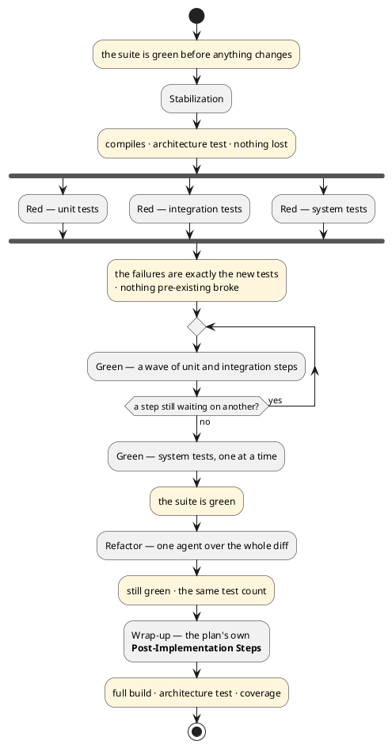
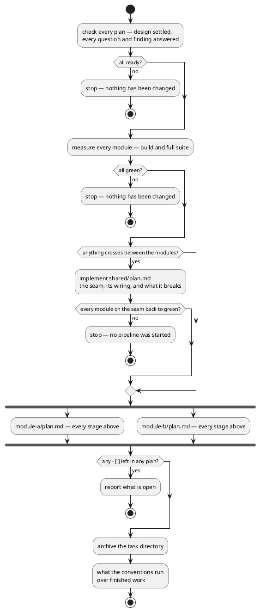
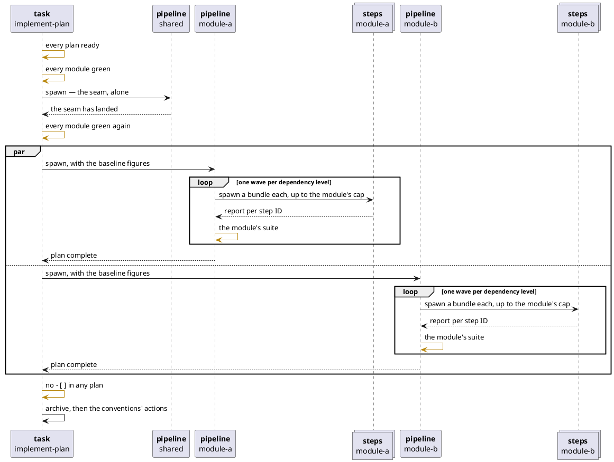

# What this framework is for

The intent behind the skills in this directory. [`README.md`](README.md) states what keeps them portable; this
file states what they are trying to achieve, so a session picking them up does not have to re-derive it.

## The one split

**The skills are the framework. The conventions are the project.**

A skill states what it needs to know — the build command, the test-type mapping, the diagram language, the models, the
commit policy. It never states the answer. Every answer lives in the repository's own conventions, at the
repository tier or the module tier, and is written by `init-conventions` from what the repository already does.
The one location a skill assumes is the index `init-conventions` writes: `docs/conventions.md` at the root and
`<module>/docs/conventions.md` per module. What each index links to, and where, is the repository's business.

That is what makes `skills/`, `agents/`, `scripts/` and `templates/` liftable into another repository as a
plugin. A fact about *this* project inside a skill is the defect this split exists to prevent.

## The four lines

Every change a developer makes is one of four kinds of work, and each kind has its own line of skills.

| Line         | For                                                    | Skills                                                               | Safety net                                           | Readers            |
|--------------|--------------------------------------------------------|----------------------------------------------------------------------|------------------------------------------------------|--------------------|
| Feature      | behaviour nobody promised yet                          | `design-task` → `plan-task` → `implement-plan` → `archive-knowledge` | a red test per scenario, then green                  | person, then model |
| Rework       | code that keeps doing what it does                     | `rework`                                                             | the suite already green, kept green after every step | one                |
| Bug          | behaviour the repository promises and does not deliver | `fix-bug`                                                            | one `red` test that failed on the symptom            | one                |
| Dependencies | the versions a module depends on                       | `upgrade-deps`                                                       | the suite already green, kept green after every step | one                |

Outside every line: `init-conventions` writes what is true about the repository before any change; `retro`
reflects on a finished session and proposes changes to the skills; `tighten` shortens a file without changing
what it says; `teachme` teaches a subject a decision depends on.

**Each line's output is the whole handoff.** The next phase starts in a fresh context and reads the file, not
the conversation. A design a cold session cannot plan from was underspecified; a plan a cold agent cannot
implement was underspecified. Discovering that is the point of the split, not a cost of it.

### The feature line

Five skills carry one change from "someone asked for it" to "implemented and documented".

| Phase       | Skill               | Reader        | Decides                                                | Never decides                       |
|-------------|---------------------|---------------|--------------------------------------------------------|-------------------------------------|
| Conventions | `init-conventions`  | the developer | what is true about this repository                     | anything about a change             |
| Design      | `design-task`       | the developer | what the change does, and what it does when it fails   | how it is built, or in what order   |
| Plan        | `plan-task`         | the agent     | which classes, which tests, in which order             | what the change does                |
| Implement   | `implement-plan`    | nobody        | nothing — it executes the plan and verifies each stage | anything the plan left open         |
| Archive     | `archive-knowledge` | the developer | what outlives the plan                                 | anything the implementation settled |

**It is a pipeline because it has two readers.** A person approves what the change does; a model executes how
it is built. The handoff between them is the design file.

### The rework line

- **One skill, because it has one reader.** A rework changes no behaviour, so there is nothing for a person to
  approve beyond the shape, and a design–plan handoff would carry an empty file.
- **The suite already green is the safety net.** Every guardrail the skill has exists to keep that green honest.
- **Parallel by module**: one `rework-module` agent per module's steps file, after any shared `stabilize` steps
  have landed alone.

### The bug line

- **Three kinds of step and no others**: `stabilize` moves whatever has to exist first, `red` is one test that
  reproduces the bug, `green` is the code that makes it pass.
- **The red/green pair is compulsory.** A bug closed without a test that first failed on its symptom is a bug
  closed on someone's word; `fix.sh` refuses a `green` step that names no `red` one.
- **Files split the way a task's plans do**: `bug.md` holds the symptom, the reproduction and the diagnosis;
  one `fix.md` per module holds that module's steps; `shared/fix.md` holds the seam's `stabilize` steps, landed
  alone before any module agent starts.
- **What is new is the attempt log.** Every approach that failed goes into `## Attempts` the moment it fails,
  with the output that killed it and what it rules out. Debugging is the one phase where most work produces no
  diff, so a run stopped halfway otherwise leaves nothing.
- **`bug.md` is the handoff.** Its `**Attempts:**` header line names every entry in every file. A session given
  that path reads one file, skips everything `ruled-out:`, and looks for a new hypothesis. A fix is resumed by
  that path, never by scanning `docs/` for something unfinished.

### The dependencies line

- **Libraries and nothing else.** The runtime, the build tool and the base image are not its scope.
- **Two kinds of step**: `bump`, a version line and nothing more; `migrate`, the version plus every change the
  release's own guide asks for.
- **The same safety net as a rework**: the suite green before, and green after every step.
- **What is new is `## Kept back`.** A guide can ask for a class that carries a bug, or an API the module's
  other dependencies still bind. Forcing it ships a worse module than staying on the old call under the new
  version. A change that fails three attempts is undone alone, the version stays where the suite is green, and
  the row says what was asked, what was tried and what would unblock it. The attempt log serves it as it serves
  a bug.
- **The scanner is the conventions' answer.** Nothing is guessed into a build file. Where the conventions are
  silent the run uses what the stack ships, or the manifest against the registry, and names the option in its
  report.

## Design is for a person

A design is read by whoever asked for the feature. It answers, on one screen each:

- **What crosses between the parts** — the endpoints, the wire shapes, the schema, the contract between modules.
- **What it does, as given/when/then** — one acceptance scenario per branch, numbered, signed off by a person.
  Every test the red phase writes traces back to one, and a scenario no step covers is a visible gap.
- **What the database already holds**, and the query that will run against it. A missing index, a table that has
  to change, a query that will not scale are all cheapest to see here.
- **What happens when it goes wrong** — every branch, drawn. A straight-line happy path means the failure modes
  were never designed, and the tests for them will not exist either.
- **Every judgment call**, as a numbered decision with its basis. `must-decide` is the only thing the developer
  is asked about, and the whole batch is asked at once.

**No class appears in it.** A design names responsibilities. Which class holds one, and in which layer, is a
question for the reader who never reads this document. Its two diagrams are the container — the module and what
it reaches outside itself — and the flow, in responsibilities.

A design is settled when no decision is still `must-decide`. Nothing downstream starts before that.

## Plan is for a model

A plan is read by the agent that implements it. It is technical by intent: the class inventory and its component
diagram, real test classes, port and record signatures, a dependency graph, and one `given/when/then` per test
the red phase will write.

**The split is by audience, not by how decided a thing is.** The design settles what a person approves —
behaviour, the surface, the schema, every judgment call. The plan settles what only a model executes — structure
and sequencing. So the plan decides the class layout outright, and decides nothing about behaviour.

It carries no objective and no context — those are the design's, linked. The module's own layering rule, whatever
its conventions state it to be, is checked in the plan's component diagram, at the phase where moving a class
still costs a line.

**One design, many plans.** A task spanning two modules keeps one design and gets one plan per module, because a
plan's unit is what gets built and verified: one module, one toolchain, one set of conventions, one refactor
pass over one diff.

**The seam is its own plan.** Everything more than one module reads at build time goes in `shared/plan.md`,
along with each side's wiring to it and every call site the change to it breaks. It is implemented first, alone,
and finished when every module it names is back to compiling and green. What it does to those call sites is
stabilization — a stub, a `TODO`, a disabled test — never behaviour, which is a module plan's. Module plans then
wait on nothing and name no one: ordering is structural, not declared.

## Implementation is red, green, refactor — and never trusts a report

Nothing in the chain writes code except the step agents at the bottom of it. `implement-plan` runs the gates and
spawns a pipeline per plan; a pipeline spawns the step agents and runs the guardrail after each stage itself.

Shaded is a gate — a command the level accountable for the stage ran itself. Plain is work it delegated.

**No gate is ever passed on a sub-agent's claim**, and a failed one never advances: the stage is fixed or
re-delegated and the gate runs again. That is what makes handing the work to a cheaper model safe.

Red is parallel because writing a test depends on nothing but the stubs. Green is waved because a class's tests
may exercise another class for real. System green is serial because its fixes land anywhere in the stack.

## Work that can run in parallel, runs in parallel

The framework parallelizes at three levels, and each level only coordinates the one below.

| Level | Unit          | Runs concurrently when                                  |
|-------|---------------|---------------------------------------------------------|
| task  | one plan each | the seam has landed, and the machine's limit allows     |
| plan  | one stage     | never — stages are sequential and gated                 |
| step  | one bundle    | the plan's `after:` graph and the module's cap allow it |

`fix-bug` parallelizes at two of those levels, not three: one `fix-bug-module` agent per module fix, and no step
agents under it. A fix is a handful of steps built on one diagnosis, and that diagnosis is exactly the context a
fresh step agent would not have.

A frontend and a backend implementing the same feature are two plans and run at once. What has to happen before
they can is the whole shape of a task run:

The four guards are what the shape is for. The first stops the task on an unanswered question, before any
pipeline has written a file. The second makes every later failure attributable to this task. The third means a
broken seam costs one stopped run, not two confused pipelines. The fourth is why anything left open costs the
actions too. A document generated from a half-finished plan describes a system nobody built.

**The run stops at every module green.** Nothing here starts two modules together and calls one from the other.
That check belongs to a person, in a test environment, once the task is done.

Each branch of that fork is an agent that fans out again. What is alive at once, at the widest moment of a
two-module task:

**A gold arrow is a gate, and every one of them is a self-call.** That is the whole point: a level verifies with
a command it ran itself, never by accepting the report that just came back to it. A report crosses a boundary; a
gate never does.

It is also why the tree has three levels and not two. "No `- [ ]` in any plan" is answerable only on the task's
lifeline — a pipeline cannot see another plan, and archiving on the first one to finish would pull the directory
out from under the other.

Three more things that shape stays true to:

- **A step agent belongs to one pipeline and one module.** It never sees another plan, and a file changing
  outside its own step is someone else's work in progress, not a finding.
- **The cap is the module's, and it counts agents, not test runs.** A module may allow four agents and still
  serialize every compile and every suite behind one queue — writing code is parallel, measuring it usually is
  not.
- **Only the level above reconciles.** A pipeline runs its module's suite once per wave and maps failures back
  to steps; the task level decides nothing about a step and everything about whether the task is finished.

Within a plan, steps are bundled by package and layer, and the `after:` graph decides the waves.

**A cap is stated in the conventions, never chosen by a skill.** It also has two tiers. How many agents run
inside one module is that module's own fact. How many plans run side by side is the machine's, because one
machine carries every module, so it is stated at the tier that binds them all.

## The invariants

Break one of these and the framework stops being what it is.

- **A skill contains no fact about this project.**
- **A skill points at a rule it does not own**, and never restates it in a prompt.
- **The file is the record.** An answer given in conversation is written into the design or the plan before it
  counts.
- **One fact, one owner.** A design does not restate the conventions; a plan does not restate the design; a
  prompt does not restate either.
- **A guardrail is run by whoever is accountable for the stage**, on real command output.
- **Nothing is archived while anything is open.**

Nothing outside this directory is linked. A repository using these skills as a plugin has none of the notes that
argued them.
