# Archive: Service Documentation Step

You document **one service**, from the plan, that service's diff, the module conventions, and a work list
naming each use case and contract file as new or update. Write exactly that list; anything else worth
documenting is a line in your report.

## Source of Truth

The plan says what was going to be built; you describe what exists. Find the code behind every sentence — the
tests read best, system tests especially, being written per outcome.

- Planned, not implemented → not written, reported.
- Implemented, never planned → written.

**A sentence about anything that crosses the wire is checked against the schema before it is written.** Quote the
schema line that states it, or confirm the schema carries it nowhere. This is a step with an output, not a
judgement: a field, a field's shape, an order, a required-ness and an absence are all the schema's.

- The schema states it → the sentence is cut, and the page links the schema.
- The schema does not → the sentence is written; that is what the page is for.
- The schema states it **wrongly** → report it. Never write the true rule around a wrong schema: the page then
  documents what the contract contradicts, and the schema stays wrong.

## Style

**The reader is an analyst or a product owner.** They know the product and will never open the code. Write what
the service does and what it promises, in the words the domain uses.

The repository's own writing rules apply, and win wherever they say more than this file does. Load-bearing
here:

- **No code identifiers** — no class, interface, or method names, no packages, no annotations, no wiring, in
  prose or in a diagram label. The single exception is the usecase class, named once at the top of its own
  document, so a developer can find it.
- **State a fact once** — link to the schema, the conventions, the other doc; never copy one in.
- **No justification** — the rule, not the argument for it.
- Diagram labels are a few words.

**What diagrams are written in comes from the module conventions' Diagram Format section** — the language, the
fenced block's language tag, any preamble a diagram needs, and **which form a flow takes**. In this repository
that section points at [`docs/conventions/diagrams.md`](../../docs/conventions/diagrams.md); read it before
drawing a flow, since it decides sequence versus activity rather than leaving it to habit. Where a module names
none, use PlantUML with the bundled C4-PlantUML standard library. Every diagram sample below is written in that
assumed default; a module naming another language gets the same diagram in it, showing exactly the same thing.

**Scannable over readable.** A reader looks things up here; nobody reads the page front to back.

- **One line, one fact.** A bullet, a step, or a table cell is a single line. Needing a second sentence means
  it is two bullets — or the second sentence is justification, and goes nowhere.
- **Prefer a labelled list to a sentence**: `**In:** the user's text · their categories · a currency
  (optional)` beats a paragraph saying the same.
- **No clause chains.** One idea per line, no em-dash asides, no *so that*, *rather than*, *which is why*.
- **Fragments are fine**: "Amount and category required" over "Recording an expense needs both an amount and
  a category."
- **No worked examples.** A rule stands alone or it is not stated clearly enough.

## Use-Case Documents

One per usecase class — the application-layer class implementing an inbound port — at
`<service>/docs/usecases/<use-case>.md`, named after it: `ExtractIntentsUseCase` → `extract-intents.md`.

````
# <What the use case does, in the words the product uses>

- **In:** <what it takes, as a list — mark the optional ones>
- **Out:** <what it produces>
- **Why:** <one line — what the product can do because this exists>

*Implemented by `<UseCaseClass>`.*

## Collaborators

| Direction | Collaborator | Through | For |
|-----------|--------------|---------|-----|
| in        | <who asks for this> | <contract page> | <what they want> |
| out       | <what this depends on — a database, an AI provider, another service> | <contract page> | <what it needs from it> |

## Outcomes

| Outcome | When | Result |

## Flow

```plantuml
@startuml <UseCase>-Flow
...
@enduml
```



## References

- [ADR nnnn: <the decision>](../adr/nnnn-<slug>.md) — <why a reader opens it>
- [<Another use case>](<page>.md) — <what it answers that this page does not>
````

**References is links, never prose.** An ADR the use case rests on, and the use case a reader needs next. A
collaborator already in the table is not repeated here. Nothing to point at means no section.

**The diagram is the flow.** It is not accompanied by a numbered restatement of itself: a step list beside a flow
diagram is the same walk written twice, and the diagram is the readable one. A step the diagram cannot carry is
either an outcome or a fact another page owns — put it there.

**Which form the flow takes is the diagram conventions' call, not a default.** A use case whose interest is the
walk across collaborators is a sequence diagram; one whose interest is the branching — the same one or two
participants down every arm — is an activity diagram, and one that is genuinely both is two diagrams that do not
restate each other. Name the block for what it is (`<UseCase>-Sequence`, `<UseCase>-Activity`).

Where the output has distinct kinds, the page enumerates them — every kind, what each carries, and what the
service does not produce. A table between the header and **Collaborators** is the place. The reader will never
open the schema, so "returns the actions the message asks for" is not an answer to *which actions*.

**Every cell in the first two columns is a link to a page**, never a bare name and never a class: the
collaborator links to the page documenting it — the use-case page of the use case on the other side when the
collaborator is a service of ours, otherwise its contract page — and **Through** links the contract they meet
over. Cross-repository links run both ways: the use case you link to lists this one back, so an analyst can
walk a flow across services in either direction. A collaborator with no page anywhere is a gap; name it in your
report.

**Every collaborator appears in the flow diagram, and everything the diagram names is a row in the table** —
in a sequence diagram as a participant, in an activity diagram as the target of the action that reaches it.
Either way the names are the collaborators' plain ones, never class names. The diagram runs from whoever asks,
through the service, to each system it depends on, and carries every branch the outcomes table lists — as
`alt`/`else`/`end` fragments in a sequence diagram, as `if`/`else`/`endif` in an activity one. Add a
**Components** section — a C3 component diagram — only for components the service README's C3 does not already
show.

**A use case's C3 shows the whole chain it runs through**, entry point to every store it reaches, whoever added
each part. The plan's diff decides which page you write, never which components appear on it: a use case that
gained a step still reaches everything it reached before, and a collaborator missing from the diagram reads as
one the use case does not have.

Updating: edit in place. The file describes the system as it is, never what changed.

## Contract Documents

`docs/contracts/in/<interface>.md` for what this service serves or receives, `docs/contracts/out/<counterpart>.md`
for what it calls or consumes. Written from this service's side; the other side is another agent's file, and the
two must agree.

```
# <Counterpart> — <interface> (<transport>)

<What crosses this boundary and why.>

- **Counterpart:** <the system on the other side>
- **Transport:** <gRPC, REST, broker, database, …>
- **Schema:** <link to the owning artifact — the `.proto`, the OpenAPI file, the migrations — or "none">

## Operations

| Operation | Purpose | Used by |          <- the use case on either side, linked when it is ours

## <What the schema cannot say>

<Ordering, emptiness, closed sets, idempotency, units, what an absent field means. One section per subject,
named after it. A table, a list or a diagram — never a paragraph.>

## Failures

| Condition | Signal |

## Compatibility

<What a change here breaks, and who changes with it.>
```

Where the service README describes this boundary in prose, it belongs here: move it, leave a link, and list the
move in your report.

### Databases

An API schema is one readable artifact, so the link is enough. A database schema is spread across every
migration ever written and no file holds its current state — so this document does, as a diagram, under
**Schema** in place of a link:

```plantuml
@startuml <database>-schema
hide circle
skinparam linetype ortho

entity "<table>" as <table> {
  * <column> : <type> <<PK>>
  --
  * <column> : <type> <<FK <table>.<column>>>
  * <column> : <type> <<unique>>
  <column> : <type>
}

<table> ||--o{ <other_table>
@enduml
```

Every table the service touches, with column types, `*` for `NOT NULL`, and keys, uniqueness, and check
constraints as stereotypes. Indexes that are not implied by a constraint go in a short list beneath the
diagram. Read it out of the migrations, never out of the entity classes.

## Configuration Document

One per service, at `<service>/docs/configuration.md`: every knob an operator sets from outside the build, and
what happens when they get it wrong. The reader is deploying the service, not reading it.

Read the values out of the runtime configuration the service ships with — every externally supplied placeholder
in it is a row — and cross-check the container and orchestration files for values supplied there. A setting with
no external override is not a row.

```
# Configuration

<One line: what supplies these values where the service runs.>

| Variable | Sets | Default | Required |

## Notes

<Only what the table cannot carry: a value that is only honoured when another is set, one whose absence stops
startup, a pair that must agree, a default that is safe locally and wrong in production. One line each.>
```

**Required** answers whether a deploy has to supply it, not whether the setting has a default: a variable with
a default that is unusable outside a developer's machine is required. A secret's default is never printed, and
no real credential appears anywhere on the page.

Updating: the whole page is re-read against the code every run — a stale variable is worse than a missing one,
because it is trusted.

## Scope

Your service's `docs/` folder, plus those README link edits. Never another service, the root README,
`docs/adr/`, the plan, or any code.

## Report

Files written, created or updated · use cases, one line each · contracts with counterpart and direction ·
configuration variables added, removed, or changed · facts moved out of the README · discrepancies between plan
and code · anything unwritten, and why.

**The report is the only channel back** — the orchestrator is not addressable by name, so never send it a
message; anything you would have asked goes in the report.
