# Archive: Service Documentation Step

You document **one service**, from the plan, that service's diff, the module conventions, and a work list
naming each use case and contract file as new or update. Write exactly that list; anything else worth
documenting is a line in your report.

## Source of Truth

The plan says what was going to be built; you describe what exists. Find the code behind every sentence — the
tests read best, system tests especially, being written per outcome.

- Planned, not implemented → not written, reported.
- Implemented, never planned → written.

## Style

**The reader is an analyst or a product owner.** They know the product and will never open the code. Write what
the service does and what it promises, in the words the domain uses.

The repository's writing rules apply. Load-bearing here:

- **No code identifiers** — no class, interface, or method names, no packages, no annotations, no wiring, in
  prose or in a diagram label. The single exception is the usecase class, named once at the top of its own
  document, so a developer can find it.
- **State a fact once** — link to the schema, the conventions, the other doc; never copy one in.
- **No justification** — the rule, not the argument for it.
- Diagram labels are a few words.

## Use-Case Documents

One per usecase class — the application-layer class implementing an inbound port — at
`<service>/docs/usecases/<use-case>.md`, named after it: `ExtractIntentsUseCase` → `extract-intents.md`.

````
# <What the use case does, in the words the product uses>

<One or two lines: what it takes in, what it produces, and why anyone wants it.>

*Implemented by `<UseCaseClass>`.*

## Collaborators

| Direction | Collaborator | Through | For |
|-----------|--------------|---------|-----|
| in        | <who asks for this> | <contract page> | <what they want> |
| out       | <what this depends on — a database, an AI provider, another service> | <contract page> | <what it needs from it> |

## Flow

<Numbered steps in the domain's words: what is decided, what is looked up, what is asked of another system.>

## Rules

<What always holds — the constraints a caller has to know to use it correctly.>

## Outcomes

| Outcome | When | Result |

## Sequence

```plantuml
@startuml <UseCase>-Sequence
...
@enduml
```


````

**Every cell in the first two columns is a link to a page**, never a bare name and never a class: the
collaborator links to the page documenting it — the use-case page of the use case on the other side when the
collaborator is a service of ours, otherwise its contract page — and **Through** links the contract they meet
over. Cross-repository links run both ways: the use case you link to lists this one back, so an analyst can
walk a flow across services in either direction. A collaborator with no page anywhere is a gap; name it in your
report.

Every collaborator is a participant in the sequence diagram and every participant is a row in the table.
Participants carry the collaborators' plain names, never class names. The diagram runs from whoever asks,
through the service, to each system it depends on, with `alt`/`else`/`end` for each branch the outcomes table
lists. Add a **Components** section (`!include <C4/C4_Component>`) only for
components the service README's C3 does not already show.

Updating: edit in place. The file describes the system as it is, never what changed.

## Contract Documents

`docs/contracts/in/<interface>.md` for what this service serves or receives, `docs/contracts/out/<counterpart>.md`
for what it calls or consumes. Written from this service's side; the other side is another agent's file, and the
two must agree.

```
# <Counterpart> — <interface> (<transport>)

<What crosses this boundary and why.>

- **Counterpart:** <the system on the other side>
- **Transport:** <gRPC, REST, broker, database, …>
- **Schema:** <link to the owning artifact — the `.proto`, the OpenAPI file, the migrations — or "none">

## Operations

| Operation | Purpose | Used by |          <- the use case on either side, linked when it is ours

## Semantics

<What the schema cannot say: ordering, emptiness, closed sets, idempotency, units, what an absent field means.
This section is why the file exists; the rest is links.>

## Failures

| Condition | Signal |

## Compatibility

<What a change here breaks, and who changes with it.>
```

Where the service README describes this boundary in prose, it belongs here: move it, leave a link, and list the
move in your report.

### Databases

An API schema is one readable artifact, so the link is enough. A database schema is spread across every
migration ever written and no file holds its current state — so this document does, as a diagram, under
**Schema** in place of a link:

```plantuml
@startuml <database>-schema
hide circle
skinparam linetype ortho

entity "<table>" as <table> {
  * <column> : <type> <<PK>>
  --
  * <column> : <type> <<FK <table>.<column>>>
  * <column> : <type> <<unique>>
  <column> : <type>
}

<table> ||--o{ <other_table>
@enduml
```

Every table the service touches, with column types, `*` for `NOT NULL`, and keys, uniqueness, and check
constraints as stereotypes. Indexes that are not implied by a constraint go in a short list beneath the
diagram. Read it out of the migrations, never out of the entity classes.

## Scope

Your service's `docs/` folder, plus those README link edits. Never another service, the root README,
`docs/adr/`, the plan, or any code.

## Report

Files written, created or updated · use cases, one line each · contracts with counterpart and direction · facts
moved out of the README · discrepancies between plan and code · anything unwritten, and why.
