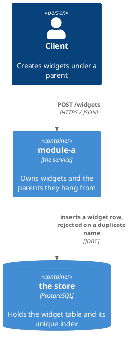
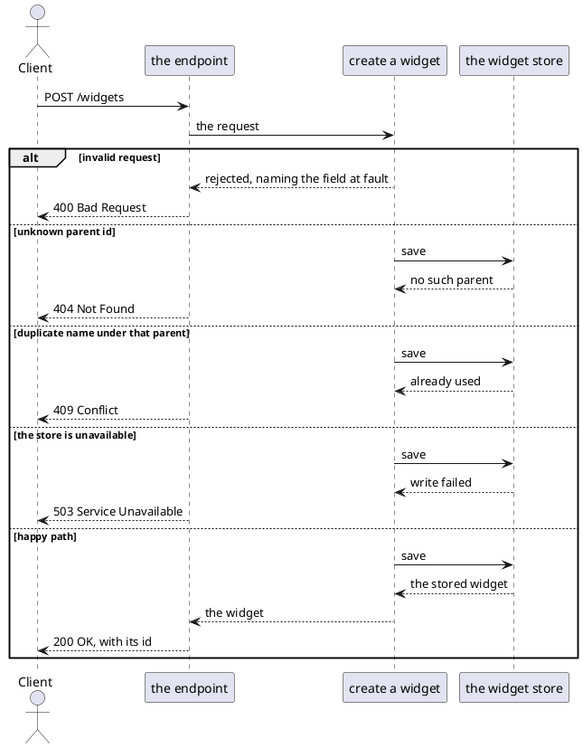

# Example Design — Worked Example

This is a complete worked example of a design file produced by the `design-task` skill — in a real repo this file
would live at `docs/1-add-widget/design.md`, beside the `plan.md` written from it. It is illustrated with a
`Widget` feature purely for concreteness; the classes, the schema format and the failure vocabulary are whatever
the module's `docs/conventions.md` records (see `.claude/templates/conventions/`). What transfers is the
structure: the sections, their order, and the decision format.

`.claude/templates/example-plan.md` is the plan written from this design — the same feature, one stage later.

Every decision below is answered, which is what makes the design finished. An entry still awaiting the user has the
same three lines with an empty `Answer:` and a `Basis: must-decide — [what the repository does not say]`; **D7**
shows what one looks like once it has been answered.

---

# Design: Add Widget Creation

**Affected Modules:** `module-a`

## Objective

Allow API clients to create widgets. A widget has a `name` and a `value`; it is validated, persisted, and returned
with its generated id. It belongs to a parent resource, which must exist.

## Context

| What exists                         | Where                    | What this change does with it                                          |
|-------------------------------------|--------------------------|------------------------------------------------------------------------|
| The parent resource, the closest existing shape | `<parent-usecase-file>`  | Mirrored throughout — same layering, same adapter style, same error vocabulary |
| The parent's persistence adapter    | `<parent-adapter-file>`  | Its failure classification is the evidence D2 rests on                 |
| The module's API contract           | `<api-schema-file>`      | Gains `POST /widgets`                                                  |
| The parent table and its cascade    | `<migration-file>`       | The widget table hangs off it, D10                                     |

## Proposed Solution

`POST /widgets` joins the module's API contract (`<api-schema-file>`), taking a `CreateWidgetRequest` — `name` and
`value`, both required — and answering a `Widget` with its generated id. A widget belongs to a parent, named by
`parentId`.

### Diagrams

`module-a` names no **Diagram Format** in its conventions, so these use the assumed default. There is no component
diagram: classes belong to the plan.



**Affected Modules** lists one module, so nothing crosses between two. The diagram still answers what this change
reaches outside the module — the caller and the store — which is where every failure mode below comes from.



### Details

What the diagrams cannot hold: a field, a signature, an invariant, a status, a setting.

| A widget holds | Refuses                                      |
|----------------|----------------------------------------------|
| `parentId`     | a parent that does not exist                 |
| `name`         | blank, or already used under the same parent |
| `value`        | over 255 characters                          |

| The caller gets | When                        |
|-----------------|-----------------------------|
| 400             | a field is missing or blank |
| 404             | the `parentId` is unknown   |
| 409             | the name is already used    |
| 503             | the write failed            |

The `widget` table is created in migration `<migration-file>`:

```sql
CREATE TABLE widget (
    id        BIGSERIAL PRIMARY KEY,
    parent_id BIGINT       NOT NULL REFERENCES parent (id) ON DELETE CASCADE,
    name      VARCHAR(255) NOT NULL,
    value     VARCHAR(255) NOT NULL
);

CREATE UNIQUE INDEX idx_widget_parent_name ON widget (parent_id, name);
```

## Acceptance Scenarios

One per branch of the flow above. `POST /widgets` is the only entry point.

- **A1:** a widget is created
  - Given: a parent exists, and it has no widget named `left-rail`
  - When: the caller posts `parentId`, `name: left-rail` and a value
  - Then: the response is 200 with the new widget and its generated id, and the widget is stored under that parent

- **A2:** a required field is missing
  - Given: a parent exists
  - When: the caller posts a blank `name`
  - Then: the response is 400 naming `name`, and nothing is stored

- **A3:** the parent does not exist
  - Given: no parent with the posted `parentId`
  - When: the caller posts an otherwise valid widget
  - Then: the response is 404, and nothing is stored

- **A4:** the name is already used under that parent
  - Given: the parent already has a widget named `left-rail`
  - When: the caller posts a second widget named `left-rail` under it
  - Then: the response is 409, and the first widget is unchanged

- **A5:** the store is unavailable
  - Given: a parent exists, and the store refuses writes
  - When: the caller posts a valid widget
  - Then: the response is 503, and the caller can retry the same request

## Decisions

An entry exists for a question a reader could reasonably re-open. The basis says why they should not.

| Basis         | Means                                                                             | `Answer:`                                                      |
|---------------|-----------------------------------------------------------------------------------|----------------------------------------------------------------|
| `decided`     | the user chose between defensible options                                         | written, with the choice attributed and dated                  |
| `deferred`    | real, but out of scope for this change                                            | written as what happens instead, plus what would bring it back |
| `must-decide` | a product, operational, or business rule that exists nowhere yet                  | empty                                                          |
| `assumed`     | the repository forces a guarantee the body states the mechanism for, not the rule | written, with the evidence cited in `Basis:`                   |

**`assumed` is the narrow one.** Use it where the body says *what happens* and the entry says *why that is safe* —
a concurrency guarantee, an ordering, an invariant an ADR carries. A fact the body plainly states needs no entry
repeating it with a citation; that is a row in **Design Findings**, or nothing at all.

**And it is a claim, not a hedge.** Cite the file, class, or ADR. An assumption with no evidence line is a
`must-decide` wearing a disguise, and it will be found by the grill or, more expensively, in production.

**Reading code this repository does not own is not evidence of what it does at runtime.** Where a decision turns
on how a dependency behaves — which of its layers acts first, what it does with a value of the wrong shape — its
source shows what code exists, not what runs. `assumed` is available only when something in the tree already
exercises that path and what it was *observed* to produce is cited. Otherwise the entry is `deferred`, naming
what would settle it. At design time the subject of the question often does not exist yet, so `deferred` is the
expected answer and costs nothing: the entry records the invariant that must hold rather than the mechanism
assumed to deliver it, and names what has to be observed before anyone can claim otherwise.

- **D1:** Must a widget's `name` be unique, and what does a duplicate return?
  - Answer: Unique per parent, enforced by `idx_widget_parent_name`. A duplicate returns 409, mapped from
    `DuplicateResourceException`.
  - Basis: decided — the user chose unique-per-parent over globally unique, so two parents can each own a widget
    called "default" (2026-07-30).

- **D2:** What does the caller see when the database is unavailable mid-write?
  - Answer: `PersistenceFailedException` propagates and the controller maps it to 503. Nothing is persisted and
    no partial row is written.
  - Basis: assumed — the parent resource's adapter classifies every non-constraint persistence failure this way,
    and a single-row insert has no partial state to leave behind.

- **D3:** What happens when the parent id does not exist?
  - Answer: 404, mapped from `ResourceNotFoundException`. The foreign key is what detects it — the use case does
    not read the parent first.
  - Basis: assumed — the module's existing endpoints report an unknown parent this way, and a read-then-insert
    would be the race D4 rules out.

- **D4:** What happens when the same widget is created twice concurrently?
  - Answer: One request wins with 200; the other's insert violates `idx_widget_parent_name` and returns the same
    409 a sequential duplicate returns.
  - Basis: decided — the user chose the unique index over a check-then-insert in the use case, so the guarantee
    survives a second service instance (2026-07-30).

- **D5:** Is `POST /widgets` idempotent for a retried request?
  - Answer: No. A retry after a successful create returns 409, not the widget created the first time.
  - Basis: deferred — comes back if a client needs safe retries, which would mean an idempotency key on the
    request rather than a change to this design. Nothing calls the endpoint with a retry today.

- **D6:** What does the migration do to rows that already exist?
  - Answer: Nothing — it creates the table.
  - Basis: assumed — `widget` does not exist in `<migration-file>`'s history, so there is no data to migrate and
    the unique index cannot fail on legacy duplicates.

- **D7:** Who may create a widget under a given parent?
  - Answer: Any authenticated caller. The endpoint does not check that the caller owns the parent.
  - Basis: decided — the grill raised this as `must-decide`, since the module has no per-resource ownership model
    and nothing in the API contract implies one; the user confirmed that ownership is out of scope until the
    module has an authorization model at all (2026-07-30).

- **D8:** What proves in production that a widget was created?
  - Answer: The use case logs the widget id, the parent id and the name at INFO on success; the 409 and 404 paths
    log at WARN with the rejected name.
  - Basis: assumed — the module's logging convention in `module-a/docs/conventions.md`.

- **D9:** Is `name` bounded, and where is the bound enforced?
  - Answer: 255 characters, declared in the API schema and matched by the column width. The request is rejected
    with 400 before it reaches the use case.
  - Basis: assumed — every text column in the module carries its width in the schema so a rejection is a 400
    rather than a persistence error.

- **D10:** What happens to a widget when its parent is deleted?
  - Answer: It is deleted with the parent, via `ON DELETE CASCADE`.
  - Basis: assumed — the parent's other child tables cascade, and a widget has no meaning without its parent.

## Design Findings

Grilled (2026-07-30): contract compat, limits, observability.

| Raised                                       | Answered by                                         |
|----------------------------------------------|-----------------------------------------------------|
| What a second create with the same name does | D4, which the endpoint table already states         |
| Whether the widget list needs paging         | Proposed Solution — the list is one person's tree |
