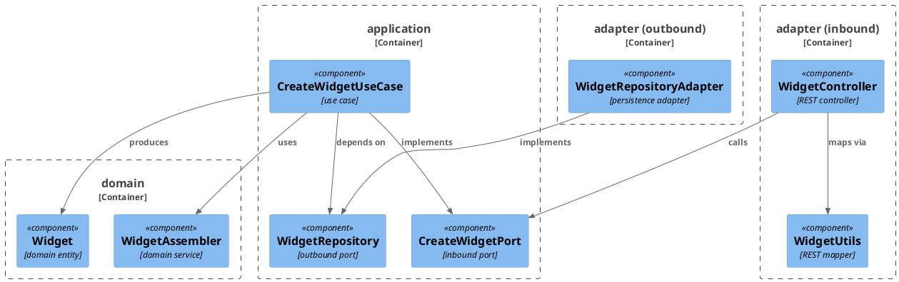
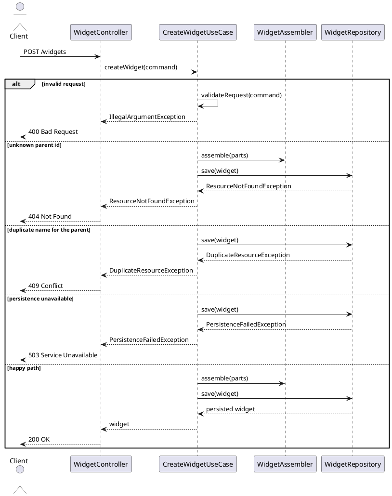

# Example Design — Worked Example

This is a complete worked example of a design file produced by the `design-task` skill — in a real repo this file
would live at `docs/1-add-widget/design.md`, beside the `plan.md` written from it. It is illustrated with a
`Widget` feature purely for concreteness; the classes, the schema format and the failure vocabulary are whatever
the module's `docs/conventions.md` records (see `.claude/templates/conventions-template.md`). What transfers is the
structure: the sections, their order, and the decision format.

`.claude/templates/example-plan.md` is the plan written from this design — the same feature, one stage later.

Every decision below is answered, which is what makes the design finished. An entry still awaiting the user has the
same three lines with an empty `Answer:` and a `Basis: must-decide — [what the repository does not say]`; **D7**
shows what one looks like once it has been answered.

---

# Design: Add Widget Creation

**Affected Modules:** `module-a`

## Objective

Allow API clients to create widgets. A widget has a `name` and a `value`; it is validated, persisted, and returned
with its generated id. It belongs to a parent resource, which must exist.

## Context

`module-a` has no widget concept yet. The closest existing shape is its parent resource — same layering, same
persistence adapter style, same error vocabulary — and this change mirrors it throughout: an inbound port
implemented by a use case, an outbound port implemented by a persistence adapter, a REST controller mapping between
the transport model and the domain model.

## Proposed Solution

Add a `POST /widgets` endpoint to the module's API contract (`<api-schema-file>`) with a `CreateWidgetRequest`
request schema and a `Widget` response schema.

`CreateWidgetPort` is the inbound port, implemented by `CreateWidgetUseCase`: it validates the command, assembles
the domain `Widget` via `WidgetAssembler`, and persists it through a new `WidgetRepository` outbound port. That
outbound port is implemented by `WidgetRepositoryAdapter` in the persistence adapter, backed by a new `widget`
table created in migration `<migration-file>`:

```sql
CREATE TABLE widget (
    id        BIGSERIAL PRIMARY KEY,
    parent_id BIGINT       NOT NULL REFERENCES parent (id) ON DELETE CASCADE,
    name      VARCHAR(255) NOT NULL,
    value     VARCHAR(255) NOT NULL
);

CREATE UNIQUE INDEX idx_widget_parent_name ON widget (parent_id, name);
```

`WidgetController` exposes the endpoint and maps between the REST model and the domain model via `WidgetUtils`.

Files touched: `<api-schema-file>`, `<migration-file>`, `CreateWidgetPort`, `CreateWidgetUseCase`,
`WidgetAssembler`, `WidgetRepository`, `WidgetRepositoryAdapter`, `WidgetController`, `WidgetUtils`.

### Diagrams

`module-a` names no **Diagram Format** in its conventions, so these use the assumed default. There is no container
diagram: **Affected Modules** lists one module, so nothing crosses between two.





## Decisions

- **D1:** Must a widget's `name` be unique, and what does a duplicate return?
- Answer: Unique per parent, enforced by `idx_widget_parent_name`. A duplicate returns 409, mapped from
  `DuplicateResourceException`.
- Basis: decided — the user chose unique-per-parent over globally unique, so two parents can each own a widget
  called "default" (2026-07-30).

- **D2:** What does the caller see when the database is unavailable mid-write?
- Answer: `PersistenceFailedException` propagates and the controller maps it to 503. Nothing is persisted and no
  partial row is written.
- Basis: assumed — the parent resource's adapter classifies every non-constraint persistence failure this way, and
  a single-row insert has no partial state to leave behind.

- **D3:** What happens when the parent id does not exist?
- Answer: 404, mapped from `ResourceNotFoundException`. The foreign key is what detects it — the use case does not
  read the parent first.
- Basis: assumed — the module's existing endpoints report an unknown parent this way, and a read-then-insert would
  be the race D4 rules out.

- **D4:** What happens when the same widget is created twice concurrently?
- Answer: One request wins with 200; the other's insert violates `idx_widget_parent_name` and returns the same 409
  a sequential duplicate returns.
- Basis: decided — the user chose the unique index over a check-then-insert in the use case, so the guarantee
  survives a second service instance (2026-07-30).

- **D5:** Is `POST /widgets` idempotent for a retried request?
- Answer: No. A retry after a successful create returns 409, not the widget created the first time.
- Basis: deferred — comes back if a client needs safe retries, which would mean an idempotency key on the request
  rather than a change to this design. Nothing calls the endpoint with a retry today.

- **D6:** What does the migration do to rows that already exist?
- Answer: Nothing — it creates the table.
- Basis: assumed — `widget` does not exist in `<migration-file>`'s history, so there is no data to migrate and the
  unique index cannot fail on legacy duplicates.

- **D7:** Who may create a widget under a given parent?
- Answer: Any authenticated caller. The endpoint does not check that the caller owns the parent.
- Basis: decided — the grill raised this as `must-decide`, since the module has no per-resource ownership model and
  nothing in the API contract implies one; the user confirmed that ownership is out of scope until the module has
  an authorization model at all (2026-07-30).

- **D8:** What proves in production that a widget was created?
- Answer: The use case logs the widget id, the parent id and the name at INFO on success; the 409 and 404 paths log
  at WARN with the rejected name.
- Basis: assumed — the module's logging convention in `module-a/docs/conventions.md`.

- **D9:** Is `name` bounded, and where is the bound enforced?
- Answer: 255 characters, declared in the API schema and matched by the column width. The request is rejected with
  400 before it reaches the use case.
- Basis: assumed — every text column in the module carries its width in the schema so a rejection is a 400 rather
  than a persistence error.

- **D10:** What happens to a widget when its parent is deleted?
- Answer: It is deleted with the parent, via `ON DELETE CASCADE`.
- Basis: assumed — the parent's other child tables cascade, and a widget has no meaning without its parent.

## Design Findings

Grilled (2026-07-30): nothing to raise on contract compat — the endpoint is new, so no existing caller sees a
change.
