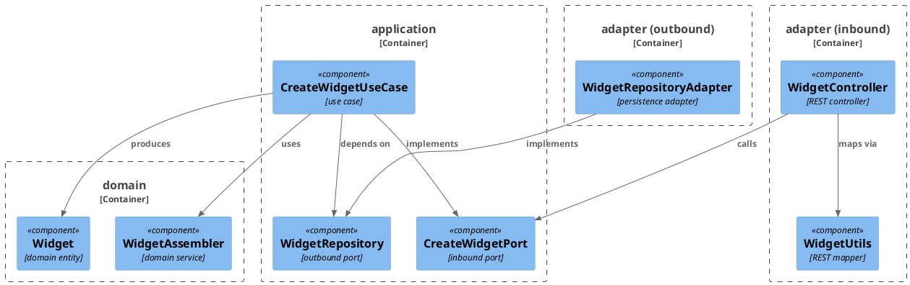
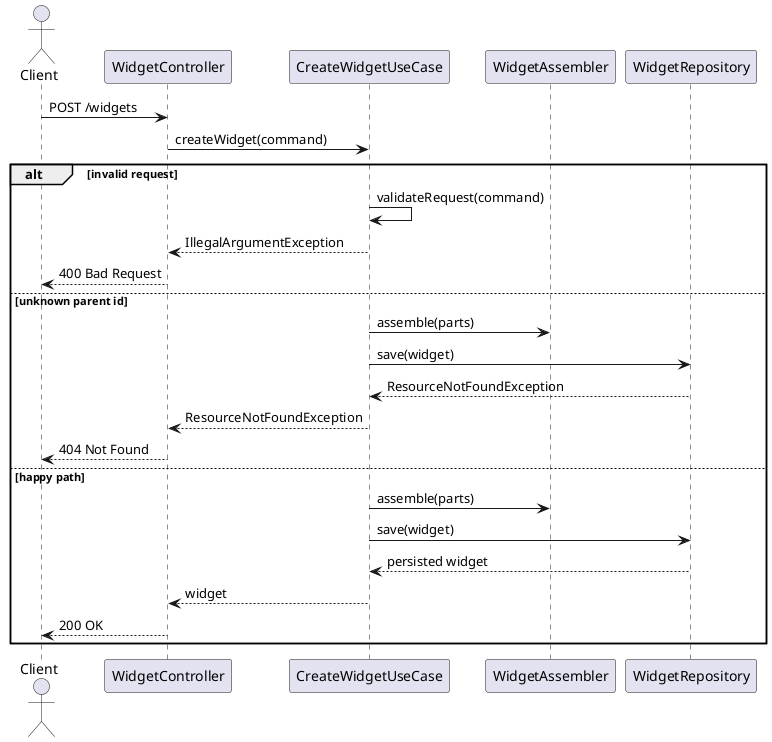

# Example Plan — Worked Example

This is a complete worked example of a plan file produced by the `plan-task` skill — in a real repo this file would
live at `docs/1-plan-add-widget.md` and be moved to `docs/implemented/` once every checkbox is ticked. It is
illustrated with a Java/Spring-Boot-flavored `Widget` feature purely for concreteness — other stacks adapt the same
structure (plan sections, section order, step formats, RED/GREEN choreography) using their own tech stack, tools,
and file formats as recorded in the module's `docs/conventions.md`
(see `.claude/templates/conventions-template.md`).

---

# Plan: Add Widget Creation

**Affected Modules:** `module-a`

## Objective

Allow API clients to create widgets. A widget has a `name` and a `value`; it is validated, persisted, and returned
with its generated id.

## Proposed Solution

Add a `POST /widgets` endpoint to the module's API contract (`<api-schema-file>`) with a `CreateWidgetRequest`
request schema and a `Widget` response schema.

Introduce a `CreateWidgetPort` inbound port in the application layer, implemented by a `CreateWidgetUseCase`
use case: it validates the command, assembles the domain `Widget` via `WidgetAssembler`, and persists it through
a new `WidgetRepository` outbound port. That outbound port is implemented by `WidgetRepositoryAdapter` in the
persistence adapter, backed by a new `widget` table created in migration `<migration-file>`:

```sql
CREATE TABLE widget (
    id    BIGSERIAL PRIMARY KEY,
    name  VARCHAR(255) NOT NULL,
    value VARCHAR(255) NOT NULL
);
```

`WidgetController` exposes the endpoint and maps between the REST model and the domain model via `WidgetUtils`.

Files touched: `<api-schema-file>`, `<migration-file>`, `CreateWidgetPort`, `CreateWidgetUseCase`,
`WidgetAssembler`, `WidgetRepository`, `WidgetRepositoryAdapter`, `WidgetController`, `WidgetUtils`.

#### Diagrams





## Step-by-Step Implementation Map (To-Do List)

### Stabilization

#### API Contract

- [ ] ST01 · Add `POST /widgets` path to the project's API schema file `<api-schema-file>`:
  ```yaml
  /widgets:
    post:
      operationId: createWidget
      requestBody:
        required: true
        content:
          application/json:
            schema:
              $ref: '#/components/schemas/CreateWidgetRequest'
      responses:
        '200':
          content:
            application/json:
              schema:
                $ref: '#/components/schemas/Widget'
  ```
- [ ] ST02 · Add `CreateWidgetRequest` schema to `<api-schema-file>`: `name` (string, required, max 255), `value` (string,
  required, max 255)
- [ ] ST03 · Add `Widget` response schema to `<api-schema-file>`: `id` (integer), `name` (string), `value` (string)

#### Database

- [ ] ST04 · Add migration `<migration-file>` (named per the project's migration tool conventions):
  ```sql
  CREATE TABLE widget (
      id    BIGSERIAL PRIMARY KEY,
      name  VARCHAR(255) NOT NULL,
      value VARCHAR(255) NOT NULL
  );
  ```

#### Interface-First / Build Stabilization

New-method stubs must carry a short inline comment describing the implementation intent, for example:

```java
public Settings loadSettings(long userId) {
    // retrieves language settings and the user's word lists for the given user
    return null;
}
```

**Interface & Signature Sync**

- [ ] ST05 · Add `createWidget(CreateWidgetCommand command): Widget` to the `CreateWidgetPort` inbound port
  (interface only — the implementation stub goes on `CreateWidgetUseCase` below)
- [ ] ST06 · Add `save(Widget widget): Widget` to the `WidgetRepository` outbound port
- [ ] ST07 · Stub `CreateWidgetUseCase.createWidget()`:
  ```java
  public Widget createWidget(CreateWidgetCommand command) {
      // validates the command, assembles a Widget via WidgetAssembler, and persists it via WidgetRepository
      return null;
  }
  ```
- [ ] ST08 · Stub `WidgetRepositoryAdapter.save()`:
  ```java
  public Widget save(Widget widget) {
      // maps the domain Widget to a WidgetEntity, persists it, and returns the domain Widget with its generated id
      return null;
  }
  ```
- [ ] ST09 · Update `WidgetController.createWidget()` to call `createWidgetPort.createWidget(...)` and fix any remaining
  compile errors until the module builds green

**Shared Test Infrastructure**

- [ ] ST10 · Add a `WidgetTestDataFactory` (`aWidget()`, `aWidget().withName(...)`) to the module's shared test-fixture
  location — both `WidgetRepositoryAdapterTest` (Integration Red Phase) and `CreateWidgetTest` (System Test Red
  Phase) need a valid widget precondition, and neither Red Phase step is scoped to create shared fixtures on its
  own

### Red Phase

#### TDD Unit Red Phase

- [ ] RU01 · `CreateWidgetUseCase` · test: `CreateWidgetUseCaseTest` · covers: `createWidget()`, `validateRequest()`
    - `createWidget()`:
        - given: a valid request
          when: createWidget() is called
          then: returns the created widget
        - given: an invalid request
          when: createWidget() is called
          then: throws IllegalArgumentException
    - `validateRequest()`:
        - given: a valid request
          when: validateRequest() is called
          then: no exception is thrown
        - given: a null request
          when: validateRequest() is called
          then: throws NullPointerException
- [ ] RU02 · `WidgetAssembler` · test: `WidgetAssemblerTest` · covers: `assemble()`, `normalize()`
    - `assemble()`:
        - given: a list of parts
          when: assemble() is called
          then: returns the parts combined into a widget
        - given: an empty part list
          when: assemble() is called
          then: returns an empty widget
    - `normalize()`:
        - given: mixed-case input
          when: normalize() is called
          then: returns lowercase result
        - given: input with leading and trailing spaces
          when: normalize() is called
          then: returns trimmed result
- [ ] RU03 · `WidgetUtils` · test: `WidgetUtilsTest` · covers: `toRest()`
    - `toRest()`:
        - given: a fully populated domain object
          when: toRest() is called
          then: all fields are mapped correctly
        - given: a domain object with a null optional field
          when: toRest() is called
          then: null is preserved in the response

#### TDD Integration Red Phase

- [ ] RI01 · `WidgetRepositoryAdapter` · test: `WidgetRepositoryAdapterTest` · covers: `findById()`,
  `save()`
    - `findById()`:
        - given: an existing widget
          when: findById() is called
          then: returns the widget
        - given: an unknown widget id
          when: findById() is called
          then: throws ResourceNotFoundException
    - `save()`:
        - given: a valid widget
          when: save() is called
          then: the widget is persisted
        - given: an unknown parent id
          when: save() is called
          then: throws ResourceNotFoundException
- [ ] RI02 · `WidgetController` · test: `WidgetControllerTest` · covers: `POST /widgets` · mocks: `CreateWidgetPort`
    - Happy Path:
        - given: the mocked port returns a created widget
          when: request is made with a valid payload
          then: the port is called with the mapped command and 200 is returned with the widget response
    - Error Mapping:
        - given: the mocked port throws ResourceNotFoundException
          when: request is made
          then: return 404
    - Validation: `name` — blank, null, exceeds max length

#### TDD System Test Red Phase

- [ ] RS01 · `CreateWidgetTest` · covers: `POST /widgets`
    - Happy Path:
        - given: a valid parent resource
          when: request is made with a valid payload
          then: return 200 with the created widget
    - Unhappy Path:
        - given: an unknown parent id
          when: create request is made
          then: return 404

### Green Phase

#### TDD Unit Green Phase

- [ ] GU01 · `CreateWidgetUseCase` · test: `CreateWidgetUseCaseTest`
- [ ] GU02 · `WidgetAssembler` · test: `WidgetAssemblerTest`
- [ ] GU03 · `WidgetUtils` · test: `WidgetUtilsTest`

#### TDD Integration Green Phase

- [ ] GI01 · `WidgetRepositoryAdapter` · test: `WidgetRepositoryAdapterTest`
- [ ] GI02 · `WidgetController` · test: `WidgetControllerTest` · covers: `POST /widgets` · mocks: `CreateWidgetPort` ·
  after: GU03

#### TDD System Test Green Phase

- [ ] GS01 · `CreateWidgetTest` · covers: `POST /widgets`

### Post-Implementation Steps

#### Manual Request Files

- [ ] P01 · Update `.http` files to reflect the new request shape

## Open Questions / Blockers

- **Q1:** Must widget names be unique, and if so, should a duplicate `POST /widgets` return 409?
- A:

- **Q2:** `module-a` has no conventions file yet (`module-a/docs/conventions.md` is missing) — please create one from
  `.claude/templates/conventions-template.md`; this plan assumes generic defaults where conventions were needed.
- A:

## Review Findings

- **F1:** `WidgetRepositoryAdapterTest` has no scenario for a duplicate `name` violating a uniqueness constraint,
  and the `widget` table defined above declares no unique constraint on `name` — this may be intentional pending the
  open question above about duplicate names, but is flagged here since the schema currently allows duplicates
  silently.
- Action:
