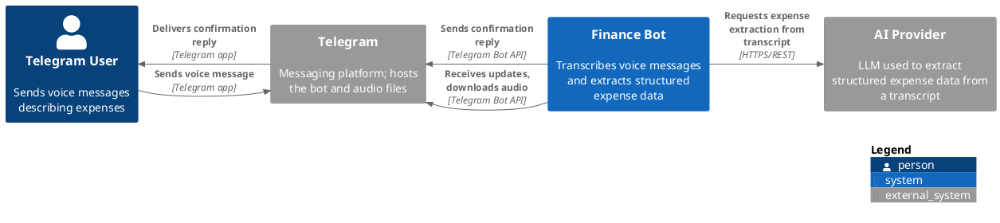
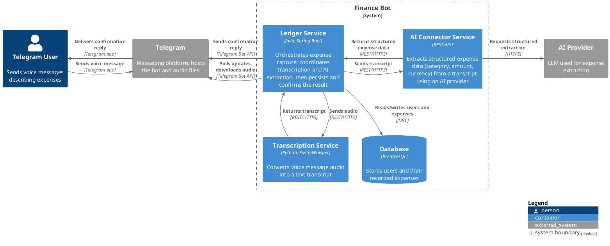
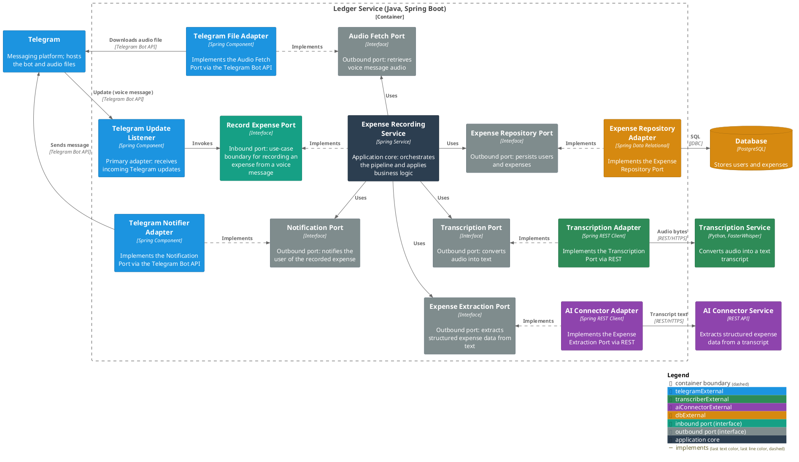

# Finance Bot

A Telegram bot that lets users record their expenses by simply speaking. A user sends a
voice message describing a purchase (e.g. *"Spent 15 euros on lunch"*); the system
transcribes it, extracts the expense details, and stores them per user.

## MVP Flow

1. A user sends a voice message to the Telegram bot.
2. The **Ledger Service** receives the update from Telegram and downloads the audio file.
3. The audio is sent to the **Transcription Service**, which returns a text transcript.
4. The transcript is sent to the **AI Connector Service**, which uses an AI provider to
   extract structured expense data: category, amount, and (optionally) currency.
5. The Ledger Service saves the extracted expense against the user in the **database**.
6. The Ledger Service replies on Telegram confirming what was recorded.

## Architecture

Diagrams follow the [C4 model](https://c4model.com) and are written in [PlantUML](https://plantuml.com/).

### C1 — System Context

### C2 — Container

### C3 — Component (Ledger Service)

Every interaction the Ledger Service has with something outside its own boundary
(Telegram, the Transcription Service, the AI Connector Service, the database) is
mediated by an **abstract port (interface)** — never a direct call from the
application core. Inbound ports are driven by the outside world; outbound ports are
driven by the core and implemented by adapters. Adapters are color-coded by the
external dependency they front, so it's clear at a glance which piece talks to what.

## Tech Stack

| Container             | Stack                 | Responsibility                                   |
|-----------------------|-----------------------|--------------------------------------------------|
| Ledger Service        | Java, Spring Boot     | Orchestration, persistence, Telegram integration |
| Transcription Service | Python, FasterWhisper | Speech-to-text                                   |
| AI Connector Service  | Java, Spring AI       | Structured expense extraction from text          |
| Database              | PostgreSQL            | Stores users and expenses                        |

## Data Model (MVP)

Each recorded expense is linked to a Telegram user and includes:

- **category** — e.g. food, transport, entertainment
- **amount** — the numeric value spent
- **currency** *(optional)* — inferred from the message when possible
