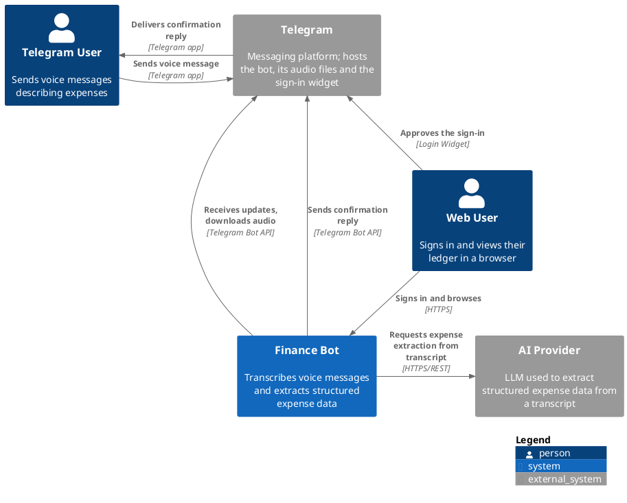
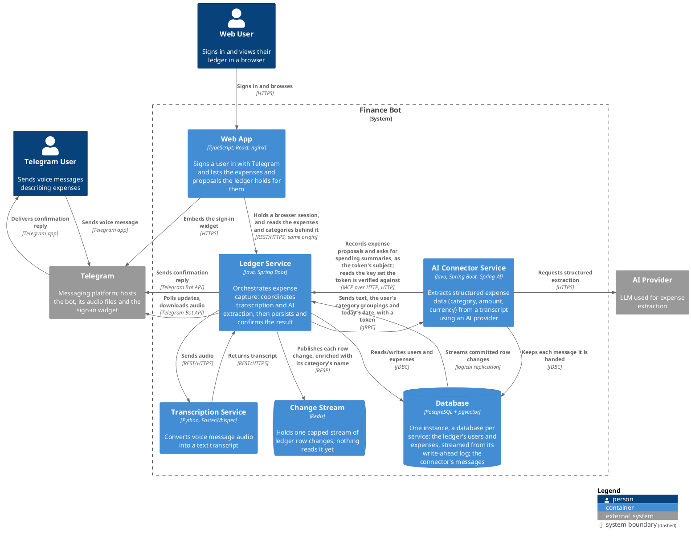

# Finance Bot

A Telegram bot that records a user's expenses from a voice message describing a purchase (*"Spent 15 euros on
lunch"*). The system transcribes it, extracts the expense details, and stores them per user.

## MVP Flow

1. A user sends a voice message to the Telegram bot.
2. The **Ledger Service** takes the update from Telegram and downloads the audio file.
3. The **Transcription Service** returns a text transcript of that audio.
4. The **AI Connector Service** extracts the expense details from the transcript, using an AI provider.
5. The Ledger Service saves the extracted expense against the user in the **database**.
6. The Ledger Service replies on Telegram confirming what was recorded.

## Architecture

Diagrams follow the [C4 model](https://c4model.com) and are written in [PlantUML](https://plantuml.com/).

### C1 — System Context

### C2 — Container

## Services

| Container             | Stack                        | Responsibility                                                                    | Docs                                     | Ports |
|-----------------------|------------------------------|-----------------------------------------------------------------------------------|------------------------------------------|-------|
| Web App               | TypeScript, React, nginx     | Telegram sign-in and browsing the ledger                                          | [README](web-app/README.md)              | 1003  |
| Ledger Service        | Java, Spring Boot            | Orchestration, persistence, Telegram integration                                  | [README](ledger-service/README.md)       | 1000  |
| Transcription Service | Python, FasterWhisper        | Speech-to-text                                                                    | -                                        | -     |
| AI Connector Service  | Java, Spring Boot, Spring AI | Structured expense extraction from text                                           | [README](ai-connector-service/README.md) | 1001  |
| Database              | PostgreSQL + pgvector        | A database per service: the ledger's users and expenses, the connector's messages | -                                        | 5432  |

Container definitions live in [`infrastructure/docker-compose.yaml`](infrastructure/docker-compose.yaml).

## Data Model (MVP)

Each recorded expense is linked to a Telegram user and filed under a category, with the amount spent and an
optional currency, inferred from the message when possible. The full shape is
[Expense](ledger-service/docs/domain/expense.md).
