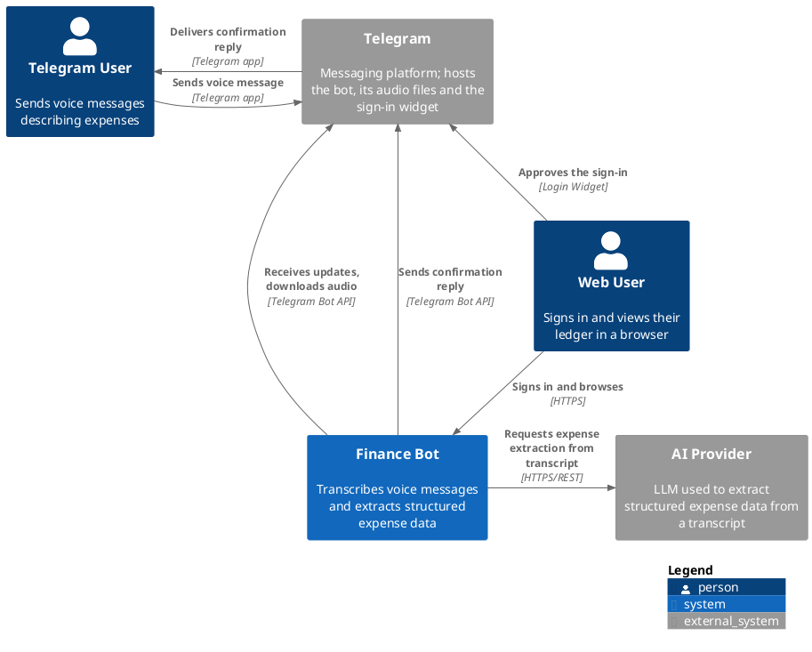
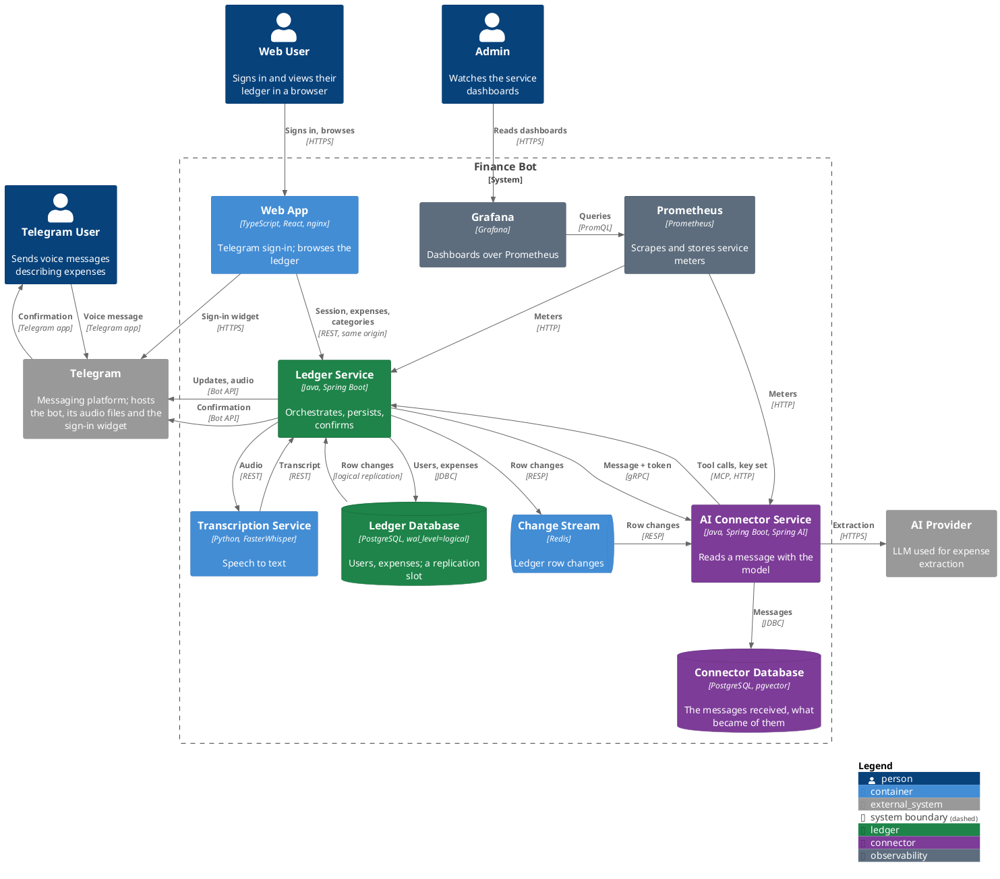

# Finance Bot

A Telegram bot that records a user's expenses from a voice message describing a purchase (*"Spent 15 euros on
lunch"*). The system transcribes it, extracts the expense details, and stores them per user.

## MVP Flow

1. A user sends a voice message to the Telegram bot.
2. The **Ledger Service** takes the update from Telegram and downloads the audio file.
3. The **Transcription Service** returns a text transcript of that audio.
4. The **AI Connector Service** extracts the expense details from the transcript, using an AI provider.
5. The Ledger Service saves the extracted expense against the user in the **database**.
6. The Ledger Service replies on Telegram confirming what was recorded.

## Architecture

Diagrams follow the [C4 model](https://c4model.com) and are written in [PlantUML](https://plantuml.com/).

### C1 — System Context



### C2 — Container



## Services

| Container             | Stack                           | Responsibility                                   | Docs                                                            | Ports |
|-----------------------|---------------------------------|--------------------------------------------------|-----------------------------------------------------------------|-------|
| Web App               | TypeScript, React, nginx        | Telegram sign-in and browsing the ledger         | [README](web-app/README.md)                                     | 1003  |
| Ledger Service        | Java, Spring Boot               | Orchestration, persistence, Telegram integration | [README](ledger-service/README.md)                              | 1000  |
| Transcription Service | Python, FasterWhisper           | Speech-to-text                                   | -                                                               | -     |
| AI Connector Service  | Java, Spring Boot, Spring AI    | Structured expense extraction from text          | [README](ai-connector-service/README.md)                        | 1001  |
| Ledger Database       | PostgreSQL, `wal_level=logical` | Users and expenses                               | [contract](ledger-service/docs/contracts/out/database.md)       | 5432  |
| Connector Database    | PostgreSQL, pgvector            | The messages received, and what became of them   | [contract](ai-connector-service/docs/contracts/out/database.md) | 5432  |
| Prometheus            | Prometheus                      | Scrapes and stores service meters                | [README](infrastructure/README.md#monitoring)                   | -     |
| Grafana               | Grafana                         | Dashboards over Prometheus                       | [README](infrastructure/README.md#monitoring)                   | 1005  |

Container definitions live in [`infrastructure/docker-compose.yaml`](infrastructure/docker-compose.yaml); how the
stack is set up is [`infrastructure/README.md`](infrastructure/README.md).

## URLs

| URL                                            | What                                                             |
|------------------------------------------------|------------------------------------------------------------------|
| https://wreath-fraction-refined.ngrok-free.dev | the web app over HTTPS — the origin Telegram sign-in works on    |
| http://localhost:1004                          | the web app's Vite dev server, what the tunnel fronts            |
| http://localhost:1003                          | the web app as compose serves it                                 |
| http://localhost:1000                          | Ledger Service HTTP API                                          |
| http://localhost:1002                          | AI Connector Service HTTP; its gRPC listens on `localhost:1001`  |
| http://localhost:1005                          | Grafana, credentials from `infrastructure/.env`                  |
| `localhost:5432`                               | Postgres                                                         |

The tunnel is started with:

```
ngrok http 1004 --url https://wreath-fraction-refined.ngrok-free.dev
```

## Data Model (MVP)

Each recorded expense is linked to a Telegram user and filed under a category, with the amount spent and an
optional currency, inferred from the message when possible. The full shape is
[Expense](ledger-service/docs/domain/expense.md).
