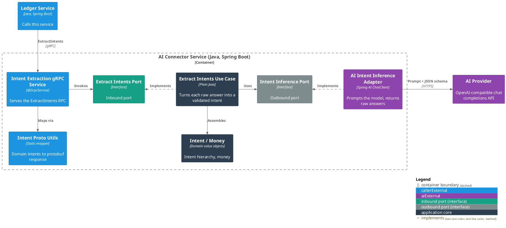

# AI Connector Service

The [Finance Bot](../README.md) system's boundary with the AI provider. It takes a line of user text over gRPC
and returns the structured **intents** it expresses: what the user is acting on (a category or an expense),
what they want done, and the details.

It holds no state — every request is answered from its own input plus one call to the model.

For C1 (System Context) and C2 (Container) see the [root README](../README.md#architecture); C3 is below.
Package structure is in the
[Architecture & Layering conventions](docs/conventions/architecture.md#package-structure).

### Use Cases

- [Extract the intents in a user's message](docs/usecases/extract-intents.md)

### Contracts

- [Ledger Service — intent extraction](docs/contracts/in/intent-extraction.md) (inbound)
- [AI provider — intent inference](docs/contracts/out/ai-provider.md) (outbound)

### Running It

- [Configuration](docs/configuration.md) — the environment variables a deployment supplies.

### C3 — Component



## Running Locally

Because gRPC server reflection is enabled, the running service can be explored
without a copy of the schema:

```bash
grpcurl -plaintext localhost:1001 list
grpcurl -plaintext \
  -d '{"text":"spent 15 on lunch","known_categories":["Food","Travel"],"default_currency":"EUR"}' \
  localhost:1001 bot.finance.ai.v1.IntentExtractionService/ExtractIntents
```
