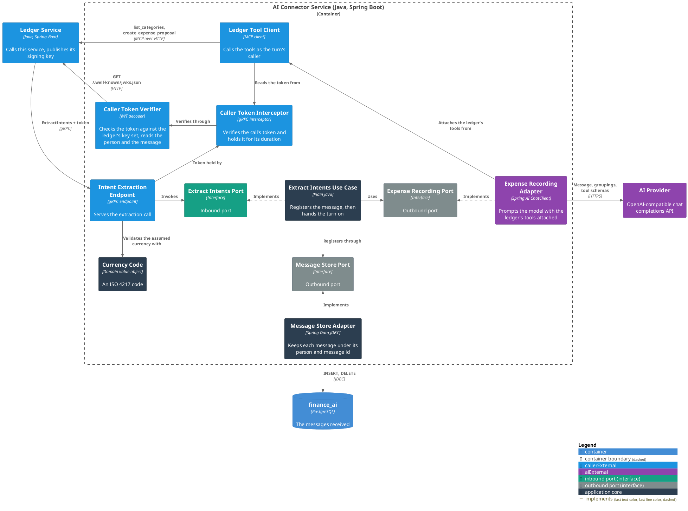

# AI Connector Service

The [Finance Bot](../README.md) system's boundary with the AI provider. It takes a line of user text over gRPC
and puts it to a language model with the Ledger Service's tools attached, so the model records each expense the
message names, as the caller whose token arrived with the request.

What the service keeps of a call is the message itself, stored under the person and the message the caller's
token names, for as long as `MEMORY_MAX_AGE` allows.

For C1 (System Context) and C2 (Container) see the [root README](../README.md#architecture); C3 is below.
Package structure is in the
[Architecture & Layering conventions](docs/conventions/architecture.md#package-structure).

### Use Cases

- [Record the spending a user's message names](docs/usecases/extract-intents.md)
- [Purge messages past their retention](docs/usecases/purge-messages.md)

### Contracts

- [Ledger Service — intent extraction](docs/contracts/in/intent-extraction.md) (inbound)
- [AI provider — recording spending](docs/contracts/out/ai-provider.md) (outbound)
- [Ledger Service — the ledger's tools and its key set](docs/contracts/out/ledger-mcp.md) (outbound)
- [The connector's database](docs/contracts/out/database.md) (outbound)

### Running It

- [Configuration](docs/configuration.md) — the environment variables a deployment supplies.

### C3 — Component



## Running Locally

Because gRPC server reflection is enabled, the running service can be explored without a copy of the schema:

```bash
grpcurl -plaintext localhost:1001 list
grpcurl -plaintext \
  -H 'authorization: Bearer <jwt>' \
  -d '{"text":"spent 15 on lunch","category_groupings":["Dining","Miscellaneous"],"catch_all_grouping":"Miscellaneous","current_date":"2026-08-05","default_currency":"EUR"}' \
  localhost:1001 bot.finance.ai.v1.IntentExtractionService/ExtractIntents
```
