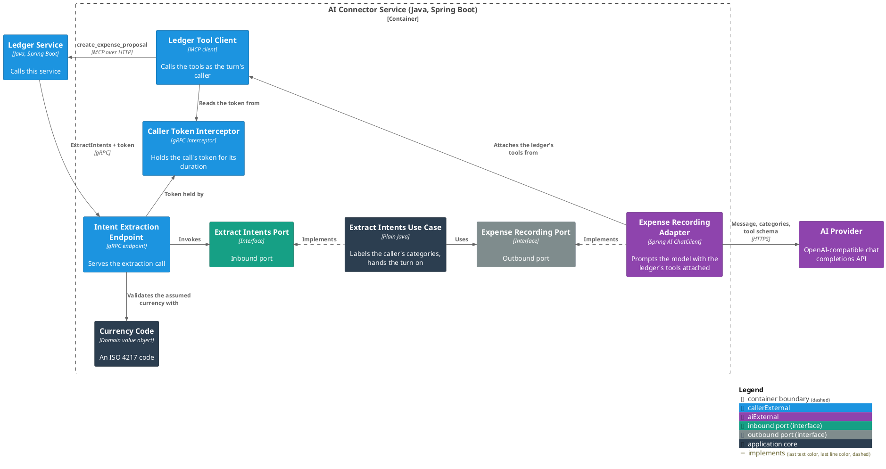

# AI Connector Service

The [Finance Bot](../README.md) system's boundary with the AI provider. It takes a line of user text over gRPC
and puts it to a language model with the Ledger Service's expense proposal tool attached, so the model records
each expense the message names — one call per expense, as the caller whose token arrived with the request.

It holds no state: a call carries its own text, its own closed set of categories, and its own credential.

For C1 (System Context) and C2 (Container) see the [root README](../README.md#architecture); C3 is below.
Package structure is in the
[Architecture & Layering conventions](docs/conventions/architecture.md#package-structure).

### Use Cases

- [Record the spending a user's message names](docs/usecases/extract-intents.md)

### Contracts

- [Ledger Service — intent extraction](docs/contracts/in/intent-extraction.md) (inbound)
- [AI provider — recording spending](docs/contracts/out/ai-provider.md) (outbound)
- [Ledger Service — the expense proposal tool](docs/contracts/out/ledger-mcp.md) (outbound)

### Running It

- [Configuration](docs/configuration.md) — the environment variables a deployment supplies.

### C3 — Component



## Running Locally

Because gRPC server reflection is enabled, the running service can be explored
without a copy of the schema:

A call carries its categories as a name and its grouping, and is refused without a bearer token — the one the
service calls the ledger back with.

```bash
grpcurl -plaintext localhost:1001 list
grpcurl -plaintext \
  -H 'authorization: Bearer <jwt>' \
  -d '{"text":"spent 15 on lunch","known_categories":[{"name":"Lunch","parent_name":"Food"}],"default_currency":"EUR"}' \
  localhost:1001 bot.finance.ai.v1.IntentExtractionService/ExtractIntents
```
