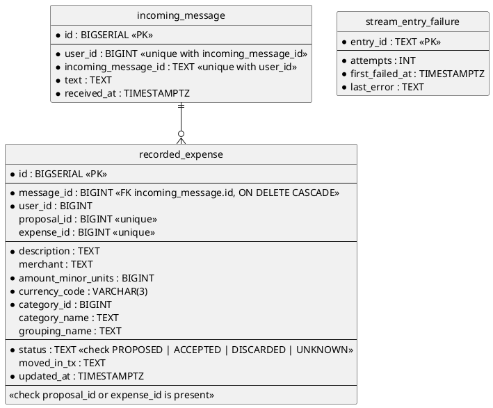

# Database — what this service remembers (SQL)

One row per message this service was asked to act on, filed under the person and the message the caller's token
named; one row per expense the ledger made of a message; and one row per change delivery the store has refused.

- **Counterpart:** the service's own PostgreSQL database — its address is
  [configuration](../../configuration.md)
- **Transport:** SQL over JDBC
- **Schema:** below, and in `src/main/resources/db/migration/`.

## Schema

Indexes beyond the constraints above:

- `idx_incoming_message_user_received` on `(user_id, received_at DESC)`.
- `idx_incoming_message_received` on `(received_at)`.
- `idx_recorded_expense_message` on `(message_id)`.
- `idx_recorded_expense_category` on `(category_id)`.
- `idx_recorded_expense_user_grouping` on `(user_id, grouping_name)`.
- `idx_recorded_expense_moved_in_tx` on `(moved_in_tx)`.

`stream_entry_failure` stands alone: nothing references it and it references nothing.

## What a Column Holds

### `incoming_message`

| Column                | Holds                                                                              |
|-----------------------|------------------------------------------------------------------------------------|
| `user_id`             | the person, as the [message identity](../../domain/message-identity.md) names them |
| `incoming_message_id` | the message they sent, as that identity names it                                   |
| `text`                | the text of the request, character for character — never trimmed, cut or rewritten |
| `received_at`         | when the row was written, from the database's own clock                            |

### `recorded_expense`

One row per expense the ledger made of a message, as a
[spending row](../../domain/spending-row.md) reaches this service.

| Column               | Holds                                                                                           |
|----------------------|---------------------------------------------------------------------------------------------------|
| `message_id`         | the message the expense came out of                                                               |
| `user_id`            | the person, copied from the message                                                               |
| `proposal_id`        | the ledger's id for the proposal, where the row has one                                           |
| `expense_id`         | the ledger's id for the recorded expense, where the row has one                                   |
| `description`        | what the expense was for, as the ledger holds it                                                  |
| `merchant`           | who it was paid to; absent where the ledger holds none                                            |
| `amount_minor_units` | the amount, in the currency's minor units, as the ledger holds it                                 |
| `currency_code`      | the currency, as a [currency code](../../domain/currency-code.md)                                 |
| `category_id`        | the ledger's id for the category it is filed under                                                |
| `category_name`      | that category's name; absent where the ledger sent none                                           |
| `grouping_name`      | the grouping that category sits in; absent on the same terms                                      |
| `status`             | which of proposed, accepted, discarded and unknown the ledger has left it in                      |
| `moved_in_tx`        | the ledger transaction the proposal left in, or the expense arrived in                            |
| `updated_at`         | when the last change was applied to the row                                                       |

- The row's own `id` is its arrival order.

### `stream_entry_failure`

One row per change delivery the store has refused, so a delivery claimed by another instance continues its count
rather than starting over.

| Column            | Holds                                                     |
|-------------------|-------------------------------------------------------------|
| `entry_id`        | the delivery, as the change stream named it                 |
| `attempts`        | how often the store has refused it                          |
| `first_failed_at` | when it was first refused                                   |
| `last_error`      | what the store said the last time                           |

## Failures

| Condition                                                      | Signal                                                 |
|----------------------------------------------------------------|--------------------------------------------------------|
| The database cannot be reached, or refuses a write or a delete | the write or the batch does not happen; the port raises |
| A migration cannot be applied                                  | the service does not start                             |

## Compatibility

Migrations are append-only. An applied migration is never edited; a change is a new one.

Widening a column or adding a nullable one costs nothing. Narrowing one, or adding a constraint the stored rows
already violate, breaks the migration itself rather than a reader.

The database is this service's alone, so a change here reaches no other module.
