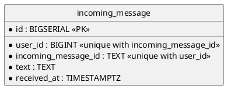

# Database — the messages this service was handed (SQL)

Everything this service remembers: one row per message it was asked to act on, filed under the person and the
message the caller's token named.

- **Counterpart:** the service's own database on the shared PostgreSQL instance — its address is
  [configuration](../../configuration.md)
- **Transport:** SQL over JDBC
- **Schema:** below, and in `src/main/resources/db/migration/`.

## Schema

Indexes beyond the constraint above:

- `idx_incoming_message_user_received` on `(user_id, received_at DESC)`.
- `idx_incoming_message_received` on `(received_at)`.

## What a Column Holds

| Column                | Holds                                                                              |
|-----------------------|------------------------------------------------------------------------------------|
| `user_id`             | the person, as the [message identity](../../domain/message-identity.md) names them |
| `incoming_message_id` | the message they sent, as that identity names it                                   |
| `text`                | the text of the request, character for character — never trimmed, cut or rewritten |
| `received_at`         | when the row was written, from the database's own clock                            |

- The row carries nothing the model produced, and nothing the ledger recorded.
- The same message written twice keeps the first row and its first text.
- Two people may send the same message id; the rows are separate.

## Failures

| Condition                                                      | Signal                                                 |
|----------------------------------------------------------------|--------------------------------------------------------|
| The database cannot be reached, or refuses a write or a delete | the write or the batch does not happen; the port raises |
| A migration cannot be applied                                  | the service does not start                             |

Nothing this boundary refuses reaches the caller of a turn.

## Compatibility

Migrations are append-only. An applied migration is never edited; a change is a new one.

Widening a column or adding a nullable one costs nothing. Narrowing one, or adding a constraint the stored rows
already violate, breaks the migration itself rather than a reader.

The database is this service's alone, so a change here reaches no other module — though the writes share a
Postgres instance with the ledger, and count against the log its replication retains
([ADR 0017](../../../../docs/adr/0017-the-connector-verifies-its-caller-token-and-keeps-the-message-it-names.md)).
