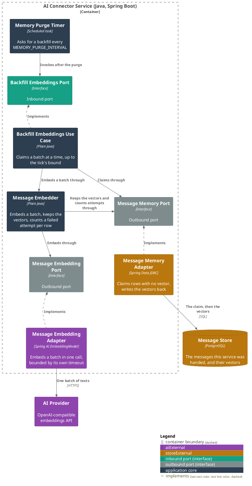
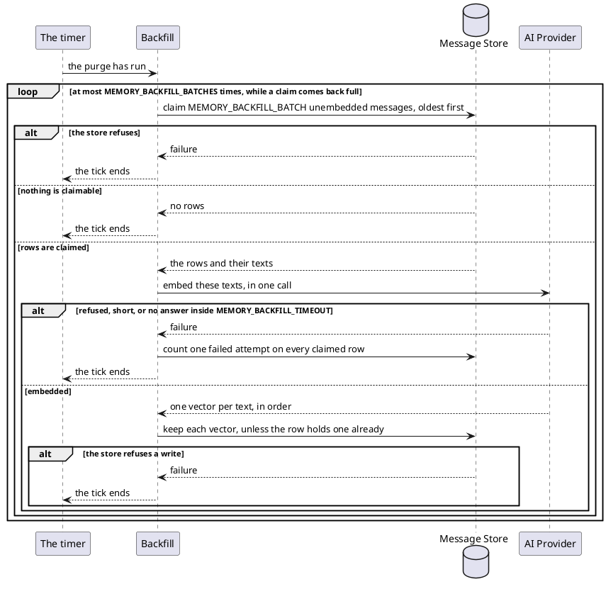

# Embed the messages nothing has embedded yet

- **In:** nothing
- **Out:** nothing
- **Why:** a message the provider could not embed when it arrived still becomes an example later

*Implemented by `BackfillEmbeddingsUseCase`.*

## Prerequisites

- `MEMORY_ENABLED` is on.
- The purge has already run on this tick.

## Collaborators

| Direction | Collaborator                                     | Through                                                   | For                                                              |
|-----------|--------------------------------------------------|-----------------------------------------------------------|------------------------------------------------------------------|
| in        | [The service's own timer](../configuration.md)   | [Configuration](../configuration.md)                      | asking for a backfill every `MEMORY_PURGE_INTERVAL`              |
| out       | [Message store](../contracts/out/database.md)    | [Database](../contracts/out/database.md)                  | claiming messages with no vector, and keeping the vectors        |
| out       | [AI Provider](../contracts/out/ai-provider.md)   | [Embeddings](../contracts/out/ai-provider.md#operations)  | embedding a whole batch in one call                              |

## Outcomes

| Outcome              | When                                                                                              | Result                                                                                                 |
|----------------------|---------------------------------------------------------------------------------------------------|----------------------------------------------------------------------------------------------------------|
| Batch embedded       | a claim answered rows and the provider answered a vector for each                                 | each row holds its vector and no claim; what was already learned about it is untouched                 |
| Backlog bounded      | every claim comes back full                                                                       | at most `MEMORY_BACKFILL_BATCHES` claims of `MEMORY_BACKFILL_BATCH` rows; the rest waits for the next tick |
| Tick finished        | a claim answers fewer rows than `MEMORY_BACKFILL_BATCH`, or none at all                           | the tick ends; nothing more is claimed                                                                 |
| Provider refused     | the provider refuses, answers slower than `MEMORY_BACKFILL_TIMEOUT`, or answers fewer vectors than the batch held | one failed attempt on every claimed row, each claim released; one `WARN`; the tick ends |
| Message given up on  | a row's attempt is the `MEMORY_EMBEDDING_ATTEMPTS`th                                              | one `ERROR` naming that row and carrying no text; it is never claimed again, and the rows behind it move on |
| Store refused        | the claim or a vector write fails                                                                 | one `WARN`; the tick ends where it stood; the next tick starts again                                   |
| Attempt not counted  | the store fails while counting a failed attempt                                                   | the tick ends; the timer logs it at `ERROR`; the next tick starts again                                |
| Vector already there | a turn embedded a claimed row while its batch was out with the provider                           | the row keeps the vector the turn wrote; the batch's write leaves it alone                             |
| Claim retaken        | a claim is older than `MEMORY_PURGE_INTERVAL`                                                     | it is stale and may be claimed again                                                                   |
| Nothing embedded twice | two instances tick together                                                                     | a claim takes only rows no other run holds                                                             |

## Components

## Flow

## References

- [Delete the messages kept past their age](purge-messages.md) — what runs first on the same timer
- [Recall the person's own worked examples](recall-examples.md) — what a vector is for, and what embeds a
  message inside a turn
- [Learn what the ledger did with a message](learn-message-outcome.md) — what a message keeps collecting while
  it waits for a vector
