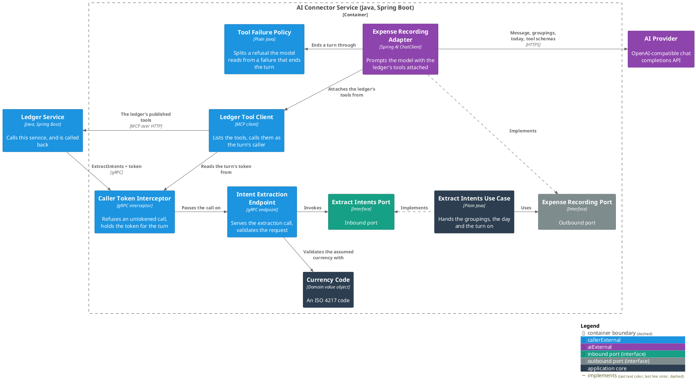
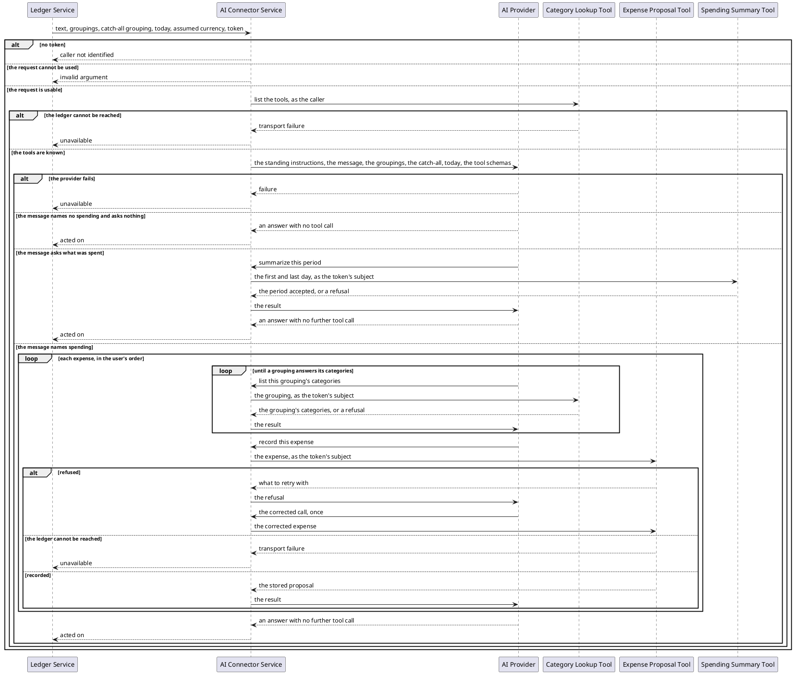

# Record the spending a user's message names

- **In:** the user's text · the groupings their categories are filed under · the grouping to fall back on ·
  the day the turn runs on · an assumed currency (optional) · the caller's token
- **Out:** nothing — a call that returns has been acted on
- **Why:** a user records spending, and asks what they spent, by writing a sentence instead of filling a form

*Implemented by `ExtractIntentsUseCase`.*

## Collaborators

| Direction | Collaborator                                                                                 | Through                                                   | For                                             |
|-----------|----------------------------------------------------------------------------------------------|-----------------------------------------------------------|-------------------------------------------------|
| in        | [Ledger Service](../../../ledger-service/docs/usecases/handle-incoming-message.md)           | [Intent extraction](../contracts/in/intent-extraction.md) | acting on what a user typed, as that user       |
| out       | [AI Provider](../contracts/out/ai-provider.md)                                               | [Chat completions](../contracts/out/ai-provider.md)       | reading the message and deciding what to do     |
| out       | [Category Lookup Tool](../../../ledger-service/docs/usecases/list-categories.md)             | [Ledger tools](../contracts/out/ledger-mcp.md)            | learning which categories a grouping holds      |
| out       | [Expense Proposal Tool](../../../ledger-service/docs/usecases/create-an-expense-proposal.md) | [Ledger tools](../contracts/out/ledger-mcp.md)            | recording one expense                           |
| out       | [Spending Summary Tool](../../../ledger-service/docs/usecases/summarize-spending.md)         | [Ledger tools](../contracts/out/ledger-mcp.md)            | asking for the totals over a period             |

## Outcomes

| Outcome                 | When                                                                | Result                                                          |
|-------------------------|---------------------------------------------------------------------|-----------------------------------------------------------------|
| Turn acted on           | the model finished the turn                                         | an empty answer                                                 |
| Nothing recorded        | the message names no spending                                       | an empty answer                                                 |
| Summary asked for       | the message asks what was spent over a period                       | an empty answer; the ledger puts the totals in front of the user |
| Expense left unrecorded | the ledger refused to record it twice, or the message under-said it | an empty answer; the rest of the message still recorded         |
| Provider unavailable    | the provider is unreachable or errors                               | the turn stops; the caller is told the service is unavailable   |
| Ledger unreachable      | a tool cannot be reached, or the token is refused there             | the turn stops; the caller is told the service is unavailable   |
| Request unusable        | a required field is missing or unreadable                           | refused before the provider is called                           |
| Caller not identified   | the call arrives with no token                                      | refused before the provider is called                           |

## Components

## Flow

## References

- [ADR 0008: The connector hands expense recording to the model](../../../docs/adr/0008-the-connector-hands-expense-recording-to-the-model.md) —
  why this service records nothing itself
- [ADR 0009: The connector does not authenticate its caller](../../../docs/adr/0009-the-connector-does-not-authenticate-its-caller.md) —
  why a token is required here and verified only at the ledger
- [ADR 0010: A message reference rides the caller token](../../../ledger-service/docs/adr/0010-a-message-reference-rides-the-caller-token-not-the-extraction-request.md) —
  why the request carries no message id
