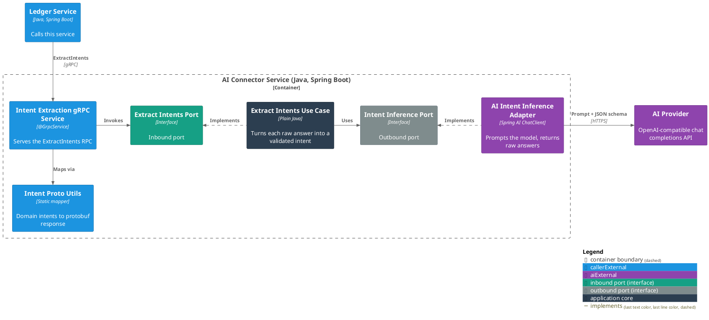
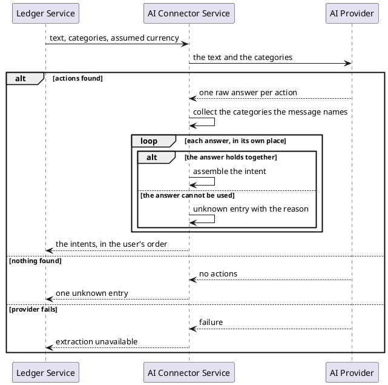

# Extract the intents in a user's message

- **In:** the user's text · the categories they already have · an assumed currency (optional)
- **Out:** one entry per action the message asks for, in the order the user said them
- **Why:** a user records money by writing a sentence instead of filling a form

*Implemented by `ExtractIntentsUseCase`.*

## What is extracted

Every entry names one thing acted on and one action on it.

| Acted on | Actions                      | Carries                                |
|----------|------------------------------|----------------------------------------|
| Category | create, read, update, delete | its name · a new name, when renaming   |
| Expense  | create, read, update, delete | a category · an amount · a description |

**Unknown** is the third kind: an entry that could not be read, carrying why.

Nothing else. A message about anything but a category or an expense comes back unknown.

## Collaborators

| Direction | Collaborator                                           | Through                                                   | For                                                    |
|-----------|--------------------------------------------------------|-----------------------------------------------------------|--------------------------------------------------------|
| in        | [Ledger Service](../contracts/in/intent-extraction.md) | [Intent extraction](../contracts/in/intent-extraction.md) | turning what a user typed into actions on their ledger |
| out       | [AI provider](../contracts/out/ai-provider.md)         | [Intent inference](../contracts/out/ai-provider.md)       | reading the actions out of the text                    |

## Rules

- Categories are a closed set: the caller's, plus the ones the message asks to create.
- The service never proposes a category. An invented one is refused.
- A category named anywhere in the message counts for every entry, before it or after it.
- A category answer that failed to assemble contributes nothing.
- Recording an expense requires an amount and a category. Reading and deleting require neither.
- Renaming a category requires the new name.
- An entry missing what its action requires is unknown, and names the missing piece.
- An amount with no currency and no assumed currency is unknown.
- An amount with more decimal places than its currency is unknown. Never rounded.
- Entries are never compared with one another.
- Ordering, a never-empty answer, per-entry unknown, category matching and the assumed currency are in
  [Intent extraction](../contracts/in/intent-extraction.md#semantics).

## Outcomes

| Outcome              | When                                       | Result                                          |
|----------------------|--------------------------------------------|-------------------------------------------------|
| Intents extracted    | the provider finds one or more actions     | one entry per action, in the user's order       |
| Entry not understood | one answer is missing or unusable          | that position is unknown; its neighbours stand  |
| Nothing found        | the provider finds no action               | a single unknown entry with a reason            |
| Extraction failed    | the provider is unreachable or unreadable  | no intents — extraction is unavailable          |

## Components

## Flow

