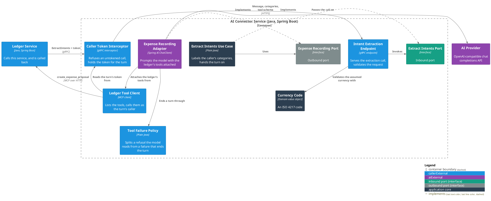
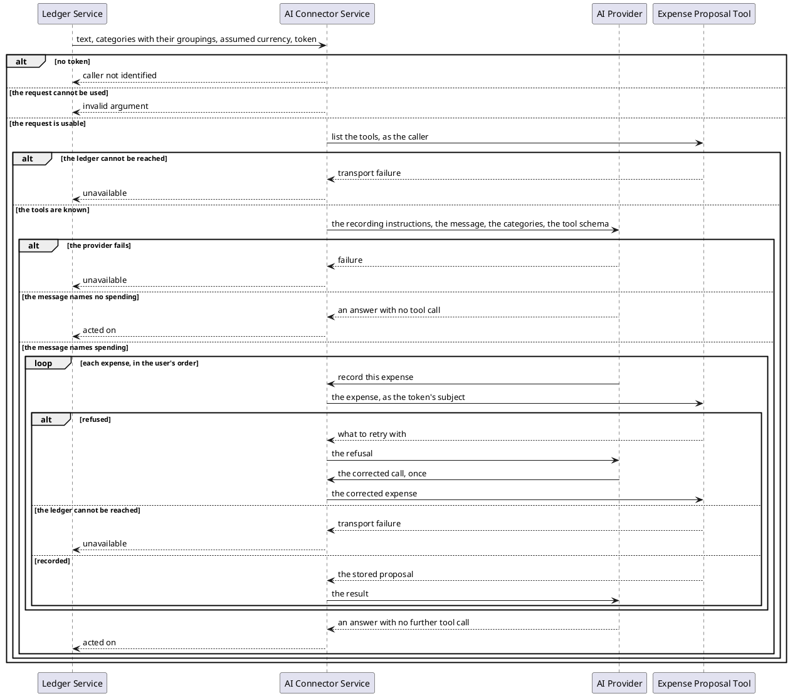

# Record the spending a user's message names

- **In:** the user's text · the categories they already have, each with its grouping · an assumed currency
  (optional) · the caller's token
- **Out:** nothing — a call that returns has been acted on
- **Why:** a user records spending by writing a sentence instead of filling a form

*Implemented by `ExtractIntentsUseCase`.*

## Collaborators

| Direction | Collaborator                                                                                 | Through                                                   | For                                             |
|-----------|----------------------------------------------------------------------------------------------|-----------------------------------------------------------|-------------------------------------------------|
| in        | [Ledger Service](../../../ledger-service/docs/usecases/handle-incoming-message.md)           | [Intent extraction](../contracts/in/intent-extraction.md) | acting on what a user typed, as that user       |
| out       | [AI Provider](../contracts/out/ai-provider.md)                                               | [Chat completions](../contracts/out/ai-provider.md)       | reading the message and deciding what to record |
| out       | [Expense Proposal Tool](../../../ledger-service/docs/usecases/create-an-expense-proposal.md) | [Expense proposal tool](../contracts/out/ledger-mcp.md)   | recording one expense                           |

## Rules

- A caller's token is required. Without one the model is never prompted.
- The token is opaque: held for the turn, carried on every tool call, never parsed, logged or stored.
- Spending is recorded and nothing else — no category is created, renamed or deleted, and nothing is read back
  for the user.
- The model calls the tool once per expense, in the order the user said them.
- The caller's categories are a closed set, offered as `Grouping > Category` labels; a name is never invented.
- The set carries a catch-all, so every expense has somewhere to be filed.
- An expense refused by the ledger is corrected against the refusal and tried once more.
- An expense refused a second time is left unrecorded, and the rest of the message is still recorded.
- An expense whose amount, currency or category cannot be told from the message is left unrecorded.
- An amount stated with no currency takes the assumed currency; with none assumed the expense is left
  unrecorded.
- The merchant is recorded when the message names one.
- A message naming no spending is not a failure.
- The same message handled twice records its expenses twice.
- What a turn recorded is visible in the ledger, not here.

## Outcomes

| Outcome                 | When                                                      | Result                                                        |
|-------------------------|-----------------------------------------------------------|---------------------------------------------------------------|
| Turn acted on           | the model finished the turn                               | an empty answer                                               |
| Nothing recorded        | the message names no spending                             | an empty answer                                               |
| Expense left unrecorded | the ledger refused it twice, or the message under-said it | an empty answer; the rest of the message still recorded       |
| Provider unavailable    | the provider is unreachable or errors                     | the turn stops; the caller is told the service is unavailable |
| Ledger unreachable      | the tool cannot be reached, or the token is refused there | the turn stops; the caller is told the service is unavailable |
| Caller not identified   | the call arrives with no token                            | refused before the provider is called                         |

## Components

## Flow

