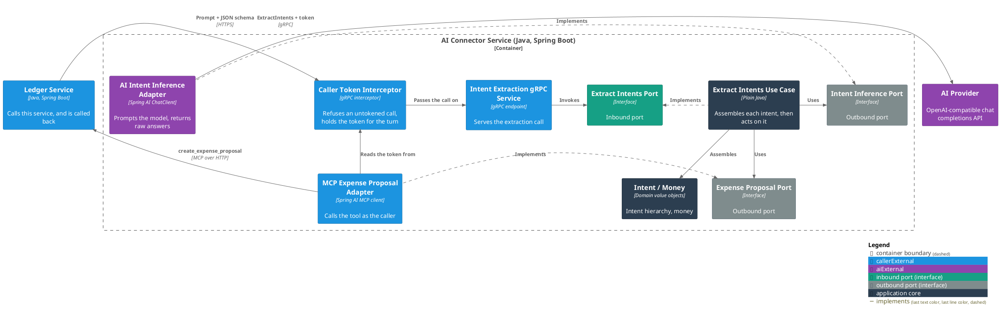
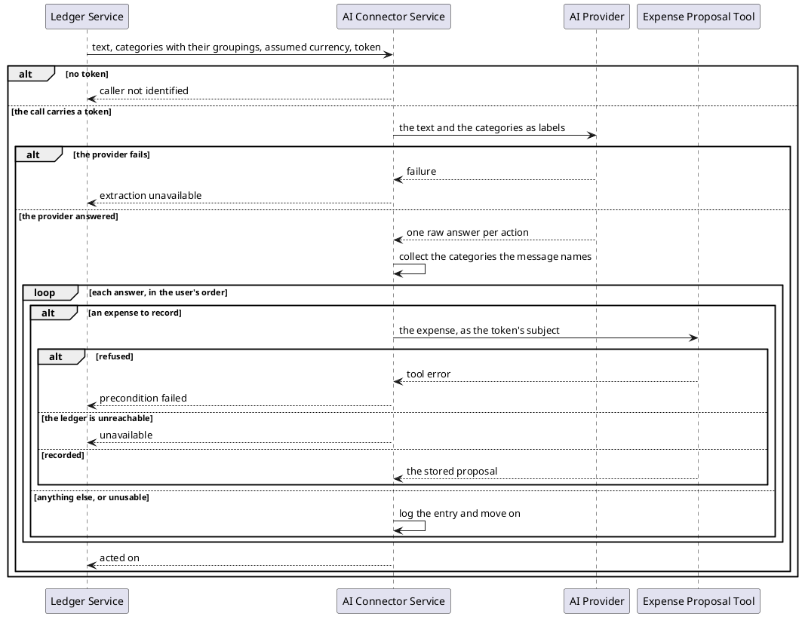

# Act on the actions in a user's message

- **In:** the user's text · the categories they already have, each with its grouping · an assumed currency
  (optional) · the caller's token
- **Out:** nothing — a call that returns has been acted on
- **Why:** a user records spending by writing a sentence instead of filling a form

*Implemented by `ExtractIntentsUseCase`.*

## What is read out of the message

Every entry names one thing acted on and one action on it.

| Acted on | Actions                      | Carries                                               | Acted on further        |
|----------|------------------------------|-------------------------------------------------------|-------------------------|
| Category | create, read, update, delete | its name · a new name, when renaming                  | no — logged and skipped |
| Expense  | create                       | a category · its grouping · an amount · a description | proposed to the ledger  |
| Expense  | read, update, delete         | a category · an amount · a description, each optional | no — logged and skipped |

**Unknown** is the third kind: an entry that could not be read, carrying why. Logged and skipped.

Nothing else. A message about anything but a category or an expense is unknown.

## Collaborators

| Direction | Collaborator                                                                                 | Through                                                   | For                                         |
|-----------|----------------------------------------------------------------------------------------------|-----------------------------------------------------------|---------------------------------------------|
| in        | [Ledger Service](../../../ledger-service/docs/usecases/handle-incoming-message.md)           | [Intent extraction](../contracts/in/intent-extraction.md) | acting on what a user typed, as that user   |
| out       | [AI Provider](../contracts/out/ai-provider.md)                                               | [Intent inference](../contracts/out/ai-provider.md)       | reading the actions out of the text         |
| out       | [Expense Proposal Tool](../../../ledger-service/docs/usecases/create-an-expense-proposal.md) | [Expense proposal tool](../contracts/out/ledger-mcp.md)   | recording each expense the message asks for |

## Rules

- A caller's token is required. Without one nothing happens and the model is never prompted.
- The token is opaque: held for the call, put on every proposal, never parsed, logged or stored.
- Categories are a closed set: the caller's, plus the ones the message asks to create.
- The service never proposes a category. An invented one is refused.
- A category named anywhere in the message counts for every entry, before it or after it.
- A category answer that failed to assemble contributes nothing.
- The closed set reaches the model as `Grouping > Category` labels.
- An answer naming a category is matched by label first, then by bare name.
- A bare name matching several categories is unknown, naming the labels to retry with.
- Matching ignores case; the caller's spelling is what travels on.
- A matched category carries its grouping onward; a category the message asks to create has none.
- Only an expense to record is proposed. Every other entry is logged by what it acted on and what it asked for.
- Expenses are proposed in the order the user said them.
- The first proposal the ledger refuses or cannot take ends the turn. Earlier proposals stand.
- A message asking for nothing this service does is not a failure.
- An amount with no currency and no assumed currency is unknown.
- What each action requires is the [expense](../domain/expense-intent.md) and
  [category](../domain/category-intent.md) intents' own rule.

## Outcomes

| Outcome               | When                                                  | Result                                                             |
|-----------------------|-------------------------------------------------------|--------------------------------------------------------------------|
| Turn acted on         | every expense to record was accepted                  | an empty answer                                                    |
| Nothing to act on     | the message asks for nothing this service does        | an empty answer; each entry logged                                 |
| Entry skipped         | one answer is unusable or names no placeable category | that entry logged; the rest of the message still acted on          |
| Proposal refused      | the ledger will not record an expense                 | the turn stops; the caller is told the precondition failed         |
| Ledger unreachable    | a proposal cannot be delivered                        | the turn stops; the caller is told the service is unavailable      |
| Extraction failed     | the provider is unreachable or its answer unreadable  | nothing is proposed; the caller is told the service is unavailable |
| Caller not identified | the call arrives with no token                        | refused before the provider is called                              |

## Components

## Flow

