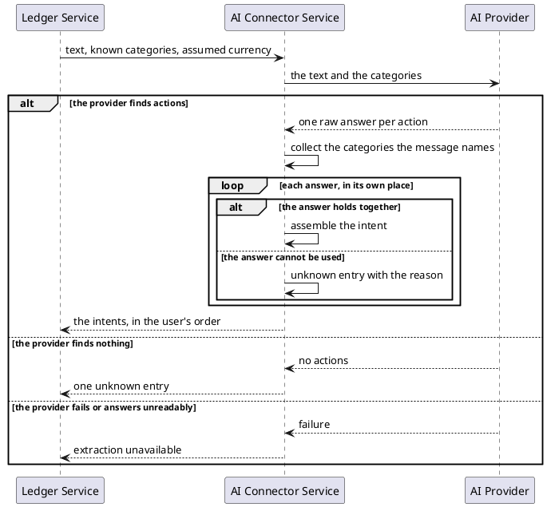

# Extract the intents in a user's message

Takes one line a user wrote about their money, together with the categories that user already has, and returns
the actions the line asks for — creating a category, filing an expense, reading or deleting one — so the caller
can carry them out.

*Implemented by `ExtractIntentsUseCase`.*

## Collaborators

| Direction | Collaborator                                                     | Through                                                          | For                                                   |
|-----------|------------------------------------------------------------------|------------------------------------------------------------------|-------------------------------------------------------|
| in        | [Ledger Service](../contracts/in/intent-extraction.md)           | [Intent extraction](../contracts/in/intent-extraction.md)        | turning what a user typed into actions on their ledger |
| out       | [AI provider](../contracts/out/ai-provider.md)                   | [Intent inference](../contracts/out/ai-provider.md)              | reading the actions out of the text                    |

## Flow

1. A caller sends the user's text, the categories that user already has, and — optionally — the currency to
   assume when an amount is stated without one.
2. The text and the categories go to the AI provider, which answers with one raw answer per action it found.
3. Every category the message itself names joins the categories available to the message, whatever the action
   asked for it and wherever in the message it sits.
4. Each answer is turned into an intent on its own: what it acts on, what is to be done with it, the category it
   is filed under, the amount, the description.
5. An expense's category is matched against that combined set, ignoring case; the caller's own spelling is
   returned.
6. An amount stated without a currency takes the request's assumed currency.
7. An answer that cannot be made sense of becomes an unknown entry in its own position, carrying the reason it
   was rejected.

## Rules

- The set of categories an expense may be filed under is closed: the ones the caller sent plus the ones the same
  message asks to create. A category the provider invents is refused, and the service never proposes one.
- A category named anywhere in the message counts for every entry, before or after it — *"I ordered a coffee for
  5 euros while traveling, so create a Travel category too"* files the coffee under Travel. A category answer
  that itself failed to assemble contributes nothing.
- Recording an expense needs both an amount and a category; reading or deleting one needs neither. Renaming a
  category needs the new name. An answer missing what its action requires is unknown, and says which piece was
  missing.
- An amount with no currency and no assumed currency is not money, and its entry is unknown. So is one carrying
  more decimal places than its currency has: the amount is never rounded to fit.
- Entries are never compared with one another. A message that deletes a category and files an expense under it
  is returned as it was said; whether the pair can be carried out is the caller's judgement.
- The promises made to the caller — ordering, a never-empty answer, unknown per entry, how money is carried —
  are in [Intent extraction](../contracts/in/intent-extraction.md#semantics).

## Outcomes

| Outcome              | When                                                          | Result                                                                          |
|----------------------|---------------------------------------------------------------|---------------------------------------------------------------------------------|
| Intents extracted    | the provider finds one or more actions                        | one entry per action, in the order the user said them                           |
| Entry not understood | one answer is missing or contradicts what its action requires | that position holds an unknown entry with the reason; its neighbours are unaffected |
| Nothing found        | the provider finds no action in the message                   | a single unknown entry with a reason                                            |
| Extraction failed    | the provider cannot be reached, or its answer cannot be read  | no intents — the caller is told extraction is unavailable                       |

## Sequence

