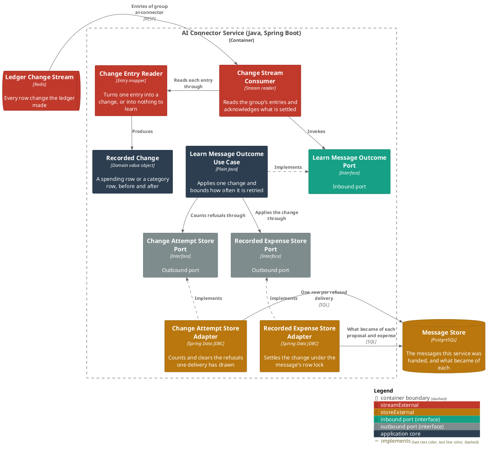
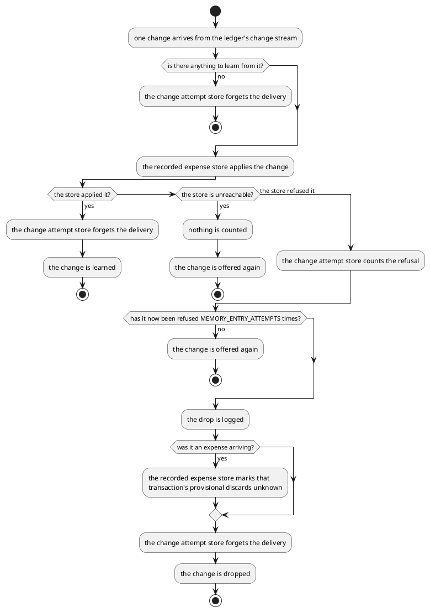

# Learn what the ledger did with a message

- **In:**
  - one change the ledger made to a proposal, an expense or a category
  - the delivery that carried it
- **Out:** one of three answers — the change was learned, it should be offered again, or it was dropped
- **Why:** the service can say, later, which expenses came out of a message and where each ended up filed

*Implemented by `LearnMessageOutcomeUseCase`.*

## Prerequisites

- `MEMORY_ENABLED` is on.
- The ledger publishes its changes.
- The message the change names is one this service kept.

## Collaborators

| Direction | Collaborator                                                                                        | Through                                                | For                                                            |
|-----------|-----------------------------------------------------------------------------------------------------|--------------------------------------------------------|----------------------------------------------------------------|
| in        | [Ledger Service](../../../ledger-service/docs/contracts/out/change-stream.md)                       | [The ledger's changes](../contracts/out/change-stream.md) | hearing what the ledger did, without asking it                 |
| out       | [Recorded expense store](../contracts/out/database.md)                                              | [Database](../contracts/out/database.md)                | keeping what became of each proposal and expense               |
| out       | [Change attempt store](../contracts/out/database.md)                                                | [Database](../contracts/out/database.md)                | counting how often one delivery has been refused               |

## Outcomes

| Outcome                     | When                                                                                                     | Result                                                                          |
|-----------------------------|------------------------------------------------------------------------------------------------------------|-----------------------------------------------------------------------------------|
| Proposal learned            | the ledger proposed an expense from the message, or refiled a pending one                                    | one pending row holds the amount, the currency, the category and both names        |
| Discard learned             | a proposal left the ledger alone, unaccompanied by an expense of the same ledger transaction                 | that row is discarded, remembering the transaction it left in                      |
| Acceptance learned          | a proposal left and an expense arrived in one ledger transaction, in either order, with the same description, merchant, amount, currency and category | one accepted row, naming both the proposal and the expense |
| Expense learned on its own   | an expense arrived and no discarded row of that transaction has the same description, merchant, amount, currency and category | a new accepted row for the expense, remembering the transaction |
| Expense refiled             | the ledger refiled a recorded expense                                                                        | its row takes the new category and both names                                      |
| Expense removed             | the ledger removed a recorded expense                                                                        | its row is gone; the message stays                                                 |
| Category renamed            | a category sitting under a grouping was renamed                                                              | every row filed under that category takes the new name                             |
| Grouping renamed            | a grouping was renamed                                                                                       | every row of that person under the old grouping name takes the new one             |
| Nothing to learn            | the change names no message, or names one this service does not keep                                         | nothing is written; the change is finished with                                    |
| Nothing to learn            | a category was created, deleted, or moved under another grouping without being renamed                       | nothing is written; the change is finished with                                    |
| Change held                 | the store cannot be reached                                                                                  | nothing is counted against the change; it is offered again                         |
| Change held                 | the store refused the change, fewer than `MEMORY_ENTRY_ATTEMPTS` times                                       | the refusal is counted; the change is offered again                                |
| Change dropped              | the store refused the change `MEMORY_ENTRY_ATTEMPTS` times                                                   | logged at `ERROR` naming the delivery, the kind of row, what happened to it and its id; the count is cleared |
| Acceptance abandoned        | the dropped change was an expense arriving                                                                   | every discarded row of that message and that transaction becomes unknown           |
| Acceptance left as it stood | that abandonment is itself refused                                                                           | logged at `WARN`; the change is still dropped                                      |

## Components

## Flow

## References

- [Record the spending a user's message names](extract-intents.md) — what puts the message these changes hang off
  into the store
- [Delete the messages kept past their age](purge-messages.md) — what removes a message, and everything learned
  about it
