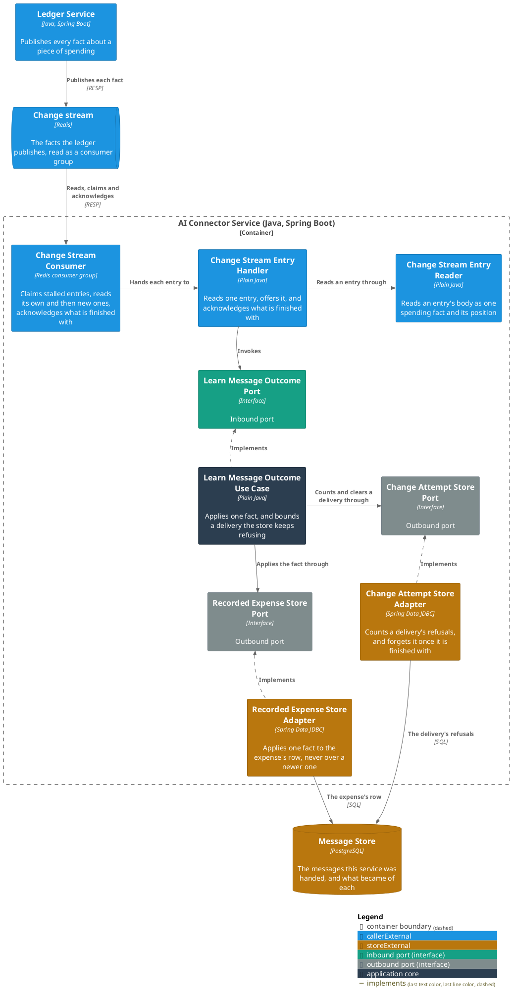
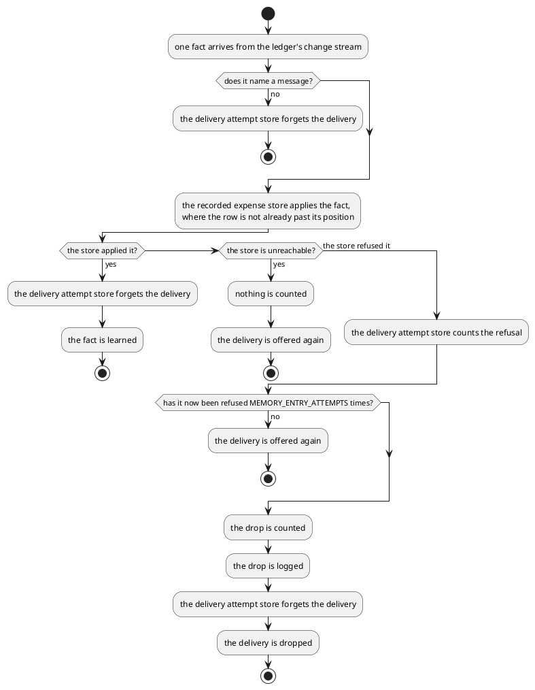

# Learn what the ledger did with a message

- **In:**
  - one fact the ledger published about a proposal or an expense
  - the position that fact stands at on the stream
  - the delivery that carried it
- **Out:** one of three answers — the fact was applied, it should be offered again, or it was dropped
- **Why:** the service can say, later, which expenses came out of a message and where each ended up filed

*Implemented by `LearnMessageOutcomeUseCase`.*

## Prerequisites

- `MEMORY_ENABLED` is on.
- The ledger publishes its facts.

## Collaborators

| Direction | Collaborator                                                                  | Through                                                 | For                                              |
|-----------|-------------------------------------------------------------------------------|---------------------------------------------------------|--------------------------------------------------|
| in        | [Ledger Service](../../../ledger-service/docs/contracts/out/change-stream.md) | [The ledger's facts](../contracts/out/change-stream.md) | hearing what the ledger did                      |
| out       | [Recorded expense store](../contracts/out/database.md)                        | [Database](../contracts/out/database.md)                | keeping what became of each proposal and expense |
| out       | [Delivery attempt store](../contracts/out/database.md)                        | [Database](../contracts/out/database.md)                | counting how often one delivery has been refused |

## Outcomes

One row per fact of
[the ledger's catalogue](../../../ledger-service/docs/contracts/out/change-stream.md#the-catalogue).

| Outcome            | When                                                                 | Result                                                                                                                                                                                                                    |
|--------------------|----------------------------------------------------------------------|---------------------------------------------------------------------------------------------------------------------------------------------------------------------------------------------------------------------------|
| Proposal learned   | `ProposalCreated`                                                    | one row holds the whole entry, pending                                                                                                                                                                                    |
| Proposal refiled   | `ProposalRefiled`                                                    | that row takes the new category and grouping, and stays pending                                                                                                                                                           |
| Proposal accepted  | `ProposalAccepted`                                                   | that row is accepted                                                                                                                                                                                                      |
| Proposal discarded | `ProposalDiscarded`                                                  | that row is discarded                                                                                                                                                                                                     |
| Expense learned    | `ExpenseRecorded`, naming a message kept here                        | one accepted row holds the whole entry                                                                                                                                                                                    |
| Expense refiled    | `ExpenseRefiled`                                                     | one accepted row holds the new category and grouping                                                                                                                                                                      |
| Older fact ignored | the fact stands at a position the row was already written past       | nothing is written; the row keeps the newer fact                                                                                                                                                                          |
| Nothing to learn   | the fact names no message, or names one this service does not keep   | nothing is written; the delivery is finished with                                                                                                                                                                         |
| Delivery held      | the store cannot be reached                                          | nothing is counted against the delivery; it is offered again                                                                                                                                                              |
| Delivery held      | the store refused the fact, fewer than `MEMORY_ENTRY_ATTEMPTS` times | the refusal is counted; the delivery is offered again                                                                                                                                                                     |
| Delivery dropped   | the store refused the fact `MEMORY_ENTRY_ATTEMPTS` times             | counted as a [dropped delivery](../contracts/in/operations.md#meters); the fact the delivery carried is never learned; logged at `ERROR` naming the delivery, the status it carried and the expense; the count is cleared |

A fact for an expense no row holds yet is inserted whole, whatever it says happened. A fact's status replaces
the row's, whatever the row held before.

## Components

## Flow

## References

- [Record the spending a user's message names](extract-intents.md) — what puts the message these facts hang off
  into the store
- [Recall the person's own worked examples](recall-examples.md) — what a decided expense becomes on a later turn
- [Embed the messages nothing has embedded yet](backfill-embeddings.md) — what a message still needs before it
  can be recalled
- [Delete the messages kept past their age](purge-messages.md) — what removes a message, and everything learned
  about it
