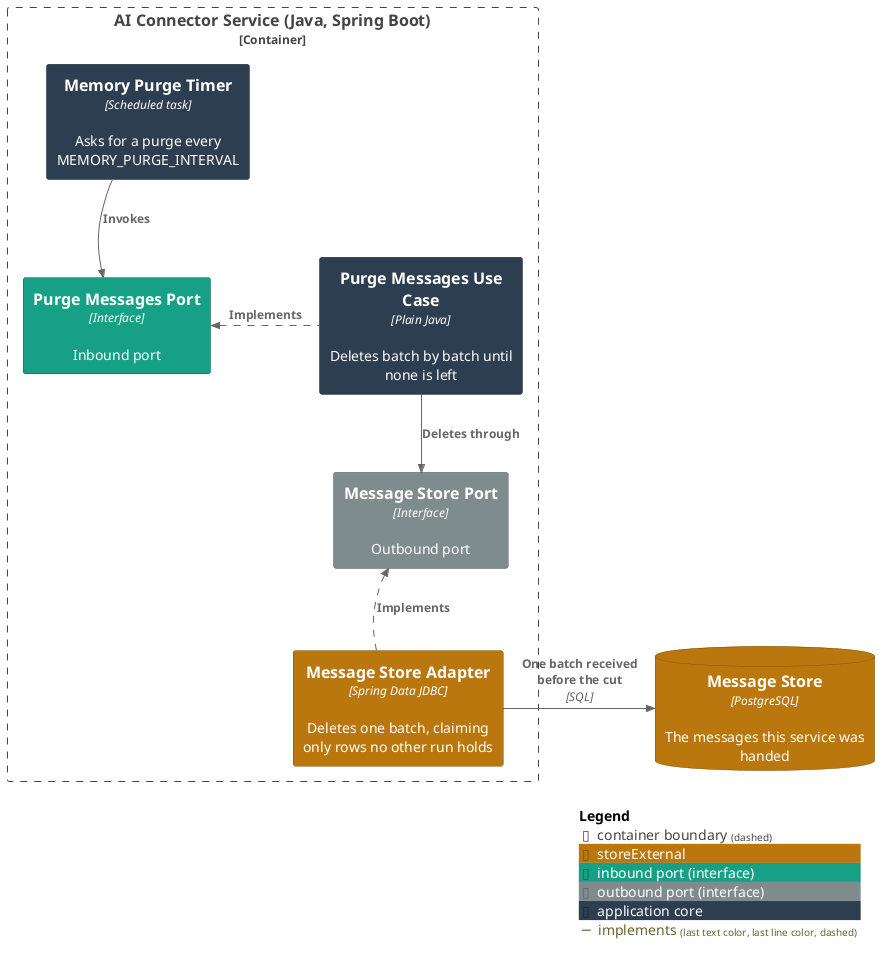
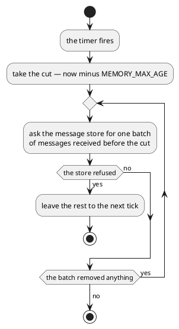

# Delete the messages kept past their age

- **In:** nothing
- **Out:** nothing
- **Why:** what a person wrote does not stay on this service longer than the retention it was promised

*Implemented by `PurgeMessagesUseCase`.*

## Prerequisites

- `MEMORY_ENABLED` is on.

## Collaborators

| Direction | Collaborator                                                   | Through                                | For                                            |
|-----------|-----------------------------------------------------------------|----------------------------------------|------------------------------------------------|
| in        | [The service's own timer](../configuration.md)                 | [Configuration](../configuration.md)   | asking for a purge every `MEMORY_PURGE_INTERVAL` |
| out       | [Message store](../contracts/out/database.md)                  | [Database](../contracts/out/database.md) | deleting the messages received before the cut  |

## Outcomes

| Outcome                | When                                                          | Result                                                                  |
|------------------------|----------------------------------------------------------------|-------------------------------------------------------------------------|
| Messages removed       | a message was received before now minus `MEMORY_MAX_AGE`      | it is deleted with everything learned about it, `MEMORY_PURGE_BATCH` at a time, until a batch removes none |
| Nothing to remove      | every kept message is younger than `MEMORY_MAX_AGE`           | the run ends after one look                                              |
| Purge deferred         | the store refuses a batch                                     | the run ends where it stood; the next tick starts again                  |

## Components

## Flow

## References

- [ADR 0017: The connector verifies its caller token and keeps the message it names](../../../docs/adr/0017-the-connector-verifies-its-caller-token-and-keeps-the-message-it-names.md) —
  why this service keeps a message at all, and why it is bounded
- [Record the spending a user's message names](extract-intents.md) — what puts a message in the store
- [Learn what the ledger did with a message](learn-message-outcome.md) — what else hangs off a message, and goes
  with it
