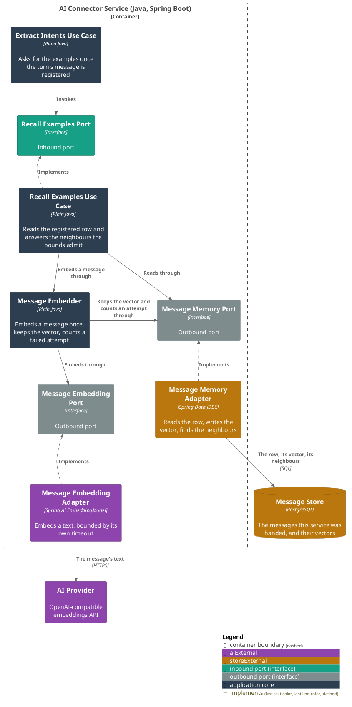
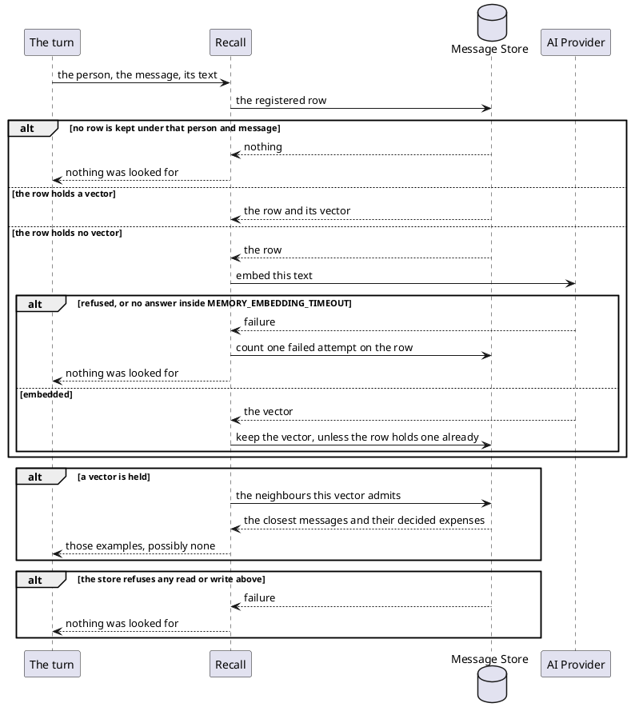
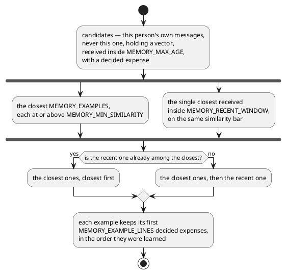

# Recall the person's own worked examples

- **In:**
  - the person and the message the turn's token names
  - the text of that message
- **Out:**
  - either nothing was looked for, or the [message examples](../domain/message-example.md) the bounds admit
- **Why:** the model files a person's spending the way that person has already agreed to file it

*Implemented by `RecallExamplesUseCase`.*

## Prerequisites

- `MEMORY_ENABLED` is on.
- The turn's message has been registered under the person and the message the token names.

## Collaborators

| Direction | Collaborator                                                     | Through                                                  | For                                                             |
|-----------|------------------------------------------------------------------|----------------------------------------------------------|-----------------------------------------------------------------|
| in        | [Record the spending a user's message names](extract-intents.md) | Recall Examples Port                                     | putting the person's own filing habits in front of the model    |
| out       | [Message store](../contracts/out/database.md)                    | [Database](../contracts/out/database.md)                 | the registered row, its vector, and the neighbours it admits    |
| out       | [AI Provider](../contracts/out/ai-provider.md)                   | [Embeddings](../contracts/out/ai-provider.md#operations) | turning the message into the vector the neighbours are found by |

## Outcomes

| Outcome              | When                                                                    | Result                                                                                 |
|----------------------|-------------------------------------------------------------------------|----------------------------------------------------------------------------------------|
| Examples found       | earlier messages clear every bound                                      | those messages and their decided expenses                                              |
| Nothing close enough | no earlier message clears `MEMORY_MIN_SIMILARITY` inside the bounds     | a retrieval that found nothing                                                         |
| Message not known    | the store holds no row under that person and message                    | nothing was looked for                                                                 |
| Vector reused        | the registered row already holds a vector                               | no embedding call; that vector is the query                                            |
| Message embedded     | the registered row holds no vector                                      | it is embedded once, the vector is kept on the row, and it is the query                |
| Vector already there | a backfill or an earlier turn wrote one while this turn was embedding   | the row keeps the one it holds; the turn queries with the one it computed              |
| Embedding refused    | the provider refuses, or answers slower than `MEMORY_EMBEDDING_TIMEOUT` | nothing was looked for; one failed attempt is counted on the row; one `WARN`           |
| Message given up on  | that attempt is the `MEMORY_EMBEDDING_ATTEMPTS`th                       | one `ERROR` naming the row and carrying no text; it is never a neighbour               |
| Store refused        | the store cannot be reached, or refuses any read or the vector write    | nothing was looked for; one `WARN` naming the person and the message, carrying no text |

## Components

## Flow

### Getting to a query

### Choosing the examples

## References

- [ADR 0017: The connector verifies its caller token and keeps the message it names](../../../docs/adr/0017-the-connector-verifies-its-caller-token-and-keeps-the-message-it-names.md) —
  why this service keeps a person's messages at all
- [Embedding](../domain/embedding.md) — what a message is compared by
- [Learn what the ledger did with a message](learn-message-outcome.md) — what decides an expense, and so what
  makes a message eligible as an example
- [Embed the messages nothing has embedded yet](backfill-embeddings.md) — what gives a vector to a message no
  turn embedded
- [Delete the messages kept past their age](purge-messages.md) — what takes a message out of the memory again
