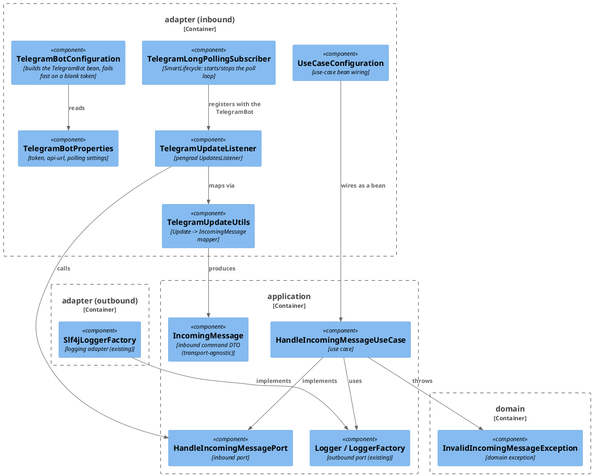
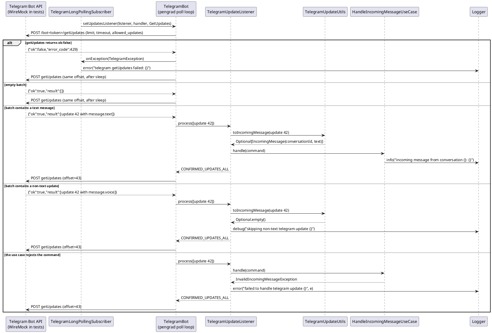

# Plan: Telegram Update Listener (Long Polling, Debug Print)

**Affected Modules:** `ledger-service`

## Objective

Give `ledger-service` its first inbound entry point: a Telegram listener that authenticates with the bot token,
long-polls the Telegram Bot API for updates, and — for text messages only — prints the message text through the
application's `Logger` port. Everything else is skipped. No persistence, no reply, no expense pipeline: this is a
debug-level "the wiring works" slice.

The Telegram base URL must be configurable so tests can point the whole polling loop at the existing WireMock
singleton instead of `api.telegram.org`.

## Proposed Solution

### Library

`com.github.pengrad:java-telegram-bot-api:10.1.0` (latest release on Maven Central). Two properties of this
library drive the design:

- **URL swapping is a first-class builder option.** `TelegramBot.Builder.apiUrl(String)` replaces the default
  `https://api.telegram.org/bot`; the effective base URL is `apiUrl + botToken + "/"`. Pointing `apiUrl` at
  `http://localhost:<wireMockPort>/bot` makes every Bot API call land on WireMock, path
  `/bot<token>/<method>`.
- **Every request is an HTTP `POST` with an `application/x-www-form-urlencoded` body** — including `getUpdates`.
  Parameters (`offset`, `limit`, `timeout`, `allowed_updates`) are form fields, *not* query parameters
  (`TelegramBotClient.createRequest` builds `.post(FormBody)` unconditionally). All WireMock stubs and
  verifications in this plan therefore use `post(...)` + `withFormParam(...)`, never `get(...)` +
  `withQueryParam(...)`.

Long polling is `bot.setUpdatesListener(listener, exceptionHandler, getUpdatesRequest)`, which starts pengrad's
`SleepUpdatesHandler`: an async OkHttp loop that calls `getUpdates`, hands the batch to
`UpdatesListener.process(List<Update>)`, and advances `offset` to `lastUpdateId + 1` when the listener returns
`CONFIRMED_UPDATES_ALL`. `bot.removeGetUpdatesListener()` stops it.

The `GetUpdates` request carries `allowed_updates=["message"]`, so Telegram sends only message updates.

Transitive dependencies: `gson`, `okhttp` 5.3.2, `kotlin-stdlib-jdk8` 2.3.21. Spring Boot 4.1.0's BOM does not
manage `okhttp` at all (no conflict) and manages `kotlin.version` at exactly 2.3.21 (no conflict). It does manage
`gson` at 2.13.2, which will *downgrade* pengrad's requested 2.14.0 — a minor-version downgrade against basic
`Gson`/`fromJson`/`toJson` usage, so low risk, but the stabilization step below verifies the resolved graph
explicitly rather than assuming.

### Layering — the core does not know it is talking to Telegram

The application core must not know **which** messenger delivered a message; a future WhatsApp, Signal, or web
form must reach the same use case without touching a line of it. Two consequences:

- **Nothing in `domain`/`application` carries a transport name.** The inbound port is
  `HandleIncomingMessagePort`, not `HandleTelegramMessagePort`; the command is `IncomingMessage`, not
  `IncomingTelegramMessage`. Only the adapter subpackage names its external system (`adapter/telegram`,
  `TelegramUpdateListener`).
- **Nothing in `domain`/`application` carries a transport-shaped field.** `IncomingMessage` identifies the
  conversation with a `String conversationId`, not a Telegram `long chatId` — the adapter renders the Telegram
  chat id into that string. Numeric chat ids are a Telegram fact.

The pengrad types (`Update`, `Message`, `Chat`) are transport detail for the same reason and must not cross into
the core — the conventions already require `domain`/`application` to depend on nothing outside the JDK. The
existing ArchUnit rule bans `org.springframework..`, `jakarta..`, and `org.slf4j..`; this plan extends it with
`com.pengrad..` **and** adds a naming rule banning external-system names from core type names, so the boundary
is enforced rather than merely intended. `docs/conventions/architecture.md` gains the same rule in prose
(see Post-Implementation Steps).

This feature adds one domain type — the exception below — and no domain model or value objects: there is no
expense, user, or money concept in a debug print.

### Files

**Domain layer**

- `domain/exception/InvalidIncomingMessageException.java` — unchecked domain exception thrown when an incoming
  message is unusable (absent, or carrying no text). Per the conventions, the core throws a domain exception
  rather than letting a raw `NullPointerException` escape.

**Application layer**

- `application/dto/IncomingMessage.java` — `record IncomingMessage(String conversationId, String text)`, the
  inbound-port command. Plain JDK types, no transport vocabulary.
- `application/port/HandleIncomingMessagePort.java` — inbound port: `void handle(IncomingMessage message)`.
- `application/usecase/HandleIncomingMessageUseCase.java` — implements the port; takes `LoggerFactory` in its
  constructor and derives `log`; validates the command and logs the text at `info`.

**Adapter layer — `adapter/telegram` (new subpackage, one per external system per the conventions)**

- `adapter/telegram/package-info.java`
- `adapter/telegram/TelegramBotProperties.java` — `@ConfigurationProperties("telegram.bot")` record holding the
  token, the API URL, and a nested `Polling` record (`enabled`, `limit`, `timeoutSeconds`, `sleepMillis`).
- `adapter/telegram/TelegramUpdateUtils.java` — static mapper,
  `Optional<IncomingMessage> toIncomingMessage(Update)`; empty for anything that is not a text message in a
  chat. This is where the Telegram `long` chat id becomes a `String conversationId`.
- `adapter/telegram/TelegramUpdateListener.java` — implements pengrad's `UpdatesListener`; maps each update and
  delegates to `HandleIncomingMessagePort`, skipping non-text updates with a `debug` line and swallowing +
  logging a per-update failure so one bad update cannot stall the offset. Returns `CONFIRMED_UPDATES_ALL`.
- `adapter/telegram/TelegramLongPollingSubscriber.java` — `SmartLifecycle`; `start()` calls
  `bot.setUpdatesListener(listener, exceptionHandler, new GetUpdates()...)`, `stop()` calls
  `bot.removeGetUpdatesListener()`. Its constructor takes the listener typed as the `UpdatesListener` interface,
  so tests can pass a recording fake.
- `adapter/telegram/TelegramBotConfiguration.java` — `@Configuration` building the `TelegramBot` bean from the
  properties, plus the listener and the subscriber (the latter gated on `telegram.bot.polling.enabled`), and
  failing fast when polling is enabled with a blank token.

**Adapter layer — `adapter/config`**

- `adapter/config/UseCaseConfiguration.java` — the one place use-case beans are wired; exposes
  `HandleIncomingMessagePort` as `new HandleIncomingMessageUseCase(loggerFactory)`.

**Configuration**

- `gradle.properties`, `build.gradle` — pengrad dependency.
- `src/main/resources/application.yaml` — new `telegram.bot` block.
- `src/test/resources/application-test.yaml` — **new file**; the `test` profile is already active via
  `AbstractSystemTest` but has had no property source until now.

**Test infrastructure** (`bot.finance.common`)

- `LogCapture.java` — attaches a Logback `ListAppender` to a named logger and exposes the formatted messages.
- `TelegramFixtures.java` — builds `getUpdates` response bodies (text update, voice update, empty, `ok:false`).
- `TelegramTestBot.java` — builds a real `TelegramBot` pointed at the WireMock singleton for a given token, and
  exposes the token-scoped `getUpdates` path both the tests and `WireMockStubs` need.
- `WireMockStubs.java` — extended with token-scoped Telegram `getUpdates` stub helpers.
- `AbstractSystemTest.java` — extended with a `@DynamicPropertySource` binding `telegram.bot.api-url` to the
  WireMock singleton's port (which is only known at runtime).

No migration and no API schema change: this feature touches neither the database nor an HTTP contract.

### Configuration shape

```yaml
telegram:
  bot:
    token: ${TELEGRAM_BOT_TOKEN:}
    api-url: ${TELEGRAM_API_URL:https://api.telegram.org/bot}
    polling:
      enabled: ${TELEGRAM_POLLING_ENABLED:true}
      limit: 100
      timeout-seconds: 30
      sleep-millis: 100
```

**Fail-fast on a missing token.** `TelegramBotConfiguration` throws at context startup when
`polling.enabled` is `true` and `token` is blank, with a message naming `TELEGRAM_BOT_TOKEN`. The service still
boots without a token for local database work — by setting `TELEGRAM_POLLING_ENABLED=false` — but it never
silently long-polls `https://api.telegram.org/bot/getUpdates` with an empty token.

`src/test/resources/application-test.yaml`:

```yaml
telegram:
  bot:
    token: default-test-token
    polling:
      enabled: true
      limit: 100
      timeout-seconds: 1
      sleep-millis: 50
```

Polling stays **enabled** by default in the `test` profile — most future system tests will want it, and the
per-class token scoping below keeps an idle poller from interfering with anything. `api-url` is deliberately
absent from the test profile: `AbstractSystemTest` supplies it dynamically, since the WireMock port is assigned
at JVM start.

### Why the system tests can observe the print, and why each owns a token

Long polling gives two independent observable outcomes, and each system test asserts both:

1. **The update was consumed** — WireMock receives a follow-up `POST /bot<token>/getUpdates` whose form body
   carries `offset=<updateId + 1>`. Only pengrad's own loop advances that offset, and only after
   `process(...)` returned `CONFIRMED_UPDATES_ALL`.
2. **The text was printed** — a Logback `ListAppender` attached to
   `bot.finance.application.usecase.HandleIncomingMessageUseCase` captured the message text. The production
   `Slf4jLoggerFactory` names loggers after the class, and `logback.xml` already sets `bot.finance` to `DEBUG`,
   so nothing is filtered out.

The offset is the problem and the token is the solution. A booted context runs **one** poll loop whose offset
only ever moves forward, so "the first, offset-less poll" is a one-shot event per context — two scenarios
sharing a class would fight over it, and the loser would time out. So:

- **One scenario per system test class**, and each class declares its own bot token via
  `@TestPropertySource(properties = "telegram.bot.token=…")`. A differing property makes Spring's context cache
  hand out a *separate* context, so each class gets a fresh poll loop starting at offset 0 — and, because the
  token is part of the URL, a private WireMock path (`/bot<its-own-token>/getUpdates`) that no other class's
  poller can touch. WireMock stays a JVM-wide singleton; only the paths are partitioned.
- `AbstractSystemTest` carries `@DirtiesContext(AFTER_CLASS)`, so each class's context — and its poll loop —
  is closed when the class finishes rather than polling on in the background.

Within a class, ordering is handled by matching on the request itself: the update-bearing stub matches requests
**without** an `offset` form param (`withoutFormParam("offset")`), which pengrad sends only until a batch is
confirmed. The one exception is the recovery scenario, which genuinely needs two different responses to the same
offset-less request; that class uses a WireMock **Scenario** (`inScenario(...).whenScenarioStateIs(...)`), which
is safe precisely because it is the only scenario in its own context on its own token.

Two windows are not stub-covered and do not need to be: between context start and the first `@BeforeEach`, and
between `AbstractSystemTest.tearDown()`'s `resetAll()` and context close. In both the poller receives bare
WireMock 404s; pengrad logs, sleeps, and retries, which is exactly the behaviour the recovery scenario asserts
deliberately. Each Telegram system test still registers the low-priority no-updates catch-all in its own
`@BeforeEach` (which JUnit runs after the base class's), so the window inside a test method is covered.

#### Diagrams





## Step-by-Step Implementation Map (To-Do List)

### Stabilization

#### Interface-First / Build Stabilization

New-method stubs carry a short inline comment describing the implementation intent.

**Interface & Signature Sync**

- [ ] Add `domain/exception/InvalidIncomingMessageException` — a `RuntimeException` subclass with a
  message-taking constructor, javadoc'd as "the incoming message is absent or carries no usable text". Complete
  as written, no stub needed
- [ ] Add `application/dto/IncomingMessage` — no stub needed, it is complete as written:
  ```java
  public record IncomingMessage(String conversationId, String text) {
  }
  ```
- [ ] Add `application/port/HandleIncomingMessagePort` (interface only):
  ```java
  public interface HandleIncomingMessagePort {

      void handle(IncomingMessage message);

  }
  ```
- [ ] Add `application/usecase/HandleIncomingMessageUseCase` implementing the port, with a `LoggerFactory`
  constructor parameter per the logging convention, and stub the method:
  ```java
  public void handle(IncomingMessage message) {
      // rejects an absent command or one with blank text with InvalidIncomingMessageException,
      // then prints the conversation id and message text at info level through the Logger port
  }
  ```
- [ ] Add `adapter/telegram/package-info.java` describing the subpackage as the Telegram Bot API adapter
  (inbound long-polling listener today; the file-fetch and notification outbound adapters land here later)
- [ ] Add `adapter/telegram/TelegramBotProperties`:
  ```java
  @ConfigurationProperties("telegram.bot")
  public record TelegramBotProperties(String token, String apiUrl, Polling polling) {

      public record Polling(boolean enabled, int limit, int timeoutSeconds, long sleepMillis) {
      }

  }
  ```
- [ ] Stub `adapter/telegram/TelegramUpdateUtils` (static `*Utils` class with a private constructor):
  ```java
  public static Optional<IncomingMessage> toIncomingMessage(Update update) {
      // maps a pengrad Update to the transport-agnostic command when it carries a non-blank text message
      // in a chat, rendering the numeric Telegram chat id as the conversation id;
      // returns empty for every other kind of update so the listener can skip it
      return Optional.empty();
  }
  ```
- [ ] Stub `adapter/telegram/TelegramUpdateListener implements UpdatesListener`, constructor
  `(HandleIncomingMessagePort port, LoggerFactory loggerFactory)`:
  ```java
  public int process(List<Update> updates) {
      // maps each update via TelegramUpdateUtils and delegates text messages to the inbound port;
      // logs and skips non-text updates, logs and swallows a per-update failure, then confirms the whole batch
      return UpdatesListener.CONFIRMED_UPDATES_NONE;
  }
  ```
- [ ] Stub `adapter/telegram/TelegramLongPollingSubscriber implements SmartLifecycle`, constructor
  `(TelegramBot bot, UpdatesListener listener, TelegramBotProperties properties, LoggerFactory loggerFactory)`
  — note the listener is typed as the **interface** so tests can substitute a recording fake:
  ```java
  public void start() {
      // registers the listener on the TelegramBot with a GetUpdates request built from the polling properties
      // (limit, timeout, allowed_updates=message), and an ExceptionHandler that logs getUpdates failures
      // without killing the loop
  }

  public void stop() {
      // removes the getUpdates listener so the poll loop stops
  }

  public boolean isRunning() {
      // reports whether the poll loop is currently registered
      return false;
  }
  ```
- [ ] Add `adapter/telegram/TelegramBotConfiguration` — `@Configuration`, `@EnableConfigurationProperties(
  TelegramBotProperties.class)`, with a `TelegramBot` bean
  (`new TelegramBot.Builder(token).apiUrl(apiUrl).updateListenerSleep(sleepMillis).build()`), a
  `TelegramUpdateListener` bean, and a `TelegramLongPollingSubscriber` bean guarded by
  `@ConditionalOnProperty(name = "telegram.bot.polling.enabled", havingValue = "true", matchIfMissing = true)`.
  The `TelegramBot` bean method fails fast — throw `IllegalStateException` naming `TELEGRAM_BOT_TOKEN` — when
  polling is enabled and the token is blank
- [ ] Extend `bot.finance.architecture.CleanArchitectureTest` with two rules:
    - add `com.pengrad..` to the banned packages in `domainAndApplicationStayFrameworkAgnostic`
    - add a new `coreTypesCarryNoExternalSystemName` rule: no class in `bot.finance.domain..` or
      `bot.finance.application..` may have a simple name containing an external-system name. Seed the list from
      the C4 diagram's external systems — `Telegram`, `Whisper`, `Postgres` — with a comment that it grows as
      each new adapter lands. This is the guardrail for the naming rule in **Layering** above

**Configuration**

- [ ] Add `pengradTelegramBotApiVersion=10.1.0` to `gradle.properties` and
  `implementation "com.github.pengrad:java-telegram-bot-api:${pengradTelegramBotApiVersion}"` to `build.gradle`
- [ ] Run `./gradlew dependencies --configuration runtimeClasspath` and confirm the resolved graph: `okhttp`
  stays at 5.3.2 (Boot 4.1.0's BOM does not manage it), `kotlin-stdlib-jdk8` resolves to 2.3.21 (Boot manages
  exactly that), and `gson` resolves to Boot's 2.13.2 rather than pengrad's requested 2.14.0. Only if the gson
  downgrade breaks `BotUtils.parseUpdate` at runtime, pin `gson` to 2.14.0 in `build.gradle` — do not pin
  pre-emptively
- [ ] Add the `telegram.bot` block to `src/main/resources/application.yaml` (see **Configuration shape** above)
- [ ] Create `src/test/resources/application-test.yaml` with the `default-test-token` and fast polling settings
  (see **Configuration shape** above). This file does not exist yet — `@ActiveProfiles("test")` on
  `AbstractSystemTest` currently resolves to no property source at all

**Shared Test Infrastructure**

- [ ] Add `bot.finance.common.LogCapture` — attaches a Logback `ListAppender<ILoggingEvent>` to a logger
  (by `Class<?>`), exposes `List<String> messages()` returning formatted messages, and detaches/stops on
  `close()`. Needed by both system test classes; keep it generic, not Telegram-specific
- [ ] Add `bot.finance.common.TelegramFixtures` — static builders for `getUpdates` response bodies, using text
  blocks per the long-string convention. At minimum:
  `textMessageUpdate(int updateId, long chatId, String text)`, `voiceMessageUpdate(int updateId, long chatId)`,
  `noUpdates()`, and `error(int errorCode, String description)`. Every Red Phase step below needs these; no step
  agent is scoped to create shared fixtures.
  These stay Java text blocks rather than `src/test/resources` files + `JsonUtils` — a deliberate, documented
  deviation from the "prefer a resource file once shared" convention, because every body is parameterized
  (`updateId`, `chatId`, `text`) and `JsonUtils.readJsonResourceAsString` performs no substitution. Revisit if a
  body outgrows ~15 lines
- [ ] Add `bot.finance.common.TelegramTestBot` — the single home for wiring a real `TelegramBot` against the
  WireMock singleton, so the two integration tests do not each invent their own copy:
  ```java
  public static String getUpdatesPath(String token) {
      // the token-scoped path pengrad posts getUpdates to: /bot<token>/getUpdates
  }

  public static TelegramBot forToken(String token) {
      // a TelegramBot whose apiUrl points at the WireMock singleton, with a short updateListenerSleep
  }
  ```
  Also declare the per-test-class token constants here, so a test's stubs and its bot can never disagree:
  `LISTENER_TOKEN`, `SUBSCRIBER_TOKEN`, `RECEIVE_MESSAGE_TOKEN`, `POLL_RECOVERY_TOKEN`
- [ ] Extend `bot.finance.common.WireMockStubs` with token-scoped Telegram `getUpdates` helpers — one static
  method per stubbed situation, all using `post(urlPathEqualTo(TelegramTestBot.getUpdatesPath(token)))`,
  **not** `get(...)`, since pengrad posts a form body:
  ```java
  public static void telegramReturnsNoUpdates(String token) {
      stubFor(post(urlPathEqualTo(getUpdatesPath(token)))
              .atPriority(10)
              .willReturn(okJson(TelegramFixtures.noUpdates())));
  }

  public static void telegramReturnsOnFirstPoll(String token, String responseBody) {
      stubFor(post(urlPathEqualTo(getUpdatesPath(token)))
              .atPriority(1)
              .withoutFormParam("offset")
              .willReturn(okJson(responseBody)));
  }

  public static void telegramFailsOnceThenReturns(String token, int errorCode, String responseBody) {
      // a two-state WireMock Scenario: the first offset-less poll gets an ok:false body, every later one gets
      // responseBody - the only stateful stub in the suite, needed because a failed getUpdates does not
      // advance pengrad's offset, so both polls are otherwise indistinguishable
  }
  ```
- [ ] Extend `bot.finance.common.AbstractSystemTest` with a `@DynamicPropertySource` binding
  `telegram.bot.api-url` to `WireMockSupport.baseUrl() + "/bot"` — the WireMock port is only known at runtime, so
  it cannot live in `application-test.yaml`. `AbstractSystemTest` is on the conventions' additively-extensible
  list. Do **not** register Telegram stubs in the base class: it is shared by every future system test, and
  `tearDown()`'s `resetAll()` would drop them anyway; each Telegram system test registers its own catch-all in
  its own `@BeforeEach`

- [ ] After stabilization, confirm `bot.finance.architecture.CleanArchitectureTest` still passes
  (`./gradlew test --tests "bot.finance.architecture.*"`), including both newly added rules

### Red Phase

> Every scenario group listed below is realized in test code as a `@Nested` inner class carrying a prose
> `@DisplayName`, per `docs/conventions/testing.md` § *Testing Style* — no test class is a flat list of methods.
> The groups in this plan already map one-to-one onto that structure: unit and outbound-adapter steps group by the
> method under test (`toIncomingMessage()` → `@Nested class ToIncomingMessage`), while inbound-adapter and system
> steps group by scenario kind (`@Nested class HappyPath`, `Validation`, `ErrorMapping`, `UnhappyPath`).

#### TDD Unit Red Phase

> `TelegramUpdateUtils` lives in `adapter/telegram`, which `docs/conventions/testing.md` maps to an integration
> layer, yet it is listed here: it is a pure static mapper with no infrastructure, and an integration test would
> add a WireMock round-trip to assert a field mapping. This is a deliberate deviation, and the Post-Implementation
> Steps amend `testing.md` to map pure adapter mappers/`*Utils` classes to the unit layer so the next plan does
> not have to re-argue it.

- [ ] `HandleIncomingMessageUseCase` · test: `HandleIncomingMessageUseCaseTest` · covers: `handle()`
    - `handle()`:
        - given: a command carrying a conversation id and message text, and a mock `LoggerFactory`/`Logger`
          when: handle() is called
          then: the message text and the conversation id are logged at info level through the `Logger` port
        - given: a null command
          when: handle() is called
          then: throws InvalidIncomingMessageException and nothing is logged
        - given: a command whose text is blank
          when: handle() is called
          then: throws InvalidIncomingMessageException and nothing is logged
- [ ] `TelegramUpdateUtils` · test: `TelegramUpdateUtilsTest` · covers: `toIncomingMessage()`
    - Build the `Update` inputs with `BotUtils.parseUpdate(json)` and `TelegramFixtures` — pengrad's model
      classes are Gson-populated and expose no setters or populating constructors
    - `toIncomingMessage()`:
        - given: an update whose message carries a chat id and non-blank text
          when: toIncomingMessage() is called
          then: returns a command whose conversation id is the chat id rendered as a string, with that text
        - given: an update whose message carries a voice payload and no text
          when: toIncomingMessage() is called
          then: returns an empty Optional
        - given: an update with no `message` at all (e.g. a callback query)
          when: toIncomingMessage() is called
          then: returns an empty Optional
        - given: an update whose message text is blank
          when: toIncomingMessage() is called
          then: returns an empty Optional
        - given: an update whose message has text but no `chat`
          when: toIncomingMessage() is called
          then: returns an empty Optional — `Chat.id()` is a boxed `Long`, so this branch must be guarded
          rather than left to unbox
        - given: a null update
          when: toIncomingMessage() is called
          then: returns an empty Optional

#### TDD Integration Red Phase

Neither step below needs Spring or Docker: WireMock is an in-JVM server, not a container, so
`@Testcontainers(disabledWithoutDocker = true)` does **not** belong on these classes. Each test builds its bot
via `TelegramTestBot.forToken(...)` with its own token constant, and in its own teardown stops the loop
(`bot.removeGetUpdatesListener()`) and calls `WireMockSupport.SERVER.resetAll()` — only `AbstractSystemTest`
does that automatically, and these classes do not extend it. Assertions use Awaitility, since pengrad's loop is
asynchronous.

- [ ] `TelegramUpdateListener` · test: `TelegramUpdateListenerTest` · covers: pengrad `getUpdates` long-poll loop
  · mocks: `HandleIncomingMessagePort`
    - The protocol for this inbound adapter is the pengrad poll loop over HTTP, not an HTTP endpoint, so there
      is no `@WebMvcTest` slice to boot; the test enters through a real `TelegramBot` against WireMock and never
      calls `process(...)` directly
    - Happy Path:
        - given: WireMock returns one text-message update (id 42, non-blank text) on the first poll and no
          updates thereafter
          when: the loop is started against the WireMock base URL
          then: `handle()` is called on the mocked port with the mapped conversation id and text, and a
          follow-up `getUpdates` arrives carrying form param `offset=43`
    - Error Mapping:
        - given: the mocked port throws `InvalidIncomingMessageException` for the delivered update
          when: the loop is started and the update arrives
          then: the batch is still confirmed — a follow-up `getUpdates` carries `offset=43` — so a failing
          update cannot stall the loop
    - Validation:
        - given: WireMock returns one voice-message update (id 42) on the first poll
          when: the loop is started and the update arrives
          then: the mocked port is never called, and a follow-up `getUpdates` still carries `offset=43`
        - given: WireMock returns a batch of two updates, ids 42 (text) and 43 (voice)
          when: the loop is started and the batch arrives
          then: the port is called once, for the text update only, and a follow-up `getUpdates` carries
          `offset=44`
- [ ] `TelegramLongPollingSubscriber` · test: `TelegramLongPollingSubscriberTest` · covers: `start()`, `stop()`,
  `isRunning()`
    - Outbound-adapter variant: the subscriber is what drives pengrad's outbound `getUpdates` HTTP call, so the
      test wires only the subscriber against real test infrastructure (the WireMock singleton) and calls its own
      public methods directly, per the conventions' outbound integration rule. It passes a recording
      `UpdatesListener` fake rather than a mocked inbound port — the listener's behaviour is the previous step's
      subject
    - `start()`:
        - given: properties with a known limit and timeout, and WireMock returning no updates
          when: start() is called
          then: WireMock receives a `POST` to the token-scoped `getUpdates` path whose form params carry the
          configured `limit`, `timeout`, and `allowed_updates` containing `message`, and isRunning() reports true
    - `stop()`:
        - given: a started subscriber
          when: stop() is called
          then: polling ceases — no further `getUpdates` request is recorded after a short settle window — and
          isRunning() reports false
    - `isRunning()`:
        - given: a subscriber that was never started
          when: isRunning() is called
          then: reports false
        - given: an `ok:false` body with error code 429 is returned to a started subscriber
          when: the failing response arrives
          then: the loop keeps polling rather than terminating — a second `getUpdates` request is recorded —
          isRunning() still reports true, and the failure is reported through the exception handler

#### TDD System Test Red Phase

Both classes extend `AbstractSystemTest`, declare their own bot token with
`@TestPropertySource(properties = "telegram.bot.token=…")` (taking the constant from `TelegramTestBot`) so they
get a private context, poll loop, and WireMock path, register the low-priority no-updates catch-all in their own
`@BeforeEach`, attach `LogCapture` to `HandleIncomingMessageUseCase`, and assert with Awaitility. One scenario
per class is deliberate — see **Why the system tests can observe the print** above.

- [ ] `ReceiveTelegramMessageSystemTest` · covers: `HandleIncomingMessagePort.handle()` (framework-fired: the
  `TelegramLongPollingSubscriber` bean starts the poll loop with the application context; the test never calls
  the port itself)
    - Happy Path:
        - given: WireMock is stubbed to return one text-message update (id 42, chat 555, text "lunch 12 euro")
          on the first offset-less poll
          when: the running application's poll loop picks the update up
          then: WireMock records a follow-up `getUpdates` with form param `offset=43`, and the captured log
          contains the message text and the conversation id `555`
- [ ] `TelegramPollFailureRecoverySystemTest` · covers: `HandleIncomingMessagePort.handle()` (framework-fired,
  as above)
    - Unhappy Path:
        - given: WireMock is stubbed via `telegramFailsOnceThenReturns` — an `ok:false` / error_code 429 body on
          the first offset-less poll, then the text-message update
          when: the application polls
          then: the application survives the failed poll and still logs the message text once the good response
          arrives — proving the exception handler is wired and does not kill the loop

### Green Phase

#### TDD Unit Green Phase

- [ ] `HandleIncomingMessageUseCase` · test: `HandleIncomingMessageUseCaseTest`
- [ ] `TelegramUpdateUtils` · test: `TelegramUpdateUtilsTest`

#### TDD Integration Green Phase

- [ ] `TelegramUpdateListener` · test: `TelegramUpdateListenerTest` · after: `TelegramUpdateUtils`
- [ ] `TelegramLongPollingSubscriber` · test: `TelegramLongPollingSubscriberTest`

#### TDD System Test Green Phase

- [ ] `ReceiveTelegramMessageSystemTest` · covers: `HandleIncomingMessagePort.handle()`
- [ ] `TelegramPollFailureRecoverySystemTest` · covers: `HandleIncomingMessagePort.handle()`

### Post-Implementation Steps

#### Conventions Updates

Not one of the skill's named Post-Implementation sections, but the group's rule fits: these edits record what
the implementation settled and only make sense once it is green. No manual `.http` files apply — this feature
exposes no HTTP endpoint.

- [ ] `docs/conventions/architecture.md` — add the **core naming rule** to *Package Structure*: no type in
  `domain`/`application` may carry an external-system or transport name; the adapter names its external system,
  the core names the capability (`HandleIncomingMessagePort` + `adapter/telegram/TelegramUpdateListener`), and
  no core type may carry a transport-shaped field (`String conversationId`, not a Telegram `long chatId`).
  Note that ArchUnit enforces it
- [ ] `docs/conventions/architecture.md` — update *Architecture Enforcement*: the banned core packages are now
  `org.springframework..`, `jakarta..`, `org.slf4j..`, `com.pengrad..`, and the scope gains the
  `coreTypesCarryNoExternalSystemName` rule. Also fix *Package Structure*'s "exact names to be settled" note —
  `adapter/telegram` now exists
- [ ] `docs/conventions/orientation.md` — record the Telegram Bot API client library and version under
  *Tech Stack*
- [ ] `docs/conventions/testing.md` § *Test Layers* — the Telegram listener's transport is settled
  (long polling, not webhook); record the non-HTTP inbound-adapter mechanism: a real client against the WireMock
  singleton, entered through the protocol, with no Spring slice. Map pure adapter mappers/`*Utils` classes to
  the unit layer
- [ ] `docs/conventions/testing.md` § *Test Tooling* — replace "Firing non-HTTP entry points in system tests:
  none exist yet" with the mechanism this plan established: the framework-fired trigger runs with the context,
  and each system test class scopes itself with its own `telegram.bot.token` via `@TestPropertySource` to get a
  private context, poll loop, and WireMock path — one framework-fired scenario per class
- [ ] `docs/conventions/testing.md` § *Package Structure* and § *Naming Conventions* — list the new
  `bot.finance.common` members (`LogCapture`, `TelegramFixtures`, `TelegramTestBot`), replacing "Existing shared
  test builders/factories: none yet", and note the parameterized-fixture exception to the "prefer a
  `src/test/resources` file + `JsonUtils`" rule
- [ ] `ledger-service/README.md` — the C3 diagram's `Telegram Update Listener` component and its
  `Record Expense Port` relationship no longer match the code: the listener now drives
  `HandleIncomingMessagePort`. Update the component and relationship names

## Open Questions / Blockers

- Q: Should the listener restrict `allowed_updates` to `message` on the `GetUpdates` request? Your phrasing
  ("it should only give the bot token the messages") reads that way, and it keeps Telegram from sending update
  types nothing handles yet. This plan assumes **yes** — `new GetUpdates().allowedUpdates("message")` — which
  the `TelegramLongPollingSubscriberTest` happy path can assert as an extra form param. Say the word if you'd
  rather receive everything and filter locally.
- A: yes

- Q: What should happen at startup when `TELEGRAM_BOT_TOKEN` is unset? Options: (a) fail fast with a clear
  error, (b) start with polling disabled and log a warning, (c) start polling anyway and let every call 401.
  This plan assumes **(b)** — the default `token` is empty and `telegram.bot.polling.enabled` is the switch — so
  the service still boots for local database work without a bot token. No checklist item covers a fail-fast
  guard; add one if you want (a).
- A: (a) — applied: `TelegramBotConfiguration` throws at startup when polling is enabled and the token is blank.
  `TELEGRAM_POLLING_ENABLED=false` remains the escape hatch for booting without a token.

- Q: `docs/conventions/testing.md` currently records two things as undecided that this plan settles: the
  Telegram listener's transport ("webhook vs long-polling is still undecided") and the mechanism for firing
  non-HTTP entry points in system tests. Should updating that file be part of this plan's Post-Implementation
  Steps, or do you want to write it yourself once the implementation lands? Nothing in the checklist touches
  conventions files right now.
- A: yes — applied: a **Conventions Updates** section now exists under Post-Implementation Steps, covering
  `testing.md`, `architecture.md`, `orientation.md`, and the module README.

- Q: The `TelegramLongPollingSubscriber` bean starts polling as soon as *any* system-test context boots — every
  future `AbstractSystemTest` subclass will have a Telegram poller hammering WireMock in the background at the
  configured sleep interval, whether or not that test cares about Telegram. This plan handles it with the
  low-priority no-updates catch-all stub. The alternative is to disable polling in `application-test.yaml` and
  enable it only for `TelegramMessageListenerSystemTest` via `@TestPropertySource`. Which do you prefer?
- A: I think we are going to need polling in most of the cases, so we can disable it later if we need to.
  Applied: polling stays enabled in `application-test.yaml`. Per-class token scoping means an unrelated system
  test's poller only ever hits its own `/bot<token>/getUpdates` path, so it cannot interfere with a Telegram
  test's stubs; and `@DirtiesContext(AFTER_CLASS)` stops each loop when its class finishes.

## Review Findings

- Finding: `TelegramMessageListenerSystemTest` puts two scenarios (Happy Path, Unhappy Path) in one class, but
  `AbstractSystemTest` boots a single shared context per class (`@DirtiesContext(AFTER_CLASS)`) and the
  `TelegramLongPollingSubscriber` bean runs **one** pengrad loop for the whole class. Once the first scenario's
  update (id 42) is confirmed, pengrad's offset is permanently 43 and every later poll carries `offset=43`, so
  the `withoutFormParam("offset")` first-poll stub (`WireMockStubs.telegramReturnsOnFirstPoll` /
  `telegramFailsOnFirstPoll`) can never match again — the second scenario receives no batch and times out.
  JUnit's default method order is not deterministic either, so which scenario is starved is not even stable.
  The "matching on the request itself rather than WireMock scenarios" strategy (§ *Why the system test can
  observe the print*) only works for exactly one update-bearing poll per context.
- Action: Can we mock wiremock with different tokens, not the offsets, so that different tests can differentiate
  between different scenarios?
  → Yes, and it resolves this finding. Adopted: each system test class declares its own bot token via
  `@TestPropertySource(properties = "telegram.bot.token=…")`. Because the property differs, Spring's context
  cache hands each class a *separate* context — a fresh poll loop at offset 0 — and because the token is part of
  the URL, a private WireMock path no other class's poller can reach. The single-context-per-class constraint
  then only requires **one scenario per class**, so the plan splits the old class into
  `ReceiveTelegramMessageSystemTest` and `TelegramPollFailureRecoverySystemTest`. Token constants live in
  `TelegramTestBot` so a test's stubs and its bot cannot disagree. See § *Why the system tests can observe the
  print, and why each owns a token*.

- Finding: The system test's Unhappy Path is not expressible with the plan's stubbing strategy. It requires two
  different responses to the *same* request signature — an `ok:false` body first, then the text-message update —
  but after a failed `getUpdates` pengrad does not advance the offset, so both polls are offset-less and both
  stubs (`telegramFailsOnFirstPoll` and `telegramReturnsOnFirstPoll`) match identically. WireMock resolves ties by
  priority and then by most-recently-added and returns the **same** stub every time; it never alternates. Either
  a WireMock Scenario (explicitly ruled out in § *Why the system test can observe the print*) or another stateful
  mechanism is needed, or the unhappy path must be redefined as something a single static stub can express.
- Action: Confirmed — a Scenario is required, and the earlier blanket rejection of Scenarios was wrong. It was
  rejected to avoid cross-scenario state inside one shared context; with per-token contexts that reason is gone.
  `WireMockStubs.telegramFailsOnceThenReturns(token, errorCode, responseBody)` is now a two-state Scenario, used
  only by `TelegramPollFailureRecoverySystemTest`, which is the only scenario in its own context on its own
  token. Every other stub stays stateless.

- Finding: `AbstractSystemTest.tearDown()` calls `WireMockSupport.SERVER.resetAll()` after **every** test
  (`ledger-service/src/test/java/bot/finance/common/AbstractSystemTest.java:60-63`), which deletes the
  low-priority no-updates catch-all along with everything else. The plan's claim that the catch-all "absorbs
  every other poll, including the ones the already-running context fires before and between tests" therefore
  does not hold: between `@AfterEach` and the next test's stub registration the still-running poll loop gets
  bare WireMock 404s, and before the very first test's setup there are no stubs at all. The catch-all needs a
  registration point that survives `resetAll()` (e.g. a `@BeforeEach` in the test class, an `AbstractSystemTest`
  hook, or re-registration inside `tearDown`).
- Action: The claim was overstated and has been corrected rather than engineered around. Each Telegram system
  test registers the catch-all in its **own** `@BeforeEach` (JUnit runs the base class's first), which covers
  the whole window a test method executes in. The two uncovered windows — context start until the first
  `@BeforeEach`, and `resetAll()` until context close — now stay uncovered *by design*: pengrad logs a failure,
  sleeps, and retries, which is exactly the tolerance `TelegramPollFailureRecoverySystemTest` asserts
  deliberately. With one scenario per class the second window occurs once, immediately before the context is
  closed. Documented in § *Why the system tests can observe the print*. No Telegram stubs are registered in
  `AbstractSystemTest`, which every future non-Telegram system test also inherits.

- Finding: `TelegramLongPollingSubscriber` · test: `TelegramLongPollingSubscriberTest` is declared an
  **inbound-adapter** integration step (`mocks:` present) but violates every rule of that variant: its scenarios
  enter by calling `start()`, `stop()` and `isRunning()` **directly** rather than through a protocol/framework
  slice; it mocks pengrad's `UpdatesListener` rather than the adapter's inbound port or usecase bean; and it
  boots no framework slice at all. Per `plan-task.md`'s System Green Phase rule, a framework-fired trigger with
  no protocol-level behaviour of its own ("an entry point without [an integration step] … is wired as part of
  making the corresponding system step pass; do not add a separate checklist item or section for it") is exactly
  what this class is. Its `covers:` also mixes the two step formats — it lists a method set
  (`start()`, `stop()`, `isRunning()`) in the outbound-variant style while carrying the inbound-variant `mocks:`.
- Action: Reclassified as an **outbound-adapter** step rather than deleted. The subscriber is the class that
  drives pengrad's outbound `getUpdates` HTTP call, so the outbound variant fits it exactly: wire only the
  adapter under test against real test infrastructure (the WireMock singleton) and call its own public methods
  directly. `mocks:` is dropped, the `covers:` method list now matches the outbound format, and the recording
  `UpdatesListener` fake is a collaborator rather than a mocked inbound port. It keeps its own step because it
  owns behaviour no other test asserts — that `limit`, `timeout`, and `allowed_updates` reach the wire, and that
  `stop()` actually halts the loop.

- Finding: `TelegramUpdateUtils` is listed under **TDD Unit Red Phase**, but it lives in
  `bot.finance.adapter.telegram`. `ledger-service/docs/conventions/testing.md` § *Test Layers* maps the unit
  layer to `domain/` and `application/usecase/` only; everything under `adapter/` maps to an integration layer.
  Testing a pure static mapper without infrastructure is sensible, but as listed the step contradicts the
  module's own layer mapping — either the mapper moves, the step moves under Integration Red Phase, or
  `testing.md` is amended to map pure `adapter` mappers/`*Utils` classes to the unit layer.
- Action: Third option — the mapper stays in `adapter/telegram` (it handles pengrad types, so it cannot move
  inward) and stays a unit step, with the deviation now stated explicitly in a note at the top of the Unit Red
  Phase section so no step agent has to reconcile the contradiction alone. `testing.md` § *Test Layers* gains
  "pure adapter mappers/`*Utils` classes map to the unit layer" in the Post-Implementation conventions updates.

- Finding: `TelegramUpdateUtilsTest` has no scenario for an update whose message carries text but **no chat**,
  even though the stabilization stub's stated intent branches on it ("when it carries a non-blank text message
  **with a chat**"). This is the one branch with a real crash risk: `Chat.id()` returns a boxed `Long` while
  `IncomingTelegramMessage(long chatId, String text)` takes a primitive, so an absent chat unboxes to an NPE
  inside the mapper instead of returning `Optional.empty()`. Add a `given: an update whose message has text but
  no chat → then: returns an empty Optional` scenario.
- Action: Scenario added. The unboxing hazard is also reduced at the root: `IncomingMessage` now carries a
  `String conversationId` rather than a primitive `long chatId` (a transport-agnostic core carries no Telegram
  chat id), so the mapper renders `Long.toString(chat.id())` behind an explicit null-chat guard.

- Finding: The **Shared Test Infrastructure** sub-group omits the one helper both TDD Integration Red Phase steps
  need beyond their own scope: wiring a real `TelegramBot` at `WireMockSupport.baseUrl() + "/bot"` with a test
  token, plus the "stop the loop and `resetAll()`" teardown the section preamble describes. Neither step is
  scoped to create shared fixtures, so `TelegramUpdateListenerTest` and `TelegramLongPollingSubscriberTest` will
  each invent their own copy (and their own token constant, which must also match the token passed to the
  `WireMockStubs` helpers). List a shared helper/base class in `bot.finance.common` for it, including the test
  token constant.
- Action: Added `bot.finance.common.TelegramTestBot` to Shared Test Infrastructure, owning `forToken(String)`,
  `getUpdatesPath(String)`, and every per-class token constant. `WireMockStubs`' Telegram helpers now derive
  their paths from it, so a stub and a bot cannot disagree about the token. The teardown stays per-test-class —
  it is three lines and the two classes stop different objects — but the preamble now states it explicitly so
  neither step agent omits it.

- Finding: Open Question 2 states the plan assumes behaviour **(b)** ("start with polling disabled and log a
  warning") when `TELEGRAM_BOT_TOKEN` is unset, but the § *Configuration shape* block implements **(c)**:
  `token: ${TELEGRAM_BOT_TOKEN:}` defaults to empty while `polling.enabled: ${TELEGRAM_POLLING_ENABLED:true}`
  defaults to on, so the subscriber starts and long-polls `https://api.telegram.org/bot/getUpdates` with an empty
  token forever. Nothing derives `enabled` from the token's presence. Either the yaml default or the stated
  assumption has to change.
- Action: No, we should not do that, fail fast.
  → Applied per Open Question 2's answer of (a): `TelegramBotConfiguration` throws `IllegalStateException` at
  context startup when polling is enabled and the token is blank, naming `TELEGRAM_BOT_TOKEN` in the message.
  The yaml defaults are unchanged, so `TELEGRAM_POLLING_ENABLED=false` still boots the service without a token
  for local database work. The inconsistency the finding names is gone: the plan no longer claims (b) anywhere.

- Finding: Three conventions files record facts this plan invalidates, and no **Post-Implementation Steps** group
  exists to update them (Open Question 3 raises only the two `testing.md` "undecided" sentences, not these):
  `docs/conventions/architecture.md` § *Architecture Enforcement* enumerates the banned core packages as
  `org.springframework..`, `jakarta..`, `org.slf4j..` and must gain `com.pengrad..`;
  `docs/conventions/testing.md` § *Naming Conventions* says "Existing shared test builders/factories: none yet.
  New builders/factories belong in `bot.finance.common` **and get listed here**" — `LogCapture` and
  `TelegramFixtures` must be listed; and `testing.md` § *Package Structure* enumerates the `bot.finance.common`
  contents, which the two new classes change.
- Action: A **Post-Implementation Steps → Conventions Updates** group now covers all of them, plus three the
  finding did not reach: the new core-naming rule and its ArchUnit guardrail in `architecture.md`, the pengrad
  library in `orientation.md` § *Tech Stack*, and the module `README.md`'s C3 diagram, whose
  `Telegram Update Listener → Record Expense Port` relationship the rename to `HandleIncomingMessagePort`
  invalidates. `TelegramTestBot` joins `LogCapture` and `TelegramFixtures` in the `bot.finance.common` listings.

- Finding: `TelegramFixtures` is planned as a new class of text-block JSON builders, but
  `docs/conventions/testing.md` § *Testing Style* says "Prefer a `src/test/resources` file + `JsonUtils` once a
  payload is shared by more than one test" — and these `getUpdates` bodies are shared by both integration Red
  steps and the system Red step. The fixtures are parameterized (`updateId`, `chatId`, `text`), which
  `JsonUtils.readJsonResourceAsString` does not support directly, so this is a deliberate deviation that should
  be either justified in the plan or reshaped into resource files with placeholder substitution.
- Action: Justified rather than reshaped — resource files plus a substitution mechanism would be more machinery
  than four small parameterized bodies deserve, and every one of them varies by `updateId`/`chatId`/`text` per
  test. The justification now sits on the `TelegramFixtures` stabilization step, with a revisit threshold
  (~15 lines per body), and the exception is recorded in the Post-Implementation `testing.md` update so the
  deviation is visible to the next plan rather than looking like an oversight.

- Finding: The TDD Integration Red Phase preamble invents a test mechanism the conventions do not define —
  `docs/conventions/testing.md` § *Test Tooling* names exactly one inbound-adapter slice mechanism
  (`@WebMvcTest(<ControllerClass>.class)` + `MockMvc`, no containers, no full context), and these two steps use
  no Spring slice at all while driving real in-JVM HTTP through WireMock. The deviation is reasoned about in the
  plan, but nothing records the new mechanism for the next inbound non-HTTP adapter, and the scenario group names
  used ("Skipped updates", "Stop") are outside the format's named groups (Happy Path, Error Mapping, Validation).
- Action: Both halves fixed. The mechanism is recorded for the next adapter by a Post-Implementation step
  amending `testing.md` § *Test Layers* and § *Test Tooling*. The group names now conform: the
  `TelegramUpdateListener` step uses Happy Path / Error Mapping / Validation (non-text filtering is which inputs
  the adapter accepts, so it belongs under Validation), and the `TelegramLongPollingSubscriber` step — now the
  outbound variant — uses per-method groups (`start()`, `stop()`, `isRunning()`) as that format requires.
