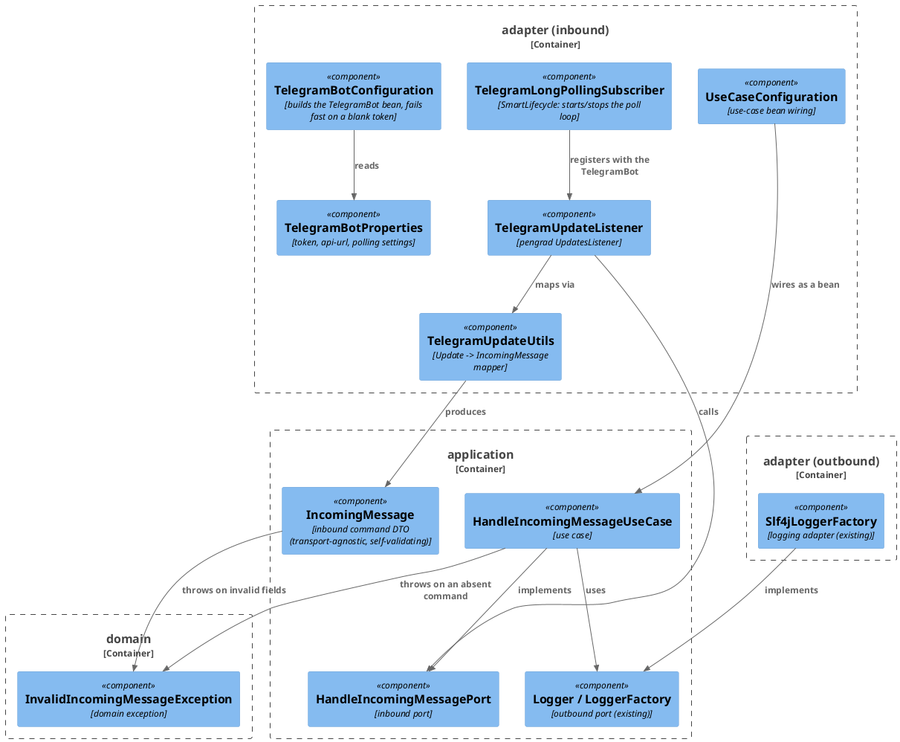
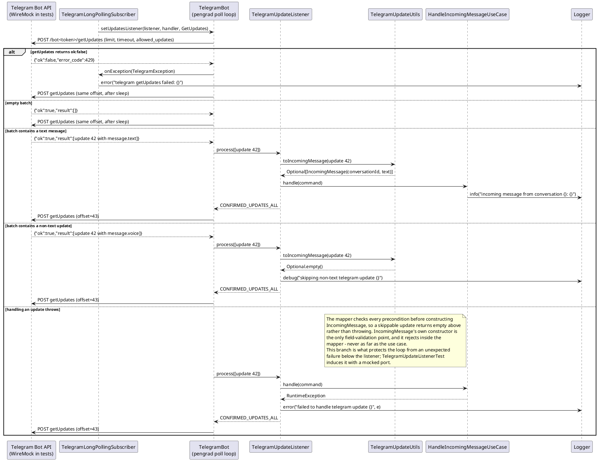

# Plan: Telegram Update Listener (Long Polling, Debug Print)

**Affected Modules:** `ledger-service`

## Objective

Give `ledger-service` its first inbound entry point: a Telegram listener that authenticates with the bot token,
long-polls the Telegram Bot API for updates, and — for text messages only — prints the message text through the
application's `Logger` port. Everything else is skipped. No persistence, no reply, no expense pipeline: this is a
debug-level "the wiring works" slice.

The Telegram base URL must be configurable so tests can point the whole polling loop at the existing WireMock
singleton instead of `api.telegram.org`.

## Proposed Solution

### Library

`com.github.pengrad:java-telegram-bot-api:10.1.0` (latest release on Maven Central). Two properties of this
library drive the design:

- **URL swapping is a first-class builder option.** `TelegramBot.Builder.apiUrl(String)` replaces the default
  `https://api.telegram.org/bot`; the effective base URL is `apiUrl + botToken + "/"`. Pointing `apiUrl` at
  `http://localhost:<wireMockPort>/bot` makes every Bot API call land on WireMock, path
  `/bot<token>/<method>`.
- **Every request is an HTTP `POST` with an `application/x-www-form-urlencoded` body** — including `getUpdates`.
  Parameters (`offset`, `limit`, `timeout`, `allowed_updates`) are form fields, *not* query parameters
  (`TelegramBotClient.createRequest` builds `.post(FormBody)` unconditionally). All WireMock stubs and
  verifications in this plan therefore use `post(...)` + `withFormParam(...)`, never `get(...)` +
  `withQueryParam(...)`.

Long polling is `bot.setUpdatesListener(listener, exceptionHandler, getUpdatesRequest)`, which starts pengrad's
`SleepUpdatesHandler`: an async OkHttp loop that calls `getUpdates`, hands the batch to
`UpdatesListener.process(List<Update>)`, and advances `offset` to `lastUpdateId + 1` when the listener returns
`CONFIRMED_UPDATES_ALL`. `bot.removeGetUpdatesListener()` stops it.

The `GetUpdates` request carries `allowed_updates=["message"]`, so Telegram sends only message updates.

Transitive dependencies: `gson`, `okhttp` 5.3.2, `kotlin-stdlib-jdk8` 2.3.21. Spring Boot 4.1.0's BOM does not
manage `okhttp` at all (no conflict) and manages `kotlin.version` at exactly 2.3.21 (no conflict). It does manage
`gson` at 2.13.2, which will *downgrade* pengrad's requested 2.14.0 — a minor-version downgrade against basic
`Gson`/`fromJson`/`toJson` usage, so low risk, but the stabilization step below verifies the resolved graph
explicitly rather than assuming.

### Layering — the core does not know it is talking to Telegram

The application core must not know **which** messenger delivered a message; a future WhatsApp, Signal, or web
form must reach the same use case without touching a line of it. Two consequences:

- **Nothing in `domain`/`application` carries a transport name.** The inbound port is
  `HandleIncomingMessagePort`, not `HandleTelegramMessagePort`; the command is `IncomingMessage`, not
  `IncomingTelegramMessage`. Only the adapter subpackage names its external system (`adapter/telegram`,
  `TelegramUpdateListener`).
- **Nothing in `domain`/`application` carries a transport-shaped field.** `IncomingMessage` identifies the
  conversation with a `String conversationId`, not a Telegram `long chatId` — the adapter renders the Telegram
  chat id into that string. Numeric chat ids are a Telegram fact.

The pengrad types (`Update`, `Message`, `Chat`) are transport detail for the same reason and must not cross into
the core — the conventions already require `domain`/`application` to depend on nothing outside the JDK. The
existing ArchUnit rule bans `org.springframework..`, `jakarta..`, and `org.slf4j..`; this plan extends it with
`com.pengrad..` **and** adds a naming rule banning external-system names from core type names, so the boundary
is enforced rather than merely intended. `docs/conventions/architecture.md` gains the same rule in prose
(see Post-Implementation Steps).

This feature adds one domain type — the exception below — and no domain model or value objects: there is no
expense, user, or money concept in a debug print.

### Files

**Domain layer**

- `domain/exception/InvalidIncomingMessageException.java` — unchecked domain exception thrown when an incoming
  message is absent, or carries no conversation id or no text. Per the conventions, the core throws a domain
  exception rather than letting a raw `NullPointerException` escape.

**Application layer**

- `application/dto/IncomingMessage.java` — `record IncomingMessage(String conversationId, String text)`, the
  inbound-port command. Plain JDK types, no transport vocabulary. **This is the single place field-level validation
  happens**: its compact constructor rejects a null-or-blank `conversationId` or `text`, so an invalid command
  cannot be constructed anywhere in the system and no caller re-checks it.
- `application/port/HandleIncomingMessagePort.java` — inbound port: `void handle(IncomingMessage message)`.
- `application/usecase/HandleIncomingMessageUseCase.java` — implements the port; takes `LoggerFactory` in its
  constructor and derives `log`; rejects an absent command and logs the text at `info`. It does not validate the
  command's fields — the record already guarantees them.

**Adapter layer — `adapter/telegram` (new subpackage, one per external system per the conventions)**

- `adapter/telegram/package-info.java`
- `adapter/telegram/TelegramBotProperties.java` — `@ConfigurationProperties("telegram.bot")` record holding the
  token, the API URL, and a nested `Polling` record (`enabled`, `limit`, `timeoutSeconds`, `sleepMillis`).
- `adapter/telegram/TelegramUpdateUtils.java` — static mapper,
  `Optional<IncomingMessage> toIncomingMessage(Update)`; empty for anything that is not a text message in a
  chat. This is where the Telegram `long` chat id becomes a `String conversationId`.
- `adapter/telegram/TelegramUpdateListener.java` — implements pengrad's `UpdatesListener`; maps each update and
  delegates to `HandleIncomingMessagePort`, skipping non-text updates with a `debug` line and swallowing +
  logging a per-update failure so one bad update cannot stall the offset. Returns `CONFIRMED_UPDATES_ALL`.
- `adapter/telegram/TelegramLongPollingSubscriber.java` — `SmartLifecycle`; `start()` calls
  `bot.setUpdatesListener(listener, exceptionHandler, new GetUpdates()...)`, `stop()` calls
  `bot.removeGetUpdatesListener()`. Its constructor takes the listener typed as the `UpdatesListener` interface,
  so tests can pass a recording fake.
- `adapter/telegram/TelegramBotConfiguration.java` — `@Configuration` holding only what cannot be annotated: the
  `TelegramBot` bean built from the properties (a third-party class), which also fails fast when polling is
  enabled with a blank token, plus `@EnableConfigurationProperties`. Per the conventions' bean-declaration rule,
  the adapter's own classes are **not** declared here: `TelegramUpdateListener` and
  `TelegramLongPollingSubscriber` are `@Component`s found by component scanning, the latter carrying
  `@ConditionalOnProperty("telegram.bot.polling.enabled")` on the class.

**Adapter layer — `adapter/config`**

- `adapter/config/UseCaseConfiguration.java` — the one place use-case beans are wired; exposes
  `HandleIncomingMessagePort` as `new HandleIncomingMessageUseCase(loggerFactory)`.

**Configuration**

- `gradle.properties`, `build.gradle` — pengrad dependency.
- `src/main/resources/application.yaml` — new `telegram.bot` block.
- `src/test/resources/application-test.yaml` — **new file**; the `test` profile is already active via
  `AbstractSystemTest` but has had no property source until now.

**Test infrastructure** (`bot.finance.common`)

- `LogCapture.java` — attaches a Logback `ListAppender` to a named logger and exposes the formatted messages.
- `TelegramFixtures.java` — builds `getUpdates` response bodies (text update, voice update, empty, `ok:false`).
- `TelegramTestBot.java` — builds a real `TelegramBot` pointed at the WireMock singleton for a given token, and
  exposes the token-scoped `getUpdates` path both the tests and `WireMockStubs` need.
- `WireMockStubs.java` — extended with token-scoped Telegram `getUpdates` stub helpers.
- `AbstractSystemTest.java` — extended with a `@DynamicPropertySource` binding `telegram.bot.api-url` to the
  WireMock singleton's port (which is only known at runtime).

No migration and no API schema change: this feature touches neither the database nor an HTTP contract.

### Configuration shape

```yaml
telegram:
  bot:
    token: ${TELEGRAM_BOT_TOKEN:}
    api-url: ${TELEGRAM_API_URL:https://api.telegram.org/bot}
    polling:
      enabled: ${TELEGRAM_POLLING_ENABLED:true}
      limit: 100
      timeout-seconds: 30
      sleep-millis: 100
```

**Fail-fast on a missing token.** `TelegramBotConfiguration` throws at context startup when
`polling.enabled` is `true` and `token` is blank, with a message naming `TELEGRAM_BOT_TOKEN`. The service still
boots without a token for local database work — by setting `TELEGRAM_POLLING_ENABLED=false` — but it never
silently long-polls `https://api.telegram.org/bot/getUpdates` with an empty token.

`src/test/resources/application-test.yaml`:

```yaml
telegram:
  bot:
    token: default-test-token
    polling:
      enabled: true
      limit: 100
      timeout-seconds: 1
      sleep-millis: 50
```

Polling stays **enabled** by default in the `test` profile — most future system tests will want it, and the
per-class token scoping below keeps an idle poller from interfering with anything. `api-url` is deliberately
absent from the test profile: `AbstractSystemTest` supplies it dynamically, since the WireMock port is assigned
at JVM start.

### Why the system tests can observe the print, and why each owns a token

Long polling gives two independent observable outcomes, and each system test asserts both:

1. **The update was consumed** — WireMock receives a follow-up `POST /bot<token>/getUpdates` whose form body
   carries `offset=<updateId + 1>`. Only pengrad's own loop advances that offset, and only after
   `process(...)` returned `CONFIRMED_UPDATES_ALL`.
2. **The text was printed** — a Logback `ListAppender` attached to
   `bot.finance.application.usecase.HandleIncomingMessageUseCase` captured the message text. The production
   `Slf4jLoggerFactory` names loggers after the class, and `logback.xml` already sets `bot.finance` to `DEBUG`,
   so nothing is filtered out.

The offset is the problem and the token is the solution. A booted context runs **one** poll loop whose offset
only ever moves forward, so "the first, offset-less poll" is a one-shot event per context — two scenarios
sharing a class would fight over it, and the loser would time out. So:

- **One scenario per system test class**, and each class declares its own bot token via
  `@TestPropertySource(properties = "telegram.bot.token=…")`. A differing property makes Spring's context cache
  hand out a *separate* context, so each class gets a fresh poll loop starting at offset 0 — and, because the
  token is part of the URL, a private WireMock path (`/bot<its-own-token>/getUpdates`) that no other class's
  poller can touch. WireMock stays a JVM-wide singleton; only the paths are partitioned.
- `AbstractSystemTest` carries `@DirtiesContext(AFTER_CLASS)`, so each class's context — and its poll loop —
  is closed when the class finishes rather than polling on in the background.

Within a class, ordering is handled by matching on the request itself: the update-bearing stub matches requests
carrying no `offset` form param (`withFormParam("offset", absent())` — the stubbing side has no
`withoutFormParam`), which pengrad sends only until a batch is confirmed. The one exception is the recovery scenario, which genuinely needs two different responses to the same
offset-less request; that class uses a WireMock **Scenario** (`inScenario(...).whenScenarioStateIs(...)`), which
is safe precisely because it is the only scenario in its own context on its own token.

Two windows are not stub-covered and do not need to be: between context start and the first `@BeforeEach`, and
between `AbstractSystemTest.tearDown()`'s `resetAll()` and context close. In both the poller receives bare
WireMock 404s; pengrad logs, sleeps, and retries, which is exactly the behaviour the recovery scenario asserts
deliberately. Each Telegram system test still registers the low-priority no-updates catch-all in its own
`@BeforeEach` (which JUnit runs after the base class's), so the window inside a test method is covered.

#### Diagrams





## Step-by-Step Implementation Map (To-Do List)

### Stabilization

#### Interface-First / Build Stabilization

New-method stubs carry a short inline comment describing the implementation intent.

**Interface & Signature Sync**

- [x] Add `domain/exception/InvalidIncomingMessageException` — a `RuntimeException` subclass with a
  message-taking constructor, javadoc'd as "an incoming message is absent, or carries no conversation id or no
  text". Complete as written, no stub needed
- [x] Stub `application/dto/IncomingMessage` — the record **validates itself** in a compact constructor, so an
  invalid command cannot be constructed anywhere in the system; leave the validation unimplemented so the red
  tests fail:
  ```java
  public record IncomingMessage(String conversationId, String text) {

      public IncomingMessage {
          // rejects a null-or-blank conversationId or text with InvalidIncomingMessageException,
          // so no caller can build a command the use case would have to re-check
      }

  }
  ```
- [x] Add `application/port/HandleIncomingMessagePort` (interface only):
  ```java
  public interface HandleIncomingMessagePort {

      void handle(IncomingMessage message);

  }
  ```
- [x] Add `application/usecase/HandleIncomingMessageUseCase` implementing the port, with a `LoggerFactory`
  constructor parameter per the logging convention, and stub the method. Field-level validation lives in
  `IncomingMessage`, so the only case left here is an absent command:
  ```java
  public void handle(IncomingMessage message) {
      // rejects an absent command with InvalidIncomingMessageException,
      // then prints the conversation id and message text at info level through the Logger port
  }
  ```
- [x] Add `adapter/telegram/package-info.java` describing the subpackage as the Telegram Bot API adapter
  (inbound long-polling listener today; the file-fetch and notification outbound adapters land here later)
- [x] Add `adapter/telegram/TelegramBotProperties`:
  ```java
  @ConfigurationProperties("telegram.bot")
  public record TelegramBotProperties(String token, String apiUrl, Polling polling) {

      public record Polling(boolean enabled, int limit, int timeoutSeconds, long sleepMillis) {
      }

  }
  ```
- [x] Stub `adapter/telegram/TelegramUpdateUtils` (static `*Utils` class with a private constructor):
  ```java
  public static Optional<IncomingMessage> toIncomingMessage(Update update) {
      // maps a pengrad Update to the transport-agnostic command when it carries a non-blank text message
      // in a chat, rendering the numeric Telegram chat id as the conversation id;
      // returns empty for every other kind of update so the listener can skip it.
      // Checks every precondition BEFORE constructing IncomingMessage - the record throws
      // InvalidIncomingMessageException on invalid input, and a skippable update must return empty,
      // never surface as an exception
      return Optional.empty();
  }
  ```
- [x] Stub `adapter/telegram/TelegramUpdateListener implements UpdatesListener`, constructor
  `(HandleIncomingMessagePort port, LoggerFactory loggerFactory)`:
  ```java
  public int process(List<Update> updates) {
      // maps each update via TelegramUpdateUtils and delegates text messages to the inbound port;
      // logs and skips non-text updates, logs and swallows a per-update failure, then confirms the whole batch
      return UpdatesListener.CONFIRMED_UPDATES_NONE;
  }
  ```
- [x] Stub `adapter/telegram/TelegramLongPollingSubscriber implements SmartLifecycle`, constructor
  `(TelegramBot bot, UpdatesListener listener, TelegramBotProperties properties, LoggerFactory loggerFactory)`
  — note the listener is typed as the **interface** so tests can substitute a recording fake:
  ```java
  public void start() {
      // registers the listener on the TelegramBot with a GetUpdates request built from the polling properties
      // (limit, timeout, allowed_updates=message), and an ExceptionHandler that logs getUpdates failures
      // without killing the loop
  }

  public void stop() {
      // removes the getUpdates listener so the poll loop stops
  }

  public boolean isRunning() {
      // reports whether the poll loop is currently registered
      return false;
  }
  ```
- [x] Add `adapter/telegram/TelegramBotConfiguration` — `@Configuration`, `@EnableConfigurationProperties(
  TelegramBotProperties.class)`, with a single `TelegramBot` bean
  (`new TelegramBot.Builder(token).apiUrl(apiUrl).updateListenerSleep(sleepMillis).build()`) that fails fast —
  throw `IllegalStateException` naming `TELEGRAM_BOT_TOKEN` — when polling is enabled and the token is blank.
  Per the conventions' bean-declaration rule, Java configuration covers only classes that cannot be annotated
  (the core, and third-party types like `TelegramBot`); annotate `TelegramUpdateListener` with `@Component` and
  `TelegramLongPollingSubscriber` with `@Component` +
  `@ConditionalOnProperty(name = "telegram.bot.polling.enabled", havingValue = "true", matchIfMissing = true)`
  on the class, rather than declaring either as a `@Bean`
- [x] Add `adapter/config/UseCaseConfiguration` — the `@Configuration` class that wires use-case beans, per the
  conventions' rule that use cases are plain classes wired from `adapter/config`. `adapter/config` currently holds
  only `package-info.java`, and without this bean the `TelegramUpdateListener` bean cannot be constructed and every
  full-context test fails at startup:
  ```java
  @Bean
  HandleIncomingMessagePort handleIncomingMessagePort(LoggerFactory loggerFactory) {
      return new HandleIncomingMessageUseCase(loggerFactory);
  }
  ```
- [x] Extend `bot.finance.architecture.CleanArchitectureTest` with two rules:
    - add `com.pengrad..` to the banned packages in `domainAndApplicationStayFrameworkAgnostic`
    - add a new `coreTypesCarryNoExternalSystemName` rule: no class in `bot.finance.domain..` or
      `bot.finance.application..` may have a simple name containing an external-system name. Seed the list from
      the C4 diagram's external systems — `Telegram`, `Whisper`, `Postgres` — with a comment that it grows as
      each new adapter lands. This is the guardrail for the naming rule in **Layering** above

**Configuration**

- [x] Add `pengradTelegramBotApiVersion=10.1.0` to `gradle.properties` and
  `implementation "com.github.pengrad:java-telegram-bot-api:${pengradTelegramBotApiVersion}"` to `build.gradle`
- [x] Run `./gradlew dependencies --configuration runtimeClasspath` and confirm the resolved graph: `okhttp`
  stays at 5.3.2 (Boot 4.1.0's BOM does not manage it), `kotlin-stdlib-jdk8` resolves to 2.3.21 (Boot manages
  exactly that), and `gson` resolves to Boot's 2.13.2 rather than pengrad's requested 2.14.0. Only if the gson
  downgrade breaks `BotUtils.parseUpdate` at runtime, pin `gson` to 2.14.0 in `build.gradle` — do not pin
  pre-emptively
- [x] Add the `telegram.bot` block to `src/main/resources/application.yaml` (see **Configuration shape** above)
- [x] Create `src/test/resources/application-test.yaml` with the `default-test-token` and fast polling settings
  (see **Configuration shape** above). This file does not exist yet — `@ActiveProfiles("test")` on
  `AbstractSystemTest` currently resolves to no property source at all

**Shared Test Infrastructure**

- [x] Add `bot.finance.common.LogCapture` — attaches a Logback `ListAppender<ILoggingEvent>` to a logger
  (by `Class<?>`), exposes `List<String> messages()` returning formatted messages, and detaches/stops on
  `close()`. Needed by both system test classes and by `TelegramLongPollingSubscriberTest`; keep it generic, not
  Telegram-specific
- [x] Add `bot.finance.common.TelegramFixtures` — static builders for Telegram JSON, using text blocks per the
  long-string convention. **Two distinct shapes are required and must not be conflated**: `BotUtils.parseUpdate`
  deserializes a single *bare* `Update` object, while WireMock serves a `getUpdates` *envelope*
  (`{"ok":…,"result":[…]}`). Feeding an envelope to `parseUpdate` yields an `Update` with every field null.
  Exactly these builders, which together cover every Red Phase scenario listed below:
    - bare `Update` bodies, for `BotUtils.parseUpdate` in `TelegramUpdateUtilsTest`:
      `textMessageUpdate(int updateId, long chatId, String text)`,
      `voiceMessageUpdate(int updateId, long chatId)`,
      `textMessageUpdateWithoutChat(int updateId, String text)`,
      `callbackQueryUpdate(int updateId)` (an update carrying no `message` at all)
    - envelope bodies, for the `WireMockStubs` helpers:
      `updatesResponse(String... bareUpdateJson)` — wraps any number of the above into
      `{"ok":true,"result":[…]}`, which is what makes the multi-update batch scenario expressible —
      `noUpdates()` (an empty `result`), and `error(int errorCode, String description)` (an `ok:false` body)

  No Red Phase step is scoped to create shared fixtures, so this list is the scope, not a minimum.
  These stay Java text blocks rather than `src/test/resources` files + `JsonUtils` — a deliberate, documented
  deviation from the "prefer a resource file once shared" convention, because every body is parameterized
  (`updateId`, `chatId`, `text`) and `JsonUtils.readJsonResourceAsString` performs no substitution. Revisit if a
  body outgrows ~15 lines
- [x] Add `bot.finance.common.TelegramTestBot` — the single home for wiring a real `TelegramBot` against the
  WireMock singleton, so the two integration tests do not each invent their own copy:
  ```java
  public static String getUpdatesPath(String token) {
      // the token-scoped path pengrad posts getUpdates to: /bot<token>/getUpdates
  }

  public static TelegramBot forToken(String token) {
      // a TelegramBot whose apiUrl points at the WireMock singleton, with a short updateListenerSleep
  }
  ```
  Also declare the per-test-class token constants here, so a test's stubs and its bot can never disagree:
  `LISTENER_TOKEN`, `SUBSCRIBER_TOKEN`, `RECEIVE_MESSAGE_TOKEN`, `POLL_RECOVERY_TOKEN`
- [x] Extend `bot.finance.common.WireMockStubs` with token-scoped Telegram `getUpdates` helpers — one static
  method per stubbed situation, all using `post(urlPathEqualTo(TelegramTestBot.getUpdatesPath(token)))`,
  **not** `get(...)`, since pengrad posts a form body.

  **Register through the instance, never the static DSL.** `WireMock.stubFor(...)` (and static `verify`,
  `findAll`) targets `WireMock.defaultInstance`, which defaults to `localhost:8080`; `WireMockServer` never calls
  `WireMock.configureFor(...)`, and `WireMockSupport.SERVER` runs on a **dynamic** port — so a static call cannot
  reach this module's server and fails with a connection error before any assertion runs. Every registration goes
  through `WireMockSupport.SERVER.stubFor(...)`, matching the module's existing idiom
  (`AbstractSystemTest.tearDown()` calls `WireMockSupport.SERVER.resetAll()`, not the static form). Only the pure
  builders — `post`, `urlPathEqualTo`, `okJson`, `aResponse`, `postRequestedFor`, `equalTo` — are safe static
  imports.

  **The same rule governs verification in every test below**, which no step spells out otherwise: the follow-up
  `offset=43` / `offset=44` assertions, the form-param assertions, and the "no further request" settle checks all
  go through `WireMockSupport.SERVER.verify(...)` / `SERVER.findAll(...)`.

  **`withoutFormParam` does not exist on the stubbing side.** Verified against 3.13.0 with `javap`: it is declared
  on `RequestPatternBuilder` (verification) but **not** on `MappingBuilder`/`ScenarioMappingBuilder` (stubbing).
  The offset-less match is therefore expressed as `withFormParam("offset", absent())`, which is supported and
  behaves identically; `absent` is a pure builder and safe to static-import. Do not reintroduce
  `withoutFormParam` in a stub — it will not compile. It remains correct in a `postRequestedFor(...)`
  verification.
  ```java
  public static void telegramReturnsNoUpdates(String token) {
      WireMockSupport.SERVER.stubFor(post(urlPathEqualTo(getUpdatesPath(token)))
              .atPriority(10)
              .willReturn(okJson(TelegramFixtures.noUpdates())));
  }

  public static void telegramReturnsOnFirstPoll(String token, String responseBody) {
      WireMockSupport.SERVER.stubFor(post(urlPathEqualTo(getUpdatesPath(token)))
              .atPriority(1)
              .withFormParam("offset", absent())   // NOT withoutFormParam - see note below
              .willReturn(okJson(responseBody)));
  }

  public static void telegramFails(String token, int errorCode, String description) {
      // every poll gets the same ok:false body, built with TelegramFixtures.error(errorCode, description);
      // for TelegramLongPollingSubscriberTest's 429 scenario, which needs a persistently failing endpoint
      // rather than the fail-once Scenario below
  }

  public static void telegramFailsOnceThenReturns(String token, int errorCode, String responseBody) {
      // a two-state WireMock Scenario: the first offset-less poll gets an ok:false body, every later one gets
      // responseBody - the only stateful stub in the suite, needed because a failed getUpdates does not
      // advance pengrad's offset, so both polls are otherwise indistinguishable
  }
  ```
- [x] Extend `bot.finance.common.AbstractSystemTest` with a `@DynamicPropertySource` binding
  `telegram.bot.api-url` to `WireMockSupport.baseUrl() + "/bot"` — the WireMock port is only known at runtime, so
  it cannot live in `application-test.yaml`. `AbstractSystemTest` is on the conventions' additively-extensible
  list. Do **not** register Telegram stubs in the base class: it is shared by every future system test, and
  `tearDown()`'s `resetAll()` would drop them anyway; each Telegram system test registers its own catch-all in
  its own `@BeforeEach`

- [x] After stabilization, confirm `bot.finance.architecture.CleanArchitectureTest` still passes
  (`./gradlew test --tests "bot.finance.architecture.*"`), including both newly added rules

### Red Phase

> Every scenario group listed below is realized in test code as a `@Nested` inner class carrying a prose
> `@DisplayName`, per `docs/conventions/testing.md` § *Testing Style* — no test class is a flat list of methods.
> The groups in this plan already map one-to-one onto that structure: unit and outbound-adapter steps group by the
> method under test (`toIncomingMessage()` → `@Nested class ToIncomingMessage`), while inbound-adapter and system
> steps group by scenario kind (`@Nested class HappyPath`, `Validation`, `ErrorMapping`, `UnhappyPath`).

#### TDD Unit Red Phase

> Two classes here sit outside what `docs/conventions/testing.md` § *Test Layers* currently maps to the unit layer
> (`domain/` and `application/usecase/` only), both deliberately:
>
> - `TelegramUpdateUtils` lives in `adapter/telegram`, which maps to an integration layer — but it is a pure static
>   mapper with no infrastructure, and an integration test would add a WireMock round-trip to assert a field mapping.
> - `IncomingMessage` lives in `application/dto`, which **no** test layer names at all. It now carries validation
>   behaviour, so it needs tests, and they are pure — no Spring, no infrastructure.
>
> The Post-Implementation Steps amend `testing.md` to map both — pure adapter mappers/`*Utils` classes and
> self-validating `application/dto` records — to the unit layer, so the next plan does not have to re-argue either.

- [x] `IncomingMessage` · test: `IncomingMessageTest` · covers: `IncomingMessage(String, String)`
    - The record validates itself, so every field-level rejection is asserted here once and nowhere else
    - `IncomingMessage(String, String)`:
        - given: a non-blank conversation id and non-blank text
          when: the record is constructed
          then: both components are readable unchanged
        - given: any of these `(conversationId, text)` pairs — `(null, "text")`, `("", "text")`, `("  ", "text")`,
          `("555", null)`, `("555", "")`, `("555", "  ")`
          when: the record is constructed
          then: throws InvalidIncomingMessageException.
          Write this as **one `@ParameterizedTest`** over the six rows, per `testing.md` § *Testing Style*, which
          earmarks validation matrices and null-handling for parameterized tests and forbids duplicating a case as
          both a parameterized entry and a one-off. The null rows are what distinguish this from a blank-only check:
          an `isBlank()` implementation that skips the null guard throws `NullPointerException` instead
- [x] `HandleIncomingMessageUseCase` · test: `HandleIncomingMessageUseCaseTest` · covers: `handle()`
    - Field validation belongs to `IncomingMessage` and is not repeated here; an invalid command cannot be
      constructed to hand to this method
    - `handle()`:
        - given: a command carrying a conversation id and message text, and a mock `LoggerFactory`/`Logger`
          when: handle() is called
          then: the message text and the conversation id are logged at info level through the `Logger` port
        - given: a null command
          when: handle() is called
          then: throws InvalidIncomingMessageException and nothing is logged
- [x] `TelegramUpdateUtils` · test: `TelegramUpdateUtilsTest` · covers: `toIncomingMessage()`
    - Build the `Update` inputs with `BotUtils.parseUpdate(json)` and `TelegramFixtures` — pengrad's model
      classes are Gson-populated and expose no setters or populating constructors
    - `toIncomingMessage()`:
        - given: an update whose message carries a chat id and non-blank text
          when: toIncomingMessage() is called
          then: returns a command whose conversation id is the chat id rendered as a string, with that text
        - given: an update whose message carries a voice payload and no text
          when: toIncomingMessage() is called
          then: returns an empty Optional
        - given: an update with no `message` at all (e.g. a callback query)
          when: toIncomingMessage() is called
          then: returns an empty Optional
        - given: an update whose message text is blank
          when: toIncomingMessage() is called
          then: returns an empty Optional
        - given: an update whose message has text but no `chat`
          when: toIncomingMessage() is called
          then: returns an empty Optional — `Chat.id()` is a boxed `Long`, so this branch must be guarded
          rather than left to unbox
        - given: a null update
          when: toIncomingMessage() is called
          then: returns an empty Optional

#### TDD Integration Red Phase

Neither step below needs Spring or Docker: WireMock is an in-JVM server, not a container, so
`@Testcontainers(disabledWithoutDocker = true)` does **not** belong on these classes. Each test builds its bot
via `TelegramTestBot.forToken(...)` with its own token constant, and in its own teardown stops the loop
(`bot.removeGetUpdatesListener()`) and calls `WireMockSupport.SERVER.resetAll()` — only `AbstractSystemTest`
does that automatically, and these classes do not extend it. Assertions use Awaitility, since pengrad's loop is
asynchronous.

- [x] `TelegramUpdateListener` · test: `TelegramUpdateListenerTest` · covers: pengrad `getUpdates` long-poll loop
  · mocks: `HandleIncomingMessagePort`
    - The protocol for this inbound adapter is the pengrad poll loop over HTTP, not an HTTP endpoint, so there
      is no `@WebMvcTest` slice to boot; the test enters through a real `TelegramBot` against WireMock and never
      calls `process(...)` directly
    - Happy Path:
        - given: WireMock returns one text-message update (id 42, non-blank text) on the first poll and no
          updates thereafter
          when: the loop is started against the WireMock base URL
          then: `handle()` is called on the mocked port with the mapped conversation id and text, and a
          follow-up `getUpdates` arrives carrying form param `offset=43`
    - Error Mapping:
        - given: the mocked port throws `InvalidIncomingMessageException` for the delivered update
          when: the loop is started and the update arrives
          then: the batch is still confirmed — a follow-up `getUpdates` carries `offset=43` — so a failing
          update cannot stall the loop
    - Validation:
        - given: WireMock returns one voice-message update (id 42) on the first poll
          when: the loop is started and the update arrives
          then: the mocked port is never called, and a follow-up `getUpdates` still carries `offset=43`
        - given: WireMock returns a batch of two updates, ids 42 (text) and 43 (voice)
          when: the loop is started and the batch arrives
          then: the port is called once, for the text update only, and a follow-up `getUpdates` carries
          `offset=44`
- [x] `TelegramLongPollingSubscriber` · test: `TelegramLongPollingSubscriberTest` · covers: `start()`, `stop()`,
  `isRunning()`
    - Outbound-adapter variant: the subscriber is what drives pengrad's outbound `getUpdates` HTTP call, so the
      test wires only the subscriber against real test infrastructure (the WireMock singleton) and calls its own
      public methods directly, per the conventions' outbound integration rule. It passes a recording
      `UpdatesListener` fake rather than a mocked inbound port — the listener's behaviour is the previous step's
      subject
    - `start()`:
        - given: properties with a known limit and timeout, and WireMock returning no updates
          when: start() is called
          then: WireMock receives a `POST` to the token-scoped `getUpdates` path whose form params carry the
          configured `limit`, `timeout`, and `allowed_updates` containing `message`, and isRunning() reports true
        - given: `WireMockStubs.telegramFails(token, 429, …)` makes every poll fail, and `LogCapture` is attached
          to `TelegramLongPollingSubscriber`
          when: start() is called and the failing response arrives
          then: the loop keeps polling rather than terminating — a second `getUpdates` request is recorded — and
          the captured log carries the failure, proving the `ExceptionHandler` `start()` registers is wired.
          Construct the subscriber with the **real** `new Slf4jLoggerFactory()`, never a mocked `LoggerFactory`:
          an outbound-adapter test mocks nothing, and `LogCapture` attaches its appender to the logger named after
          the class — a name only the real factory produces, so a mock would leave `messages()` empty and tempt a
          retreat to asserting on the mock
    - `stop()`:
        - given: a started subscriber
          when: stop() is called
          then: polling ceases — no further `getUpdates` request is recorded after a short settle window — and
          isRunning() reports false
    - `isRunning()`:
        - given: a subscriber that was never started
          when: isRunning() is called
          then: reports false

#### TDD System Test Red Phase

Both classes extend `AbstractSystemTest`, declare their own bot token with
`@TestPropertySource(properties = "telegram.bot.token=…")` (taking the constant from `TelegramTestBot`) so they
get a private context, poll loop, and WireMock path, and assert with Awaitility. One scenario per class is
deliberate — see **Why the system tests can observe the print** above.

**`@BeforeEach` order is load-bearing and must be exactly this**, because the poll loop is already running at
`sleep-millis: 50` by the time the method executes:

1. attach `LogCapture` to `HandleIncomingMessageUseCase`;
2. register the low-priority no-updates catch-all;
3. register the update-bearing stub **last**.

Registering the update-bearing stub before the appender is attached lets the loop consume the update and log it
into a logger with no appender, which makes the log assertion flake rather than fail.

- [x] `ReceiveTelegramMessageSystemTest` · covers: `HandleIncomingMessagePort.handle()` (framework-fired: the
  `TelegramLongPollingSubscriber` bean starts the poll loop with the application context; the test never calls
  the port itself)
    - Happy Path:
        - given: WireMock is stubbed to return one text-message update (id 42, chat 555, text "lunch 12 euro")
          on the first offset-less poll
          when: the running application's poll loop picks the update up
          then: WireMock records a follow-up `getUpdates` with form param `offset=43`, and the captured log
          contains the message text and the conversation id `555`
- [x] `TelegramPollFailureRecoverySystemTest` · covers: `HandleIncomingMessagePort.handle()` (framework-fired,
  as above)
    - Unhappy Path:
        - given: WireMock is stubbed via `telegramFailsOnceThenReturns` — an `ok:false` / error_code 429 body on
          the first offset-less poll, then the text-message update
          when: the application polls
          then: the application survives the failed poll and still logs the message text once the good response
          arrives — proving the exception handler is wired and does not kill the loop

### Green Phase

#### TDD Unit Green Phase

- [x] `IncomingMessage` · test: `IncomingMessageTest`
- [x] `HandleIncomingMessageUseCase` · test: `HandleIncomingMessageUseCaseTest` · after: `IncomingMessage`
- [x] `TelegramUpdateUtils` · test: `TelegramUpdateUtilsTest` · after: `IncomingMessage`

#### TDD Integration Green Phase

- [x] `TelegramUpdateListener` · test: `TelegramUpdateListenerTest` · after: `TelegramUpdateUtils`,
  `IncomingMessage`
- [x] `TelegramLongPollingSubscriber` · test: `TelegramLongPollingSubscriberTest`

#### TDD System Test Green Phase

- [x] `ReceiveTelegramMessageSystemTest` · covers: `HandleIncomingMessagePort.handle()`
- [x] `TelegramPollFailureRecoverySystemTest` · covers: `HandleIncomingMessagePort.handle()`

### Post-Implementation Steps

#### Conventions Updates

Not one of the skill's named Post-Implementation sections, but the group's rule fits: these edits record what
the implementation settled and only make sense once it is green. No manual `.http` files apply — this feature
exposes no HTTP endpoint.

- [ ] `docs/conventions/architecture.md` — add the **core naming rule** to *Package Structure*: no type in
  `domain`/`application` may carry an external-system or transport name; the adapter names its external system,
  the core names the capability (`HandleIncomingMessagePort` + `adapter/telegram/TelegramUpdateListener`), and
  no core type may carry a transport-shaped field (`String conversationId`, not a Telegram `long chatId`).
  Note that ArchUnit enforces it
- [ ] `docs/conventions/architecture.md` § *Package Structure* — two gaps this plan opens: add `telegram` to the
  adapter subpackage tree (currently `config`, `logging`, `web`, `persistence`), and widen the "one adapter
  subpackage per external system" sentence, which is scoped to **outbound** adapters only. As the file stands
  `adapter/web` reads as the sole home for inbound adapters, so nothing records that a non-HTTP inbound adapter
  (this listener) belongs in its external system's subpackage alongside that system's outbound adapters
- [ ] `docs/conventions/architecture.md` — update *Architecture Enforcement*: the banned core packages are now
  `org.springframework..`, `jakarta..`, `org.slf4j..`, `com.pengrad..`, and the scope gains the
  `coreTypesCarryNoExternalSystemName` rule. Also fix *Package Structure*'s "exact names to be settled" note —
  `adapter/telegram` now exists
- [ ] `docs/conventions/orientation.md` — record the Telegram Bot API client library and version under
  *Tech Stack*
- [ ] `docs/conventions/code-style.md` § *Application* — record the idiom this plan establishes, so the next
  feature does not re-derive the opposite one and leave the codebase carrying both: **inbound-port command records
  validate their own fields in a compact constructor, throwing a domain exception; use cases therefore trust the
  command's fields and check only that the command itself is present.** The section currently says nothing about
  where command validation belongs
- [ ] `docs/conventions/testing.md` § *Test Layers* — the Telegram listener's transport is settled
  (long polling, not webhook); record the non-HTTP inbound-adapter mechanism: a real client against the WireMock
  singleton, entered through the protocol, with no Spring slice. Widen the unit-layer mapping to cover pure adapter
  mappers/`*Utils` classes **and self-validating `application/dto` records** — `application/dto` is currently named
  by no test layer at all
- [ ] `docs/conventions/testing.md` § *Test Tooling* — replace "Firing non-HTTP entry points in system tests:
  none exist yet" with the mechanism this plan established: the framework-fired trigger runs with the context,
  and each system test class scopes itself with its own `telegram.bot.token` via `@TestPropertySource` to get a
  private context, poll loop, and WireMock path — one framework-fired scenario per class
- [ ] `docs/conventions/testing.md` § *Test Tooling* — record the WireMock instance-vs-static rule this plan hit:
  stub registration and verification go through `WireMockSupport.SERVER`, never WireMock's static DSL, which targets
  `localhost:8080` and cannot reach the dynamic-port singleton. Only the pure builders are safe static imports
- [ ] `docs/conventions/testing.md` § *Package Structure* and § *Naming Conventions* — list the new
  `bot.finance.common` members (`LogCapture`, `TelegramFixtures`, `TelegramTestBot`), replacing "Existing shared
  test builders/factories: none yet", and note the parameterized-fixture exception to the "prefer a
  `src/test/resources` file + `JsonUtils`" rule
- [ ] `ledger-service/README.md` — the C3 diagram's `Telegram Update Listener` component and its
  `Record Expense Port` relationship no longer match the code: the listener now drives
  `HandleIncomingMessagePort`. Update the component and relationship names

## Open Questions / Blockers

- Q: Should the listener restrict `allowed_updates` to `message` on the `GetUpdates` request? Your phrasing
  ("it should only give the bot token the messages") reads that way, and it keeps Telegram from sending update
  types nothing handles yet. This plan assumes **yes** — `new GetUpdates().allowedUpdates("message")` — which
  the `TelegramLongPollingSubscriberTest` happy path can assert as an extra form param. Say the word if you'd
  rather receive everything and filter locally.
- A: yes

- Q: What should happen at startup when `TELEGRAM_BOT_TOKEN` is unset? Options: (a) fail fast with a clear
  error, (b) start with polling disabled and log a warning, (c) start polling anyway and let every call 401.
  This plan assumes **(b)** — the default `token` is empty and `telegram.bot.polling.enabled` is the switch — so
  the service still boots for local database work without a bot token. No checklist item covers a fail-fast
  guard; add one if you want (a).
- A: (a) — applied: `TelegramBotConfiguration` throws at startup when polling is enabled and the token is blank.
  `TELEGRAM_POLLING_ENABLED=false` remains the escape hatch for booting without a token.

- Q: `docs/conventions/testing.md` currently records two things as undecided that this plan settles: the
  Telegram listener's transport ("webhook vs long-polling is still undecided") and the mechanism for firing
  non-HTTP entry points in system tests. Should updating that file be part of this plan's Post-Implementation
  Steps, or do you want to write it yourself once the implementation lands? Nothing in the checklist touches
  conventions files right now.
- A: yes — applied: a **Conventions Updates** section now exists under Post-Implementation Steps, covering
  `testing.md`, `architecture.md`, `orientation.md`, and the module README.

- Q: The `TelegramLongPollingSubscriber` bean starts polling as soon as *any* system-test context boots — every
  future `AbstractSystemTest` subclass will have a Telegram poller hammering WireMock in the background at the
  configured sleep interval, whether or not that test cares about Telegram. This plan handles it with the
  low-priority no-updates catch-all stub. The alternative is to disable polling in `application-test.yaml` and
  enable it only for `TelegramMessageListenerSystemTest` via `@TestPropertySource`. Which do you prefer?
- A: I think we are going to need polling in most of the cases, so we can disable it later if we need to.
  Applied: polling stays enabled in `application-test.yaml`. Per-class token scoping means an unrelated system
  test's poller only ever hits its own `/bot<token>/getUpdates` path, so it cannot interfere with a Telegram
  test's stubs; and `@DirtiesContext(AFTER_CLASS)` stops each loop when its class finishes.

## Implementation Notes

### Red Phase (completed 2026-07-25)

Seven step agents, run four at a time per the parallelism convention. RED exit check run serially by the
orchestrator: **28 tests, 18 failing**, matching every agent report exactly — `CleanArchitectureTest` still 3/3
green (no pre-existing regression), the 18 failures are precisely the new tests reported as failing, and the 10
passes are precisely the reported expected passes.

Expected passes, all asserting an *absence* of behaviour against a stub and deliberately left as written rather
than distorted into false reds:

- `IncomingMessageTest` — the valid-input row (a record's accessors already work; the empty compact constructor
  does not affect them);
- `TelegramUpdateUtilsTest` — the five skip scenarios (the stub returns `Optional.empty()` unconditionally, so
  they pass for the wrong reason today; each would genuinely fail if the mapper wrongly returned a value);
- `TelegramLongPollingSubscriberTest` — `isRunning()` "never started → false", as the plan predicted.

**The system tests' RED reason is deeper than the plan stated.** The plan named `process()` and `handle()` as the
gaps, but `TelegramLongPollingSubscriber.start()` is also an empty stub, so the listener is never registered and
**zero requests reach WireMock at all**. Both system tests therefore currently fail on their first assertion with
an empty result, never reaching the second. The green phase must wire `start()` before either system test can
evaluate what it was written to check — and the subscriber has no green step of its own, so that wiring belongs
to System Green.

Two conventions gaps the agents exposed, both fixed in the conventions rather than worked around:

- `@Nested` groups named after a **constructor** cannot take the type's bare name — a member type shadows the
  same-named import, so `@Nested class IncomingMessage` makes `new IncomingMessage(...)` resolve to the test
  class. `testing.md` now prescribes `<Type>Constructor`.
- Concurrent `gradlew test` runs share one `build/` directory and clobber each other's `test-results`, surfacing
  as `NoSuchFileException` on `in-progress-results-*.bin` or another agent's XML in place of yours. Three agents
  hit it independently. `agent.md` § *Parallelism* now names the symptom and says to trust console output over
  the reports during a parallel wave.

### Stabilization (completed 2026-07-25)

Guardrail verified by the orchestrator, not taken on the sub-agent's report: `clean compileJava compileTestJava`
clean; `CleanArchitectureTest` 3 tests / 0 failures (was 2 — `coreTypesCarryNoExternalSystemName` is the third);
full suite green; every stub's intent comment read against its Red Phase scenarios and confirmed consistent. No
`*Test` classes were created — Red Phase owns those.

Deviations from the plan text, both forced by the libraries:

- **`withoutFormParam` is verification-only.** Confirmed with `javap` against `wiremock-standalone:3.13.0`: it is
  declared on `RequestPatternBuilder` but not on `MappingBuilder`/`ScenarioMappingBuilder`, so the plan's stub
  snippet would not have compiled. Stubs use `withFormParam("offset", absent())` instead; the plan's snippet and
  prose were corrected in place. `withoutFormParam` stays valid inside a `postRequestedFor(...)` verification.
- **`telegramFailsOnceThenReturns` takes no `description`**, per the signature the plan fixed, so its error body
  carries a fixed description. `telegramFails(token, errorCode, description)` — the helper added in round 3 — does
  take one.

Two risks the plan recorded as accepted turned out to be partly retired: the sub-agent booted the full Spring
context against the new wiring (relaxed property binding, the nested `Polling` record, the
`@DynamicPropertySource`, both Telegram beans, and `UseCaseConfiguration`'s port bean) and exercised every shared
fixture through a real polling `TelegramBot`, all via throwaway probes it then deleted. That covers most of what
the "no context-boot smoke check" finding warned about, though nothing permanent asserts it — the
`TelegramBotConfiguration` fail-fast and polling-gate branches remain untested by design.

**Bean-declaration style corrected after the stage (2026-07-25).** Java configuration is now reserved for classes
that cannot be annotated — core classes (forbidden from carrying Spring annotations) and third-party types like
`TelegramBot`. The module's own adapter classes are `@Component`s: `TelegramUpdateListener` and
`TelegramLongPollingSubscriber` moved out of `TelegramBotConfiguration`'s `@Bean` methods, with the polling gate
moving to `@ConditionalOnProperty` on the subscriber class. `UseCaseConfiguration` is unchanged — a use case has
nowhere to put an annotation. The rule is now recorded in `docs/conventions/architecture.md`.

Since no permanent test boots the context, the rewiring was verified with a throwaway `@SpringBootTest` probe
(deleted after running) asserting all four beans resolve under component scanning and `isRunning()` is still the
stub's `false`. A compile check alone would not have caught a broken bean graph.

Carried forward for later stages:

- `TelegramLongPollingSubscriberTest`'s `isRunning()` "never started → false" scenario will **pass** at RED, since
  the stub returns `false`. Expected, per the RED-phase rule about negative assertions — not a defect to rework.
- `TelegramFixtures` JSON-escapes `text`/`description`, so a fixture built with a `null` text would NPE. No listed
  Red scenario needs one; the blank cases use `""` / `"  "`.

### Green Phase (completed 2026-07-25)

Five unit/integration steps in three dependency waves (`IncomingMessage` + `TelegramLongPollingSubscriber` →
`HandleIncomingMessageUseCase` + `TelegramUpdateUtils` → `TelegramUpdateListener`), then the system steps.
Guardrail run serially by the orchestrator: **28 tests, 0 failures** — the whole suite green, same test count as
the red phase, so nothing was lost or duplicated.

**Both System Green steps needed no work.** The plan expected `TelegramLongPollingSubscriber.start()` to be wired
during System Green, since the subscriber was thought to have no green step of its own — but it does have an
*integration* green step, and wiring `start()` there completed the stack. Both system tests went green as a
consequence, verified by the orchestrator's own full-suite run rather than by spawning agents to confirm passing
tests.

**One RED-phase test was unsatisfiable and had to be repaired.** `HandleIncomingMessageUseCaseTest`'s happy path
captured `{}`-placeholder arguments with `ArgumentCaptor.forClass(Object.class)` against
`void info(String, Object...)`. Mockito 5's `CapturingMatcher` does not implement `VarargMatcher` (confirmed with
`javap`: it implements only `ArgumentMatcher`, `CapturesArguments`, `Serializable`), so matching requires exactly
one vararg while the assertion required two captured values — **no implementation could satisfy both**. The green
agent correctly refused to bend the production code and reported a blocker instead. Repaired test-only, two lines,
by capturing `Object[]` (the raw-array path applies, since `Object[].class.isAssignableFrom(Object[].class)`), and
re-verified that the assertion still fails against a concatenated log message. Production left byte-identical.

This is the defect class the RED exit check structurally cannot catch: a test that fails against the stub *and*
against correct code. Worth remembering — capturing multiple varargs off the `Logger` port needs
`ArgumentCaptor<Object[]>`, not `ArgumentCaptor<Object>`.

Minimal-green boundaries the agents flagged rather than silently hardening, for the refactor phase to weigh:

- `TelegramUpdateUtils` renders `"null"` as the conversation id if a message has a `chat` whose `id()` is null.
  Uncovered by tests; the Bot API always populates `Chat.id`.
- `TelegramUpdateListener` dereferences `update.updateId()` on the skip path, so a `null` element inside a batch
  would NPE. pengrad never produces one.
- `TelegramUpdateListener` catches only `RuntimeException` per update; an `Error` propagates into pengrad's loop.

### Refactor Phase (completed 2026-07-25)

One agent over the whole diff. Guardrail verified by the orchestrator: **28 tests, 0 failures — count unchanged**,
architecture test 3/3.

The find was cross-class test duplication, as expected from five test classes written by agents that could not see
each other's work: `postRequestedFor(urlPathEqualTo(getUpdatesPath(TOKEN)))` appeared **7 times across 4 classes**
and now appears twice, both inside `TelegramTestBot`, which gained `recordedPolls(token)` and
`recordedPollsWithOffset(token, offset)`. Nine static imports and two type imports went with it. `TelegramTestBot`
was extended rather than a new helper created, because a new shared builder would have to be listed in
`testing.md` § *Naming Conventions* — which the refactor agent is not permitted to edit — and `TelegramTestBot`
already documented itself as the home for stub registration and request verification.

Production needed almost nothing: one constructor-parameter alignment in `TelegramLongPollingSubscriber`. Injection
style, `Logger`-port logging, text blocks, method decomposition and import hygiene were already uniform across all
five independently-written classes.

One idiom alignment: `TelegramUpdateListenerTest` was alone in asserting through `SERVER.verify(pattern)` while its
three siblings used `assertThat(findAll(pattern)).isNotEmpty()`. WireMock's countless `verify` means "at least
once", which is what `isNotEmpty()` proves, so the semantics are identical and `testing.md` mandates AssertJ.

Deliberately **not** extracted, and the reasoning is worth keeping: shared test-data constants (hoisting literal
test data makes each test unreadable alone), the three-line `@AfterEach` teardown shared by two adapter tests
(a base class costs more clarity than it saves), `LogCapture` attach/close in the two system tests (its only
sensible home is `AbstractSystemTest`, which every future system test inherits and must not acquire a
Telegram-specific hook), and the differing Awaitility timeouts (genuinely different values, not duplication).

## Open Questions / Blockers — raised during implementation

- Blocker: none. No Red Phase step was blocked; all seven completed.
- Finding (refactor phase, not acted on): of the three minimal-green boundaries, the refactor agent would close
  **only** the second — `TelegramUpdateListener` dereferences `update.updateId()` on the skip path *after*
  `TelegramUpdateUtils` has already null-guarded the update, so one class in the package is defensive about a null
  update and its immediate neighbour is not. That inconsistency invites a later reader to "fix" it in the wrong
  direction. The other two (`"null"` conversation id, `Error` escaping the per-update catch) are genuinely
  unreachable through pengrad and were judged better left alone. All three remain open — closing any is a
  behaviour change and belongs in a follow-up plan, not the refactor stage.
- Finding (refactor phase): **no test covers `TelegramBotConfiguration` at all** — neither the fail-fast
  blank-token branch nor the polling gate. This was accepted by decision during planning, but it is worth
  restating that the one piece of production code preventing a misconfigured deploy from long-polling
  `api.telegram.org` with an empty token was verified only by a throwaway probe that has since been deleted.
  Candidate for a follow-up plan.
- Note (flake risk): `TelegramLongPollingSubscriberTest.Stop` proves "no further request" with two real
  `Thread.sleep(500)` settle windows, costing about a wall-clock second and inherently timing-dependent. There is
  no non-sleeping way to assert an absence, so it is defensible — but it is the most likely flake in the suite on
  a loaded CI machine.
- Note (future build concern, not this plan's scope): Mockito emits a self-attaching-agent warning on JDK 25.
  Harmless today, but the JDK is removing dynamic self-attachment, so the module will eventually need Mockito
  wired as an explicit `-javaagent` on the Gradle `test` task. Raised by the `HandleIncomingMessageUseCaseTest`
  step agent; deliberately not fixed here, since it is unrelated to this plan's diff.

## Review Findings

- Finding: `TelegramMessageListenerSystemTest` puts two scenarios (Happy Path, Unhappy Path) in one class, but
  `AbstractSystemTest` boots a single shared context per class (`@DirtiesContext(AFTER_CLASS)`) and the
  `TelegramLongPollingSubscriber` bean runs **one** pengrad loop for the whole class. Once the first scenario's
  update (id 42) is confirmed, pengrad's offset is permanently 43 and every later poll carries `offset=43`, so
  the `withoutFormParam("offset")` first-poll stub (`WireMockStubs.telegramReturnsOnFirstPoll` /
  `telegramFailsOnFirstPoll`) can never match again — the second scenario receives no batch and times out.
  JUnit's default method order is not deterministic either, so which scenario is starved is not even stable.
  The "matching on the request itself rather than WireMock scenarios" strategy (§ *Why the system test can
  observe the print*) only works for exactly one update-bearing poll per context.
- Action: Can we mock wiremock with different tokens, not the offsets, so that different tests can differentiate
  between different scenarios?
  → Yes, and it resolves this finding. Adopted: each system test class declares its own bot token via
  `@TestPropertySource(properties = "telegram.bot.token=…")`. Because the property differs, Spring's context
  cache hands each class a *separate* context — a fresh poll loop at offset 0 — and because the token is part of
  the URL, a private WireMock path no other class's poller can reach. The single-context-per-class constraint
  then only requires **one scenario per class**, so the plan splits the old class into
  `ReceiveTelegramMessageSystemTest` and `TelegramPollFailureRecoverySystemTest`. Token constants live in
  `TelegramTestBot` so a test's stubs and its bot cannot disagree. See § *Why the system tests can observe the
  print, and why each owns a token*.

- Finding: The system test's Unhappy Path is not expressible with the plan's stubbing strategy. It requires two
  different responses to the *same* request signature — an `ok:false` body first, then the text-message update —
  but after a failed `getUpdates` pengrad does not advance the offset, so both polls are offset-less and both
  stubs (`telegramFailsOnFirstPoll` and `telegramReturnsOnFirstPoll`) match identically. WireMock resolves ties by
  priority and then by most-recently-added and returns the **same** stub every time; it never alternates. Either
  a WireMock Scenario (explicitly ruled out in § *Why the system test can observe the print*) or another stateful
  mechanism is needed, or the unhappy path must be redefined as something a single static stub can express.
- Action: Confirmed — a Scenario is required, and the earlier blanket rejection of Scenarios was wrong. It was
  rejected to avoid cross-scenario state inside one shared context; with per-token contexts that reason is gone.
  `WireMockStubs.telegramFailsOnceThenReturns(token, errorCode, responseBody)` is now a two-state Scenario, used
  only by `TelegramPollFailureRecoverySystemTest`, which is the only scenario in its own context on its own
  token. Every other stub stays stateless.

- Finding: `AbstractSystemTest.tearDown()` calls `WireMockSupport.SERVER.resetAll()` after **every** test
  (`ledger-service/src/test/java/bot/finance/common/AbstractSystemTest.java:60-63`), which deletes the
  low-priority no-updates catch-all along with everything else. The plan's claim that the catch-all "absorbs
  every other poll, including the ones the already-running context fires before and between tests" therefore
  does not hold: between `@AfterEach` and the next test's stub registration the still-running poll loop gets
  bare WireMock 404s, and before the very first test's setup there are no stubs at all. The catch-all needs a
  registration point that survives `resetAll()` (e.g. a `@BeforeEach` in the test class, an `AbstractSystemTest`
  hook, or re-registration inside `tearDown`).
- Action: The claim was overstated and has been corrected rather than engineered around. Each Telegram system
  test registers the catch-all in its **own** `@BeforeEach` (JUnit runs the base class's first), which covers
  the whole window a test method executes in. The two uncovered windows — context start until the first
  `@BeforeEach`, and `resetAll()` until context close — now stay uncovered *by design*: pengrad logs a failure,
  sleeps, and retries, which is exactly the tolerance `TelegramPollFailureRecoverySystemTest` asserts
  deliberately. With one scenario per class the second window occurs once, immediately before the context is
  closed. Documented in § *Why the system tests can observe the print*. No Telegram stubs are registered in
  `AbstractSystemTest`, which every future non-Telegram system test also inherits.

- Finding: `TelegramLongPollingSubscriber` · test: `TelegramLongPollingSubscriberTest` is declared an
  **inbound-adapter** integration step (`mocks:` present) but violates every rule of that variant: its scenarios
  enter by calling `start()`, `stop()` and `isRunning()` **directly** rather than through a protocol/framework
  slice; it mocks pengrad's `UpdatesListener` rather than the adapter's inbound port or usecase bean; and it
  boots no framework slice at all. Per `plan-task.md`'s System Green Phase rule, a framework-fired trigger with
  no protocol-level behaviour of its own ("an entry point without [an integration step] … is wired as part of
  making the corresponding system step pass; do not add a separate checklist item or section for it") is exactly
  what this class is. Its `covers:` also mixes the two step formats — it lists a method set
  (`start()`, `stop()`, `isRunning()`) in the outbound-variant style while carrying the inbound-variant `mocks:`.
- Action: Reclassified as an **outbound-adapter** step rather than deleted. The subscriber is the class that
  drives pengrad's outbound `getUpdates` HTTP call, so the outbound variant fits it exactly: wire only the
  adapter under test against real test infrastructure (the WireMock singleton) and call its own public methods
  directly. `mocks:` is dropped, the `covers:` method list now matches the outbound format, and the recording
  `UpdatesListener` fake is a collaborator rather than a mocked inbound port. It keeps its own step because it
  owns behaviour no other test asserts — that `limit`, `timeout`, and `allowed_updates` reach the wire, and that
  `stop()` actually halts the loop.

- Finding: `TelegramUpdateUtils` is listed under **TDD Unit Red Phase**, but it lives in
  `bot.finance.adapter.telegram`. `ledger-service/docs/conventions/testing.md` § *Test Layers* maps the unit
  layer to `domain/` and `application/usecase/` only; everything under `adapter/` maps to an integration layer.
  Testing a pure static mapper without infrastructure is sensible, but as listed the step contradicts the
  module's own layer mapping — either the mapper moves, the step moves under Integration Red Phase, or
  `testing.md` is amended to map pure `adapter` mappers/`*Utils` classes to the unit layer.
- Action: Third option — the mapper stays in `adapter/telegram` (it handles pengrad types, so it cannot move
  inward) and stays a unit step, with the deviation now stated explicitly in a note at the top of the Unit Red
  Phase section so no step agent has to reconcile the contradiction alone. `testing.md` § *Test Layers* gains
  "pure adapter mappers/`*Utils` classes map to the unit layer" in the Post-Implementation conventions updates.

- Finding: `TelegramUpdateUtilsTest` has no scenario for an update whose message carries text but **no chat**,
  even though the stabilization stub's stated intent branches on it ("when it carries a non-blank text message
  **with a chat**"). This is the one branch with a real crash risk: `Chat.id()` returns a boxed `Long` while
  `IncomingTelegramMessage(long chatId, String text)` takes a primitive, so an absent chat unboxes to an NPE
  inside the mapper instead of returning `Optional.empty()`. Add a `given: an update whose message has text but
  no chat → then: returns an empty Optional` scenario.
- Action: Scenario added. The unboxing hazard is also reduced at the root: `IncomingMessage` now carries a
  `String conversationId` rather than a primitive `long chatId` (a transport-agnostic core carries no Telegram
  chat id), so the mapper renders `Long.toString(chat.id())` behind an explicit null-chat guard.

- Finding: The **Shared Test Infrastructure** sub-group omits the one helper both TDD Integration Red Phase steps
  need beyond their own scope: wiring a real `TelegramBot` at `WireMockSupport.baseUrl() + "/bot"` with a test
  token, plus the "stop the loop and `resetAll()`" teardown the section preamble describes. Neither step is
  scoped to create shared fixtures, so `TelegramUpdateListenerTest` and `TelegramLongPollingSubscriberTest` will
  each invent their own copy (and their own token constant, which must also match the token passed to the
  `WireMockStubs` helpers). List a shared helper/base class in `bot.finance.common` for it, including the test
  token constant.
- Action: Added `bot.finance.common.TelegramTestBot` to Shared Test Infrastructure, owning `forToken(String)`,
  `getUpdatesPath(String)`, and every per-class token constant. `WireMockStubs`' Telegram helpers now derive
  their paths from it, so a stub and a bot cannot disagree about the token. The teardown stays per-test-class —
  it is three lines and the two classes stop different objects — but the preamble now states it explicitly so
  neither step agent omits it.

- Finding: Open Question 2 states the plan assumes behaviour **(b)** ("start with polling disabled and log a
  warning") when `TELEGRAM_BOT_TOKEN` is unset, but the § *Configuration shape* block implements **(c)**:
  `token: ${TELEGRAM_BOT_TOKEN:}` defaults to empty while `polling.enabled: ${TELEGRAM_POLLING_ENABLED:true}`
  defaults to on, so the subscriber starts and long-polls `https://api.telegram.org/bot/getUpdates` with an empty
  token forever. Nothing derives `enabled` from the token's presence. Either the yaml default or the stated
  assumption has to change.
- Action: No, we should not do that, fail fast.
  → Applied per Open Question 2's answer of (a): `TelegramBotConfiguration` throws `IllegalStateException` at
  context startup when polling is enabled and the token is blank, naming `TELEGRAM_BOT_TOKEN` in the message.
  The yaml defaults are unchanged, so `TELEGRAM_POLLING_ENABLED=false` still boots the service without a token
  for local database work. The inconsistency the finding names is gone: the plan no longer claims (b) anywhere.

- Finding: Three conventions files record facts this plan invalidates, and no **Post-Implementation Steps** group
  exists to update them (Open Question 3 raises only the two `testing.md` "undecided" sentences, not these):
  `docs/conventions/architecture.md` § *Architecture Enforcement* enumerates the banned core packages as
  `org.springframework..`, `jakarta..`, `org.slf4j..` and must gain `com.pengrad..`;
  `docs/conventions/testing.md` § *Naming Conventions* says "Existing shared test builders/factories: none yet.
  New builders/factories belong in `bot.finance.common` **and get listed here**" — `LogCapture` and
  `TelegramFixtures` must be listed; and `testing.md` § *Package Structure* enumerates the `bot.finance.common`
  contents, which the two new classes change.
- Action: A **Post-Implementation Steps → Conventions Updates** group now covers all of them, plus three the
  finding did not reach: the new core-naming rule and its ArchUnit guardrail in `architecture.md`, the pengrad
  library in `orientation.md` § *Tech Stack*, and the module `README.md`'s C3 diagram, whose
  `Telegram Update Listener → Record Expense Port` relationship the rename to `HandleIncomingMessagePort`
  invalidates. `TelegramTestBot` joins `LogCapture` and `TelegramFixtures` in the `bot.finance.common` listings.

- Finding: `TelegramFixtures` is planned as a new class of text-block JSON builders, but
  `docs/conventions/testing.md` § *Testing Style* says "Prefer a `src/test/resources` file + `JsonUtils` once a
  payload is shared by more than one test" — and these `getUpdates` bodies are shared by both integration Red
  steps and the system Red step. The fixtures are parameterized (`updateId`, `chatId`, `text`), which
  `JsonUtils.readJsonResourceAsString` does not support directly, so this is a deliberate deviation that should
  be either justified in the plan or reshaped into resource files with placeholder substitution.
- Action: Justified rather than reshaped — resource files plus a substitution mechanism would be more machinery
  than four small parameterized bodies deserve, and every one of them varies by `updateId`/`chatId`/`text` per
  test. The justification now sits on the `TelegramFixtures` stabilization step, with a revisit threshold
  (~15 lines per body), and the exception is recorded in the Post-Implementation `testing.md` update so the
  deviation is visible to the next plan rather than looking like an oversight.

- Finding: The TDD Integration Red Phase preamble invents a test mechanism the conventions do not define —
  `docs/conventions/testing.md` § *Test Tooling* names exactly one inbound-adapter slice mechanism
  (`@WebMvcTest(<ControllerClass>.class)` + `MockMvc`, no containers, no full context), and these two steps use
  no Spring slice at all while driving real in-JVM HTTP through WireMock. The deviation is reasoned about in the
  plan, but nothing records the new mechanism for the next inbound non-HTTP adapter, and the scenario group names
  used ("Skipped updates", "Stop") are outside the format's named groups (Happy Path, Error Mapping, Validation).
- Action: Both halves fixed. The mechanism is recorded for the next adapter by a Post-Implementation step
  amending `testing.md` § *Test Layers* and § *Test Tooling*. The group names now conform: the
  `TelegramUpdateListener` step uses Happy Path / Error Mapping / Validation (non-text filtering is which inputs
  the adapter accepts, so it belongs under Validation), and the `TelegramLongPollingSubscriber` step — now the
  outbound variant — uses per-method groups (`start()`, `stop()`, `isRunning()`) as that format requires.

Re-review (2026-07-25):

- Finding: `adapter/config/UseCaseConfiguration.java` is named in § *Files* and drawn in the C4 diagram
  (`Component(useCaseConfig, "UseCaseConfiguration", "use-case bean wiring")`), but **no checklist item anywhere in
  the plan creates it** — `grep -n UseCaseConfiguration` matches only those two prose/diagram lines.
  `bot.finance.adapter.config` currently contains nothing but `package-info.java`, so without that class there is no
  `HandleIncomingMessagePort` bean, the `TelegramUpdateListener` bean cannot be constructed, and every
  `AbstractSystemTest` context — including both new system tests — fails at startup. Use-case bean wiring is
  configuration, so it belongs in **Interface-First / Build Stabilization**, not left to a System Green Phase step to
  invent.
- Action: Confirmed and fixed — a real omission, not a review artifact: `grep` finds `UseCaseConfiguration` only in the
  prose and the diagram, and `adapter/config/` on disk holds nothing but `package-info.java`. A stabilization item now
  creates it under **Interface & Signature Sync**, exposing `HandleIncomingMessagePort` as
  `new HandleIncomingMessageUseCase(loggerFactory)`, placed there because use-case bean wiring is configuration and
  the conventions put it in `adapter/config`.

- Finding: `TelegramBotConfiguration` is stubbed under **Interface-First / Build Stabilization** but is not a target
  of any Red Phase step, and it does not qualify for the simple-delegation exclusion: it now carries this plan's
  newest error path — "throw `IllegalStateException` naming `TELEGRAM_BOT_TOKEN` when polling is enabled and the
  token is blank" — plus the `@ConditionalOnProperty(name = "telegram.bot.polling.enabled", matchIfMissing = true)`
  gate on the subscriber bean. Neither branch has a scenario anywhere in the plan (no test asserts the context fails
  on a blank token with polling enabled, and none asserts the subscriber bean is absent when polling is disabled), so
  the behaviour the fail-fast decision was added for ships unverified.
- Action: Accepted as-is, deliberately untested — no step added, per the decision to leave wiring to the system phase.
  Both system tests boot with a valid token, so the fail-fast branch and the polling-disabled bean gate ship exercised
  only indirectly (a broken `@ConditionalOnProperty` would surface as a missing-bean failure at system green). The cost
  of leaving it: a regression in either branch — the context booting with a blank token, or the subscriber bean
  appearing when polling is off — would be caught by no test. Revisit with an `ApplicationContextRunner` test if this
  configuration grows a third branch.

- Finding: `TelegramFixtures` is specified as building **`getUpdates` response bodies** ("text update, voice update,
  empty, `ok:false`" / `noUpdates()` / `error(int, String)` — i.e. `{"ok":true,"result":[…]}` envelopes), but the
  `TelegramUpdateUtils` unit step says to "Build the `Update` inputs with `BotUtils.parseUpdate(json)` and
  `TelegramFixtures`". `BotUtils.parseUpdate(String)` deserializes a **single bare `Update` object**, not a
  `getUpdates` envelope, so the envelope builders cannot feed it. The two consumers need two different JSON shapes;
  the plan must say which builders return a bare `Update` and which return the envelope (e.g. bare-update builders
  plus an `updatesResponse(String... updates)` wrapper the `WireMockStubs` helpers use).
- Action: Fixed — the finding is right that `BotUtils.parseUpdate(String)` deserializes a bare `Update`, so an envelope
  fed to it yields an `Update` with every field null, and the two tests would have silently disagreed about the shape.
  The `TelegramFixtures` item now specifies two explicitly separated groups: bare-`Update` builders for `parseUpdate`
  in `TelegramUpdateUtilsTest`, and envelope builders for the `WireMockStubs` helpers, with
  `updatesResponse(String... bareUpdateJson)` as the wrapper composing the former into the latter.

- Finding: `TelegramFixtures`' listed builders (`textMessageUpdate(updateId, chatId, text)`,
  `voiceMessageUpdate(updateId, chatId)`, `noUpdates()`, `error(errorCode, description)`) do not cover three
  scenarios the Red Phase steps list: `TelegramUpdateUtilsTest`'s "an update with no `message` at all (e.g. a
  callback query)" and "an update whose message has text but no `chat`", and `TelegramUpdateListenerTest`'s
  Validation scenario "a batch of two updates, ids 42 (text) and 43 (voice)" — no builder produces a multi-update
  batch. Per the **Shared Test Infrastructure** rule no Red Phase step agent is scoped to create shared fixtures, so
  each will either invent its own or block; the "At minimum" hedge on the stabilization item is not a scope.
- Action: Fixed by the same rework. `textMessageUpdateWithoutChat(int, String)` and `callbackQueryUpdate(int)` cover the
  two `TelegramUpdateUtilsTest` scenarios that had no fixture, and `updatesResponse(String...)` being varargs is what
  makes the two-update batch scenario expressible at all. The "At minimum" hedge is gone — the list is now stated as
  the scope, since no Red Phase step agent is scoped to add fixtures.

- Finding: `HandleIncomingMessageUseCaseTest`'s scenario list covers only a null command and "a command whose text
  is blank", leaving both `IncomingMessage` fields short of a validation matrix. `text == null` is a distinct
  boundary from blank — a `text.isBlank()` implementation NPEs on it, which is exactly the hazard the earlier
  no-`chat` finding caught one layer out — and `conversationId` has **no** validation coverage at all. Neither the
  stabilization stub comment ("rejects an absent command or one with blank text") nor
  `InvalidIncomingMessageException`'s javadoc ("absent, or carrying no text") says whether a null/blank
  `conversationId` is rejected or accepted, so a step agent has nothing to implement against.
- Action: Resolved by moving validation into the record rather than widening the use case's matrix. `IncomingMessage`
  now validates itself in a compact constructor, so an invalid command cannot be constructed anywhere in the system,
  and both fields are covered by a new `IncomingMessage` · `IncomingMessageTest` unit step with five scenarios: valid,
  null text, blank text, null conversationId, blank conversationId. Null and blank are separate scenarios precisely
  because of the NPE hazard this finding names. `HandleIncomingMessageUseCase` keeps only the absent-command case; its
  stub comment and the exception javadoc were reworded to match; and `TelegramUpdateUtils`' intent comment now says to
  check every precondition *before* constructing the record, so a skippable update returns empty instead of throwing.
  `IncomingMessage` becomes an `after:` dependency of the two green steps that construct it.

- Finding: In `TelegramLongPollingSubscriberTest` the second `isRunning()` scenario ("an `ok:false` body with error
  code 429 … the loop keeps polling — a second `getUpdates` request is recorded — isRunning() still reports true, and
  the failure is reported through the exception handler") is not about `isRunning()`: its subject is the
  `ExceptionHandler` that `start()` registers. `docs/conventions/testing.md` § *Testing Style* groups
  outbound-adapter tests by the **method under test**, so it belongs in the `start()` group. Separately, that
  scenario asserts "the failure is reported through the exception handler" without naming an observation mechanism —
  the obvious one, mocking the injected `LoggerFactory`, would break the outbound rule that nothing is mocked, so the
  step should be told to observe it with the shared `LogCapture` on `TelegramLongPollingSubscriber`.
- Action: Both halves fixed. The 429 scenario moved from the `isRunning()` group into `start()`, whose registered
  `ExceptionHandler` is its actual subject, per `testing.md`'s rule that outbound-adapter tests group by method under
  test. The observation mechanism is now named in the scenario: `LogCapture` attached to
  `TelegramLongPollingSubscriber`, with an explicit note that mocking the injected `LoggerFactory` would violate the
  outbound rule that nothing is mocked. `LogCapture`'s stabilization item now lists this test as a third consumer
  alongside the two system tests.

- Finding: Both system test steps put two order-sensitive actions in the same `@BeforeEach` — "register the
  low-priority no-updates catch-all", "attach `LogCapture` to `HandleIncomingMessageUseCase`", and (for the assertion
  to be reachable) register the update-bearing stub — without specifying their order. The poll loop is already
  running at `sleep-millis: 50` when `@BeforeEach` executes, so if the update-bearing stub
  (`telegramReturnsOnFirstPoll` / `telegramFailsOnceThenReturns`) is registered before the `ListAppender` is
  attached, the loop can consume the update and log the text into a logger that has no appender yet, and the log
  assertion flakes. The steps should state that `LogCapture` is attached first and the update-bearing stub last.
- Action: Fixed — the System Red Phase preamble now specifies the order as a numbered, load-bearing sequence: attach
  `LogCapture` first, register the no-updates catch-all second, register the update-bearing stub last, with the reason
  stated (the loop is already polling at 50 ms when `@BeforeEach` runs, so a stub registered before the appender lets
  the update be consumed and logged into a logger that cannot capture it). This was a latent flake rather than a
  failure — worth pinning down before it costs a debugging session.

- Finding: The **Conventions Updates** edits to `docs/conventions/architecture.md` do not close the § *Package
  Structure* gap this plan opens. The package tree (lines 9-28) enumerates the adapter subpackages as `config`,
  `logging`, `web`, `persistence` and must gain `telegram`; and the sentence the plan does plan to fix — "Outbound
  adapters for external services … get one adapter subpackage per external system … (exact names to be settled…)" —
  is scoped to **outbound** adapters, while `adapter/telegram` now hosts an **inbound** one. As the file stands,
  `adapter/web` is documented as the only home for inbound adapters, so nothing records that a non-HTTP inbound
  adapter belongs in its external system's subpackage.
- Action: Fixed — a new Conventions Updates item covers both gaps in § *Package Structure*: adding `telegram` to the
  adapter subpackage tree, and widening the "one adapter subpackage per external system" sentence, which is currently
  scoped to outbound adapters and so leaves `adapter/web` reading as the only home for an inbound one.

- Finding: The repository contains **no `AbstractSystemTest` subclass today** (`src/test/java` holds only
  `bot/finance/architecture` and `bot/finance/common`), so this plan's two system tests are the first thing ever to
  boot the full application context — and the plan's only stabilization guardrail is `compileJava compileTestJava`
  plus the ArchUnit test. Every wiring concern the feature introduces (`@EnableConfigurationProperties` +
  relaxed-binding of `api-url`/`timeout-seconds`/`sleep-millis` onto `TelegramBotProperties`, the `@ConfigurationProperties`
  record's nested `Polling`, `AbstractSystemTest`'s new `@DynamicPropertySource`, the per-class
  `@TestPropertySource` context split) first executes inside the System Green Phase, where a failure has no owning
  step. Consider a stabilization item that boots the context once (or a `@SpringBootTest` smoke check) so binding and
  bean-graph defects surface before the system phase.
- Action: Accepted as-is — no smoke-test step added, per the decision to leave wiring to the system phase. The
  observation is correct and worth recording: these two system tests are the first thing in the repository ever to boot
  the full application context, so relaxed property binding, the nested `Polling` record, `AbstractSystemTest`'s new
  `@DynamicPropertySource`, and the per-class `@TestPropertySource` context split all first execute during System Green
  Phase, where a failure has no owning step and must be diagnosed against the whole stack. If System Green stalls on a
  wiring defect rather than a logic defect, that is this finding coming true; the cheapest recovery is to add the
  `ApplicationContextRunner` test from finding 2 at that point.

Re-review (2026-07-25) — round 3:

- Finding: Every `WireMockStubs` helper in the **Shared Test Infrastructure** snippet registers its stub through
  WireMock's *static* DSL — `stubFor(post(urlPathEqualTo(...)))` with no receiver — which cannot reach this module's
  stub server. Verified against `wiremock-standalone:3.13.0`: `WireMock.stubFor(...)` delegates to
  `WireMock.defaultInstance`, initialized as `WireMock.create().build()`, and `WireMockBuilder` defaults to
  `host=localhost`, `port=8080` (`WireMockBuilder.java:24-28`); `WireMockServer` never calls
  `WireMock.configureFor(...)` anywhere in its source. `WireMockSupport.SERVER` is a bare
  `new WireMockServer(wireMockConfig().dynamicPort())` on a **random** port
  (`ledger-service/src/test/java/bot/finance/common/containers/WireMockSupport.java:12-13`), so all three helpers
  (`telegramReturnsNoUpdates`, `telegramReturnsOnFirstPoll`, `telegramFailsOnceThenReturns`) would try to POST an
  admin request to `localhost:8080` and fail with a connection error before any Telegram test asserts anything. The
  module's established idiom is the instance API — `AbstractSystemTest.tearDown()` calls
  `WireMockSupport.SERVER.resetAll()` (`AbstractSystemTest.java:62`), not the static `resetAll()`. `WireMockServer`
  exposes `stubFor`, `verify`, and `findAll` as instance methods, so the helpers must be
  `WireMockSupport.SERVER.stubFor(...)`. The same trap applies to the *verification* side, which no step spells out
  at all: `TelegramUpdateListenerTest`'s "a follow-up `getUpdates` arrives carrying form param `offset=43`",
  `TelegramLongPollingSubscriberTest`'s form-param and "no further request" assertions, and both system tests'
  "WireMock records a follow-up `getUpdates`" all need `WireMockSupport.SERVER.verify(...)` /
  `SERVER.findAll(...)`, never the static `verify(...)`. Only the pure builders (`post`, `urlPathEqualTo`, `okJson`,
  `aResponse`, `postRequestedFor`) are safe as static imports.
- Action: Confirmed against `wiremock-standalone:3.13.0` and fixed — the most valuable finding of the three rounds.
  `javap` on `WireMockServer` shows no reference to `configureFor` or `defaultInstance` anywhere, and the instance
  API does expose `stubFor`/`verify`/`findAll`/`resetAll`; since `WireMockSupport.SERVER` binds a dynamic port,
  a static call could never reach it regardless of the 8080 default. Every helper snippet now registers through
  `WireMockSupport.SERVER.stubFor(...)`, and the item carries an explicit rule that verification in every test goes
  through `SERVER.verify(...)` / `SERVER.findAll(...)` with only the pure builders static-imported. A Conventions
  Updates item records the rule in `testing.md` § *Test Tooling* so the next WireMock-backed test does not rediscover
  it as a connection error.

- Finding: The new `IncomingMessage` · `IncomingMessageTest` unit step reproduces, unresolved, exactly the
  layer-mapping contradiction that round 1 raised for `TelegramUpdateUtils`. `IncomingMessage` lives in
  `application/dto`, and `ledger-service/docs/conventions/testing.md` § *Test Layers* maps the unit layer to
  "`domain/` (model, value, exception behaviour) and `application/usecase/`" only — `application/dto` is named by
  **no** test layer at all (the integration mappings cover `adapter/persistence` and `adapter/web`; the system
  mapping covers entry points). The Unit Red Phase preamble's deviation note is scoped strictly to
  "`TelegramUpdateUtils` lives in `adapter/telegram`", and the matching Conventions Updates item only promises to
  "map pure adapter mappers/`*Utils` classes to the unit layer" — neither covers a self-validating
  `application/dto` record. Before round 2 the plan created nothing in `application/dto` that had behaviour to test,
  so the gap is new.
- Action: Fixed the same way the `TelegramUpdateUtils` case was — the Unit Red Phase note now covers **both**
  out-of-mapping classes explicitly, stating why each is a pure unit target, and the Conventions Updates item widens
  `testing.md`'s unit-layer mapping to name self-validating `application/dto` records alongside pure adapter
  mappers/`*Utils` classes.

- Finding: Moving validation into the record made this plan establish a new, non-obvious module idiom — inbound-port
  command records validate their own fields in a compact constructor, and use cases therefore do **not** re-check
  them ("Field validation belongs to `IncomingMessage` and is not repeated here … an invalid command cannot be
  constructed to hand to this method") — and no **Conventions Updates** item records it.
  `ledger-service/docs/conventions/code-style.md` § *Application* currently says only "Use cases are plain classes
  with no Spring annotations, wired as beans from `@Configuration` classes in `adapter/config`", and § *Domain* says
  "One domain exception per error case". Nothing tells the next plan whether its use case should validate its command
  or trust it, so the next feature will re-derive the opposite answer and the codebase will carry both idioms. This
  is the same class of omission the round-2 actions fixed twice by adding Conventions Updates items (the
  `architecture.md` § *Package Structure* widening, the `TelegramFixtures` deviation).
- Action: Fixed — a new Conventions Updates item records the idiom in `code-style.md` § *Application*: inbound-port
  command records validate their own fields in a compact constructor and throw a domain exception; use cases trust
  those fields and check only that the command is present. Without it the next feature is a coin flip between the two
  idioms, which is how a codebase ends up validating in both places and trusting neither.

- Finding: § *Files* still describes the pre-round-2 division of responsibility and now contradicts the checklist a
  step agent implements from. `application/usecase/HandleIncomingMessageUseCase.java` is described as "**validates
  the command** and logs the text at `info`", while the stabilization stub for the same class says "Field-level
  validation lives in `IncomingMessage`, so the only case left here is an absent command";
  `application/dto/IncomingMessage.java` is described as just "the inbound-port command. Plain JDK types, no
  transport vocabulary", with no mention that it is now the only place field validation happens; and
  `domain/exception/InvalidIncomingMessageException.java` is described as thrown "when an incoming message is
  unusable (absent, or carrying no text)" — omitting the `conversationId` cases, whereas the stabilization item
  specifies the javadoc as "absent, or carries **no conversation id** or no text". § *Files* is the section that
  fixes each class's placement and purpose, so three of the four core classes now read as stale there.
- Action: Fixed — all three § *Files* entries rewritten to match the checklist: `IncomingMessage` is now described as
  the single place field-level validation happens, `HandleIncomingMessageUseCase` as rejecting only an absent command
  and explicitly not re-checking fields, and `InvalidIncomingMessageException` as covering the `conversationId` cases
  too. A step agent reads § *Files* for placement and the checklist for behaviour, so a contradiction between them is
  a live hazard rather than cosmetic drift.

- Finding: Both diagrams still model validation as a use-case concern and are now wrong in a way the plan-task skill
  treats as load-bearing ("Doubles as a manual pre-check of the Architecture Contract"). The C4 component diagram
  carries `Rel(handleUseCase, invalidMessageException, "throws")` but **no** relationship from `incomingMessage` to
  `invalidMessageException`, even though the record is now the thrower for all four field cases. Worse, the sequence
  diagram's final branch — `else the use case rejects the command` / `LIS -> UC : handle(command)` /
  `UC --> LIS : InvalidIncomingMessageException` — is unreachable in production as the plan now stands: the use case
  rejects only an *absent* command, `TelegramUpdateListener` delegates only for a present `Optional`, and
  `TelegramUpdateUtils` is required to "check every precondition BEFORE constructing the record". So the only
  remaining rejection point is `IncomingMessage`'s constructor inside the mapper, which the diagram does not show at
  all, and the diagrammed branch can now be produced only by a mocked port — which is precisely how
  `TelegramUpdateListenerTest`'s Error Mapping scenario sets it up. The listener's swallow-and-confirm behaviour is
  still worth testing, but the diagram should show where a rejection actually originates rather than implying a
  production path that no longer exists.
- Action: Fixed in both diagrams. The C4 diagram gains `Rel(incomingMessage, invalidMessageException, "throws on
  invalid fields")` and narrows the use case's edge to "throws on an absent command", and `IncomingMessage` is labelled
  self-validating. The sequence diagram's last branch is retitled "handling an update throws", its exception widened
  from `InvalidIncomingMessageException` to `RuntimeException`, and a note records where rejection actually originates
  (inside the mapper, at the record's constructor) and that the branch exists to protect the loop — induced in
  `TelegramUpdateListenerTest` with a mocked port. The finding is right that the old branch was unreachable in
  production once the mapper was required to check preconditions before constructing.

- Finding: `IncomingMessageTest`'s four rejection scenarios (null `text`, blank `text`, null `conversationId`, blank
  `conversationId` — all "throws InvalidIncomingMessageException") are a validation matrix over null-and-blank
  handling, which `ledger-service/docs/conventions/testing.md` § *Testing Style* explicitly earmarks for
  `@ParameterizedTest`: "prefer `@ParameterizedTest` when the same behaviour is exercised across several values
  (enum cases, **validation matrices**, **null-handling**); never duplicate a case as both a parameterized entry and
  a one-off test." Listed as four separate given/when/then bullets, the step agent will write four one-off methods —
  the step format says it "implements exactly the scenarios … listed". The Red Phase preamble tells agents how the
  scenario groups map onto `@Nested` classes but says nothing about the parameterized-test preference, so nothing
  redirects it here. (The distinct null-vs-blank boundary the round-2 action was protecting survives intact as two
  parameter rows.)
- Action: Fixed — the four rejection bullets collapse into a single scenario that names `@ParameterizedTest` and lists
  six `(conversationId, text)` rows explicitly (`null`/`""`/`"  "` for each field), with the reason stated inline. The
  null rows still carry the boundary the round-2 action was protecting; they are now parameter rows instead of separate
  methods, which is what `testing.md` § *Testing Style* asks for.

- Finding: The reworked `TelegramLongPollingSubscriberTest` 429 scenario has no `WireMockStubs` helper that expresses
  its situation. It needs `getUpdates` to answer with an `ok:false` / error_code 429 body, but the three helpers the
  stabilization item scopes are `telegramReturnsNoUpdates` (an empty `result`), `telegramReturnsOnFirstPoll(token,
  responseBody)` (documented as the offset-less *update-bearing* stub), and `telegramFailsOnceThenReturns(token,
  errorCode, responseBody)` (a two-state Scenario the plan reserves for `TelegramPollFailureRecoverySystemTest`,
  and whose whole point is that the failure happens *once*). `TelegramFixtures.error(int, String)` is listed as an
  envelope builder "for the `WireMockStubs` helpers", yet the only helper that takes an error is
  `telegramFailsOnceThenReturns`, which derives the body from its own `errorCode` parameter — so no listed helper
  accepts an `error(...)` body. `WireMockStubs` is stabilization-owned shared infrastructure and no Red Phase step
  agent is scoped to add to it, while `testing.md` § *Test Tooling* forbids the fallback ("`WireMockStubs` — the
  single home for stub registration: one static helper method per external endpoint. Raw stubbing inlined in test
  classes is against convention"). The step agent is left to either inline a raw stub against convention or press
  `telegramReturnsOnFirstPoll` into a use its name and documented purpose contradict. A fourth helper (e.g.
  `telegramFails(String token, int errorCode)`) belongs on the stabilization item.
- Action: Fixed — a fourth helper `telegramFails(String token, int errorCode, String description)` is now on the
  `WireMockStubs` stabilization item, building its body from `TelegramFixtures.error(...)` and failing **every** poll,
  which is what the subscriber's 429 scenario needs (the fail-once Scenario is the opposite behaviour and stays
  reserved for the recovery system test). The scenario now names this helper. Without it the step agent's only options
  were inlining a raw stub against convention or misusing a helper whose documented purpose contradicts the need.

- Finding: `TelegramLongPollingSubscriberTest`'s 429 scenario says to observe the failure with `LogCapture` and "not
  by mocking the injected `LoggerFactory`", but never says what the test *does* pass for the subscriber's
  `LoggerFactory` constructor parameter — and there is exactly one answer that works. `LogCapture` "attaches a
  Logback `ListAppender` to a logger (by `Class<?>`)", so the appender lands on the logger named
  `bot.finance.adapter.telegram.TelegramLongPollingSubscriber`; that name is produced only by the real
  `Slf4jLoggerFactory` (`adapter/logging/Slf4jLoggerFactory.java:11-13`, `org.slf4j.LoggerFactory.getLogger(clazz)`).
  The subscriber derives its `log` field in its constructor, so a `mock(LoggerFactory.class)` yields a stub `Logger`
  that writes nowhere (or a `null` `Logger` and an NPE), and `LogCapture.messages()` stays empty. Left unstated, the
  most likely failure mode is the step agent reaching for a mocked `LoggerFactory` first, watching the assertion
  fail, and "fixing" it by asserting on the mock — reintroducing exactly the outbound-rule violation the round-2
  action removed. The scenario should name `new Slf4jLoggerFactory()` as the collaborator to pass.
- Action: Fixed — the scenario now says to construct the subscriber with the real `new Slf4jLoggerFactory()` and spells
  out why a mock cannot work: `LogCapture` attaches its appender to the logger named after the class, a name only the
  real factory produces, so a mocked factory leaves `messages()` empty. The predicted failure mode — assert fails,
  agent "fixes" it by asserting on the mock — is exactly the outbound-rule violation round 2 removed, so naming the
  collaborator is cheaper than trusting the agent to re-derive it.
