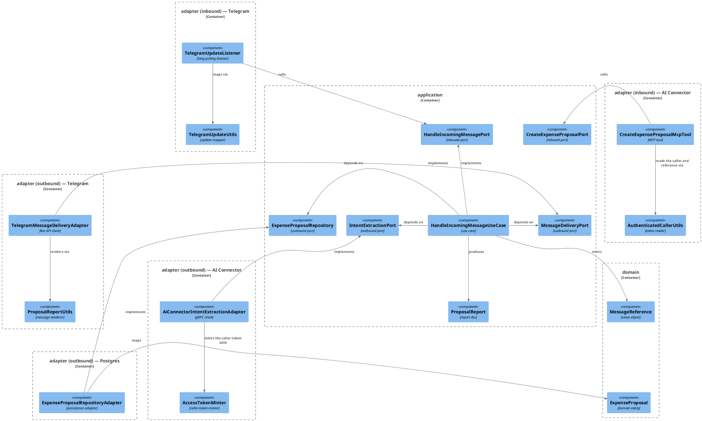
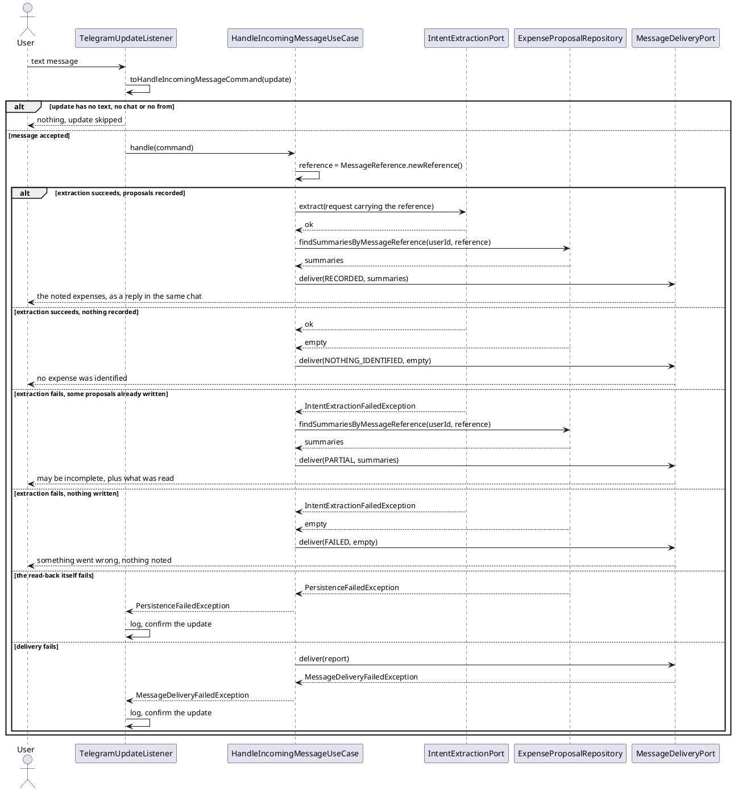

# Design: Identify the User by Telegram User Id and Report the Proposals Back

**Affected Modules:** `ledger-service`

## Objective

Two changes to how an incoming message is handled, both visible to whoever sent it.

- **Identity is the person, not the conversation.** A user is stored under the Telegram *user* id, so the same
  person keeps one ledger wherever they write from, and a group chat stops being a single shared identity.
- **Every message gets an answer.** Today the ledger calls the connector and says nothing, whatever happened. After
  this change it reads back the proposals that message produced and reports them — including the partial case,
  where the model errored after recording some of what it understood.

## Context

What exists, and what this change mirrors.

- **The incoming-message flow** — [`TelegramUpdateListener`](../ledger-service/src/main/java/bot/finance/adapter/telegram/TelegramUpdateListener.java)
  maps an update through [`TelegramUpdateUtils`](../ledger-service/src/main/java/bot/finance/adapter/telegram/TelegramUpdateUtils.java)
  into `HandleIncomingMessageCommand`, and
  [`HandleIncomingMessageUseCase`](../ledger-service/src/main/java/bot/finance/application/usecase/HandleIncomingMessageUseCase.java)
  initializes the user, loads the known categories and calls `IntentExtractionPort`. It returns `void` and tells
  the user nothing. Designed in [9-design-handle-incoming-message-extracts-intents](implemented/9-design-handle-incoming-message-extracts-intents.md).
- **Identity today** — the use case passes `command.conversationId()` straight into `InitializeUserCommand`, so the
  Telegram chat id is the user's `external_id`.
- **Where proposals come from** — the connector does not return them. `ExtractIntentsResponse` is empty
  ([`intent_extraction.proto`](../proto/intent_extraction.proto)); the model records each expense by calling the
  ledger's own MCP tool
  ([`CreateExpenseProposalMcpTool`](../ledger-service/src/main/java/bot/finance/adapter/mcp/CreateExpenseProposalMcpTool.java)),
  each call its own committed transaction. By the time the gRPC call returns — or fails — the rows are already in
  `expense_proposal`.
- **How the caller is identified inside a tool call** — the ledger mints a short-lived JWT per extraction
  ([`AccessTokenMinter`](../ledger-service/src/main/java/bot/finance/adapter/security/AccessTokenMinter.java)), the
  connector forwards it to the MCP endpoint **verbatim**
  ([`CallerTokenMcpRequestCustomizer`](../ai-connector-service/src/main/java/bot/finance/ai/adapter/ledger/CallerTokenMcpRequestCustomizer.java)),
  and the tool reads the subject back out of it
  ([`AuthenticatedCallerUtils`](../ledger-service/src/main/java/bot/finance/adapter/security/AuthenticatedCallerUtils.java)).
  A claim added to that token therefore round-trips into the tool call without touching the connector.
- **Nothing sends a message today.** `adapter/telegram` holds only inbound classes; the `TelegramBot` client bean
  ([`TelegramBotConfiguration`](../ledger-service/src/main/java/bot/finance/adapter/telegram/TelegramBotConfiguration.java))
  exists and is used for polling alone. This change adds the first outbound use of it.
- **Projection reads** — `findKnownCategories` in
  [`CategoryEntityRepository`](../ledger-service/src/main/java/bot/finance/adapter/persistence/CategoryEntityRepository.java)
  is the model for a joined read-model query returning a projection rather than an entity.

## Proposed Solution

### Domain

- **`domain/value/MessageReference`** — new record wrapping a `UUID`, validating presence in its compact
  constructor, with `MessageReference.newReference()` and `MessageReference.of(String)`. It identifies one handled
  message and is what ties a stored proposal back to it.
- **`domain/model/ExpenseProposal`** — carries a `MessageReference`, asserted present in the constructor like every
  other field. Both factories take it.

### Application

- **`application/dto/HandleIncomingMessageCommand`** — becomes
  `(String userExternalId, String conversationId, String inboundMessageId, String text)`. `userExternalId` is who
  the ledger stores; `conversationId` is where the answer goes; `inboundMessageId` is the message it answers. All
  validate as non-blank.
- **`application/dto/ProposalSummary`** — new read model:
  `(String categoryName, String parentCategoryName, String description, Optional<String> merchant, Money money)`.
- **`application/dto/ReportOutcome`** — new enum: `RECORDED`, `NOTHING_IDENTIFIED`, `PARTIAL`, `FAILED`.
- **`application/dto/ProposalReport`** — new record `(String conversationId, String inboundMessageId,
  ReportOutcome outcome, List<ProposalSummary> proposals)`. What to tell the user and where; not how to word it.
- **`application/port/MessageDeliveryPort`** — new outbound port, `void deliver(ProposalReport report)`,
  documenting `MessageDeliveryFailedException`.
- **`application/port/ExpenseProposalRepository`** — gains
  `List<ProposalSummary> findSummariesByMessageReference(long userId, MessageReference reference)`, ordered oldest
  first.
- **`application/dto/IntentExtractionRequest`** and **`application/dto/CreateExpenseProposalCommand`** — both carry
  the `MessageReference`.
- **`application/usecase/HandleIncomingMessageUseCase`** — the flow becomes:

  1. mint a `MessageReference` for this message;
  2. initialize the user from `command.userExternalId()`;
  3. call `IntentExtractionPort` with the reference, catching `IntentExtractionFailedException` and remembering
     that it failed rather than propagating;
  4. read the summaries written under that reference;
  5. map (failed?, empty?) onto a `ReportOutcome` and deliver the report.

  | extraction | proposals | outcome              |
  |------------|-----------|----------------------|
  | succeeded  | some      | `RECORDED`           |
  | succeeded  | none      | `NOTHING_IDENTIFIED` |
  | failed     | some      | `PARTIAL`            |
  | failed     | none      | `FAILED`             |

- **`application/usecase/CreateExpenseProposalUseCase`** — passes the command's reference into the entity.

### Adapters

- **`adapter/telegram/TelegramUpdateUtils`** — reads `message.from().id()` for `userExternalId`,
  `message.chat().id()` for `conversationId` and `message.messageId()` for `inboundMessageId`, skipping an update
  that has no `from` exactly as it skips one with no `chat`.
- **`adapter/telegram/TelegramMessageDeliveryAdapter`** — new outbound adapter implementing `MessageDeliveryPort`,
  sending a pengrad `SendMessage` through the existing `TelegramBot` bean with `replyToMessageId` set from the
  report's `inboundMessageId`, and translating a non-OK response or a client exception into
  `MessageDeliveryFailedException`. A report whose reply target no longer exists — the message was deleted — is
  sent unthreaded rather than lost.
- **`adapter/telegram/ProposalReportUtils`** — new, renders a `ProposalReport` into message text. The wording lives
  here, beside the transport whose limits shape it:

  ```
  Noted 2 expenses, pending your confirmation:
  • Groceries (Food) — weekly shop, Rewe: 42.30 EUR
  • Fuel (Auto) — tank refill: 60.00 EUR
  ```

  `NOTHING_IDENTIFIED` renders `No expense was identified in that message.`; `FAILED` renders
  `Something went wrong and nothing was noted — please try again.`; `PARTIAL` renders
  `Something went wrong, so this may be incomplete. What I could read:` above the same list. Nothing is worded as
  recorded or final while the rows live in `expense_proposal` (D20).

- **`adapter/security/AccessTokenMinter`** — `mint(String userExternalId, MessageReference reference)` adds the
  reference as the `mrf` claim.
- **`adapter/security/AuthenticatedCallerUtils`** — gains `messageReference()`, reading `mrf` off the validated
  token and throwing `InvalidIncomingMessageException` when it is absent or unparseable.
- **`adapter/mcp/CreateExpenseProposalMcpTool`** / **`ExpenseProposalToolUtils`** — read the reference alongside the
  user id and put it on the command. The tool's parameters do not change, so the tool schema the model sees is
  untouched.
- **`adapter/aiconnector/AiConnectorIntentExtractionAdapter`** / **`IntentProtoUtils`** — mint with the request's
  reference. The proto is unchanged: the reference travels in the token, not in `ExtractIntentsRequest`.
- **`adapter/persistence/ExpenseProposalEntity`**, **`ExpenseProposalEntityRepository`**,
  **`ExpenseProposalRepositoryAdapter`** — the entity gains `messageReference`; the repository gains a projection
  query in the style of `findKnownCategories`:

  ```sql
  SELECT c.name AS category_name, p.name AS parent_name, ep.description AS description,
         ep.merchant AS merchant, ep.amount_minor_units AS amount_minor_units,
         ep.currency_code AS currency_code
  FROM expense_proposal ep
  JOIN category c ON ep.category_id = c.id
  JOIN category p ON c.parent_id = p.id
  WHERE ep.user_id = :userId AND ep.message_reference = :messageReference
  ORDER BY ep.created_at, ep.id
  ```

- **`adapter/config/UseCaseConfiguration`** — wires `MessageDeliveryPort` into `HandleIncomingMessageUseCase`.

### Migration

`src/main/resources/db/migration/V004__add_expense_proposal_message_reference.sql`:

```sql
ALTER TABLE expense_proposal
    ADD COLUMN message_reference UUID;

UPDATE expense_proposal SET message_reference = gen_random_uuid() WHERE message_reference IS NULL;

ALTER TABLE expense_proposal
    ALTER COLUMN message_reference SET NOT NULL;

CREATE INDEX idx_expense_proposal_message_reference ON expense_proposal (user_id, message_reference);
```

Files touched: `V004__add_expense_proposal_message_reference.sql`, `MessageReference`, `ExpenseProposal`,
`MessageDeliveryFailedException`, `HandleIncomingMessageCommand`, `IntentExtractionRequest`,
`CreateExpenseProposalCommand`, `ProposalSummary`, `ProposalReport`, `ReportOutcome`, `MessageDeliveryPort`,
`ExpenseProposalRepository`, `HandleIncomingMessageUseCase`, `CreateExpenseProposalUseCase`,
`TelegramUpdateUtils`, `TelegramMessageDeliveryAdapter`, `ProposalReportUtils`, `AccessTokenMinter`,
`AuthenticatedCallerUtils`, `CreateExpenseProposalMcpTool`, `ExpenseProposalToolUtils`,
`AiConnectorIntentExtractionAdapter`, `IntentProtoUtils`, `ExpenseProposalEntity`,
`ExpenseProposalEntityRepository`, `ProposalSummaryProjection`, `ExpenseProposalRepositoryAdapter`,
`UseCaseConfiguration`.

### Diagrams

No container diagram: **Affected Modules** lists one module.





## Decisions

- **D1:** What identifies a user after this change?
- Answer: The Telegram user id (`message.from().id()`), stored as `app_user.external_id`. The chat id becomes
  `conversationId` and is used only as the address the report is sent to.
- Basis: decided — the user asked for the conversation id to be replaced by the actual Telegram user id
  (2026-08-02). Both fields are kept because the two answer different questions: replying needs a chat id, and in a
  group the user id is not one.

- **D2:** What happens to `app_user` rows created before this change, whose `external_id` is a chat id?
- Answer: Nothing — no data migration. In a private chat Telegram's chat id and user id are the same number, so
  every existing row keeps matching its owner. A row created from a group message would be orphaned, and its
  proposals become unreachable.
- Basis: assumed — every stored row today comes from the private-chat flow that
  [9-design-handle-incoming-message-extracts-intents](implemented/9-design-handle-incoming-message-extracts-intents.md)
  designed, and the deployment has one operator's own chats in it.

- **D3:** How does the ledger know which proposals came from *this* message?
- Answer: By a `MessageReference` minted per message, carried to the tool call as a claim on the caller token and
  stored in a new `expense_proposal.message_reference` column. The read-back matches on it.
- Basis: decided — the user chose the stored reference over a `created_at` window opened before the gRPC call
  (2026-08-02), so a proposal records which message produced it and no proposal written by anything else can fall
  inside the window and be reported as this message's.

- **D4:** How does the reference reach the MCP tool without changing the connector?
- Answer: As the `mrf` claim on the caller token `AccessTokenMinter` already mints per extraction. The tool reads it
  back through `AuthenticatedCallerUtils`.
- Basis: assumed — `CallerTokenMcpRequestCustomizer` forwards the token verbatim as the `Authorization` header, so
  the connector neither reads nor rewrites its claims, and `intent_extraction.proto` needs no field.

- **D5:** Does a failed extraction still propagate out of the use case?
- Answer: No. `IntentExtractionFailedException` is caught, logged at error, and turned into a `PARTIAL` or `FAILED`
  report. The use case returns normally.
- Basis: decided — the user asked for the proposals to be read and reported even when the model errored
  (2026-08-02); rethrowing would leave the report undelivered and the failure logged twice.

- **D6:** What does the user see when the connector is unreachable rather than the model failing?
- Answer: The `FAILED` report — an unreachable connector raises `IntentExtractionFailedException` from a gRPC
  status like `UNAVAILABLE`, and no proposals exist under the reference.
- Basis: assumed — `AiConnectorIntentExtractionAdapter` maps every `StatusRuntimeException` to that one exception,
  so a transport failure and a model failure are indistinguishable at the port.

- **D7:** What happens when the gRPC deadline expires while the model is still recording expenses?
- Answer: The same `PARTIAL` path. The deadline aborts the ledger's call, the rows already committed by earlier tool
  calls are read back, and the user is told the answer may be incomplete.
- Basis: assumed — the call carries the deadline configured as
  `spring.grpc.client.channel.ai-connector.default.deadline`, and each MCP tool call commits its own transaction
  (`ExpenseProposalRepositoryAdapter.create` is `@Transactional`), so partial work survives the abort.

- **D8:** Can the caller token expire mid-extraction and silently drop later tool calls?
- Answer: Not while `mcp.token.ttl` stays longer than the client deadline, which it is today: the call is aborted
  before the token expires, and D7's `PARTIAL` path covers what was recorded by then.
- Basis: assumed — both settings live in `ledger-service/src/main/resources/application.yaml`, and the ttl validator
  in `SecurityConfiguration` rejects anything longer than the configured maximum.

- **D9:** Who renders the report text?
- Answer: `ProposalReportUtils` in `adapter/telegram`. The core produces a `ProposalReport` — an outcome and a list
  of summaries — and never a string.
- Basis: assumed — the architecture conventions keep transport concerns out of `domain`/`application`, and the
  4096-character limit and formatting that shape the wording are Telegram facts.

- **D10:** What does a report line contain?
- Answer: Category and its grouping, the description, the merchant when present, and the amount with its currency
  code — `• Groceries (Food) — weekly shop, Rewe: 42.30 EUR`. `Money.amount()` renders the minor units.
- Basis: assumed — those are exactly the fields `create_expense_proposal` accepts, so the line shows the user what
  the model filed and nothing it did not.

- **D11:** What happens when a report is longer than Telegram allows?
- Answer: `ProposalReportUtils` lists proposals until the text would exceed 4000 characters, then appends
  `… and N more.`. One message is always sent.
- Basis: assumed — the Bot API rejects a `sendMessage` over 4096 characters, and a message producing that many
  proposals is already outside what a user reads in a chat.

- **D12:** What happens when the report cannot be delivered?
- Answer: `MessageDeliveryFailedException` propagates to `TelegramUpdateListener`, which logs it and confirms the
  update. Nothing is retried and nothing is rolled back — the proposals stay recorded.
- Basis: assumed — `TelegramUpdateListener.handle` already swallows a `RuntimeException` per update so the poll loop
  survives, and the proposals were committed by tool calls that this failure has no bearing on.

- **D13:** Does the user find out that the read-back itself failed?
- Answer: No. A `PersistenceFailedException` from the summary query propagates to the listener and is logged; no
  message is sent.
- Basis: assumed — the same swallow-and-log path as D12, and a database that cannot answer a read cannot be relied
  on to say anything truthful about what was stored.

- **D14:** In what order are proposals listed?
- Answer: Oldest first — `ORDER BY ep.created_at, ep.id` — so the report follows the order the user wrote them in.
- Basis: assumed — the model calls the tool once per expense as it reads the message
  ([ADR 0008](adr/0008-the-connector-hands-expense-recording-to-the-model.md)), and `id` breaks a tie between two
  rows stamped in the same microsecond.

- **D15:** Are proposals the model tried and failed to record shown to the user?
- Answer: No. A rejected `create_expense_proposal` call stores no row, so it appears in no report; the model's own
  retry with a corrected category is what the user sees, if it succeeds.
- Basis: assumed — `CreateExpenseProposalMcpTool` returns an error result without writing, and the rejection text is
  written for the model rather than for a person.

- **D16:** Does an update with no `from` reach the use case?
- Answer: No. `TelegramUpdateUtils` returns empty for it, exactly as it does for a message with no `chat` or no
  text, and the listener logs the skip.
- Basis: assumed — the existing method already treats every part it cannot map as a skip rather than an error, and
  `from` is absent on channel posts.

- **D17:** Does one user's slow extraction delay everyone else's messages?
- Answer: Yes, and this change does not address it. `TelegramUpdateListener.process` handles a batch sequentially on
  the poll thread, so a 60s extraction blocks the updates behind it.
- Basis: deferred — pre-existing, and unchanged by this design. It comes back when more than one person uses the
  bot, and the fix is handing each update to the executor rather than anything in this file.

- **D18:** What proves in production which message a report answered?
- Answer: The use case logs the message reference with the user's external id at info when it delivers, and at error
  with the outcome when extraction failed.
- Basis: assumed — the logging convention in
  [code-style](../ledger-service/docs/conventions/code-style.md); the reference is the only value that correlates a
  gRPC call, a set of tool calls, and a report.

- **D19:** Who reads the report when the message came from a group chat?
- Answer: Everyone in it. The report goes to `conversationId` — the chat the message came from — as a reply to the
  message that produced it, so a group reader can tell whose expenses it lists. `HandleIncomingMessageCommand` and
  `ProposalReport` therefore carry an `inboundMessageId`, which the adapter sets as `reply_to_message_id`.
- Basis: decided — the user chose replying in the chat over private-chat-only handling and over delivering to the
  user id (2026-08-02); a DM fails outright for anyone who has never started a private chat with the bot, and a
  group expense list is not treated as private.

- **D20:** What can the user do with what the report tells them was recorded?
- Answer: Read it, and nothing else yet. The wording says so — `RECORDED` renders
  `Noted 2 expenses, pending your confirmation:` rather than `Recorded`, so the report describes a proposal and
  promises no lifecycle. Confirming, editing and discarding stay out of this change.
- Basis: decided — the user chose the proposal wording over calling a proposal an expense and over widening this
  change to promote proposals into `expense` (2026-08-02); the honest wording costs nothing now and does not turn
  every past report into a lie when the confirm flow lands.

- **D21:** What happens to a proposal the model records after the read-back has already run?
- Answer: It stays in `expense_proposal` and appears in no report, ever. The deadline aborts the ledger's call and
  the read-back follows immediately, while a tool call already in flight commits in its own transaction.
- Basis: assumed — this is only reachable on the aborted path (D7), where the report already says the answer may be
  incomplete, and `ExpenseProposalRepositoryAdapter.create` commits per call, so the row is durable and consistent
  even though unreported.

- **D22:** Does the user get a report when the extraction call fails with something other than
  `IntentExtractionFailedException`?
- Answer: No. `InvalidExtractionRequestException` from the request record, or the `IllegalStateException`
  `AccessTokenMinter` raises when signing fails, propagates past the catch in step 3 to `TelegramUpdateListener`,
  which logs it and confirms the update. The user sees nothing.
- Basis: assumed — the same swallow-and-log path as D12 and D13; those failures mean the ledger could not form or
  authorize the call at all, which is a defect rather than an outcome to report.

- **D23:** Does a redelivered update produce a second set of proposals and a second report?
- Answer: Yes, if the process dies before `TelegramUpdateListener.process` returns. The retry mints a fresh
  `MessageReference.newReference()`, so the second run is a different message: the proposals are stored twice and
  the user is told twice.
- Basis: deferred — `process` returns `CONFIRMED_UPDATES_ALL` for every batch it completes, so a handled update is
  never redelivered; only a crash inside the batch reopens the window, which the duplicate rows already had before
  this design. It comes back if the reference is derived from the Telegram message id rather than minted, which is
  what would make the retry idempotent.

- **D24:** How does a `String conversationId` become a Bot API chat id, and does the rendered text need escaping?
- Answer: It is passed through as a string — pengrad's `SendMessage(String, String)` overload takes the chat id
  verbatim, and the Bot API accepts a numeric chat id in string form. The reply target goes on the same request as
  `replyToMessageId` (D19). No parse mode is set, so a description or merchant containing `*` or `_` is sent
  literally and needs no escaping.
- Basis: assumed — the constructor is on `com.pengrad.telegrambot.request.SendMessage` in the cached
  `java-telegram-bot-api` jar, and `parseMode` is an optional builder parameter that this adapter does not set.
  Setting one later would make every rendered field an escaping problem.

- **D25:** What does the migration do to `expense_proposal` rows that already exist?
- Answer: Each gets its own random `message_reference`, so every stored proposal becomes its own one-proposal
  message and no old row is ever grouped with another. `gen_random_uuid()` is built in — no extension is enabled.
- Basis: assumed — `postgres:18` is the image in both `infrastructure/docker-compose.yaml` and
  `PostgresContainers`, and `gen_random_uuid()` has been core since Postgres 13. The `SET NOT NULL` rewrite scan is
  bounded by a table that only the private-chat flow has written to (D2).

## Design Findings

Grilled (2026-08-02): nothing to raise on contract compat — the MCP tool schema, `intent_extraction.proto` and the
JWT validators in `SecurityConfiguration` are all unchanged or additively extended (D4, D8); nothing on
authorization within a conversation — the `mrf` claim rides the token the ledger mints and validates itself;
nothing on the projection query — `CreateExpenseProposalUseCase.resolveCategoryId` rejects a parent-less category,
so the inner join to `category p` drops no stored proposal; nothing on limits — the new query is covered by the
index the migration adds and its output is bounded at render time (D11).
