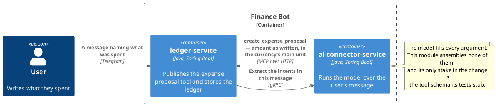
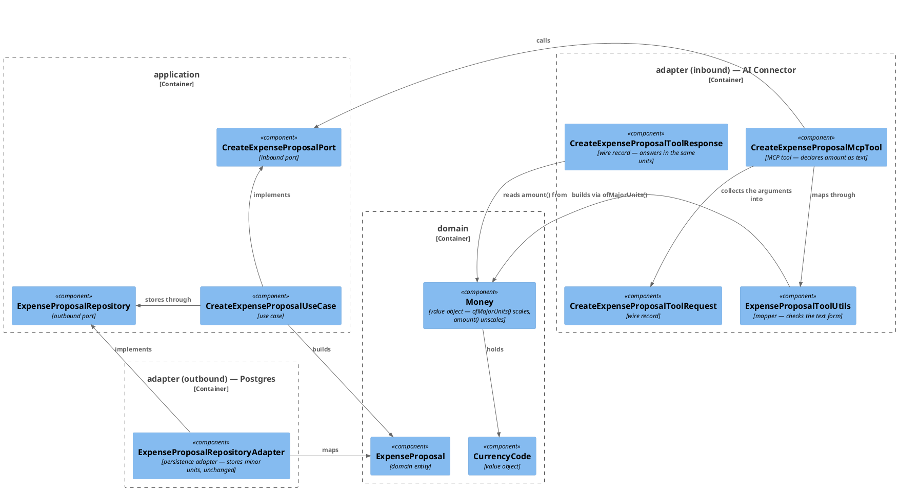
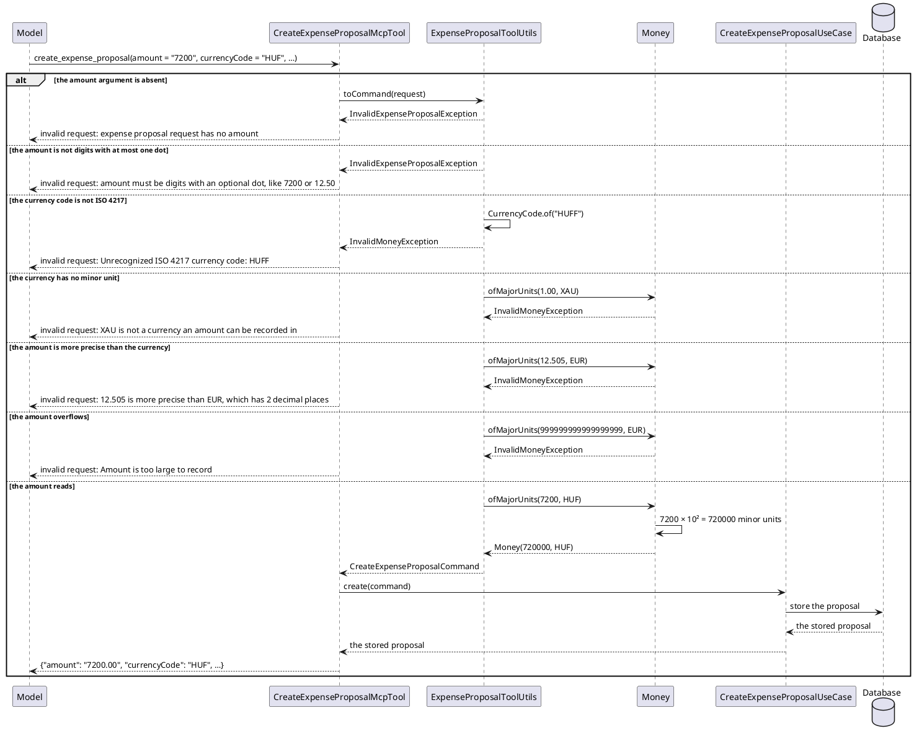

# Design: The Expense Tool Takes the Amount as the User Wrote It

**Affected Modules:** `ledger-service`, `ai-connector-service`

## Objective

A message saying *"groceries at Tesco, 7200 HUF"* is stored as 72.00 HUF today. The tool asks the model for the
amount in minor units, the model sends the number the user typed, and nothing can tell the two apart — `7200` is a
legal value for both readings.

This change moves the conversion off the model and into the ledger. The tool takes the amount as text in the
currency's main unit, and the ledger scales it by that currency's own fraction digits. What the model can get wrong
shrinks to copying a number out of a sentence, and every miscopy that is not a number at all becomes a refusal the
model is told how to correct.

## Context

What exists, and what this change builds on.

- **The tool** — [`CreateExpenseProposalMcpTool`](../ledger-service/src/main/java/bot/finance/adapter/mcp/CreateExpenseProposalMcpTool.java)
  declares six `@McpToolParam` arguments, among them `Long amountMinorUnits` described as *"the amount in the
  currency's minor units, required - 12.50 EUR is 1250"*. It maps them through
  [`ExpenseProposalToolUtils`](../ledger-service/src/main/java/bot/finance/adapter/mcp/ExpenseProposalToolUtils.java)
  onto `CreateExpenseProposalCommand`, and answers with
  [`CreateExpenseProposalToolResponse`](../ledger-service/src/main/java/bot/finance/adapter/mcp/CreateExpenseProposalToolResponse.java),
  which carries `long amountMinorUnits` back into the model's context. Designed in
  [8-design-mcp-adapter-create-expense-proposal](implemented/8-design-mcp-adapter-create-expense-proposal.md).
- **The money type** — [`Money`](../ledger-service/src/main/java/bot/finance/domain/value/Money.java) is
  `(long minorUnits, CurrencyCode currencyCode)`, and `amount()` already holds the scale rule in one direction:
  `BigDecimal.valueOf(minorUnits, Currency.getInstance(code).getDefaultFractionDigits())`. Its invariants are
  [money.md](../ledger-service/docs/domain/money.md) — non-negative, a currency present, the currency sets the
  scale, the amount exact.
- **Why HUF broke** — `Currency.getInstance("HUF").getDefaultFractionDigits()` is **2**: ISO 4217 assigns the
  forint two minor digits whatever Hungarian practice is. So 7200 minor units is 72.00 HUF, and the mapping did
  exactly what it was told.
- **Who fills the arguments** — the model, from the published schema and nothing else. The connector assembles
  none of them ([ledger-mcp.md](../ai-connector-service/docs/contracts/out/ledger-mcp.md)), and its prompts
  ([`record-expenses.st`](../ai-connector-service/src/main/resources/prompts/record-expenses.st)) say to fill each
  argument *"from what the tool says it takes"*. The minor-units instruction lives in the argument description and
  nowhere else.
- **What a refusal does** — a tool error result reaches the model as that call's answer; it corrects the call and
  retries that one expense once, and a second refusal leaves the expense unrecorded while the rest of the message
  is still sent ([mcp.md](../ledger-service/docs/contracts/in/mcp.md), `ledger-mcp.md`).
- **How the schema is published** — `McpJsonSchemaGenerator.generateForMethodInput` in
  `spring-ai-mcp-annotations-2.0.0` builds one JSON Schema node per parameter from its declared type, appends the
  `@McpToolParam` description, and lists a parameter in `required` when the annotation says so. A `String`
  parameter is published as `{"type": "string", "description": …}`.
- **How an argument is bound** — `AbstractMcpToolMethodCallback.buildTypedArgument` hands the raw JSON value to
  `JsonHelper.convertToTypedObject(value, String.class)` (spring-ai-commons), which converts through Jackson and
  falls back to a `toJson`/`fromJson` cycle.

## Proposed Solution

Every change is on the path between the tool's arguments and `Money`. Nothing downstream of `Money` moves: the
command, the entity, the `amount_minor_units` column and the report still speak minor units, and there is no
migration.

### Domain

- **`domain/value/Money`** — gains one static factory beside `amount()`, which is its inverse:

  ```java
  public static Money ofMajorUnits(BigDecimal amount, CurrencyCode currencyCode)
  ```

  It rejects a null amount, reads `Currency.getInstance(currencyCode.code()).getDefaultFractionDigits()`, and
  builds the minor units as `amount.movePointRight(fractionDigits).setScale(0).longValueExact()`. The two
  `ArithmeticException`s that sequence can throw are caught inside the factory and rethrown as
  `InvalidMoneyException` — one is scale, the other magnitude, and each names a different thing for the model to
  correct. An `ArithmeticException` reaching the tool would be rendered as the catch-all's *"the proposal could not
  be created"*, which names nothing to retry with (D22):

  | Condition                                              | Message                                                                       |
  |--------------------------------------------------------|-------------------------------------------------------------------------------|
  | the currency has no minor unit (fraction digits `< 0`) | `XAU is not a currency an amount can be recorded in`                          |
  | `setScale(0)` drops a non-zero digit                   | `12.505 is more precise than EUR, which has 2 decimal places`                 |
  | `longValueExact()` overflows                           | `Amount is too large to record`                                               |

  The canonical constructor and `amount()` are untouched, so the negative-amount and null-currency rules stay
  where they are and every existing caller is unaffected.

### Adapters

All in `adapter/mcp` — the box that fronts the model.

- **`CreateExpenseProposalMcpTool`** — the fifth parameter becomes `String amount`, still `required`, described as:

  ```
  the amount exactly as the message writes it, in the currency's main unit — 7200 for 7200 HUF, 12.50 for
  12.50 EUR. Digits, and at most one dot for the decimals. Never convert it, never group the digits.
  ```

  `InvalidMoneyException` is already caught and rendered as `invalid request: <message>`, so every rejection above
  reaches the model as a retryable tool error without a new catch clause.
- **`CreateExpenseProposalToolRequest`** — `Long amountMinorUnits` becomes `String amount`.
- **`ExpenseProposalToolUtils.toCommand`** — replaces the null check on `amountMinorUnits` with the text checks,
  then hands a `BigDecimal` to the domain:

  | Argument     | Outcome                                                                  |
  |--------------|---------------------------------------------------------------------------|
  | absent, null | `InvalidExpenseProposalException` — `expense proposal request has no amount` |
  | not matching `^\d{1,18}(\.\d{1,4})?$` after `strip()` | `InvalidExpenseProposalException` — `amount must be digits with an optional dot, like 7200 or 12.50` |
  | matching     | `Money.ofMajorUnits(new BigDecimal(stripped), CurrencyCode.of(request.currencyCode()))` |

  The pattern is what keeps `BigDecimal` from accepting forms the description never offered — a sign, an exponent,
  a grouped `7,200` — and it bounds the input before any arithmetic runs.
- **`ExpenseProposalToolUtils.toResponse`** — returns `proposal.money().amount().toPlainString()` for the new
  field.
- **`CreateExpenseProposalToolResponse`** — `long amountMinorUnits` becomes `String amount`, so the answer speaks
  the units the call spoke.

### Tests and fixtures that move with the contract

- `ledger-service` — `McpRequests.createExpenseProposal` takes the amount as a `String` and writes it as a JSON
  string; `ExpenseProposalToolUtilsTest`, `CreateExpenseProposalMcpToolTest`,
  `CreateExpenseProposalMcpToolSystemTest`, `McpAuthenticationSystemTest` and `MoneyTest` follow the new argument.
- `ai-connector-service` — `McpLedgerStubs.stubToolsList` publishes `"amount": {"type": "string"}` in place of
  `"amountMinorUnits": {"type": "integer"}` and lists it in `required`; the stubbed model tool calls in
  `AiExpenseRecordingAdapterTest` and `ExtractIntentsSystemTest` send `"amount":"15.00"` and assert on it. No
  production class in this module changes.

Files touched: `Money`, `CreateExpenseProposalMcpTool`, `CreateExpenseProposalToolRequest`,
`CreateExpenseProposalToolResponse`, `ExpenseProposalToolUtils`, plus the test files above.

### Diagrams







## Decisions

- **D1:** In what units, and in what type, does the tool take the amount?
- Answer: As text, in the currency's main unit, in an argument named `amount` — `"7200"` for 7200 HUF, `"12.50"`
  for 12.50 EUR. The ledger scales it to minor units.
- Basis: decided — the user chose a string argument on the tool with the promotion to minor units happening in the
  ledger (2026-08-03). Text also keeps `12.10` off a binary float, which a JSON number would not.

- **D2:** Where does the major-to-minor conversion live?
- Answer: In the domain, as `Money.ofMajorUnits(BigDecimal, CurrencyCode)`.
- Basis: assumed — [money.md](../ledger-service/docs/domain/money.md) states "the currency sets the scale" as a
  `Money` invariant, and `Money.amount()` already holds the same rule in the other direction. Putting the inverse
  in an adapter would leave one rule in two layers, and the second adapter to need it would copy it.

- **D3:** Where is the *text* form checked?
- Answer: In `ExpenseProposalToolUtils`, before a `BigDecimal` exists. The domain factory takes a `BigDecimal` and
  never a wire string.
- Basis: assumed — the architecture conventions keep transport shapes out of `domain`/`application`
  ([architecture.md](../ledger-service/docs/conventions/architecture.md)); what a JSON argument may look like is a
  fact about this tool, while the scale is a fact about money.

- **D4:** Exactly what text is accepted?
- Answer: `^\d{1,18}(\.\d{1,4})?$`, after `strip()`. Digits, optionally one dot and up to four decimals; nothing
  else. Anything longer or otherwise shaped is refused before any arithmetic.
- Basis: assumed — the description offers exactly this form, `\d` is ASCII-only in Java regex, and four decimals
  clears every ISO 4217 currency (three is the maximum, `getDefaultFractionDigits()`). The 18-digit cap keeps a
  pathological argument from reaching `BigDecimal` at all.

- **D5:** Is a comma decimal separator, a grouped `7,200`, a space or a currency symbol accepted?
- Answer: No. All are refused with the message naming the accepted form, and the model retries.
- Basis: assumed — `1,500` reads as both 1.5 and 1500 depending on locale, and a tool that guesses which is the bug
  this change exists to remove. A refusal is cheap: `ledger-mcp.md` has the model correct the call and retry that
  expense once.

- **D6:** What happens to an amount more precise than its currency — `12.505 EUR`, `7200.505 HUF`?
- Answer: Refused, naming the currency's decimal places. Nothing is rounded.
- Basis: assumed — [money.md](../ledger-service/docs/domain/money.md) invariant "the amount is exact"; silently
  rounding a user's number is the same class of error as silently rescaling it.

- **D7:** What happens for a currency with no minor unit at all?
- Answer: Refused as not a currency an amount can be recorded in. `Currency.getDefaultFractionDigits()` returns
  `-1` for the metals and the no-transaction codes (`XAU`, `XXX`), and `movePointRight(-1)` would divide by ten.
- Basis: assumed — `CurrencyCode` admits any code `java.util.Currency` knows, which includes those; the guard is on
  the new factory only, so no existing behaviour changes.

- **D8:** What happens to an amount too large for `long` minor units?
- Answer: Refused with its own message, from `longValueExact()`.
- Basis: assumed — `Money` stores `long minorUnits` and `amount_minor_units` is a `BIGINT`; the alternative is a
  silently truncated amount, which is what this design is removing.

- **D9:** Are zero and negative amounts still handled as before?
- Answer: Yes. `"0"` matches the pattern and is stored, as [mcp.md](../ledger-service/docs/contracts/in/mcp.md)
  already promises for a deliberate zero. A leading `-` fails the pattern and is refused before `Money`'s own
  non-negative rule is reached.
- Basis: assumed — both rules exist today, in the contract and in `Money`'s compact constructor; the pattern only
  changes which of the two rejects a negative.

- **D10:** What does the tool answer with — minor units, or the amount as taken?
- Answer: `amount`, the plain decimal string from `Money.amount()`, replacing `amountMinorUnits`.
- Basis: assumed — `mcp.md` records that "everything returned enters a model's context", and handing a model 720000
  back after it sent 7200 invites exactly the correction that caused this bug. Answering in the units the call
  spoke means a model reading its own result learns nothing contradictory.

- **D11:** Is `amountMinorUnits` renamed in place, or does the change publish a new tool?
- Answer: Renamed in place. `create_expense_proposal` keeps its name and its five other arguments; `amount`
  replaces `amountMinorUnits` outright, and no deprecated argument is carried alongside it. `mcp.md`'s
  Compatibility clause is reworded by the archiving step (D25) to bind clients outside this repository — inside it,
  the tool and its one caller ship together.
- Basis: decided — the user chose renaming in place over carrying both arguments for a release and over publishing
  a new tool name (2026-08-03). Two ways to state an amount would give the model a new way to get it wrong, which
  is what this change exists to close; the stale-schema cost is D21's, and a restart clears it.

- **D12:** What does a connector process still holding the old schema do during a rolling deploy?
- Answer: Its calls are refused, and the user is told nothing about why. The model sends `amountMinorUnits`, the new
  tool sees no `amount` and answers `expense proposal request has no amount`; the one retry fails the same way and
  the expense goes unrecorded, which the report renders as `NOTHING_IDENTIFIED` (D20). No amount is stored wrongly,
  and the state is self-correcting — see D21 for how long it lasts.
- Basis: assumed — the connector lists the tools once per process (`ledger-mcp.md`), and an argument the schema
  does not declare is dropped at binding rather than mapped
  (`AbstractMcpToolMethodCallback.buildMethodArguments` reads each declared parameter by name).

- **D13:** What if the model sends a JSON number where the schema says string?
- Answer: It is refused before the tool runs, and the model corrects the call. No amount is stored.
- Basis: verified during implementation (2026-08-04) — spring-ai-mcp validates the arguments against the generated
  JSON Schema *ahead* of binding, so a number under a `"type": "string"` field comes back as
  `input validation failed: … [/amount: integer: string found, {2} expected]` and the tool method never runs;
  Jackson's coercion in `AbstractMcpToolMethodCallback.buildTypedArgument` is never reached. This is `mcp.md`'s
  "an argument's value cannot be read as the type the schema declares" row. An earlier reading of this design had
  the number coercing to text and recording 7200 — it does not, and the difference is only ever a refusal the
  model retries, never a wrong amount.

- **D14:** Do the connector's prompts change?
- Answer: No. `record-expenses.st` and `user-message.st` are untouched.
- Basis: assumed — `record-expenses.st` already says to fill each argument "from what the tool says it takes", and
  `ledger-mcp.md` records that the conversion instruction is read from the argument description, "not from this
  service's instructions". Restating a unit rule in a prompt is how it drifts from the schema.

- **D15:** Is the accepted form published as a JSON-Schema `pattern` beside the description?
- Answer: No. The description states the form and the tool error names it on a miss.
- Basis: deferred — the schema generator does honour it (it registers `Swagger2Module`, so `@Schema(pattern = …)`
  would appear), but that puts a Swagger annotation on the tool method and no provider guarantees it enforces one.
  It comes back if refusals for malformed amounts turn out to be common in the logs.

- **D16:** Does anything stored change?
- Answer: No. `Money`'s canonical form, `CreateExpenseProposalCommand`, `ExpenseProposalEntity`,
  `expense_proposal.amount_minor_units` and every read model stay in minor units. There is no migration, and rows
  written before this change keep their meaning.
- Basis: assumed — the conversion lands entirely between the tool's arguments and `Money`; nothing downstream of
  `Money` ever saw the tool's units.

- **D17:** Does the Telegram report change?
- Answer: Not in this change. `ProposalReportUtils` still prints `Money.amount()`, so a correctly stored 7200 HUF
  now reads `7200.00 HUF` — right value, two decimals the forint does not use.
- Basis: deferred — display is a separate decision from storage, and this change makes the number correct first. It
  comes back as per-currency rendering when a zero-decimal currency is used in earnest.

- **D18:** Do proposals already stored at the wrong scale get fixed?
- Answer: No. Rows written before this change keep the minor units they were stored with, and a 72.00 HUF row stays
  72.00 HUF.
- Basis: assumed — nothing in the tool's history distinguishes a row the model under-scaled from one a user really
  spent, so a corrective migration would have to guess. The rows are proposals awaiting a human, and the deployment
  is one operator's own (D2 of
  [11-design-report-expense-proposals-to-the-user](implemented/11-design-report-expense-proposals-to-the-user.md)).

- **D19:** Is `7200.50 HUF` really refused, as D6 says?
- Answer: No — it is accepted and stored as 720050 minor units. The refusal rule is ISO 4217's fraction digits, and
  the forint has two of them; the only HUF amount this refuses is one with three or more decimals. D6's second
  example states an outcome the design does not produce.
- Basis: assumed — the Context section's own "Why HUF broke" establishes
  `Currency.getInstance("HUF").getDefaultFractionDigits()` is 2, and `Money.amount()` reads the same value. Left as
  written, the example becomes a plan scenario asserting a refusal that will never happen.

- **D20:** What does an expense refused twice look like to the user, and does D12's "a report saying so" exist?
- Answer: Nothing names the refusal. `HandleIncomingMessageUseCase.outcomeFor` reads only whether extraction failed
  and whether any proposal was stored, so a message whose every expense was refused reports `NOTHING_IDENTIFIED` —
  *"No expense was identified in that message."* — and a message with one refused among several reports `RECORDED`
  listing the rest. D12's answer overstates what the user is told.
- Basis: assumed — `HandleIncomingMessageUseCase.outcomeFor`, `ProposalReportUtils.render`, and `ledger-mcp.md`
  ("that expense is left unrecorded and the rest of the message is still sent"). The behaviour is pre-existing and
  this change does not touch it; what changes is how often a refusal happens.

- **D21:** Is a connector holding the old schema a deploy window, or does it last?
- Answer: It lasts. `infrastructure/docker-compose.yaml` is the deployment — one stack, both services built from the
  same context — so bringing the stack up recreates both and no stale schema survives. Recreating `ledger-service`
  alone leaves the running connector container holding the old tool list for the life of that process, refusing
  every expense until it is restarted, and the compose file declares no dependency that forces the restart.
- Basis: assumed — `ledger-mcp.md` ("the tools are listed once … and that list is kept for the life of the
  process") and `infrastructure/docker-compose.yaml`. D12's basis cites `build.yml` as building and releasing both
  images; that workflow builds and tests each module on a pull request and releases nothing.

- **D22:** Do the new failures reach the model as tool errors, or as the catch-all?
- Answer: Only if the factory throws `InvalidMoneyException` itself. `BigDecimal.setScale(0)` and `longValueExact()`
  throw `ArithmeticException`, which no clause of `CreateExpenseProposalMcpTool` names, so an uncaught one falls to
  `catch (RuntimeException) → "the proposal could not be created"` — a message naming nothing to correct, on which
  the model spends its one retry identically.
- Basis: assumed — the catch chain in `CreateExpenseProposalMcpTool.createExpenseProposal` and the one-retry policy
  in `ledger-mcp.md`. The design's message table already requires `InvalidMoneyException`; this names what enforces
  it.

- **D23:** Does the amount reach the logs, and is that allowed?
- Answer: Yes, at `warn`. `rejected()` logs the exception's message, and the new messages embed the caller's own
  number — *"12.505 is more precise than EUR"*. It stays.
- Basis: assumed — `CurrencyCode`'s `"Unrecognized ISO 4217 currency code: HUFF"` already puts a caller-supplied
  argument in the same line, so mcp.md's "with neither the arguments nor the token" already reads as *the argument
  record*, not every value. Keeping an amount out would mean a message naming the currency's precision without
  echoing the number, which is the thing the model needs to see it got wrong.

- **D24:** What proves in production that a malformed amount was refused, and how is D15 ever revisited?
- Answer: One `warn` line per refusal, carrying the exception's simple name and message; nothing counts them and no
  metric exists. `InvalidMoneyException` covers the unknown currency, the over-precise amount, the currency with no
  minor unit and the overflow alike, so only the message text separates them — D15's "common in the logs" is a grep
  over that text.
- Basis: assumed — `CreateExpenseProposalMcpTool.rejected` and mcp.md ("Every rejection is logged with the kind of
  failure"). No counter or metric exists anywhere in the module to extend.

- **D25:** The contract pages still say minor units — when are they rewritten?
- Answer: After implementation, not in this change. `mcp.md` names `amountMinorUnits` in its argument table, in
  "What the tool answers with", and in "An absent `amountMinorUnits` is refused rather than read as zero";
  `ledger-mcp.md` says the minor-units conversion is read from the argument description. All four are stale the
  moment this ships.
- Basis: assumed — [agent.md](../ledger-service/docs/conventions/agent.md) Post-Implementation Actions runs
  `archive-knowledge` over the finished plan, which owns the contract pages. The plan carries them; the design's
  Files-touched list is production and test code only.

## Design Findings

Grilled (2026-08-03): nothing to raise on idempotency & retry, concurrency, authorization, limits.
