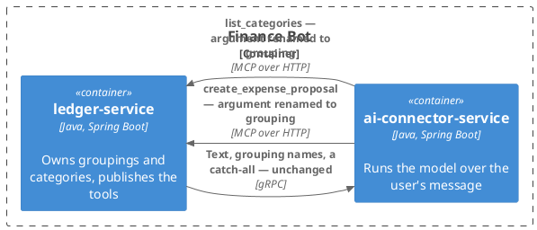
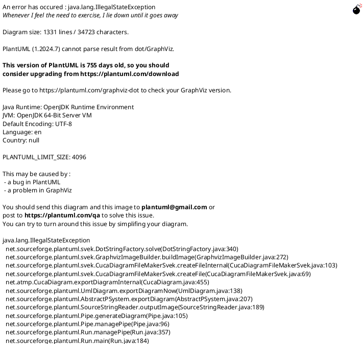
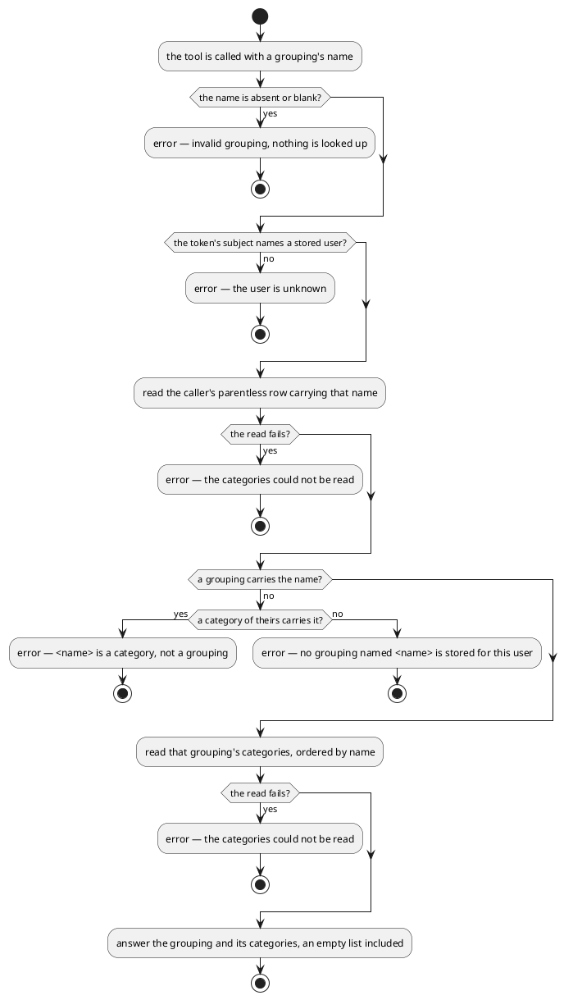
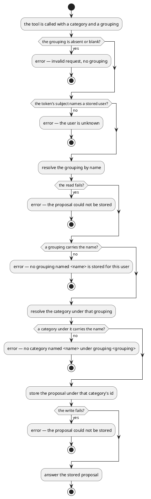

# Design: A Grouping and a Category Are Different Types

**Affected Modules:** `ledger-service`, `ai-connector-service`

## Objective

One record — `Category(String name, List<Category> children)` — stands for both a grouping and a category, and
which one an instance is has to be inferred from its data: a non-empty `children` list on the way in, an empty
`Optional<String> parentName` on the way out. Every rule that turns on the distinction is therefore written in a
use case, as a filter or a refusal, rather than in a type.

This change makes them two types. A `Grouping` holds categories; a `Category` holds nothing and is always read
from under a grouping. The rules that survive are the ones that must — a name still arrives as a string from a
model, and a string that names nothing is still refused at runtime — and the ones that only existed to sort one
kind of row from another disappear. Nothing is blocked on this; it buys expressiveness, and D20 states plainly
what it costs.

## Context

What exists, and what this change reshapes.

- **The one type** — [`Category`](../../ledger-service/src/main/java/bot/finance/domain/value/Category.java):
  `(String name, List<Category> children)`, with `leaf(...)`, `group(...)`, `catchAllGroupingName()` and
  `defaults()` — 20 groupings holding about 90 categories, `Travel` appearing both as a grouping and under
  `Insurance`. Its compact constructor rejects a grandchild with `category tree exceeds two levels`.
- **The one read model** — [`StoredCategory`](../../ledger-service/src/main/java/bot/finance/application/dto/StoredCategory.java):
  `(long id, String name, Optional<String> parentName)`. The empty `parentName` is what every read-side rule
  tests.
- **The one outbound port** — [`CategoryRepository`](../../ledger-service/src/main/java/bot/finance/application/port/CategoryRepository.java):
  `findByUserIdAndName`, `findChildNames`, `findGroupingNames`, implemented by
  [`CategoryRepositoryAdapter`](../../ledger-service/src/main/java/bot/finance/adapter/persistence/CategoryRepositoryAdapter.java)
  over [`CategoryEntityRepository`](../../ledger-service/src/main/java/bot/finance/adapter/persistence/CategoryEntityRepository.java).
  `findByUserIdAndName` maps each row through `toStoredCategory`, which issues a `findById` per row to fetch the
  parent's name — one query plus one per candidate.
- **The rules written in use cases** —
  [`ListCategoriesUseCase.resolveGrouping`](../../ledger-service/src/main/java/bot/finance/application/usecase/ListCategoriesUseCase.java)
  picks the candidate whose `parentName` is empty and refuses `<name> is a category, not a grouping` otherwise;
  [`CreateExpenseProposalUseCase.resolveCategoryId`](../../ledger-service/src/main/java/bot/finance/application/usecase/CreateExpenseProposalUseCase.java)
  looks a name up and then narrows the candidates by parent name;
  [`HandleIncomingMessageUseCase`](../../ledger-service/src/main/java/bot/finance/application/usecase/HandleIncomingMessageUseCase.java)
  sends `findGroupingNames`, whose query filters to parentless rows that have at least one child.
- **The published vocabulary** — both MCP tools take an argument named `parentCategory`
  ([mcp.md](../../ledger-service/docs/contracts/in/mcp.md)), while the extraction request already says
  `category_groupings` and `catch_all_grouping`
  ([intent_extraction.proto](../../proto/intent_extraction.proto)) and the prompts already say "grouping"
  ([user-message.st](../../ai-connector-service/src/main/resources/prompts/user-message.st)).
- **What holds the shape up in the store** —
  [ADR 0003](../../ledger-service/docs/adr/0003-a-category-is-unique-per-user-and-parent-not-per-user.md): one
  `category` table, self-referencing, unique on `(user_id, parent_id, name)` with `NULLS NOT DISTINCT`, which is
  what makes `Travel` legal twice.
- **Where this came from** — **D35** of
  [13-the-model-looks-up-a-groupings-categories](../implemented/13-the-model-looks-up-a-groupings-categories/design.md),
  deferred to this design.
- **The nearest change to mirror** —
  [12-the-expense-tool-takes-the-amount-as-written](../implemented/12-the-expense-tool-takes-the-amount-as-written/design.md),
  which reshaped a tool argument in place and left the contract pages to `archive-knowledge`.

## Proposed Solution

No migration, no proto edit, no new table. The change is two domain types, two read models, two outbound ports,
one renamed tool argument, and the use cases that shrink around them.

### `ledger-service`

**Domain**

- **`domain/value/Category`** — becomes `record Category(String name)`. Its compact constructor keeps the
  blank-name check and loses everything else: no child list, no null-child check, no
  `category tree exceeds two levels` (D5). Throws `InvalidCategoryException`.
- **`domain/value/Grouping`** — new, `record Grouping(String name, List<Category> categories)`. Its compact
  constructor rejects a blank name, a null list, and a null element, and copies the list. Carries the static
  factories the catalogue is written with:

  ```java
  public static Grouping of(String name, String... categoryNames);
  public static String catchAllName();
  public static List<Grouping> defaults();
  ```

  `defaults()` is today's `Category.defaults()` verbatim, with `group(...)` reading `Grouping.of(...)`.
  Throws `InvalidGroupingException`.
- **`domain/exception/InvalidGroupingException`** — new (D10), beside `InvalidCategoryException`, which stays.

**Application**

- **`application/dto/StoredGrouping`** — new, `record StoredGrouping(long id, String name)`; positive id,
  non-blank name, `InvalidGroupingException`.
- **`application/dto/StoredCategory`** — `(long id, String name, Optional<String> parentName)` becomes
  `(long id, String name)`. The parent is no longer carried: every read that answers one is already scoped to a
  grouping the caller resolved first, so the field would only repeat what the caller passed in (D9).
- **`application/port/GroupingRepository`** — new outbound port:

  | Operation                                                            | Answers                                                    |
  |----------------------------------------------------------------------|------------------------------------------------------------|
  | `Optional<StoredGrouping> findByUserIdAndName(long, String)`         | at most one — the index admits one parentless row per name |
  | `List<String> findCategoryNames(long userId, StoredGrouping grouping)` | its categories' names, ordered by name                     |
  | `List<String> findNamesWithCategories(long userId)`                  | today's `findGroupingNames`                                |

  `findCategoryNames` takes the `StoredGrouping` rather than a bare id (D7), and the user id beside it, which is
  what makes the query index-covered and caller-scoped (D21).
- **`application/port/CategoryRepository`** — keeps its name and loses all three of today's methods:

  | Operation                                                                          | Answers                                            |
  |--------------------------------------------------------------------------------------|----------------------------------------------------|
  | `Optional<StoredCategory> findByGroupingAndName(long userId, StoredGrouping, String)` | at most one, by the same index                     |
  | `boolean existsByUserIdAndName(long userId, String name)`                            | whether any *category* of theirs carries that name |

  The second exists for one refusal only — `<name> is a category, not a grouping` (D8).
- **`application/port/UserRepository`** — `create(User user, List<Grouping> groupings)`.
- **`application/usecase/ListCategoriesUseCase`** — its absent-command guard becomes
  `InvalidGroupingException`, wording unchanged (D22). It then resolves the user, and:

  | Step                                                     | Outcome                                                           |
  |----------------------------------------------------------|-------------------------------------------------------------------|
  | `groupingRepository.findByUserIdAndName` answers a grouping | `findCategoryNames(userId, grouping)`, ordered by name, empty list included |
  | it answers nothing, and `existsByUserIdAndName` is true   | `InvalidGroupingException` — `<name> is a category, not a grouping` |
  | it answers nothing, and that is false                    | `InvalidGroupingException` — `no grouping named <name> is stored for this user` |

  The second read runs only on the refusal path. The candidate filtering, and with it `StoredCategory` in this
  use case, is gone.
- **`application/usecase/CreateExpenseProposalUseCase`** — `resolveCategoryId` becomes: resolve the grouping by
  name, then the category under it.

  | Step                                                     | Outcome                                                                       |
  |----------------------------------------------------------|---------------------------------------------------------------------------------|
  | the grouping name resolves to nothing                    | `InvalidGroupingException` — `no grouping named <name> is stored for this user` |
  | the category name resolves to nothing under it           | `InvalidCategoryException` — `no category named <name> under grouping <grouping> is stored for this user` |
  | both resolve                                             | the category's id                                                              |

  `narrowByParentName` is deleted, and with it the `no category named <name> is stored for this user` refusal,
  which merges into the second row (D9).
- **`application/usecase/HandleIncomingMessageUseCase`** — takes `GroupingRepository` in place of
  `CategoryRepository`, calling `findNamesWithCategories`, and reads the catch-all as `Grouping.catchAllName()`.
  `CatchAllGroupingMissingException` and its outcome are unchanged.
- **`application/usecase/InitializeUserUseCase`** — `userRepository.create(User.newUser(externalId),
  Grouping.defaults())`.
- **`application/dto/ListCategoriesCommand`** — `(AuthenticatedUserId userId, String groupingName)`, throwing
  `InvalidGroupingException` (D3).
- **`application/dto/CreateExpenseProposalCommand`** — `parentCategoryName` becomes `groupingName`; the refusal
  reads `new expense proposal has no grouping name`.

**Adapters**

- **`adapter/persistence/CategoryEntity`** — one type, one table, unchanged fields (D6). Its factories are
  renamed for what they build: `grouping(long userId, Grouping grouping)` and
  `category(long userId, long groupingId, Category category)`.
- **`adapter/persistence/CategoryEntityRepository`** — `findByUserIdAndName` is deleted, and
  `findByParentIdOrderByName` gains the user id it lacks today; `findGroupingNames` becomes
  `findNonEmptyGroupingNames` with its SQL unchanged. Every lookup leads with `user_id`, so each is covered by
  `uq_category_user_parent_name` (D21). Derived, all of them:

  ```java
  Optional<CategoryEntity> findByUserIdAndNameAndParentIdIsNull(Long userId, String name);
  Optional<CategoryEntity> findByUserIdAndParentIdAndName(Long userId, Long parentId, String name);
  List<CategoryEntity> findByUserIdAndParentIdOrderByName(Long userId, Long parentId);
  boolean existsByUserIdAndNameAndParentIdIsNotNull(Long userId, String name);
  ```

- **`adapter/persistence/GroupingRepositoryAdapter`** — new, implementing `GroupingRepository` over the same
  `CategoryEntityRepository`, wrapping every failure in `PersistenceFailedException` as today's adapter does.
- **`adapter/persistence/CategoryRepositoryAdapter`** — reduced to the two category operations. `toStoredCategory`
  and its per-row parent `findById` are deleted, so the N+1 on the create path goes with them.
- **`adapter/persistence/ColumnLimits`** — `validateCategoryNames(List<Category>)` becomes
  `validateCatalogueNames(List<Grouping>)`, checking each grouping's name and each of its categories'.
  `InvalidCategoryException` for a category, `InvalidGroupingException` for a grouping.
- **`adapter/mcp/ListCategoriesMcpTool`** — the argument is renamed `grouping` (D3):

  ```java
  @McpToolParam(description = "the grouping's name, exactly as it was offered") String grouping
  ```

  and `InvalidGroupingException` joins the catch chain above `InvalidUserException`, rendered as its own message.
- **`adapter/mcp/ListCategoriesToolResponse`** — `(String grouping, List<String> categories)`.
- **`adapter/mcp/CreateExpenseProposalMcpTool`** — `parentCategory` becomes `grouping`, described as
  *"the grouping the category is filed under, exactly as `list_categories` was asked for it"*;
  `InvalidGroupingException` joins the catch chain beside `InvalidCategoryException`.
- **`adapter/mcp/CreateExpenseProposalToolRequest`** — `parentCategory` becomes `grouping`.
- **`adapter/mcp/ExpenseProposalToolUtils`** — the absent-parent check reads `request.grouping()` and refuses
  `expense proposal request has no grouping`.
- **`adapter/config/UseCaseConfiguration`** — the three affected `@Bean` methods take the ports they now use.

Unchanged: the migration, `proto/intent_extraction.proto`, `IntentProtoUtils`, `IntentExtractionRequest`,
`ProposalReportUtils`, the security adapter, and every ArchUnit rule (D19).

### `ai-connector-service`

One line, in [`user-message.st`](../../ai-connector-service/src/main/resources/prompts/user-message.st): "sending
that grouping as the parent category" becomes "sending that grouping as its grouping". No Java production file
changes — the connector already speaks in groupings on the gRPC side and never names a tool argument outside the
prompt (D11).

### Diagrams

What crosses between the two modules, and what does not:



`ledger-service` — the split, and what each layer keeps:



What `list_categories` decides, after the split:



How `create_expense_proposal` resolves a category, after the split:



## Decisions

- **D1:** `Grouping` or `Group` for the parent type, and does the leaf keep the name `Category`?
- Answer: `Grouping` and `Category`. The `group(...)` factory becomes `Grouping.of(...)`.
- Basis: assumed — every published surface already says *grouping* and none says *group*: `category_groupings`
  and `catch_all_grouping` in [intent_extraction.proto](../../proto/intent_extraction.proto), "grouping" in both
  MCP tool descriptions, in [user-message.st](../../ai-connector-service/src/main/resources/prompts/user-message.st),
  in [mcp.md](../../ledger-service/docs/contracts/in/mcp.md) and in
  [category.md](../../ledger-service/docs/domain/category.md). `group` survives only as a private-ish factory
  name on the type being replaced. Naming the domain type after the word the model, the wire and the docs already
  use is the whole point of the change.

- **D2:** Does the split reach `StoredCategory`?
- Answer: Yes. `StoredCategory` becomes `(long id, String name)` and a new `StoredGrouping(long id, String name)`
  joins it. `Optional<String> parentName` — the current tell — is deleted rather than moved.
- Basis: decided — the user's reading in the task ("I think yes"), and the repository agrees: the field's only two
  readers are the two filters this change removes (`ListCategoriesUseCase.resolveGrouping`,
  `CreateExpenseProposalUseCase.narrowByParentName`), and populating it costs a `findById` per candidate in
  `CategoryRepositoryAdapter.toStoredCategory`. Leaving it would keep the inference alive on the read side while
  removing it on the write side, which is the worst of both.

- **D3:** Does the published vocabulary change — is `parentCategory` renamed?
- Answer: Yes, to `grouping`, on both `create_expense_proposal` and `list_categories`, and through
  `CreateExpenseProposalToolRequest`, `ListCategoriesToolResponse`, `ListCategoriesCommand.groupingName` and
  `CreateExpenseProposalCommand.groupingName`. The proto fields are already `category_groupings` and
  `catch_all_grouping` and do not change.
- Basis: decided — the user chose the rename ("In my opinion it does"). D4 of
  [13-the-model-looks-up-a-groupings-categories](../implemented/13-the-model-looks-up-a-groupings-categories/design.md)
  chose `parentCategory` to match the create tool's existing argument, not on its own merits, and
  [mcp.md](../../ledger-service/docs/contracts/in/mcp.md)'s Compatibility section permits the edit in place:
  "Inside it, the tools and their one caller ship together, so an argument is renamed or made required in place."
  The model-facing cost is one prompt line and the stubbed schemas in the connector's tests (D18).

- **D4:** Where does the two-level rule live once a grouping holds categories and a category holds nothing?
- Answer: Nowhere — it becomes unrepresentable. `Category` has no child list, so
  `category tree exceeds two levels` is deleted rather than moved, and a three-level catalogue cannot be
  constructed.
- Basis: decided — the user stated the intent in the task ("We won't be able to create a three level category
  with this design. Category won't hold sub categories."). The check exists today only because one type stands
  for both levels;
  [ADR 0003](../../ledger-service/docs/adr/0003-a-category-is-unique-per-user-and-parent-not-per-user.md)'s
  "Must stay true: two levels" is now held by the types instead of by a constructor (D16).

- **D5:** Does persistence change at all, and does `CategoryEntity` stay one type?
- Answer: Nothing stored changes — no migration, no column, no index, no second table — and `CategoryEntity`
  stays one record over the one `category` table. Only its factories are renamed, `root`/`child` to
  `grouping`/`category`.
- Basis: assumed — the domain shape and the storage shape are already different things here: one self-referencing
  table holds both levels
  ([V001](../../ledger-service/src/main/resources/db/migration/V001__create_user_and_category.sql)), and
  [ADR 0003](../../ledger-service/docs/adr/0003-a-category-is-unique-per-user-and-parent-not-per-user.md)'s
  `NULLS NOT DISTINCT` index is what makes `Travel` legal as both — a property of one table with a nullable
  parent, which two tables would have to reproduce as two constraints. `code-style.md` already states
  "Persistence entities are types of their own, distinct from domain types", so a domain split obliges no
  entity split. D17 of the previous design held the same line and this one holds it.

- **D6:** What happens to `CategoryRepository`'s three methods?
- Answer: Two ports. `GroupingRepository` takes `findByUserIdAndName` (answering `Optional<StoredGrouping>`),
  `findCategoryNames` (today's `findChildNames`) and `findNamesWithCategories` (today's `findGroupingNames`).
  `CategoryRepository` keeps its name and gets two new operations, `findByGroupingAndName` and
  `existsByUserIdAndName`. Two adapter classes implement them over the one Spring Data
  `CategoryEntityRepository`.
- Basis: decided — the user chose two ports ("one for categories and the other one for groups. It doesn't matter
  that they search the same table"). The repository supports the shape: three of today's five call sites want
  groupings only and one wants categories only, and
  [architecture.md](../../ledger-service/docs/conventions/architecture.md) names the port by the capability, not
  by the table behind it. One `CategoryEntityRepository` still backs both, so the shared table is stated once.

- **D7:** Does `findCategoryNames` take a `long` or a `StoredGrouping`?
- Answer: A `StoredGrouping`, and `findByGroupingAndName` likewise. An id that came from a category read cannot
  be passed where a grouping's is wanted.
- Basis: assumed — this is the split doing work rather than being decoration: with `long`, the two ports would be
  distinguishable only by which one a caller happened to reach for, and today's bug class (passing the wrong
  row's id) would survive the change intact. The value is user-scoped by construction, so the authorization
  argument of D32 in
  [13-the-model-looks-up-a-groupings-categories](../implemented/13-the-model-looks-up-a-groupings-categories/design.md)
  still holds: every grouping handed to a category read came out of a read scoped to the token's subject.

- **D8:** Which of today's refusals become impossible, and which must survive?
- Answer: Survives — `no grouping named <name> is stored for this user` and
  `<name> is a category, not a grouping`, because the name still arrives as a string from a model and both
  outcomes are still reachable. Impossible — every rule that sorted rows by an empty `parentName`: the candidate
  filter in `ListCategoriesUseCase`, `narrowByParentName` in `CreateExpenseProposalUseCase`, and the
  `Travel`-resolves-to-the-parentless-row rule, which is now the query's `parent_id IS NULL` rather than a stream
  filter. Merged — `no category named <name> is stored for this user` into the under-a-grouping refusal (D9).
- Basis: assumed — [list-categories.md](../../ledger-service/docs/usecases/list-categories.md) states both
  surviving refusals as product rules, and [mcp.md](../../ledger-service/docs/contracts/in/mcp.md)'s Failures
  table carries both; nothing about the type split makes a mistyped string impossible. Keeping the
  is-a-category refusal costs one port operation and one query that runs only after the grouping lookup has
  already missed — never on the happy path.

- **D9:** How does `CreateExpenseProposalUseCase` resolve a category once both names are required?
- Answer: Grouping first, then the category under it — two scoped reads instead of one broad read plus an
  in-memory narrow. The two refusals become `no grouping named <name> is stored for this user` and
  `no category named <name> under grouping <grouping> is stored for this user`; today's
  `no category named <name> is stored for this user` disappears into the second.
- Basis: assumed — `parentCategory` is required all the way down since D10 of
  [13-the-model-looks-up-a-groupings-categories](../implemented/13-the-model-looks-up-a-groupings-categories/design.md),
  so no call can arrive without a grouping to scope by, and
  [mcp.md](../../ledger-service/docs/contracts/in/mcp.md) already lumps the two conditions into one Failures row
  ("The category name is unknown, or names nothing filed under the grouping sent"). The new shape also drops the
  N+1 in `toStoredCategory` — today's path is one query plus one `findById` per candidate.

- **D10:** Does the split bring a second exception type, or does `InvalidCategoryException` cover both?
- Answer: A second: `InvalidGroupingException` in `domain/exception`, thrown by `Grouping`, `StoredGrouping`,
  `ListCategoriesCommand` and every grouping-shaped refusal. Both MCP tools catch it beside
  `InvalidCategoryException` and render its own message, exactly as they render that one.
- Basis: assumed — [code-style.md](../../ledger-service/docs/conventions/code-style.md) says "One exception type
  per error case, in `domain/exception`", and the module already splits per concept rather than per family:
  `InvalidExpenseException` and `InvalidExpenseProposalException` stand side by side for two closely related
  things. A single exception would leave the tools unable to say which of the two a caller got wrong without
  reading the message text.

- **D11:** Does anything cross into `ai-connector-service`?
- Answer: One prompt line and its tests. `user-message.st`'s "sending that grouping as the parent category"
  becomes "sending that grouping as its grouping". No Java production file changes: the connector's own types
  already speak in groupings (`ExtractIntentsCommand.categoryGroupings`, `catchAllGrouping`,
  `ExpenseRecordingPort.record`), and it never names a tool argument outside the prompt — the tools reach the
  model through `SyncMcpToolCallbackProvider` from the ledger's published list.
- Basis: assumed — grepping `parentCategory` across `ai-connector-service` hits exactly one production file,
  `user-message.st` line 5, plus four test files (D18). The split itself stops at the ledger's boundary; only the
  rename of D3 crosses, and only as prose.

- **D12:** Does the extraction request or the proto change?
- Answer: No. `ExtractIntentsRequest` already carries `category_groupings` and `catch_all_grouping`, and
  `IntentExtractionRequest`, `IntentProtoUtils` and `IntentExtractionGrpcService` already validate and map them
  as strings.
- Basis: assumed — the proto file and `IntentExtractionRequest` name no `Category` type; grouping names have
  crossed as bare strings since D1 of
  [13-the-model-looks-up-a-groupings-categories](../implemented/13-the-model-looks-up-a-groupings-categories/design.md).

- **D13:** Where do `defaults()` and the catch-all name live?
- Answer: On `Grouping`, as `Grouping.defaults()` returning `List<Grouping>` and `Grouping.catchAllName()`.
  `HandleIncomingMessageUseCase` reads the latter; `InitializeUserUseCase` reads the former.
- Basis: assumed — both answer questions about groupings, and
  [code-style.md](../../ledger-service/docs/conventions/code-style.md) puts behaviour "on the object that owns
  the data". `catchAllGroupingName()` loses its now-redundant `Grouping` prefix, as
  [documentation.md](../../docs/conventions/documentation.md)'s state-a-fact-once rule implies for a type's own
  members.

- **D14:** Does `UserRepository.create` change shape?
- Answer: Its second parameter becomes `List<Grouping>`. Nothing else about the write path changes:
  `UserRepositoryAdapter.writeCategoryTree` still inserts the parentless rows, maps name to generated id, and
  inserts the children in one transaction.
- Basis: assumed — the parameter is `List<Category>` today and is only ever handed `Category.defaults()`
  (`InitializeUserUseCase` is its one caller); the insert order the adapter needs — parents before children — is
  exactly what the new type expresses.

- **D15:** Does the write path get any *new* guarantee from the split?
- Answer: One. `writeCategoryTree` can no longer be handed a catalogue with a third level, because none can be
  constructed (D4). The concurrency behaviour, the `insertIfAbsent` race handling and the column-width checks are
  untouched.
- Basis: assumed — `UserRepositoryAdapter.insertOrFindExisting` and its two comments about READ COMMITTED are
  independent of the category type; `ColumnLimits` changes only the type it iterates.

- **D16:** Does ADR 0003 need superseding, or a new ADR?
- Answer: Neither. Its decision — the unique index on `(user_id, parent_id, name)` with `NULLS NOT DISTINCT` —
  is unchanged, and its "Must stay true: two levels" consequence still holds; what changes is only where that is
  enforced. One dated line is appended to its **Consequences** saying the two-level rule is now carried by the
  domain types rather than by a constructor check. No new ADR is proposed by this design.
- Basis: assumed — [adr.md](../../docs/conventions/adr.md)'s third row: "What it applied to goes away, the
  decision still stands → `Status:` unchanged, one dated line appended". Whether that line is written is the
  plan's approval question, per
  [agent.md](../../ledger-service/docs/conventions/agent.md)'s Post-Implementation Plan Sections.

- **D17:** When are the contract, use-case and domain pages rewritten?
- Answer: After implementation, by `archive-knowledge`, not in this change. Stale the moment it ships:
  [category.md](../../ledger-service/docs/domain/category.md) (split into a grouping page and a category page, or
  rewritten as one — the archiving step's call),
  [mcp.md](../../ledger-service/docs/contracts/in/mcp.md) (`grouping` on both tools, the reshaped Failures rows),
  [ledger-mcp.md](../../ai-connector-service/docs/contracts/out/ledger-mcp.md),
  [list-categories.md](../../ledger-service/docs/usecases/list-categories.md) and
  [create-an-expense-proposal.md](../../ledger-service/docs/usecases/create-an-expense-proposal.md) (the rules and
  outcomes that D8 and D9 reshape),
  [initialize-a-new-user.md](../../ledger-service/docs/usecases/initialize-a-new-user.md) and
  [handle-incoming-message.md](../../ledger-service/docs/usecases/handle-incoming-message.md) (what a catalogue
  is made of), [database.md](../../ledger-service/docs/contracts/out/database.md), and
  [ai-provider.md](../../ai-connector-service/docs/contracts/out/ai-provider.md) (the prompt's wording).
- Basis: assumed — [agent.md](../../ledger-service/docs/conventions/agent.md) Post-Implementation Actions runs
  `archive-knowledge` over the finished plan, which owns those pages; the same split was used in D20 of
  [13-the-model-looks-up-a-groupings-categories](../implemented/13-the-model-looks-up-a-groupings-categories/design.md).

- **D18:** Which tests move with the change?
- Answer: `ledger-service` — `CategoryTest` (split into `CategoryTest` and `GroupingTest`), `StoredCategoryTest`
  (plus a new `StoredGroupingTest`), `CategoryRepositoryAdapterTest` (split with a new
  `GroupingRepositoryAdapterTest`), `ListCategoriesUseCaseTest`, `ListCategoriesCommandTest`,
  `CreateExpenseProposalUseCaseTest`, `CreateExpenseProposalCommandTest`, `HandleIncomingMessageUseCaseTest`,
  `InitializeUserUseCaseTest`, `UserRepositoryAdapterTest`, `UserRepositoryAdapterConcurrencyTest`,
  `ExpenseProposalToolUtilsTest`, `CreateExpenseProposalMcpToolTest`, `ListCategoriesMcpToolTest`,
  `McpRequests`, `CategoryRowUtils`, and the system tests `CreateExpenseProposalMcpToolSystemTest`,
  `ListCategoriesMcpToolSystemTest`, `McpAuthenticationSystemTest`, `ReceiveTelegramMessageSystemTest`.
  `ai-connector-service` — `McpLedgerStubs` (the two stubbed tool schemas and the stubbed
  `list_categories` result), `AiExpenseRecordingAdapterTest`, `ExtractIntentsSystemTest`.
- Basis: assumed — each of these names `Category`, `StoredCategory`, `parentCategory`, `parentName`, a renamed
  `CategoryRepository` method, or a stubbed tool schema today; the list is what grepping those terms across both
  modules returns.

- **D19:** Do the ArchUnit rules need changing?
- Answer: No. `Grouping`, `StoredGrouping`, `GroupingRepository` and `InvalidGroupingException` carry no external
  system name, `ListCategoriesCommand` keeps the name its use case gives it, and no new class lands in
  `domain/model`.
- Basis: assumed — the rules are listed in
  [architecture.md](../../ledger-service/docs/conventions/architecture.md); `coreTypesCarryNoExternalSystemName`
  bans `Telegram`, `Whisper`, `Postgres`, `AiConnector`, `Grpc`, `Proto`, `Mcp`, `Jwt`, and
  `inboundPortCommandsAreNamedAfterTheirUseCase` constrains the command's type name, which does not change.

- **D20:** Does the churn earn itself?
- Answer: On balance yes, and the design is not neutral about the cost: about eighteen production files in
  `ledger-service`, one prompt line in `ai-connector-service`, and roughly twenty test classes, for no new
  behaviour a user sees. Two things come with it that are not just expressiveness — the N+1 in
  `CategoryRepositoryAdapter.toStoredCategory` disappears (D9), and a three-level catalogue becomes
  unconstructible rather than rejected at runtime (D4). What is bought is that the four rules D8 lists stop being
  written as filters over data. If this were competing with product work it would lose; it is not.
- Basis: decided — the task's own constraint required an honest answer ("the design should be honest about
  whether the churn earns itself, and say so if the answer is no"), and the file counts are those of D18 plus the
  Proposed Solution's file list. Nothing depends on it: **D35** of
  [13-the-model-looks-up-a-groupings-categories](../implemented/13-the-model-looks-up-a-groupings-categories/design.md)
  recorded it as a change of its own size with nothing blocked on it.

- **D21:** Which index answers `findByParentIdAndName`, and what scopes it to the caller?
- Answer: Neither, as the design writes it — so both lookups keyed on the parent carry the user id as well:
  `findByUserIdAndParentIdAndName(Long, Long, String)` and `findByUserIdAndParentIdOrderByName(Long, Long)`, with
  `CategoryRepository.findByGroupingAndName(long userId, StoredGrouping, String)` and
  `GroupingRepository.findCategoryNames(long userId, StoredGrouping)` taking the id beside the grouping rather
  than inside it, since D2 fixes `StoredGrouping` at `(id, name)`.
- Basis: assumed — the only index on `category` is `uq_category_user_parent_name` on `(user_id, parent_id, name)`
  ([V001](../../ledger-service/src/main/resources/db/migration/V001__create_user_and_category.sql)); Postgres
  does not index a foreign key on its own, so nothing leads with `parent_id` and a lookup keyed on it alone
  scans the whole `category` table — every user's ninety-odd rows, on every `create_expense_proposal` call. A
  lookup that leads with `user_id` is covered by that index end to end and needs no migration. It also settles
  the authorization question the split leaves open: `StoredGrouping` is a public record with a generated
  canonical constructor, so nothing stops an application class fabricating one, and D7's argument that the id
  "came out of a read scoped to the token's subject" is a convention rather than a check — a user-scoped query
  makes a fabricated or foreign id answer nothing. Today's `findByParentIdOrderByName`, which
  `list_categories` already runs unscoped and unindexed, changes the same way.

- **D22:** What does `ListCategoriesUseCase` throw when the command itself is absent?
- Answer: `InvalidGroupingException`, message unchanged — `list categories command is absent`. The design lists
  every other exception this use case raises and omits this one.
- Basis: assumed — the guard is `InvalidCategoryException` today and the use case has no other
  `InvalidCategoryException` left after the split, so leaving it behind would be the one category-shaped refusal
  in a grouping-shaped use case. `ListCategoriesMcpTool` renders both types bare (D10), so the tool result text
  is identical either way and nothing on the wire turns on the choice.

- **D23:** Does the proposal path's absent-or-blank grouping refusal change type as well as wording?
- Answer: No — only the wording. `ExpenseProposalToolUtils` and `CreateExpenseProposalCommand` keep
  `InvalidExpenseProposalException`, so the tool still renders `invalid request: expense proposal request has no
  grouping` and `invalid request: new expense proposal has no grouping name`. `InvalidGroupingException` is
  raised only for a grouping name that resolves to nothing.
- Basis: assumed — [code-style.md](../../ledger-service/docs/conventions/code-style.md) splits the two ("a
  command's checks cover the shape of incoming input"), and every other absent field on
  `CreateExpenseProposalCommand` — category name, description, merchant, money, message reference — throws
  `InvalidExpenseProposalException` from the same constructor. D33 of
  [13-the-model-looks-up-a-groupings-categories](../implemented/13-the-model-looks-up-a-groupings-categories/design.md)
  draws the same line by what the caller supplied. `ListCategoriesCommand` moving to `InvalidGroupingException`
  (D3) is not the opposite call: it has no expense-shaped exception to fall back on and its shape checks are
  about a grouping name and nothing else.

- **D24:** `ColumnLimits` now throws `InvalidGroupingException` from the write path — where does it surface?
- Answer: In the log and nowhere else, exactly as `InvalidCategoryException` does today. It escapes
  `UserRepository.create` through `InitializeUserUseCase` and `HandleIncomingMessageUseCase`, neither of which
  catches it, and `TelegramUpdateListener` logs whatever `RuntimeException` reaches it. The user's message is
  silently dropped — unchanged by this design, and unreachable while `Grouping.defaults()` is the only catalogue
  written.
- Basis: assumed — `TelegramUpdateListener` catches `RuntimeException` with no dispatch on type, and
  `HandleIncomingMessageUseCase` catches only `IntentExtractionFailedException`, so no branch anywhere reads the
  exception's class. The new type therefore reaches no catch clause that the old one did not.

- **D25:** What does a running `ai-connector-service` do with the renamed argument before it restarts?
- Answer: It keeps sending `parentCategory`, and every `create_expense_proposal` and `list_categories` call
  fails until it restarts. The connector reads each tool's argument schema once, when Spring AI builds
  `SyncMcpToolCallbackProvider` at startup, so a connector that started against the old ledger holds the old
  names for its lifetime.
- Basis: deferred — the two ship as one `docker-compose` stack rebuilt together
  ([docker-compose.yaml](../../infrastructure/docker-compose.yaml)), and
  [mcp.md](../../ledger-service/docs/contracts/in/mcp.md)'s Compatibility section already licenses renaming in
  place on that ground; the recovery is a connector restart. Nothing in the repository states a deploy order,
  and the compose file orders only Postgres before the ledger — the connector has no `depends_on` at all. This
  comes back into scope the moment the two services are deployed independently, or the connector is restarted
  without the ledger.

- **D26:** Does anything reject a catalogue holding two groupings of the same name, or a grouping holding two
  categories of the same name?
- Answer: Nothing, and the split does not add it. A repeated grouping name fails
  `UserRepositoryAdapter.writeCategoryTree`'s `Collectors.toMap(CategoryEntity::name, ...)` with an
  `IllegalStateException`; a repeated category name under one grouping fails the unique index. Both surface as
  `PersistenceFailedException` at the first message of every user, and both are unreachable while
  `Grouping.defaults()` — whose names are distinct at both levels — is the only catalogue written.
- Basis: deferred — the design's own thesis is that a rule about groupings belongs in `Grouping`, and
  "no two categories of one grouping share a name" is one such rule that the new compact constructor could hold
  for the price of a set. It is left out because there is no second catalogue: `InitializeUserUseCase` is
  `UserRepository.create`'s one caller (D14) and hands it `Grouping.defaults()` and nothing else, so the check
  would guard a literal. A user-defined or imported catalogue brings it back, and brings the grouping-name
  duplicate — which no type and no index catches, only a `Collectors.toMap` — with it.

- **D27:** Are `Grouping` and `Category` value objects or entities?
- Answer: Values, both in `domain/value`, as `Category` is today — records, equal by attributes, carrying no id.
  Identity stays where it already is: `StoredGrouping` and `StoredCategory` in `application/dto` for the reads,
  `CategoryEntity` for the rows.
- Basis: assumed — no code path ever holds a domain `Category` that came out of the store. The type is
  constructed only by `defaults()`, handed only to `UserRepository.create`, and every read answers a DTO or a
  name; D28 of
  [13-the-model-looks-up-a-groupings-categories](../implemented/13-the-model-looks-up-a-groupings-categories/design.md)
  established that nothing renames, moves or deletes a category at all. Making them entities would put an
  `Optional<Long> id` that is always empty on all 110 seed instances and give them
  [`Entity`](../../ledger-service/src/main/java/bot/finance/domain/model/Entity.java)'s equality, under which an
  id-less instance equals only itself — so `Grouping.defaults()` could no longer be compared by value, and
  [code-style.md](../../ledger-service/docs/conventions/code-style.md)'s "`domain/model` holds classes;
  `domain/value` and `application/dto` hold records" would force both out of record form for nothing. The
  asymmetry with `Expense`, `ExpenseProposal` and `User` is real but earned: those three are written, read back
  and referenced by id through the domain, and a category is not. A use case that renames, moves or deletes a
  category makes it an entity, and that is what would bring this back.

## Design Findings

Grilled (2026-08-04): nothing to raise on idempotency & retry, concurrency, lifecycle or observability — the
change adds no write, leaves the one write path and its `READ COMMITTED` handling untouched (D15), creates and
removes no row, and drops no log line; the two tools log every rejection by exception class, so the new type
names itself.
