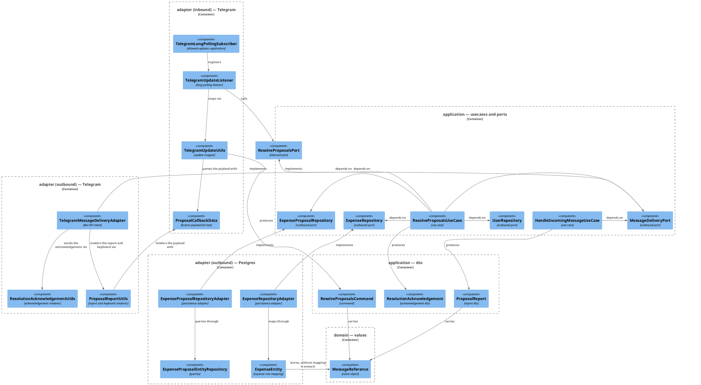
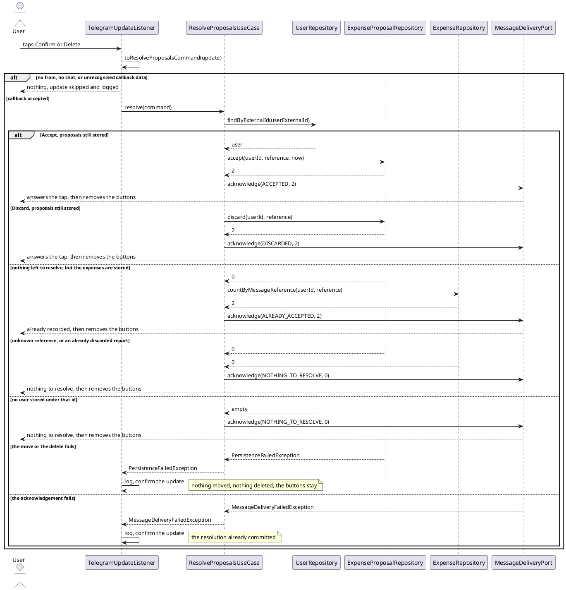

# Design: Accept or Discard a Reported Proposal from the Chat

**Affected Modules:** `ledger-service`

## Objective

The bot already tells the user what it read out of their message, and says the expenses are *pending your
confirmation*. Nothing can confirm them — the rows sit in `expense_proposal` and never become expenses.

This change gives the report two buttons. **Confirm** moves every proposal that message produced into `expense`;
**Delete** throws them away. Either way the buttons come off the message so the same report cannot be resolved
twice, and the user is told what happened. The promise the report already makes becomes one the bot can keep.

## Context

What exists, and what this change extends.

- **The report the buttons attach to** — [`HandleIncomingMessageUseCase`](../../ledger-service/src/main/java/bot/finance/application/usecase/HandleIncomingMessageUseCase.java)
  mints a `MessageReference`, reads back the proposals stored under it and hands a `ProposalReport` to
  `MessageDeliveryPort`; [`TelegramMessageDeliveryAdapter`](../../ledger-service/src/main/java/bot/finance/adapter/telegram/TelegramMessageDeliveryAdapter.java)
  sends it as one `SendMessage`, worded by [`ProposalReportUtils`](../../ledger-service/src/main/java/bot/finance/adapter/telegram/ProposalReportUtils.java).
  Designed in [11-report-expense-proposals-to-the-user](../implemented/11-report-expense-proposals-to-the-user/design.md),
  whose D20 explicitly left confirming and discarding out — this change is that follow-up.
- **The reference that groups a message's proposals** — [`MessageReference`](../../ledger-service/src/main/java/bot/finance/domain/value/MessageReference.java)
  wraps a `UUID` and already parses canonical text through `MessageReference.of(String)`. Every proposal row
  carries it, and `idx_expense_proposal_message_reference` on `(user_id, message_reference)` is the index the
  read-back already uses.
- **The inbound Telegram path** — [`TelegramLongPollingSubscriber`](../../ledger-service/src/main/java/bot/finance/adapter/telegram/TelegramLongPollingSubscriber.java)
  registers one `UpdatesListener` with `allowedUpdates("message")`;
  [`TelegramUpdateListener`](../../ledger-service/src/main/java/bot/finance/adapter/telegram/TelegramUpdateListener.java)
  maps each update through [`TelegramUpdateUtils`](../../ledger-service/src/main/java/bot/finance/adapter/telegram/TelegramUpdateUtils.java),
  swallowing a failure per update so the poll loop survives.
- **The expense side** — [`Expense`](../../ledger-service/src/main/java/bot/finance/domain/model/Expense.java) and
  [`ExpenseProposal`](../../ledger-service/src/main/java/bot/finance/domain/model/ExpenseProposal.java) carry the
  same fields with the same invariants, and `expense` and `expense_proposal` carry the same columns with the same
  types and constraints ([`V002`](../../ledger-service/src/main/resources/db/migration/V002__create_expense.sql),
  [`V003`](../../ledger-service/src/main/resources/db/migration/V003__create_expense_proposal.sql)); the proposal
  table adds `message_reference` and nothing else.
- **Transaction placement** — [`ExpenseProposalRepositoryAdapter`](../../ledger-service/src/main/java/bot/finance/adapter/persistence/ExpenseProposalRepositoryAdapter.java)
  is the model: `@Transactional` on the adapter method, a `RuntimeException` classified into
  `EntityNotFoundException` or `PersistenceFailedException`, and the query itself declared on
  [`ExpenseProposalEntityRepository`](../../ledger-service/src/main/java/bot/finance/adapter/persistence/ExpenseProposalEntityRepository.java).
- **The Bot API client** — pengrad `java-telegram-bot-api` 10.1.0, already on the classpath and already wired as a
  `TelegramBot` bean by [`TelegramBotConfiguration`](../../ledger-service/src/main/java/bot/finance/adapter/telegram/TelegramBotConfiguration.java).

## Proposed Solution

The proposal row's **existence** is its status: an unresolved message's proposals are in `expense_proposal`, a
resolved message's are not (D4). One column is added, so an accepted expense keeps the reference of the message
that produced it (D27). The domain is untouched: the column and its row mapping carry the reference, and no
`Expense` instance holds one until something reads an expense back (D39).

### Application

- **`application/dto/ProposalResolution`** — new enum: `ACCEPT`, `DISCARD`. What the user asked for.
- **`application/dto/ResolutionOutcome`** — new enum: `ACCEPTED`, `DISCARDED`, `ALREADY_ACCEPTED`,
  `NOTHING_TO_RESOLVE`. What happened.
- **`application/dto/ResolveProposalsCommand`** — new record
  `(String userExternalId, String conversationId, String reportMessageId, String interactionId,
  MessageReference reference, ProposalResolution resolution)`. `interactionId` is the tap that has to be
  acknowledged; `reportMessageId` is the message whose buttons come off. Every string validates as non-blank,
  every reference as present, mirroring `HandleIncomingMessageCommand`.
- **`application/dto/ResolutionAcknowledgement`** — new record
  `(String conversationId, String reportMessageId, String interactionId, ResolutionOutcome outcome, int count)`.
  What to tell the user and where; not how to word it, exactly as `ProposalReport` (D9 of design 11).
- **`application/dto/ProposalReport`** — gains `MessageReference reference`, so the adapter can put it in the
  buttons it renders.
- **`application/port/ResolveProposalsPort`** — new inbound port, `void resolve(ResolveProposalsCommand command)`.
- **`application/port/MessageDeliveryPort`** — gains `void acknowledge(ResolutionAcknowledgement ack)`, documenting
  `MessageDeliveryFailedException`.
- **`application/port/ExpenseProposalRepository`** — gains two methods, each atomic in itself:
  - `int accept(long userId, MessageReference reference, Instant now)` — moves every proposal under the reference
    into `expense` and removes it, returning how many moved;
  - `int discard(long userId, MessageReference reference)` — removes them, returning how many.

  Both return `0` when the reference names nothing of this user's, which is what makes a second tap harmless (D5).
- **`application/port/ExpenseRepository`** — gains
  `int countByMessageReference(long userId, MessageReference reference)`, which is how a tap that resolves nothing
  tells an already-accepted report from an unknown one (D30).
- **`application/usecase/ResolveProposalsUseCase`** — new, implementing `ResolveProposalsPort`, holding
  `UserRepository`, `ExpenseProposalRepository`, `ExpenseRepository`, `MessageDeliveryPort`, `Clock` and
  `LoggerFactory`:

  1. look the user up by `command.userExternalId()`; when there is none, the count is `0` without touching either
     table;
  2. call `accept` or `discard` for `(userId, reference)` by the command's `ProposalResolution`;
  3. when that moved or removed nothing, count the expenses already stored under the reference;
  4. map the counts onto a `ResolutionOutcome` and acknowledge.

  | resolution | proposals | expenses | outcome              |
  |------------|-----------|----------|----------------------|
  | `ACCEPT`   | > 0       | —        | `ACCEPTED`           |
  | `DISCARD`  | > 0       | —        | `DISCARDED`          |
  | either     | 0         | > 0      | `ALREADY_ACCEPTED`   |
  | either     | 0         | 0        | `NOTHING_TO_RESOLVE` |

  The count in the acknowledgement is whichever of the two was non-zero.

- **`application/usecase/HandleIncomingMessageUseCase`** — puts the reference it already minted on the
  `ProposalReport` it delivers. Nothing else changes.

### Adapters

- **`adapter/telegram/TelegramLongPollingSubscriber`** — `allowedUpdates("message", "callback_query")`. Without
  the second value Telegram delivers no taps at all (D2).
- **`adapter/telegram/ProposalCallbackData`** — new utility owning the wire format of a button payload in one
  place: `render(ProposalResolution, MessageReference)` produces `accept:<uuid>` / `discard:<uuid>`, and
  `parse(String)` returns `Optional<ParsedCallback>` — empty for anything it does not recognise, so an unknown
  payload is skipped rather than thrown (D3). It checks the verb and the UUID shape itself before calling
  `MessageReference.of`, which throws rather than returning empty (D19).
- **`adapter/telegram/ProposalReportUtils`** — gains
  `Optional<InlineKeyboardMarkup> renderKeyboard(ProposalReport report)`: one row of two
  `InlineKeyboardButton`s — `Confirm` and `Delete` (D18) — carrying the payloads above, and empty for a report with
  no proposals to resolve (D1).
- **`adapter/telegram/TelegramUpdateUtils`** — gains
  `Optional<ResolveProposalsCommand> toResolveProposalsCommand(Update update)`, reading `update.callbackQuery()`
  and skipping — exactly as the message mapper skips — an update with no callback query, no `from`, no
  recognisable `data`, or no `maybeInaccessibleMessage()` to take the chat and message id from (D11).
- **`adapter/telegram/TelegramUpdateListener`** — tries the message mapping first and the callback mapping second,
  keeping the existing swallow-and-log-per-update behaviour for both.
- **`adapter/telegram/ResolutionAcknowledgementUtils`** — new, wording an acknowledgement, beside the transport
  whose limits shape it, as `ProposalReportUtils` words a report.
- **`adapter/telegram/TelegramMessageDeliveryAdapter`** — `deliver` attaches the keyboard when
  `renderKeyboard` gives one, on the same `SendMessage` it already builds. New `acknowledge` sends, in this order:
  1. `AnswerCallbackQuery(interactionId)` with the wording — the tap stops spinning even if the rest fails (D8);
  2. `EditMessageReplyMarkup(conversationId, reportMessageId)` with no markup, taking the buttons off (D6) — for
     every outcome, so a report whose first edit never landed loses them on the tap that notices, whether that tap
     resolves anything (D30) or not (D36).

  The second call is attempted even when the first failed, and the first failure is the one thrown (D34).
- **`adapter/persistence/ExpenseProposalEntityRepository`** — two `@Modifying @Query` methods. Accept is one
  statement, so the delete is what decides which rows move and a concurrent tap moves nothing (D5):

  ```sql
  WITH accepted AS (
      DELETE FROM expense_proposal
      WHERE user_id = :userId AND message_reference = :messageReference
      RETURNING user_id, category_id, description, merchant,
                amount_minor_units, currency_code, message_reference
  )
  INSERT INTO expense (user_id, category_id, description, merchant,
                       amount_minor_units, currency_code, message_reference, created_at, updated_at)
  SELECT user_id, category_id, description, merchant,
         amount_minor_units, currency_code, message_reference, :now, :now
  FROM accepted
  ```

  ```sql
  DELETE FROM expense_proposal
  WHERE user_id = :userId AND message_reference = :messageReference
  ```

- **`adapter/persistence/ExpenseProposalRepositoryAdapter`** — implements both, `@Transactional`, classifying a
  `RuntimeException` into `PersistenceFailedException` the way `findSummariesByMessageReference` already does.
- **`adapter/persistence/ExpenseEntity`** — gains `UUID messageReference`, so the column round-trips through the
  row mapping. `fromDomain` passes `null` and `toDomain` does not pass it on: `Expense` does not take the field
  (D39).
- **`adapter/persistence/ExpenseEntityRepository`** — gains the count, covered by the index V005 adds:

  ```sql
  SELECT count(*) FROM expense
  WHERE user_id = :userId AND message_reference = :messageReference
  ```

- **`adapter/persistence/ExpenseRepositoryAdapter`** — implements `countByMessageReference`, wrapping a
  `RuntimeException` in `PersistenceFailedException` as `ExpenseProposalRepositoryAdapter`'s
  `findSummariesByMessageReference` does; its own `create` classifies a foreign-key violation instead, which a
  count cannot raise.
- **`adapter/config/UseCaseConfiguration`** — a `resolveProposalsPort` `@Bean`, wired like
  `createExpensePort`, with `Clock.systemUTC()`.

### Migration

`src/main/resources/db/migration/V005__add_expense_message_reference.sql`:

```sql
ALTER TABLE expense
    ADD COLUMN message_reference UUID;

CREATE INDEX idx_expense_message_reference ON expense (user_id, message_reference);
```

Nullable, and no backfill: an expense that no message produced has no reference to invent (D28).

Files touched: `V005__add_expense_message_reference.sql`, `ProposalResolution`, `ResolutionOutcome`,
`ResolveProposalsCommand`, `ResolutionAcknowledgement`, `ProposalReport`, `ResolveProposalsPort`,
`MessageDeliveryPort`, `ExpenseProposalRepository`, `ExpenseRepository`, `ResolveProposalsUseCase`,
`HandleIncomingMessageUseCase`, `TelegramLongPollingSubscriber`, `ProposalCallbackData`,
`ProposalReportUtils`, `TelegramUpdateUtils`, `TelegramUpdateListener`, `ResolutionAcknowledgementUtils`,
`TelegramMessageDeliveryAdapter`, `ExpenseEntity`, `ExpenseEntityRepository`, `ExpenseRepositoryAdapter`,
`ExpenseProposalEntityRepository`, `ExpenseProposalRepositoryAdapter`, `UseCaseConfiguration`.

### Diagrams

No container diagram: **Affected Modules** lists one module.





## Decisions

- **D1:** Which reports get buttons?
- Answer: `RECORDED` and `PARTIAL` — every outcome that carries at least one proposal. `NOTHING_IDENTIFIED` and
  `FAILED` get none, and `renderKeyboard` returns empty for a report whose proposal list is empty whatever the
  outcome.
- Basis: decided — the user asked for accept/decline "if the intents were extracted at least partially"
  (2026-08-04), which is exactly the pair of outcomes carrying proposals in `ProposalReportUtils.render`. An
  outcome with nothing stored has nothing a tap could resolve.

- **D2:** How does a button tap reach the application at all?
- Answer: `TelegramLongPollingSubscriber` adds `callback_query` to `allowedUpdates`, and `TelegramUpdateListener`
  maps an update carrying one into a `ResolveProposalsCommand`.
- Basis: assumed — the subscriber passes `allowedUpdates("message")` today
  (`TelegramLongPollingSubscriber.java:41`), and the Bot API treats that list as a filter, so a callback query is
  dropped before the listener ever sees it. This is the one change without which nothing else in this design is
  reachable.

- **D3:** What goes in the button payload, and does it fit?
- Answer: `accept:<uuid>` and `discard:<uuid>` — the verb, a colon, and the canonical text of the report's
  `MessageReference`. 43 and 44 bytes against the Bot API's 64-byte `callback_data` limit.
  `ProposalCallbackData` owns both halves of the format, and `MessageReference.of` rejects anything that is not a
  UUID.
- Basis: decided — the user chose encoding the message reference into the callback (2026-08-04). A UUID renders as
  36 characters (`MessageReference.java:21` parses exactly that form), so the longest payload is 44 bytes.

- **D4:** What records that a report has been resolved?
- Answer: Nothing new — the proposal rows are gone. Accept moves them into `expense` and deletes them; discard
  deletes them. No status column, and therefore no migration.
- Basis: decided — the user chose moving the proposals into the real table as the status change, and discarding
  them so that "no proposals will be found by the reference" (2026-08-04). The row's existence answers the only
  question the resolution path asks.

- **D5:** What happens when the same button is tapped twice, or twice at once?
- Answer: The second tap resolves nothing, and is told the expenses are already recorded when they are (D30).
  Sequentially, the rows are already gone. Concurrently, accept is a single `DELETE … RETURNING` feeding an
  `INSERT`, so the two statements contend on the same rows and only the transaction that deletes them inserts
  anything; the other returns `0`.
- Basis: assumed — Postgres `READ COMMITTED` makes a concurrent `DELETE` of the same rows block until the first
  transaction commits and then match nothing, and the `INSERT` reads only what its own `DELETE` returned. Writing
  it as two statements — read, then insert, then delete — would let both taps read the same rows and store the
  expenses twice.

- **D6:** Can the buttons be taken off the message once it is resolved?
- Answer: Yes. `EditMessageReplyMarkup(chatId, messageId)` sent without `replyMarkup` clears the keyboard, and the
  adapter sends it after every `ACCEPTED` and `DISCARDED`. D5 is what makes a tap that beats the edit harmless.
- Basis: assumed — `EditMessageReplyMarkup` in the cached `java-telegram-bot-api` 10.1.0 jar has the
  `(Object chatId, int messageId)` constructor and an optional `replyMarkup(…)`, and `CallbackQuery`
  `maybeInaccessibleMessage()` supplies both the chat and the message id even for a message Telegram considers
  too old to render.

- **D7:** What happens when someone other than the reporter taps the buttons in a group chat?
- Answer: They resolve nothing. The user id comes from `callbackQuery.from()`, never from the payload, and every
  query in this design is scoped to `(user_id, message_reference)` — so another member's tap matches no proposals
  and no expenses, and gets `NOTHING_TO_RESOLVE`. `ALREADY_ACCEPTED` cannot reach a stranger either, because the
  rows it counts are the tapper's own (D30). They would, however, clear the owner's buttons, since every outcome
  strips the keyboard (D36) — which costs nothing today, because no group message reaches the service at all
  (D33), and is the trade D36 records against turning privacy mode back on.
- Basis: assumed — the reports are delivered into the chat the message came from, group chats included (D19 of
  design 11), and `idx_expense_proposal_message_reference` is on `(user_id, message_reference)`, which is the pair
  every query in this design matches on. The reference is therefore not a bearer token: knowing it grants nothing.

- **D8:** In what order are the tap and the message answered?
- Answer: `AnswerCallbackQuery` first, then the edit. Telegram spins the button on the client until the callback is
  answered, and the resolution is already committed by the time the adapter is called, so the acknowledgement is
  true whether or not the edit lands.
- Basis: assumed — `AnswerCallbackQuery` in the cached jar takes the callback id and an optional `text`, and
  `ResolveProposalsUseCase` calls `acknowledge` only after the repository has returned. Editing first would leave
  the tap spinning for the length of a second Bot API round trip.

- **D9:** What is the acknowledgement worded as, and who words it?
- Answer: `ResolutionAcknowledgementUtils` in `adapter/telegram`, from the outcome and the count alone — the core
  produces a `ResolutionAcknowledgement` and never a string, as it produces a `ProposalReport` and never a string.
- Basis: assumed — D9 of design 11 put the report wording in the adapter for the same reason, and the
  200-character limit on `answerCallbackQuery` text is a Telegram fact.

- **D10:** What timestamps does an accepted expense carry?
- Answer: The acceptance time, in both `created_at` and `updated_at` — `:now` from the use case's `Clock`. The
  proposal's own timestamps are not carried over and are lost with the row.
- Basis: assumed — `expense` has no date-of-spend column
  ([`V002`](../../ledger-service/src/main/resources/db/migration/V002__create_expense.sql)); `created_at` is the
  write timestamp on every path that writes it, including `CreateExpenseUseCase`, which stamps both from
  `Instant.now(clock)`. Carrying the proposal's timestamp would make `created_at` mean one thing on this path and
  another on the MCP path.

- **D11:** Which callback updates are skipped rather than failed?
- Answer: An update with no callback query, no `from`, no `maybeInaccessibleMessage()`, or `data` that
  `ProposalCallbackData.parse` does not recognise. `TelegramUpdateUtils` returns empty and the listener logs the
  skip, exactly as it does for a message with no text.
- Basis: assumed — the existing mapper treats every part it cannot map as a skip rather than an error
  (`TelegramUpdateUtils.java:18-42`), and the tap is left unanswered only for payloads this bot never sent.

- **D12:** Does the user find out that the move itself failed?
- Answer: No. A `PersistenceFailedException` propagates to `TelegramUpdateListener`, which logs it and confirms the
  update; the tap spins out and the buttons stay, so the user can tap again.
- Basis: assumed — the same swallow-and-log path D12 and D13 of design 11 chose, and the failed statement rolled
  back, so a retry is correct rather than a duplicate.

- **D13:** What happens when the acknowledgement cannot be delivered — a tap answered too late, or the Bot API
  unreachable?
- Answer: `MessageDeliveryFailedException` propagates to the listener and is logged. The resolution stands: the
  expenses are recorded, or the proposals are gone, and the buttons are still on the message. The user's next tap
  is what recovers it — `ALREADY_ACCEPTED` tells them it was recorded and takes the buttons off (D30).
- Basis: assumed — the delivery adapter already translates a non-OK response into `MessageDeliveryFailedException`
  and the listener already swallows it per update; `answerCallbackQuery` is rejected once the query is older than
  Telegram's window, which is a failure to *report* a resolution rather than to make one.

- **D14:** Is a discarded proposal recoverable?
- Answer: No. The row is deleted outright and nothing records that it existed.
- Basis: decided — the user chose deleting over marking a row discarded, so that a stale tap finds nothing
  (2026-08-04). It comes back the moment anything needs to answer "what did the model get wrong", which would want
  the discarded rows kept with a status rather than removed.

- **D15:** Can accepting fail because the proposal's category has since been deleted?
- Answer: Not reachably. The insert would violate `expense_category_id_fkey` and surface as
  `PersistenceFailedException` (D12), but no path in the service deletes a category.
- Basis: assumed — `CategoryRepositoryAdapter` and `CategoryEntityRepository` expose reads and the catalogue
  write that `UserRepository.create` performs at initialization; nothing deletes.

- **D16:** Does a report sent before this change ever get buttons?
- Answer: No. Its message is already sent and is never edited, so its proposals stay in `expense_proposal`
  unresolved and unreachable.
- Basis: deferred — the deployment has one operator's own chats in it (D2 of design 11), and the rows are inert
  rather than wrong. It comes back if those proposals need clearing, which is a one-off delete rather than
  anything in this design.

- **D17:** Does the resolved message still read as pending when someone scrolls back to it?
- Answer: Yes, and that is accepted. The message text is never edited — only the keyboard is cleared (D6) — so the
  itemised list survives exactly as sent and the header keeps saying `pending your confirmation`. What happened is
  carried by the `answerCallbackQuery` toast alone, which is not part of the chat history.
- Basis: decided — the user chose keeping the list visible over replacing the text (2026-08-04), rejecting both a
  short outcome line, which drops the list, and re-rendering the list under a new header, which would need the
  summaries read inside the same transaction as the move. It comes back if the stale header misleads in practice,
  which the re-render option is the answer to.

- **D18:** What do the two buttons say?
- Answer: `Confirm` and `Delete`. Plain words, no emoji. The core vocabulary is unchanged: the enum stays
  `ProposalResolution.ACCEPT` / `DISCARD` and the payload verbs stay `accept:` / `discard:` (D3), because a label
  is the adapter's wording and the enum is the capability.
- Basis: decided — the user chose `Confirm` / `Delete` over `Accept` / `Discard` and over an emoji pair
  (2026-08-04); `Confirm` matches the `pending your confirmation` wording the report already uses, and `Delete`
  says plainly what D14 does to the rows.

- **D19:** Does `ProposalCallbackData.parse` really return empty for a payload it does not recognise?
- Answer: Not as the design describes it. `MessageReference.of` *throws* `InvalidIncomingMessageException` for a
  value that is not a UUID, so `parse` has to reject the payload itself — or catch — before calling it. Left as
  written, `accept:not-a-uuid` fails the update instead of skipping it, which is the opposite of D3 and D11.
- Basis: assumed — `MessageReference.java:21-30` throws rather than returning empty, and
  [code-style](../../ledger-service/docs/conventions/code-style.md) requires an adapter mapping external input to
  check its own preconditions *before* constructing the core type, so unusable input takes the adapter's normal
  rejection path.

- **D20:** Can Accept move a proposal the report never listed?
- Answer: Yes, in two ways, and both are correct. A row committed under the same reference after the read-back ran
  (D21 of design 11) and a row past the `… and N more.` truncation (D11 of design 11) are both under
  `(user_id, message_reference)` and are both moved. The count in the acknowledgement therefore comes from the
  repository's return value and never from `report.proposals().size()`, so the user is told the real number even
  when it exceeds the bullets they can see.
- Basis: assumed — both repository methods match on the reference alone and nothing narrows them to what was
  rendered; the first case is reachable only on the `PARTIAL` path, whose wording already says the answer may be
  incomplete, and the second only above 4000 characters.

- **D21:** Does a redelivered callback query resolve the same report twice?
- Answer: No. A redelivered accept finds the rows already gone and answers `NOTHING_TO_RESOLVE`; a redelivered
  discard the same. Unlike the message path, the tap carries no minted state, so the retry keys on exactly the same
  `(user_id, message_reference)` pair and is idempotent by construction.
- Basis: assumed — `TelegramUpdateListener.process` returns `CONFIRMED_UPDATES_ALL` for every batch it completes
  (`TelegramUpdateListener.java:29`), so redelivery needs a crash mid-batch; D23 of design 11 is non-idempotent only
  because `MessageReference.newReference()` mints a fresh reference per run, which no resolution does.

- **D22:** Does a tap whose `from` id names no stored user raise a not-found exception?
- Answer: No — the count is `0` and the acknowledgement is `NOTHING_TO_RESOLVE`. This is a deliberate departure from
  `CreateExpenseUseCase`, which raises `EntityNotFoundException` for an unknown `userExternalId`. The use case also
  must not reach for `InitializeUserPort`: a stranger's tap must never create an `app_user` row.
- Basis: assumed — `TelegramUpdateListener` swallows and logs every `RuntimeException` per update, so a throw here
  would leave the tap spinning with no answer at all, which is exactly what D8 exists to prevent; and D7 requires a
  group member who owns nothing to get a toast rather than an error. The code-style not-found rule covers an id a
  caller asserts exists, and a tap's `from` is discovered rather than asserted.

- **D23:** Is `int accept(…)` a shape Spring Data JDBC can deliver from a `@Query`?
- Answer: Yes. `@Modifying` on a string-based `@Query` executes through `NamedParameterJdbcOperations.update` and
  returns that count for an `int` or `Integer` return type. For the accept statement the count is the rows inserted
  into `expense`, which equals the rows the CTE deleted. These are the module's first modifying query methods.
- Basis: assumed — `AbstractJdbcQuery.createModifyingQueryExecutor` in the cached spring-data-jdbc jar returns
  `updatedCount` for any non-boolean return type, and `org.springframework.data.jdbc.repository.query.Modifying`
  is on the classpath; every `@Query` in `adapter/persistence` today is a read.

- **D24:** Can the accept statement be exercised where this module's persistence tests run?
- Answer: Yes. A data-modifying CTE and `DELETE … RETURNING` are Postgres-only, and the persistence tests already
  run against a real Postgres container rather than an in-memory database, so the statement is testable as written
  and needs no portable rewrite.
- Basis: assumed — `bot.finance.common.containers.PostgresContainers` backs the integration tests, and V004 already
  relies on a Postgres built-in (`gen_random_uuid()`), so Postgres-specific SQL is established here.

- **D25:** What ever clears an `expense_proposal` row that nobody taps?
- Answer: Nothing. A user who ignores the buttons, a report whose delivery failed after the rows were written (D12
  of design 11), a proposal committed after the read-back (D21 of design 11) and every pre-change row (D16) all stay
  in `expense_proposal` permanently. The table only grows.
- Basis: deferred — after this change a tap is still the only path that deletes a proposal, and the deployment is
  one operator's own chats (D2 of design 11), so the volume is inert. It comes back when unresolved proposals have
  to be reported or reaped, which wants an expiry sweep on `created_at` — a scheduled job, not anything in this
  design.

- **D26:** What proves in production that a tap resolved anything?
- Answer: `ResolveProposalsUseCase` logs at info when it acknowledges, carrying the message reference, the
  resolution and the row count; `TelegramUpdateListener` logs a skipped callback at debug and a failed one at error,
  exactly as it does for a message today.
- Basis: assumed — D18 of design 11 put the same line on the delivery path, and the code-style logging rule reserves
  `info` for business events; the reference is the only value that correlates a report with the resolution of it,
  and without the count a `NOTHING_TO_RESOLVE` is indistinguishable in the log from a resolution that moved rows.

- **D27:** Does an accepted expense record which message produced it?
- Answer: Yes. `expense` gains a `message_reference` column, and the accept statement carries the proposal's value
  across rather than dropping it. `Expense` carries it as an `Optional<MessageReference>`, empty for an expense
  created any other way. Nothing in this change reads it back.
- Basis: decided — the user asked for the reference to reach the accepted table for future use (2026-08-04). It is
  the only value that ties an expense to the message, the extraction call and the tool calls that produced it
  (D18 of design 11), and it cannot be recovered once accept has deleted the proposal row.

- **D28:** Is the new column nullable, and what happens to existing `expense` rows?
- Answer: Nullable, with no backfill. Every row already in `expense` keeps `NULL`, which is the truthful value:
  no message produced it. An index on `(user_id, message_reference)` matches the one `expense_proposal` already
  carries.
- Basis: assumed — `CreateExpensePort` has no adapter driving it (only the `@Bean` in `UseCaseConfiguration`), so
  after this change accept is the only writer of `expense` and its rows all carry a reference; V004 backfilled with
  `gen_random_uuid()` only because it made the column `NOT NULL`, and inventing a reference here would fabricate a
  link to a message that never existed.

- **D29:** Does carrying the reference give the accept path a second identity for the same expense?
- Answer: No, and it makes accept traceable rather than opaque. After a resolution the reference matches nothing in
  `expense_proposal` and matches the promoted rows in `expense`, so which table holds it answers whether the report
  was resolved — the same fact D4 already relies on, now readable from either side.
- Basis: assumed — both tables index `(user_id, message_reference)` and the accept statement moves every row under
  the reference in one statement (D5), so the two sets are disjoint and their union is what the message produced.

- **D30:** What does a tap see after a resolution that committed but could not be reported?
- Answer: `ALREADY_ACCEPTED`, with the number of expenses stored under the reference. When accept or discard moves
  nothing, the use case counts `expense` rows under `(userId, reference)`; a non-zero count means an earlier tap
  succeeded and only its acknowledgement was lost. The user is told the expenses are already recorded, and the
  buttons come off on this pass — so a failed edit is repaired by the tap that noticed it.
- Basis: decided — the user asked for the already-committed case to be recognised and reported rather than
  answered as if nothing had happened (2026-08-04). It is reachable only because D27 carries the reference into
  `expense`; without that column an accepted report is indistinguishable from an unknown one.

- **D31:** Does the same recovery exist for a discard whose acknowledgement failed?
- Answer: Partly. Discard deletes the rows and records nothing, so the reference matches nothing in either table
  and the retry gets `NOTHING_TO_RESOLVE`: the user is told there is nothing to resolve, which is true, but they
  cannot tell it from a reference the service never issued. The buttons do come off on that tap (D36), so what
  discard lacks is the wording, not the repair.
- Basis: decided — the asymmetry follows from D14, where the user chose deleting a discarded proposal over marking
  it. Accept leaves evidence because the expense is the point of it; discard leaves none by design. It comes back
  with the tombstone D14 already names as its trigger.

- **D33:** Is the group-chat behaviour D7 describes reachable at all?
- Answer: Not today. Telegram withholds an ordinary group message from a bot unless the bot is addressed, so no
  group message is ever collected and no report is ever posted into a group for a second person to tap. D7 stands
  as written and costs nothing — every query is scoped by the tapper's own user id regardless — but it is a
  guarantee held in reserve rather than a live path.
- Basis: decided — the user stated the bot is not functional in group chats (2026-08-04), now recorded in
  [Telegram — incoming messages](../../ledger-service/docs/contracts/in/telegram-updates.md). It becomes live if
  the bot's privacy mode is turned off with its owner, which is a BotFather setting rather than anything in this
  service.

- **D32:** Does the extra count run on every tap?
- Answer: No — only when accept or discard moved nothing, which is the retry and stranger paths. A tap that
  resolves something never reads `expense`.
- Basis: assumed — step 3 of the use case is guarded by a zero count, and the query is covered by
  `idx_expense_message_reference` on `(user_id, message_reference)` that V005 adds, so even on that path it is an
  index-only count of at most one message's rows.

- **D34:** When the tap cannot be answered, does the button removal D30 relies on still happen?
- Answer: Yes. `acknowledge` attempts `EditMessageReplyMarkup` even after `AnswerCallbackQuery` has failed, then
  throws the first failure. The durable effect never depends on the transient one, so a resolution the user cannot
  be told about still loses its buttons on the first pass.
- Basis: decided — the user chose attempting both over letting a later tap repair it (2026-08-04). The failure this
  guards is an expired query, which is exactly what a slow resolution produces while the edit that follows would
  still have succeeded; `TelegramMessageDeliveryAdapter.deliver` makes a single `bot.execute` today
  (`TelegramMessageDeliveryAdapter.java:36-48`), so this is the module's first port operation sequencing two Bot
  API calls, and the rule it sets is that the first failure is remembered rather than short-circuiting.

- **D35:** What does `EditMessageReplyMarkup` do on an `ALREADY_ACCEPTED` whose keyboard is already gone?
- Answer: It fails. Telegram answers `400 Bad Request: message is not modified` when the new markup equals the
  stored one, the adapter turns any non-OK response into `MessageDeliveryFailedException`, and the listener logs
  it at error. This is reachable whenever an accept fully succeeded and a later tap still arrives — a redelivered
  callback query (D21) or a stale client — so the routine repeat path logs an error rather than nothing. The user
  is unharmed: the tap was already answered (D8) and the resolution already committed.
- Basis: assumed — `TelegramMessageDeliveryAdapter.java:43-48` throws on `!response.isOk()` with no inspection of
  `description()`, and `TelegramUpdateListener.java:45-47` logs every `RuntimeException` at error. Before D30,
  a tap that resolved nothing edited nothing, so this path did not exist. It comes back if that error line has to
  mean something is wrong, which wants the `message is not modified` description read as success.

- **D36:** Does a discard whose acknowledgement failed ever lose its buttons?
- Answer: Yes. Every outcome strips the keyboard, `NOTHING_TO_RESOLVE` included — the exemption is dropped. A
  discarded report whose acknowledgement was lost loses its buttons on the next tap, the way an accepted one does
  through `ALREADY_ACCEPTED`. D31's asymmetry narrows to the wording alone: discard cannot say *what* it resolved,
  but it no longer leaves live buttons behind.
- Basis: decided — the user chose stripping unconditionally over restricting it to a private chat and over leaving
  the exemption (2026-08-04). D33 and
  [Telegram — incoming messages](../../ledger-service/docs/contracts/in/telegram-updates.md) establish that no
  report is ever posted into a group, so the case the exemption protected is unreachable. It comes back if the
  bot's privacy mode is ever turned off, which would let a group member clear a report they do not own — the
  private-chat test (`conversationId` equal to `userExternalId`) is what would restore the protection.

- **D37:** Can the four outcomes be told apart in the log?
- Answer: Not from the line D26 describes, which carries the reference, the resolution and the count. `ACCEPTED`
  with count 2 and `ALREADY_ACCEPTED` with count 2 print identically, which is precisely the pair someone
  investigating a lost acknowledgement needs to separate. The line carries the `ResolutionOutcome` as well.
- Basis: assumed — D26 was written before `ALREADY_ACCEPTED` existed, and
  [code-style](../../ledger-service/docs/conventions/code-style.md:15-18) reserves `info` for business events;
  the outcome *is* the business event here, and the resolution only says which button was pressed.

- **D38:** Is an accepted expense recoverable?
- Answer: No. Nothing in the service deletes an `expense` row, and after this change tapping `Delete` on an
  already-accepted report answers `ALREADY_ACCEPTED` rather than removing anything — so a mis-tapped `Confirm` is
  final, and the second button silently stops meaning what it says.
- Basis: deferred — no delete path exists anywhere over `expense` (`ExpenseRepository` exposes `create` only, and
  `ExpenseEntityRepository` is a bare `CrudRepository` with no caller), so this change removes no capability that
  existed. It comes back the moment a user has to undo a confirmation, which wants a delete-expense use case
  rather than a second meaning for this button.

- **D39:** Is anything ever going to hold an `Expense` with its `messageReference` present?
- Answer: No, so the domain type does not take the field. The change stops at the column and the row mapping:
  V005 adds it, the accept statement writes it, and `ExpenseEntity` carries a `UUID messageReference` so the value
  round-trips and a future read finds it. `Expense`, both its factories and `CreateExpenseUseCase` are untouched,
  and `ExpenseEntity.toDomain` simply does not pass the column on.
- Basis: decided — the user chose the column and the entity mapping over the full domain change and over touching
  no Java at all (2026-08-04). Accept writes the column in raw SQL and never builds an `Expense`,
  `CreateExpenseUseCase` has no reference to pass, and nothing reads an `expense` row back, so the field would be
  `Optional.empty()` in every instance the system can produce; nothing in
  [architecture](../../ledger-service/docs/conventions/architecture.md) or
  [code-style](../../ledger-service/docs/conventions/code-style.md) requires a domain entity to mirror every
  column of its table. It comes back the moment something reads an expense back and needs the message it came
  from, which is the same trigger D38 names.

- **D40:** Does the loser of two concurrent accepts see the winner's rows when it counts?
- Answer: Yes. The losing tap's `DELETE` blocks on the winner's row locks and returns `0` only after the winner
  has committed, and the count runs afterwards in its own transaction — so its snapshot already contains the
  inserted expenses and the outcome is `ALREADY_ACCEPTED`, never a false `NOTHING_TO_RESOLVE`. This holds only
  because `accept` and `countByMessageReference` are separate `@Transactional` adapter methods and the use case
  opens no transaction around them.
- Basis: assumed — transaction boundaries live on the adapter method in this module
  ([architecture](../../ledger-service/docs/conventions/architecture.md:39-41),
  `ExpenseProposalRepositoryAdapter.java:26`), use cases are plain classes with no framework annotations, and
  `TelegramUpdateListener` starts no transaction. Under `READ COMMITTED` a second statement in the same
  transaction would take a fresh snapshot anyway, but the split makes it independent of that.

- **D41:** What does V005 do to a live `expense` table?
- Answer: Very little. `ADD COLUMN … UUID` with no default and no `NOT NULL` is a catalogue-only change in
  Postgres and rewrites nothing; the `CREATE INDEX` that follows takes a `SHARE` lock that blocks writes for the
  length of the build, which on this deployment is one operator's rows.
- Basis: assumed — V004 already added a nullable UUID column to `expense_proposal` and then backfilled and
  tightened it, and V005 stops at the first of those three steps; the deployment is one operator's own chats
  (D2 of design 11), so no concurrent-index build is warranted.

- **D42:** What words does the acknowledgement carry?
- Answer: One line per outcome, built from the outcome and the count alone (D9), pluralised the way the report
  already pluralises its header: `ACCEPTED` → `Confirmed 2 expenses.`, `DISCARDED` → `Deleted 2 expenses.`,
  `ALREADY_ACCEPTED` → `Already confirmed: 2 expenses.`, `NOTHING_TO_RESOLVE` → `There is nothing left to
  resolve.` Every line is far inside the 200-character limit `answerCallbackQuery` imposes.
- Basis: assumed — `ProposalReportUtils.recordedHeader` sets the voice (plain sentences, no emoji, a
  `%d expense%s` count), and D18 fixed the buttons as `Confirm` and `Delete`, so `Confirmed` and `Deleted` are the
  past tense of what the user pressed. `ALREADY_ACCEPTED` names the count D30 reads out of `expense`, and
  `NOTHING_TO_RESOLVE` carries none because its count is always zero.

## Design Findings

Grilled (2026-08-04): nothing to raise on contract compat — `MessageDeliveryPort` and `ExpenseProposalRepository`
have exactly one implementation each (`TelegramMessageDeliveryAdapter`, `ExpenseProposalRepositoryAdapter`) and
`ProposalReport` exactly one producer, so both widenings are additive; nothing on data —
`expense` and `expense_proposal` carry the copied columns with identical types and constraints (V002, V003), so
the `INSERT … SELECT` needs no cast and no width re-check, while `created_at`/`updated_at` are bound the same way
every other write in the module binds an `Instant`; nothing on limits — both statements are covered by
`idx_expense_proposal_message_reference` on `(user_id, message_reference)`, and the longest payload is 44 of the 64
bytes `callback_data` allows (D3); nothing on authorization — the tapper comes from `callbackQuery.from()` and both
statements are scoped to that user's rows, so the reference in the payload grants nothing (D7).

Grilled (2026-08-04): nothing to raise on contract compat — `ExpenseRepository` and `ExpenseEntityRepository` have
one implementation and no other caller, and `Expense`'s two factories are called only by `CreateExpenseUseCase` and
`ExpenseEntity.toDomain`, so widening them reaches nothing outside this module; nothing on idempotency — the count
that D30 adds keys on the same `(user_id, message_reference)` pair as the resolution itself and carries no minted
state, so a repeat reads the same answer however many times it runs (D21); nothing on authorization — the count is
scoped to the tapper's own rows exactly as the two resolution statements are, so `ALREADY_ACCEPTED` discloses
nothing a stranger could not already infer (D7); nothing on business invariants — a reference lives in
`expense_proposal` or in `expense` and never both, because the accept statement moves every row under it at once
(D5, D29).
