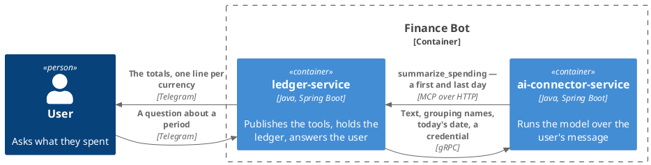
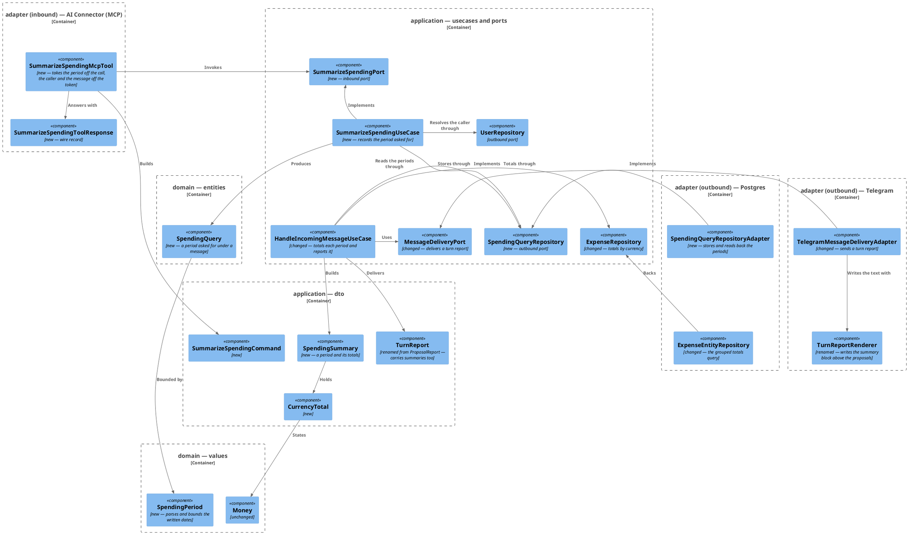
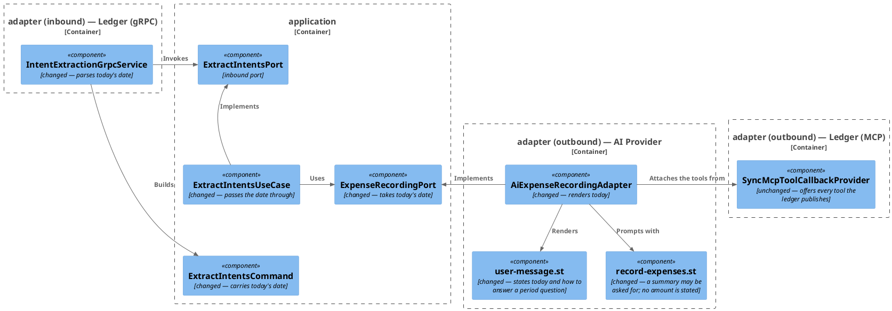
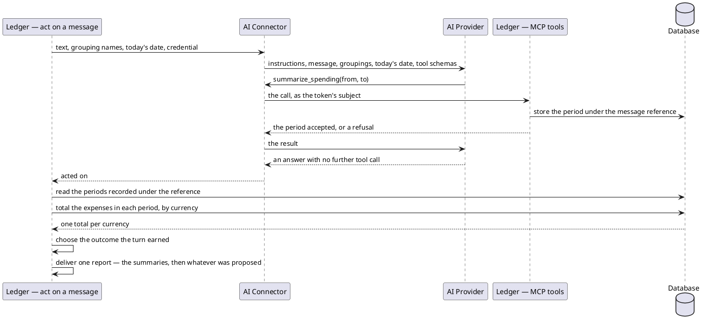
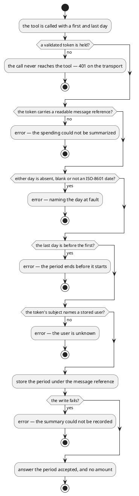

# Design: Summarize Spending Over a Period

**Affected Modules:** `ledger-service`, `ai-connector-service`

## Objective

A user can ask what they spent — "how much money did I spend last week" — and get an answer in the same
conversation. The model reads the period out of the words; the ledger totals what it holds for that period and
puts the totals in front of the user, one line per currency. Currencies are never added together.

Today the turn only ever writes: a message names spending, the model files it, and the user is told what was
noted. Nothing reads the ledger back, so the store the user builds is one they cannot ask a question of.

## Context

What already exists, and what this change mirrors.

- **The turn** — [`HandleIncomingMessageUseCase`](../../ledger-service/src/main/java/bot/finance/application/usecase/HandleIncomingMessageUseCase.java)
  resolves the person, mints a [message reference](../../ledger-service/docs/domain/message-reference.md), hands
  the text and the grouping names to the connector, then reads back **what the turn recorded under that
  reference** and delivers one report. The connector's answer is empty
  ([`intent_extraction.proto`](../../proto/intent_extraction.proto)) — everything the turn produced is read out of
  the store, not out of the response.
- **The report** — [`handle-incoming-message.md`](../../ledger-service/docs/usecases/handle-incoming-message.md):
  *"Every message that reaches the turn is answered with exactly one of these."*
  [`ProposalReport`](../../ledger-service/src/main/java/bot/finance/application/dto/ProposalReport.java) carries
  the outcome and the proposals;
  [`ProposalReportRenderer`](../../ledger-service/src/main/java/bot/finance/adapter/telegram/ProposalReportRenderer.java)
  writes the chat text, its two buttons and its 4000-character cap.
- **The tools the model is given** —
  [`CreateExpenseProposalMcpTool`](../../ledger-service/src/main/java/bot/finance/adapter/mcp/CreateExpenseProposalMcpTool.java)
  and [`ListCategoriesMcpTool`](../../ledger-service/src/main/java/bot/finance/adapter/mcp/ListCategoriesMcpTool.java),
  each behind an inbound port, each reading the caller off the token
  ([ADR 0007](../../ledger-service/docs/adr/0007-an-mcp-caller-is-identified-by-a-signed-token-not-a-tool-argument.md),
  [ADR 0010](../../ledger-service/docs/adr/0010-a-message-reference-rides-the-caller-token-not-the-extraction-request.md)),
  each rendering every failure as a `CallToolResult` error the model reads. A tool added here reaches the model
  with no change to the connector's wiring
  ([ledger-mcp.md](../../ai-connector-service/docs/contracts/out/ledger-mcp.md)).
- **What the model is told it may do** —
  [`record-expenses.st`](../../ai-connector-service/src/main/resources/prompts/record-expenses.st): *"Record
  expenses and nothing else… you do not read anything back for the user."* Every number a user has ever read from
  this bot was rendered by the ledger from its own rows.
- **What the ledger holds** — [`expense`](../../ledger-service/src/main/resources/db/migration/V002__create_expense.sql)
  (`amount_minor_units`, `currency_code`, `created_at`, indexed `(user_id, created_at DESC)`) and
  [`expense_proposal`](../../ledger-service/src/main/resources/db/migration/V003__create_expense_proposal.sql).
  A proposal becomes an expense only when the user taps **Confirm**
  ([`ResolveProposalsUseCase`](../../ledger-service/src/main/java/bot/finance/application/usecase/ResolveProposalsUseCase.java)),
  and the row is written with the acceptance instant as its `created_at`.
- **Money** — [`Money`](../../ledger-service/src/main/java/bot/finance/domain/value/Money.java) is minor units plus
  an ISO 4217 code, and `amount()` scales back to the main unit. The amount crosses the tool boundary **as
  written** and is scaled in the domain
  ([ADR 0011](../../ledger-service/docs/adr/0011-the-amount-is-scaled-to-minor-units-in-the-domain.md)) — the same
  shape this change uses for a written date.
- **The nearest change to mirror** —
  [13-the-model-looks-up-a-groupings-categories](../implemented/13-the-model-looks-up-a-groupings-categories/design.md),
  which added a second tool, its port, its use case and its prompt paragraph in one change.

## Proposed Solution

Three moves: the turn tells the model what day it is; the ledger publishes a tool the model calls with the period
it read out of the message; the turn's report gains a spending section rendered from the ledger's own rows.

**The model never sees an amount.** `summarize_spending` answers only that the period was accepted; the totals are
computed once, at report time, by the use case that renders them (D3).

### The schema — `proto/intent_extraction.proto`

```proto
message ExtractIntentsRequest {
  string text = 1;
  // The groupings the caller's categories are filed under; must be non-empty. An expense is
  // filed under a category the `list_categories` tool answers for one of these, never under
  // the grouping itself.
  repeated string category_groupings = 2;
  // The grouping to fall back on when no other fits; must be non-blank and one of
  // `category_groupings`, so a fit always exists.
  string catch_all_grouping = 3;
  // ISO 4217 code applied when the user states an amount but no currency. Absent means
  // an amount without a currency is not acted on.
  optional string default_currency = 4;
  // The day the turn runs on, in UTC, as an ISO-8601 date. Every period the model reads out
  // of a relative phrase is anchored on it.
  string current_date = 5;
}
```

### `ledger-service`

**Domain**

- **`domain/value/SpendingPeriod`** — new. `SpendingPeriod(LocalDate from, LocalDate to)`, both ends inclusive.
  A static `of(String from, String to)` parses the written dates the tool was called with, the way
  `Money.ofMajorUnits` takes the written amount. Refuses with `InvalidSpendingPeriodException`: an absent or blank
  end, one that is not an ISO-8601 `YYYY-MM-DD` date, and a `to` before the `from`.
- **`domain/model/SpendingQuery`** — new entity: `userId`, `SpendingPeriod period`, `MessageReference
  messageReference`, `Instant createdAt`, with `newQuery(...)` and `stored(...)` beside `ExpenseProposal`'s pair.
  Refuses a non-positive user id, an absent period, reference or instant, with `InvalidSpendingQueryException`.
- **`domain/exception/InvalidSpendingPeriodException`**, **`domain/exception/InvalidSpendingQueryException`** — new,
  beside `InvalidMoneyException` and `InvalidExpenseProposalException`.

**Application**

- **`application/port/SummarizeSpendingPort`** — new inbound port, `SpendingPeriod summarize(SummarizeSpendingCommand
  command)`, answering the period it accepted so the tool can echo it back.
- **`application/dto/SummarizeSpendingCommand`** — new, `(AuthenticatedUserId userId, MessageReference reference,
  String from, String to)`. The name is fixed by the ArchUnit rule `inboundPortCommandsAreNamedAfterTheirUseCase`.
- **`application/usecase/SummarizeSpendingUseCase`** — new, implementing `SummarizeSpendingPort` against
  `UserRepository`, `SpendingQueryRepository` and a `Clock`:

  | Step                                     | Outcome                                                            |
  |------------------------------------------|--------------------------------------------------------------------|
  | command absent                           | `InvalidSpendingQueryException` — nothing is looked up             |
  | the written dates do not make a period   | `InvalidSpendingPeriodException` from `SpendingPeriod.of`          |
  | the token's subject names no user        | `EntityNotFoundException`, as `ListCategoriesUseCase` throws it    |
  | otherwise                                | store the `SpendingQuery`, answer the period                       |

- **`application/port/SpendingQueryRepository`** — new outbound port: `SpendingQuery create(SpendingQuery query)`
  and `List<SpendingPeriod> findPeriodsByMessageReference(long userId, MessageReference reference)`, the second
  answering distinct periods, oldest first (D8).
- **`application/port/ExpenseRepository`** — gains `List<CurrencyTotal> totalsByCurrency(long userId,
  SpendingPeriod period)`.
- **`application/dto/CurrencyTotal`** — new, `(Money total, int expenseCount)`.
- **`application/dto/SpendingSummary`** — new, `(SpendingPeriod period, List<CurrencyTotal> totals)`; the totals
  copied, ordered by currency code, and empty when the period holds nothing.
- **`application/dto/ProposalReport` → `application/dto/TurnReport`** — renamed and gains `List<SpendingSummary>
  summaries` beside `proposals` (D5).
- **`application/dto/ReportOutcome`** — gains `ANSWERED`: the turn produced a summary and no proposal.
- **`application/port/MessageDeliveryPort`** — `deliver(TurnReport report)`.
- **`application/dto/IntentExtractionRequest`** — gains `LocalDate currentDate`, refused when null.
- **`application/usecase/HandleIncomingMessageUseCase`** — takes a `Clock`, puts `LocalDate.now(clock)` on the
  request, and after the extraction reads the periods recorded under the reference, totals each through
  `ExpenseRepository`, and delivers one `TurnReport` carrying both lists. The outcome it chooses:

  | Extraction | Proposals | Summaries | Outcome            |
  |------------|-----------|-----------|--------------------|
  | completed  | some      | any       | `RECORDED`         |
  | completed  | none      | some      | `ANSWERED`         |
  | completed  | none      | none      | `NOTHING_IDENTIFIED` |
  | failed     | some      | any       | `PARTIAL`          |
  | failed     | none      | some      | `PARTIAL`          |
  | failed     | none      | none      | `FAILED`           |

**Adapters**

- **`adapter/mcp/SummarizeSpendingMcpTool`** — new, shaped like `ListCategoriesMcpTool`:

  ```java
  @McpTool(
          name = "summarize_spending",
          description = "Answers the caller's question about what they spent over a period. The totals are put "
                  + "in front of the caller directly; they are not returned to you, and you never state an "
                  + "amount yourself.")
  public CallToolResult summarizeSpending(
          @McpToolParam(description = "the first day of the period, inclusive, as YYYY-MM-DD") String from,
          @McpToolParam(description = "the last day of the period, inclusive, as YYYY-MM-DD") String to)
  ```

  It reads `AuthenticatedCaller.authenticatedUserId()` and `AuthenticatedCaller.messageReference()`, calls
  `SummarizeSpendingPort`, and serializes `SummarizeSpendingToolResponse` with the shared `JsonMapper`. Failures
  are rendered as error results, in the clause order the sibling tools use:

  | Caught                                                      | Message                                    |
  |-------------------------------------------------------------|--------------------------------------------|
  | `InvalidSpendingPeriodException`                            | the exception's own message                |
  | `InvalidSpendingQueryException`, `InvalidUserException`     | `invalid request: ` + the message          |
  | `EntityNotFoundException`                                   | `the user is unknown`                      |
  | `PersistenceFailedException`                                | `the summary could not be recorded`        |
  | `RuntimeException`                                          | `the spending could not be summarized`     |

- **`adapter/mcp/SummarizeSpendingToolResponse`** — new, `(String from, String to)`, e.g.
  `{"from":"2026-07-27","to":"2026-08-02"}` — the period accepted, and nothing else.
- **`adapter/persistence/SpendingQueryEntity`**, **`SpendingQueryEntityRepository`**,
  **`SpendingQueryRepositoryAdapter`** — new, beside the proposal trio, wrapping every failure in
  `PersistenceFailedException` and classifying the user foreign key as `EntityNotFoundException`. The read:

  ```sql
  SELECT DISTINCT ON (period_start, period_end) period_start, period_end, created_at
  FROM spending_query
  WHERE user_id = :userId AND message_reference = :messageReference
  ORDER BY period_start, period_end, created_at
  ```

  re-ordered by `created_at` in the adapter, so a period asked for twice in one turn is reported once (D8).
- **`adapter/persistence/ExpenseEntityRepository`** — gains the totals query:

  ```sql
  SELECT currency_code, sum(amount_minor_units) AS total_minor_units, count(*) AS expense_count
  FROM expense
  WHERE user_id = :userId AND created_at >= :from AND created_at < :toExclusive
  GROUP BY currency_code
  ORDER BY currency_code
  ```

  read into a `CurrencyTotalProjection`. `idx_expense_user_created_at` serves it. The bounds are the period's
  first day at UTC midnight and the day after its last day at UTC midnight (D4).
- **`adapter/telegram/ProposalReportRenderer` → `adapter/telegram/TurnReportRenderer`** — the summary block is
  written first, then the proposal block; the keyboard is still offered only when the report lists a proposal.
  A summary renders as

  ```
  Between 27 Jul 2026 and 2 Aug 2026 you spent:
  • 120.50 EUR (4 expenses)
  • 7200 HUF (1 expense)
  ```

  and a period holding nothing as `Nothing is recorded between 27 Jul 2026 and 2 Aug 2026.`, both dated by a
  formatter pinned to `Locale.ENGLISH` (D33). `ANSWERED` renders the summary blocks alone; `NOTHING_IDENTIFIED`,
  `RECORDED`, `PARTIAL` and `FAILED` keep the text they have today, after whatever summaries the turn produced.
  The 4000-character budget is spent on the summaries first and the proposal list is trimmed against what is
  left (D24).
- **`adapter/aiconnector/IntentProtoUtils`** — sets `current_date` from the request's `currentDate`.
- **`adapter/config/UseCaseConfiguration`** — a `@Bean` for `SummarizeSpendingUseCase`, and `Clock.systemUTC()`
  into `HandleIncomingMessageUseCase`.

**Migration — `src/main/resources/db/migration/V006__create_spending_query.sql`**

```sql
CREATE TABLE spending_query (
    id                BIGSERIAL   PRIMARY KEY,
    user_id           BIGINT      NOT NULL REFERENCES app_user (id) ON DELETE CASCADE,
    message_reference UUID        NOT NULL,
    period_start      DATE        NOT NULL,
    period_end        DATE        NOT NULL,
    created_at        TIMESTAMPTZ NOT NULL,
    CONSTRAINT ck_spending_query_period CHECK (period_end >= period_start)
);

CREATE INDEX idx_spending_query_message_reference ON spending_query (user_id, message_reference);
```

### `ai-connector-service`

- **`application/dto/ExtractIntentsCommand`** — gains `LocalDate currentDate`, refused when null.
- **`application/port/ExpenseRecordingPort`** — `record(String text, List<String> categoryGroupings, String
  catchAllGrouping, Optional<CurrencyCode> assumedCurrency, LocalDate currentDate)`.
- **`adapter/grpc/IntentExtractionGrpcService`** — parses `current_date` as an ISO-8601 date, rejecting as
  `INVALID_ARGUMENT`: `Current date must not be blank`, `Current date must be an ISO-8601 date`.
- **`adapter/ai/AiExpenseRecordingAdapter`** — renders `today` into the user message.
- **`resources/prompts/user-message.st`** — gains, above the message:

  ```
  Today is {today} (UTC). A week starts on Monday.

  When the user asks what they spent over some period — "last week", "this month", "since Friday" — work the
  period out from today's date and call the summarize_spending tool once with its first and last day. The tool
  puts the totals in front of the user itself; it does not tell you the amounts, and you never state one.
  ```

- **`resources/prompts/record-expenses.st`** — the closing paragraph becomes:

  ```
  Record expenses, and answer a question about what was spent by asking for a summary. You do not create, rename
  or delete categories, and you never state an amount back to the user yourself.
  ```

### Diagrams

The two services and what crosses between them:



`ledger-service` — the new tool, the read it produces, and the report it reaches:



`ai-connector-service` — today's date reaching the prompt:



The turn's exchange — who calls whom:



What `summarize_spending` decides:



## Decisions

- **D1:** Where does the period come from — the model, or a phrase the ledger parses?
- Answer: The model. It reads the period out of the message and calls `summarize_spending` with a first and last
  day; the ledger parses only ISO-8601 dates and never a relative phrase.
- Basis: decided — the user asked for a period "deduced by llm" (2026-08-05).

- **D2:** How does the model know what "last week" is relative to?
- Answer: The turn tells it. `current_date` joins `ExtractIntentsRequest`, filled from `LocalDate.now(clock)` on
  the ledger's `Clock.systemUTC()`, and `user-message.st` renders it as *"Today is {today} (UTC). A week starts on
  Monday."*
- Basis: assumed — nothing in either service puts a date in the prompt today, so a model asked for "last week"
  would anchor on whatever its training left it with. The ledger already owns the turn's clock: every
  `UseCaseConfiguration` use case is given `Clock.systemUTC()`, and the datasource runs
  `SET TIME ZONE 'UTC'`.

- **D3:** Does the model see the totals?
- Answer: No. `summarize_spending` answers only the period it accepted; the totals are computed at report time and
  rendered by the ledger.
- Basis: assumed — `record-expenses.st` already forbids the model reading anything back for the user, and
  [mcp.md](../../ledger-service/docs/contracts/in/mcp.md) records that everything a tool returns *"enters a
  model's context"*. Every figure a user has read from this bot is rendered by
  `ProposalReportRenderer` from stored rows; a total the model restates is a total that can be restated wrong.

- **D4:** Which rows count, and which date bounds them?
- Answer: `expense` rows only, bounded by `created_at` — from the period's first day at UTC midnight, up to but
  excluding the day after its last day. A proposal awaiting **Confirm** counts towards nothing.
- Basis: assumed — a proposal is explicitly *"not the user's ledger"*
  ([ADR 0006](../../ledger-service/docs/adr/0006-an-expense-proposal-is-a-table-and-an-entity-of-its-own.md), and
  the report rule in [handle-incoming-message.md](../../ledger-service/docs/usecases/handle-incoming-message.md)),
  and `created_at` is the only date `expense` carries
  ([V002](../../ledger-service/src/main/resources/db/migration/V002__create_expense.sql)). Its index
  `(user_id, created_at DESC)` serves the range read.

- **D5:** How does the answer reach the user — a message of its own, or the report the turn already sends?
- Answer: The report the turn already sends. `ProposalReport` becomes `TurnReport`, carrying the summaries beside
  the proposals, and the renderer writes the summary block above the proposal block.
- Basis: assumed — [handle-incoming-message.md](../../ledger-service/docs/usecases/handle-incoming-message.md)
  states it as a rule: *"Every message that reaches the turn is answered with exactly one of these."* A second
  message would also mean a user who asks a question and names an expense in one message gets *"No expense was
  identified in that message"* after their totals.

- **D6:** Does the rename to `TurnReport` earn its churn?
- Answer: Yes. The record now carries what the turn produced, of which proposals are one kind; `ProposalReport`,
  `ProposalReportRenderer` and `MessageDeliveryPort.deliver` move with it. `ProposalSummary`,
  `ProposalCallbackData` and the resolution path keep their names — they are still about proposals alone.
- Basis: decided — this design (2026-08-05). The two services ship together and nothing outside the module names
  the type, so the rename costs one pass over the tests
  ([mcp.md](../../ledger-service/docs/contracts/in/mcp.md), Compatibility).

- **D7:** What outcome does a turn that answered a question but recorded nothing carry?
- Answer: A new `ReportOutcome.ANSWERED`. `NOTHING_IDENTIFIED` keeps its meaning — the message named no expense
  *and* asked nothing.
- Basis: assumed — the outcome is what `ProposalReportRenderer` switches on to choose its text, and every existing
  arm asserts something untrue of a turn that answered a question.

- **D8:** What does the same period asked for twice in one turn produce?
- Answer: One block. The read answers distinct periods, so two identical calls are reported once; two *different*
  periods are two blocks, oldest first.
- Basis: decided — this design (2026-08-05). Unlike a proposal, where two identical calls may be two real
  expenses and are deliberately kept apart
  ([mcp.md](../../ledger-service/docs/contracts/in/mcp.md)), a period asked for twice is one question, and
  repeating its totals says nothing new.

- **D9:** Can the model ask about a period scoped to a category, a grouping or a merchant?
- Answer: No. The tool takes a period and nothing else, and the summary is the whole ledger over it.
- Basis: deferred — out of scope for this change. It comes back as a design of its own, adding an optional
  grouping or category argument and the same name-resolution rules `list_categories` already carries.

- **D10:** Is the period bounded — a maximum span, or a refusal of future days?
- Answer: No. Any `from ≤ to` is accepted; a period wholly in the future totals nothing, and a decade-wide one is
  one grouped read over an indexed range.
- Basis: assumed — the read is `sum`/`count` grouped by currency over `idx_expense_user_created_at`, so its cost
  is the number of rows a single user has recorded, and nothing in the module caps a read today.

- **D11:** What does a period holding nothing render as?
- Answer: `Nothing is recorded between <first> and <last>.` — a summary block with no lines, not an empty report
  and not a failure.
- Basis: assumed — `list_categories` answers an empty list for an empty grouping rather than refusing
  ([13-the-model-looks-up-a-groupings-categories](../implemented/13-the-model-looks-up-a-groupings-categories/design.md),
  D8), and the same distinction holds here: the question was answerable, and the answer is nothing.

- **D12:** Whose spending can a caller summarize?
- Answer: Only their own. Both reads are scoped to the token's subject, and the tool takes no identity argument.
- Basis: assumed — the same shape as `list_categories`
  ([ADR 0007](../../ledger-service/docs/adr/0007-an-mcp-caller-is-identified-by-a-signed-token-not-a-tool-argument.md)),
  and `/mcp/**` is `authenticated()` in `SecurityConfiguration`.

- **D13:** Does the tool need the message reference off the token?
- Answer: Yes, and a call whose token carries none is refused, storing nothing. The reference is what ties the
  period to the turn that will report it.
- Basis: assumed — `CreateExpenseProposalMcpTool` reads it for the same reason and refuses without it
  ([ADR 0010](../../ledger-service/docs/adr/0010-a-message-reference-rides-the-caller-token-not-the-extraction-request.md)).

- **D14:** Why is the period stored rather than kept in the turn's memory?
- Answer: Because the tool call and the report are two different requests. The MCP call arrives on its own
  request with its own token; the turn that renders the report is blocked in `HandleIncomingMessageUseCase`. The
  reference in the store is the only thing that joins them.
- Basis: assumed — this is exactly how a proposal reaches its report today:
  `findSummariesByMessageReference` is the read-back, and the connector's response carries nothing
  ([`intent_extraction.proto`](../../proto/intent_extraction.proto)).

- **D15:** What does the user see when the model asks for a summary and the turn then fails?
- Answer: `PARTIAL` — the summaries the turn produced, above the *"Something went wrong, so this may be
  incomplete"* line and whatever was proposed.
- Basis: assumed — `HandleIncomingMessageUseCase.outcomeFor` already reports what a failed turn managed to
  record, and a stored period is something it managed to record.

- **D16:** What does a failed read of the periods or the totals do?
- Answer: `PersistenceFailedException` propagates and no report is sent, exactly as a failed proposal read-back
  does today.
- Basis: assumed — the *"Storage failed"* row of
  [handle-incoming-message.md](../../ledger-service/docs/usecases/handle-incoming-message.md), and
  `findSummariesByMessageReference` is wrapped the same way in `ExpenseProposalRepositoryAdapter`.

- **D17:** A confirmed expense carries the instant it was **confirmed**, not the day it was spent. What does
  "last week" then mean?
- Answer: The week the expense was confirmed in. An expense the user writes down today about last Monday counts
  towards today, and one proposed on Sunday and confirmed on Monday counts towards the new week.
- Basis: assumed — `ExpenseProposalEntityRepository.accept` inserts `:now` as the expense's `created_at`, and no
  column anywhere records when the money was actually spent. Making the answer mean what a user expects means a
  spend date on the expense — the model reading it from the message, a column, a migration and a tool argument —
  which is a change of its own size and blocks nothing here.

- **D18:** What does `summarize_spending` log?
- Answer: The call's arguments at debug on entry, the accepted period at debug on success, and a warn naming the
  exception's class and message on every refusal.
- Basis: assumed — both existing tools log exactly that, and
  [mcp.md](../../ledger-service/docs/contracts/in/mcp.md) states it as a contract fact.

- **D19:** Does the connector need wiring for the new tool?
- Answer: No. `AiExpenseRecordingAdapter` attaches `SyncMcpToolCallbackProvider` wholesale, so the tool is offered
  to the model once the connector process has read the published list.
- Basis: assumed — the same conclusion
  [13-the-model-looks-up-a-groupings-categories](../implemented/13-the-model-looks-up-a-groupings-categories/design.md)
  (D11) reached, and `LedgerMcpConfiguration` still registers no tool by name.

- **D20:** Does a mixed pair — one side deployed ahead of the other — need handling?
- Answer: No. `current_date` takes a fresh tag 5, and neither service is deployed anywhere for a window to open
  in; the two are released together.
- Basis: decided — the same ground
  [13-the-model-looks-up-a-groupings-categories](../implemented/13-the-model-looks-up-a-groupings-categories/design.md)
  (D2, D29) settled, unchanged (2026-08-05).

- **D21:** Does the extra round trip fit the turn's deadline?
- Answer: A question-only turn is one provider round trip and one ledger call — less than a recording turn. A
  message doing both adds one of each. The binding limit stays
  `spring.grpc.client.channel.ai-connector.default.deadline`, and an overrun is `PARTIAL` or `FAILED` as it is
  today.
- Basis: assumed — `HandleIncomingMessageUseCase.outcomeFor` and the deadline in
  `ledger-service/src/main/resources/application.yaml`; nothing caps how many tool calls a turn may make.

- **D22:** Which tests move with the contract?
- Answer: `ledger-service` — `HandleIncomingMessageUseCaseTest`, `IntentExtractionRequestTest`,
  `IntentProtoUtilsTest`, `AiConnectorIntentExtractionAdapterTest`, `ProposalReportTest`,
  `ProposalReportRendererTest`, `TelegramMessageDeliveryAdapterTest`, `ReceiveTelegramMessageSystemTest`,
  `McpRequests`, `McpAuthenticationSystemTest`. New: tests for `SpendingPeriod`, `SpendingQuery`,
  `SummarizeSpendingCommand`, `SummarizeSpendingUseCase`, `SummarizeSpendingMcpTool`,
  `SpendingQueryRepositoryAdapter`, the `ExpenseRepositoryAdapter` totals read, and a system test for the tool
  beside the other tools'. `ai-connector-service` — `ExtractIntentsCommandTest`, `ExtractIntentsUseCaseTest`,
  `IntentExtractionGrpcServiceTest`, `AiExpenseRecordingAdapterTest`, `RequestFixtures`, `McpLedgerStubs`
  (publishing `summarize_spending` in the stubbed tools list) and `ExtractIntentsSystemTest`.
- Basis: assumed — every one of these files names the report type, the extraction request, the stubbed tools list,
  or the delivery port today.

- **D23:** When are the contract, use-case and domain pages rewritten?
- Answer: After implementation, not in this change. Stale the moment it ships:
  [mcp.md](../../ledger-service/docs/contracts/in/mcp.md) (a third operation, its arguments and its failures),
  [ledger-mcp.md](../../ai-connector-service/docs/contracts/out/ledger-mcp.md),
  [intent-extraction.md](../../ai-connector-service/docs/contracts/in/intent-extraction.md) and
  [ai-connector.md](../../ledger-service/docs/contracts/out/ai-connector.md) (today's date on the request),
  [telegram-replies.md](../../ledger-service/docs/contracts/out/telegram-replies.md) and
  [handle-incoming-message.md](../../ledger-service/docs/usecases/handle-incoming-message.md) (the report's new
  section and outcome), [database.md](../../ledger-service/docs/contracts/out/database.md) (the new table), plus
  new pages for `SummarizeSpendingUseCase` and for the `SpendingPeriod` domain value.
- Basis: assumed — [agent.md](../../ledger-service/docs/conventions/agent.md) Post-Implementation Actions runs
  `archive-knowledge` over the finished plan, which owns those pages.

- **D24:** When the summary blocks and the proposal list together overrun the report's 4000-character cap, what
  is dropped?
- Answer: The proposals. The summary blocks are written first and take what they need; the proposal list is
  budgeted against what is left and trims with the `… and N more.` line it uses today. When the summaries alone
  fill the budget, whole periods are dropped from the oldest and the report closes with `… and N more periods.`,
  so the text is bounded whatever the turn asked for.
- Basis: decided — the user chose trimming proposals over trimming summaries or splitting the report in two
  (2026-08-05). A trimmed proposal list still names how many were left out and the buttons still resolve every
  proposal the turn stored, so nothing becomes unreachable; a trimmed total is a wrong answer to the question
  that was asked.

- **D25:** What does `summarize_spending` answer when the token carries no readable message reference?
- Answer: The catch-all message, `the spending could not be summarized`, not `invalid request` as the activity
  diagram says. `AuthenticatedCaller.messageReference()` fails through `MessageReference.of`, which throws
  `InvalidIncomingMessageException` — a type the tool's clause list does not name, so it lands in the
  `RuntimeException` arm.
- Basis: assumed — `CreateExpenseProposalMcpTool` names it nowhere either, and
  [mcp.md](../../ledger-service/docs/contracts/in/mcp.md) records the result of that same fall-through: a token
  with no readable reference gets "a tool error saying the proposal could not be created", the catch-all wording.

- **D26:** What does a redelivered call, or a retry after a timeout whose first attempt succeeded, leave behind?
- Answer: A second `spending_query` row and one summary block. Nothing detects the duplicate at write time —
  there is no natural key and no uniqueness on `(user_id, message_reference, period_start, period_end)` — but the
  read is distinct by period (D8), so the turn's report is identical either way.
- Basis: assumed — the tool is write-then-read within one reference, so D8's `DISTINCT ON` is what makes the
  duplicate invisible. [mcp.md](../../ledger-service/docs/contracts/in/mcp.md) states each tool's idempotency as a
  contract fact ("The proposal tool is not idempotent…", "Listing categories stores nothing…"), and this tool
  adds a third case: idempotent in what the user reads, not in what is stored.

- **D27:** What removes a `spending_query` row?
- Answer: Nothing. The row is written by the tool, read once by the turn that minted its reference, and then kept
  forever; only `ON DELETE CASCADE` on `app_user` ever clears one.
- Basis: deferred — every other reference-carrying row leaves its table, accepted into `expense` or discarded
  ([ADR 0012](../../ledger-service/docs/adr/0012-a-set-of-rows-moves-between-tables-in-one-statement.md)), so this
  is the module's first append-only table. It costs the read nothing — every access is
  `(user_id, message_reference)`, which `idx_spending_query_message_reference` covers — and comes back into scope
  the first time the module needs retention, a per-user export, or a count of what a user has asked.

- **D28:** The period is stored as `DATE` and the expenses are bounded by a `TIMESTAMPTZ` — which side converts,
  and in whose time zone?
- Answer: The adapter, in Java. The bounds are `Instant`s built from the period's first day and the day after its
  last at UTC midnight and bound into the query as parameters; no `DATE` is cast to a timestamp in SQL.
- Basis: assumed — a SQL cast resolves against the session's zone, which is set per connection
  (`connection-init-sql: "SET TIME ZONE 'UTC'"` in `ledger-service/src/main/resources/application.yaml`) and
  would silently follow that setting if it ever changed. Every other instant in this module crosses as a bound
  parameter instead — `ExpenseProposalRepositoryAdapter.accept` passes `:now` rather than letting the database
  read its own clock.

- **D29:** Whose day is "today" — the user's, or the server's?
- Answer: The server's. `current_date` is `LocalDate.now(Clock.systemUTC())` and the prompt says "(UTC)", so
  "last week" is a UTC week for every user, wherever they are.
- Basis: deferred — nothing in the tree stores a user's time zone: `app_user` carries an external id and nothing
  else ([V001](../../ledger-service/src/main/resources/db/migration/V001__create_user_and_category.sql)), and no
  message the bot sends states a time. It comes back as a stored zone, the anchor date computed in it, and the
  period's bounds converted from it — until then a user far from UTC asking about "today" gets a window offset by
  part of a day.

- **D30:** What does a user asking a question see between the ledger publishing the tool and the connector reading
  the published list?
- Answer: "No expense was identified in that message." The connector reads the tool list into
  `SyncMcpToolCallbackProvider` at startup, so the ledger must be up with the tool before the connector starts;
  until it restarts the model is never offered `summarize_spending`, calls nothing, and the turn is
  `NOTHING_IDENTIFIED`.
- Basis: assumed — [mcp.md](../../ledger-service/docs/contracts/in/mcp.md), Compatibility: "a client that has
  already read one goes on offering only what it read". D19 and D20 ship the two services together, which makes
  this a restart order rather than a compatibility window, and the degraded answer is an existing report text
  rather than a failure.

- **D31:** What stops the model stating an amount of its own, when only the prompt forbids it?
- Answer: The architecture, not the prompt. The model's final answer reaches no user:
  `AiExpenseRecordingAdapter` logs it at debug and `ExtractIntentsResponse` carries nothing, so every character
  the user reads is written by `TurnReportRenderer` from stored rows. The failure that *is* possible is the
  opposite one — a model that answers the question in prose instead of calling the tool produces a turn with no
  summary, and the user reads "No expense was identified in that message."
- Basis: assumed — `AiExpenseRecordingAdapter.record` discards `content()` into the log, and
  [`intent_extraction.proto`](../../proto/intent_extraction.proto)'s response is empty, which is the same reason
  D3 gives for keeping the totals out of the model's context.

- **D32:** What does a confirmation landing while the turn is totalling do to the report?
- Answer: Either the whole set is counted or none of it, and no report ever shows half a confirmation. Two turns
  for the same user never collide either: each reads only what its own minted reference names.
- Basis: assumed — `ExpenseProposalRepositoryAdapter.accept` moves a message's proposals in one transactional
  statement ([ADR 0012](../../ledger-service/docs/adr/0012-a-set-of-rows-moves-between-tables-in-one-statement.md)),
  and the totals are one grouped statement, so the two cannot interleave. The turn already accepts this race for
  proposals: "Spending recorded after the read-back has run stays stored and appears in no report"
  ([handle-incoming-message.md](../../ledger-service/docs/usecases/handle-incoming-message.md)).

- **D33:** In which language does `27 Jul 2026` come out?
- Answer: English, pinned. The formatter names `Locale.ENGLISH` explicitly rather than taking the JVM default.
- Basis: assumed — no class in `ledger-service/src` formats a date today (neither `DateTimeFormatter` nor
  `Locale` appears anywhere in it), nothing sets a default locale in `application.yaml` or the image, and every
  other string `ProposalReportRenderer` writes is English. A default-locale formatter would put a localized month
  name inside an English sentence, decided by wherever the container runs.

## Design Findings

Grilled (2026-08-05): nothing to raise on recovery, authorization, observability.
