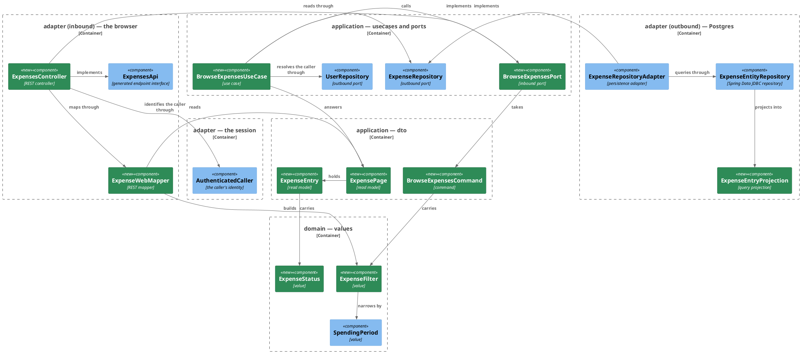
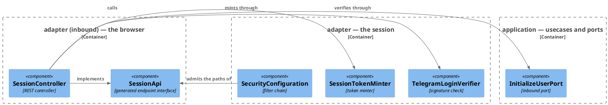

# Plan: Browse Recorded Expenses — `ledger-service`

**Affected Modules:** `ledger-service`
**Design:** [Browse Recorded Expenses](../design.md)

The specification, both generators and both build hookups land in [`shared/plan.md`](../shared/plan.md) before this
plan starts, so `bot.finance.api.ExpensesApi`, `CategoriesApi`, `GroupingsApi` and `SessionApi` already compile
when ST01 begins.

## Components

The design named responsibilities; these are the classes that hold them. Two subjects, so two diagrams, plus the
session endpoint, which no arrow joins to either.

### Listing expenses



### The category tree

```plantuml
@startuml
!include <C4/C4_Component>

AddElementTag("new", $bgColor="#2E8B57", $fontColor="#FFFFFF", $borderColor="#1E5E3A")

Container_Boundary(inbound, "adapter (inbound) — the browser") {
  Component(categoriesApi, "CategoriesApi", "generated endpoint interface")
  Component(groupingsApi, "GroupingsApi", "generated endpoint interface")
  Component(categoriesController, "CategoriesController", "REST controller", $tags="new")
  Component(groupingsController, "GroupingsController", "REST controller", $tags="new")
  Component(categoryWebMapper, "CategoryWebMapper", "REST mapper", $tags="new")
}
Container_Boundary(application, "application — usecases and ports") {
  Component(browseCategoriesPort, "BrowseCategoriesPort", "inbound port", $tags="new")
  Component(browseCategoriesUseCase, "BrowseCategoriesUseCase", "use case", $tags="new")
  Component(browseGroupingsPort, "BrowseGroupingsPort", "inbound port", $tags="new")
  Component(browseGroupingsUseCase, "BrowseGroupingsUseCase", "use case", $tags="new")
  Component(userRepository, "UserRepository", "outbound port")
  Component(categoryRepository, "CategoryRepository", "outbound port")
  Component(groupingRepository, "GroupingRepository", "outbound port")
}
Container_Boundary(dto, "application — dto") {
  Component(browseCategoriesCommand, "BrowseCategoriesCommand", "command", $tags="new")
  Component(browseGroupingsCommand, "BrowseGroupingsCommand", "command", $tags="new")
  Component(categoryEntry, "CategoryEntry", "read model", $tags="new")
  Component(groupingEntry, "GroupingEntry", "read model", $tags="new")
}
Container_Boundary(outbound, "adapter (outbound) — Postgres") {
  Component(categoryRepositoryAdapter, "CategoryRepositoryAdapter", "persistence adapter")
  Component(groupingRepositoryAdapter, "GroupingRepositoryAdapter", "persistence adapter")
  Component(categoryEntityRepository, "CategoryEntityRepository", "Spring Data JDBC repository")
  Component(categoryEntryProjection, "CategoryEntryProjection", "query projection", $tags="new")
  Component(groupingEntryProjection, "GroupingEntryProjection", "query projection", $tags="new")
}
Container_Boundary(security, "adapter — the session") {
  Component(authenticatedCaller, "AuthenticatedCaller", "the caller's identity")
}

Rel_D(categoriesController, authenticatedCaller, "identifies the caller through")
Rel_D(groupingsController, authenticatedCaller, "identifies the caller through")
Rel_R(categoriesController, categoriesApi, "implements")
Rel_R(groupingsController, groupingsApi, "implements")
Rel_D(categoriesController, categoryWebMapper, "maps through")
Rel_D(groupingsController, categoryWebMapper, "maps through")
Rel_R(categoriesController, browseCategoriesPort, "calls")
Rel_R(groupingsController, browseGroupingsPort, "calls")
Rel_R(browseCategoriesUseCase, browseCategoriesPort, "implements")
Rel_R(browseGroupingsUseCase, browseGroupingsPort, "implements")
Rel_D(browseCategoriesPort, browseCategoriesCommand, "takes")
Rel_D(browseGroupingsPort, browseGroupingsCommand, "takes")
Rel_D(browseCategoriesUseCase, categoryEntry, "answers")
Rel_D(browseGroupingsUseCase, groupingEntry, "answers")
Rel_R(browseCategoriesUseCase, userRepository, "resolves the caller through")
Rel_R(browseGroupingsUseCase, userRepository, "resolves the caller through")
Rel_R(browseCategoriesUseCase, categoryRepository, "reads through")
Rel_R(browseGroupingsUseCase, groupingRepository, "reads through")
Rel_R(categoryRepositoryAdapter, categoryRepository, "implements")
Rel_R(groupingRepositoryAdapter, groupingRepository, "implements")
Rel_R(categoryRepositoryAdapter, categoryEntityRepository, "queries through")
Rel_R(groupingRepositoryAdapter, categoryEntityRepository, "queries through")
Rel_D(categoryEntityRepository, categoryEntryProjection, "projects into")
Rel_D(categoryEntityRepository, groupingEntryProjection, "projects into")
@enduml
```



### The session endpoint moving onto the specification



### What a box cannot carry

| Type                     | Holds                                                                                    | Refuses                                                                 |
|--------------------------|-------------------------------------------------------------------------------------------|-------------------------------------------------------------------------|
| `ExpenseStatus`          | `PENDING`, `RECORDED`                                                                     | —                                                                       |
| `ExpenseFilter`          | `status`, `categoryId`, `period`, `limit`, `offset`; `DEFAULT_LIMIT` 50, `MAX_LIMIT` 100 | a `limit` below 1 or above `MAX_LIMIT`, a negative `offset`             |
| `ExpenseEntry`           | `status`, `id`, `categoryId`, `description`, `merchant`, `money`, `createdAt`             | —                                                                       |
| `ExpensePage`            | `items`, `limit`, `offset`, `total`                                                       | —                                                                       |
| `CategoryEntry`          | `id`, `name`, `groupingId`, `groupingName`                                                | —                                                                       |
| `GroupingEntry`          | `id`, `name`                                                                              | —                                                                       |
| `BrowseExpensesCommand`  | `userId`, `filter`                                                                        | a null `userId`, a null `filter`                                        |
| `BrowseCategoriesCommand`| `userId`, optional `groupingId`                                                           | a null `userId`                                                         |
| `BrowseGroupingsCommand` | `userId`                                                                                  | a null `userId`                                                         |

| Port                    | Methods                                                                        |
|-------------------------|---------------------------------------------------------------------------------|
| `BrowseExpensesPort`    | `browse(BrowseExpensesCommand): ExpensePage`                                    |
| `BrowseCategoriesPort`  | `browse(BrowseCategoriesCommand): List<CategoryEntry>`                          |
| `BrowseGroupingsPort`   | `browse(BrowseGroupingsCommand): List<GroupingEntry>`                           |
| `ExpenseRepository`     | gains `findPage(long, ExpenseFilter): List<ExpenseEntry>`, `countMatching(long, ExpenseFilter): long` |
| `CategoryRepository`    | gains `findAllForUser(long, Long groupingId): List<CategoryEntry>`              |
| `GroupingRepository`    | gains `findAllForUser(long): List<GroupingEntry>`                               |

`WebExceptionHandler` belongs to no subject above, so it is drawn in neither diagram. It is a
`@RestControllerAdvice` over `bot.finance.adapter.web`, and the mapping it must carry after this change is:

| Exception                              | Status | Message                                                                     | Present today |
|----------------------------------------|--------|------------------------------------------------------------------------------|---------------|
| `InvalidExpenseFilterException`        | 400    | the exception's own message, which this module wrote naming the parameter and the bound | new |
| `InvalidSpendingPeriodException`       | 400    | a sentence this module writes, naming `from` and `to` (D41)                 | new           |
| `MethodArgumentTypeMismatchException`  | 400    | composed from `getName()` and the rejected value, never the exception's message (D41) | new |
| `HandlerMethodValidationException`     | 400    | composed from the parameter and the bound it broke (D41)                    | new           |
| `TelegramLoginRejectedException`       | 401    | "the Telegram sign-in was not accepted"                                     | yes, unchanged |
| `InvalidUserException`                 | 401    | "no browser session is open"                                                | yes, unchanged |
| `EntityNotFoundException`              | 404    | the caller is unknown (D10)                                                 | new           |
| `PersistenceFailedException`           | 503    | reworded to name the request rather than the session (D26)                  | yes, reworded |
| `Exception`                            | 500    | reworded the same way                                                       | yes, reworded |

Every new mapping must be declared before the existing `Exception.class` handler claims it (D25). The **401 the
filter chain returns** has no handler — a filter refuses the request before any advice sees it (D38) — but the two
401s above are raised inside the sign-in endpoint and are the advice's own; deleting either breaks two
`SessionControllerTest` cases, one `WebSessionSystemTest` case, and the session contract's Failures table.

## Step-by-Step Implementation Map (To-Do List)

### Stabilization

#### Database

No migration. Each arm's predicate is served by the index its table already carries, and no index can serve the
union's cross-table ordering (D42).

#### Interface-First / Build Stabilization

**Interface & Signature Sync**

- [x] ST01 · Add `ExpenseStatus` to `domain/value` — an enum of `PENDING` and `RECORDED`, no other member.
- [x] ST02 · Add `InvalidExpenseFilterException` to `domain/exception`, shaped like
  `InvalidSpendingPeriodException`.
- [x] ST03 · Add `ExpenseFilter` to `domain/value` — a record of `ExpenseStatus status`, `Long categoryId`,
  `SpendingPeriod period`, `int limit`, `int offset`, with `public static final int DEFAULT_LIMIT = 50` and
  `MAX_LIMIT = 100`. Every reference field is nullable; the two ints are not:
  ```java
  public ExpenseFilter {
      // TODO: refuse a limit below 1 or above MAX_LIMIT, and a negative offset, with
      // InvalidExpenseFilterException naming the parameter and the bound it broke
  }
  ```
  `MAX_LIMIT` is one of the two places the page-size cap is written; the other is `maximum` on the `Limit`
  parameter in `openapi/components/parameters/paging.yaml`, and the two must agree.
- [x] ST04 · Add the read models to `application/dto`, all plain records with no validation:
  - `ExpenseEntry(ExpenseStatus status, long id, long categoryId, String description, Optional<String> merchant,
    Money money, Instant createdAt)`;
  - `ExpensePage(List<ExpenseEntry> items, int limit, int offset, long total)`;
  - `CategoryEntry(long id, String name, long groupingId, String groupingName)`;
  - `GroupingEntry(long id, String name)`.
- [x] ST05 · Add the commands to `application/dto`, each with a TODO'd compact constructor:
  `BrowseExpensesCommand(AuthenticatedUserId userId, ExpenseFilter filter)`,
  `BrowseCategoriesCommand(AuthenticatedUserId userId, Long groupingId)`,
  `BrowseGroupingsCommand(AuthenticatedUserId userId)`. The names are what
  `inboundPortCommandsAreNamedAfterTheirUseCase` requires of the three use cases below.
- [x] ST06 · Add the inbound ports to `application/port` — `BrowseExpensesPort`, `BrowseCategoriesPort`,
  `BrowseGroupingsPort`, each with the single `browse(...)` method the Components table names, and a javadoc
  `@throws` for `EntityNotFoundException` and `PersistenceFailedException` in the style the existing ports use.
- [x] ST07 · Extend the outbound ports in `application/port`, each with the same javadoc `@throws` style:
  - `ExpenseRepository` gains `List<ExpenseEntry> findPage(long userId, ExpenseFilter filter)` and
    `long countMatching(long userId, ExpenseFilter filter)`;
  - `CategoryRepository` gains `List<CategoryEntry> findAllForUser(long userId, Long groupingId)`;
  - `GroupingRepository` gains `List<GroupingEntry> findAllForUser(long userId)`.
- [x] ST08 · Stub the three use cases in `application/usecase`, each carrying its implementation intent:
  ```java
  public ExpensePage browse(BrowseExpensesCommand command) {
      // resolves the caller's user row by external id, reads the filtered page and the matching total
      // through ExpenseRepository, logs the resolved id, the filter and the entry count at DEBUG
      return null;
  }
  ```
  `BrowseCategoriesUseCase` and `BrowseGroupingsUseCase` take the same shape against their own repositories.
- [x] ST09 · Add the query projections to `adapter/persistence`, each with a `to<ReadModel>()` method:
  `ExpenseEntryProjection`, `CategoryEntryProjection`, `GroupingEntryProjection`. Their column names are the
  aliases the design's SQL projects.
- [x] ST10 · Stub the persistence adapter methods, each with its intent comment and the minimum return —
  `ExpenseRepositoryAdapter.findPage()` and `countMatching()`, `CategoryRepositoryAdapter.findAllForUser()`,
  `GroupingRepositoryAdapter.findAllForUser()`. The `@Query` methods on `ExpenseEntityRepository` and
  `CategoryEntityRepository` are written in the green phase, not here.
- [x] ST11 · Stub the two REST mappers in `adapter/web` as `public final` classes with a private constructor and
  static methods, the way `ExpenseProposalToolMapper` and `TurnReportRenderer` already are:
  - `ExpenseWebMapper.toFilter(...)` — the six query parameters into an `ExpenseFilter`;
  - `ExpenseWebMapper.toResponse(ExpensePage)` — the read model into the generated `ExpensePage`;
  - `CategoryWebMapper.toCategories(List<CategoryEntry>)` and `toGroupings(List<GroupingEntry>)`.
- [x] ST12 · Stub the three controllers in `adapter/web` — `ExpensesController`, `CategoriesController`,
  `GroupingsController` — each `@RestController`, implementing the generated interface its tag produced, taking
  its inbound port through the constructor, and returning the minimum from each generated method with a TODO at
  the insertion point. Each takes the caller's `AuthenticatedUserId` from
  `AuthenticatedCaller.authenticatedUserId()`, the way `SessionController` already does: the ArchUnit rule
  `authenticatedUserIdIsConstructedOnlyBySecurityAdapter` refuses any class outside `bot.finance.adapter.security`
  constructing one, so this is the only legal source.
- [x] ST13 · Move `SessionController` onto the generated `SessionApi`: implement the interface, drop the
  `@RequestMapping("/api/session")` and the three method-level mappings the interface now carries, and **keep
  every line of its existing logic** — the verifier call, the port call, the minter, the cookie builder and the
  log line. Adjust only what the generated signatures force, adding a `TODO` at each adjustment. Its behaviour is
  reworked to answer at `/api/v1/session` and nothing else changes (D8). Two consequences of the generated
  signatures:
  - the sign-in body arrives as the generated `TelegramLoginPayload`, whose `additionalProperties: true` makes it
    a map of objects; render each value with `String.valueOf` into the `Map<String, String>`
    `TelegramLoginVerifier.verify` takes, so that signature is unchanged and D22 still holds;
  - [`SessionResponse`](../../../ledger-service/src/main/java/bot/finance/adapter/web/SessionResponse.java) has
    this controller as its only reference; delete it once the generated `Session` model is the return type.
- [x] ST14 · Declare the three new inbound-port beans in `adapter/config/UseCaseConfiguration`, beside
  `listCategoriesPort`.

**Configuration**

- [x] ST15 · Rewrite the authorization rules in
  [`SecurityConfiguration`](../../../ledger-service/src/main/java/bot/finance/adapter/security/SecurityConfiguration.java)'s
  `webSessionSecurityFilterChain`, keeping `securityMatcher("/api/**")` and the closing `anyRequest().denyAll()`:
  - `POST /api/v1/session` and `DELETE /api/v1/session` — `permitAll()`;
  - `GET /api/v1/session`, `GET /api/v1/expenses`, `GET /api/v1/categories`, `GET /api/v1/groupings` —
    `authenticated()`;
  - the three `/api/session` entries are removed, so the retired path falls to `denyAll()` and a caller with no
    session is refused by the chain with 401 (D37).

  An unlisted path is unreachable rather than open, which is why this is configuration and not a green-phase step:
  a red-phase test must fail on an assertion, never on a route nobody registered (D13).

**Shared Test Infrastructure**

- [x] ST16 · Add a `WebAdapterTest` composed annotation to `bot.finance.common.boot`, carrying `@ActiveProfiles("test")`
  and the `@Import({SecurityConfiguration.class, SigningKeysConfiguration.class, SessionTokenMinter.class,
  Slf4jLoggerFactory.class})` block that `SessionControllerTest` writes out by hand today. `@WebMvcTest` stays on
  each test class, since it names the controller under test. Four upcoming slice tests need this block, and no
  red-phase step is scoped to create shared fixtures.
  - It only proves itself at runtime, so it ships with a throwaway class carrying it that autowires one bean and
    asserts nothing, the way `McpAdapterContextTest` does for `McpAdapterTest`.
  - List it in [Testing Conventions](../../../ledger-service/docs/conventions/testing.md#package-structure) under
    `common/boot`, beside the other composed annotations.
- [x] ST17 · Confirm `bot.finance.architecture.CleanArchitectureTest` still passes after the stabilization above:
  `tools/agent-test/agent-test.sh --module ledger-service --tests CleanArchitectureTest`.

### Red Phase

#### TDD Unit Red Phase

- [ ] RU01 · `ExpenseFilter` · test: `ExpenseFilterTest` · covers: `ExpenseFilter()` · scenarios: A7
    - `ExpenseFilter()`:
        - given: a limit of 1, a limit of MAX_LIMIT, and an offset of zero
          when: the filter is constructed with each
          then: each is accepted, and the filter carries the values it was given
        - given: a limit of zero, a negative limit, and a limit of MAX_LIMIT plus one
          when: the filter is constructed with each
          then: InvalidExpenseFilterException is thrown, and its message names the limit and the bound it broke
        - given: a negative offset
          when: the filter is constructed
          then: InvalidExpenseFilterException is thrown, and its message names the offset
        - given: a null status, a null categoryId and a null period
          when: the filter is constructed with a valid limit and offset
          then: it is accepted, because every narrowing dimension is optional
- [ ] RU02 · `BrowseExpensesCommand` · test: `BrowseExpensesCommandTest` · covers: `BrowseExpensesCommand()`
    - `BrowseExpensesCommand()`:
        - given: an authenticated user id and a filter
          when: the command is constructed
          then: it carries both
        - given: a null user id, and separately a null filter
          when: the command is constructed with each
          then: the construction is refused rather than a command with a hole in it being handed to the use case
- [ ] RU03 · `BrowseCategoriesCommand` · test: `BrowseCategoriesCommandTest` · covers: `BrowseCategoriesCommand()` · scenarios: A14
    - `BrowseCategoriesCommand()`:
        - given: an authenticated user id and a grouping id
          when: the command is constructed
          then: it carries both
        - given: an authenticated user id and no grouping id
          when: the command is constructed
          then: it is accepted, because the grouping filter is optional
        - given: a null user id
          when: the command is constructed
          then: the construction is refused
- [ ] RU04 · `BrowseGroupingsCommand` · test: `BrowseGroupingsCommandTest` · covers: `BrowseGroupingsCommand()`
    - `BrowseGroupingsCommand()`:
        - given: an authenticated user id
          when: the command is constructed
          then: it carries it
        - given: a null user id
          when: the command is constructed
          then: the construction is refused
- [ ] RU05 · `BrowseExpensesUseCase` · test: `BrowseExpensesUseCaseTest` · covers: `browse()` · scenarios: A1, A10, A11
    - `browse()`:
        - given: a stored user and a repository answering a page of entries and a total
          when: browse() is called with a filter
          then: the answered page carries those entries, the total, and the limit and offset the filter asked for
        - given: a stored user
          when: browse() is called
          then: the repository is asked for the page and the count with the resolved user id and the same filter,
          never with the external id
        - given: no user row for the caller's external id
          when: browse() is called
          then: EntityNotFoundException is thrown and neither repository read is attempted
        - given: a repository that fails the read with PersistenceFailedException
          when: browse() is called
          then: the exception reaches the caller unchanged, rather than being answered as an empty page
- [ ] RU06 · `BrowseCategoriesUseCase` · test: `BrowseCategoriesUseCaseTest` · covers: `browse()` · scenarios: A14, A21, A22
    - `browse()`:
        - given: a stored user and a repository answering three categories
          when: browse() is called with no grouping id
          then: all three are answered, each carrying its grouping's id and name
        - given: a stored user
          when: browse() is called with a grouping id
          then: the repository is asked with the resolved user id and that grouping id
        - given: a stored user and a grouping id that names no grouping of theirs
          when: browse() is called
          then: an empty list is answered and nothing is thrown, so the caller sees 200 rather than 404 or 500
        - given: no user row for the caller's external id
          when: browse() is called
          then: EntityNotFoundException is thrown
- [ ] RU07 · `BrowseGroupingsUseCase` · test: `BrowseGroupingsUseCaseTest` · covers: `browse()` · scenarios: A13, A21
    - `browse()`:
        - given: a stored user and a repository answering the seeded groupings
          when: browse() is called
          then: every grouping is answered, unpaged, each carrying its id and name
        - given: a stored user
          when: browse() is called
          then: the repository is asked with the resolved user id, never with the external id
        - given: no user row for the caller's external id
          when: browse() is called
          then: EntityNotFoundException is thrown
- [ ] RU08 · `ExpenseWebMapper` · test: `ExpenseWebMapperTest` · covers: `toFilter()`, `toResponse()` · scenarios: A1, A3, A7, A8
    - `toFilter()`:
        - given: every query parameter absent
          when: toFilter() is called
          then: the filter carries a limit of 50, an offset of zero, and no status, category or period
        - given: a status, a category id, a from and a to, a limit and an offset
          when: toFilter() is called
          then: each lands on the filter, and the period carries the two days as given
        - given: a from with no to, and separately a to with no from
          when: toFilter() is called with each
          then: InvalidSpendingPeriodException is thrown, because a period is both days or neither
        - given: a to that falls before the from
          when: toFilter() is called
          then: InvalidSpendingPeriodException is thrown
        - given: a limit above the maximum
          when: toFilter() is called
          then: InvalidExpenseFilterException is thrown, never a filter carrying a clamped limit
    - `toResponse()`:
        - given: a page of two entries, one PENDING and one RECORDED, with a total larger than the page
          when: toResponse() is called
          then: every field of each entry is mapped, the statuses survive, and the limit, offset and total are the
          page's own
        - given: an entry with no merchant
          when: toResponse() is called
          then: the response omits the merchant rather than carrying an empty string
- [ ] RU09 · `CategoryWebMapper` · test: `CategoryWebMapperTest` · covers: `toCategories()`, `toGroupings()` · scenarios: A13
    - `toCategories()`:
        - given: two category entries under different groupings
          when: toCategories() is called
          then: each response carries its id, name, grouping id and grouping name, in the order given
        - given: an empty list
          when: toCategories() is called
          then: an empty list is answered rather than null
    - `toGroupings()`:
        - given: two grouping entries
          when: toGroupings() is called
          then: each response carries its id and name, in the order given

#### TDD Integration Red Phase

- [ ] RI01 · `ExpenseRepositoryAdapter` · test: `ExpenseRepositoryAdapterTest` · covers: `findPage()`, `countMatching()` · scenarios: A1, A2, A3, A4, A5, A12
    - `findPage()`:
        - given: a user with recorded expenses and pending proposals stored at different instants
          when: findPage() is called with an unnarrowed filter
          then: both kinds come back in one list, newest first, each carrying the status of the table it came from
        - given: rows of both kinds
          when: findPage() is called with a status of PENDING, and separately of RECORDED
          then: only that kind comes back each time
        - given: rows recorded inside and outside a range of days
          when: findPage() is called with that from and to
          then: only the rows inside come back, the last day included, the boundary taken at UTC
        - given: more rows than one page holds
          when: findPage() is called with a limit, then again with the same limit and an offset of one page
          then: the second page continues the first and repeats no row from it
        - given: fewer rows than the requested offset
          when: findPage() is called with that offset
          then: an empty list comes back rather than the last page again
        - given: a category id belonging to another user
          when: findPage() is called with it
          then: an empty list comes back, because every arm is scoped by the resolved user id
        - given: two rows sharing a created_at, one in each table
          when: findPage() is called
          then: the order between them is the same on every call, so a page boundary is deterministic
        - given: an adapter built over a mocked entity repository that fails the read
          when: findPage() is called
          then: PersistenceFailedException is thrown carrying the failure as its cause, which is what the 503
          A11 asks for rests on — in the `WithAMockedStore` nested class the test class already carries
    - `countMatching()`:
        - given: a user with rows of both kinds
          when: countMatching() is called with an unnarrowed filter
          then: the answer is every row the user has, across both tables
        - given: a user with rows of both kinds
          when: countMatching() is called with a status of PENDING
          then: only the proposals are counted
        - given: a filter whose limit and offset would return one page
          when: countMatching() is called
          then: the answer ignores the limit and the offset, so a page can say how many rows the filter matches
        - given: a category id belonging to another user
          when: countMatching() is called with it
          then: the answer is zero
        - given: an adapter built over a mocked entity repository that fails the read
          when: countMatching() is called
          then: PersistenceFailedException is thrown carrying the failure as its cause
- [ ] RI02 · `CategoryRepositoryAdapter` · test: `CategoryRepositoryAdapterTest` · covers: `findAllForUser()` · scenarios: A13, A14, A22
    - `findAllForUser()`:
        - given: a user with categories under two groupings
          when: findAllForUser() is called with no grouping id
          then: every category comes back, each naming its grouping's id and name
        - given: a user with categories under two groupings
          when: findAllForUser() is called with one grouping's id
          then: only that grouping's categories come back
        - given: a grouping id that belongs to another user, and separately one that names no grouping at all
          when: findAllForUser() is called with each
          then: an empty list comes back, and nothing is thrown
        - given: another user with their own categories
          when: findAllForUser() is called for the first user
          then: none of the other user's categories appears
        - given: a user with a grouping and no categories under it
          when: findAllForUser() is called
          then: the grouping row itself is not answered as a category
        - given: an adapter built over a mocked entity repository that fails the read
          when: findAllForUser() is called
          then: PersistenceFailedException is thrown carrying the failure as its cause, which is what the 503
          A16 asks for rests on — in the `WithAMockedStore` nested class the test class already carries
- [ ] RI03 · `GroupingRepositoryAdapter` · test: `GroupingRepositoryAdapterTest` · covers: `findAllForUser()` · scenarios: A13
    - `findAllForUser()`:
        - given: a user whose default tree was seeded
          when: findAllForUser() is called
          then: every grouping comes back, unpaged, each carrying its id and name
        - given: a user with a grouping holding no categories
          when: findAllForUser() is called
          then: that grouping comes back too, unlike findNamesWithCategories(), which exists to hide it from the
          extraction prompt
        - given: another user's groupings
          when: findAllForUser() is called for the first user
          then: none of them appears
        - given: a user with no rows at all
          when: findAllForUser() is called
          then: an empty list comes back rather than null
        - given: an adapter built over a mocked entity repository that fails the read
          when: findAllForUser() is called
          then: PersistenceFailedException is thrown carrying the failure as its cause, in the `WithAMockedStore`
          nested class the test class already carries
- [ ] RI04 · `ExpensesController` · test: `ExpensesControllerTest` · covers: `GET /api/v1/expenses` · mocks: `BrowseExpensesPort` · scenarios: A1, A6, A7, A8
    - Happy Path:
        - given: the mocked port answers a page of two entries with a total
          when: the request is made with a valid session cookie and no query parameters
          then: the port is called with a filter carrying a limit of 50, an offset of zero and no narrowing, and
          the response is 200 with that page's items, limit, offset and total
        - given: the mocked port answers a page
          when: the request is made with a status, a category id, a from, a to, a limit and an offset
          then: the port is called with a filter carrying every one of them
    - Validation: `limit` — 1 and the maximum both bind and reach the port; `offset` — zero binds; `status` —
      each of PENDING and RECORDED binds to its own enum constant; `from` and `to` — a well-formed pair binds to
      a period carrying both days; `categoryId` — a number binds. Each asserts what the entry point hands the
      port, never a refusal.

      **Every refusal — the 400s, the 404, the 503 and the 500 — belongs to RI07.** Each one is produced by
      `WebExceptionHandler`, not by this class: a binding failure raises `MethodArgumentTypeMismatchException` or
      `HandlerMethodValidationException`, and the advice's existing `@ExceptionHandler(Exception.class)` claims
      every unmapped one and answers 500 (D25). Asserting a 400 here would make this step wait on GI07, which
      waits on this one.
- [ ] RI05 · `CategoriesController` · test: `CategoriesControllerTest` · covers: `GET /api/v1/categories` · mocks: `BrowseCategoriesPort` · scenarios: A13, A14, A22
    - Happy Path:
        - given: the mocked port answers three categories
          when: the request is made with a valid session cookie and no grouping id
          then: the port is called with a command carrying no grouping id, and the response is 200 with all three,
          each naming its grouping's id and name
        - given: the mocked port answers one category
          when: the request is made with a grouping id
          then: the port is called with a command carrying that grouping id
        - given: the mocked port answers an empty list
          when: the request is made with a grouping id that matches nothing
          then: the response is 200 with an empty array, never 404
    - Validation: `groupingId` — a number binds and reaches the port as the command's grouping id. The 400 a
      non-numeric one answers is `WebExceptionHandler`'s, and RI07 owns it, for the reason RI04 gives.
- [ ] RI06 · `GroupingsController` · test: `GroupingsControllerTest` · covers: `GET /api/v1/groupings` · mocks: `BrowseGroupingsPort` · scenarios: A13
    - Happy Path:
        - given: the mocked port answers two groupings
          when: the request is made with a valid session cookie
          then: the port is called with a command carrying the cookie's subject, and the response is 200 with both,
          unpaged
        - given: the mocked port answers an empty list
          when: the request is made
          then: the response is 200 with an empty array
- [ ] RI07 · `WebExceptionHandler` · test: `WebExceptionHandlerTest` · covers: the advice over `GET /api/v1/expenses` and `GET /api/v1/categories` · mocks: `BrowseExpensesPort`, `BrowseCategoriesPort` · scenarios: A6, A7, A8, A10, A11, A16
    - Validation: every refusal the two entry points answer, each asserting 400 and a body whose message names
      the parameter that was refused, with the port never called — `limit` zero, negative, above the maximum, and
      not a number; `offset` negative and not a number; `status` a word that is neither PENDING nor RECORDED;
      `from` and `to` not a `YYYY-MM-DD` day, a `from` with no `to`, a `to` with no `from`, and a `to` before the
      `from`; `categoryId` not a number; `groupingId` not a number. This is the advice's matrix rather than a
      controller's, because the status and the wording are the advice's (D25, D41).
    - Error Mapping:
        - given: the mocked port throws EntityNotFoundException
          when: the request is made
          then: the response is 404 with a Problem body
        - given: the mocked port throws PersistenceFailedException
          when: the request is made
          then: the response is 503, and the message names the request rather than the session and names no table,
          statement or stack frame
        - given: the mocked port throws an exception nothing else maps
          when: the request is made
          then: the response is 500, and the message names the request rather than the session
        - given: the mocked port throws InvalidExpenseFilterException
          when: the request is made
          then: the response is 400, and the message names the parameter and the bound it broke
        - given: the mocked port throws InvalidSpendingPeriodException
          when: the request is made
          then: the response is 400, and the message names the period as `from` and `to`
        - given: any of the above
          when: the response body is read
          then: it is `application/json` carrying a single `message` field, never `application/problem+json`

      The advice's two existing 401 handlers are left alone and are not re-asserted here: `SessionControllerTest`
      already pins both, and RI08 keeps those assertions unchanged.
- [ ] RI08 · `SessionController` · test: `SessionControllerTest` · covers: `POST`, `GET`, `DELETE /api/v1/session` · mocks: `TelegramLoginVerifier`, `InitializeUserPort` · scenarios: A17
    - update: every request builder in the class targets `/api/session`; retarget all of them to
      `/api/v1/session`, adopt the `@WebAdapterTest` annotation from ST16 in place of the hand-written
      `@ActiveProfiles`/`@Import` block, and leave every assertion as it stands — the statuses, the bodies and the
      cookie attributes the contract documents do not move (D8).
    - update: `whenTheSessionIsDeleted_thenTheCookieIsClearedWithMaxAgeZero()` and
      `whenNoSessionCookieIsPresent_thenTheDeleteStillClearsTheCookie()` assert only the cleared cookie; add an
      assertion to each that the response carries no body, which is what `openapi/paths/session.yaml` now
      declares for the 204.
    - Error Mapping:
        - given: nothing is stubbed, and the write carries a CSRF token
          when: the sign-in is posted to the retired `/api/session`, and the sign-out deleted there
          then: each answers 401, because the retired path is no longer named in the filter chain and falls to
          `anyRequest().denyAll()` (D37). Without the token `CsrfFilter` refuses first and answers 403, which is
          why `whenTheRequestCarriesNoCsrfToken_thenTheSignInIsRefused()` asserts that instead
        - given: nothing is stubbed
          when: the session is read at the retired `/api/session`
          then: the response is 401; a read carries no CSRF token and needs none

    The happy path is not listed: `whenThePayloadVerifies_thenTheBodyAnswersWithTheSignedInExternalId()` and
    `whenThePayloadVerifies_thenTheSessionCookieIsHttpOnlyPathScopedAndSameSiteLax()` already prove it, and the
    first `update:` bullet retargets both.

#### TDD System Test Red Phase

- [ ] RS01 · `BrowseExpensesSystemTest` · covers: `GET /api/v1/expenses` · scenarios: A1, A9
    - Happy Path:
        - given: a person signed in over the real sign-in endpoint, with recorded expenses and pending proposals
          seeded against their user row and one of their seeded categories
          when: the list is requested with the session cookie and no filter
          then: the response is 200, both kinds appear newest first, each row carries its status and category id,
          and the total counts every row the person has
    - Unhappy Path:
        - given: no session cookie
          when: the list is requested
          then: the response is 401 and no row is read
- [ ] RS02 · `BrowseCategoryTreeSystemTest` · covers: `GET /api/v1/categories` and `GET /api/v1/groupings` · scenarios: A13, A15
    - Happy Path:
        - given: a person signed in over the real sign-in endpoint, whose default category tree was seeded by that
          sign-in
          when: the groupings and then the categories are requested with the session cookie
          then: both responses are 200 holding every row, unpaged, and each category names its grouping's id and
          name
    - Unhappy Path:
        - given: no session cookie
          when: either list is requested
          then: the response is 401
- [ ] RS03 · `WebSessionSystemTest` · covers: `POST /api/v1/session` · scenarios: A17, A18
    - update: every RestAssured call in the class targets `/api/session`; retarget all of them to
      `/api/v1/session`, including the CSRF-token helper that reads a token from the unauthenticated session read,
      and leave every assertion as it stands.
    - Unhappy Path:
        - given: the ledger is running and the caller holds no session
          when: a sign-in is posted to the retired `/api/session`
          then: the response is 401, because the chain refuses the path before any endpoint is reached (D37)

### Green Phase

#### TDD Unit Green Phase

- [ ] GU01 · `ExpenseFilter` · test: `ExpenseFilterTest`
- [ ] GU02 · `BrowseExpensesCommand` · test: `BrowseExpensesCommandTest` · after: GU01
- [ ] GU03 · `BrowseCategoriesCommand` · test: `BrowseCategoriesCommandTest`
- [ ] GU04 · `BrowseGroupingsCommand` · test: `BrowseGroupingsCommandTest`
- [ ] GU05 · `BrowseExpensesUseCase` · test: `BrowseExpensesUseCaseTest` · after: GU01, GU02
- [ ] GU06 · `BrowseCategoriesUseCase` · test: `BrowseCategoriesUseCaseTest` · after: GU03
- [ ] GU07 · `BrowseGroupingsUseCase` · test: `BrowseGroupingsUseCaseTest` · after: GU04
- [ ] GU08 · `ExpenseWebMapper` · test: `ExpenseWebMapperTest` · after: GU01
- [ ] GU09 · `CategoryWebMapper` · test: `CategoryWebMapperTest`

#### TDD Integration Green Phase

- [ ] GI01 · `ExpenseRepositoryAdapter` · test: `ExpenseRepositoryAdapterTest` · after: GU01
- [ ] GI02 · `CategoryRepositoryAdapter` · test: `CategoryRepositoryAdapterTest`
- [ ] GI03 · `GroupingRepositoryAdapter` · test: `GroupingRepositoryAdapterTest`
- [ ] GI04 · `ExpensesController` · test: `ExpensesControllerTest` · covers: `GET /api/v1/expenses` · mocks: `BrowseExpensesPort` · after: GU08
- [ ] GI05 · `CategoriesController` · test: `CategoriesControllerTest` · covers: `GET /api/v1/categories` · mocks: `BrowseCategoriesPort` · after: GU09
- [ ] GI06 · `GroupingsController` · test: `GroupingsControllerTest` · covers: `GET /api/v1/groupings` · mocks: `BrowseGroupingsPort` · after: GU09
- [ ] GI07 · `WebExceptionHandler` · test: `WebExceptionHandlerTest` · covers: the advice over `GET /api/v1/expenses` and `GET /api/v1/categories` · mocks: `BrowseExpensesPort`, `BrowseCategoriesPort` · after: GI04, GI05
- [ ] GI08 · `SessionController` · test: `SessionControllerTest` · covers: `POST`, `GET`, `DELETE /api/v1/session` · mocks: `TelegramLoginVerifier`, `InitializeUserPort`

#### TDD System Test Green Phase

- [ ] GS01 · `BrowseExpensesSystemTest` · covers: `GET /api/v1/expenses`
- [ ] GS02 · `BrowseCategoryTreeSystemTest` · covers: `GET /api/v1/categories` and `GET /api/v1/groupings`
- [ ] GS03 · `WebSessionSystemTest` · covers: `POST /api/v1/session`

### Post-Implementation Steps

#### Documentation Corrections

- [ ] P01 · Correct [the session contract](../../../ledger-service/docs/contracts/in/web-session-api.md), which the
  design lists as a document this change moves the facts of: every path becomes `/api/v1/session`, in the
  operations table, in the sequence diagram and in the Compatibility section; and the **Schema** line stops saying
  "none held in a file" and names `openapi/paths/session.yaml` and `openapi/components/schemas/session.yaml`. The
  counterpart file [`web-app/docs/contracts/out/ledger-session-api.md`](../../../web-app/docs/contracts/out/ledger-session-api.md)
  is the `web-app` plan's.

#### Manual Request Files

- [ ] P02 · Add `ledger-service/docs/requests/` with one `.http` file per endpoint — `expenses.http`,
  `categories.http`, `groupings.http` and `session.http` — each carrying a request per operation, the session
  cookie and, for the two session writes, the CSRF header. `expenses.http` shows the unfiltered read and one
  request per narrowing dimension. Then correct
  [File Locations](../../../ledger-service/docs/conventions/architecture.md#file-locations), where the line reads
  "none yet — intended", so it names the directory as a fact (Q2).

No **ADRs** section: Q1 was answered `no`, so this change records none.

## Open Questions / Blockers

- **B1 (unrelated, no action taken):** ST13's `git rm` of
  `ledger-service/src/main/java/bot/finance/adapter/web/SessionResponse.java` staged the deletion into the shared
  index, and the concurrently running `web-app` pipeline's commit `7b5d450` ("Test: cover the expenses listing,
  filters and page ahead of their implementation") swept it up along with its own module's files. The deletion is
  the one ST13 asks for, so nothing is wrong with the tree — only the commit it landed in names the wrong module.
  Recorded rather than reverted: rewriting another pipeline's commit while it is still running is worse than the
  mislabelling.

- **Q1:** [Follow-Up Work](../../conventions/follow-up.md) writes an ADR only for a decision approved for
  recording. The one candidate this change raises is D1 — the specification lives at `openapi/` at the repository
  root, shared by both modules, generated into each build and never committed — which mirrors
  [ADR 0002](../../adr/0002-the-intent-extraction-schema-lives-at-the-repository-root.md) for `proto/` and
  supersedes the "to be confirmed with the first contract" line in the module's File Locations. Record it as an
  ADR? Without one, `shared/plan.md` ST21's edit to the conventions is the only place the answer lives.
  - A: No ADRs. The answer stays where `shared/plan.md` ST21 writes it — the two modules' conventions files. No
    **ADRs** section in this plan.

- **Q2:** The module's [File Locations](../../../ledger-service/docs/conventions/architecture.md#file-locations)
  records manual `.http` request files as "none yet — intended `ledger-service/docs/requests/`". This change is
  the first HTTP API here with a schema behind it. Add `.http` files for the four endpoints as a
  post-implementation step, or leave the intention unrealized?
  - A: Yes, for the four endpoints. P02 writes them and turns the conventions line from an intention into a fact.

- **Q3:** Which step owns the advice's status matrix, given that every refusal the three endpoints answer is
  `WebExceptionHandler`'s rather than a controller's?
  - A: withdrawn — finding F1 settled it against the repository. RI07 owns every refusal; RI04, RI05 and RI06
    assert only what a valid request hands the port.

## Review Findings

- **F1:** GI04/GI05 and GI07 blocked each other: RI04 and RI05 asserted 400s that only `WebExceptionHandler`
  produces, while RI07 drives the advice through those controllers.
  - Resolution: decision
  - Action: resolved — the advice is one class shared by all four endpoints, and the parallelism conventions
    forbid two steps owning one file, so RI07 takes every refusal and RI04/RI05/RI06 keep only what a valid
    request hands the port. RI07's `covers:` now names both endpoints and GI07 is `after: GI04, GI05`. The
    matrix still sits on an entry-point step, which is what the step format asks. Q3 is withdrawn on the same
    grounds.

- **F2:** The `WebExceptionHandler` table omitted the advice's two existing 401 handlers and claimed the 401 has
  no handler, so a step agent following it would have deleted both.
  - Resolution: mechanical
  - Action: applied — both rows join the table under a "Present today" column, and the sentence now says the 401
    the *filter chain* returns has no handler.

- **F3:** RI01–RI03 listed no `PersistenceFailedException` scenario for the four new adapter methods, though A11
  and A16's 503 rests on one and every existing method has one.
  - Resolution: mechanical
  - Action: applied — one scenario per new method, in the `WithAMockedStore` nested class each test class already
    carries.

- **F4:** RI08's retired-path scenario answers 403 rather than 401 for the two writes unless they carry a CSRF
  token.
  - Resolution: mechanical
  - Action: applied — the scenario states the token, and splits the read into its own case.

- **F5:** RI08's Happy Path duplicated two existing `SessionControllerTest` methods its own `update:` bullet
  retargets, and the second `update:` bullet named no method.
  - Resolution: mechanical
  - Action: applied — the group is dropped with a line saying which methods already prove it, and the bullet now
    names both methods.

- **F6:** Nothing said where a controller gets the caller's `AuthenticatedUserId`, and
  `authenticatedUserIdIsConstructedOnlyBySecurityAdapter` refuses the obvious guess.
  - Resolution: mechanical
  - Action: applied — ST12 names `AuthenticatedCaller.authenticatedUserId()`, and both diagrams draw the arrow.

- **F7:** P02 was a checklist item for an ADR Q1 has not approved.
  - Resolution: mechanical
  - Action: applied — the item and its section are gone, with a line saying an answered `yes` adds one.

- **F8:** ST13 left `SessionResponse` orphaned once the generated `Session` model replaces it.
  - Resolution: mechanical
  - Action: applied — ST13 deletes it.
