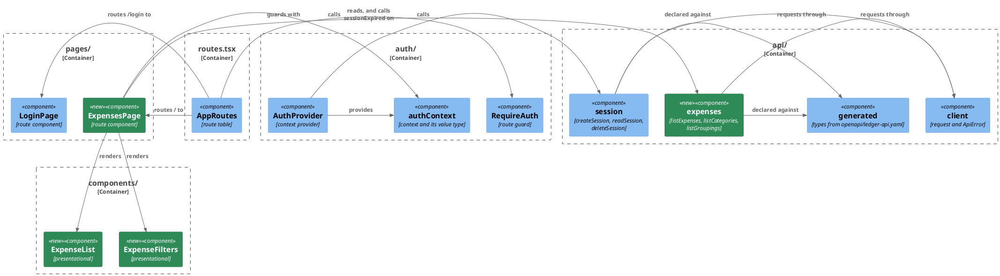

# Plan: Browse Recorded Expenses — `web-app`

**Affected Modules:** `web-app`
**Design:** [Browse Recorded Expenses](../design.md)

The specification, the `openapi-typescript` invocation, the `generate:api` script and every ignore entry the
generated tree needs land in [`shared/plan.md`](../shared/plan.md) before this plan starts, so
`src/api/generated/ledger-api.d.ts` already exists and every gate already skips it when ST01 begins.

## Components

The module's [Architecture & Layering](../../../web-app/docs/conventions/architecture.md) names no layers, so the
boxes below are its directories, which is what it really organizes code by.



`HomePage` is deleted with its test; `ExpensesPage` takes `/` from it.

| Surface                    | Holds                                                                                          |
|----------------------------|-------------------------------------------------------------------------------------------------|
| `listExpenses(filter)`     | the six query parameters, returning the generated `ExpensePage`                                 |
| `listCategories(groupingId?)` | an optional grouping id, returning the generated `Category[]`                                |
| `listGroupings()`          | nothing, returning the generated `Grouping[]`                                                   |
| `AuthContextValue`         | gains `sessionExpired: () => void` — sets the state to anonymous, distinct from `signOut`, which issues a `DELETE` on a session already gone (D43) |
| `ApiError`                 | unchanged shape; its `message` now comes from the `Problem` body when there is one (D33)         |
| `ExpenseList`              | takes the page and a category-name lookup as props, calls back through props, reads no context   |
| `ExpenseFilters`           | takes the groupings, the categories and the current filter as props, calls back with the next filter; choosing a grouping narrows the categories it offers, client-side from the tree already held |
| `ExpensesPage`             | keeps the sign-out control the deleted home page held, so ending a session stays reachable       |

## Step-by-Step Implementation Map (To-Do List)

### Stabilization

#### Interface-First / Build Stabilization

**Interface & Signature Sync**

- [x] ST01 · Add `src/api/expenses.ts` with the three functions stubbed, each carrying its intent:
  ```ts
  export async function listExpenses(filter: ExpenseFilter): Promise<ExpensePage> {
    // builds the query string from the filter's set fields and requests GET /api/v1/expenses
    throw new Error('not implemented');
  }
  ```
  `listCategories` and `listGroupings` take the same shape. `ExpenseFilter` is this module's own type for the six
  query parameters, declared in the same file.

  `openapi-typescript` exports no top-level `ExpensePage`, `Category` or `Grouping`: it emits `components`,
  `paths` and `operations`, and a schema is reached as `components['schemas']['ExpensePage']`. Declare a local
  alias per schema at the top of this file — `type ExpensePage = components['schemas']['ExpensePage']` — and use
  those aliases everywhere below, so no other file repeats the access form. `shared/plan.md` ST18 records the
  shape the generator actually emitted; if it differs, that record wins.
- [x] ST02 · Add `sessionExpired: () => void` to `AuthContextValue` in `src/auth/authContext.ts`, and implement it
  in `AuthProvider` as a stub with a `TODO` at the insertion point. Both test helpers that build an
  `AuthContextValue` by hand — [`RequireAuth.test.tsx`](../../../web-app/src/auth/RequireAuth.test.tsx) and
  [`LoginPage.test.tsx`](../../../web-app/src/pages/LoginPage.test.tsx) — are updated to supply it, or
  `tsc --noEmit` fails and with it `npm run build`. `HomePage.test.tsx` builds one too and is deleted by ST03, so
  it is not touched here.
  - In the same item, make `auth/types.ts` re-export the generated `Session` instead of declaring its own, so one
    wire shape has one declaration. `AuthStatus` and `AuthState` stay the module's own, and `api/` still depends
    on `auth/types.ts` and nothing else in the tree. `TelegramAuthPayload` stays as it is: the generated
    `TelegramLoginPayload` is `additionalProperties: true`, which the module's `Record<string, string | number>`
    is assignable to, so `LoginPage.test.tsx` keeps passing.
- [x] ST03 · Delete `src/pages/HomePage.tsx` and `src/pages/HomePage.test.tsx` in one `git rm`, add
  `src/pages/ExpensesPage.tsx` as a stub rendering its heading and nothing else, and point `/` at it in
  `src/routes.tsx`.
- [x] ST04 · `src/App.test.tsx` asserts `Signed in as 987654321` in two of its three cases, which is `HomePage`'s
  wording and is now gone. Skip those cases with `it.skip`, naming `RU07` in the reason, so the suite reports what
  is owed rather than hiding it. The `sends a visitor with no session to the sign-in page` case is unaffected and
  stays as it is.
- [x] ST05 · Add `src/components/ExpenseList.tsx` and `src/components/ExpenseFilters.tsx` as stubs, each taking
  its props and rendering nothing, so `ExpensesPage` has something to compose against.

**Shared Test Infrastructure**

- [x] ST06 · Add `src/testing/fixtures.ts` — builders for the wire shapes more than one Red step needs: an
  `Expense` (eight required fields, `shared/plan.md` ST03), an `ExpensePage` around a list of them, a `Category`
  and a `Grouping`, each taking overrides. RU03, RU05 and RU07 all build an `ExpensePage`, and RU06 and RU07 both
  build `Category[]` and `Grouping[]`; without one owner three step agents each invent their own.
  - The module has no fixture file today, so this creates the directory. Name it in the directory structure in
    [Architecture & Layering](../../../web-app/docs/conventions/architecture.md#directory-structure), and add
    `src/testing/**` to `test.coverage.exclude` in `vite.config.ts` beside the other non-behaviour entries.

**Build Stabilization**

- [x] ST07 · Confirm the module builds and lints green before the red phase starts: `npm run lint` and
  `npm run build` from `web-app/`. The module has no architecture-enforcement test — its
  [Testing Conventions](../../../web-app/docs/conventions/testing.md) name none — so there is nothing else to
  confirm here.

### Red Phase

#### TDD Unit Red Phase

Every step below is a unit test: this module's [Testing Conventions](../../../web-app/docs/conventions/testing.md)
map all three of its layers — client, component and page — onto the unit type, because each fakes everything the
code under test depends on.

- [x] RU01 · `client` · test: `client.test.ts` · covers: `request()` · scenarios: A20
    - `request()`:
        - given: a 400 answering a JSON body carrying a message
          when: request() is called
          then: the thrown ApiError carries that message, so the person reads what the ledger said rather than a
          status code the page synthesized
        - given: a 503 answering a body that is not JSON
          when: request() is called
          then: the thrown ApiError carries status 503 and the synthesized wording
        - given: a 400 answering a JSON body with no message field
          when: request() is called
          then: the thrown ApiError carries the synthesized wording
        - update: the `'surfaces a refusal as an ApiError carrying the status'` case stubs a 401 with an empty
          body, which is what the filter chain writes; keep its status assertion and add one that the message is
          the wording the client synthesizes, so it becomes the regression pinning the fallback rather than a
          second scenario saying the same thing
- [x] RU02 · `session` · test: `session.test.ts` · covers: `createSession()`, `readSession()`, `deleteSession()` · scenarios: A17
    - update: the `'opens a session by posting the payload as JSON'` case asserts the path is `/api/session`;
      change it to `/api/v1/session` (D36).
    - update: the other three cases target the same constant; they assert the method rather than the path, so they
      need no change beyond the constant they exercise — confirm each still passes rather than editing it.
    - `readSession()`:
        - given: a stubbed fetch answering a session body
          when: readSession() is called
          then: the request goes to `/api/v1/session`, and the answered value is typed as the generated Session
- [x] RU03 · `expenses` · test: `expenses.test.ts` · covers: `listExpenses()`, `listCategories()`, `listGroupings()` · scenarios: A1, A2, A3, A13, A14, A20
    - `listExpenses()`:
        - given: a filter with no field set
          when: listExpenses() is called
          then: the request goes to `/api/v1/expenses` with no query string, so the service applies its own
          defaults
        - given: a filter carrying a status, a category id, a from, a to, a limit and an offset
          when: listExpenses() is called
          then: every one of them appears in the query string, and nothing else does
        - given: a stubbed fetch answering an ExpensePage body
          when: listExpenses() is called
          then: the answered page is returned as it stands
        - given: a stubbed fetch answering 400 with a Problem body
          when: listExpenses() is called
          then: the ApiError reaches the caller rather than being swallowed into an empty page
    - `listCategories()`:
        - given: no grouping id
          when: listCategories() is called
          then: the request goes to `/api/v1/categories` with no query string
        - given: a grouping id
          when: listCategories() is called
          then: it appears as the `groupingId` query parameter
    - `listGroupings()`:
        - given: a stubbed fetch answering two groupings
          when: listGroupings() is called
          then: the request goes to `/api/v1/groupings` and both groupings are returned
- [x] RU04 · `AuthProvider` · test: `AuthContext.test.tsx` · covers: `sessionExpired()` · scenarios: A19
    - update: the `Probe` helper renders a button per context action; add one for `sessionExpired`, so the new
      action is exercised the way `signIn` and `signOut` already are.
    - `sessionExpired()`:
        - given: a provider that has settled on an authenticated session
          when: sessionExpired is called
          then: the status becomes anonymous and the session is dropped
        - given: a provider that has settled on an authenticated session
          when: sessionExpired is called
          then: no DELETE is issued, unlike signing out — the session is already gone and there is nothing to end
- [x] RU05 · `ExpenseList` · test: `ExpenseList.test.tsx` · covers: the rendered list · scenarios: A1
    - the rendered list:
        - given: a page holding one PENDING and one RECORDED entry, and a lookup answering each category's name
          when: the list is rendered
          then: both rows appear in the order given, each showing its description, amount, currency, status and
          its category's name
        - given: an entry whose category is absent from the lookup
          when: the list is rendered
          then: the row still renders, with the category left unnamed rather than the list failing
        - given: an entry with no merchant
          when: the list is rendered
          then: the row renders without a merchant rather than showing an empty field
        - given: a page with no items and a total of zero
          when: the list is rendered
          then: it says there is nothing to show, rather than rendering an empty region with no explanation
        - given: a page whose total exceeds its items
          when: the list is rendered
          then: it says how many of the total are being shown
- [x] RU06 · `ExpenseFilters` · test: `ExpenseFilters.test.tsx` · covers: the filter controls · scenarios: A2, A3
    - the filter controls:
        - given: the groupings and categories the ledger answered, and an empty filter
          when: the controls are rendered
          then: every grouping and every category is offered, each findable by its accessible name
        - given: the controls rendered, holding categories under two groupings
          when: a grouping is chosen
          then: only that grouping's categories stay offered, narrowed from the tree already held rather than by
          a second call — D5 puts no grouping on the listing filter, and the tree is unpaged and small (D20)
        - given: a grouping is chosen, then cleared
          when: the category control is read
          then: every category is offered again, and no category outside the chosen grouping stays selected
        - given: the controls rendered
          when: a status is chosen
          then: the callback receives a filter carrying that status and nothing else changed
        - given: the controls rendered
          when: a from and a to are entered
          then: the callback receives a filter carrying both days
        - given: the controls rendered
          when: a category is chosen
          then: the callback receives a filter carrying that category's id
        - given: the controls rendered
          when: the period control is read
          then: its label says the days narrow when a row was recorded, not when the money was spent (D27)
- [x] RU07 · `ExpensesPage` · test: `ExpensesPage.test.tsx` · covers: the route's composition · scenarios: A19, A20
    - the route's composition:
        - given: the mocked api answers a page, the groupings and the categories
          when: the page is rendered
          then: all three calls are made once, and the list and the filter controls render what they answered
        - given: the page has rendered
          when: a filter is changed
          then: the expenses call is repeated with the new filter, and the groupings and categories are not
          fetched again
        - given: the mocked expenses call rejects with an ApiError carrying status 401
          when: the page is rendered
          then: sessionExpired is called on the context, so the guard sends the person to `/login` without a
          reload
        - given: the mocked expenses call rejects with an ApiError carrying status 400 and a message
          when: a filter is changed
          then: that message is shown, and the list that was already there still stands
        - given: the mocked expenses call rejects with an ApiError carrying status 503
          when: the page is rendered
          then: the failure is shown and sessionExpired is not called, so a store outage does not sign the person
          out
        - given: the mocked categories call, and separately the groupings call, rejects with an ApiError carrying
          status 401
          when: the page is rendered
          then: sessionExpired is called, because D32 turns on a 401 from any read, not only the listing
        - given: the mocked categories call rejects with an ApiError carrying status 503
          when: the page is rendered
          then: the failure is shown, the expense list still renders, and its rows leave the category unnamed —
          which is the degraded rendering RU05 already pins
        - given: the page has rendered
          when: the sign-out control is used
          then: signOut is called on the context, so deleting the home page does not take the only way to end a
          session with it
    - update: the two cases in `App.test.tsx` that ST04 skipped assert `HomePage`'s wording; rewrite them against
      what `ExpensesPage` renders for a signed-in visitor, and un-skip both. `stubSession` resolves one `Response`
      **instance** for every call, and this page adds three fetches to the session read — a second `.json()` on a
      consumed body throws — so the stub must answer per path, with a fresh `Response` each time: the session
      read, `/api/v1/expenses`, `/api/v1/categories` and `/api/v1/groupings`.

### Green Phase

#### TDD Unit Green Phase

- [ ] GU01 · `client` · test: `client.test.ts`
- [ ] GU02 · `session` · test: `session.test.ts` · after: GU01
- [ ] GU03 · `expenses` · test: `expenses.test.ts` · after: GU01
- [ ] GU04 · `AuthProvider` · test: `AuthContext.test.tsx`
- [ ] GU05 · `ExpenseList` · test: `ExpenseList.test.tsx`
- [ ] GU06 · `ExpenseFilters` · test: `ExpenseFilters.test.tsx`
- [ ] GU07 · `ExpensesPage` · test: `ExpensesPage.test.tsx` · after: GU05, GU06

`GU05` and `GU06` add their components' rules to `src/styles.css`, which is the module's one stylesheet; `GU07`
adds none of its own.

### Post-Implementation Steps

#### Documentation Corrections

- [ ] P01 · Correct [the ledger session API contract](../../../web-app/docs/contracts/out/ledger-session-api.md) —
  every path becomes `/api/v1/session`, and it names the specification file the types are now generated from. Its
  counterpart on the ledger's side is `ledger-service/plan.md`'s P01.

## Open Questions / Blockers

- **Q1:** [Follow-Up Work](../../conventions/follow-up.md) writes an ADR only for a decision approved for
  recording. The one candidate this module raises is D9 — `web-app` generates types from the specification and
  keeps its hand-written `request` as the only caller of `fetch`, rather than generating a client. Record it as an
  ADR? Without one, [Orientation](../../../web-app/docs/conventions/orientation.md) is the only place that says
  fetching is the module's own client.
  - A: No ADRs. The answer stays where `shared/plan.md` ST21 and Orientation already write it. No **ADRs** section
    in this plan.

- **Q2:** `ExpenseList` shows each row's category by name, which means the page holds a lookup built from
  `listCategories`. Nothing in the design says what a row shows when the ledger's category list and the expense
  list disagree — a category read before a new one was created. RU05 assumes the row renders with the category
  left unnamed. Is that the intended handling, or should the page refetch the categories?
  - A: Render the row unnamed. The row still shows its description, amount and status, with the category blank.
    Nothing in this repository creates a category outside the seeded defaults (D20), so the case is close to
    unreachable. RU05 and RU07 already assume it.

- **B1:** ST01's snippet and ST05's stubs cannot lint as written. A body that only throws leaves the parameter
  unused, and the module runs `@typescript-eslint/no-unused-vars` as an error with no `argsIgnorePattern`, over a
  `tsconfig.json` that also sets `noUnusedParameters`. Resolved without relaxing the lint config, which no item
  authorizes: the `api/expenses.ts` stubs name their argument in the thrown message, and the two components are
  `const X: FC<Props> = () => null` so the props type stays on the signature for `ExpensesPage` to compose
  against. GU05 and GU06 replace those declarations outright.

- **B2:** ST03 names no heading for `ExpensesPage`, and no Red scenario names one either. Stabilization chose
  `Expenses`; RU07 pinned that wording, so the question is closed.

- **B3:** RU01 treats `client.ts` as a stub, but it is working code from the sign-in feature that already
  synthesizes its wording unconditionally. Only the first of its three scenarios can be red; the other two pass
  as written. They stay as the regression pins for the fallback — the role the plan already assigns the 401 case
  — rather than being reworked, so the red exit check expects two passes there.

- **B4:** The plan names no wording, markup or accessible names for the new components, so the red tests pinned
  them and GU05, GU06 and GU07 must satisfy exactly these:
  - `ExpenseList` is a table, one `role="row"` per entry, each row's accessible name carrying its description.
    An amount in minor units renders as a decimal (`1250` → `12.50`) with the currency shown separately.
    The empty state matches `/no expenses/i` and the partial-page summary matches `/2 of 7/`.
  - `ExpenseFilters` renders a `select` per filter, with accessible names `Grouping`, `Category` and `Status`,
    and two date inputs labelled `Recorded from` and `Recorded to` — the two names are what carry D27. Category
    and grouping options carry the id as their value, status options carry `PENDING`/`RECORDED`, and both
    selects carry a blank option for the cleared state.
  - `ExpensesPage` renders a failure as `role="alert"` carrying the `ApiError`'s message, the idiom `LoginPage`
    already uses, and a `button` named `Sign out`.

- **B5:** RU06's third scenario — no category outside the chosen grouping stays selected — is only reachable by
  `ExpenseFilters` calling back with `categoryId` dropped, since the selection lives in a prop. The test asserts
  that callback, and GU06 has no other way to satisfy it. Its "rather than by a second call" is asserted as
  `onChange` never firing when a grouping is chosen, a grouping not being part of `ExpenseFilter` (D5).

- **B6:** RU05's merchant scenario names no element a test may query, and the conventions forbid test ids. The
  test pins what is observable: the row still renders its other fields, no `null` or `undefined` leaks into it,
  and a sibling row does show its merchant. Whether an empty merchant cell is acceptable is left unpinned.

- **B7:** Tooling gap, unrelated to this plan's diff. `web-app/package.json` has no `typecheck` script, so the
  only route to `tsc --noEmit` is `npm run build`, whose `prebuild` regenerates the generated tree and whose
  `vite build` writes `dist/` — shared artifacts several agents contend for. A `"typecheck": "tsc --noEmit"`
  script without the `generate:api` pre-hook would give a step agent a side-effect-free check.

## Review Findings

- **F1:** Deleting `HomePage` removed the application's only sign-out control, and no step replaced it.
  - Resolution: decision
  - Action: resolved — the design deletes the home page but never says the sign-out goes with it, and
    [the out-contract](../../../web-app/docs/contracts/out/ledger-session-api.md) documents the control as an
    operation the module performs. `ExpensesPage` keeps it: the Components table says so and RU07 has a scenario
    for it. The contract row stays true, so P01 does not touch it.

- **F2:** ST02 named `HomePage.test.tsx`, deleted two items later, and missed `LoginPage.test.tsx`, which also
  hand-builds an `AuthContextValue` — without it `tsc --noEmit` fails.
  - Resolution: mechanical
  - Action: applied — ST02 names `RequireAuth.test.tsx` and `LoginPage.test.tsx`, and says why `HomePage.test.tsx`
    is left alone.

- **F3:** RU07's `App.test.tsx` bullet did not say the fetch stub must answer per path; its single `Response`
  instance throws on the second `.json()`.
  - Resolution: mechanical
  - Action: applied — the bullet names the four paths and a fresh `Response` per call.

- **F4:** RU06 claimed A14 but had no scenario where choosing a grouping narrows anything.
  - Resolution: decision
  - Action: resolved — D5 puts no grouping on the listing filter and D20 makes the tree unpaged and small, so the
    control narrows the offered categories client-side from the tree already held. Two scenarios added; A14 is
    dropped from RU06, being the ledger endpoint's scenario, which `ledger-service/plan.md`'s RI02 and RU06 cover.

- **F5:** RU07 gave error paths only for the expenses call, leaving the two tree reads uncovered.
  - Resolution: decision
  - Action: resolved — D32 turns on a 401 from *any* read, so both tree reads get that scenario; a non-401 failure
    shows the message and leaves the list rendering with categories unnamed, which is the degraded rendering RU05
    already pins.

- **F6:** No **Shared Test Infrastructure** sub-group, though three Red steps each build the same eight-field
  `Expense` fixture and two build the same tree fixtures.
  - Resolution: decision
  - Action: resolved — the skill gives shared fixtures exactly one owner, so ST06 creates
    `src/testing/fixtures.ts`, names the directory in the module's Architecture & Layering, and excludes it from
    coverage. The old ST06 becomes ST07; nothing referenced either number.

- **F7:** RU03 carried no `· scenarios:` segment.
  - Resolution: mechanical
  - Action: applied — A1, A2, A3, A13, A14 and A20.

- **F8:** `after: GU01` on GU04 and GU07, and `after: GU04` on GU07, are false — each test mocks the module below
  it.
  - Resolution: mechanical
  - Action: applied — GU04 has no dependency and GU07 is `after: GU05, GU06`.

- **F9:** ST01 named generated types `openapi-typescript` does not export at the top level.
  - Resolution: mechanical
  - Action: applied — ST01 declares a local alias per schema over `components['schemas'][…]`, and defers to
    `shared/plan.md` ST18's record of what was actually emitted.

- **F10:** Nothing said what becomes of `auth/types.ts`, which declares `Session` and `TelegramAuthPayload`
  today.
  - Resolution: decision
  - Action: resolved — `auth/types.ts` re-exports the generated `Session` so one wire shape has one declaration,
    and keeps `AuthStatus`/`AuthState`, so `api/` still depends on it and nothing else. The payload half
    dissolved with `shared/plan.md`'s F3: `additionalProperties: true` accepts the numeric `id`
    `LoginPage.test.tsx` sends, so `TelegramAuthPayload` stays as it is.

- **F11:** RU01's empty-body 401 scenario restated the existing case its own `update:` bullet preserves.
  - Resolution: mechanical
  - Action: applied — the scenario is dropped and its new assertion folded into the bullet.
