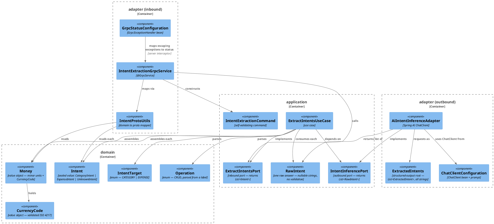
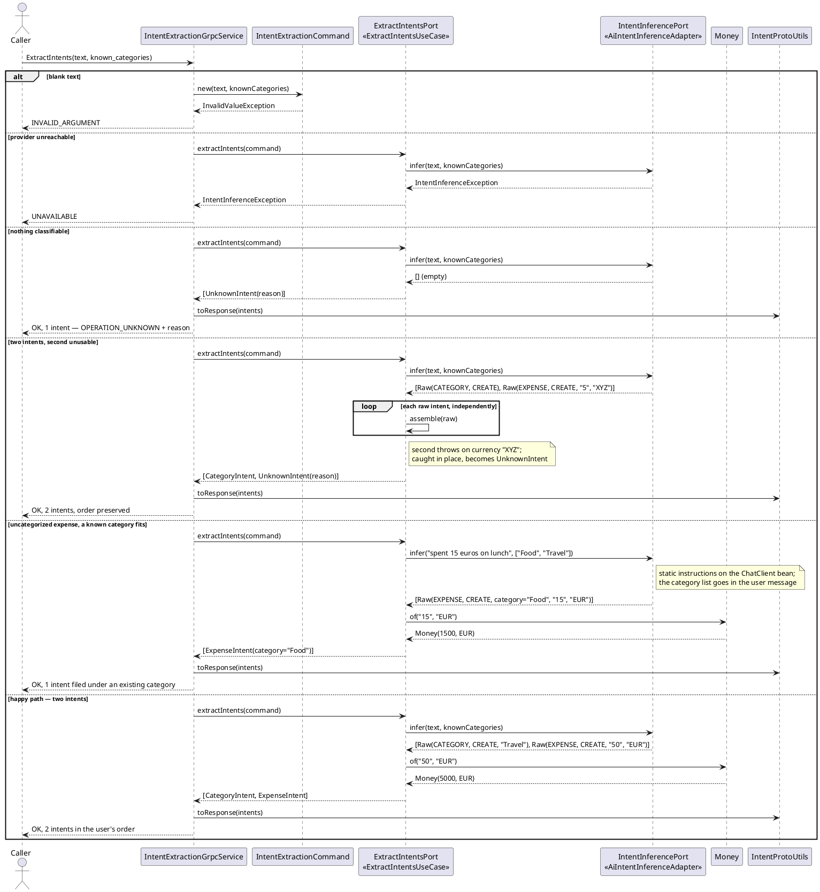

# Plan: Initialize the AI Connector Service

**Affected Modules:** `ai-connector-service`, `ledger-service`, `tools`

## Objective

Stand up a new Spring Boot service, `ai-connector-service`, that exposes a **gRPC** contract — protobuf over
HTTP/2, not REST — accepts a line of user text, and returns the structured **intents** it expresses, extracted
by an OpenAI chat model through **Spring AI 2**.

One message can carry **several** intents: *"create a Travel category and put 50 euros of taxi in it"* is a
category creation followed by an expense. The response is therefore an ordered list, not a single intent, and
**the order is the order the user expressed them** — the caller executes them in sequence, and in that example
the category must exist before the expense referencing it can be recorded.

The request also carries **the categories the user already has**, so the model can file an expense under a
fitting one when the user names none: *"spent 15 euros on lunch"* becomes an expense in `Food` if `Food` is one
of theirs. When nothing fits, the model does not invent a category silently — it emits a category creation
followed by the expense, which the ordered multi-intent response already expresses.

Two intent families are in scope, each with the full CRUD operation set:

- **category** — the user acts on an expense category;
- **expense** — the user acts on an expense.

Multiple currencies are supported, and **no monetary value is ever held in `double` or `float`** — on the wire,
in the domain, in the adapter's structured-output record, or anywhere in between.

The module also gets its own conventions set and README, matching the ones `ledger-service` already has.

## Proposed Solution

### Contract

A new Protocol Buffers schema, `ai-connector-service/src/main/proto/intent_extraction.proto`, defines one
service with one unary RPC returning a **repeated** `Intent`. Each entry carries an `Operation` plus a `oneof`
of exactly one typed payload, so a `DELETE` on a category cannot syntactically carry an amount.

**The list is ordered and never empty.** Order is the user's own order, because intents can depend on each
other — a category creation must reach the ledger before the expense that names it. Never empty because
"nothing was found" is reported as a single entry with `OPERATION_UNKNOWN` and a `reason`, not as an absence:
one code path for "here is what I understood", not two.

`UNKNOWN` is **per entry**, which is what makes a partly-understood message useful. If the user asks for three
things and the second names a currency that does not exist, the caller still gets the first and third as
actionable intents and the second as an `UNKNOWN` carrying why — instead of losing all three, or silently
receiving two and never learning something was dropped.

`known_categories` is context, not a constraint. The service does not check the returned category against it —
the caller sent the list and can compare far more cheaply than a second validation pass here could, and a
returned name that is *not* in the list is a legitimate answer, since the model is expected to propose a new
category (as its own `CREATE` intent) when none of the existing ones fit. An empty list is normal: a new user
has no categories, and the model proposes them all.

Text the model cannot classify is **not** a transport error. Only a genuine failure to reach or parse the
provider becomes a non-`OK` status.

Money crosses the wire as `int64 minor_units` plus an ISO 4217 code. `OPERATION_UNSPECIFIED = 0` is the
proto3-mandated zero value and means "never set" (a bug); `OPERATION_UNKNOWN` is a deliberate classification
outcome. The two are not interchangeable.

```proto
syntax = "proto3";

package bot.finance.ai.v1;

option java_multiple_files = true;
option java_package = "bot.finance.ai.adapter.grpc.v1";
option java_outer_classname = "IntentExtractionProto";

service IntentExtractionService {
  rpc ExtractIntents(ExtractIntentsRequest) returns (ExtractIntentsResponse);
}

message ExtractIntentsRequest {
  string text = 1;
  // The categories this user already has. May be empty. Lets the model file an expense
  // under a fitting existing category when the user did not name one.
  repeated string known_categories = 2;
}

message ExtractIntentsResponse {
  // Ordered as the user expressed them; never empty.
  repeated Intent intents = 1;
}

message Intent {
  Operation operation = 1;
  oneof payload {
    CategoryIntent category = 2;
    ExpenseIntent  expense  = 3;
  }
  // Set only when operation is OPERATION_UNKNOWN.
  string reason = 4;
}

enum Operation {
  OPERATION_UNSPECIFIED = 0;
  OPERATION_UNKNOWN     = 1;
  OPERATION_CREATE      = 2;
  OPERATION_READ        = 3;
  OPERATION_UPDATE      = 4;
  OPERATION_DELETE      = 5;
}

message CategoryIntent {
  string name = 1;
  optional string new_name = 2;
}

message ExpenseIntent {
  optional string category_name = 1;
  optional Money  amount        = 2;
  optional string description   = 3;
}

message Money {
  int64  minor_units = 1;
  string currency    = 2;
}
```

`java_package` places the generated types **inside the adapter layer** (`bot.finance.ai.adapter.grpc.v1`), so
the architecture test treats a core class referencing a protobuf message as the layer violation it is, rather
than as an unclassified dependency it would silently ignore.

Note the deliberate name collision: the proto `Intent` message and the domain `Intent` sealed interface share a
simple name. `IntentProtoUtils` is the only class that sees both, and it is exactly the case
[Imports](../ai-connector-service/docs/conventions/code-style.md#general) allows a fully qualified name for.

### Flow and layering

`IntentExtractionGrpcService` (`@GrpcService`) maps the request — its `text` and its `known_categories` — into
an `IntentExtractionCommand` and calls the `ExtractIntentsPort` inbound port. `ExtractIntentsUseCase` implements
it: it calls the `IntentInferencePort` outbound port with both, gets back a `List<RawIntent>` — each a flat
record of **nullable `String` fields** carrying one unvalidated answer — and assembles a validated domain
`Intent` from each, **independently**.

Independence is the whole design. The use case maps over the list and assembles each entry inside its own
`try`, so a bad amount in the second answer produces an `UnknownIntent` in the second position and leaves the
first and third untouched. A single try around the whole loop would discard a message's usable intents because
of one unusable one. Order is preserved throughout: `List`, never `Set`, and no sorting anywhere.

That split is also what keeps float out of the system. The adapter never builds domain objects and never parses
an amount; it hands over the model's amount as the decimal string the model produced, and
`Money.of(String, String)` parses it with `new BigDecimal(String)`. Nothing in the chain has a `double` to
round.

`AiIntentInferenceAdapter` implements the outbound port using Spring AI's `ChatClient` with structured output
against `ExtractedIntents` — a wrapper record holding `List<ExtractedIntent>`, so the JSON schema has a named
root object rather than a bare array. Every field of `ExtractedIntent` is a `String`, `amount` included, so the
schema never invites the provider to return a number. A provider or parse failure becomes an
`IntentInferenceException`, which a single `GrpcExceptionHandler` bean maps onto a gRPC status. An empty or
absent list from the model is not a failure — the use case turns it into the single `UnknownIntent` the
contract promises.

**The known categories vary per call, so they cannot live in the `ChatClient` bean's default system prompt** —
that is built once at startup, and baking a list into it would serve every user the first user's categories.
The static extraction instructions stay on the bean; the adapter renders the category list into the **user
message** of each call. This is the one place where the "built once, never rebuilt per call" rule needs stating
precisely: the *client* is built once, the *message* is not.

`Intent` is a sealed interface over `CategoryIntent`, `ExpenseIntent` and `UnknownIntent`, so
`IntentProtoUtils` maps each entry with an exhaustive switch and a fourth intent kind cannot be added without
the compiler pointing at the mapper.

### Module scaffolding

`ai-connector-service/` is an independent Gradle build, exactly as `ledger-service/` is: its own
`settings.gradle`, `gradle.properties`, `build.gradle`, wrapper, and `Dockerfile`. Base package
`bot.finance.ai`. The gRPC server listens on **1001**; Actuator's REST endpoints — health, readiness, metrics
only, no part of the contract — on **1002**. Both are HTTP: gRPC speaks HTTP/2 on Netty, Actuator speaks
HTTP/1.1 on a servlet container. They are separate ports because they are separate servers, not because one is
HTTP and the other is not.

Verified dependency facts (all checked against Maven Central and the current reference docs):

- Spring Boot **4.1.0** ships gRPC support itself — `org.springframework.boot:spring-boot-starter-grpc-server`
  and `spring-boot-starter-grpc-server-test`. Spring gRPC's own `spring-grpc-*-spring-boot-starter` artifacts
  stop at 1.0.3 and are **not** the right choice here: the 1.1.0 BOM manages only `spring-grpc-core`, because
  the starters moved into Boot 4.
- Spring AI **2.0.0** (GA, June 2026) requires Spring Boot 4.0/4.1 — BOM `org.springframework.ai:spring-ai-bom:2.0.0`,
  starter `org.springframework.ai:spring-ai-starter-model-openai`. Note the artifact id is
  `spring-ai-starter-model-openai`, **not** `spring-ai-starter-openai` (which does not exist). It resolves
  through `RestClient`, which is what makes `spring.ai.openai.base-url` sufficient to redirect the whole client
  at WireMock in tests.
- Boot 4.1.0 manages `grpc-java` 1.80.0 and `protobuf-java` 4.34.2; the `com.google.protobuf` Gradle plugin
  (0.10.0) is pinned to those same versions so codegen and runtime cannot drift.
- gRPC has **no test slice** — `spring-boot-grpc-test` provides only `@AutoConfigureTestGrpcTransport` (in-process
  transport) and `@LocalGrpcServerPort`, both used with `@SpringBootTest`. The inbound-adapter test therefore
  boots the full context and isolates by mocking the inbound port, which is stated explicitly in the module's
  testing conventions rather than left as a surprise.

### Supporting changes outside the module

`tools/agent-test.sh` is hard-coded to `ledger-service` (`module_dir="$repo_root/ledger-service"` at line 14),
and its argument parser rejects anything it does not recognize — verified: `--module ai-connector-service`
exits 2 with "Unknown option". It gains a **required** `--module <name>` option.

Mandatory rather than defaulted, deliberately. A default would make an omitted flag compile and test
`ledger-service` while the caller believed it was testing this module, and report a green summary for it — a
silent wrong answer, which is worse than an error. Requiring the flag makes that mistake impossible.

The cost is that it is a **breaking change for every existing caller**, so the same change updates them:
`ledger-service/docs/conventions/build.md` (four flagless commands) and `tools/README.md`. The permission
entries in `.claude/settings.local.json` use `:*` suffixes and are unaffected — checked.

Everything else in the script derives from `module_dir`, so the change is contained: `runs_root` (line 15), the
existence check (66), `run_dir` (106), `lock_dir` (113), and the `cd` before invoking the wrapper (214). The
lock moving under the selected module makes the queue per-module, which is what allows a run here to overlap a
run in a sibling service.

Two neighbouring files need **no** change, though both look like they would: `tools/agent-reports.gradle` is
already module-agnostic (`gradle.allprojects`, system properties only), and `tools/junit-summary.awk` filters
stack frames on `/bot\.finance/` (line 99), which `bot.finance.ai` matches — a base package outside
`bot.finance` would have silently emptied every failure summary.

Files created: the conventions set (`ai-connector-service/docs/conventions.md` + `conventions/*.md`),
`ai-connector-service/README.md`, the Gradle build files, `intent_extraction.proto`,
`AiConnectorServiceApplication`, `CurrencyCode`, `Money`, `Operation`, `IntentTarget`, `Intent`,
`CategoryIntent`, `ExpenseIntent`, `UnknownIntent`, the domain exceptions, `IntentExtractionCommand`,
`RawIntent`, `ExtractIntentsPort`, `IntentInferencePort`, `Logger`, `LoggerFactory`, `ExtractIntentsUseCase`,
`IntentExtractionGrpcService`, `IntentProtoUtils`, `GrpcStatusConfiguration`, `AiIntentInferenceAdapter`,
`ExtractedIntent`, `ExtractedIntents`, `ChatClientConfiguration`, `IntentExtractionProperties`,
`UseCaseConfiguration`, `Slf4jLogger`, `Slf4jLoggerFactory`, `CleanArchitectureTest`.
Files modified: `tools/agent-test.sh`, `tools/README.md`, `ledger-service/docs/conventions/build.md`,
`infrastructure/docker-compose.yaml`, repo-root `README.md`.

#### Diagrams





## Step-by-Step Implementation Map (To-Do List)

### Stabilization

#### API Contract

- [ ] Create `ai-connector-service/src/main/proto/intent_extraction.proto` with the schema given in
  [Proposed Solution](#contract) above — verbatim, including `java_package = "bot.finance.ai.adapter.grpc.v1"`
  and both `OPERATION_UNSPECIFIED` and `OPERATION_UNKNOWN`.
- [ ] Confirm codegen produces `IntentExtractionServiceGrpc.IntentExtractionServiceImplBase` and the message
  classes under `build/generated/source/proto/main/` — every later step compiles against these, so a codegen
  failure here is a blocker, not something a step agent works around.

#### Interface-First / Build Stabilization

New-method stubs must carry a short inline comment describing the implementation intent, for example:

```java
public Intent extractIntent(IntentExtractionCommand command) {
    // infers a raw answer through IntentInferencePort and assembles a validated Intent from it,
    // falling back to UnknownIntent when the answer cannot be mapped
    return null;
}
```

**Interface & Signature Sync**

- [ ] Create the Gradle build for `ai-connector-service/`: `settings.gradle`
  (`rootProject.name = 'ai-connector-service'`), `gradle.properties`, `build.gradle`, and the Gradle wrapper
  copied from `ledger-service/` (9.3.0). Pin in `gradle.properties`: `springBootVersion=4.1.0`,
  `springDependencyManagementVersion=1.1.7`, `springAiVersion=2.0.0`, `protobufGradlePluginVersion=0.10.0`,
  `protobufVersion=4.34.2`, `grpcVersion=1.80.0`, `awaitilityVersion=4.2.2`, `wiremockVersion=3.13.0`,
  `archunitVersion=1.4.2`, `jacocoVersion=0.8.13`, `appVersion=1.0.0`. Java toolchain 25.
- [ ] Add to `build.gradle`: the `com.google.protobuf` plugin and its `protobuf { }` block wiring
  `com.google.protobuf:protoc:${protobufVersion}` and `io.grpc:protoc-gen-grpc-java:${grpcVersion}`;
  `implementation platform("org.springframework.ai:spring-ai-bom:${springAiVersion}")`;
  `spring-boot-starter-grpc-server`, `spring-boot-starter-actuator`, `spring-boot-starter-webmvc` (Actuator
  only), `spring-boot-starter-validation`, `org.springframework.ai:spring-ai-starter-model-openai`;
  and test dependencies `spring-boot-starter-grpc-server-test`, `spring-boot-starter-webmvc-test`,
  `org.wiremock:wiremock-standalone`, `org.awaitility:awaitility`,
  `com.tngtech.archunit:archunit-junit5`, `junit-platform-launcher`. **No Testcontainers, no database
  dependency, no Flyway.**
- [ ] Create `AiConnectorServiceApplication` and a `package-info.java` for every package in the tree from
  [Architecture & Layering](../ai-connector-service/docs/conventions/architecture.md#package-structure),
  including the empty `domain/model`.
- [ ] Add `Logger` and `LoggerFactory` to `application/port`, and `Slf4jLogger` / `Slf4jLoggerFactory` to
  `adapter/logging` — ported unchanged from `ledger-service` so the two modules log identically.
- [ ] Add the two domain exceptions in `domain/exception`: `InvalidValueException` (every self-validation
  failure — command, value object, parse) and `IntentInferenceException` (the provider gave no usable answer).
  Per [Domain](../ai-connector-service/docs/conventions/code-style.md#domain) these are the only two: the gRPC
  status mapping is the sole caller that branches on the type, and it needs no finer distinction. Detail goes in
  the message, not in a new class.
- [ ] Add the domain value types with stubbed bodies: `CurrencyCode`, `Money` (`of(String, String)`,
  `amount()`), `Operation` (`fromLabel(String)`), `IntentTarget` (`fromLabel(String)`), the sealed `Intent`
  interface, and `CategoryIntent` / `ExpenseIntent` / `UnknownIntent`.
- [ ] Add `IntentExtractionCommand(String text, List<String> knownCategories)` and `RawIntent(String target,
  String operation, String categoryName, String newCategoryName, String amount, String currency,
  String description)` to `application/dto`. The command validates itself: non-blank `text`, and a
  `knownCategories` that is non-null with no null or blank element — **empty is valid**, since a new user has
  none. It defensively copies the list into an unmodifiable one, so a caller cannot mutate a constructed
  command. `RawIntent` takes no validation — see
  [Application](../ai-connector-service/docs/conventions/code-style.md#application).
- [ ] Add `extractIntents(IntentExtractionCommand): List<Intent>` to the `ExtractIntentsPort` inbound port and
  `infer(String text, List<String> knownCategories): List<RawIntent>` to the `IntentInferencePort` outbound
  port (interfaces only — the implementation stubs follow). The outbound port takes the two values, not the
  inbound command: a command is the inbound side's shape, and handing it to an outbound port would tie the two
  boundaries together for no gain. Both return `List`, never `Set` or any unordered type: the caller executes
  the intents in sequence and a reordering would break a message whose second intent depends on its first.
- [ ] Stub `ExtractIntentsUseCase.extractIntents()` and its private `assemble(RawIntent)` helper — the helper
  handles **one** raw answer, so the loop in `extractIntents()` can catch per entry.
- [ ] Stub `AiIntentInferenceAdapter.infer()`, and add `ExtractedIntent` (the per-intent structured-output
  record, every field a `String`, `amount` included) plus `ExtractedIntents` — the wrapper record holding
  `List<ExtractedIntent>` that Spring AI targets, so the derived schema has a named root object.
- [ ] Stub `IntentProtoUtils.toResponse(List<Intent>): ExtractIntentsResponse` and
  `IntentExtractionGrpcService.extractIntents(ExtractIntentsRequest, StreamObserver<ExtractIntentsResponse>)`,
  extending the generated `IntentExtractionServiceImplBase`. The mapper takes the whole list, not one intent,
  so building the repeated field stays in one place.
- [ ] Add `UseCaseConfiguration` in `adapter/config` wiring `ExtractIntentsPort` to `ExtractIntentsUseCase`, and
  `ChatClientConfiguration` in `adapter/ai` declaring the `ChatClient` bean from the injected
  `ChatClient.Builder`.
- [ ] Add `GrpcStatusConfiguration` in `adapter/grpc` declaring a
  `org.springframework.grpc.server.exception.GrpcExceptionHandler` bean (`StatusException handleException(Throwable)`,
  returning `null` for throwables it does not recognize): `InvalidValueException` → `INVALID_ARGUMENT`,
  `IntentInferenceException` → `UNAVAILABLE`. Nothing else is mapped, so an unrecognized throwable falls through
  to gRPC's own `UNKNOWN` without leaking its message. An `InvalidValueException` can only reach the handler
  from command construction — the use case catches the ones raised while assembling an intent and returns
  `UnknownIntent` instead — so the single `INVALID_ARGUMENT` mapping is unambiguous.
- [ ] Add `bot.finance.ai.architecture.CleanArchitectureTest` with five rules: the layer-dependency rule; the
  framework-agnostic core (`org.springframework..`, `jakarta..`, `org.slf4j..`, `io.grpc..`,
  `com.google.protobuf..` banned from `domain`/`application`); `coreTypesCarryNoExternalSystemName`
  (`OpenAi`, `Grpc`, `Proto`); `coreUsesNoBinaryFloatingPoint` (no `double`/`float`/`Double`/`Float` field
  in `domain`/`application`); and `adaptersReachUseCasesThroughPorts` — no class in `adapter..`, **except**
  `adapter/config..`, may depend on `application.usecase..`.

  The last rule closes a hole the layer rule leaves open: `adapter` → `application` is a legal layer
  dependency, so nothing otherwise stops an inbound adapter from injecting `ExtractIntentsUseCase` directly
  instead of `ExtractIntentsPort`. It compiles, it runs, and it quietly removes the seam the inbound port
  exists to provide. `adapter/config` is exempt because wiring the use case as a bean is precisely its job (see
  [Package Structure](../ai-connector-service/docs/conventions/architecture.md#package-structure)) — it is the
  one place a use-case class may be named.
- [ ] Get the module to build green before any test is written.

**Configuration**

- [ ] Add `src/main/resources/application.yaml`: `spring.application.name: ai-connector-service`,
  `spring.threads.virtual.enabled: true`, `spring.grpc.server.port: 1001`, `server.port: 1002` (Actuator only),
  `spring.ai.openai.api-key: ${OPENAI_API_KEY:}`, `spring.ai.openai.base-url: ${OPENAI_BASE_URL:https://api.openai.com}`,
  `spring.ai.openai.chat.model: ${OPENAI_MODEL:gpt-4o-mini}`, `spring.ai.openai.chat.temperature: 0`, and the
  same `management.*` block `ledger-service` uses.
- [ ] Add `src/main/resources/logback.xml`, ported from `ledger-service`.
- [ ] Add the static extraction instructions at `src/main/resources/prompts/extract-intents.st`, applied as the
  `ChatClient` bean's default system prompt. They must instruct the model to return **one entry per distinct
  action** the message asks for, **in the order the user expressed them**; to return the amount as a **decimal
  string** and the currency as an ISO 4217 alphabetic code; to use the target labels `category` / `expense` and
  the operation labels `create` / `read` / `update` / `delete`; and to leave every field it is unsure of absent
  rather than guessing. It must also say that a single action stays a one-entry list, so the model does not
  pad, and that a message asking for nothing yields an empty list rather than an invented intent.
- [ ] Add the per-call user-message template at `src/main/resources/prompts/user-message.st`, carrying the
  user's text **and** the known-category list. It must tell the model to prefer an existing category when one
  reasonably fits an expense the user did not categorize; to emit a `create` category entry **before** the
  expense that uses it when none fits, rather than filing the expense under an unknown name; and to treat an
  empty list as a new user with no categories yet. Keep it a distinct file from the system instructions — this
  one is rendered per call, and merging them would invite baking a user's categories into the shared bean.
- [ ] Add `IntentExtractionProperties` (`@ConfigurationProperties("ai.intent")`) in `adapter/ai` holding both
  prompt resource locations — the system instructions and the per-call user-message template — and wire it into
  `ChatClientConfiguration` and `AiIntentInferenceAdapter` so neither hard-codes a classpath path.
- [ ] Add `src/test/resources/application-test.yaml` with a dummy `spring.ai.openai.api-key` so no test depends
  on a real key being present in the environment.
- [ ] Add `ai-connector-service/Dockerfile`, ported from `ledger-service` with `EXPOSE 1001 1002`.
- [ ] Add an `ai-connector-service` entry to `infrastructure/docker-compose.yaml`: build context
  `../ai-connector-service`, ports `1001:1001` and `1002:1002`, environment `OPENAI_API_KEY`, on the `backend`
  network, with no `depends_on` (it has no database).
- [ ] Add a **required** `--module <name>` option to `tools/agent-test.sh`: derive `module_dir` from it (and
  with it `runs_root`, the run directory and the lock), exit 2 with the usage text when the flag is absent, and
  exit 2 when the name is not a directory at the repo root. No default — see
  [Supporting changes](#supporting-changes-outside-the-module) for why a default would let a run silently
  target the wrong module. Update the script's header comment (line 3) and its usage text.
- [ ] Update the four flagless invocations in `ledger-service/docs/conventions/build.md` to carry
  `--module ledger-service`. They document the only existing caller and become wrong the moment the option is
  required.
- [ ] Rewrite `tools/README.md` for two modules. It names `ledger-service` in at least five places — the
  opening sentence, the run-directory example (line 61), the "directories live under `ledger-service/build/`"
  note (line 79), a module-specific timing figure (line 138), and the raw-Gradle note (line 146) — and its
  three example commands are all flagless.
- [ ] Verify the change against the existing module before relying on it here: run
  `tools/agent-test.sh --module ledger-service --all` and confirm the suite still reports as it did, and that
  an invocation with no `--module` now fails rather than defaulting.
- [ ] Update the repo-root `README.md` services table: give the AI Connector Service its README link, port
  `1001`, and a stack of "Java, Spring Boot, Spring AI" — and note in the C2 diagram that the Ledger Service
  reaches it over gRPC, not REST.

**Shared Test Infrastructure**

- [ ] Add `bot.finance.ai.common.WireMockSupport` — the JVM-wide singleton stub server on a dynamic port, with
  `baseUrl()`. Ported from `ledger-service`'s `common/containers/WireMockSupport`, but placed directly in
  `common`: there is no container here for a `containers` package to hold.
- [ ] Add `bot.finance.ai.common.JsonUtils` and `bot.finance.ai.common.LogCapture`, ported unchanged.
- [ ] Add `bot.finance.ai.common.ChatCompletionFixtures` — text-block builders for OpenAI chat-completions
  responses. The extracted JSON must be embedded **as a string inside `choices[0].message.content`**, since
  that is what Spring AI parses; a fixture that returns the payload directly produces a failure that looks like
  a mapping bug. The embedded payload is the `{"intents":[…]}` wrapper, and the builders must take a **varargs
  or list of entries** so a test can stub zero, one, or several intents in one response — every multi-intent
  scenario below depends on it. Needed by both the AI adapter test and the system test.
- [ ] Add `bot.finance.ai.common.WireMockStubs` with `stubChatCompletion(String extractedJson)`,
  `stubChatCompletionServerError()` and `stubMalformedChatCompletion()`, all against
  `POST /v1/chat/completions` and all reached through `WireMockSupport.SERVER`, never the static DSL.
- [ ] Add `bot.finance.ai.common.IntentFixtures` — builders for a valid `Money`, `CategoryIntent`,
  `ExpenseIntent` and `RawIntent`, each parameterizable by `Operation` so a per-operation case can be built
  without hand-assembly. Needed by `IntentProtoUtilsTest`, `IntentExtractionGrpcServiceTest` and
  `ExtractIntentsUseCaseTest`.
- [ ] Add `bot.finance.ai.common.AiAdapterTest` — the composed annotation booting only
  `AiIntentInferenceAdapter`, `ChatClientConfiguration` and Spring AI's OpenAI autoconfiguration, with
  `spring.ai.openai.base-url` pointed at `WireMockSupport.baseUrl()` via `@DynamicPropertySource`. It must not
  start the gRPC server.
- [ ] Add `bot.finance.ai.common.GrpcAdapterTest` — the composed annotation combining `@SpringBootTest`,
  `@AutoConfigureTestGrpcTransport` and the `test` profile, for the inbound-adapter test.
- [ ] Add `bot.finance.ai.common.AbstractSystemTest` — boots the full application with
  `@AutoConfigureTestGrpcTransport`, points `spring.ai.openai.base-url` at the WireMock singleton, exposes the
  generated blocking stub to subclasses, and resets stubs in `@AfterEach`.
- [ ] Confirm `bot.finance.ai.architecture.CleanArchitectureTest` passes against the stabilized module.

### Red Phase

#### TDD Unit Red Phase

- [ ] `CurrencyCode` · test: `CurrencyCodeTest` · covers: `of()`
    - `of()`:
        - given: a valid ISO 4217 alphabetic code
          when: of() is called
          then: returns a currency code holding that code
        - given: a lowercase valid code
          when: of() is called
          then: the code is normalized to upper case
        - given: a code `java.util.Currency` does not recognize
          when: of() is called
          then: throws InvalidValueException
        - given: null or a blank string
          when: of() is called
          then: throws InvalidValueException
- [ ] `Money` · test: `MoneyTest` · covers: `of()`, `amount()`
    - `of()`:
        - given: "12.50" and "EUR"
          when: of() is called
          then: returns money holding 1250 minor units
        - given: "1500" and "JPY" — a zero-decimal currency
          when: of() is called
          then: returns money holding 1500 minor units, proving the exponent comes from the currency and not
          from a hard-coded 2
        - given: "12.5" and "EUR" — fewer decimals than the currency's scale
          when: of() is called
          then: returns money holding 1250 minor units
        - given: "12.505" and "EUR" — more decimals than the currency's scale
          when: of() is called
          then: throws InvalidValueException rather than rounding silently
        - given: an amount that is not a decimal number ("twelve", "1e3", "12,50", "NaN", "Infinity")
          when: of() is called
          then: throws InvalidValueException
        - given: a negative amount
          when: of() is called
          then: throws InvalidValueException
        - given: null amount or null currency code
          when: of() is called
          then: throws InvalidValueException
    - `amount()`:
        - given: money of 1250 minor units in EUR
          when: amount() is called
          then: returns a BigDecimal comparing equal to 12.50 with scale 2
        - given: money of 1500 minor units in JPY
          when: amount() is called
          then: returns a BigDecimal comparing equal to 1500 with scale 0
- [ ] `Operation` · test: `OperationTest` · covers: `fromLabel()`
    - `fromLabel()`:
        - given: each of the labels "create", "read", "update", "delete"
          when: fromLabel() is called
          then: returns the matching operation
        - given: a label differing only in case or surrounded by whitespace
          when: fromLabel() is called
          then: returns the matching operation
        - given: an unrecognized label, a blank string, or null
          when: fromLabel() is called
          then: returns an empty Optional rather than throwing
- [ ] `IntentTarget` · test: `IntentTargetTest` · covers: `fromLabel()`
    - `fromLabel()`:
        - given: the labels "category" and "expense"
          when: fromLabel() is called
          then: returns the matching target
        - given: an unrecognized label, a blank string, or null
          when: fromLabel() is called
          then: returns an empty Optional
- [ ] `CategoryIntent` · test: `CategoryIntentTest` · covers: `CategoryIntent()`
    - `CategoryIntent()`:
        - given: an operation and a non-blank name
          when: the record is constructed
          then: the intent is created
        - given: a null or blank name
          when: the record is constructed
          then: throws InvalidValueException
        - given: a null operation
          when: the record is constructed
          then: throws InvalidValueException
        - given: a null Optional for the new name
          when: the record is constructed
          then: throws InvalidValueException — an absent value is Optional.empty(), never null
        - given: operation UPDATE with no new name
          when: the record is constructed
          then: throws InvalidValueException
- [ ] `ExpenseIntent` · test: `ExpenseIntentTest` · covers: `ExpenseIntent()`
    - `ExpenseIntent()`:
        - given: an operation and all optional fields present
          when: the record is constructed
          then: the intent is created
        - given: an operation and every optional field empty
          when: the record is constructed
          then: the intent is created — an expense the model could not fully describe is still an expense intent
        - given: a null operation
          when: the record is constructed
          then: throws InvalidValueException
        - given: a null Optional in any optional position
          when: the record is constructed
          then: throws InvalidValueException
        - given: operation CREATE with no amount
          when: the record is constructed
          then: throws InvalidValueException — creating an expense without an amount is not actionable
- [ ] `UnknownIntent` · test: `UnknownIntentTest` · covers: `UnknownIntent()`
    - `UnknownIntent()`:
        - given: a non-blank reason
          when: the record is constructed
          then: the intent is created
        - given: a null or blank reason
          when: the record is constructed
          then: throws InvalidValueException — an unknown result that does not say why is not useful to the
          caller
- [ ] `IntentExtractionCommand` · test: `IntentExtractionCommandTest` · covers: `IntentExtractionCommand()`
    - `IntentExtractionCommand()`:
        - given: non-blank text and a list of category names
          when: the record is constructed
          then: the command is created and exposes both
        - given: null, empty, or whitespace-only text
          when: the record is constructed
          then: throws InvalidValueException
        - given: non-blank text and an empty category list
          when: the record is constructed
          then: the command is created — a new user has no categories, and that is not an error
        - given: a null category list
          when: the record is constructed
          then: throws InvalidValueException — absence is the empty list, never null
        - given: a category list containing a null or blank element
          when: the record is constructed
          then: throws InvalidValueException
        - given: a mutable category list used to construct the command
          when: that list is modified afterwards
          then: the command's list is unchanged, and attempting to modify the command's own list throws
- [ ] `ExtractIntentsUseCase` · test: `ExtractIntentsUseCaseTest` · covers: `extractIntents()`
    - `extractIntents()`:
        - given: the mocked port returns one raw expense answer with target "expense", operation "create",
          amount "15.00" and currency "EUR"
          when: extractIntents() is called
          then: returns a single ExpenseIntent with operation CREATE and money of 1500 minor units, and the
          port was called with **both** the command's text and its known categories
        - given: a command carrying an empty known-category list
          when: extractIntents() is called
          then: the port is called with an empty list — not null, and the call is not skipped
        - given: the mocked port returns an expense answer naming a category that was **not** in the command's
          known categories
          when: extractIntents() is called
          then: the ExpenseIntent carries that name unchanged — the use case does not check the answer against
          the list, because proposing a new category is a legitimate outcome
        - given: the mocked port returns one raw category answer with target "category" and operation "delete"
          when: extractIntents() is called
          then: returns a single CategoryIntent with operation DELETE and the given name
        - given: the mocked port returns a raw category creation followed by a raw expense creation
          when: extractIntents() is called
          then: returns both, as a CategoryIntent then an ExpenseIntent — **in that order**
        - given: the mocked port returns three raw answers whose targets are expense, category, expense
          when: extractIntents() is called
          then: the returned list has the same size and the same order as the port's list, position by position
        - given: the mocked port returns a valid category answer, an expense answer with an unknown currency,
          and a valid expense answer
          when: extractIntents() is called
          then: returns three intents — CategoryIntent, UnknownIntent, ExpenseIntent — so one unusable answer
          neither drops its neighbours nor shifts their positions
        - given: the mocked port returns an answer whose target is null or unrecognized
          when: extractIntents() is called
          then: that position holds an UnknownIntent whose reason names the unrecognized target
        - given: the mocked port returns an answer whose operation is unrecognized
          when: extractIntents() is called
          then: that position holds an UnknownIntent whose reason names the unrecognized operation
        - given: the mocked port returns an expense answer whose amount is not a decimal number
          when: extractIntents() is called
          then: that position holds an UnknownIntent rather than propagating InvalidValueException — a bad
          answer is a classification outcome, not a fault
        - given: the mocked port returns an expense answer with an amount but no currency
          when: extractIntents() is called
          then: that position holds an UnknownIntent — a bare number is not money
        - given: the mocked port returns an empty list
          when: extractIntents() is called
          then: returns exactly one UnknownIntent with a non-blank reason — the contract's never-empty
          guarantee
        - given: the mocked port returns null
          when: extractIntents() is called
          then: returns exactly one UnknownIntent
        - given: the mocked port returns a list containing a null element
          when: extractIntents() is called
          then: that position holds an UnknownIntent and the surrounding entries are unaffected
        - given: the mocked port throws IntentInferenceException
          when: extractIntents() is called
          then: the exception propagates — a provider failure is not an unknown intent
        - given: a null command
          when: extractIntents() is called
          then: throws InvalidValueException and the port is never called
- [ ] `IntentProtoUtils` · test: `IntentProtoUtilsTest` · covers: `toResponse()`
    - `toResponse()`:
        - given: a single ExpenseIntent with operation CREATE and money of 1500 minor units in EUR
          when: toResponse() is called
          then: the response holds one intent carrying OPERATION_CREATE, the expense payload, `minor_units`
          1500 and currency "EUR"
        - given: an ExpenseIntent whose optional fields are all empty
          when: toResponse() is called
          then: the expense payload is selected and no optional field reports presence
        - given: a single CategoryIntent with operation UPDATE and a new name
          when: toResponse() is called
          then: the response holds one intent carrying OPERATION_UPDATE, the category payload, and the new name
        - given: a single UnknownIntent
          when: toResponse() is called
          then: the response holds one intent carrying OPERATION_UNKNOWN, the reason, and no payload set in
          the oneof
        - given: a list of CategoryIntent, UnknownIntent, ExpenseIntent
          when: toResponse() is called
          then: the response holds three intents in that same order, each with its own operation and payload
        - given: each Operation enum constant in turn, paired with an intent valid for it (a per-operation
          fixture — `CategoryIntent` requires a new name for UPDATE, `ExpenseIntent` an amount for CREATE)
          when: toResponse() is called
          then: the matching proto Operation is set, and OPERATION_UNSPECIFIED is never produced

#### TDD Integration Red Phase

- [ ] `AiIntentInferenceAdapter` · test: `AiIntentInferenceAdapterTest` · covers: `infer()`
    - `infer()`:
        - given: the provider is stubbed to return one extracted expense entry
          when: infer() is called
          then: returns a single RawIntent carrying the entry's fields verbatim, with the amount still the
          decimal string the provider sent
        - given: the provider is stubbed to return three extracted entries — category, expense, category
          when: infer() is called
          then: returns three RawIntents in the same order the provider listed them
        - given: the provider is stubbed to return an entry with several fields absent
          when: infer() is called
          then: those RawIntent fields are null and no exception is thrown — the adapter validates nothing
        - given: the provider is stubbed to return an empty `intents` array
          when: infer() is called
          then: returns an empty list, not null and not an exception — deciding what emptiness means belongs
          to the use case
        - given: the provider is stubbed to return an extracted category entry
          when: infer() is called
          then: the request WireMock received names the configured model and carries the user's text, and the
          JSON schema it sent declares `intents` as an array whose entries' `amount` is a string, not a number
        - given: known categories "Food" and "Travel"
          when: infer() is called
          then: the request WireMock received carries both names in a **user** message, and the system message
          is the static instructions with no category in it
        - given: infer() is called once with categories "Food", then again with categories "Travel"
          when: both requests are inspected
          then: the second request carries "Travel" and not "Food" — proving the per-call list is not baked
          into the shared `ChatClient` bean
        - given: an empty known-category list
          when: infer() is called
          then: a well-formed request is still sent and the response parses — an empty list is rendered, not
          omitted in a way that breaks the template
        - given: the provider responds 500
          when: infer() is called
          then: throws IntentInferenceException, not a Spring AI or HTTP client exception
        - given: the provider responds 200 with a body Spring AI cannot parse into the structured record
          when: infer() is called
          then: throws IntentInferenceException
- [ ] `IntentExtractionGrpcService` · test: `IntentExtractionGrpcServiceTest` ·
  covers: `IntentExtractionService.ExtractIntents` · mocks: `ExtractIntentsPort`
    - Happy Path:
        - given: the mocked port returns a single ExpenseIntent with operation CREATE and money of 1500 minor
          units in EUR
          when: ExtractIntents is called over the in-process transport with a valid text and two known
          categories
          then: the port is called with a command carrying that text **and both category names in order**, and
          the response holds one intent with OPERATION_CREATE, `minor_units` 1500 and currency "EUR"
        - given: a request with no `known_categories` — the proto3 default, an empty repeated field
          when: ExtractIntents is called
          then: the port is called with a command holding an empty list, never null, and the RPC succeeds
        - given: the mocked port returns a CategoryIntent followed by an ExpenseIntent
          when: ExtractIntents is called
          then: the response holds two intents in that order, each with its own payload set in the oneof
        - given: the mocked port returns a single UnknownIntent
          when: ExtractIntents is called
          then: the RPC completes with status OK carrying one intent with OPERATION_UNKNOWN and the reason —
          unknown is never a non-OK status
    - Error Mapping:
        - given: the mocked port throws IntentInferenceException
          when: ExtractIntents is called
          then: fails with status UNAVAILABLE
        - given: the mocked port throws a RuntimeException the handler does not recognize
          when: ExtractIntents is called
          then: fails with status UNKNOWN, and the exception's message does not appear in the status
          description — the handler returns null for it rather than mapping it
    - Validation: `text` — absent (the proto3 default empty string) and whitespace-only both fail with
      INVALID_ARGUMENT, and the port is never called; `known_categories` — an entry that is blank fails with
      INVALID_ARGUMENT, while an empty list is accepted

#### TDD System Test Red Phase

- [ ] `ExtractIntentsSystemTest` · covers: `IntentExtractionService.ExtractIntents`
    - Happy Path:
        - given: the provider is stubbed to extract an expense of 15.00 EUR in a "lunch" category
          when: ExtractIntents is called with "spent 15 euros on lunch"
          then: returns OK with one intent — OPERATION_CREATE, the expense payload, `minor_units` 1500 and
          currency "EUR"
        - given: the provider is stubbed to extract a "Travel" category creation followed by a 50 EUR taxi
          expense
          when: ExtractIntents is called with "create a Travel category and put 50 euros of taxi in it"
          then: returns OK with two intents — the category creation first, the expense second — proving the
          whole stack carries a multi-intent answer through in the user's order
        - given: known categories "Food" and "Travel", and the provider stubbed to file the expense under
          "Food"
          when: ExtractIntents is called with "spent 15 euros on lunch", naming no category
          then: returns OK with an expense whose category is "Food", and the request the provider received
          carried both category names — proving the list reaches the model end to end
        - given: the provider is stubbed to return an empty `intents` array
          when: ExtractIntents is called with "what is the weather"
          then: returns OK with exactly one intent carrying OPERATION_UNKNOWN and a non-empty reason
    - Unhappy Path:
        - given: the provider is stubbed to respond 500
          when: ExtractIntents is called with a valid text
          then: fails with status UNAVAILABLE

### Green Phase

#### TDD Unit Green Phase

- [ ] `CurrencyCode` · test: `CurrencyCodeTest`
- [ ] `Money` · test: `MoneyTest` · after: `CurrencyCode`
- [ ] `Operation` · test: `OperationTest`
- [ ] `IntentTarget` · test: `IntentTargetTest`
- [ ] `CategoryIntent` · test: `CategoryIntentTest` · after: `Operation`
- [ ] `ExpenseIntent` · test: `ExpenseIntentTest` · after: `Operation`, `Money`
- [ ] `UnknownIntent` · test: `UnknownIntentTest`
- [ ] `IntentExtractionCommand` · test: `IntentExtractionCommandTest`
- [ ] `ExtractIntentsUseCase` · test: `ExtractIntentsUseCaseTest` · after: `Money`, `Operation`, `IntentTarget`,
  `CategoryIntent`, `ExpenseIntent`, `UnknownIntent`, `IntentExtractionCommand`
- [ ] `IntentProtoUtils` · test: `IntentProtoUtilsTest` · after: `Money`, `CategoryIntent`, `ExpenseIntent`,
  `UnknownIntent`

#### TDD Integration Green Phase

- [ ] `AiIntentInferenceAdapter` · test: `AiIntentInferenceAdapterTest`
- [ ] `IntentExtractionGrpcService` · test: `IntentExtractionGrpcServiceTest` ·
  covers: `IntentExtractionService.ExtractIntents` · mocks: `ExtractIntentsPort` ·
  after: `IntentProtoUtils`, `IntentExtractionCommand`

#### TDD System Test Green Phase

- [ ] `ExtractIntentsSystemTest` · covers: `IntentExtractionService.ExtractIntents`

## Open Questions / Blockers

- Q: The `.proto` currently lives only in `ai-connector-service/src/main/proto/`. When `ledger-service` starts
  calling this service it will need the same schema to generate its client stubs — should the schema move to a
  shared location (a repo-root `proto/` directory both builds read), or should `ledger-service` keep its own
  copy? This plan assumes it stays put and the question is settled when the caller lands.
- A: yes, a shared location is preferred.

- Q: Actuator is included, which adds a second server — a servlet container on port 1002 — purely for
  health/readiness/metrics over REST. Spring gRPC also exposes a gRPC health service
  (`spring.grpc.server.health.enabled`, on by default). Keep Actuator's REST surface for metrics parity with
  `ledger-service`, or drop `spring-boot-starter-webmvc` and run a single-server process with gRPC health
  checks only? This plan assumes Actuator stays.
- A: what is the industry standard for spring boot grpc health checks?

- Q: `ExpenseIntent` is planned to reject a CREATE with no amount, and `CategoryIntent` to reject an UPDATE with
  no new name — turning an under-specified answer into an `UnknownIntent` the caller must handle. The
  alternative is to accept partial intents and let `ledger-service` decide whether to ask the user for the
  missing piece. Which behaviour do you want?
- A: I would reject them and map the error message. 

- Q: What should happen when the user's text names an amount with no currency at all ("spent 15 on lunch")?
  This plan returns `UnknownIntent`. The alternatives are a configured default currency in this service, or
  returning the expense with the amount absent and letting the caller apply the user's default.
- A: yes, we can have a default currency as a parameter (grpc interface).

- Q: `gpt-4o-mini` is set as the default model via `OPENAI_MODEL`. Confirm that is the model you want, and
  whether `temperature: 0` is right for extraction (it makes the same text extract the same way, at the cost of
  never varying phrasing — which for structured extraction is what you want).
- A: yes.

- Q: Should the number of intents returned from one message be capped? Nothing currently bounds it: a long or
  adversarial message could make the model emit dozens of entries, and every one of them becomes work the
  ledger service executes. A configured maximum (say 10) could either truncate the list or replace the whole
  answer with a single `UNKNOWN`. This plan applies no cap.
- A: no cap, I think we can limit the telegram message size.

- Q: Should `known_categories` be capped, and what happens past the cap? Every name goes into the prompt, so a
  user with hundreds of categories inflates cost and latency on each call and eventually hits the context
  window. Options: reject past a limit with `INVALID_ARGUMENT`, truncate silently, or let the caller decide
  what to send. This plan applies no limit.
- A: no limit, but it will be applied in the ledger's service. 

- Q: `known_categories` is a bare `repeated string`. If the ledger service ever needs the model's choice
  resolved back to a category **id** rather than matched by name, the field has to become a message. Names now
  is the smaller contract and matching by name is the caller's job — confirm that is right, or say so now while
  the schema has no released consumers.
- A: I think we can keep it as a string.

- Q: When two intents in one message conflict or duplicate — "delete the Travel category" twice, or a category
  deletion followed by an expense filed under that same category — does this service detect it, or is
  consistency the caller's problem? This plan does neither: intents are assembled independently and no entry is
  compared against another, so the ledger service sees the contradiction first.
- A: it's ledger's job.

## Review Findings

- Finding: The plan omits the `## Test Layer Mapping` section that `plan-task.md`'s **3. Plan Structure** lists
  as required. (The bundled `.claude/templates/example-plan.md` also omits it, so this may be a template
  inconsistency rather than a plan defect — but the two disagree and one of them should be corrected.)
- Action: test layer mapping is not the part of the plan, it's part of the skill. Maybe it's missplaced in the skill. Let's consider adjusting it. 

- Finding: Conventions conflict over who rejects blank request text.
  `ai-connector-service/docs/conventions/code-style.md` (Application) states that a caller mapping external
  input into a command "must check its own preconditions **before** constructing it, so that unusable input
  takes that caller's normal rejection path instead of surfacing as an exception from the record". The plan does
  the opposite: `GrpcStatusConfiguration` maps `InvalidExtractionRequestException` → `INVALID_ARGUMENT`
  (Stabilization) and `IntentExtractionGrpcServiceTest`'s `Validation:` line relies on that mapping firing. Only
  one can be right — either `IntentExtractionGrpcService` validates `text` itself and calls
  `onError(Status.INVALID_ARGUMENT…)` (making the exception mapping dead code), or the convention is amended to
  say the record's exception *is* the adapter's rejection path. Left unresolved, the two red-phase steps that
  touch this will each pick a different answer.
- Action: let's with the convention. 

- Finding: Two `ExpenseIntent` scenarios contradict each other (`TDD Unit Red Phase` → `ExpenseIntent()`).
  "given: an operation and every optional field empty / then: the intent is created" cannot hold at the same
  time as "given: operation CREATE with no amount / then: throws InvalidIntentException" unless the first
  scenario explicitly names a non-CREATE operation. As written, a step agent can satisfy one only by breaking
  the other.
- Action: but the second test means it is a mandatory field, not optional, isn't? 

- Finding: The `IntentProtoUtilsTest` parameterized scenario "given: each Operation enum constant in turn" is
  not satisfiable with a single fixture. `CategoryIntent` rejects `UPDATE` without a new name and
  `ExpenseIntent` rejects `CREATE` without an amount (both per this plan's own unit scenarios), so the
  parameterized case needs a per-operation fixture. The scenario does not say that, and `IntentFixtures` as
  specified provides one valid instance of each intent, not one per operation.
- Action: what do you suggest? 

- Finding: `after: Operation` on the `CategoryIntent` and `ExpenseIntent` green-phase steps is a false
  dependency. `Operation`'s only green-phase behaviour is `fromLabel()`; the enum constants those two tests
  construct with exist as soon as the type does. The marker serializes three steps that could run in parallel.
  `after: Money` on `ExpenseIntent` and `after: CurrencyCode` on `Money` are real and should stay.
- Action: agree.

- Finding: No step creates the gRPC client stub every inbound test enters through. `IntentExtractionGrpcServiceTest`
  and `ExtractIntentSystemTest` both call `ExtractIntent` over the transport, but neither the **Shared Test
  Infrastructure** bullets nor the step bodies name the mechanism — `@ImportGrpcClients(types = …BlockingStub.class)`
  plus autowiring, versus building a stub from an injected `GrpcChannelFactory`. Per `plan-task.md`'s
  shared-fixture rule this belongs in stabilization with exactly one owner; as it stands two parallel red-phase
  steps will invent it twice, differently.
- Action: yes, it should belong to the stabilization step. 

- Finding: The system tests enter over the in-process transport, which replaces the very wiring they exist to
  prove. `@AutoConfigureTestGrpcTransport` swaps out the Netty server factory, so nothing in the suite
  demonstrates that the service binds port 1001 or serves a real channel — and `spring.grpc.server.port` is
  therefore never exercised. `spring-boot-grpc-test` ships `@LocalGrpcServerPort` for a real-transport run;
  consider using it for `ExtractIntentSystemTest` while keeping in-process for the adapter test. Note this also
  requires amending `ai-connector-service/docs/conventions/testing.md`, which currently prescribes in-process
  for both.
- Action: Good idea, you will need to adjust hte plan. 

- Finding: The `coreUsesNoBinaryFloatingPoint` architecture rule enforces less than
  `architecture.md`'s Money section claims. ArchUnit's `fields()` syntax catches declared fields (record
  components included) but not a `double` parameter, local variable, or method return type in
  `domain`/`application` — yet the conventions say money is never held in `double` "not as a field, not as a
  local, not as an intermediate in a conversion". Either add a members-based rule (e.g. over method return
  types and parameter types) or narrow the conventions wording so the document does not promise an
  unenforced guarantee.
- Action: I didn't want it to become a convention in the first place. It was an instruciton on how to creation the money class for the plan not the convention. 

- Finding: `spring-boot-starter-webmvc-test` is listed in the build's test dependencies but nothing in the plan
  uses it — there is no web layer, no controller, and no Actuator assertion anywhere in the three test phases.
  Drop it, or add the health-endpoint coverage that would justify keeping it.
- Action: let's test the health endpoint. 

- Finding: The `tools/README.md` update is scoped as a single sub-clause but that file is coupled to
  `ledger-service` in at least five places: its opening sentence ("the single entry point for compiling and
  testing `ledger-service`"), the run-directory example at line 61, the "directories live under
  `ledger-service/build/`" note at line 79, a module-specific timing figure at line 138 ("the whole suite takes
  about 28 seconds"), and the raw-Gradle note at line 146. Verified against the file. Sizing this as a token
  edit will leave the document wrong for both modules.
- Action: don't understand your point.

- Finding: `IntentExtractionProperties` is created under **Configuration** but no step consumes it — the
  `ChatClientConfiguration` bullet describes loading the prompt without referencing the properties record, and
  no test asserts the prompt resource is resolved from configuration. Either wire it explicitly in the
  `ChatClientConfiguration` bullet or drop it and load the prompt with `@Value("classpath:prompts/extract-intent.st")`.
- Action: I would rather have a property than a value annotation. 

- Finding: Coverage-balance and existing-test-update rules were checked and are **not applicable** — verified
  that `ai-connector-service/src/` does not exist, so no listed scenario can duplicate an existing test and no
  existing assertion can be left incomplete by this change. Recorded so the check is known to have run rather
  than been skipped. Placement note: the repo-root `README.md` update currently sits in Stabilization →
  Configuration though it is post-implementation documentation; harmless, but it is the one item in that
  sub-group that no red-phase test depends on.
- Action: okay, good boy. 
