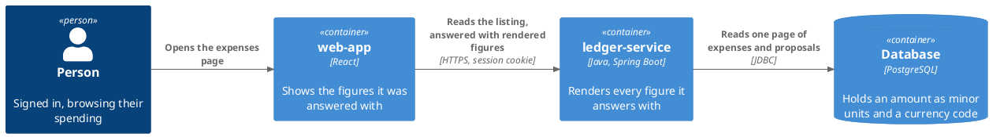
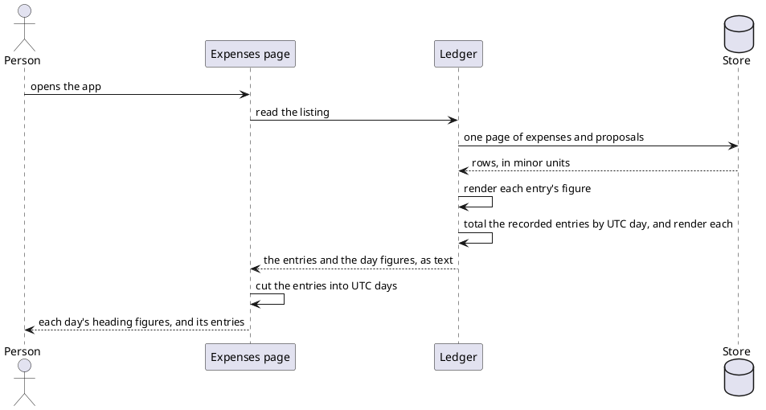
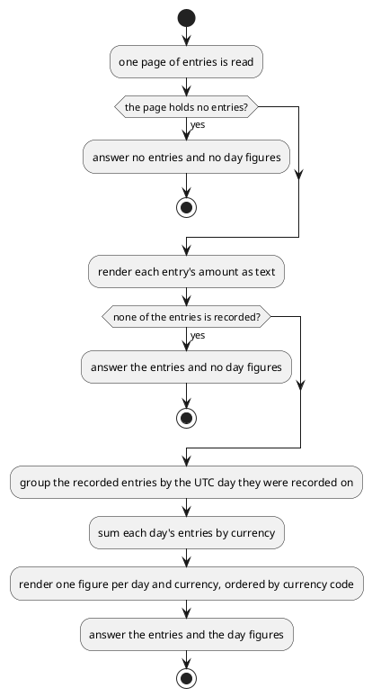

# Design: Money Crosses the Browse API as Rendered Text

**Affected Modules:** `ledger-service`, `web-app`

The two modules share one artifact: [`openapi/ledger-api.yaml`](../../openapi/ledger-api.yaml) and the schema file
it references, [`openapi/components/schemas/expense.yaml`](../../openapi/components/schemas/expense.yaml). The
ledger generates its endpoints from it and the web app generates its response types from it, both at build time.
The schema is implemented on its own, before either module's work.

## Objective

The web app renders an amount as `amountMinorUnits / 100`. That is wrong for every currency whose minor unit is
not a hundredth — 900 JPY reads as `¥9.00`. The divisor is a guess the wire never gave it.

The ledger already knows each currency's scale. It should render the figure and answer the text, so no consumer
has to guess. The web app then shows what it was given and does no arithmetic on money at all.

## Context

The scale already lives in the domain. [`Money`](../../ledger-service/src/main/java/bot/finance/domain/value/Money.java)
holds minor units and a currency, and `amount()` scales them by that currency's own decimal places
([ADR 0011](../../ledger-service/docs/adr/0011-the-amount-is-scaled-to-minor-units-in-the-domain.md)).

The ledger already renders money for a person on one interface. `TurnReportRenderer` writes a Telegram reply as
`amount()` followed by the ISO code — `ledger-service/src/main/java/bot/finance/adapter/telegram/TurnReportRenderer.java:141`.
The MCP answer does the same at `ExpenseProposalToolMapper.java:51`. The browse API is the one surface that hands
out raw minor units.

On the other side, `web-app/src/components/ExpenseDaySection.tsx:11` divides by 100, and
`web-app/src/components/expenseDays.ts:37-46` sums minor units to build each day's figure. Those two are the
whole of the web app's money handling, and the second is why removing the field is not a one-line change.

The behaviour on screen is fixed by [Browse recorded expenses](../../web-app/docs/usecases/browse-recorded-expenses.md),
and the ledger's side by [Browse a person's expenses](../../ledger-service/docs/usecases/browse-expenses.md).

## Proposed Solution

An entry's `amountMinorUnits` and `currency` become two rendered fields: `amount`, the digits, and `currency`,
the label that names the currency. Both arrive ready to show, and they arrive apart, so a caller that wants one
without the other takes it as a field rather than cutting a string.

The page grows `dayTotals` — the recorded spend of each UTC day the page covers, one rendered figure per
currency. The web app cannot sum text, and the day headings need those figures, so the ledger answers them. The
page itself stays a flat list of entries with its `limit`, `offset` and `total`, so the pager is untouched.

No money crosses this API as a number any more, and the web app parses none of it.

### Diagrams



The crossing between the two modules is the listing's answer, and its shape is the shared schema's.





### Details

#### The shared schema

Everything below lands in one place: the 200 body of `GET /api/v1/expenses`, the `listExpenses` operation
(`openapi/paths/expenses.yaml:22`). No endpoint is added, and the page still makes the one call it makes today.
`ExpensePage` is that body, and `dayTotals` is a new field on it, beside the four it already has:

```
ExpensePage                 <- the 200 body of GET /api/v1/expenses
  items:     [ Expense ]        each entry, now carrying `money`
  limit, offset, total          unchanged
  dayTotals: [ DayTotal ]       new — one per UTC day the page covers

Expense.money   -> RenderedMoney       { amount, currency, separator }
DayTotal        -> { day, amounts: [ RenderedMoney ] }
```

`amountMinorUnits` is dropped, and `amount` and `currency` become the two halves of one rendered figure. Both
live in a schema of their own, so an entry and a day total carry the same shape:

```yaml
RenderedMoney:
  type: object
  description: >-
    One figure, rendered for a reader and answered in parts. A caller shows each part as given, joins them as
    `currency` + `separator` + `amount`, and parses none of them.
  properties:
    amount:
      type: string
      description: >-
        The digits alone, grouped and at this currency's own scale. It never carries the currency.
    currency:
      type: string
      description: >-
        The label that names this currency to an English reader. A symbol where the currency has one, and its
        ISO 4217 code where it does not. Never a key to match on — a key is what `currencyCode` would be, and
        nothing needs one yet.
    separator:
      type: string
      description: >-
        What goes between the label and the digits, so a caller decides nothing. Empty where the two read
        together, a single space where they do not.
  required:
    - amount
    - currency
    - separator
  example:
    amount: '1,245.00'
    currency: 'CHF'
    separator: ' '
```

`Expense` gains a required `money`, of that schema, in place of the two fields it drops. Its `example` becomes
`money: { amount: '12.50', currency: '€', separator: '' }`.

`ExpensePage` — the listing's 200 body — gains a required `dayTotals`, an array of a second new schema in the
same file. One element per UTC day the answered page covers, newest first:

```yaml
DayTotal:
  type: object
  description: What one UTC day of this page recorded, rendered for a reader.
  properties:
    day:
      type: string
      format: date
      description: The UTC day the entries were recorded on.
    amounts:
      type: array
      description: >-
        That day's recorded spend within this page, one figure per currency, ordered by currency code. Nothing is
        converted between currencies.
      items:
        $ref: '#/RenderedMoney'
  required:
    - day
    - amounts
  example:
    day: '2026-01-14'
    amounts:
      - amount: '12.50'
        currency: '€'
        separator: ''
```

#### `ledger-service` — what the listing answers

The digits are grouped, at that currency's own scale — `12.50`, `900`, `1,245.00`. The label is that currency's
English symbol where it has one, and its ISO code where it does not — `€`, `¥`, `CHF` (D29). The separator is
what English puts between the two: empty after a symbol, a space after a code. All three come from the JVM's
English rendering of that currency.

| The answer holds  | Covers                                                            | Absent when                                     |
|-------------------|-------------------------------------------------------------------|-------------------------------------------------|
| `money`           | one entry, pending or recorded                                    | never — every entry carries one                 |
| `dayTotals[].day` | one UTC day of `createdAt`, newest first                          | that day has no recorded entry on this page     |
| `amounts`         | that day's recorded entries **on this page**, summed per currency | —                                               |

| Invariant                                                                                   |
|---------------------------------------------------------------------------------------------|
| `amount` carries digits only. No symbol, no code, no space to cut on.                        |
| `currency` carries the label only, and is never empty.                                       |
| `separator` is the only one of the three that may be empty, and is never more than one space. |
| A pending entry carries a `money` but never counts towards a `dayTotal`.                     |
| A figure covers only the entries on the answered page, so a day split by the page boundary is figured on each. |
| Nothing is converted between currencies. Two currencies in a day are two figures.            |
| Every caller gets the same rendering, in English. The ledger negotiates no locale, and the request offers none. |

The listing's refusals are unchanged. Nothing here alters what an invalid filter, an unknown identity, or a
storage failure answers.

#### `web-app` — what the screen does

`Intl.NumberFormat` with `style: 'currency'` leaves the module. Date formatting on the day heading stays as it is.

| The screen                                                            | From                                             |
|------------------------------------------------------------------------|--------------------------------------------------|
| An entry's figure                                                      | `currency` + `separator` + `amount`, in that order |
| A day heading's figures, one line per currency                         | that day's `dayTotals` entry, joined the same way |
| A day heading with no figure, when the day holds only pending entries  | no `dayTotals` entry for it                      |

The join is the whole of the screen's money logic: three fields in a fixed order, nothing inserted and nothing
inspected. Each day figure is keyed by its position in `amounts`, not by its label (D31).

An entry's amount column loses its fixed width and never wraps (D21). It stays right-aligned and last in its
row, so amounts remain flush to the row's right edge.

The page is still cut into UTC days in the browser, by the UTC day of `createdAt` — the same key the ledger
totals by. The entry count and the awaiting count stay the browser's, since both are counts of what it already
holds.

#### Documentation this change invalidates

| Document                                                                                                   | What changes                                                            |
|--------------------------------------------------------------------------------------------------------------|---------------------------------------------------------------------------|
| [`ledger-service/docs/contracts/in/web-browse-api.md`](../../ledger-service/docs/contracts/in/web-browse-api.md) | **Semantics** gains that money crosses as text and is never parsed      |
| [`ledger-service/docs/usecases/browse-expenses.md`](../../ledger-service/docs/usecases/browse-expenses.md)       | **Out** gains each UTC day's recorded figures                           |
| [`web-app/docs/usecases/browse-recorded-expenses.md`](../../web-app/docs/usecases/browse-recorded-expenses.md)   | the day-figure rules move to the ledger; the ledger is now asked to total |
| [`web-app/docs/contracts/out/ledger-browse-api.md`](../../web-app/docs/contracts/out/ledger-browse-api.md)       | **What It Does With the Answer** — figures are shown as answered        |

## Acceptance Scenarios

### The listing, `GET /api/v1/expenses`

- **A1:** an amount in a currency with two decimal places
  - Given: a recorded expense of 1250 minor units in EUR
  - When: the caller reads the listing
  - Then: the entry's `money` reads `amount: 12.50`, `currency: €`, `separator:` empty, and no minor-unit field
    is answered

- **A2:** an amount in a currency with no decimal places
  - Given: a recorded expense of 900 minor units in JPY
  - When: the caller reads the listing
  - Then: the entry's `money` reads `amount: 900`, `currency: ¥`, `separator:` empty

- **A3:** an amount past a thousand
  - Given: a recorded expense of 124500 minor units in EUR
  - When: the caller reads the listing
  - Then: the entry's `money` reads `amount: 1,245.00`, `currency: €`, and the digits carry no symbol

- **A4:** a currency English has no symbol for
  - Given: a recorded expense of 124500 minor units in CHF
  - When: the caller reads the listing
  - Then: the entry's `money` reads `amount: 1,245.00`, `currency: CHF`, `separator:` one space

- **A5:** a day with two currencies
  - Given: two recorded expenses on the same UTC day, one in EUR and one in JPY
  - When: the caller reads the listing
  - Then: that day's `dayTotals` entry holds two figures, each with its own label, ordered by currency code

- **A6:** a day holding only pending entries
  - Given: one UTC day whose every entry is a pending proposal, and another day with a recorded expense
  - When: the caller reads the listing
  - Then: `dayTotals` holds an entry for the second day only, and each pending entry still carries its `money`

- **A7:** a day split by the page boundary
  - Given: one UTC day holding more recorded expenses than the page size
  - When: the caller reads the first page and then the second
  - Then: each answer's figure for that day covers only the entries it answered

- **A8:** the filter matches nothing
  - Given: a filter no row matches
  - When: the caller reads the listing
  - Then: no entries, no `dayTotals`, and the real total

- **A9:** the page holds only pending entries
  - Given: a filter matching pending proposals only
  - When: the caller reads the listing
  - Then: the entries are answered with their figures, and `dayTotals` is empty

### The expenses page

- **A10:** an entry's figure reaches the screen unchanged
  - Given: the ledger answers an entry whose `money` is `amount: 900`, `currency: ¥`, `separator:` empty
  - When: the person opens the page and expands that day
  - Then: the row shows `¥900` — the three parts joined in order, character for character

- **A11:** a figure whose label is a code
  - Given: the ledger answers an entry whose `money` is `amount: 1,245.00`, `currency: CHF`, `separator:` one space
  - When: the person opens the page and expands that day
  - Then: the row shows `CHF 1,245.00`, with the one space the ledger answered and no other

- **A12:** a day heading shows the figures it was answered
  - Given: the ledger answers a day whose figures join to `€12.50` and `¥900`
  - When: the person opens the page
  - Then: that day's heading shows both, one per line, in the order answered

- **A13:** a day with no figure
  - Given: the ledger answers a day of entries but no `dayTotals` entry for it
  - When: the person opens the page
  - Then: the heading shows the day, its count and its awaiting badge, and no figure

- **A14:** a figure wider than the old column
  - Given: the ledger answers an entry whose figure joins to `€124,500.00`, beside an entry with a long
    description
  - When: the person opens the page and expands that day
  - Then: the figure shows on one line, flush right, and the description truncates instead

- **A15:** a read that fails
  - Given: the listing read is refused
  - When: the person opens the page
  - Then: what happens is what [Browse recorded expenses](../../web-app/docs/usecases/browse-recorded-expenses.md)
    already says, unchanged by this design

## Decisions

- **D1:** What replaces `amountMinorUnits` and `currency` on an entry?
  - Answer: One required `money` object holding two rendered strings — `amount`, the digits, and `currency`, the
    label. The minor units are gone. The two parts are answered apart, never as one joined string.
  - Basis: decided — the user asked for the backend to render money, and then for the label and the digits to
    arrive as separate fields, so a caller can show one without the other and no client ever needs a parser
    (2026-08-09).

- **D2:** How does a figure read?
  - Answer: Grouped digits at that currency's own scale, and the currency's symbol as the label, both rendered in
    English — `12.50` and `€`, `900` and `¥`. Joined label-first by the screen, a reader sees exactly what they
    see today. The symbol and the separators come from the JVM's currency data rather than the browser's, so a
    currency whose two sources disagree renders slightly differently from today.
  - Basis: decided — the user chose the symbol-prefixed grouped form over the ISO-code form, keeping the screen
    unchanged (2026-08-09).

- **D3:** Where do the day figures come from, once the page carries no minor units?
  - Answer: The ledger answers them, per UTC day and currency, in `dayTotals`.
  - Basis: assumed — the sum at `expenseDays.ts:37-46` is the only other consumer of the removed fields, and the
    figure it produces is required behaviour (`browse-recorded-expenses.md:30`). Nothing else can produce it once
    money crosses as text.

- **D4:** Does the ledger group by UTC day, when the web app already cuts the page into UTC days?
  - Answer: Both do, on the same key — the UTC calendar day of `createdAt`. The ledger keys the figures; the web
    app keys the sections and reads each day's figure by that key.
  - Basis: assumed — `expenseDays.ts:15-24` already derives the section key that way, so the two agree by
    construction rather than by convention.

- **D5:** Does the listing answer the page already cut into days?
  - Answer: No. The page stays a flat list of entries carrying `limit`, `offset` and `total`.
  - Basis: assumed — the pager steps by the page size the ledger answered (`browse-recorded-expenses.md:32`), and
    a day-shaped page has no entry count for it to step by.

- **D6:** Does a figure cover the whole day, or only the answered page?
  - Answer: Only the answered page. A day split by the page boundary is figured on each page, over its own part.
  - Basis: assumed — `browse-recorded-expenses.md:31` already fixes this behaviour, and moving the sum must not
    change it.

- **D7:** Do pending entries count towards a day's figure?
  - Answer: No. Only recorded entries are summed.
  - Basis: assumed — `browse-recorded-expenses.md:30`, and `expenseDays.ts:37-45`, which counts a pending entry
    towards the awaiting count instead.

- **D8:** Does a day with no recorded entry appear in `dayTotals`?
  - Answer: No entry at all, rather than an entry with an empty list.
  - Basis: assumed — such a day renders no figure today (`expenseDays.ts:48-53` leaves its totals empty and
    `ExpenseDaySection.tsx:52-58` renders nothing), so the absent entry and the empty one are the same screen.

- **D9:** Which locale does the ledger render in?
  - Answer: English, fixed, for every caller. No `Accept-Language`, no per-user locale.
  - Basis: assumed — English is the only catalogue the web app ships, with no detector and no control
    (`web-app/src/i18n/config.ts:7-16`).

- **D10:** What happens for a currency that has no minor unit, such as XAU?
  - Answer: It cannot reach a stored row, so the rendering never meets one.
  - Basis: assumed — `ExpenseProposalToolMapper.java:36` is the only place a `Money` is built from outside input,
    and it goes through `Money.ofMajorUnits`, which refuses a currency with negative fraction digits
    (`Money.java:31-34`). Every other construction rebuilds a row that already passed it.

- **D11:** Does the Telegram reply's wording change with this?
  - Answer: No. `TurnReportRenderer` and the MCP answer keep the wording they have, which D2 leaves different
    from the browse API's — a Telegram reply writes `12.50 EUR` where the screen shows `€12.50`.
  - Basis: deferred — they are separate interfaces, generated from nothing this change touches, and a chat reply
    and a table are read differently. It comes back if one wording across every surface is wanted.

- **D12:** Is a browser already running against the old answer affected?
  - Answer: Yes, and breaking it is intended. Both sides generate from the shared schema and ship together.
  - Basis: assumed — `web-browse-api.md:39-42` states that removing a field breaks the page, and the web app's
    build regenerates its types from the same file on every run (`web-app/package.json:11-25`).

- **D13:** Does anything else on this API carry money?
  - Answer: No. The expense entry is the only schema that does, so the change is bounded by
    `openapi/components/schemas/expense.yaml`.
  - Basis: assumed — `amountMinorUnits` and `currency` appear nowhere else under `openapi/`.

- **D14:** Which layer renders a figure, and which totals a day?
  - Answer: The core totals — the page DTO carries each day's total as a `Money`, beside the entries it already
    carries as `Money`. The web adapter renders both the entry figure and the day figure into the answer.
  - Basis: assumed — money is rendered for a reader in the adapter on both existing surfaces
    (`TurnReportRenderer.java:138-142`, `ExpenseProposalToolMapper.java:51`) while the core hands `Money` across
    the boundary (`ExpenseEntry.java:14`, `CurrencyTotal.java:5`), and ArchUnit bans the generated `bot.finance.api..`
    response types from `domain`/`application`
    ([architecture.md](../../ledger-service/docs/conventions/architecture.md):89-92), so the text cannot be built
    where the totalling happens.

- **D15:** Are the day figures derived from the entries just read, or from a query of their own?
  - Answer: From the same list the answer carries. The listing gains no third read.
  - Basis: assumed — D6 fixes a figure to the answered page, and `findPage` and `countMatching` are already two
    reads that can disagree by a row stored between them (`expense.yaml:76-78`); a third read would put `dayTotals`
    out of step with `items` the same way. The existing per-currency sum (`ExpenseEntityRepository.java:19-28`)
    totals a period, not a page, so it cannot serve this.

- **D16:** Can a day's sum overflow the type it is summed in?
  - Answer: In principle yes, and the exposure is the one already carried. A day's minor units are summed as a
    `long`; a sum past `Long.MAX_VALUE` wraps negative, `Money`'s constructor refuses it, and the read answers 500.
  - Basis: assumed — `amount_minor_units` is `BIGINT CHECK (amount_minor_units >= 0)` with no upper bound
    (`V002__create_expense.sql:7`), the existing per-currency total already lands in a `long`
    (`CurrencyTotalProjection.java:7-11`), and a page is at most 100 rows (`ExpenseFilter.java:8`). This design
    introduces no new bound and removes none.

- **D17:** What does a caller lose that needs the currency as a code — a sort, a grouping, arithmetic of its own?
  - Answer: The label is a symbol, not a code, so it names a currency to a reader rather than keying one for
    code. A screen that later filters, groups or sorts by currency gets a `currencyCode` beside the two rendered
    fields, which is an additive change breaking nothing.
  - Basis: decided — the user asked for the label to arrive as its own field, which is what a screen shows; the
    code has no consumer yet, since `expense-filters.yaml` offers status, category and a period only, and
    `expenseDays.ts:37-46` was the whole of the web app's currency-keyed code (2026-08-09).

- **D18:** What does the caller see when a figure cannot be rendered?
  - Answer: Unchanged. A row whose stored currency code the JVM does not know already fails while the page is
    mapped, before anything is rendered, and reaches the caller as a 500.
  - Basis: assumed — `ExpenseEntryProjection.java:27` builds the `CurrencyCode` when it maps the row, which is
    where an unknown code raises `InvalidMoneyException`, and `WebExceptionHandler` maps no `InvalidMoneyException`,
    so `onUnexpected` answers it (`WebExceptionHandler.java:85-89`). Rendering adds no input the mapping did not
    already validate.

- **D19:** In what order do the days arrive, and why does no scenario fix it?
  - Answer: Newest first, the order the entries themselves arrive in. No scenario asserts it because the screen
    reads a day's figure by its day key, not by position.
  - Basis: assumed — the page is read `ORDER BY created_at DESC, status, id DESC`
    (`ExpenseEntityRepository.java:50`), so grouping in arrival order is already newest first, and D4 fixes the
    lookup as by key.

- **D20:** Is a day figure that day's spend, or only what the filter matched?
  - Answer: Only what the filter matched. A listing narrowed to one category answers day figures over that
    category alone.
  - Basis: assumed — the sum being moved reads `items`, which is the filtered page (`expenseDays.ts:24-46`), and
    D6 already scopes a figure to the answered page. Moving the sum must not widen what it covers.

- **D21:** What bounds the entry amount column, now that it holds text the browser may not measure by parsing?
  - Answer: Nothing bounds it. The fixed width goes, the column sizes to its content and never wraps. It stays
    right-aligned and last in its row, so amounts remain flush right, and a long description truncates as it
    already does. Badges no longer line up in a vertical column across rows of different amount widths.
  - Basis: decided — the user chose sizing to content over a wider fixed column (2026-08-09). The fixed `w-24`
    (`ExpenseDaySection.tsx:81`) was sized for a figure that fits within it, and the span carries no `truncate`
    and no `whitespace-nowrap`, so a wider figure wraps at its space and makes that row taller. The day heading's
    figure column already carries no width of its own (D22), so this makes the two columns behave alike.

- **D22:** What does a day heading do with a long figure, or with several currencies?
  - Answer: Unchanged. The heading's figure column stays one line per currency, right-aligned and `shrink-0`,
    and the day label, count and awaiting badge wrap beside it as they already do.
  - Basis: assumed — that column carries no width of its own (`ExpenseDaySection.tsx:52-58`) so it grows with its
    content, and the left column is already `min-w-0 flex-1 flex-wrap` for exactly this
    (`ExpenseDaySection.tsx:43`). The number of figures per day is what it already was, one per currency among
    that day's recorded entries (D7, D20), so this design adds no bound and removes none.

- **D23:** In what order does a day heading show its figures?
  - Answer: By currency code, which is a visible change. Today they appear in the order each currency first
    appears among that day's entries.
  - Basis: assumed — `expenseDays.ts:39-52` fills a `Map` keyed by currency in page order and `Array.from` keeps
    that insertion order, whereas the new `amounts` is ordered by currency code and A12 renders it as answered. The
    new order is the stable one; the old one moved with the data.

- **D24:** Where does the browser join a day's figures to the section it cut?
  - Answer: Where it already cuts them. The list component holds the whole answered page, so `dayTotals` is in
    hand beside `items`, and only the element type of a section's `totals` changes.
  - Basis: assumed — `ExpenseList.tsx:13,22` takes `page: ExpensePage` and passes `page.items` to
    `toDaySections`, and `ExpenseDaySection` reads `day.totals` off the section rather than off an entry. No prop
    is threaded further and no component moves, so the use case's component diagram
    (`browse-recorded-expenses.md:93-126`) still holds.

- **D25:** Does the screen end up formatting its dates for a reader and its money for nobody?
  - Answer: No split arises. The day heading keeps `Intl.DateTimeFormat` at UTC, and every reader already gets
    the one catalogue.
  - Basis: assumed — `i18n/config.ts:8-9` fixes `lng` to `en` with no detector, so `i18n.resolvedLanguage` is
    always `en` and today's money is already formatted in `en` whatever zone or browser locale the reader has
    (`ExpenseDaySection.tsx:12,17`). The date's UTC formatting is a separate rule and this change does not touch
    it (`ExpenseDaySection.tsx:22-30`).

- **D26:** What has to be looked at with human eyes before this is called done?
  - Answer: The expenses page, at the shell's full width and at the narrowest width it reaches, in these states:
    every day collapsed on arrival; a day heading with one figure and a day heading with two currencies of
    different lengths; an expanded day holding a large amount, a small one, and a pending entry whose badge sits
    beside a description long enough to truncate. Colour and both themes are not on the list.
  - Basis: assumed — `web-app/docs/conventions/testing.md:22-36` puts position, width, wrapping and what is cut
    off outside anything the suite can see and requires the list to come from the design, and those are the rows
    this change touches. It adds no colour, no motion and no control, so the other rows stay off the list.

- **D27:** Where does the label sit relative to the digits, and who decides?
  - Answer: The screen decides, and puts the label first. The API answers the two parts and states no position
    between them.
  - Basis: deferred — every currency the ledger can hold renders symbol-first in English, and nothing negotiates
    a locale (D9), so no answer today has a trailing symbol. It comes back with the first non-English rendering,
    where a locale that writes `12,50 €` would need the API to answer the position rather than leave it to a
    caller.

- **D28:** Are the parts rendered apart, or cut out of one formatted figure?
  - Answer: Rendered apart. The digits come from a number format carrying the currency's scale and no currency at
    all. The label is the currency's English symbol. The separator is a space exactly when the label came back as
    that currency's own ISO code, which is what the JVM answers when it holds no symbol (D29) — a comparison of
    two values, not a cut of a formatted string.
  - Basis: assumed — cutting a formatted figure back apart is the parsing this change exists to remove, and
    `Money.amount()` already yields the scaled `BigDecimal` with no currency attached (`Money.java:18-21`), so the
    digits never need one.

- **D29:** Can the label be an ISO code?
  - Answer: Yes, for most currencies, and the schema says so. The label is whatever names that currency to an
    English reader, and for a currency the JVM holds no symbol for that is the three-letter code itself — `CHF`,
    `PLN`, `SEK` render as their own codes where `EUR` renders as `€`. Such a label is still a label: non-empty,
    carrying no digits, and never a key to match on. It is the case that forced D30's separator, and A4 and A11
    now show it.
  - Basis: assumed — `Currency.getSymbol(Locale)` is documented to answer the ISO 4217 code when no symbol can be
    determined for that locale, and the stored set is not two currencies: `CurrencyCode` accepts every code
    `Currency.getInstance` knows (`CurrencyCode.java:14-18`), and the code reaches a row from a person's own
    message through the MCP tool's `currencyCode` parameter, "ISO 4217, three letters"
    (`CreateExpenseProposalMcpTool.java:47`).

- **D30:** What separates the label from the digits, when the label is a word rather than a symbol?
  - Answer: A third field, `separator`, answered beside the two. It holds what goes between the label and the
    digits — empty for a currency that reads `€12.50`, a single space for one that reads `CHF 1,245.00`. The
    screen joins the three in order and decides nothing. It is required and may be empty, which is the only
    field of the three that may.
  - Basis: decided — the user chose an explicit field over a space hidden inside the label and over always
    concatenating, which would regress every currency of D29 to `CHF1,245.00` (2026-08-09).

- **D31:** What keys a day's figures in the DOM, now that the code the list was keyed by is gone?
  - Answer: The figure's position in `amounts`. Nothing else in a `RenderedMoney` is unique — two currencies
    whose English labels coincide would give one day two figures with the same label — whereas the position is
    unique by construction, and `amounts` is ordered by currency code (D23), so it is stable across reads.
  - Basis: assumed — `ExpenseDaySection.tsx:54` keys each figure `key={total.currency}`, which today is the ISO
    code and unique per day by construction (`expenseDays.ts:39-41` keys the map by it), and the JVM promises no
    two currencies distinct English symbols (D29). This corrects D17's basis, which names `expenseDays.ts:37-46`
    as the whole of the web app's currency-keyed code: the render key is a second use, and it is answered here
    without a `currencyCode`, which D17 leaves to the first screen that filters, groups or sorts.

- **D32:** Does the one shared `RenderedMoney` reach the ledger as one type?
  - Answer: Yes, once D33's component names land. Both positions generate the same `RenderedMoney`, so the adapter
    renders a figure once, in one helper, and hands the result to either position unchanged.
  - Basis: superseded by D33 — before it, `ExpenseWebMapper.java:64` built `ListExpenses200ResponseItemsInner`, so
    `$ref: '#/Expense'` reached Java under a position-derived name and each position would have needed its own
    type. The web app was never affected: its generator already keeps the component name
    (`ledger-api.d.ts:99,105`).

- **D33:** Does every schema get a real `components/schemas` entry, so both sides generate the component's own
  name?
  - Answer: Every schema gets the entry; only four of the ten get the name. `ledger-api.yaml` carries all ten
    inline, and `Expense`, `RenderedMoney`, `DayTotal` and `ExpenseStatus` are generated and used under those
    names. `ExpensePage`, `Category`, `Grouping`, `Session` and `Problem` generate as files nothing references,
    while their operations keep `ListExpenses200Response`, `ListCategories200ResponseInner`,
    `ListGroupings200ResponseInner`, `CurrentSession200Response` and `ListExpenses400Response`. That is accepted.
    The web app's names do not move. The four layered schema files are removed, since nothing reaches them.
  - Basis: decided — the user chose to fix the naming here rather than leave the ledger reading positional names,
    and then, once the limit below was measured, to keep the four rather than flatten the path files to chase the
    rest (2026-08-09). The limit is the generator's: a top-level response schema of an operation defined in an
    externally-`$ref`ed path file is named positionally whatever the component block says, confirmed by reading
    the generated field declarations. The exposure this leaves is the one that already existed — reordering the
    paths renames those five classes and breaks the ledger's build while no caller notices
    ([build.md](../../ledger-service/docs/conventions/build.md):22-24) — now bounded to schemas this change does
    not touch.

## Design Findings

Grilled (2026-08-09): nothing to raise on idempotency and retry, recovery, lifecycle, authorization, observability
or limits — the listing is a read that stores nothing, creates no row, changes no stored column, and answers at
most one figure per currency per day of a 100-row page.

Grilled (2026-08-09): nothing to raise on the default state, control consistency, colour, motion, third-party UI,
library reach, the person's state or reachability — the change adds no control, no token, no transition and no
dependency, drops `Intl.NumberFormat` without reaching for a replacement, and leaves every figure where a pointer
and a keyboard already reach it.

Grilled (2026-08-09), over the split of a figure into `amount` and `currency`: nothing to raise on failure modes,
concurrency, recovery, data, lifecycle, authorization, observability, limits or contract compatibility — the split
changes the shape of a read's answer and nothing it stores, reads twice, or answers on a refusal, and both sides
still generate from the one file that carries it (D12).
