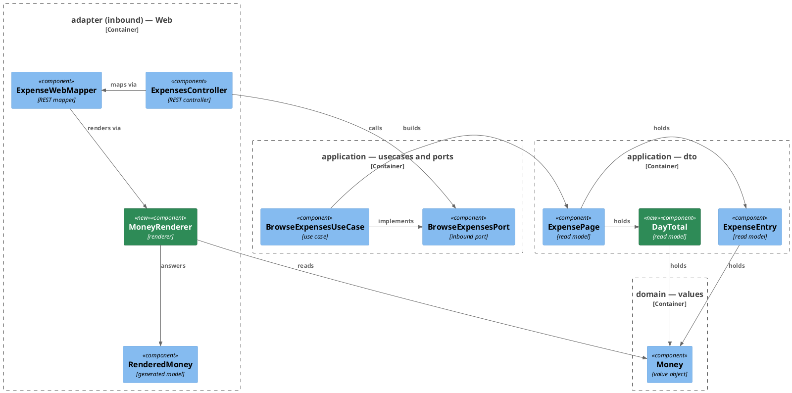

# Plan: Money as Rendered Text — `ledger-service`

**Affected Modules:** `ledger-service`
**Design:** [Money Crosses the Browse API as Rendered Text](../design.md)

## Components

The design named the responsibilities; these are the classes that hold them.



| Type                             | Holds                                            | Refuses |
|----------------------------------|--------------------------------------------------|---------|
| `application.dto.DayTotal`       | `LocalDate day`, `List<Money> amounts`           | —       |
| `application.dto.ExpensePage`    | `items`, `limit`, `offset`, `total`, `dayTotals` | —       |

| Method                                                                       | Answers                                                       |
|------------------------------------------------------------------------------|---------------------------------------------------------------|
| `ExpensePage.of(List<ExpenseEntry> items, int limit, int offset, long total)` | a page whose `dayTotals` are derived from `items` alone       |
| `MoneyRenderer.render(Money money)`                                          | a `bot.finance.api.model.RenderedMoney`, that figure's parts  |

`RenderedMoney` is the generated model, one type for both positions on the wire, so the adapter renders a figure
once and hands the result to either. `bot.finance.api.model.DayTotal` shares a simple name with the application
DTO above; `ExpenseWebMapper` is the only class that sees both, and it qualifies whichever it imports second.

| Invariant                                                                                                 |
|-------------------------------------------------------------------------------------------------------------|
| `ExpensePage.of` is the only place `dayTotals` is derived; the canonical constructor stays public.            |
| `dayTotals` covers `RECORDED` entries only, one element per UTC day of `createdAt` that has one.              |
| `DayTotal` orders and copies its own `amounts` in its compact constructor, the way `SpendingSummary` does.    |
| A day's `amounts` carries one `Money` per currency, ordered by ISO code, with nothing converted.              |
| `dayTotals` arrives newest day first, the order the entries arrive in.                                        |
| `RenderedMoney.amount` carries grouped digits at the currency's own scale, and never a symbol or a code.      |
| `RenderedMoney.currency` is the currency's `Locale.ENGLISH` symbol, its ISO code where the JVM holds none.     |
| `RenderedMoney.separator` is one space exactly when the label came back as that currency's own ISO code.      |
| Both parts come from `Locale.ENGLISH`, never the JVM default. Nothing reads a locale off the request.          |

## Step-by-Step Implementation Map (To-Do List)

### Stabilization

#### Interface-First / Build Stabilization

**Interface & Signature Sync**

- [ ] ST01 · Add `bot.finance.application.dto.DayTotal` — `record DayTotal(LocalDate day, List<Money> amounts)`
  with a compact constructor stub:
  ```java
  public DayTotal {
      // orders amounts by ISO currency code and copies the list, the way SpendingSummary does
  }
  ```
- [ ] ST02 · Add `List<DayTotal> dayTotals` to `bot.finance.application.dto.ExpensePage` as its last component,
  and a static factory stub beside it:
  ```java
  public static ExpensePage of(List<ExpenseEntry> items, int limit, int offset, long total) {
      // groups the RECORDED items by the UTC day of createdAt, sums each day per currency, and answers one
      // DayTotal per such day, newest first
      return new ExpensePage(items, limit, offset, total, List.of());
  }
  ```
- [ ] ST03 · In `BrowseExpensesUseCase.browse`, build the answer with `ExpensePage.of(...)` instead of the
  constructor. Nothing else in the method changes.
- [ ] ST05 · Add `bot.finance.adapter.web.MoneyRenderer`, a stateless helper with a private constructor beside
  `ExpenseWebMapper`, and stub its one method. It answers the generated `bot.finance.api.model.RenderedMoney`,
  which the shared plan's component names make one type for both positions on the wire:
  ```java
  public static RenderedMoney render(Money money) {
      // renders the scaled amount through a grouping number format on Locale.ENGLISH carrying no currency,
      // takes Currency.getSymbol(Locale.ENGLISH) as the label, and separates the two with a space only when
      // that symbol came back as the ISO code. Never the JVM default locale, on either part.
      return new RenderedMoney("", "", "");
  }
  ```
- [ ] ST06 · Update the two test classes that construct an `ExpensePage` directly —
  `ExpenseWebMapperTest.pageOfTwoEntries()` and its no-merchant test, and every `new ExpensePage(...)` in
  `ExpensesControllerTest` — to call `ExpensePage.of(...)`, and get the module back to build-green.
- [ ] ST07 · Confirm `bot.finance.architecture.CleanArchitectureTest` still passes.

### Red Phase

#### TDD Unit Red Phase

- [ ] RU01 · `ExpensePage` · test: `ExpensePageTest` · covers: `of()` · scenarios: A5, A6, A7, A8, A9
    - `of()`:
        - given: two RECORDED entries on the same UTC day, the 900 JPY one handed in before the 1250 EUR one
          when: of() builds the page
          then: that day has one DayTotal holding two Money figures, EUR before JPY
        - given: one UTC day holding a RECORDED entry and a PENDING entry, both 500 EUR
          when: of() builds the page
          then: that day's figure is 500 EUR, the pending entry counting towards nothing
        - given: three RECORDED entries on one UTC day, all EUR
          when: of() builds the page
          then: that day has one DayTotal holding one Money, the sum of the three, in EUR
        - given: entries spanning three UTC days, each with a RECORDED entry
          when: of() builds the page
          then: dayTotals holds three elements, the newest day first
        - given: two entries whose createdAt fall either side of midnight UTC on the same local evening
          when: of() builds the page
          then: they land in two DayTotals, keyed by the UTC calendar day of createdAt
        - given: one UTC day whose entries are all PENDING, and a second day holding a RECORDED entry
          when: of() builds the page
          then: dayTotals holds one element, for the second day only
        - given: a page whose every entry is PENDING
          when: of() builds the page
          then: dayTotals is empty and items still carries every entry
        - given: no entries at all, with a total of 57
          when: of() builds the page
          then: dayTotals is empty, items is empty, and limit, offset and total are the arguments given
        - given: three of a UTC day's five RECORDED entries, as one page of that day would carry
          when: of() builds the page
          then: that day's figure sums those three alone
        - given: a page of entries
          when: of() builds the page
          then: items, limit, offset and total are the arguments given, unchanged

- [ ] RU02 · `MoneyRenderer` · test: `MoneyRendererTest` · covers: `render()` · scenarios: A1, A2, A3, A4
    - `render()`:
        - given: 1250 minor units in EUR
          when: render() is called
          then: amount is 12.50, currency is €, and separator is empty
        - given: 900 minor units in JPY
          when: render() is called
          then: amount is 900, currency is ¥, and separator is empty
        - given: 124500 minor units in EUR
          when: render() is called
          then: amount is 1,245.00, and it carries no symbol and no code
        - given: 124500 minor units in CHF, a currency English holds no symbol for
          when: render() is called
          then: amount is 1,245.00, currency is CHF, and separator is one space
        - given: 0 minor units in EUR
          when: render() is called
          then: amount is 0.00 and currency is €
        - given: the JVM default locale set to a non-English one, and 124500 minor units in EUR
          when: render() is called
          then: amount is still 1,245.00 and currency is still €, the default restored afterwards

- [ ] RU03 · `ExpenseWebMapper` · test: `ExpenseWebMapperTest` · covers: `toResponse()` · scenarios: A1, A4, A5,
  A6, A8
    - `toResponse()`:
        - given: a page whose one entry is 1250 minor units in EUR
          when: toResponse() is called
          then: the item's money carries amount 12.50, currency € and an empty separator
        - given: a page whose one entry is 124500 minor units in CHF
          when: toResponse() is called
          then: the item's money carries amount 1,245.00, currency CHF and a separator of one space
        - given: a page whose dayTotals holds one day with a EUR figure and a JPY figure
          when: toResponse() is called
          then: the response carries one day total, its day as that LocalDate, and two rendered figures in the
          order the page held them
        - given: a page carrying entries but no dayTotals
          when: toResponse() is called
          then: the response's dayTotals is an empty list rather than absent
        - given: a page with no entries and no dayTotals
          when: toResponse() is called
          then: the response carries an empty items list and an empty dayTotals list
        - update: `whenPageHasTwoEntriesWithDifferentStatuses_thenEveryFieldIsMapped()` — un-disable the method
          the shared plan disabled, and replace the four commented-out lines with assertions on each item's
          rendered `money`: the first entry is 1500 minor units in EUR so its parts are `15.00`, `€` and an empty
          separator, the second is 350 in EUR so its parts are `3.50`, `€` and an empty separator. Nothing on the
          response names a minor-unit field any more.

- [ ] RU04 · `DayTotal` · test: `DayTotalTest` · covers: the compact constructor · scenarios: A5
    - the compact constructor:
        - given: amounts handed in as a JPY figure before a EUR one
          when: a DayTotal is built
          then: amounts() reads back the EUR figure before the JPY one
        - given: a mutable amounts list, added to after the DayTotal was built
          when: amounts() is read
          then: it holds what was handed in, unchanged
        - given: a DayTotal built from an amounts list
          when: something adds to amounts()
          then: it throws UnsupportedOperationException
        - given: an empty amounts list
          when: a DayTotal is built
          then: it is built and amounts() is empty

#### TDD System Test Red Phase

- [ ] RS01 · `BrowseExpensesSystemTest` · covers: `GET /api/v1/expenses` · scenarios: A1, A6
    - Happy Path:
        - update: `whenTheListIsRequestedWithTheSessionCookieAndNoFilter_then200WithAPageOfBothKindsNewestFirst()`
          — the method stores a 2450 EUR pending proposal and a 1230 EUR recorded expense, then asserts each
          item's status, category id and description and the total. Add, after those: each item's `money.amount`,
          `money.currency` and `money.separator` — `24.50`, `€` and empty for the proposal, `12.30`, `€` and
          empty for the expense — and that no item carries an `amountMinorUnits` field. Then assert `dayTotals`
          holds exactly one element, whose `day` is the UTC day the recorded row's answered `createdAt` falls on,
          and whose one figure is `12.30` in `€` — the pending 24.50 counting towards nothing. Read the day off
          the answered row rather than computing it from `Instant.now()`: the fixture writes one row a minute
          before the other, so a run near midnight UTC would otherwise assert the wrong day.

### Green Phase

#### TDD Unit Green Phase

- [ ] GU01 · `ExpensePage` · test: `ExpensePageTest` · after: GU04
- [ ] GU02 · `MoneyRenderer` · test: `MoneyRendererTest`
- [ ] GU03 · `ExpenseWebMapper` · test: `ExpenseWebMapperTest` · after: GU01, GU02
- [ ] GU04 · `DayTotal` · test: `DayTotalTest`

#### TDD System Test Green Phase

- [ ] GS01 · `BrowseExpensesSystemTest` · covers: `GET /api/v1/expenses`

### Post-Implementation Steps

_Nothing here unless Q1 is answered `yes`. The listing's requests are unchanged, so
`ledger-service/docs/requests/expenses.http` needs no edit._

## Open Questions / Blockers

- **Q1:** The one ADR candidate this change raises is: *the web adapter renders a figure for a reader, and the
  core totals a day in `Money`*. It is technical — it names the layers and the types — but it applies the layering
  rule the module's [architecture conventions](../../../ledger-service/docs/conventions/architecture.md) and its
  ArchUnit rules already state, rather than deciding anything new. Recommendation: no ADR, since
  [`web-browse-api.md`](../../../ledger-service/docs/contracts/in/web-browse-api.md) and the schema hold what a
  reader would come looking for. Write one anyway?
  - A: No ADR.

## Review Findings

- **F1:** RU01's ISO-ordering scenario did not fix the order the entries were handed in, so it passed on an
  implementation that never sorts.
  - Resolution: mechanical
  - Action: applied — the JPY entry is now handed in first.

- **F2:** Neither ST05 nor the Components table named the `Locale` the symbol and the digits come from, and
  "English" alone does not determine them — `getSymbol(Locale.UK)` answers `JP¥` where `Locale.ENGLISH` answers `¥`.
  - Resolution: mechanical
  - Action: applied — ST05's intent comment and two invariants now name `Locale.ENGLISH`.

- **F3:** No scenario held the rendering against a non-English JVM default, which D9 and the plan's own invariant
  require.
  - Resolution: mechanical
  - Action: applied — added the scenario to RU02, matching
    `TurnReportRendererTest.whenSummaryPeriodIsRenderedWithNonEnglishDefaultLocale_thenDatesReadInEnglish()`.

- **F4:** `DayTotal` was a bare record with its ordering pushed into `ExpensePage.of`, where `SpendingSummary` —
  the same shape — orders and copies in its own compact constructor and has its own test class.
  - Resolution: decision
  - Action: resolved — `DayTotal` takes the `SpendingSummary` idiom. The repository answers this: `SpendingSummary`
    is a period plus a list of per-currency figures, sorts by ISO code and copies in its compact constructor
    (`ledger-service/src/main/java/bot/finance/application/dto/SpendingSummary.java:9-14`), and `SpendingSummaryTest`
    covers ordering, the defensive copy, the unmodifiable read-back and the empty case. Nothing distinguishes
    `DayTotal` from it. ST01 now stubs the compact constructor, `ExpensePage.of` only groups and sums, and RU04 /
    GU04 carry `DayTotalTest`.

- **F5:** The invariant "`ExpensePage` is built only through `of`" is unachievable — a public record's canonical
  constructor cannot be made less accessible.
  - Resolution: mechanical
  - Action: applied — reworded to what the plan builds: `of` is the only place `dayTotals` is derived.

- **F6:** RU03's second `update:` bullet added coverage the step already has, under a display name that would then
  promise one outcome and assert two.
  - Resolution: mechanical
  - Action: applied — dropped the bullet.

- **F7:** No unit scenario covered a single UTC day mixing a PENDING and a RECORDED entry, so an implementation
  summing every entry of an included day stayed green.
  - Resolution: mechanical
  - Action: applied — added the scenario to RU01.
