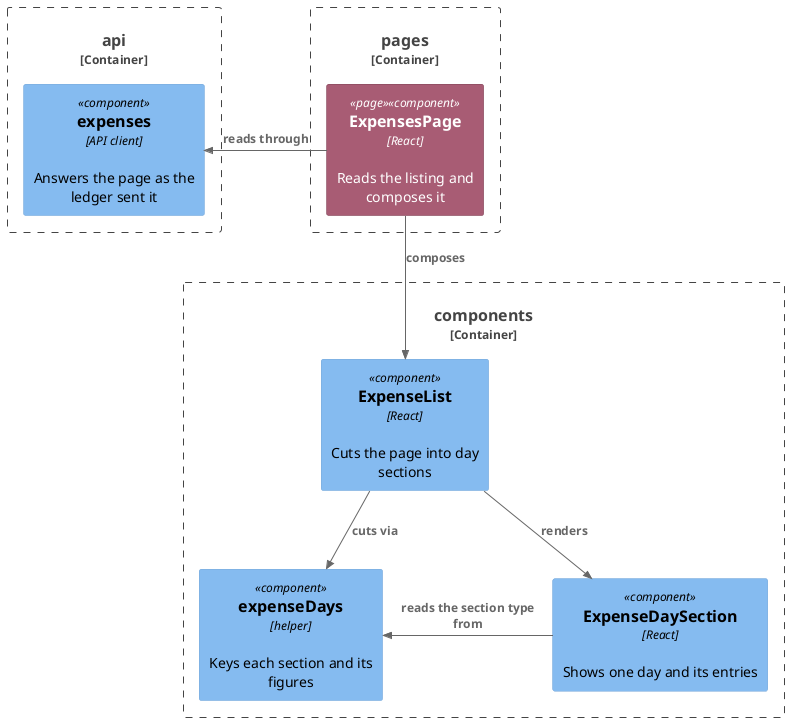

# Plan: Money as Rendered Text — `web-app`

**Affected Modules:** `web-app`
**Design:** [Money Crosses the Browse API as Rendered Text](../design.md)

## Components

This change creates no file. Its steps change `expenseDays.ts` and `ExpenseDaySection.tsx`, plus the three test
files beside them. `ExpensesPage` and the API client are drawn for the context their arrows carry — the first is
untouched by the whole task, the second changes only in the shared plan. Boxes are grouped by the directory each
sits in.

| Type                            | Holds                                                         |
|---------------------------------|----------------------------------------------------------------|
| `RenderedMoney`                 | `amount`, `currency`, `separator`, re-exported from the generated types |
| `DayTotal`                      | `day`, `amounts`, re-exported from the generated types         |
| `ExpenseDay`                    | `day`, `entries`, `awaiting`, `totals: RenderedMoney[]`        |
| `toDaySections(items, dayTotals)` | one section per UTC day, each carrying the figures answered for its day |

| Rule                                                                                                     |
|-----------------------------------------------------------------------------------------------------------|
| A figure is shown as `currency` + `separator` + `amount`, in that order, with nothing inserted or inspected.|
| A day's figures are looked up by the UTC day key the sections are already cut by.                           |
| A day the ledger answered no figure for gets an empty `totals`, and the heading shows none.                 |
| Each day figure is keyed in the DOM by its position in `amounts`, never by its label.                       |
| The entry amount column has no fixed width, never wraps, and stays right-aligned and last in its row.       |
| `Intl.NumberFormat` leaves this module. The day heading's `Intl.DateTimeFormat` at UTC is untouched.        |

**A14** — a figure wider than the old column — is width and wrapping, which
[the suite cannot see](../../../web-app/docs/conventions/testing.md#what-the-suite-cannot-see). P01 covers it.
**A15** — a refused read — is unchanged by this design and stays covered by `ExpensesPage.test.tsx`, so no step
touches it.

## Step-by-Step Implementation Map (To-Do List)

### Red Phase

#### TDD Unit Red Phase

- [x] RU01 · `expenseDays` · test: `expenseDays.test.ts` · covers: `toDaySections()` · scenarios: A12, A13
    - `toDaySections()`:
        - given: entries across two UTC days and a dayTotals list holding one figure for each
          when: toDaySections() is called
          then: each section's totals is the figures answered for its own day
        - given: entries on a UTC day and a dayTotals list with no element for it
          when: toDaySections() is called
          then: that section's totals is empty, and its entries and awaiting count are unaffected
        - given: a dayTotals element for a day no entry falls on
          when: toDaySections() is called
          then: no section is created for it
        - given: entries and an empty dayTotals list
          when: toDaySections() is called
          then: every section carries an empty totals
        - update: `it.skip`ped by the shared plan — un-skip the three tests it left named against this step, and
          rewrite each to pass the figures in through the second argument instead of expecting them summed:
          *sums a day's RECORDED entries into one EUR total when every entry shares that currency*,
          *keeps one total per currency, converting neither into the other*, and
          *sums only the RECORDED entries while still counting every entry and every one still awaiting a
          decision*. The last keeps its assertions on `entries` and `awaiting`, which this change does not touch.
        - update: `it.skip`ped by the shared plan — un-skip *carries no total for a day holding only an entry
          still awaiting a decision* and assert the empty `totals` comes from the ledger answering no element for
          that day, rather than from a sum of nothing.

- [x] RU02 · `ExpenseDaySection` · test: `ExpenseDaySection.test.tsx` · covers: the rendered section ·
  scenarios: A10, A11, A12, A13
    - the entry row:
        - given: an entry whose money is amount 900, currency ¥ and an empty separator
          when: the section is rendered and the day expanded
          then: the row shows ¥900, character for character
        - given: an entry whose money is amount 1,245.00, currency CHF and a separator of one space
          when: the section is rendered and the day expanded
          then: the row shows CHF 1,245.00, with that one space and no other
    - the day heading:
        - given: a day whose totals holds a euro figure and a yen figure
          when: the section is rendered
          then: the heading shows €12.50 and ¥900, one per line, in the order given
        - given: a day whose one figure is amount 1,245.00, currency CHF and a separator of one space
          when: the section is rendered
          then: the heading shows CHF 1,245.00, with that one space and no other
        - given: a section already showing a day's two figures
          when: it is re-rendered with two different figures answered for the same day
          then: the heading shows the new pair and neither of the old ones
        - update: `it.skip`ped by the shared plan — un-skip each test it left named against this step and replace
          the local `amount()` helper's expectation with the figure joined by hand from the fixture's three
          parts. Build every expectation by hand rather than from the component's own join. The tests concerned
          are *carries the day, the entry count and the total in its header, and lists every entry once opened*,
          *lists a recorded entry with its description, its merchant, its category name and its Intl-formatted
          amount, and no status badge* — rename it for what it now proves — *keeps the header's day, count and
          total whether it is open or closed*, *shows a total for each currency present among the day's recorded
          entries*, and *sums only the recorded entries into the total and says one entry awaits a decision*, and
          *still shows the description, the merchant and the amount when the category is absent from the lookup,
          without leaking the id, null or undefined*.
        - update: *shows no total and says one entry awaits a decision when the day holds only a pending entry*
          asserts `not.toHaveTextContent('€')` and calls no `amount()` helper, so it needs different work from
          the bullet above: keep the awaiting badge and the count as they are, and assert the heading shows no
          figure because the section's `totals` is empty.

- [x] RU03 · `ExpenseList` · test: `ExpenseList.test.tsx` · covers: the rendered list · scenarios: A12
    - the list:
        - given: a page whose entries span three UTC days and whose dayTotals holds a figure for the newest and
          the oldest
          when: the list is rendered
          then: those two day headings show their own figure and the middle one shows none

### Green Phase

#### TDD Unit Green Phase

- [ ] GU01 · `expenseDays` · test: `expenseDays.test.ts`
- [ ] GU02 · `ExpenseDaySection` · test: `ExpenseDaySection.test.tsx` · after: GU01
- [ ] GU03 · `ExpenseList` · test: `ExpenseList.test.tsx` · after: GU01, GU02

`GU02` also carries what the suite cannot see: keying each day figure by its position in `amounts` rather than by
its label, and dropping the amount column's `w-24` for a column that sizes to its content, never wraps, and stays
right-aligned and last in its row.

### Post-Implementation Steps

#### Manual Review

- [ ] P01 · Start the app and hand it over, naming what to look at · scenarios: A14. The list is the design's
  ([D26](../design.md#decisions)): the expenses page, at the shell's full width and at the narrowest width it
  reaches, in these states — every day collapsed on arrival; a day heading with one figure and a day heading with
  two currencies of different lengths; an expanded day holding a large amount, a small one, and a pending entry
  whose badge sits beside a description long enough to truncate. Colour and both themes are not on the list.

## Open Questions / Blockers

- **Q1:** This change raises no ADR candidate — every decision it makes is either the shared schema's or a screen
  rule the [use-case page](../../../web-app/docs/usecases/browse-recorded-expenses.md) owns. Is there one you
  want recorded anyway?
  - A: No ADR.

## Review Findings

- **F1:** RU01's two-figures scenario was the same test as its own `update:` rework of *keeps one total per
  currency, converting neither into the other*.
  - Resolution: mechanical
  - Action: applied — dropped the scenario, kept the `update:`.

- **F2:** RU02's empty-totals heading scenario duplicated an existing test, and the `update:` wording aimed at
  that test named an `amount()` call it does not make.
  - Resolution: mechanical
  - Action: applied — dropped the scenario and gave that test its own `update:` bullet.

- **F3:** No heading scenario carried a non-empty `separator`, so a GU02 dropping it at the heading alone stayed
  green.
  - Resolution: mechanical
  - Action: applied — added the `CHF 1,245.00` heading scenario.

- **F4:** GU02's closing note said "the two changes no test can see" and listed three, the first of which RU02
  asserts.
  - Resolution: mechanical
  - Action: applied — the note now names only the DOM key and the amount column.

- **F5:** RU02's duplicate-label scenario cannot fail: React renders both array elements on first mount whatever
  the key, so it distinguishes neither keying.
  - Resolution: decision
  - Action: resolved — replaced with a re-render scenario, which is where the two keyings diverge. The module's
    [testing conventions](../../../web-app/docs/conventions/testing.md#testing-style) rule out asserting the key
    itself as a mechanism, so the invariant a reader would notice — the heading showing the figures last
    answered — is what the scenario asserts.

- **F6:** RU03's empty-`dayTotals` scenario repeated its own first scenario and an existing list test.
  - Resolution: mechanical
  - Action: applied — dropped the scenario.

- **F7:** The Components preamble counted four changed files against a five-box diagram.
  - Resolution: mechanical
  - Action: applied — the preamble names the files this plan's steps change and says why the other two boxes are
    drawn.

- **F8:** RU02 listed *shows the catalogue's substituted text rather than a literal, once the catalogue is
  swapped* among the tests to un-skip, though the shared plan's ST15 never skips it — it asserts no figure. Raised
  by the shared plan's review as its own F5.
  - Resolution: mechanical
  - Action: applied — dropped that test from RU02's `update:` list.
