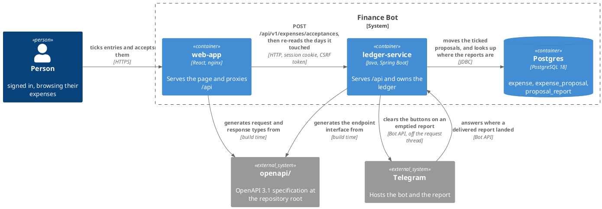
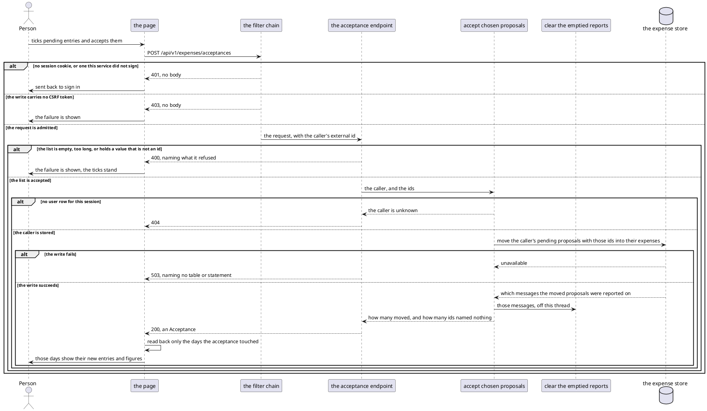
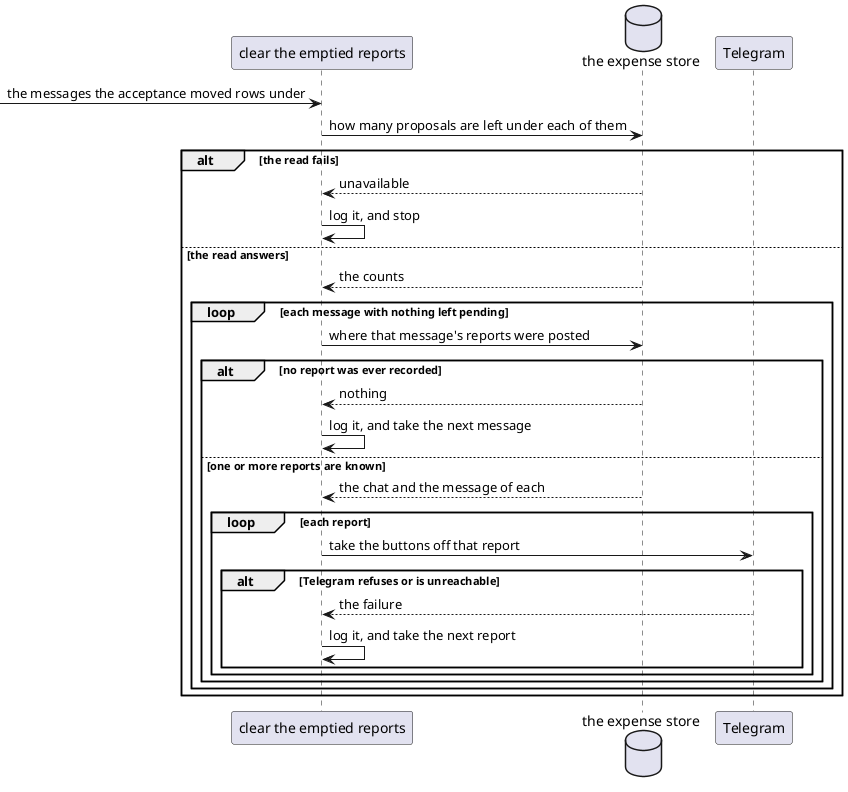
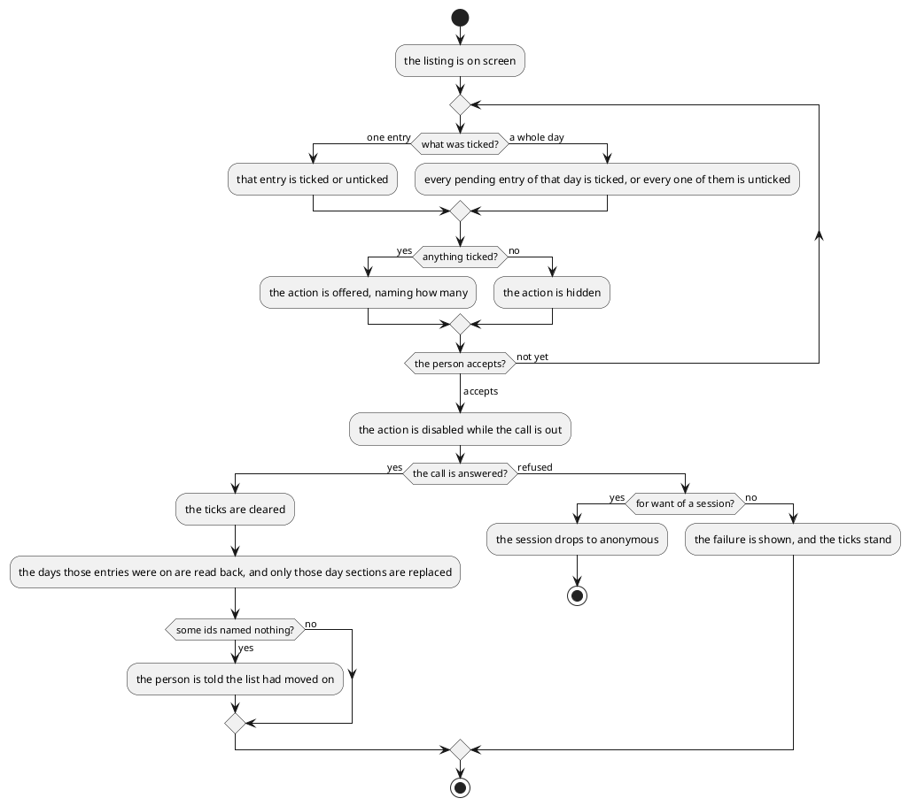

# Design: Accept Expenses from the Web App

**Affected Modules:** `ledger-service`, `web-app`

**Shared artifact:** the OpenAPI specification under repo-root [`openapi/`](../../openapi/ledger-api.yaml).
`ledger-service` generates the endpoint interface it implements from it. `web-app` generates the request and
response types it calls with. Neither module owns it, so it lands on its own before either module's work. Nothing
else crosses between the two.

## Objective

A person browsing their ledger sees pending proposals and can do nothing with them. Only a tap on a Telegram
report resolves one, and that tap resolves a whole message at once.

This change lets the page accept spending. A person ticks one entry or several and accepts them in one action.
The proposals become expenses, exactly as a Telegram Confirm makes them.

The report in Telegram is then stale, so the ledger takes the buttons off it. That happens after the person has
been answered, on its own thread, and it is never retried. A clearing that fails changes nothing about the
spending that was accepted, and a tap on the buttons it left behind still answers truthfully.

Reaching a report means storing where it was posted, which puts a third identifier on one turn. Two of them
answer the same question, so this change settles them together: a turn is named by the message that started it,
not by a UUID minted beside it.

## Context

What exists, and what this change extends.

**The listing the page already reads** — `GET /api/v1/expenses`
([`ExpensesController`](../../ledger-service/src/main/java/bot/finance/adapter/web/ExpensesController.java),
[the browse API](../../ledger-service/docs/contracts/in/web-browse-api.md)) answers `PENDING` and `RECORDED`
entries as one page, described by [`openapi/ledger-api.yaml`](../../openapi/ledger-api.yaml). An `Expense` carries
`status` and `id`, and an id is unique within its status only. The page that renders it is
[Browse recorded expenses](../../web-app/docs/usecases/browse-recorded-expenses.md), designed in
[18-browse-recorded-expenses](../implemented/18-browse-recorded-expenses/design.md).

**The acceptance that already exists** —
[Resolve a reported proposal](../../ledger-service/docs/usecases/resolve-a-reported-proposal.md) moves every
proposal under one message into `expense` and removes it in a single statement
([ADR 0012](../../ledger-service/docs/adr/0012-a-set-of-rows-moves-between-tables-in-one-statement.md),
[`ExpenseProposalEntityRepository`](../../ledger-service/src/main/java/bot/finance/adapter/persistence/ExpenseProposalEntityRepository.java)).
It already answers a repeated tap: nothing moved plus expenses stored under the message means `ALREADY_ACCEPTED`,
and every outcome clears the report's buttons. This change adds a second way in, not a second meaning.

**The only write the browser makes today** — `POST /api/v1/session`, admitted by
[`SecurityConfiguration`](../../ledger-service/src/main/java/bot/finance/adapter/security/SecurityConfiguration.java)
and carrying the CSRF token that
[`client.ts`](../../web-app/src/api/client.ts) reads back from the cookie the chain sets. Every other `/api/v1`
path is a read.

Three facts about the store this change writes to:

- **A pending expense is a row in `expense_proposal`**, and its id is that table's own `BIGSERIAL`
  ([`V003`](../../ledger-service/src/main/resources/db/migration/V003__create_expense_proposal.sql)).
- **A message reference is a minted UUID today.** `MessageReference` wraps a `java.util.UUID` and refuses
  anything else
  ([`MessageReference`](../../ledger-service/src/main/java/bot/finance/domain/value/MessageReference.java)), and
  it reaches the tool calls that write the proposals as the `mrf` claim on the caller token
  ([ADR 0010](../../ledger-service/docs/adr/0010-a-message-reference-rides-the-caller-token-not-the-extraction-request.md)),
  whose last consequence records that minting it rather than deriving it is what leaves a redelivered update
  producing a second turn. Thirty files in `src/main/java` name the type.
- **Every proposal carries the message that reported it**, `NOT NULL`, indexed on `(user_id, message_reference)`
  ([`V004`](../../ledger-service/src/main/resources/db/migration/V004__add_expense_proposal_message_reference.sql)).
  An accepted expense keeps it
  ([`V005`](../../ledger-service/src/main/resources/db/migration/V005__add_expense_message_reference.sql)).
- **Nothing stores where a report was posted.** The chat and the message id of a report reach the service only on
  a tap ([Telegram — incoming messages](../../ledger-service/docs/contracts/in/telegram-updates.md)), and no
  column holds either. Delivering a report reads only whether the send succeeded and discards what Telegram
  answered
  ([`TelegramMessageDeliveryAdapter`](../../ledger-service/src/main/java/bot/finance/adapter/telegram/TelegramMessageDeliveryAdapter.java)).
  In a private chat Telegram numbers the sender and the conversation alike, and the bot works in no other kind of
  chat.

## Proposed Solution

### What the change adds

One write endpoint, described by the shared specification.

| Endpoint                            | Takes                              | Answers                                          |
|-------------------------------------|------------------------------------|--------------------------------------------------|
| `POST /api/v1/expenses/acceptances` | `{ "ids": [ … ] }`, 1 to 100 ids   | how many were accepted, and how many named nothing |

The ids are the ids of the caller's `PENDING` entries, as the listing answered them. Accepting is scoped to the
signed-in person, as every read already is.

The specification gains one path file and two schemas:

```
openapi/
├── paths/
│   └── expense-acceptances.yaml        POST /api/v1/expenses/acceptances
└── ledger-api.yaml                     AcceptanceRequest, Acceptance
```

The store gains one table: where a report was posted, kept per message so its buttons can be reached again after
the proposals under it are gone (D11).

It also stops naming a turn by a value invented for it. A message reference becomes the message it names —
the conversation and the inbound message id, joined — instead of a fresh UUID (D46). The column widens to text
in the three tables that carry it, old values keep working, and
[ADR 0010](../../ledger-service/docs/adr/0010-a-message-reference-rides-the-caller-token-not-the-extraction-request.md)
is superseded (D47).

On the page, every `PENDING` row carries a checkbox, and every `RECORDED` row reserves the space one takes (D34).
Each day carries one of its own, which ticks and unticks every pending entry of that day at once (D18). Ticking
at least one reveals one action, which accepts every ticked row at once. A collapsed day says how many of its
entries are ticked (D33). What changed is read back a day at a time, so the days the acceptance touched show
their new entries and their new figures (D32).

Once the person is answered, the ledger takes the buttons off every report the acceptance emptied. That work runs
on its own thread, is never retried, and never reaches the browser (D9, D24).

### Diagrams

Both modules take the repository's [Diagram Format](../conventions/diagrams.md) unchanged. No component diagram
appears here: classes belong to the plan.

#### Container — what this change reaches



#### Flow — accepting the ticked entries



#### Flow — clearing the emptied reports

Nobody waits for this, and nothing is retried. It starts where the diagram above hands the messages over.



#### Flow — what the page decides

The branches name one participant, so the decisions are the content.



### Details

#### `ledger-service` — what the wire carries

| `AcceptanceRequest` field | Meaning                                                                        |
|---------------------------|--------------------------------------------------------------------------------|
| `ids`                     | the ids of `PENDING` entries to accept, 1 to 100 of them, unique, each above 0 |

| `Acceptance` field | Meaning                                                                              |
|--------------------|---------------------------------------------------------------------------------------|
| `accepted`         | how many proposals became expenses                                                     |
| `missing`          | how many ids named no pending proposal of the caller's — already resolved, or not theirs |

`accepted` plus `missing` always equals the number of ids the request carried (D5).

#### `ledger-service` — what the caller gets

| Status | Raised by                                                                                  |
|--------|---------------------------------------------------------------------------------------------|
| 200    | the write ran, whatever it moved — an acceptance that moves nothing is not a failure (D5)   |
| 400    | an empty list, more than 100 ids, a repeated id, an id below 1, or a body that is not JSON  |
| 401    | no session, refused by the filter chain before the endpoint is reached                       |
| 403    | no CSRF token, refused by the filter chain (D12)                                             |
| 404    | a session outliving its user row — `EntityNotFoundException`                                 |
| 503    | the write failed — `PersistenceFailedException`                                              |

Each 400 message is composed by this module and names the field and the bound it broke, as the listing's already
are. A failure to tell Telegram never appears here (D9).

#### `ledger-service` — the acceptance statement

One statement, so two acceptances of the same rows move them once
([ADR 0012](../../ledger-service/docs/adr/0012-a-set-of-rows-moves-between-tables-in-one-statement.md)). It
answers one row per proposal moved, carrying the message it was reported on:

```sql
WITH accepted AS (
    DELETE FROM expense_proposal
    WHERE user_id = :userId AND id IN (:ids)
    RETURNING user_id, category_id, description, merchant,
              amount_minor_units, currency_code, message_reference
), inserted AS (
    INSERT INTO expense (user_id, category_id, description, merchant,
                         amount_minor_units, currency_code, message_reference, created_at, updated_at)
    SELECT user_id, category_id, description, merchant,
           amount_minor_units, currency_code, message_reference, :now, :now
    FROM accepted
    RETURNING message_reference
)
SELECT message_reference FROM inserted
```

Whether each of those messages still has anything pending is a second read, over the references the first
answered:

```sql
SELECT message_reference, count(*) AS pending_count
FROM expense_proposal
WHERE user_id = :userId AND message_reference IN (:messageReferences)
GROUP BY message_reference
```

A reference absent from that answer has nothing left pending, which is what earns a clearing (D8). Both reads
belong to the clearing thread, not to the request (D24), and the second is skipped when the acceptance moved
nothing (D20).

#### `ledger-service` — the incoming message id

A turn stops being named by a minted reference and is named by the message that started it:
`<conversationId>:<inboundMessageId>`, both values already on the command that starts a turn (D46). The value
carries opaque text with a length bound rather than a UUID, so a value written in the old shape still parses and
every report already in a chat keeps working (D48). It is called what it is — an incoming message id — and
`message_reference` goes with the minting it was named for (D61).

`src/main/resources/db/migration/V007__rename_and_widen_incoming_message_id.sql`:

```sql
ALTER TABLE expense_proposal RENAME COLUMN message_reference TO incoming_message_id;
ALTER TABLE expense          RENAME COLUMN message_reference TO incoming_message_id;
ALTER TABLE spending_query   RENAME COLUMN message_reference TO incoming_message_id;

ALTER TABLE expense_proposal ALTER COLUMN incoming_message_id TYPE TEXT USING incoming_message_id::text;
ALTER TABLE expense          ALTER COLUMN incoming_message_id TYPE TEXT USING incoming_message_id::text;
ALTER TABLE spending_query   ALTER COLUMN incoming_message_id TYPE TEXT USING incoming_message_id::text;

ALTER INDEX idx_expense_proposal_message_reference RENAME TO idx_expense_proposal_incoming_message;
ALTER INDEX idx_expense_message_reference          RENAME TO idx_expense_incoming_message;
ALTER INDEX idx_spending_query_message_reference   RENAME TO idx_spending_query_incoming_message;
```

No backfill and no new column: Postgres renders each existing UUID as its canonical text, and those rows keep
naming a turn nothing will ever mint again (D49). A rename rewrites no row and an index survives both statements,
so nothing is rebuilt by hand.

#### `ledger-service` — the report location

`src/main/resources/db/migration/V008__create_proposal_report.sql`:

```sql
CREATE TABLE proposal_report (
    id                  BIGSERIAL PRIMARY KEY,
    user_id             BIGINT      NOT NULL REFERENCES app_user (id) ON DELETE CASCADE,
    incoming_message_id TEXT        NOT NULL,
    conversation_id     TEXT        NOT NULL,
    sent_message_id     TEXT        NOT NULL,
    created_at          TIMESTAMPTZ NOT NULL,
    updated_at          TIMESTAMPTZ NOT NULL
);

CREATE INDEX idx_proposal_report_incoming_message ON proposal_report (user_id, incoming_message_id);
```

Two columns name a message, and they are not the same message (D60):

| Column                | Names                                                                    |
|-----------------------|---------------------------------------------------------------------------|
| `incoming_message_id` | the incoming message this report is about, as every other table means it |
| `conversation_id`     | the conversation the report was posted into                              |
| `sent_message_id`     | the report itself, by the id Telegram gave it on send                    |

One row per report the bot posted, written when the report is delivered and never updated. It outlives the
proposals, which is what lets an emptied report still be reached (D11). The table is append-only and carries no
unique key, so a message reported twice holds a row each and both reports are cleared (D53). A report delivered
before this change has no row, and a report whose delivery failed has none either (D40).

#### `ledger-service` — build and security

| Setting                                    | Change                                                                    |
|--------------------------------------------|----------------------------------------------------------------------------|
| `SecurityConfiguration`                    | `POST /api/v1/expenses/acceptances` joins the chain as `.authenticated()` |
| the generated interface                    | one more operation on the `expenses` tag, nothing else                    |
| the clearing thread                        | its own bounded pool, named in `ledger-service/docs/configuration.md` (D24) |

Seven documents state facts this change moves, and are corrected with it:

| Document                                                                                          | Correction                                                                     |
|---------------------------------------------------------------------------------------------------|---------------------------------------------------------------------------------|
| [the browse API](../../ledger-service/docs/contracts/in/web-browse-api.md)                        | the boundary carries one write, repeatable in the sense D5 fixes                |
| [the web app's side of it](../../web-app/docs/contracts/out/ledger-browse-api.md)                 | one request is a write and carries the CSRF token (D28)                         |
| [Message reference](../../ledger-service/docs/domain/message-reference.md)                        | renamed to `incoming-message-id.md`, and its value derived rather than minted (D46, D61) |
| [ADR 0010](../../ledger-service/docs/adr/0010-a-message-reference-rides-the-caller-token-not-the-extraction-request.md) | `Status:` flips to superseded; nothing else is touched (D47) |
| [Telegram — outgoing replies](../../ledger-service/docs/contracts/out/telegram-replies.md)        | a report's location is recorded, and a button payload names the message (D11)   |
| [Database](../../ledger-service/docs/contracts/out/database.md)                                   | the `proposal_report` table, and the renamed text column in three tables (D61)   |
| [MCP — the ledger's tools](../../ledger-service/docs/contracts/in/mcp.md)                         | what the caller token's claim is called and what it carries (D61)               |

#### `ledger-service` — what happens to the report

Delivering a report now records where it landed. The delivery answers the chat and the message id Telegram gave
it, and a row is stored against the message that report is about. A delivery that failed records nothing, because
there is no report to reach.

| Condition                                        | Result                                                                |
|--------------------------------------------------|-------------------------------------------------------------------------|
| a message has nothing pending left               | its report's buttons are taken off, and its text is left as sent (D11)  |
| a message still has pending proposals            | nothing is sent, and its report's buttons still resolve the rest (D7)   |
| no row says where that report is                 | nothing is sent, and it is logged at debug (D40)                        |
| Telegram refuses the clearing                    | it is logged at warn, never retried, and the acceptance stands (D9)     |
| the person taps Confirm on the report afterwards | the existing already-accepted answer, unchanged (D6)                    |

#### `web-app`

| Surface                | Change                                                                                            |
|------------------------|----------------------------------------------------------------------------------------------------|
| the expenses client    | an `acceptExpenses` function posting the ids, declared against the generated types                 |
| the day section        | a checkbox on every `PENDING` row, the same gutter reserved on a `RECORDED` one, a whole-day checkbox and a ticked count on the header |
| the accordion header   | a slot beside the trigger, so the day's checkbox is not a control inside a button (D43)             |
| the expense list       | carries the ticked ids and the tick callback down, and holds none of its own state                 |
| a new action bar       | a row that always stands, holding the action only while something is ticked (D30)                  |
| the expenses page      | owns the ticked ids, calls the client, replaces the days it touched, and reports a failure as it already does |
| the English catalogue  | the checkbox label, the action, the two counts, and what a partly stale selection is told           |

A tick survives collapsing its day section and is dropped once the call is answered (D14).

The days a person accepted on are read back with one more listing call, narrowed to those days by `from` and `to`
and carrying the filter the page already holds. Only those day sections are replaced. The pager, the total and
every other day stay as they were (D32).

## Acceptance Scenarios

### `POST /api/v1/expenses/acceptances`

- **A1:** the ticked proposals become expenses
  - Given: the person is signed in and has pending proposals
  - When: they post the ids of two of them
  - Then: the response is 200 with `accepted` 2 and `missing` 0, and a later listing shows both as `RECORDED`
    and neither as `PENDING`

- **A2:** one id is accepted alone
  - Given: the person is signed in and has one pending proposal
  - When: they post its id alone
  - Then: the response is 200 with `accepted` 1, and the proposal is gone from the pending side

- **A3:** the same ids are posted twice
  - Given: the person already accepted two proposals through this endpoint
  - When: they post the same two ids again
  - Then: the response is 200 with `accepted` 0 and `missing` 2, and nothing is stored a second time

- **A4:** an id belongs to somebody else
  - Given: the person is signed in and the id names another person's pending proposal
  - When: they post it
  - Then: the response is 200 with `accepted` 0 and `missing` 1, never 403, and the other person's proposal
    stands

- **A5:** an id names a recorded expense
  - Given: the person is signed in and the id is a `RECORDED` entry's
  - When: they post it
  - Then: the response is 200 with `missing` 1, and nothing is written

- **A6:** the list is unusable
  - Given: the person is signed in
  - When: they post an empty list, more than 100 ids, a repeated id, or an id below 1
  - Then: the response is 400 naming what it refused, and nothing is written

- **A7:** nobody is signed in
  - Given: the request carries no session cookie, or one this service did not sign
  - When: it posts a list of ids
  - Then: the response is 401, and the endpoint is never reached

- **A8:** the write carries no CSRF token
  - Given: a valid session cookie and no `X-XSRF-TOKEN` header
  - When: the request posts a list of ids
  - Then: the response is 403, and nothing is written

- **A9:** the session outlives its user row
  - Given: a valid session whose user row no longer exists
  - When: it posts a list of ids
  - Then: the response is 404

- **A10:** the store is unavailable
  - Given: the person is signed in and the store refuses writes
  - When: they post a list of ids
  - Then: the response is 503, naming no table or statement, and nothing is moved

- **A11:** a fully accepted report loses its buttons
  - Given: the person's pending proposals under one message are all in the posted list, and that report's
    location was recorded when it was delivered
  - When: the acceptance succeeds
  - Then: the response is 200 straight away, and the buttons come off that report without its text changing

- **A12:** a partly accepted report keeps its buttons
  - Given: one of the two proposals under a message is in the posted list
  - When: the acceptance succeeds
  - Then: nothing is sent for that message, and its report's buttons still resolve the one left

- **A13:** the clearing cannot be delivered
  - Given: a fully accepted message and a Telegram that refuses the clearing
  - When: the acceptance succeeds
  - Then: the response is still 200 with the real counts, the expenses stand, the failure is logged, and nothing
    is retried

- **A14:** the report's buttons are tapped after a web acceptance
  - Given: every proposal under a message was accepted from the page
  - When: the person taps Confirm, or taps Delete, on that report
  - Then: they are told the spending is already recorded, the count is what is stored under that message, and
    the buttons come off

- **A20:** where a report was posted is recorded when it is delivered
  - Given: a message whose proposals were reported to the person
  - When: the report is delivered
  - Then: one row holds the chat and the message id against that message, and a delivery Telegram refused
    leaves none

- **A21:** the acceptance answers even where no report was ever recorded
  - Given: a fully accepted message whose report predates this change
  - When: the acceptance succeeds
  - Then: the response is 200 with the real counts, nothing is sent to Telegram, and the report keeps buttons
    that answer already-recorded on the next tap

### The message reference

- **A27:** a turn is named by the message that started it
  - Given: a message arriving in a conversation
  - When: the turn is handled and its proposals are stored
  - Then: every row it produced carries the conversation and that message's id as its reference, and no value is
    minted

- **A28:** the same message handled twice files under one reference
  - Given: a message whose turn already stored proposals
  - When: the same message is handled again
  - Then: the second turn's rows carry the same reference as the first, and one report's buttons resolve all of
    them

- **A29:** a report sent before this change still resolves
  - Given: a report in a chat whose buttons carry a UUID payload, and its proposals still stored
  - When: the person taps Confirm
  - Then: those proposals become expenses and the buttons come off, exactly as before

- **A31:** a message reported twice loses both reports' buttons
  - Given: one message delivered twice, so two reports stand in the chat under one reference
  - When: every proposal under it is accepted from the page
  - Then: a row was stored for each report, the buttons come off both, and neither insert failed on the other

- **A30:** two conversations do not collide
  - Given: one person's messages arriving from two conversations with the same message id
  - When: both turns store proposals
  - Then: the two references differ, and resolving one leaves the other's proposals pending

### The page

- **A15:** nothing is offered until something is ticked
  - Given: a listing holding pending entries
  - When: the person has ticked nothing
  - Then: no acceptance action is on screen, the row it will sit in still is, and a `RECORDED` row offers no
    checkbox while reserving the space one takes

- **A16:** several entries are accepted at once
  - Given: the person has ticked three pending entries across two days
  - When: they accept
  - Then: one call carries all three ids, the ticks are cleared, and those two days are read back and replaced

- **A17:** the list had moved on
  - Given: a ticked entry that Telegram accepted a moment earlier
  - When: the person accepts
  - Then: the answer's `missing` is reported to them in words, and the day it was on shows it as recorded

- **A22:** a tick survives its day being collapsed
  - Given: a ticked pending entry in a day section
  - When: the person collapses that section and opens it again
  - Then: the entry is still ticked, the action still names it, and accepting carries its id

- **A23:** a collapsed day says how many of its entries are ticked
  - Given: two pending entries ticked in one day and none in another
  - When: both sections are collapsed
  - Then: the first header says two are ticked and the second says nothing

- **A25:** a whole day is ticked at once
  - Given: an open day section holding two pending entries and one recorded entry
  - When: the person ticks that day's checkbox
  - Then: both pending entries are ticked, the recorded one is not, the action names two, and the day is
    neither opened nor closed by the tick

- **A26:** a partly ticked day is completed, then cleared
  - Given: one of that day's three pending entries is ticked, and its day checkbox reads as partly ticked
  - When: the person ticks the day checkbox, then ticks it again
  - Then: the first tick ticks the other two, and the second unticks all three

- **A24:** only the days accepted on change
  - Given: a listing showing three days, with entries ticked on one of them
  - When: the acceptance is answered
  - Then: that day shows its new entries and its new figures, the other two are untouched, and the pager reads
    as it did

- **A18:** the acceptance is refused
  - Given: a person accepting ticked entries
  - When: the call answers 503
  - Then: the failure is shown, the ticks stand, and the listing on screen is unchanged

- **A19:** the session expires while entries are ticked
  - Given: a person accepting ticked entries whose session has expired
  - When: the call answers 401
  - Then: the page drops to anonymous and sends them to `/login`, without a reload

## Decisions

- **D1:** What identifies the entries a person accepts?
  - Answer: their ids, as the listing answered them, taken as ids of `PENDING` rows only. Nothing carries a
    status alongside, and nothing carries the message they were reported on.
  - Basis: assumed — an `Expense` id is unique within its `status` and not across it (D3 of
    [design 18](../implemented/18-browse-recorded-expenses/design.md)), and the endpoint acts on the pending side
    alone, which fixes the status without a field. The page never sees a message reference: it is on neither
    `Expense` nor `ExpensePage` in [`openapi/ledger-api.yaml`](../../openapi/ledger-api.yaml).

- **D2:** Can a person discard proposals from the page as well as accept them?
  - Answer: No. The page accepts, and only Telegram's Delete throws a proposal away.
  - Basis: decided — the user asked for accepting from the page and named no discard (2026-08-09). It comes back
    the first time a person wants to clear a wrong proposal without opening the chat, which is the same endpoint
    with a second verb.

- **D3:** Is accepting one entry a different operation from accepting several?
  - Answer: No. One endpoint takes a list, and accepting one is a list of one.
  - Basis: decided — the user asked for both a single acceptance and a ticked-set acceptance (2026-08-09). Two
    endpoints would answer the same question twice, and the single case has no bound the list case lacks.

- **D4:** How many ids may one request carry?
  - Answer: 1 to 100. An empty list and a list above 100 are both 400.
  - Basis: assumed — `ExpenseFilter.MAX_LIMIT` is 100
    ([`ExpenseFilter`](../../ledger-service/src/main/java/bot/finance/domain/value/ExpenseFilter.java)) and the
    `Limit` parameter caps a page at the same number
    ([`openapi/components/parameters/paging.yaml`](../../openapi/components/parameters/paging.yaml)), so a page
    can show at most 100 entries and a tick set cannot exceed one page. Refusing rather than truncating is what
    D4 of [design 18](../implemented/18-browse-recorded-expenses/design.md) already chose for a page size.

- **D5:** What does the endpoint answer when an id names nothing?
  - Answer: 200, with that id counted in `missing`. An id already accepted, already discarded, or belonging to
    somebody else is not an error, and the ids that do match are still accepted.
  - Basis: assumed — every read on this boundary answers an id that is not the caller's with an empty result
    rather than a refusal ([the browse API](../../ledger-service/docs/contracts/in/web-browse-api.md)), and the
    Telegram path answers a resolution that moved nothing with an outcome rather than an exception
    ([Resolve a reported proposal](../../ledger-service/docs/usecases/resolve-a-reported-proposal.md)). A 404 per
    id would also disclose whether a stranger's id exists.

- **D6:** What does a tap on the report's buttons do after the page accepted everything under it?
  - Answer: Exactly what it does today. Confirm and Delete both find nothing to move, count the expenses stored
    under that message, answer that they are already recorded, and take the buttons off.
  - Basis: assumed — `ResolveProposalsUseCase` counts `expense` rows under the message whenever the resolution
    moved nothing and answers `ALREADY_ACCEPTED` with that count
    ([`ResolveProposalsUseCase`](../../ledger-service/src/main/java/bot/finance/application/usecase/ResolveProposalsUseCase.java)),
    and the accepted rows keep their message reference
    ([`V005`](../../ledger-service/src/main/resources/db/migration/V005__add_expense_message_reference.sql)). The
    web acceptance writes the same column, so it is indistinguishable from a Confirm to that path.

- **D7:** What does Delete do to a report whose proposals were only partly accepted from the page?
  - Answer: It removes whatever is still pending under that message, and answers that count. The proposals
    already accepted stay recorded, because nothing in the service deletes an expense.
  - Basis: assumed — `discard` matches on `(user_id, message_reference)` and nothing narrows it to what the
    report listed
    ([`ExpenseProposalEntityRepository`](../../ledger-service/src/main/java/bot/finance/adapter/persistence/ExpenseProposalEntityRepository.java)),
    and D38 of [design 15](../implemented/15-accept-or-discard-a-reported-proposal/design.md) records that an
    accepted expense is never undone. This change is what first makes a partly resolved message reachable, and
    the outcome is the honest one: Delete throws away what is still a proposal.

- **D8:** When is Telegram touched at all?
  - Answer: Once per message that the acceptance left with nothing pending. A message still holding a proposal is
    left alone, because its report's buttons still do something.
  - Basis: decided — the user asked for the Telegram side to be updated only when every proposal of a message is
    resolved (2026-08-09). The acceptance statement answers which messages its rows belonged to, and one grouped
    read says which of those are empty, so the condition costs one query rather than a column.

- **D9:** What happens when the clearing cannot be delivered?
  - Answer: Nothing to the caller. The failure is logged at warn, nothing is retried, and the response was
    already written. The report keeps its buttons, and the tap that follows answers already-recorded (D6).
  - Basis: decided — the user said a Telegram update that fails is not a problem, and asked for no retries
    (2026-08-09). The spending is committed before the clearing is attempted, so failing the request would report
    a failure that did not happen.

- **D10:** Which chat is the report in?
  - Answer: The one recorded when the report was delivered. Nothing derives it from the person's identity.
  - Basis: assumed — [Telegram — incoming messages](../../ledger-service/docs/contracts/in/telegram-updates.md)
    records that only a private chat reaches the service and that Telegram numbers a private chat and its one
    participant alike, so the identity would be the same value today. It is the same value only for as long as
    that holds, and the message id has no such shortcut, so both are read from the row (D11).

- **D11:** Does the clearing touch the report message itself?
  - Answer: Yes. The report's buttons are taken off, and its text is left as sent. That needs the report's chat
    and message id, so delivering a report records them in a `proposal_report` row, and the row outlives the
    proposals it is about. Only a message with nothing pending left is cleared (D8).
  - Basis: decided — the user chose clearing the buttons on the existing report over sending a further message,
    on the condition that every proposal under it is resolved (2026-08-09). Nothing holds the chat or the message
    id today: they reach the service only on a tap
    ([Telegram — incoming messages](../../ledger-service/docs/contracts/in/telegram-updates.md)), and delivery
    discards what Telegram answered
    ([`TelegramMessageDeliveryAdapter`](../../ledger-service/src/main/java/bot/finance/adapter/telegram/TelegramMessageDeliveryAdapter.java)).
    The row cannot live on `expense_proposal`, because acceptance deletes exactly the rows whose report has to be
    reached afterwards.

- **D12:** Does the write need a CSRF token, and does the page already send one?
  - Answer: Yes, and yes. The chain protects every non-`GET` under `/api/**`, and `request` in `client.ts` reads
    the `XSRF-TOKEN` cookie into the `X-XSRF-TOKEN` header for any method but `GET`.
  - Basis: assumed — [`SecurityConfiguration`](../../ledger-service/src/main/java/bot/finance/adapter/security/SecurityConfiguration.java)
    configures `CookieCsrfTokenRepository` over `securityMatcher("/api/**")` with an eager token handler, and
    [`client.ts`](../../web-app/src/api/client.ts) sets the header on every write. The listing the page already
    made hands the cookie out before this call is possible.

- **D13:** What are the accepted expenses dated?
  - Answer: The day the proposal was made. `created_at` comes across from the proposal's row and `updated_at`
    carries the moment of acceptance. Both acceptance paths do it, the Telegram tap included, since one column
    cannot mean two things across them.
  - Basis: decided — the user saw the alternative on screen and rejected it (2026-08-10). Re-dating on
    acceptance moves a proposal made on the 3rd to today the moment it is accepted, and the day it was made on
    reads as empty, which is what the listing shows a person: a day section is cut by `created_at`
    ([`expenseDays.ts`](../../web-app/src/components/expenseDays.ts)) and a day's figures count what is recorded
    on it. This supersedes D10 of
    [design 15](../implemented/15-accept-or-discard-a-reported-proposal/design.md), which fixed the opposite
    meaning when nothing yet rendered a day.

- **D14:** What happens to the ticks after the call?
  - Answer: They are cleared, and the days those entries were on are read back (D32). A tick survives collapsing
    its day section, because the page owns the ticked ids rather than the section.
  - Basis: assumed — the page already owns the filter and re-reads on every change to it
    ([Browse recorded expenses](../../web-app/docs/usecases/browse-recorded-expenses.md)), and
    [Architecture & Layering](../../web-app/docs/conventions/architecture.md) makes a component in `components/`
    presentational, so the ticked set cannot live in the day section. Keeping the ticks after a re-read would tick
    rows that are now recorded.

- **D15:** Does an acceptance racing a Telegram Confirm store the same spending twice?
  - Answer: No. The move is one statement, so the two contend on the same rows and only the transaction that
    deletes them inserts anything. The loser accepts nothing and counts those ids as `missing`.
  - Basis: assumed — [ADR 0012](../../ledger-service/docs/adr/0012-a-set-of-rows-moves-between-tables-in-one-statement.md)
    records the rule and D5 of
    [design 15](../implemented/15-accept-or-discard-a-reported-proposal/design.md) records why it holds under
    `READ COMMITTED`. This statement narrows the same shape by `id` instead of by message reference.

- **D16:** Can Spring Data JDBC answer rows from a data-modifying statement?
  - Answer: The plan's first step runs the statement against the module's Postgres container and reads what comes
    back, before anything is written against it. The invariant that must hold is that one statement both moves the
    rows and says which messages they belonged to.
  - Basis: deferred — every modifying query in the module today is annotated `@Modifying` and returns a count
    ([`ExpenseProposalEntityRepository`](../../ledger-service/src/main/java/bot/finance/adapter/persistence/ExpenseProposalEntityRepository.java)),
    and no statement in the tree returns rows out of a `DELETE … RETURNING` chain, so no observed behaviour can be
    cited. If the driver refuses it, the fallback is a second read of the moved ids' references, which reopens the
    race D15 closes.

- **D17:** What proves in production that a web acceptance happened?
  - Answer: One line at info per acceptance, carrying the resolved user, how many moved and how many named
    nothing. The clearing thread logs its own line per message it cleared, and a warn for each one it could not.
  - Basis: assumed — [Code Style](../../ledger-service/docs/conventions/code-style.md) reserves info for business
    events, and `ResolveProposalsUseCase` logs the message, the button, the outcome and the count for the same
    business event on the other path. The listing logs at debug because it happens on every page load, which a
    write does not.

- **D18:** Does the page offer a way to tick more than one entry at once?
  - Answer: Yes, a day at a time. Each day carries one checkbox that ticks every pending entry of that day, and
    unticks every one of them when they are all ticked already (D44). There is no control that ticks the whole
    page: a day is the largest thing ticked in one action.
  - Basis: decided — the user first named no select-all and then asked for ticking a whole day (2026-08-09). The
    day is the unit the listing already groups by, so the control has a place to live and a set to name. It
    changes nothing about the endpoint, which already takes a page's worth of ids (D4), and nothing about the
    bound, since one day cannot hold more entries than the page it came in.

- **D19:** Does anything a person can observe about the existing Telegram or MCP behaviour change?
  - Answer: No. Every tool and every tap answers what it answered before. What changes for the resolution path is
    only what it can now find: a message whose proposals are partly gone (D7), and a message whose proposals are
    all already expenses (D6), both of which it already answers.
  - Basis: assumed — the acceptance writes the same two tables with the same columns the Telegram path writes
    ([`ExpenseProposalEntityRepository`](../../ledger-service/src/main/java/bot/finance/adapter/persistence/ExpenseProposalEntityRepository.java)),
    and no operation gains or loses an argument, a status or a message. The code those paths run does change, and
    D54 corrects the claim this entry first made about tables, columns and file counts.

- **D20:** What does the second read do when the acceptance moved nothing?
  - Answer: It is not run. The counts read is skipped whenever the acceptance statement answered no references, and
    the response is 200 with `accepted` 0.
  - Basis: assumed — an empty list bound to `message_reference IN (:messageReferences)` expands to `IN ()`, which
    Postgres refuses, and nothing in the module binds a collection parameter today to have shown otherwise. A3 and
    D5 already fix the answer for that case as 200, so the read has to be skipped rather than allowed to fail.

- **D21:** What does the caller get when the body is malformed or breaks a declared bound?
  - Answer: 400 carrying a `message`, which means
    [`WebExceptionHandler`](../../ledger-service/src/main/java/bot/finance/adapter/web/WebExceptionHandler.java)
    gains a handler for the body-validation failure and one for an unreadable body.
  - Basis: assumed — that handler maps `ConstraintViolationException` and `MethodArgumentTypeMismatchException`,
    which is what a query parameter raises, and nothing else. A `@RequestBody` raises
    `MethodArgumentNotValidException`, and a body that is not JSON raises `HttpMessageNotReadableException`.
    Neither is mapped, and the advice's `@ExceptionHandler(Exception.class)` catches both before Spring's own
    resolver does, so today they would answer 500 with "the request could not be completed" — no `message` naming
    the field, which is what the 400 row and A6 promise and what `readProblemMessage` in
    [`client.ts`](../../web-app/src/api/client.ts) reads.

- **D22:** What does the caller get when the counts read fails after the move committed?
  - Answer: 200 with the real counts, always. That read runs on the clearing thread (D24), so its failure cannot
    reach the response at all. It is logged at warn and no report is cleared.
  - Basis: assumed — the move is its own transaction, since every write on this store is transactional per adapter
    method
    ([`ExpenseProposalRepositoryAdapter`](../../ledger-service/src/main/java/bot/finance/adapter/persistence/ExpenseProposalRepositoryAdapter.java)),
    so by the time the counts read runs the spending is already recorded. D9 already settles that nothing after
    the commit may turn into a failure the caller sees. The flow diagram draws a 503 for the write alone, and that
    stays the only 503.

- **D23:** What carries the clearing across the port?
  - Answer: A new operation on `MessageDeliveryPort` with a DTO of its own, naming the conversation and the
    message whose buttons come off. Neither existing operation can carry it.
  - Basis: assumed — the port
    ([`MessageDeliveryPort`](../../ledger-service/src/main/java/bot/finance/application/port/MessageDeliveryPort.java))
    offers `deliver(TurnReport)` and `acknowledge(ResolutionAcknowledgement)`. `deliver` replies to an inbound
    message id, which a web acceptance has none of
    ([`TelegramMessageDeliveryAdapter`](../../ledger-service/src/main/java/bot/finance/adapter/telegram/TelegramMessageDeliveryAdapter.java)),
    and `acknowledge` answers a callback query and edits a report's keyboard, both of which need the tap this path
    never received. Only the second half of `acknowledge` is wanted here, and the interaction id it answers first
    is exactly what a web acceptance has none of.

- **D24:** How long may one acceptance hold the response open while it tells Telegram?
  - Answer: Not at all. The response is written as soon as the move commits, and the clearing runs on its own
    thread from a bounded pool the module configures. However many reports were emptied, nobody waits, nothing is
    retried, and a pool with no room drops the work with a warn rather than blocking the request.
  - Basis: decided — the user chose dispatching the Telegram work to a separate thread so the person is answered
    the moment the change is applied, with no retries and no importance attached to a failure (2026-08-09). The
    fan-out this removes is real: 100 ids may name 100 distinct messages (D4), no timeout is configured on the bot
    client
    ([`TelegramBotConfiguration`](../../ledger-service/src/main/java/bot/finance/adapter/telegram/TelegramBotConfiguration.java)),
    and every Telegram send in the tree today is one per turn or one per tap. This is the module's first
    background work, so the pool and its bounds are named in
    [`ledger-service/docs/configuration.md`](../../ledger-service/docs/configuration.md) like every other setting.

- **D25:** Can the same report be cleared twice?
  - Answer: Yes, and it costs a logged error rather than anything a person sees. Two acceptances that between them
    empty one message can both find nothing pending under it, and the second edit is refused as unmodified.
  - Basis: assumed — D35 of
    [design 15](../implemented/15-accept-or-discard-a-reported-proposal/design.md) records that Telegram answers
    `400 message is not modified` for a keyboard already cleared, that the adapter turns any non-OK response into
    a delivery failure, and that the routine repeat therefore logs an error. Here that failure lands on the
    clearing thread, where D9 already drops it. Clearing twice is idempotent on the report itself: the buttons are
    off either way.

- **D26:** What does the specification declare for the refusals the filter chain writes?
  - Answer: The path file declares a `403` inline with no body, and reuses `BadRequest`, `Unauthorized`, `NotFound`
    and `ServiceUnavailable` from the shared responses.
  - Basis: assumed — [`errors.yaml`](../../openapi/components/responses/errors.yaml) holds no `Forbidden`, and the
    two writes that already exist declare their CSRF refusal inline and bodiless
    ([`openapi/paths/session.yaml`](../../openapi/paths/session.yaml)). The status table names six statuses and the
    specification is where each is described, so the path file carries all six.

- **D27:** Is the same offset still the right page after entries were accepted? (challenges D14 and A16)
  - Answer: The question is retired by D32: nothing re-reads the page, so no offset is applied a second time. The
    days the acceptance touched are read back on their own, and the pager keeps the numbers the original page
    answered with — which under a `status=PENDING` filter now overstate the total by `accepted` until the person
    steps or narrows.
  - Basis: decided — the user chose reading back only the days the acceptance touched (2026-08-09), which is what
    removes the offset from the question. The finding it answers was real: the pending side is counted into
    `total` by the same filter the page carries
    ([`ExpenseEntityRepository`](../../ledger-service/src/main/java/bot/finance/adapter/persistence/ExpenseEntityRepository.java)),
    and a re-read at the same offset could land past the end and render `listing.empty`
    ([`ExpenseList`](../../web-app/src/components/ExpenseList.tsx)), which reads as a mistake rather than as a
    success. A stale total is the price, and the next step or filter change pays it.

- **D28:** Which contract documents say this boundary carries no write?
  - Answer: Both. The web app's own
    [ledger browse API](../../web-app/docs/contracts/out/ledger-browse-api.md) is corrected alongside the ledger's,
    since it states that none of its requests is a write and that none carries a CSRF token.
  - Basis: assumed — that file's "What It Sends, and When" table lists reads only, and its closing line says every
    request carries cookies and none carries the token. The Details section names only the ledger-side contract,
    and the two are counterparts that cannot disagree.

- **D29:** What proves a tick survives collapsing its day section?
  - Answer: An acceptance scenario of its own, on the page: a ticked entry whose day section is collapsed and
    reopened is still ticked, and accepting still carries its id.
  - Basis: assumed — the Details section and D14 both state the behaviour, and A15 to A19 cover offering,
    accepting, a stale selection, a refusal and an expiry, none of which reopens a section. The repository makes
    the section collapsible ([`ExpenseDaySection`](../../web-app/src/components/ExpenseDaySection.tsx)), so the
    behaviour is reachable and unagreed.

- **D30:** Where does the action bar sit, and what moves when it appears? (challenges A15)
  - Answer: It takes a row of its own between the filter panel and the listing, and that row is always in the
    flow. What appears when something is ticked is the action inside the row, not the row itself. A15 still
    holds — nothing acceptable is offered until something is ticked — but nothing below it moves either.
  - Basis: assumed — [`ExpenseFilters`](../../web-app/src/components/ExpenseFilters.tsx) already settles this
    shape for the same problem, holding the reset control in a `min-h-9` row that stands whether or not the
    control is in it, with the reason written beside it: a row that comes and goes moves every control under it.
    A bar that materialises above a listing would push the first day section down the moment a checkbox is
    ticked, which is the pointer that just moved.

- **D31:** Is any checkbox on screen when the page arrives?
  - Answer: No. Every day section arrives collapsed, so the first thing a person does is open a day, and only
    then is a pending row's checkbox reachable. Nothing in this change opens a section, and a person accepting
    three entries across two days (A16) opens two.
  - Basis: assumed — [`ExpenseDaySection`](../../web-app/src/components/ExpenseDaySection.tsx) renders an
    `Accordion` with `collapsible` and no `defaultValue`, and `expandDays` in
    [`testing/accordion.ts`](../../web-app/src/testing/accordion.ts) records the consequence: sections arrive
    collapsed, so a test about what an entry shows has to open them first. Radix unmounts a closed panel, so a
    ticked row in a closed section is not in the document at all, which is what makes D14 and D29 load-bearing
    rather than incidental.

- **D32:** What tells a person that an acceptance with nothing stale succeeded?
  - Answer: The days they accepted on, changed under them. One more listing call is made, narrowed by `from` and
    `to` to the UTC days the accepted entries were on and carrying the filter the page holds. Only those day
    sections are replaced: their entries read as recorded, their awaiting badge falls, and their figures rise,
    since a day's totals count what is recorded. No banner, and no other day moves.
  - Basis: decided — the user chose reading the affected days back over a success message, naming the day figures
    as the reason (2026-08-09). A day's `amounts` are the recorded spend of that day within the page
    ([`openapi/ledger-api.yaml`](../../openapi/ledger-api.yaml)), so accepting changes them, which is a visible
    outcome no wording has to carry. Two consequences are accepted with it: a day that spans a page boundary can
    come back holding entries the original page had cut, and the pager's total goes stale (D27). The finding this
    answers was that a whole-page re-read shows nothing: the ticks clear, the action disappears, and every section
    returns collapsed (D31), so the rows that changed sit in panels nobody can see. Replacing a day in place keeps
    that day open, because the section is keyed by its day and only its contents change.

- **D33:** What does a collapsed day section say about the entries ticked inside it?
  - Answer: How many of its entries are ticked, as a badge on its header beside the awaiting count. A day with
    none carries none.
  - Basis: decided — the user chose the per-day badge over the action bar's single count alone (2026-08-09). The
    finding it answers: a tick survives collapsing (D14, D29) and the bar names one number for the whole page,
    so a person with two days closed sees "3" and no way to tell which entries those are or to untick one
    without reopening both sections. The header already carries a per-day badge for a different count,
    `listing.awaitingCount` ([`ExpenseDaySection`](../../web-app/src/components/ExpenseDaySection.tsx)), so the
    place for a per-day ticked count exists and is unused. Nothing decides whether the header says anything, and
    a second badge beside the first is a density choice this repository has not made.

- **D34:** Does a `RECORDED` row reserve the space a `PENDING` row's checkbox takes?
  - Answer: Yes. Every row in a day panel carries the same gutter, and only a `PENDING` row puts a checkbox in
    it. Descriptions stay in one column whatever a day holds.
  - Basis: decided — the user chose reserving the gutter on every row over indenting the pending rows alone
    (2026-08-09). The finding it answers: the day panel lists both statuses in one `ul` and every row is
    `flex items-center justify-between` with the description first
    ([`ExpenseDaySection`](../../web-app/src/components/ExpenseDaySection.tsx)), so a checkbox on the pending
    rows alone indents their descriptions past the recorded ones in the same day. Reserving the gutter on every
    row keeps the column straight and spends it on days that hold no proposal at all; not reserving it keeps a
    recorded-only listing flush and ragged where the two statuses mix. The description already `truncate`s, so
    either choice also costs the narrowest supported width a little text. Nothing in the repository has faced a
    per-row control before.

- **D35:** What draws the checkbox, and what names it?
  - Answer: A `components/ui/checkbox.tsx` copied in as source like every other primitive, over the Radix
    checkbox the module already depends on, with `lucide-react` drawing the tick. Its accessible name is the
    entry's description, as the row's own label already is. No package is added.
  - Basis: assumed — `radix-ui` is a dependency and re-exports `Checkbox` from `@radix-ui/react-checkbox`, which
    is how [`accordion.tsx`](../../web-app/src/components/ui/accordion.tsx) and
    [`button.tsx`](../../web-app/src/components/ui/button.tsx) reach their own primitives, and `lucide-react`
    already draws the chevron there. The `<li>` carries `aria-label={entry.description}`, and
    [Testing Conventions](../../web-app/docs/conventions/testing.md) requires every control to be findable by
    role and accessible name. Two entries may share a description, so the name is not unique and no test may
    rely on it being so.

- **D36:** Which tokens do the checkbox and the bar wear, in both themes?
  - Answer: The bar is a block on `--card` with `--border`, as the filter panel and the day sections are. The
    checkbox is `--border` unchecked and `--accent` with a `--surface` tick when checked, and its focus ring is
    `--accent`, as every control's is. No token is added.
  - Basis: assumed — [Architecture & Layering](../../web-app/docs/conventions/architecture.md) fixes both rules,
    that a block sits on `--card` and that a control standing beside another shares its shape.
    [`button.tsx`](../../web-app/src/components/ui/button.tsx) already pairs `bg-accent` with `text-surface` in
    both themes, and [`styles.css`](../../web-app/src/styles.css) declares `--accent` light-on-dark in `.dark`
    and dark-on-light in `:root`, so the pair inverts with the theme rather than needing a second rule.
    `--pending` and `--pending-surface` belong to the status badge and would read as a second status if the tick
    wore them.

- **D37:** What does the re-read read when the person moved the listing while the call was out?
  - Answer: The filter the page holds when the answer arrives, not the one the call left with. Only the action
    is disabled while the call is out, so a filter change or a page step during it stands and is not undone.
  - Basis: assumed — the read effect in [`ExpensesPage`](../../web-app/src/pages/ExpensesPage.tsx) is keyed on
    `filter`, and both `narrow` and the pager already replace it with a fresh object, so the re-read D14 asks for
    is a state update over the current filter rather than a second call the page makes itself. An update built
    from a `filter` captured when the acceptance was sent would throw the person back to the page they had left,
    and re-using the same object would not re-run the effect at all.

- **D38:** How do the count and the stale-selection message read for one entry?
  - Answer: Both are plural keys with `_one` and `_other` forms, as every counted string in the catalogue is.
  - Basis: assumed — `listing.entryCount` and `listing.awaitingCount` in
    [`en.ts`](../../web-app/src/i18n/en.ts) are each written as a `_one`/`_other` pair, and i18next chooses
    between them from `count`. The bar names how many are ticked and A17 reports `missing` in words, so both
    reach the person as a number in a sentence and neither may be written as one form.

- **D39:** What has to be looked at with human eyes before this is called done?
  - Answer: The app is started and handed over with these to check: a day panel mixing a `PENDING` and a
    `RECORDED` row, at the narrowest supported width, for the gutter D34 settles and for what the description
    truncates to; the action bar in both themes, empty and holding the action, for D30's reserved row and D36's
    tokens; the checkbox's focus ring under a keyboard alone, ticking and unticking without a pointer; a full
    page of pending entries with every row ticked, for what the two counts do at three digits; a day header
    carrying its checkbox, the awaiting badge and the ticked badge at once, at the narrowest supported width
    (D33, D43), including the partly ticked state; the day checkbox under a keyboard alone, for whether it is
    reached before or after the trigger and whether the day opens by mistake; an acceptance watched from an open day section,
    for what replacing that day in place looks like (D32); and the section open-and-close animation with reduced
    motion turned on.
  - Basis: assumed — [Testing Conventions](../../web-app/docs/conventions/testing.md) records that jsdom lays
    nothing out and that position, colour, clipping and motion are outside the suite whatever its size, and that
    the list of what to look at comes from the design. The reduced-motion rule is global in
    [`styles.css`](../../web-app/src/styles.css), so the bar and the checkbox inherit it and only the accordion
    it already governs needs seeing.

- **D40:** What happens to a message whose report was never recorded?
  - Answer: Nothing is sent, and the acceptance is unaffected. It is logged at debug. Every report delivered
    before this change is in that state, and so is one whose delivery Telegram refused.
  - Basis: assumed — `proposal_report` is written by the delivery this change extends, so no row exists for a
    report already in a chat, and D16 of
    [design 15](../implemented/15-accept-or-discard-a-reported-proposal/design.md) already accepts that older
    reports are unreachable. A report whose delivery failed was never posted, so there is nothing to clear. Its
    buttons, where it has any, still answer already-recorded on the next tap (D6).

- **D41:** Is a report recorded for a turn that proposed nothing?
  - Answer: No. A row is written only for a report that went out carrying buttons, which is a report with at
    least one proposal.
  - Basis: assumed — `TurnReportRenderer.renderKeyboard` answers empty for a report with no proposals to resolve
    (D1 of [design 15](../implemented/15-accept-or-discard-a-reported-proposal/design.md)), and a message with no
    buttons has nothing this change would ever clear. A row for it would be a location nothing reads.

- **D42:** What ever removes a `proposal_report` row?
  - Answer: Nothing. The table grows by one row per report the bot posts, and no path deletes one.
  - Basis: deferred — D25 of
    [design 15](../implemented/15-accept-or-discard-a-reported-proposal/design.md) already accepts the same for
    unresolved `expense_proposal` rows on a deployment that is one operator's own chats. It comes back with the
    same trigger: a sweep over `created_at`, which is a scheduled job rather than anything in this design.

- **D43:** Where does a day's checkbox sit, given the header is a button?
  - Answer: Beside the trigger, in the header row, not inside it. The copied accordion gains a slot in that row
    for it. Ticking a day therefore never opens or closes the day, and opening the day never ticks anything.
  - Basis: assumed — `AccordionTrigger` renders its children inside the Radix `Trigger`, which is a `<button>`
    ([`accordion.tsx`](../../web-app/src/components/ui/accordion.tsx)), so a checkbox among them is a control
    inside a button: not clickable, not reachable by keyboard, and invalid besides. The copy is explicitly a
    starting point rather than a finished component
    ([Architecture & Layering](../../web-app/docs/conventions/architecture.md)), and the header is already a flex
    row holding the trigger alone.

- **D44:** What does the day's checkbox do when only some of that day's entries are ticked?
  - Answer: It reads as partly ticked, and ticking it ticks the rest. Unticking is offered only once every
    pending entry of the day is ticked. A day holding no pending entry carries no checkbox at all, as its rows
    carry none.
  - Basis: decided — the user asked for ticking a whole day (2026-08-09), and the alternative reading, where a
    partly ticked day unticks what is already ticked, throws away a selection the person built by hand. The third
    state has to be visible either way, or the control lies about what accepting will carry. A day with nothing
    pending has nothing the action could accept, so a control there would be permanently inert — its rows still
    keep the gutter (D34).

- **D45:** Why does a turn now carry three identifiers, and could the report's message id replace the reference?
  - Answer: No — they name different things. The inbound message id threads the reply and is stored nowhere. The
    reference names what a turn proposed, and is written by the model's tool calls before any report exists. The
    report's message id names where that report landed, and exists only after it is sent. `proposal_report` is
    the join between the second and the third, which is the one fact no existing column holds.
  - Basis: assumed — proposals are written inside MCP tool calls, and the reference reaches them as the `mrf`
    claim on the caller token this service signs
    ([ADR 0010](../../ledger-service/docs/adr/0010-a-message-reference-rides-the-caller-token-not-the-extraction-request.md)),
    where no Telegram value is in scope. It is also the callback payload (D3 of
    [design 15](../implemented/15-accept-or-discard-a-reported-proposal/design.md)), the index on both tables
    (`V004`, `V005`), and what lets a tap tell an already-accepted report from an unknown one (D6). Delivery can
    fail after the proposals are committed (D12 of design 11), so a report is not guaranteed to exist for rows
    that do.
    The redundancy worth questioning is the reference against the *inbound* message id, and D46 answers it by
    collapsing the two. Even collapsed, it removes no part of this change: a report is still addressed by the id
    Telegram gave it on send, which no inbound value predicts.

- **D46:** What names a turn, now that a report has an address of its own?
  - Answer: The message that started it. A reference is `<conversationId>:<inboundMessageId>`, both values already
    on `HandleIncomingMessageCommand`, joined by a colon and minted nowhere. `MessageReference` stops holding a
    `UUID` and holds opaque text: present, non-blank, and inside a length bound the button payload can carry.
  - Basis: decided — the user asked for the two identifiers to be collapsed inside this task (2026-08-09). The
    conversation is in the value because a Telegram message id is unique per chat and not per person: on the id
    alone, `(user_id, message_reference)` would collide the moment a person's messages arrive from more than one
    chat, and two turns' proposals would merge into one report. Nothing crossing a contract is involved — the
    reference travels as the `mrf` claim on a token this service signs and reads
    ([ADR 0010](../../ledger-service/docs/adr/0010-a-message-reference-rides-the-caller-token-not-the-extraction-request.md)),
    so `intent_extraction.proto` and the tool schemas are untouched, exactly as they were when the claim was
    introduced.

- **D47:** What happens to ADR 0010?
  - Answer: It is superseded, not edited. A new ledger-service ADR — the next number is 0015, since 0014 is the
    highest in use across both tiers — carries `Supersedes: 0010`, and 0010's `Status:` flips to
    `Superseded by ADR 0015`. Its Context and Decision stay as written. Writing it is follow-up work the plan
    carries, not part of this design.
  - Basis: assumed — [ADR Lifecycle](../conventions/adr.md) fixes both halves of that exchange and the numbering
    across the two tiers, and
    [Agent Configuration](../../ledger-service/docs/conventions/agent.md) puts an ADR in a plan's
    post-implementation steps as an item per approved decision. What 0010 decided — that the correlation rides
    the token rather than the request — still stands; only what is put in the claim changes.

- **D48:** Do reports already in a chat keep working?
  - Answer: Yes. Their buttons carry `accept:<uuid>`, and a reference is now opaque text, so the payload still
    parses and still names the rows stored under it. A tap on an old report resolves exactly what it did before.
  - Basis: assumed — `ProposalCallbackData.parse` splits on the first colon and hands the rest to
    `MessageReference.of`
    ([`ProposalCallbackData`](../../ledger-service/src/main/java/bot/finance/adapter/telegram/ProposalCallbackData.java)),
    which is the only thing that refuses a non-UUID today. A colon inside the reference does not reach it, since
    the verb is taken from the first colon and everything after it is the reference. Validating the new shape
    instead would refuse every payload already in a chat, which
    [Telegram — incoming messages](../../ledger-service/docs/contracts/in/telegram-updates.md) permits but
    nothing here needs.

- **D49:** What happens to the rows already stored under a minted UUID?
  - Answer: They keep it, as text. `USING message_reference::text` renders each one canonically, and those
    references name a turn nothing will mint again — which is what they already were. No backfill, and no row is
    rewritten to a value it never had.
  - Basis: decided — the user chose keeping the old values over clearing the tables, and said a deployment that is
    not in production makes either affordable (2026-08-09). Inventing a `chat:message` value for an old row would
    claim a Telegram message the row was never tied to, and V004 already set the precedent that a fabricated
    reference is only acceptable where nothing can read it back.

- **D50:** Does a redelivered update stop producing a second report?
  - Answer: Partly, and the design claims no more. Both attempts now file under one reference, so one report's
    buttons resolve everything the message produced and a second report cannot be resolved independently. The
    second attempt still runs the model again, so duplicate proposals under that one reference remain possible.
  - Basis: assumed — the reference is derived from the command, so a redelivered update produces the same one,
    which is exactly what ADR 0010's last consequence names as the missing property. Nothing in this change makes
    the extraction itself idempotent: `HandleIncomingMessageUseCase` calls the connector on every run, and D23 of
    design 11 records that redelivery needs a crash mid-batch to happen at all.

- **D51:** Does the payload still fit in a button?
  - Answer: Yes, with room to spare. `accept:` plus a chat id and a message id is well inside the 64 bytes
    `callback_data` allows, and shorter than the 44 the UUID form uses.
  - Basis: assumed — D3 of
    [design 15](../implemented/15-accept-or-discard-a-reported-proposal/design.md) measured the UUID form at 44 of
    64 bytes. A Telegram user id and a message id are decimal numbers, so the bound is what
    `MessageReference` enforces rather than what the two values happen to be — which is why the type carries a
    length bound at all (D46).

- **D52:** Which stores does the widening reach?
  - Answer: All three that carry the column — `expense_proposal`, `expense` and `spending_query` — in one
    migration. `proposal_report` is created carrying text from the start.
  - Basis: assumed — [`V004`](../../ledger-service/src/main/resources/db/migration/V004__add_expense_proposal_message_reference.sql),
    [`V005`](../../ledger-service/src/main/resources/db/migration/V005__add_expense_message_reference.sql) and
    [`V006`](../../ledger-service/src/main/resources/db/migration/V006__create_spending_query.sql) each declare
    `message_reference UUID`, and the domain page lists the spending query as a second holder of the value
    ([Message reference](../../ledger-service/docs/domain/message-reference.md)). Leaving one behind would make
    the same value two types across two tables.

- **D53:** What does a redelivered message do to `proposal_report`, now that both deliveries file under one
  reference? (challenges D11)
  - Answer: It appends a second row, and both reports are cleared. The unique key goes, `proposal_report` becomes
    append-only with an index on `(user_id, message_reference)`, and the clearing takes every report recorded for
    a message rather than one. The question of which report stays reachable then does not arise.
  - Basis: assumed — it is the only one of the three options that satisfies the invariants already written here.
    A refused or replaced row leaves a report in the chat with live buttons that this change can no longer reach,
    which is what D11 exists to prevent and what D36 of
    [design 15](../implemented/15-accept-or-discard-a-reported-proposal/design.md) settled for the tap path. An
    insert that can conflict is a failure inside a turn whose proposals are committed, which D9 and D22 rule out;
    an append cannot conflict, so the shape disappears rather than being handled. Clearing both is also the
    truthful outcome, because both reports list the same rows (D58). The finding it answers stands:
    `UNIQUE (user_id, message_reference)` was collision-proof only because every turn minted its own UUID; a
    derived reference makes the second delivery of the same message insert a row that already exists. The
    collision is reachable: `deliver` is called unconditionally per turn
    ([`HandleIncomingMessageUseCase`](../../ledger-service/src/main/java/bot/finance/application/usecase/HandleIncomingMessageUseCase.java)),
    D50 accepts that a redelivered update runs the whole turn again, and the row is written on a delivery that
    succeeded (D11), so two successful deliveries under one reference are exactly the case D50 admits. Left as
    written, the duplicate key raises a persistence failure inside a turn whose proposals are already
    committed — a turn that fails after the spending was stored, which is the outcome D9 and D22 rule out
    everywhere else.

- **D54:** Does this change still leave the existing Telegram and MCP behaviour untouched? (challenges D19)
  - Answer: No, and D19's answer is now wrong on all three counts it names. `V007` changes a column on three
    tables, the resolution path's own queries change with it, and the file count is not two.
  - Basis: assumed — the repository determines it. `ExpenseProposalEntityRepository.accept` and `discard`,
    `ExpenseEntityRepository.countByMessageReference` and
    `SpendingQueryEntityRepository.findPeriodsByMessageReference` each bind `@Param("messageReference") UUID`,
    and `ExpenseProposalEntity` and `SpendingQueryEntity` each hold the column as a `UUID` field, so the
    resolution path D19 calls untouched is edited in four repositories and two entities. Twenty-seven files in
    `src/main/java` name the type. What D19 was really answering — that no *observable* Telegram or MCP behaviour
    changes — still holds and is worth keeping; the sentence about tables, columns and migrations is what D46 and
    D52 retired.

- **D55:** Does `proposal_report` fall away with the person it belongs to?
  - Answer: It should, and the migration as written does not. `user_id BIGINT NOT NULL REFERENCES app_user (id)`
    carries no `ON DELETE CASCADE`, so the table becomes the one thing that would refuse a user deletion.
  - Basis: assumed — every table that references `app_user` today declares the cascade:
    [`V002`](../../ledger-service/src/main/resources/db/migration/V002__create_expense.sql),
    [`V003`](../../ledger-service/src/main/resources/db/migration/V003__create_expense_proposal.sql) and
    [`V006`](../../ledger-service/src/main/resources/db/migration/V006__create_spending_query.sql) each write
    `REFERENCES app_user (id) ON DELETE CASCADE`. D42 settles that nothing in this design removes a row; it does
    not settle what happens to the person's rows, and matching the three tables beside it costs one clause.

- **D56:** Does an old report's button still match its rows once the column is text?
  - Answer: Yes, byte for byte. The payload in a chat carries the UUID as Java rendered it, the migrated column
    carries the UUID as Postgres renders it, and both are the lowercase canonical form, so text equality finds
    the same rows UUID equality did.
  - Basis: assumed — `ProposalCallbackData.render` writes `reference.value()`
    ([`ProposalCallbackData`](../../ledger-service/src/main/java/bot/finance/adapter/telegram/ProposalCallbackData.java)),
    which for the current record is `UUID.toString()`, specified lowercase; `uuid::text` in `V007` emits the same
    canonical lowercase form. This is what A29, D48 and D49 all rest on and none of them states: the comparison
    stops being format-insensitive the moment the column is text, so the two renderings agreeing is a fact rather
    than a convenience.

- **D57:** What is the length bound the type enforces?
  - Answer: 56 bytes, and it may not be lower than 36. `discard:` is the longer of the two verbs at 8 bytes of
    the 64 `callback_data` allows, and a bound under 36 would refuse the UUID payloads already in chats.
  - Basis: assumed — the verbs and the separator are fixed in `ProposalCallbackData`, D3 of
    [design 15](../implemented/15-accept-or-discard-a-reported-proposal/design.md) measures the current payload
    at 44 of 64, and D48 requires an old payload to keep parsing. The derived form is two decimal numbers and a
    colon, at most about 30 bytes, so the bound binds nothing this change produces and exists to keep a future
    conversation id from silently minting an unsendable button.

- **D58:** What does the second report of a redelivered message show the person?
  - Answer: Everything under the message, the first turn's proposals included, because the report is rendered
    from what is stored under the reference rather than from what this turn extracted. Its Confirm accepts all of
    them at once, and the first report's Confirm would have done the same.
  - Basis: assumed — `HandleIncomingMessageUseCase` builds the report from
    `findSummariesByMessageReference(userId, reference)`, which selects every `expense_proposal` row under
    `(user_id, message_reference)` and is narrowed by nothing else
    ([`ExpenseProposalEntityRepository`](../../ledger-service/src/main/java/bot/finance/adapter/persistence/ExpenseProposalEntityRepository.java)).
    D50 records the duplicate rows; this is what they look like from the chat, and it is an improvement on today,
    where two reports each resolve half the duplicates independently.

- **D59:** Does putting the conversation in the reference disclose anything new to the AI Connector tier?
  - Answer: No. The token that carries the `mrf` claim already carries the person's Telegram id as its subject,
    and in a private chat the two numbers are the same one.
  - Basis: assumed — `AccessTokenMinter.mint` sets `subject(userExternalId)` beside `claim("mrf", …)`
    ([`AccessTokenMinter`](../../ledger-service/src/main/java/bot/finance/adapter/security/AccessTokenMinter.java)),
    and `TelegramUpdateMapper` fills `userExternalId` from `from.id()` and `conversationId` from `chat.id()`
    ([`TelegramUpdateMapper`](../../ledger-service/src/main/java/bot/finance/adapter/telegram/TelegramUpdateMapper.java)),
    which [Telegram — incoming messages](../../ledger-service/docs/contracts/in/telegram-updates.md) records as
    the same value in a private chat. The message id is new to that tier and identifies nothing outside this
    service. The reference is still not a credential and still grants nothing
    ([Message reference](../../ledger-service/docs/domain/message-reference.md)).

- **D60:** How does a row tell the two messages apart?
  - Answer: By the column names. `message_reference` is the incoming message, as it is in every other table;
    `sent_message_id` is the report the bot sent, named for who sent it rather than for what it carries. The
    conversation stays `conversation_id`.
  - Basis: decided — the user asked for names a reader can tell apart (2026-08-09), of a first draft that called
    the second one `report_message_id`, which reads as one more kind of "message" beside `message_reference`.
    `conversation_id` is the core's own word for it
    ([`HandleIncomingMessageCommand`](../../ledger-service/src/main/java/bot/finance/application/dto/HandleIncomingMessageCommand.java),
    `TurnReport`, `ResolutionAcknowledgement`), and `chat_id` would put a Telegram name in the schema, which
    [Architecture & Layering](../../ledger-service/docs/conventions/architecture.md#naming-across-the-layer-boundary)
    keeps out of everything but the adapter.

- **D61:** Is the value still called a message reference?
  - Answer: No. The type becomes `IncomingMessageId` and the column `incoming_message_id`, in the three tables
    that carry it and in `proposal_report`. The claim it travels on is renamed with it. Every entry above written
    before this one says `message_reference` or `MessageReference` and means the renamed thing.
  - Basis: decided — the user asked for a name that says what the value is, pairing with `sent_message_id`
    (2026-08-09). "Reference" described a minted opaque token, which D46 stops producing, so the old name would
    survive only as a reason to re-ask what it means. The sweep is the one D46 already forces: ~30 files under
    `src/main/java` and ~35 under `src/test/java` name the type, and renaming later would repeat all of it for
    nothing. Two things it deliberately leaves alone: `docs/implemented/` and the ADRs, which record what was
    decided when it was decided and are never rewritten ([ADR Lifecycle](../conventions/adr.md)).

- **D62:** How is the new name told apart from the command field beside it?
  - Answer: By what each holds. `HandleIncomingMessageCommand.inboundMessageId` is the id Telegram gave a message
    inside one conversation. `IncomingMessageId` is that id qualified by the conversation, which is what makes it
    unique for a person. The domain page states the pair in one line; the command keeps its field names.
  - Basis: assumed — the command already carries `conversationId` and `inboundMessageId` separately
    ([`HandleIncomingMessageCommand`](../../ledger-service/src/main/java/bot/finance/application/dto/HandleIncomingMessageCommand.java)),
    and D46 needs both. Renaming the command's field as well would touch the Telegram mapper and its tests for a
    distinction one sentence carries, and the two names differ where it matters: one is an id, the other is an id
    plus where it was said.

- **D63:** What happens when the report was posted but its location cannot be stored?
  - Answer: Nothing a person sees. The failure is logged at warn and the turn stands. The report keeps its
    buttons and remains resolvable by a tap; only a later web acceptance of that message finds no row, which D40
    already settles as nothing sent.
  - Basis: assumed — `HandleIncomingMessageUseCase.discardReportedPeriods` already catches
    `PersistenceFailedException` after the report is delivered and logs at warn
    ([`HandleIncomingMessageUseCase`](../../ledger-service/src/main/java/bot/finance/application/usecase/HandleIncomingMessageUseCase.java)),
    which is the same shape: bookkeeping that follows a delivery the person has already seen. Letting it
    propagate would fail a turn whose proposals are committed and whose report is in the chat, which D9 and D22
    rule out everywhere else.

- **D64:** Where is a repeated id refused — on the wire, or by the module?
  - Answer: By the module. The specification declares `minItems`, `maxItems` and a minimum per id, and says in
    the field's description that a repeat is refused; it declares no `uniqueItems`. `ledger-service` refuses the
    repeat and answers 400 naming it, as A6 requires.
  - Basis: assumed — `uniqueItems: true` makes the Java generator type the field as a `Set`, which silently drops
    a repeated id instead of refusing it, and A6 and the 400 row both require a refusal. The listing already
    states a bound in both places for the same reason: `Limit` caps a page at 100 in
    [`openapi/components/parameters/paging.yaml`](../../openapi/components/parameters/paging.yaml) and
    `ExpenseFilter.MAX_LIMIT` refuses the same value again
    ([`ExpenseFilter`](../../ledger-service/src/main/java/bot/finance/domain/value/ExpenseFilter.java)).

- **D65:** Which side of the trigger does a day's checkbox sit on?
  - Answer: Before it, at the leading edge of the header row, so it lines up with the gutter every entry row
    reserves. A keyboard therefore reaches the day's checkbox before the day's trigger.
  - Basis: assumed — D34 puts every entry row's checkbox in a leading gutter, and a day control standing over
    that column belongs above it rather than opposite it;
    [Architecture & Layering](../../web-app/docs/conventions/architecture.md) makes a control standing beside
    another share its shape, which reads as sharing its column too. The trailing edge of the header already
    holds the day's figures ([`ExpenseDaySection`](../../web-app/src/components/ExpenseDaySection.tsx)), so a
    checkbox there would sit between the reader and the money. What the order does to a keyboard is on D39's
    list either way.

## Design Findings

Grilled (2026-08-09): nothing to raise on authorization, data and migration, lifecycle, observability, business
invariants.

Grilled (2026-08-09): nothing to raise on motion — every animation on the page is the accordion's, and
[`styles.css`](../../web-app/src/styles.css) already reduces every duration under
`prefers-reduced-motion`; nothing on third-party UI — the one embed is the Telegram Login Widget on `/login`,
which this change does not reach; nothing on library reach beyond D35, since the primitive is already a
dependency; nothing on the signed-out and expired states, which A19 and `RequireAuth` answer unchanged.

Grilled (2026-08-09), over the message reference: nothing to raise on authorization — a reference still names
rows only inside `(user_id, message_reference)` and every lookup is scoped to the tapper Telegram names; nothing
on limits — the derived value is two decimal numbers and the index it sits in is rebuilt by the type change;
nothing on the callback payload's other half, since `accept` and `discard` are the only two verbs the bot ever
renders and the parse takes the reference from the first colon onward (D48); nothing on the `spending_query`
side of a shared reference, since `findPeriodsByMessageReference` already answers `DISTINCT ON (period_start,
period_end)`.
