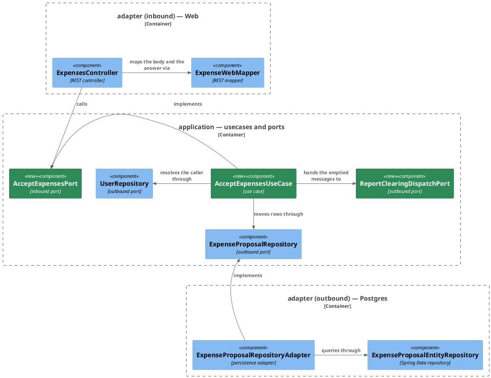
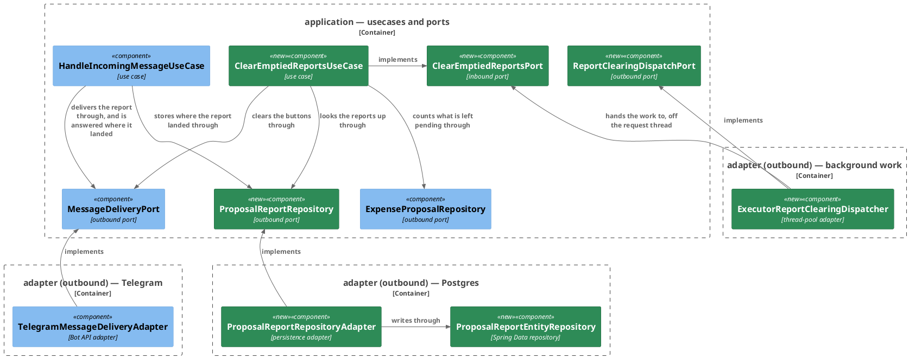

# Plan: Accept Expenses from the Web App — `ledger-service`

**Affected Modules:** `ledger-service`
**Design:** [Accept Expenses from the Web App](../design.md)

## Components

The design named responsibilities; these are the classes that hold them. Two subjects, no arrow between them
except the proposal repository both reach, so two diagrams.

### Accepting the ticked entries



### Where a report is, and clearing it



### What a box cannot carry

A record with no collaborator of its own is a row here rather than a box in either diagram: the value objects,
the commands, the read models, the entity and the two row types.

| Type                  | Holds                                                                        | Refuses                                                                     |
|-----------------------|-------------------------------------------------------------------------------|------------------------------------------------------------------------------|
| `IncomingMessageId`   | one `String`, `<conversationId>:<inboundMessageId>` where this service derives it | absent, blank, or over 56 bytes (D57)                                     |
| `ProposalIds`         | a `List<Long>`, in the order it was given                                     | empty, over 100, a repeated id, an id below 1 (D4)                          |
| `ProposalReport`      | `id`, `userId`, `incomingMessageId`, `conversationId`, `sentMessageId`        | —                                                                            |
| `AcceptExpensesCommand` | `AuthenticatedUserId userId`, `ProposalIds ids`                             | —                                                                            |
| `ExpenseAcceptance`   | `int accepted`, `int missing`                                                 | —                                                                            |
| `ReportLocation`      | `conversationId`, `sentMessageId`                                             | —                                                                            |
| `ClearEmptiedReportsCommand` | `long userId`, `List<IncomingMessageId> incomingMessageIds`            | —                                                                            |
| `PendingCountProjection` | `incomingMessageId`, `pendingCount`                                          | —                                                                            |
| `ProposalReportEntity` | the `proposal_report` row, mapped one field per column                         | —                                                                            |

| Port                          | Methods                                                                                          |
|-------------------------------|---------------------------------------------------------------------------------------------------|
| `AcceptExpensesPort`          | `ExpenseAcceptance accept(AcceptExpensesCommand command)`                                        |
| `ClearEmptiedReportsPort`     | `void clear(ClearEmptiedReportsCommand command)`                                                 |
| `ReportClearingDispatchPort`  | `void dispatch(ClearEmptiedReportsCommand command)`                                              |
| `ExpenseProposalRepository`   | gains `List<IncomingMessageId> acceptByIds(long userId, ProposalIds ids, Instant now)` and `Set<IncomingMessageId> findWithPendingProposals(long userId, Collection<IncomingMessageId> ids)` |
| `ProposalReportRepository`    | `ProposalReport store(ProposalReport report)`, `List<ProposalReport> findByIncomingMessageId(long userId, IncomingMessageId id)` |
| `MessageDeliveryPort`         | `deliver` answers `Optional<ReportLocation>` instead of nothing; gains `void clearButtons(ReportLocation location)` |

`acceptByIds` answers one element per row it moved, so its size is `accepted` and duplicates in it are two
proposals reported on one message.

| Exception                          | Status | Raised by                                                     |
|------------------------------------|--------|----------------------------------------------------------------|
| `InvalidExpenseAcceptanceException` | 400    | `ProposalIds` — the list is empty, too long, repeats, or holds an id below 1 |
| `MethodArgumentNotValidException`  | 400    | the generated body constraints, mapped by `WebExceptionHandler` (D21) |
| `HttpMessageNotReadableException`  | 400    | a body that is not JSON, mapped by `WebExceptionHandler` (D21) |
| `EntityNotFoundException`          | 404    | `AcceptExpensesUseCase` — the session outlives its user row     |
| `PersistenceFailedException`       | 503    | `ExpenseProposalRepositoryAdapter` — the move failed            |

`SecurityConfiguration` and `WebExceptionHandler` are not drawn: a filter chain and an exception advice belong
to no subject.

## Step-by-Step Implementation Map (To-Do List)

### Stabilization

#### Database

- [x] ST01 · Add `src/main/resources/db/migration/V007__rename_and_widen_incoming_message_id.sql`, exactly as the
  design writes it — three renames, three type widenings and three index renames, no backfill and no new column
  (D49, D52):
  ```sql
  ALTER TABLE expense_proposal RENAME COLUMN message_reference TO incoming_message_id;
  ALTER TABLE expense          RENAME COLUMN message_reference TO incoming_message_id;
  ALTER TABLE spending_query   RENAME COLUMN message_reference TO incoming_message_id;

  ALTER TABLE expense_proposal ALTER COLUMN incoming_message_id TYPE TEXT USING incoming_message_id::text;
  ALTER TABLE expense          ALTER COLUMN incoming_message_id TYPE TEXT USING incoming_message_id::text;
  ALTER TABLE spending_query   ALTER COLUMN incoming_message_id TYPE TEXT USING incoming_message_id::text;

  ALTER INDEX idx_expense_proposal_message_reference RENAME TO idx_expense_proposal_incoming_message;
  ALTER INDEX idx_expense_message_reference          RENAME TO idx_expense_incoming_message;
  ALTER INDEX idx_spending_query_message_reference   RENAME TO idx_spending_query_incoming_message;
  ```
- [x] ST02 · Add `src/main/resources/db/migration/V008__create_proposal_report.sql`. `ON DELETE CASCADE` is
  D55's correction to the design's own block, and matches `V002`, `V003` and `V006`; no unique key, because a
  message reported twice holds a row each (D53):
  ```sql
  CREATE TABLE proposal_report (
      id                  BIGSERIAL PRIMARY KEY,
      user_id             BIGINT      NOT NULL REFERENCES app_user (id) ON DELETE CASCADE,
      incoming_message_id TEXT        NOT NULL,
      conversation_id     TEXT        NOT NULL,
      sent_message_id     TEXT        NOT NULL,
      created_at          TIMESTAMPTZ NOT NULL,
      updated_at          TIMESTAMPTZ NOT NULL
  );

  CREATE INDEX idx_proposal_report_incoming_message ON proposal_report (user_id, incoming_message_id);
  ```

#### Interface-First / Build Stabilization

**Interface & Signature Sync**

- [x] ST03 · Replace `MessageReference` with `IncomingMessageId` across `src/main/java` and `src/test/java`, and
  get the module back to build-green with its suite still passing. The type moves from a `UUID` to a `String`:
  ```java
  /** Identifies one handled message by the message that started it, so a stored row names the turn it came from. */
  public record IncomingMessageId(String value) {

      public static final int MAX_BYTES = 56;

      public IncomingMessageId {
          // present, non-blank, and at most MAX_BYTES bytes in UTF-8 — the bound is bytes, not characters,
          // because it exists to keep `callback_data` inside Telegram's 64 (D57)
      }

      /** Derives the id of a turn from the conversation it arrived in and the message that started it. */
      public static IncomingMessageId of(String conversationId, String inboundMessageId) {
          // joins the two with a colon; mints nothing (D46)
          return null;
      }

      /** Parses a stored or transported value, rejecting an absent, blank or over-long one. */
      public static IncomingMessageId of(String value) {
          return null;
      }
  }
  ```
  `newReference()` goes with the minting it was named for: `HandleIncomingMessageUseCase` calls
  `IncomingMessageId.of(command.conversationId(), command.inboundMessageId())` instead. The sweep reaches the
  entities and queries that bind the column as a `UUID` — `ExpenseProposalEntity`, `SpendingQueryEntity`,
  `ExpenseProposalEntityRepository`, `ExpenseEntityRepository`, `SpendingQueryEntityRepository` — which all bind
  `String` and name `incoming_message_id` afterwards, and the ports, DTOs, domain models, MCP tools and
  renderers that name the type. Rename
  `ledger-service/docs/domain/message-reference.md` to `incoming-message-id.md` in the same step and correct
  what it says the value is (D46, D61), so no page describes a type that no longer exists; every link to it
  moves with it. `docs/implemented/` and the ADRs are left exactly as written. Six test methods assert semantics
  this step retires and cannot be reworked before `RU01` writes their replacements, so each is marked
  `@Disabled("RU01: …")` rather than commented out or left failing
  ([Testing Conventions](../../../ledger-service/docs/conventions/testing.md#test-tooling)):
  `whenCalledTwice_thenBothCarryNonNullUuidAndAreNotEqual()`,
  `whenCalledWithCanonicalUuidText_thenValueEqualsUuidAndRoundTrips()`,
  `whenCalledWithInvalidText_thenThrowsInvalidIncomingMessageException(String)`,
  `whenReadOnReferenceBuiltFromKnownUuid_thenReturnsThatUuid()` and
  `whenCanonicalConstructorCalledWithNullUuid_thenThrowsInvalidIncomingMessageException()` in what becomes
  `IncomingMessageIdTest`, and
  `whenEitherResolutionAndReferenceAreRendered_thenResultIsAtMost64Bytes()` in `ProposalCallbackDataTest`. The
  rest of the suite passes.
- [x] ST04 · Rename the caller token's claim from `mrf` to `imi` in `AccessTokenMinter` and `AuthenticatedCaller`
  (D61), and in the two test classes that own the literal themselves: the `McpTokens` fixture that mints one, and
  `bot.finance.system.ReceiveTelegramMessageSystemTest`, which declares the claim name, reads it back and parses
  it with `UUID.fromString` — that parse goes with the type. `AuthenticatedCaller.messageReference()` becomes
  `incomingMessageId()`.
- [x] ST05 · Add `ReportLocation` to `application/dto` and change `MessageDeliveryPort`:
  ```java
  /**
   * @throws InvalidIncomingMessageException if the report is absent
   * @throws MessageDeliveryFailedException if delivery fails
   */
  Optional<ReportLocation> deliver(TurnReport report);

  /**
   * @throws MessageDeliveryFailedException if the edit fails
   */
  void clearButtons(ReportLocation location);
  ```
  In `TelegramMessageDeliveryAdapter`, keep every line `deliver` already runs and add a `TODO GI03` at the
  return describing what it must answer — the chat and the message id Telegram gave the report, and nothing at
  all where the report carried no buttons (D41). Stub `clearButtons` with an inline comment saying it takes the
  keyboard off the named message and leaves its text as sent. Update the call site in
  `HandleIncomingMessageUseCase` to consume the `Optional` and get back to build-green.
- [x] ST06 · Add to `ExpenseProposalRepository`, with the same javadoc shape the port already uses:
  ```java
  /**
   * @throws PersistenceFailedException if the write fails
   */
  List<IncomingMessageId> acceptByIds(long userId, ProposalIds ids, Instant now);

  /**
   * @throws PersistenceFailedException if the read fails
   */
  Set<IncomingMessageId> findWithPendingProposals(long userId, Collection<IncomingMessageId> ids);
  ```
  Stub both on `ExpenseProposalRepositoryAdapter`, each with an inline comment naming the statement it will run.
  The design writes both against `message_reference`, which `ST01` renames, so they are restated here over
  `incoming_message_id`: one `DELETE … RETURNING` / `INSERT … RETURNING` chain narrowed by `user_id` and
  `id IN (:ids)`, answering the `incoming_message_id` of every row it moved; and
  `SELECT incoming_message_id, count(*) FROM expense_proposal WHERE user_id = :userId AND incoming_message_id IN
  (:incomingMessageIds) GROUP BY incoming_message_id`. Add `PendingCountProjection` beside the other projections.
- [x] ST07 · Add `domain/model/ProposalReport` implementing `Entity`, `application/port/ProposalReportRepository`,
  and stubs for `ProposalReportRepositoryAdapter`, `ProposalReportEntity` and `ProposalReportEntityRepository`.
  Each stub body says what it will do: store one row per delivered report and never update one, and answer every
  row recorded for a message (D53).
- [x] ST08 · Add the acceptance's core types and stub them: `domain/value/ProposalIds`,
  `domain/exception/InvalidExpenseAcceptanceException`, `application/dto/AcceptExpensesCommand`,
  `application/dto/ExpenseAcceptance`, `application/port/AcceptExpensesPort`,
  `application/usecase/AcceptExpensesUseCase`. Add `ExpenseWebMapper.toAcceptExpensesCommand(...)` and
  `ExpenseWebMapper.toAcceptanceResponse(...)` — both are straight mappings with no branch, so they are written
  here and get no red-phase step of their own — and implement `ExpensesController.acceptExpenses` against them
  and the port, overriding the generated interface's `default`. The generator renames both schemas after the
  operation, as `shared/plan.md` ST04 read back, so the signature is
  `ResponseEntity<AcceptExpenses200Response> acceptExpenses(AcceptExpensesRequest acceptExpensesRequest)` —
  neither `AcceptanceRequest` nor `Acceptance` exists as a Java type. `AcceptExpensesUseCase`'s stub body says what it
  will do, D17's line included: one line at info per acceptance, carrying the resolved user, how many moved and
  how many named nothing.
- [x] ST09 · Add the clearing's core types and stub them: `application/dto/ClearEmptiedReportsCommand`,
  `application/port/ClearEmptiedReportsPort`, `application/usecase/ClearEmptiedReportsUseCase`,
  `application/port/ReportClearingDispatchPort`, and `adapter/async/ExecutorReportClearingDispatcher`
  implementing the last against an injected `Executor`. `ClearEmptiedReportsUseCase`'s stub body says what it
  will do, D17's lines included: one line per message it cleared, and a warn for each one it could not. `async`
  is a new adapter subpackage fronting no external system, as `logging` already is, so add it to the package
  tree in
  [Architecture & Layering](../../../ledger-service/docs/conventions/architecture.md#package-structure) with a
  one-line gloss, the way every other subpackage there is listed.
- [x] ST10 · Add `WebExceptionHandler` handlers for `MethodArgumentNotValidException` and
  `HttpMessageNotReadableException`, each answering 400 with a `message` naming the field and the bound it broke
  (D21), and one for `InvalidExpenseAcceptanceException` answering 400 with the exception's own message, as
  `InvalidExpenseFilterException` already does.
- [x] ST11 · Declare the beans: `AcceptExpensesPort` and `ClearEmptiedReportsPort` in `UseCaseConfiguration`,
  each taking `Clock.systemUTC()` and the repositories it needs, as every bean there already does.

**Configuration**

- [x] ST12 · Add `adapter/async/ReportClearingProperties` and the `@Bean` that builds the bounded pool it
  configures, in the same subpackage, and set the rejection policy so a pool with no room drops the work rather
  than blocking or running it on the caller's thread (D24). Every bound is named in the environment (Q2): core
  size, max size and queue capacity each get a variable and a row in
  [`ledger-service/docs/configuration.md`](../../../ledger-service/docs/configuration.md), in that table's shape,
  defaulting to a core of 1, a max of 2 and a queue of 100 — one operator's own chats, and a queue that absorbs
  the largest acceptance the endpoint allows. The thread-name prefix is fixed in code, not configured.
- [x] ST13 · Add `POST /api/v1/expenses/acceptances` to `SecurityConfiguration`'s web-session chain as
  `.authenticated()`, beside the four matchers already there. Without it `anyRequest().denyAll()` answers the
  new path.

**Shared Test Infrastructure**

- [x] ST14 · Add `bot.finance.common.rows.ProposalReportRowUtils` — stores a report row for a user and message
  and reads a user's rows back — and list it in
  [Testing Conventions](../../../ledger-service/docs/conventions/testing.md#package-structure) beside the other
  `rows` helpers. `RI02`, `RI03` and `RS01` all need it.
- [x] ST15 · Add a bot token constant for `RS01` to `bot.finance.common.stubs.TelegramTestBot`, so its clearing
  reaches a stub path no other class can. Seeding a proposal already answers its generated id —
  `ExpenseProposalRowUtils.storedProposal(...)` returns the inserted entity — so nothing there needs extending.
- [x] ST16 · Confirm `bot.finance.architecture.CleanArchitectureTest` still passes, and that the pre-existing
  suite is green: `tools/agent-test/agent-test.sh --module ledger-service`.

### Red Phase

#### TDD Unit Red Phase

- [x] RU01 · `IncomingMessageId` · test: `IncomingMessageIdTest` · covers: `of(String, String)`, `of(String)` ·
  scenarios: A27, A29, A30
    - `of(String, String)`:
        - given: a conversation id and an inbound message id
          when: of() is called with both
          then: the value is the two joined by a colon, and two calls with the same pair are equal
        - given: two conversations naming the same inbound message id for one person
          when: of() is called for each
          then: the two values differ
    - `of(String)`:
        - given: the canonical text of a UUID, as a report already in a chat carries it
          when: of() is called
          then: the value is accepted and reads back byte for byte
        - given: a value of exactly 56 bytes in UTF-8
          when: of() is called
          then: it is accepted
        - given: a value of 57 bytes in UTF-8
          when: of() is called
          then: InvalidIncomingMessageException is thrown
        - given: a null value, and a blank one
          when: of() is called
          then: InvalidIncomingMessageException is thrown for each
        - update: `whenCalledTwice_thenBothCarryNonNullUuidAndAreNotEqual()` — `newReference()` is gone, so
          delete this method rather than reworking it; nothing mints a reference any more
        - update: `whenCalledWithCanonicalUuidText_thenValueEqualsUuidAndRoundTrips()` — rewrite it over the
          `String` component: the canonical text of a UUID is now carried as given rather than parsed into one
        - update: `whenCalledWithInvalidText_thenThrowsInvalidIncomingMessageException(String)` — drop
          `"not-a-uuid"` from its `@ValueSource`, which the new type accepts, and keep the blank case
        - update: `whenReadOnReferenceBuiltFromKnownUuid_thenReturnsThatUuid()` and
          `whenCanonicalConstructorCalledWithNullUuid_thenThrowsInvalidIncomingMessageException()` — both call
          the canonical constructor with a `UUID`; rewrite both over the `String` component, the second asserting
          the refusal of a null one
        - update: `whenEitherResolutionAndReferenceAreRendered_thenResultIsAtMost64Bytes()` in
          `ProposalCallbackDataTest` — its `resolutionsWithExpectedByteLength()` source pins the payload at
          exactly 43 and 44 bytes, which are the UUID form's; replace those arguments with the derived form's
          lengths and keep the assertion that neither exceeds 64 (D51)
        - update: `whenParsingAcceptColonNotAUuid_thenReturnsEmptyAndThrowsNothing()` in
          `ProposalCallbackDataTest` — a reference is now opaque text, so a non-UUID payload parses rather than
          answering empty; rework it to assert that `accept:777:123` parses to ACCEPT and that id, and that a
          payload with no colon at all still answers empty
        - update: `whenAcceptAndReferenceAreRendered_thenReturnsAcceptFollowedByCanonicalUuidText()` and
          `whenDiscardAndReferenceAreRendered_thenReturnsDiscardFollowedByCanonicalUuidText()` in
          `ProposalCallbackDataTest` — render now writes a derived id rather than canonical UUID text, so assert
          each verb's payload over a derived value
        - update: `whenParsingPayloadRenderAcceptProduced_thenReturnsParsedCallbackCarryingAcceptAndSameReference()`
          in `ProposalCallbackDataTest` — assert the round trip over a derived value as well as over the UUID
          text an old report still carries (A29, D48)
- [x] RU02 · `ProposalIds` · test: `ProposalIdsTest` · covers: `of(List)` · scenarios: A6
    - `of(List)`:
        - given: a list of two distinct ids above 0
          when: of() is called
          then: the value carries both, in the order they were given
        - given: exactly 100 distinct ids
          when: of() is called
          then: it is accepted
        - given: an empty list, a null list, 101 ids, a list holding the same id twice, a list holding 0, and a
          list holding a negative id
          when: of() is called for each
          then: InvalidExpenseAcceptanceException is thrown, and its message names the field and the bound it
          broke
- [x] RU03 · `AcceptExpensesUseCase` · test: `AcceptExpensesUseCaseTest` · covers: `accept()` · scenarios: A1,
  A3, A5, A9
    - `accept()`:
        - given: a stored user and a move that answers one id per proposal, for two ids posted
          when: accept() is called
          then: the answer carries accepted 2 and missing 0, and the repository was asked to move exactly the
          posted ids for the stored user's id
        - given: a stored user and a move that answers nothing, for two ids posted
          when: accept() is called
          then: the answer carries accepted 0 and missing 2, and the clearing is never dispatched
        - given: a stored user and a move that answers one id for three posted
          when: accept() is called
          then: accepted plus missing equals three
        - given: a move answering two rows reported on one message and one on another
          when: accept() is called
          then: the dispatched command carries the caller's stored id and each message once
        - given: no user row for the caller's external id
          when: accept() is called
          then: EntityNotFoundException is thrown and nothing is moved or dispatched
        - given: a repository that throws PersistenceFailedException
          when: accept() is called
          then: it propagates and nothing is dispatched
        - given: a null command
          when: accept() is called
          then: the module's own absent-argument exception is thrown and no port is touched
- [x] RU04 · `ClearEmptiedReportsUseCase` · test: `ClearEmptiedReportsUseCaseTest` · covers: `clear()` ·
  scenarios: A11, A12, A13, A21, A31
    - `clear()`:
        - given: one message, nothing left pending under it, and one report recorded for it
          when: clear() is called
          then: the buttons are taken off exactly that report's conversation and sent message, and nothing else
          is sent
        - given: one message that still has a pending proposal under it
          when: clear() is called
          then: nothing is sent for it
        - given: two messages, one emptied and one still pending
          when: clear() is called
          then: only the emptied one's report is cleared
        - given: an emptied message with two reports recorded for it
          when: clear() is called
          then: the buttons come off both, in the order they were recorded
        - given: an emptied message with no report recorded
          when: clear() is called
          then: nothing is sent, and the remaining messages are still cleared
        - given: the counts read throws PersistenceFailedException
          when: clear() is called
          then: nothing is sent, and nothing propagates out of clear()
        - given: Telegram refuses the first of two clearings with MessageDeliveryFailedException
          when: clear() is called
          then: the second is still attempted, and nothing propagates out of clear()
        - given: a command carrying no message ids
          when: clear() is called
          then: neither repository is read and nothing is sent
- [x] RU05 · `ExecutorReportClearingDispatcher` · test: `ExecutorReportClearingDispatcherTest` ·
  covers: `dispatch()` · scenarios: A13
    - `dispatch()`:
        - given: an executor that runs what it is handed
          when: dispatch() is called
          then: the clearing port receives exactly the command it was given
        - given: an executor that refuses the work with RejectedExecutionException
          when: dispatch() is called
          then: nothing propagates to the caller and the clearing port is never reached
        - given: a clearing port that throws
          when: dispatch() is called and the executor runs the work
          then: nothing propagates to the caller
- [x] RU06 · `HandleIncomingMessageUseCase` · test: `HandleIncomingMessageUseCaseTest` · covers: `handle()` ·
  scenarios: A20, A27, A28
    - `handle()`:
        - given: a command naming a conversation and an inbound message
          when: handle() is called
          then: the reference every read and the report carry is that conversation and that message joined, and
          two runs of the same command produce the same one
        - given: a delivery that answers where the report landed
          when: handle() is called
          then: one report row is stored against the turn's own message id, carrying the conversation and the
          sent message the delivery answered
        - given: a delivery that answers nothing, because the report carried no buttons
          when: handle() is called
          then: no report row is stored and the turn still succeeds
        - given: a report row that cannot be stored
          when: handle() is called
          then: the turn still succeeds and nothing propagates (D63)
        - update: `whenHandleIsCalled_thenTheReferenceItMintsReachesBothReadBacks()` — the reference is derived rather than minted,
          so this method's premise is gone; rework it to assert that the value both read-backs receive is the one
          derived from the command, and rename it accordingly
        - update: `whenReportReachesTheUser_thenPeriodsAskedAboutAreDiscarded()` — `deliver` now answers an
          `Optional<ReportLocation>`, so every test in this class that stubs the delivery port needs the stub to
          answer one rather than null; arrange it once for the class and assert here that the discard still runs
        - update: `whenReportCannotBeDelivered_thenPeriodsAskedAboutAreKept()` — the delivery throws before it
          answers, so assert additionally that no report row is stored
        - update: `whenDeliverThrowsMessageDeliveryFailedException_thenExceptionPropagates()` — assert
          additionally that the report repository is untouched

#### TDD Integration Red Phase

- [x] RI01 · `ExpenseProposalRepositoryAdapter` · test: `ExpenseProposalRepositoryAdapterTest` ·
  covers: `acceptByIds()`, `findWithPendingProposals()` · scenarios: A1, A2, A3, A4, A5, A14
    - `acceptByIds()`:
        - given: two of the person's pending proposals, reported on one message
          when: acceptByIds() is called with both ids
          then: both rows are gone from expense_proposal, two expense rows hold their description, merchant,
          amount, currency and category, both carry the message they were reported on, and the answer holds that
          message twice
        - given: one pending proposal of the person's
          when: acceptByIds() is called with its id alone
          then: that one row moves, the answer holds one message, and the expense it became still carries the
          message it was reported on, which is what a later tap counts (A14)
        - given: two proposals reported on two different messages
          when: acceptByIds() is called with both ids
          then: the answer holds each message once
        - given: the same ids accepted a moment earlier
          when: acceptByIds() is called again with them
          then: the answer is empty and no second expense row is stored
        - given: an id naming another person's pending proposal
          when: acceptByIds() is called with it
          then: the answer is empty and that person's row still stands
        - given: an id naming one of the caller's recorded expenses rather than a proposal
          when: acceptByIds() is called with it
          then: the answer is empty and nothing is written
        - given: a proposal and the instant the acceptance runs at
          when: acceptByIds() is called
          then: the stored expense's created_at and updated_at are both that instant (D13)
        - given: this is the first statement in the module to answer rows out of a data-modifying query (D16)
          when: acceptByIds() is run against the containerized Postgres
          then: observe what the driver actually returns before writing the assertion, and report a driver that
          refuses the shape as a blocker rather than working around it
    - `findWithPendingProposals()`:
        - given: two messages, one still holding a pending proposal and one holding none
          when: findWithPendingProposals() is called with both
          then: only the message that still holds one is answered
        - given: a message whose only remaining proposal belongs to another person
          when: findWithPendingProposals() is called for the caller
          then: it is not answered
        - given: an empty collection of message ids
          when: findWithPendingProposals() is called
          then: the answer is empty and no statement is run (D20)
- [x] RI02 · `ProposalReportRepositoryAdapter` · test: `ProposalReportRepositoryAdapterTest` · covers:
  `store()`, `findByIncomingMessageId()` · scenarios: A20, A21, A31
    - `store()`:
        - given: a person and a report they were sent
          when: store() is called
          then: one row holds the conversation, the sent message and the message the report is about, and the
          answer carries the generated id
        - given: a report already stored for a message
          when: store() is called again for the same message with a different sent message id
          then: a second row is stored and neither insert failed on the other (D53)
        - given: a user id naming no stored person
          when: store() is called
          then: EntityNotFoundException is thrown, as the other adapters classify a foreign-key violation
    - `findByIncomingMessageId()`:
        - given: two reports recorded for one message and one for another
          when: findByIncomingMessageId() is called for the first
          then: both of its reports are answered and the other message's is not
        - given: a message no report was ever recorded for
          when: findByIncomingMessageId() is called
          then: the answer is empty
        - given: another person's report for the same message id
          when: findByIncomingMessageId() is called for the caller
          then: it is not answered
- [x] RI03 · `TelegramMessageDeliveryAdapter` · test: `TelegramMessageDeliveryAdapterTest` · covers:
  `deliver()`, `clearButtons()` · scenarios: A11, A13, A20
    - `deliver()`:
        - given: a report carrying proposals, and a Telegram that accepts the send and answers the message it
          created
          when: deliver() is called
          then: the answer carries the chat and the message id Telegram gave it
        - update: `whenCalledWithNothingIdentifiedReport_thenSendMessageCarriesNoReplyMarkupFormParam()` — a
          report with no keyboard now answers nothing rather than returning void; assert additionally that the
          answer is empty, and leave what it already proves alone (D41)
    - `clearButtons()`:
        - given: a conversation and a sent message, and a Telegram that accepts the edit
          when: clearButtons() is called
          then: one editMessageReplyMarkup names that chat and that message and carries no keyboard, and no text
          is sent with it
        - given: a Telegram that refuses the edit
          when: clearButtons() is called
          then: MessageDeliveryFailedException is thrown
- [x] RI04 · `ExpensesController` · test: `ExpensesControllerTest` · covers: `POST /api/v1/expenses/acceptances`
  · mocks: `AcceptExpensesPort` · scenarios: A1, A6, A9, A10
    - Happy Path:
        - given: the mocked port answers accepted 2 and missing 0
          when: the request posts two ids
          then: the port is called with a command carrying the caller and those two ids in order, and the
          response is 200 with accepted 2 and missing 0
    - Error Mapping:
        - given: the mocked port throws InvalidExpenseAcceptanceException
          when: the request posts a list of ids
          then: the response is 400 carrying the exception's own message
    - Validation: `ids` — absent, null, an empty array, 101 ids, an id of 0, an id below 0, a repeated id, a
      value that is not a number, and a body that is not JSON at all; each answers 400 with a `message` naming
      what was refused, and the port is never called

- [x] RI05 · `WebExceptionHandler` · test: `WebExceptionHandlerTest` · covers: the two mappings every endpoint
  with a body shares · mocks: `AcceptExpensesPort` · scenarios: A6
    - Error Mapping:
        - given: a request body whose declared bounds are broken, so the framework raises
          MethodArgumentNotValidException before any port is reached
          when: the request is made
          then: the response is 400 and its `message` names the field and the bound it broke
        - given: a request body that is not JSON at all, so the framework raises HttpMessageNotReadableException
          when: the request is made
          then: the response is 400 and its `message` says the body could not be read, naming no stack frame
  This class holds what holds for every caller, and its javadoc says the endpoint it enters through asserts
  nothing about itself. `ids`'s own matrix stays on `RI04`.

#### TDD System Test Red Phase

- [x] RS01 · `AcceptExpensesSystemTest` · covers: `POST /api/v1/expenses/acceptances` · scenarios: A1, A7, A8,
  A11
    - Happy Path:
        - given: a signed-in person, two pending proposals reported on one message, and that report's location
          recorded, with Telegram stubbed to accept the edit
          when: the ids of both are posted with the session cookie and the CSRF token
          then: the response is 200 with accepted 2 and missing 0, a later listing shows both as RECORDED and
          neither as PENDING, and the buttons come off that report without its text being resent
    - Unhappy Path:
        - given: no session cookie
          when: a list of ids is posted
          then: the response is 401 and nothing is moved
        - given: a valid session cookie and no CSRF token
          when: a list of ids is posted
          then: the response is 403 and nothing is moved

### Green Phase

#### TDD Unit Green Phase

- [x] GU01 · `IncomingMessageId` · test: `IncomingMessageIdTest`
- [x] GU02 · `ProposalIds` · test: `ProposalIdsTest`
- [x] GU03 · `AcceptExpensesUseCase` · test: `AcceptExpensesUseCaseTest` · after: GU01, GU02
- [x] GU04 · `ClearEmptiedReportsUseCase` · test: `ClearEmptiedReportsUseCaseTest` · after: GU01
- [x] GU05 · `ExecutorReportClearingDispatcher` · test: `ExecutorReportClearingDispatcherTest` · after: GU01
- [x] GU06 · `HandleIncomingMessageUseCase` · test: `HandleIncomingMessageUseCaseTest` · after: GU01

#### TDD Integration Green Phase

- [x] GI01 · `ExpenseProposalRepositoryAdapter` · test: `ExpenseProposalRepositoryAdapterTest` · after: GU01, GU02
- [x] GI02 · `ProposalReportRepositoryAdapter` · test: `ProposalReportRepositoryAdapterTest` · after: GU01
- [x] GI03 · `TelegramMessageDeliveryAdapter` · test: `TelegramMessageDeliveryAdapterTest` · after: GU01
- [x] GI04 · `ExpensesController` · test: `ExpensesControllerTest` · covers:
  `POST /api/v1/expenses/acceptances` · mocks: `AcceptExpensesPort` · after: GU02
- [x] GI05 · `WebExceptionHandler` · test: `WebExceptionHandlerTest`

#### TDD System Test Green Phase

- [x] GS01 · `AcceptExpensesSystemTest` · covers: `POST /api/v1/expenses/acceptances`

### Post-Implementation Steps

#### Manual Request Files

- [x] P01 · Add the acceptance request to `ledger-service/docs/requests/expenses.http`, in that file's shape:
  the session cookie, the CSRF header, and a body carrying two ids.

#### ADRs

- [x] P02 · Write ADR: a turn is named by the message that started it, not by a value minted beside it. It is
  ledger-service ADR 0015, carries `Supersedes: 0010`, and flips
  [ADR 0010](../../../ledger-service/docs/adr/0010-a-message-reference-rides-the-caller-token-not-the-extraction-request.md)'s
  `Status:` to `Superseded by ADR 0015`, touching nothing else in it (D47, Q1).

## Open Questions / Blockers

- **Q1:** ADR 0010 is superseded by this change (D47), which needs an ADR of its own — *a turn is named by the
  message that started it, not by a value minted beside it* — as ledger-service ADR 0015, with `Supersedes: 0010`
  and 0010's `Status:` flipped to `Superseded by ADR 0015`. Without it, the fact lives only on the renamed domain
  page `incoming-message-id.md`, and ADR 0010 stays standing while stating something no longer true. Write it?
  - A: Yes, write it. `P02` carries it.

- **Q2:** The clearing pool's bounds (ST12) have no precedent in this module — it is the first background work
  here — and 100 ids may name up to 100 distinct messages in one acceptance (D4, D24). Are a core of 1, a max of
  2, a queue of 100 and a caller-drops rejection policy the right shape for a deployment that is one operator's
  own chats, or should they be named in the environment with different defaults?
  - A: Name every bound in the environment. Core size, max size and queue capacity each become a variable in
    `docs/configuration.md`, defaulting to a core of 1, a max of 2 and a queue of 100, so a deployment can raise
    them without a rebuild.

- **Q3:** D16 is deferred: no statement in this module answers rows out of a `DELETE … RETURNING` /
  `INSERT … RETURNING` chain today, so RI01's first scenario observes the driver before anything is asserted
  against it. If Spring Data JDBC refuses the shape, the design's fallback reopens the race D15 closes and the
  decision goes back to the design. Confirm that a refusal is reported as a blocker rather than worked around?
  - A: Yes. A driver that refuses the shape stops the step and is reported as a blocker; the fallback is not
    taken without the design deciding it.
  - Observed in `GI01`: the driver does not refuse it. The chain runs as one `@Query` without `@Modifying`,
    written as `WITH accepted AS (DELETE … RETURNING …) INSERT … SELECT … FROM accepted RETURNING
    incoming_message_id`, and Spring Data JDBC maps the returned column into a `List<String>` the way the
    repository's other row-returning queries already are. The fallback is not taken and the design stands.

- **B1:** Stabilization gave `HandleIncomingMessageUseCase` no `ProposalReportRepository`, though `RU06` asserts a
  report row is stored, none is stored where the delivery answers nothing, and a row that cannot be stored does not
  fail the turn (D63). `ST05` updated only the call site and `ST07` only added the port, so no step wired the
  collaborator. Corrected during the red phase: the port is now a constructor dependency of the use case, wired in
  `UseCaseConfiguration`, with the storing left to `GU06` as a stub comment.

- **B2:** `RS01`'s no-CSRF-token scenario answers 500 where it should answer 403, and the cause is in
  `SecurityConfiguration` rather than in anything this plan wrote. `AccessDeniedHandlerImpl` refuses the write with
  `sendError(403)`, which the container forwards to `/error`; that forward matches no `securityMatcher`, so the
  order-2 MCP chain claims it and its `anyRequest().denyAll()` denies the error page itself, and the client gets a
  500 with the 403 already computed and thrown away. The order-1 chain's 401 path never shows it, because an entry
  point writes the status directly instead of forwarding — which is why the existing sign-in test passes and this
  is the first authenticated write to hit it. Left red for `GS01`, which owns production fixes across the stack;
  the fix is a `securityMatcher` on the MCP chain, or letting `/error` through it.
  - `GS01` fixed it, and found a second defect behind it: `oauth2ResourceServer()` registers a CSRF exemption for
    every request its bearer-token resolver recognizes, which is sound for a token read off the `Authorization`
    header and wrong here, because this service's resolver reads the session **cookie** — the one thing a forged
    cross-site request carries by itself. Every write on `/api/**` was therefore CSRF-exempt. The exemption cannot
    be un-registered through the DSL, so the session chain now disables `csrf()` and installs its own `CsrfFilter`
    after authentication.

- **B3 (open — needs a decision):** what a write refused for a missing CSRF token answers, which two pre-existing
  tests and one contract do not agree on.
  - [`web-session-api.md`](../../../ledger-service/docs/contracts/in/web-session-api.md) says **403, before the
    request reaches the endpoint**, and `SessionControllerTest.whenTheRequestCarriesNoCsrfToken_thenTheSignInIsRefused`
    asserts 403.
  - `WebSessionSystemTest.whenAGenuinePayloadIsPostedWithoutACsrfToken_thenItIsRefusedAndNoUserIsStored` asserts
    **401** — which only ever passed because B2 was turning the computed 403 into something else, so it is an
    assertion written against the bug.
  - `RS01` asserts **401** for a request carrying no session cookie at all, and that one is authentication, not
    CSRF.
  The lever `GS01` chose is whether the caller is authenticated: authenticated and refused is 403, unauthenticated
  is 401. That satisfies both system tests and contradicts the contract and the slice test, which is why
  `SessionControllerTest` is the one test left red. Answering the contract instead means keying on whether the path
  is `permitAll` or `authenticated` rather than on the caller. The endpoint's documented contract is the thing that
  should decide, and it is not this plan's to rewrite.
  - A: A write refused for a missing CSRF token always answers **403**, whoever sent it. The answer keys on the
    request, not on the caller: a missing token is a property of the request, so one condition keeps one meaning.
    The contract stands unchanged and so does `SessionControllerTest` at 403; the authenticated-vs-anonymous lever
    comes out of `csrfDeniedHandler()`. `WebSessionSystemTest`'s 401 becomes 403 — that assertion was written
    against B2 and never described intended behaviour, so correcting it weakens nothing. `RS01`'s 401 for a
    request carrying no session cookie at all stands: that is authentication, not CSRF, and the two keep
    answering differently.
  - **Resolved:** always 403. A missing CSRF token is a property of the request, not of who sent it, so one
    condition keeps one meaning. `web-session-api.md` and `SessionControllerTest` stand unchanged.
    `WebSessionSystemTest.whenAGenuinePayloadIsPostedWithoutACsrfToken_thenItIsRefusedAndNoUserIsStored` changes
    from 401 to 403, which is honest: that assertion was written against B2. `RS01`'s 401 for a request carrying
    no session cookie stands — that is authentication, not CSRF. The web-app therefore keeps 401 meaning that a
    session went away, and nothing else.

## Review Findings

- **F1:** RU01 carried no `update:` bullet for `MessageReferenceTest`'s five methods, every one of which asserts
  semantics the rename retires.
  - Resolution: mechanical
  - Action: applied — a bullet each under RU01, deleting the minting test and rewriting the rest over the
    `String` component.

- **F2:** RU01 missed `whenEitherResolutionAndReferenceAreRendered_thenResultIsAtMost64Bytes()`, whose
  `@MethodSource` pins the payload at exactly 43 and 44 bytes — the UUID form's lengths.
  - Resolution: mechanical
  - Action: applied — added as an `update:` bullet under RU01, and the two render bullets no longer claim the
    64-byte assertion.

- **F3:** ST03 promised a green suite while leaving those six methods asserting the old semantics.
  - Resolution: mechanical
  - Action: applied — ST03 names each one and marks it `@Disabled("RU01: …")`.

- **F4:** ST04 renamed the `mrf` claim without naming `ReceiveTelegramMessageSystemTest`, which owns the literal
  and parses the claim with `UUID.fromString`.
  - Resolution: mechanical
  - Action: applied — ST04 names it.

- **F5:** ST06 pointed at the design's SQL, written against `message_reference`, the column ST01 renames.
  - Resolution: mechanical
  - Action: applied — both statements restated in ST06 over `incoming_message_id`.

- **F6:** RI04 re-listed the 404 and 503 mappings `WebExceptionHandlerTest` already owns.
  - Resolution: mechanical
  - Action: applied — both dropped; only `InvalidExpenseAcceptanceException` → 400 stays.

- **F7:** RI03 re-listed two `deliver()` scenarios `TelegramMessageDeliveryAdapterTest` already covers.
  - Resolution: mechanical
  - Action: applied — the refusal scenario dropped, the no-keyboard one turned into an `update:` bullet.

- **F8:** No step covered the two new `WebExceptionHandler` mappings, which every endpoint with a body shares.
  - Resolution: decision
  - Action: resolved against the repository — [Testing Conventions](../../../ledger-service/docs/conventions/testing.md#testing-style)
    puts what holds for every caller in the shared component's own test, and `WebExceptionHandlerTest` already
    enters through `ExpensesController` on exactly those terms. Added `RI05` and `GI05`; `ids`'s own matrix stays
    on `RI04`.

- **F9:** GU05 carried no `after:` though its test builds a command holding `IncomingMessageId`.
  - Resolution: mechanical
  - Action: applied — `after: GU01`.

- **F10:** ST15's first half asked for work `ExpenseProposalRowUtils.storedProposal(...)` already does.
  - Resolution: mechanical
  - Action: applied — cut; ST15 is the bot-token constant alone.

- **F11:** `adapter/async` is a subpackage the module's architecture conventions neither list nor sanction.
  - Resolution: decision
  - Action: resolved against the repository — `adapter/logging` is already an adapter fronting no external
    system, so "one subpackage per external system" is not the only way one is created; the list is what has to
    keep up. ST09 now adds `async` to the package tree in that conventions file.

- **F12:** D17's three log lines reached no step.
  - Resolution: mechanical
  - Action: applied — named in ST08's and ST09's stub intent, so the green steps implement them.

- **F13:** The bound is 56 bytes in D57 and 56 characters in RU01's scenarios.
  - Resolution: mechanical
  - Action: applied — `MAX_BYTES`, and both scenarios worded in bytes.
