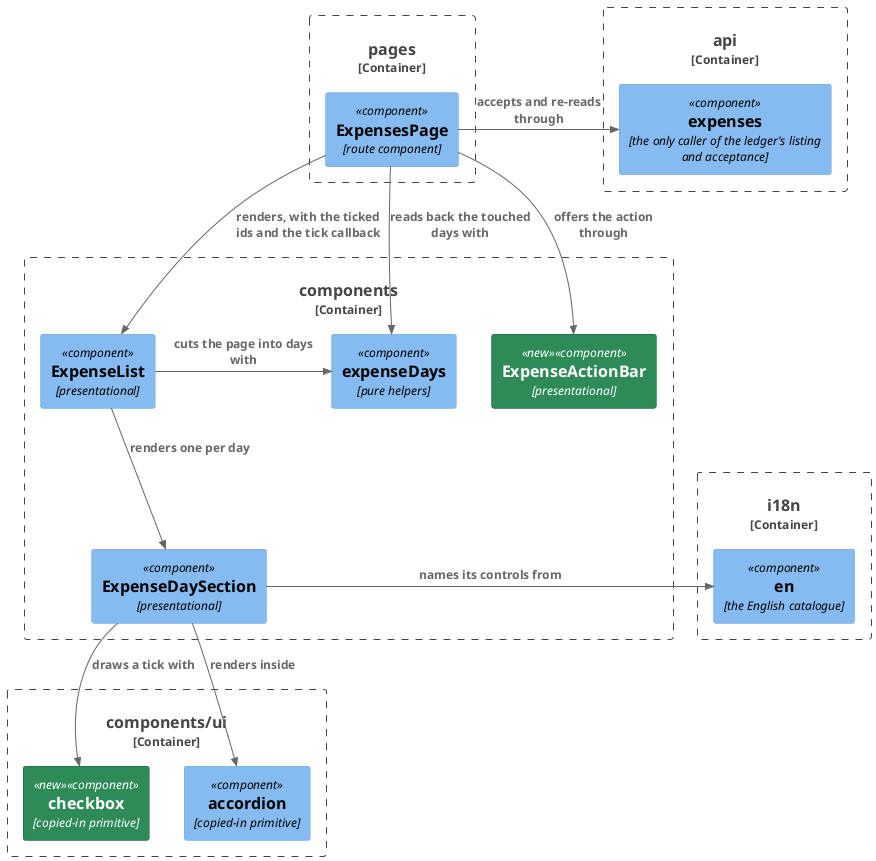

# Plan: Accept Expenses from the Web App — `web-app`

**Affected Modules:** `web-app`
**Design:** [Accept Expenses from the Web App](../design.md)

## Components

The design named surfaces; these are the files that hold them. The module has no layers to enforce, so the
boundaries below are its own directories.



`ExpenseActionBar` and every component above read the catalogue; only the section's arrow is drawn, since a line
from each of them to it is the fan that makes the rest unreadable.

| File                             | Gains                                                                                            |
|----------------------------------|---------------------------------------------------------------------------------------------------|
| `api/expenses.ts`                | `acceptExpenses(ids: number[]): Promise<Acceptance>` and the `Acceptance` type, from the generated schema |
| `components/ui/checkbox.tsx`     | the Radix checkbox copied in as source, `lucide-react` drawing the tick, no package added (D35)  |
| `components/ui/accordion.tsx`    | a slot in the header row, beside the trigger and outside it (D43)                                 |
| `components/expenseDays.ts`      | `pendingIdsOf(day)`, the UTC days a set of ticked entries sits on, and the day merge D32 asks for  |
| `pages/ExpensesPage.tsx`         | the ticked ids, the acceptance call and its busy flag, the `missing` sentence, and the day merge  |
| `components/ExpenseActionBar.tsx` | a row that always stands, holding the action only while something is ticked (D30)                |
| `i18n/en.ts`                     | the checkbox label, the day checkbox's label, the action, the ticked count, and what a partly stale selection is told |

| Prop                                | Carried by                              | Holds                                                     |
|-------------------------------------|-----------------------------------------|-------------------------------------------------------------|
| `tickedIds: ReadonlySet<number>`    | `ExpenseList`, `ExpenseDaySection`      | the ids of ticked `PENDING` entries, owned by the page      |
| `onTick: (id: number, ticked: boolean) => void` | `ExpenseList`, `ExpenseDaySection` | one entry ticked or unticked                        |
| `onTickDay: (ids: number[], ticked: boolean) => void` | `ExpenseList`, `ExpenseDaySection` | a whole day ticked or unticked (D18)           |
| `atBound: boolean`                  | `ExpenseList`, `ExpenseDaySection`      | 100 are ticked, so every unticked checkbox is disabled (Q1) |
| `count: number`                     | `ExpenseActionBar`                      | how many are ticked; zero hides the action, never the row   |
| `onAccept: () => void`              | `ExpenseActionBar`                      | the person accepting                                         |
| `busy: boolean`                     | `ExpenseActionBar`                      | the call is out, so the action is disabled                  |

## Step-by-Step Implementation Map (To-Do List)

### Stabilization

#### Interface-First / Build Stabilization

**Interface & Signature Sync**

- [x] ST01 · Add `acceptExpenses` and the `Acceptance` type to `api/expenses.ts`, declared against the types
  `shared/plan.md` generated, and stub the body:
  ```ts
  export type Acceptance = components['schemas']['Acceptance'];

  export async function acceptExpenses(ids: number[]): Promise<Acceptance> {
    // posts the ids to /api/v1/expenses/acceptances through `request`, which carries the cookies and the CSRF
    // token, and answers how many were accepted and how many named nothing
    return null as unknown as Acceptance;
  }
  ```
- [x] ST02 · Copy the Radix checkbox in as `components/ui/checkbox.tsx`, adapted to this module's
  [Code Style](../../../web-app/docs/conventions/code-style.md) as `accordion.tsx` and `button.tsx` already are:
  `--border` unchecked, `--accent` with a `--surface` tick when checked, an `--accent` focus ring, and no variant
  without a consumer (D35, D36). `radix-ui` and `lucide-react` are already dependencies; no package is added.
- [x] ST03 · Give `AccordionTrigger` a slot in the header row, before the trigger, for a control that must not
  sit inside the button — the Radix `Trigger` is a `<button>`, so a checkbox among its children is a control
  inside a button (D43), and the leading edge is where the entry rows' own gutter is (D65). Every existing call
  site passes nothing and renders exactly as it does today.
- [x] ST04 · Add the catalogue keys to `i18n/en.ts` under `listing`, each counted string as a `_one`/`_other`
  pair (D38): the per-entry checkbox label, the whole-day checkbox label, the acceptance action naming how many
  are ticked, the per-day ticked count that a collapsed header carries (D33), and the sentence that reports the
  answer's `missing` (A17).
- [x] ST05 · Thread the new props through: add `ExpenseActionBar` with the props above and a stub body, add
  `tickedIds`, `onTick`, `onTickDay` and `atBound` to `ExpenseList` and `ExpenseDaySection`, add `pendingIdsOf`,
  the touched-days helper and the day merge to `components/expenseDays.ts` as stubs, and have `ExpensesPage` own
  the ticked ids and pass them down. Get `npm --prefix web-app run typecheck` green; the existing suite is
  expected to fail where a test renders a component whose props changed, which `RU03`, `RU05` and `RU06` rework.

**Shared Test Infrastructure**

- [x] ST06 · Extend `testing/fixtures.ts` with an acceptance answer builder (`anAcceptance({ accepted, missing })`)
  — `RU01` and `RU06` both need one, and neither red-phase step is scoped to add a shared fixture.
- [x] ST07 · Confirm the gate is green apart from the tests the steps below own:
  `npm --prefix web-app run verify`.

### Red Phase

#### TDD Unit Red Phase

- [x] RU01 · `acceptExpenses` · test: `expenses.test.ts` · covers: `acceptExpenses()` · scenarios: A16
    - `acceptExpenses()`:
        - given: a CSRF cookie the ledger set
          when: acceptExpenses() is called with three ids
          then: one POST goes to `/api/v1/expenses/acceptances`, carrying those three ids as `ids` in a JSON
          body, the CSRF header, and the cookies
        - given: the ledger answers accepted 2 and missing 1
          when: acceptExpenses() is called
          then: both counts are answered to the caller
        - given: the ledger answers 503 with a `message`
          when: acceptExpenses() is called
          then: the rejection carries that message and that status
        - given: the ledger answers 401
          when: acceptExpenses() is called
          then: the rejection carries 401, so a page can tell an expiry from any other failure
- [x] RU02 · `expenseDays` · test: `expenseDays.test.ts` · covers: `pendingIdsOf()`, the touched-days helper,
  the day merge · scenarios: A24, A25
    - `pendingIdsOf()`:
        - given: a day holding two pending entries and one recorded one
          when: pendingIdsOf() is called
          then: only the two pending ids are answered
        - given: a day holding no pending entry
          when: pendingIdsOf() is called
          then: the answer is empty
    - the touched-days helper:
        - given: a page and the ids of three ticked entries sitting on two UTC days
          when: the helper is called
          then: it answers those two days, and neither is the day a reader's own zone would name
        - given: ids naming entries the page no longer holds
          when: the helper is called
          then: they contribute no day and nothing throws
        - given: a page where a `RECORDED` and a `PENDING` entry share an id on two different UTC days, which an
          id being unique within its status alone makes real (D1)
          when: the helper is called with that id
          then: only the pending entry's day is answered
    - the day merge:
        - given: a page of three days and a listing answer holding one of them, freshly read
          when: the merge is called
          then: that day's entries and its `dayTotals` figure are the answer's, the other two days are exactly
          as they were, and `limit`, `offset` and `total` are the original page's (D32)
        - given: a listing answer holding entries the original page had cut
          when: the merge is called
          then: that day carries all of them
        - given: a listing answer holding nothing for a day the page still shows
          when: the merge is called
          then: that day is gone from the merged page rather than left showing entries that moved
- [x] RU03 · `ExpenseDaySection` · test: `ExpenseDaySection.test.tsx` · covers: the rendered day section ·
  scenarios: A15, A23, A25, A26
    - the entry rows:
        - given: a day mixing a pending entry and a recorded one, opened
          when: it renders
          then: the pending row carries a checkbox findable by its accessible name, and the recorded row carries
          none. The gutter D34 reserves is layout, which jsdom cannot see; `P01` is where it is looked at.
        - given: an open day whose pending entry is ticked
          when: the person clicks that entry's checkbox
          then: `onTick` is called with that entry's id and false, and the section is neither opened nor closed
        - given: an open day whose pending entry is not ticked
          when: the person clicks its checkbox
          then: `onTick` is called with that id and true
    - the day's checkbox:
        - given: a day holding two pending entries, none ticked
          when: the person clicks the day's checkbox
          then: `onTickDay` is called with both pending ids and true, the recorded entry's id is not among them,
          and the day is neither opened nor closed (D43)
        - given: a day whose every pending entry is ticked
          when: it renders
          then: the day's checkbox reads as ticked, and clicking it calls `onTickDay` with those ids and false
        - given: a day where one of three pending entries is ticked
          when: it renders
          then: the day's checkbox reads as partly ticked, and clicking it calls `onTickDay` with all three and
          true (D44)
        - given: a day holding no pending entry
          when: it renders
          then: no day checkbox is offered at all
    - the bound:
        - given: an open day holding a ticked pending entry and an unticked one, with the bound reached
          when: it renders
          then: the unticked entry's checkbox is disabled and the ticked one is not, so unticking is still
          possible (Q1)
        - given: the same day with the bound reached and not every pending entry ticked
          when: it renders
          then: the day's own checkbox is disabled too, since ticking it would carry the set past the bound
        - given: the same day with the bound not reached
          when: it renders
          then: no checkbox is disabled
    - the collapsed header:
        - given: a day with two of its entries ticked, collapsed
          when: it renders
          then: the header says two are ticked, beside the count of what awaits a decision
        - given: a day with none of its entries ticked
          when: it renders
          then: the header says nothing about ticks
        - update: every one of the eighteen cases in `ExpenseDaySection.test.tsx` renders the component, so every
          one needs the four new props once `ST05` adds them or the file stops type-checking. Pass them
          throughout and leave what each case asserts alone, except the four named below, which gain an
          assertion. `it('carries the day, the entry count and the total in its header, and lists every entry once opened')`
          is the first of them and gains nothing beyond the props.
        - update: `it('lists a recorded entry with its description, its merchant, its category name and the amount it was given, and no status badge')`
          — pass the new props, and assert additionally that this row offers no checkbox
        - update: `it('carries a Pending badge on an entry still awaiting a decision, with no Status column anywhere')`
          — pass the new props, and assert additionally that this row does offer one
        - update: `it('shows the catalogue’s substituted text rather than a literal, once the catalogue is swapped')`
          — pass the new props, and add the new keys the header and the row now read to what it checks
- [x] RU04 · `ExpenseActionBar` · test: `ExpenseActionBar.test.tsx` · covers: the action bar · scenarios: A15,
  A16
    - the action bar:
        - given: nothing is ticked
          when: it renders
          then: no acceptance action is on screen. The row that stands whether or not the action is in it is
          layout, which jsdom cannot see; `P01` is where it is looked at (D30).
        - given: three are ticked
          when: it renders
          then: one action is offered, naming three, findable by role and accessible name
        - given: one is ticked
          when: it renders
          then: the action names one in the singular (D38)
        - given: three are ticked
          when: the person presses the action
          then: `onAccept` is called once
        - given: the call is out
          when: it renders
          then: the action is disabled and pressing it calls nothing
        - given: the catalogue is swapped
          when: it renders with one ticked, and again with three
          then: both the singular and the plural form read as the catalogue's substituted text, so neither can
          be a literal in the component
- [x] RU05 · `ExpenseList` · test: `ExpenseList.test.tsx` · covers: the expense list · scenarios: A22
    - the expense list:
        - given: a page whose entries span two days, one ticked pending entry on the first and an unticked one
          on the second, both days opened
          when: it renders
          then: the first day's checkbox reads as ticked and the second's does not
        - given: the same page
          when: the person clicks the unticked pending row's checkbox
          then: the list's `onTick` is called with that entry's id and true
        - given: the same page with the bound reached
          when: it renders
          then: every unticked checkbox on both days is disabled, and the ticked one is not (Q1)
        - update: all five cases in `ExpenseList.test.tsx` render the component, so all five need the four new
          props once `ST05` adds them or the file stops type-checking. Pass them throughout and leave what each
          asserts alone. `it('groups a page of entries recorded across three UTC days into three sections, all closed')`,
          `it('opens one section on its own, leaving the other two closed')` and
          `it('shows a day’s own figure in its heading and shows none for a day with no figure')` keep querying
          headers by `getAllByRole('button')`: Radix renders its checkbox as `<button role="checkbox">`, whose
          computed role is `checkbox`, so no day header count changes.
- [x] RU06 · `ExpensesPage` · test: `ExpensesPage.test.tsx` · covers: the expenses page · scenarios: A16, A17,
  A18, A19, A22, A24
    - the expenses page:
        - given: three pending entries ticked across two days
          when: the person accepts
          then: one call carries all three ids, the ticks are cleared, and one further listing call is made
          carrying the filter's `status` and `categoryId`, its own `from` and `to` spanning those two days, no
          `offset`, and `limit` at the 100 the endpoint bounds a page to
        - given: an acceptance made from the second page, so the page's filter carries an offset
          when: the answer arrives
          then: the read back carries no offset, and the touched day comes back holding its entries rather than
          empty
        - given: an acceptance answered for entries on one of three days on screen
          when: the answer arrives
          then: only that day's section is replaced, the other two are untouched, and the pager reads as it did
          (D32)
        - given: an acceptance the ledger answers with `missing` above zero
          when: the answer arrives
          then: the person is told in words how many had moved on, and the touched day is still read back
        - given: an acceptance the ledger refuses with 503
          when: the answer arrives
          then: the failure is shown, the ticks stand, and the listing on screen is unchanged
        - given: an acceptance the ledger refuses with 401
          when: the answer arrives
          then: the session is reported expired to the context and nothing is re-read
        - given: a ticked entry whose day section is collapsed and opened again
          when: the person accepts
          then: the entry is still ticked, the action still names it, and its id is carried
        - given: an acceptance whose call is still out
          when: the person presses the action again
          then: only one call is made
        - given: a listing holding more pending entries than the endpoint accepts in one request
          when: the person has ticked 100 of them
          then: the list is told the bound is reached, so no further tick is possible and no request over the
          bound is ever made (Q1)
        - given: the person changes the filter while the acceptance is out
          when: the answer arrives
          then: the read back is made against the filter the page holds now, not the one the call left with
          (D37)
        - update: `it('reads the listing, the categories and the groupings once and renders what they answered')`
          — `api/expenses` now also exports `acceptExpenses`, so the module mock must carry it; arrange it once
          for the file and leave what this case asserts alone
        - update: `it('repeats only the listing when the filter changes, keeping the tree it already holds')` —
          assert additionally that no acceptance call is made when nothing was ticked

### Green Phase

#### TDD Unit Green Phase

- [ ] GU01 · `acceptExpenses` · test: `expenses.test.ts`
- [ ] GU02 · `expenseDays` · test: `expenseDays.test.ts`
- [ ] GU03 · `ExpenseDaySection` · test: `ExpenseDaySection.test.tsx`
- [ ] GU04 · `ExpenseActionBar` · test: `ExpenseActionBar.test.tsx`
- [ ] GU05 · `ExpenseList` · test: `ExpenseList.test.tsx` · after: GU03
- [ ] GU06 · `ExpensesPage` · test: `ExpensesPage.test.tsx` · after: GU02, GU04, GU05

### Post-Implementation Steps

#### Manual Review

- [ ] P01 · Start the app and hand it over, naming what to look at — the list is D39's, carried rather than
  invented: a day panel mixing a `PENDING` and a `RECORDED` row at the narrowest supported width, for the gutter
  and what the description truncates to; the action bar in both themes, empty and holding the action; the
  checkbox's focus ring under a keyboard alone, ticking and unticking without a pointer; a full page of pending
  entries with every row ticked, for what the two counts do at three digits; a day header carrying its checkbox,
  the awaiting badge and the ticked badge at once at the narrowest supported width, including the partly ticked
  state; the day checkbox under a keyboard alone, for whether it is reached before or after the trigger and
  whether the day opens by mistake; an acceptance watched from an open day section; and the section's
  open-and-close animation with reduced motion turned on.

## Open Questions / Blockers

- **Q1:** A merged day can hold entries the original page had cut (D32), so a filter leaving them pending can
  put more than 100 tickable entries on screen — more than the endpoint accepts in one request (D4). Nothing
  settles what the page does at the 101st tick. Does the action bar stop the tick set at 100 and say so, or is
  the ledger's 400 simply reported like any other refusal, with the ticks standing?
  - A: "The frontend should disable the checkboxes if the user already ticket 100 rows." Once 100 are ticked,
    every unticked checkbox — each entry's and each day's — is disabled, so no request over the bound is ever
    made. An already-ticked checkbox stays live, so unticking is always possible. A day's checkbox that would
    carry the set past 100 is disabled the same way.

- **B1:** `ST05` asks for `typecheck` green and in the same breath expects the existing suite to fail where a
  test renders a component whose props changed. Both cannot hold: `tsconfig.json` includes `src`, so a test file
  that does not compile fails the type check.
  - Resolved in run: stabilization passed the four new props, inert, in every existing case of
    `ExpenseDaySection.test.tsx` and `ExpenseList.test.tsx` and changed no assertion. No test was skipped or
    lost — the suite stayed at 146/146/0. `RU03` and `RU05` still own their `update:` bullets; the
    pass-them-throughout half was already done for them.

## Review Findings

- **F1:** RU03 named four `update:` bullets, but all eighteen cases in `ExpenseDaySection.test.tsx` render the
  component and stop type-checking once ST05 adds the props.
  - Resolution: mechanical
  - Action: applied — the first bullet now covers all eighteen; the four that gain an assertion keep theirs.

- **F2:** RU05 had the same gap on `ExpenseList.test.tsx`, and its stated reason was false — Radix renders its
  checkbox as `role="checkbox"`, so no `getAllByRole('button')` query breaks.
  - Resolution: mechanical
  - Action: applied — one bullet covering all five cases, and the false reason replaced with why the queries
    stand.

- **F3:** RU06's read back "carrying the filter the page holds" carries its `offset` too, so an acceptance from
  page two would re-read the touched days past the end and get nothing.
  - Resolution: decision
  - Action: resolved against the repository — `narrow` in
    [`ExpensesPage`](../../../web-app/src/pages/ExpensesPage.tsx) already drops `offset` when the rows a filter
    matches change, and 100 is the bound `openapi/components/parameters/paging.yaml` and `ExpenseFilter.MAX_LIMIT`
    both set. The read back now carries `status` and `categoryId`, its own `from` and `to`, no `offset` and
    `limit` 100, with a scenario of its own.

- **F4:** The Components file table omitted `pages/ExpensesPage.tsx`, which the diagram draws and RU06 targets.
  - Resolution: mechanical
  - Action: applied — its row added.

- **F5:** Nothing named where D32's day merge lives.
  - Resolution: decision
  - Action: resolved against the repository —
    [Architecture & Layering](../../../web-app/docs/conventions/architecture.md) puts a pure helper in
    `components/`, so the merge is a third helper in `expenseDays.ts`, in the file table and covered by RU02.

- **F6:** GU06's `after: GU01` is not a real dependency — `ExpensesPage.test.tsx` mocks `api/expenses` whole.
  - Resolution: mechanical
  - Action: applied — dropped; GU02, GU04 and GU05 stay.

- **F7:** Two scenarios asserted layout jsdom cannot see — D34's gutter and D30's empty row.
  - Resolution: mechanical
  - Action: applied — both clauses moved to what `P01` looks at, and the assertions around them left standing.

- **F8:** RU02's touched-days helper had no scenario for a `RECORDED` and a `PENDING` entry sharing an id.
  - Resolution: mechanical
  - Action: applied — added.

- **F9:** RU04 had no catalogue-substitution scenario, though every other user-facing component's test carries
  one.
  - Resolution: mechanical
  - Action: applied — added, over both the singular and the plural form.

- **F10:** RU05's first two scenarios were claims about props rather than about what renders.
  - Resolution: mechanical
  - Action: applied — restated as a ticked checkbox on one day and not the other, and a click reaching `onTick`.

- **F11:** Q1 asked which side of the trigger the day's checkbox sits on, which is behaviour and belongs in the
  design.
  - Resolution: decision
  - Action: resolved against the repository — recorded as `D65`: before the trigger, over the leading gutter D34
    reserves on every entry row, the trailing edge of the header already holding the day's figures. ST03 says so.

- **F12:** D4's 100-id bound rests on a premise D32 retires, and nothing bounded the tick set.
  - Resolution: decision
  - Action: answered as `Q1` — the page disables every unticked checkbox once 100 are ticked, so no request over
    the bound is made. `ST05` carries the `atBound` prop, and `RU03` and `RU05` carry the scenarios.
