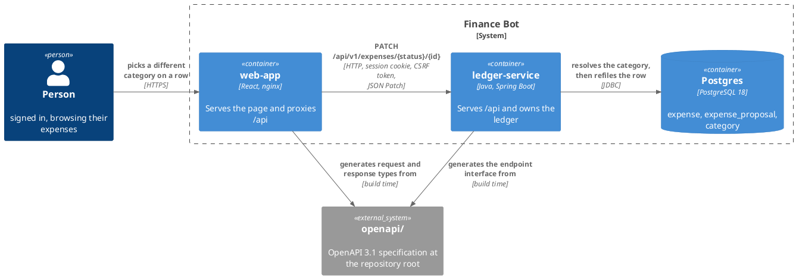
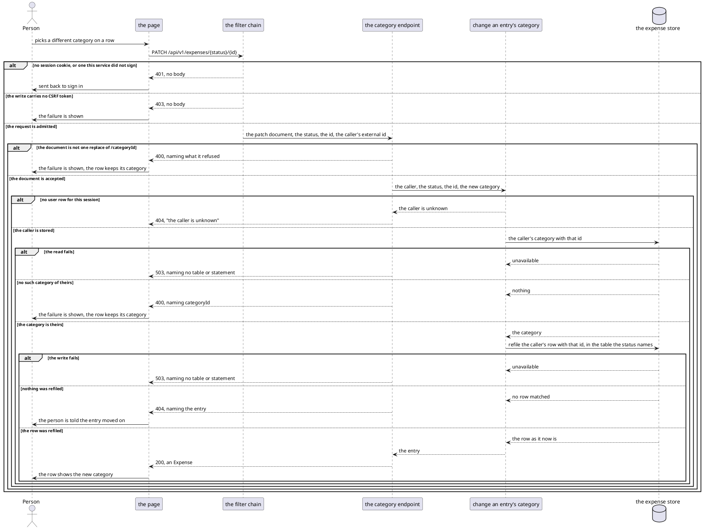
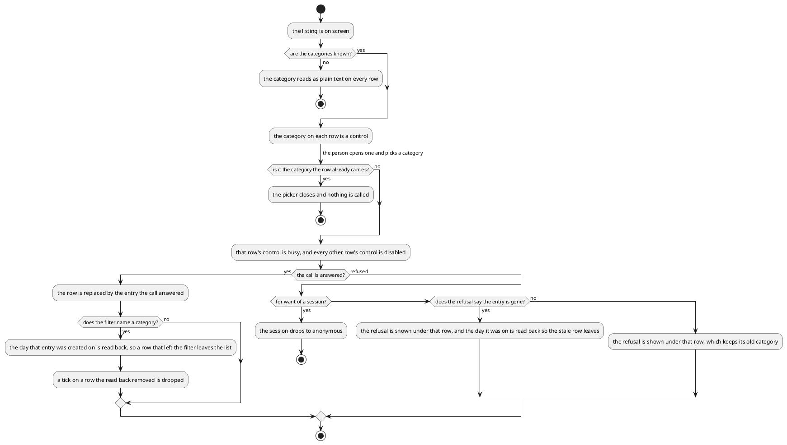

# Design: Change an Entry's Category

**Affected Modules:** `ledger-service`, `web-app`

**Shared artifact:** the OpenAPI specification under repo-root [`openapi/`](../../openapi/ledger-api.yaml).
`ledger-service` generates the endpoint interface it implements from it. `web-app` generates the request and
response types it calls with. Neither module owns it, so it lands on its own before either module's work. Nothing
else crosses between the two.

## Objective

A person browsing their ledger sees what each entry is filed under and can do nothing about it. A pending
proposal's category is the model's guess, and a recorded expense keeps whatever category it was created with.
Getting one wrong today means living with it.

This change lets a person refile an entry from the page. They pick a different category on the row, and the entry
moves to it. Both a pending proposal and a recorded expense can be refiled, because both are on the same listing
and both can be wrong.

## Context

What already exists, and what this change extends.

**The listing the page reads** — `GET /api/v1/expenses`
([`ExpensesController`](../../ledger-service/src/main/java/bot/finance/adapter/web/ExpensesController.java),
[the browse API](../../ledger-service/docs/contracts/in/web-browse-api.md)) answers `PENDING` and `RECORDED`
entries as one page, described by [`openapi/ledger-api.yaml`](../../openapi/ledger-api.yaml). An `Expense` carries
`status`, `id` and `categoryId`, and an id is unique within its status only. The page renders it through
[Browse recorded expenses](../../web-app/docs/usecases/browse-recorded-expenses.md).

**The category name is already on screen** —
[`ExpenseDaySection`](../../web-app/src/components/ExpenseDaySection.tsx) resolves `categoryId` against the map the
page builds from `listCategories`, and prints it on the row's secondary line beside the merchant.

**The picker already exists** — [`CategoryFilter`](../../web-app/src/components/CategoryFilter.tsx) is a
searchable popover, grouped by grouping, that the filter bar uses to narrow the listing to one category.

**The only writes the browser makes** — `POST /api/v1/session` and `POST /api/v1/expenses/acceptances`, both
admitted by
[`SecurityConfiguration`](../../ledger-service/src/main/java/bot/finance/adapter/security/SecurityConfiguration.java)
and both carrying the CSRF token [`client.ts`](../../web-app/src/api/client.ts) reads back from the cookie the
chain sets. The chain's last rule is `denyAll`, so a path it does not name is refused.

**The acceptance this change sits beside** —
[Accept the proposals a person chose](../../ledger-service/docs/usecases/accept-chosen-proposals.md), designed in
[21-accept-expenses-from-the-web](../implemented/21-accept-expenses-from-the-web/design.md). It is the page's other
write, and this design mirrors how it reports a failure and how it reads a touched day back.

Four facts about the store this change writes to:

- **A pending entry is a row in `expense_proposal` and a recorded one a row in `expense`**
  ([`V002`](../../ledger-service/src/main/resources/db/migration/V002__create_expense.sql),
  [`V003`](../../ledger-service/src/main/resources/db/migration/V003__create_expense_proposal.sql)). Both carry
  `category_id NOT NULL REFERENCES category (id)`, `created_at` and `updated_at`.
- **A category and a grouping are the same table**
  ([`V001`](../../ledger-service/src/main/resources/db/migration/V001__create_user_and_category.sql)). A grouping
  has `parent_id IS NULL`, a category has a parent, and both carry the `user_id` they belong to.
- **The foreign key checks existence, not ownership.** `expense.category_id` references `category (id)` with
  nothing narrowing it to the row's own user, so any check that a category is the caller's is the service's.
- **Nothing updates either row today.** Every statement in
  [`ExpenseEntityRepository`](../../ledger-service/src/main/java/bot/finance/adapter/persistence/ExpenseEntityRepository.java)
  and
  [`ExpenseProposalEntityRepository`](../../ledger-service/src/main/java/bot/finance/adapter/persistence/ExpenseProposalEntityRepository.java)
  inserts, deletes, moves or reads.

## Proposed Solution

### What the change adds

One write endpoint, described by the shared specification.

| Endpoint                                    | Takes                                        | Answers                |
|---------------------------------------------|----------------------------------------------|------------------------|
| `PATCH /api/v1/expenses/{status}/{id}`      | a JSON Patch document of exactly one operation | the entry as it now is |

`status` is the `PENDING` or `RECORDED` token the listing already answers with, and it says which of the two
tables the id names (D2). The document replaces one field and no other (D3):

```json
[ { "op": "replace", "path": "/categoryId", "value": 42 } ]
```

The specification gains one path file and two schemas:

```
openapi/
├── paths/
│   └── expense-category.yaml           PATCH /api/v1/expenses/{status}/{id}
└── ledger-api.yaml                     CategoryPatch, CategoryPatchOperation
```

The path file writes its own `400` and `404` descriptions instead of reusing the shared ones, because this
endpoint refuses for reasons those descriptions rule out (D25).

The store gains nothing. No column, no table and no migration: both rows already carry the category and the
instant they were last updated (D18).

On the page, the category on every row becomes a control that opens the picker the filter bar already uses.
Choosing a category calls the endpoint, and the row shows the new name once the call is answered (D15). A tick
survives the change, and a ticked row is still accepted with the category it now carries (D17).

### Diagrams

Both modules take the repository's [Diagram Format](../conventions/diagrams.md) unchanged, with `web-app`'s
[route colour](../../web-app/docs/conventions/documentation.md#diagram-colour) applying to its own components. No
component diagram appears here: classes belong to the plan.

#### Container — what this change reaches



Telegram is absent on purpose. A report already posted keeps the category name it was sent with, and nothing is
sent to correct it (D12).

#### Flow — refiling an entry



#### Flow — what the page decides

The branches name one participant, so the decisions are the content.



### Details

#### `ledger-service` — what the wire carries

| `CategoryPatchOperation` field | Meaning                                                     |
|--------------------------------|-------------------------------------------------------------|
| `op`                           | `replace`, and no other operation                           |
| `path`                         | `/categoryId`, and no other field                           |
| `value`                        | the id of a category of the caller's, above 0               |

`CategoryPatch` is an array of exactly one of those. The media type is `application/json-patch+json`.

| Path part | Meaning                                                                          |
|-----------|-----------------------------------------------------------------------------------|
| `status`  | `PENDING` or `RECORDED`, the token the listing answers, saying which table the id names |
| `id`      | the id of the caller's entry, as the listing answered it                          |

The answer is an `Expense`, the same schema the listing's `items` carry, reading as the entry now stands.

#### `ledger-service` — what the caller gets

| Status | Raised by                                                                                                    |
|--------|----------------------------------------------------------------------------------------------------------------|
| 200    | the row was refiled, including where it already carried that category (D8)                                     |
| 400    | a document that is not one `replace` of `/categoryId`, a value below 1, a body that is not JSON, a `status` that is neither token, or a `categoryId` naming no category of the caller's (D6) |
| 401    | no session, refused by the filter chain before the endpoint is reached                                          |
| 403    | no CSRF token, refused by the filter chain                                                                      |
| 404    | no entry of the caller's with that id and status (D7), or a session outliving its user row                      |
| 503    | either statement failed — `PersistenceFailedException`. The category read raises it as every other read on this store does, and nothing is written |

Each 400 message is composed by this module and names the field and the bound it broke, as the listing's already
are. The two 404s carry different messages: one names the entry, the other says the caller is unknown (D7).

#### `ledger-service` — the two statements

The category is resolved before the row is refiled, so an unknown category and an unknown entry stay two answers
rather than one (D10). The read admits only a category of the caller's that is filed under a grouping:

```sql
SELECT id
FROM category
WHERE id = :categoryId AND user_id = :userId AND parent_id IS NOT NULL
```

The write names the table the `status` chose, and is otherwise the same statement twice. It answers the row it
changed, so the response body costs no second read (D24):

```sql
UPDATE expense
SET category_id = :categoryId, updated_at = :now
WHERE id = :id AND user_id = :userId
RETURNING id, category_id, description, merchant, amount_minor_units, currency_code, created_at
```

The status is not selected. It is the `{status}` the path carried, which is what chose the table (D24).

`created_at` is not touched, so the entry stays on the day it appeared on (D9). An empty answer is the 404 (D7).
`:now` is truncated to microseconds before it is bound, because the column holds microseconds and the driver
rounds rather than truncates
([`ExpenseRepositoryAdapter`](../../ledger-service/src/main/java/bot/finance/adapter/persistence/ExpenseRepositoryAdapter.java)).

#### `ledger-service` — build and security

| Setting                 | Change                                                                              |
|-------------------------|---------------------------------------------------------------------------------------|
| `SecurityConfiguration` | `PATCH /api/v1/expenses/*/*` joins the chain as `.authenticated()`, ahead of `denyAll` |
| the generated interface | one more operation on the `expenses` tag, nothing else                                 |

Five documents state facts this change moves, and are corrected with it:

| Document                                                                          | Correction                                                        |
|-------------------------------------------------------------------------------------|---------------------------------------------------------------------|
| [the browse API](../../ledger-service/docs/contracts/in/web-browse-api.md)        | the boundary carries a second write, and what it refuses          |
| [the web app's side of it](../../web-app/docs/contracts/out/ledger-browse-api.md) | a second request is a write, and it carries a JSON Patch body     |
| [Expense](../../ledger-service/docs/domain/expense.md)                            | its Lifecycle says `Changed | never`, which is no longer true     |
| [Expense proposal](../../ledger-service/docs/domain/expense-proposal.md)          | the same row, for the pending side                                |
| [`expenses.http`](../../ledger-service/docs/requests/expenses.http)               | the new request, driven by hand against a running service         |

#### `web-app`

| Surface               | Change                                                                                                  |
|-----------------------|-----------------------------------------------------------------------------------------------------------|
| the expenses client   | a `changeCategory` function sending the patch document, declared against the generated types              |
| the category picker   | the filter's popover becomes a control both the filter bar and a row use, with the filter's "All" entry offered only to the filter, and a width of its own when a row opens it (D29) |
| the day section       | the row's category name becomes that control — a ghost button with a chevron (D34) — and stays plain text where the row's category has no name (D16). A refused change is shown under that row (D35) |
| the expense list      | carries which row is being changed, the refusal to show, and the change callback down, and holds none of its own state |
| the expenses page     | owns which row is being changed and what its last refusal said, calls the client, and replaces the answered row |
| the English catalogue | the control's label and its empty state; a refusal shows the ledger's own words (D31)                     |

One change is out at a time. The row being changed is busy, every other row's control is disabled until the
answer arrives (D30), and ticking is unaffected except where a row leaves the list (D27).

## Acceptance Scenarios

### `PATCH /api/v1/expenses/{status}/{id}`

- **A1:** a recorded expense is refiled
  - Given: the person is signed in and has a `RECORDED` entry filed under one of their categories
  - When: they patch `/categoryId` to another of their categories
  - Then: the response is 200 carrying the entry with the new `categoryId`, and a later listing shows it under
    that category

- **A2:** a pending proposal is refiled
  - Given: the person is signed in and has a `PENDING` entry
  - When: they patch `/categoryId` to another of their categories
  - Then: the response is 200 with the new `categoryId`, the entry is still `PENDING`, and accepting it afterwards
    records it under the new category

- **A3:** the entry keeps the day it appeared on
  - Given: an entry created on an earlier day
  - When: its category is changed today
  - Then: the answered `createdAt` is unchanged, and the listing still shows it on its original day

- **A4:** the category it already carries
  - Given: an entry filed under a category
  - When: the same `categoryId` is patched onto it
  - Then: the response is 200 with that category, and nothing else about the entry changes

- **A5:** the category is not the caller's
  - Given: a `categoryId` naming another person's category
  - When: the person patches it onto their own entry
  - Then: the response is 400 naming `categoryId`, and the entry is unchanged

- **A6:** the category is a grouping
  - Given: a `categoryId` naming one of the person's own groupings
  - When: they patch it onto their entry
  - Then: the response is 400 naming `categoryId`, and the entry is unchanged

- **A7:** the entry is not the caller's
  - Given: an id naming another person's entry of that status
  - When: the person patches it
  - Then: the response is 404 naming the entry, and the other person's entry is unchanged

- **A8:** the entry no longer exists
  - Given: a `PENDING` id whose proposal was accepted or discarded a moment earlier
  - When: the person patches it
  - Then: the response is 404 naming the entry, and nothing is written

- **A9:** the document is not one replace of `/categoryId`
  - Given: the person is signed in
  - When: they send an empty document, two operations, an `op` other than `replace`, a `path` other than
    `/categoryId`, or a value below 1
  - Then: the response is 400, and nothing is written

- **A10:** the status is not a status
  - Given: the person is signed in
  - When: they patch `/api/v1/expenses/ACCEPTED/7`
  - Then: the response is 400, and nothing is written

- **A11:** nobody is signed in
  - Given: the request carries no session cookie, or one this service did not sign
  - When: it patches an entry
  - Then: the response is 401, and the endpoint is never reached

- **A12:** the write carries no CSRF token
  - Given: a valid session cookie and no `X-XSRF-TOKEN` header
  - When: the request patches an entry
  - Then: the response is 403, and nothing is written

- **A13:** the session outlives its user row
  - Given: a valid session whose user row no longer exists
  - When: it patches an entry
  - Then: the response is 404 saying the caller is unknown

- **A14:** the store is unavailable
  - Given: the person is signed in and the store answers neither the category read nor the write
  - When: they patch an entry
  - Then: the response is 503 for either failure, naming no table or statement, and nothing is changed

- **A15:** the report in Telegram is left as sent
  - Given: a `PENDING` entry whose report names its old category
  - When: the category is changed from the page
  - Then: nothing is sent to Telegram, the report still reads the old name, and tapping Confirm records the entry
    under its new category

### The page

- **A16:** the category on a row is a control
  - Given: a listing on screen and the categories answered
  - When: the person opens the control on a `PENDING` row and on a `RECORDED` row
  - Then: both offer the person's categories, grouped as the filter offers them, and neither offers an "all"
    entry

- **A17:** the row shows the new category
  - Given: a row filed under one category
  - When: the person picks another and the call answers
  - Then: that row reads the new category, its control is usable again, and no other row changed

- **A18:** the row waits for the answer
  - Given: a row whose change is still out
  - When: the person looks at it
  - Then: it still reads the old category and its control is busy, while every other row stays usable

- **A19:** the change is refused
  - Given: a person changing a row's category
  - When: the call answers 503
  - Then: the service's message is shown under that row, the row keeps its old category, the page's own banner is
    untouched, and the listing is otherwise unchanged

- **A20:** the session expires mid-change
  - Given: a person changing a row's category whose session has expired
  - When: the call answers 401
  - Then: the page drops to anonymous and sends them to `/login`, without a reload

- **A21:** a row leaves the category being filtered on
  - Given: the listing narrowed to one category, showing a `RECORDED` row and a `PENDING` row filed under it
  - When: the person refiles either of them to a different category
  - Then: the day it was created on is read back, the row is gone from the list, that day's figures read as they
    now are, and the pager still reads the numbers the original page answered

- **A22:** a row's category has no name
  - Given: a listing where the categories read failed, and one where a row's `categoryId` is absent from the
    answered categories
  - When: the listing renders
  - Then: that row's category reads as plain text, no control is offered, and the listing is otherwise unchanged

- **A23:** a ticked row survives being refiled
  - Given: a ticked `PENDING` row, on an unfiltered listing
  - When: its category is changed and the call answers
  - Then: the row is still ticked, the action still names it, and accepting it records it under the new category

- **A24:** picking the category the row already carries calls nothing
  - Given: a row filed under a category
  - When: the person opens its control and picks that same category
  - Then: the picker closes, no request is sent, and the row is unchanged

- **A25:** the entry moved on
  - Given: a `PENDING` row that was accepted from Telegram a moment earlier
  - When: the person refiles it and the call answers 404
  - Then: the service's message is shown under that row, and the day it was on is read back so the stale row
    leaves the list

- **A26:** a second row cannot be changed while one change is out
  - Given: a row whose change is still out
  - When: the person reaches for another row's category
  - Then: that control is disabled, and it is usable again once the answer arrives

- **A27:** a tick is dropped with the row it was on
  - Given: a ticked `PENDING` row on a listing narrowed to its category
  - When: it is refiled to a different category and the read back removes it from the list
  - Then: the tick is dropped, and the action no longer counts it

## Decisions

- **D1:** Which entries may be refiled?
  - Answer: Both. A `PENDING` proposal and a `RECORDED` expense are equally editable, through one endpoint.
  - Basis: decided — the user chose both over recorded-only and pending-only (2026-08-10). A proposal's category
    is the model's guess and the likeliest one to be wrong, and both statuses stand on the same listing row.

- **D2:** How does the endpoint tell a pending id from a recorded one?
  - Answer: A path segment, carrying the same `PENDING` or `RECORDED` token the listing answers and its `status`
    filter takes.
  - Basis: assumed — an `Expense` id is unique within its `status` and not across it, which
    [`openapi/ledger-api.yaml`](../../openapi/ledger-api.yaml) states on the field itself, so an id alone names
    two rows. Reusing the token keeps one vocabulary on the boundary, and two segments after `expenses` cannot
    collide with `/api/v1/expenses/acceptances`.

- **D3:** Which JSON Patch operations does the endpoint accept?
  - Answer: Exactly one operation per document: `replace` on `/categoryId`. `op` and `path` are declared as
    single-value enums in the specification, so anything else is refused before the use case is reached.
  - Basis: decided — the user asked for a JSON Patch endpoint and named the category as what becomes editable
    (2026-08-10). Nothing else on an entry is editable from any surface today, so a wider document would declare
    an operation with no implementation behind it.

- **D4:** Is the `test` operation supported, so a caller can refuse a change against a stale read?
  - Answer: No. A document carrying anything but the one `replace` is 400.
  - Basis: deferred — nothing on the boundary offers optimistic concurrency today, and the page reads the row
    back on every change. It comes back the first time two people share a ledger, which would need an entry
    version on the listing before a `test` could name one.

- **D5:** What does a successful patch answer?
  - Answer: 200 carrying the entry as it now stands, in the `Expense` schema the listing's items already use.
  - Basis: assumed — the page replaces one row and needs the row's new state to do it, and
    [`ExpenseWebMapper`](../../ledger-service/src/main/java/bot/finance/adapter/web/ExpenseWebMapper.java) already
    renders an `ExpenseEntry` into exactly that shape. A 204 would cost the page a second read for a row it just
    changed.

- **D6:** What does the caller get when `categoryId` names no category of theirs?
  - Answer: 400 naming `categoryId`. A grouping, an unknown id and another person's category are one answer.
  - Basis: assumed — the 404 handler in
    [`WebExceptionHandler`](../../ledger-service/src/main/java/bot/finance/adapter/web/WebExceptionHandler.java)
    answers a fixed "the caller is unknown", so a second meaning on 404 would be reported as the wrong thing. One
    answer for all three also keeps whether a stranger's category exists undisclosed, which is what D5 of
    [design 21](../implemented/21-accept-expenses-from-the-web/design.md) chose for a stranger's proposal.

- **D7:** What does the caller get when the entry is not theirs, or is gone?
  - Answer: 404, with a message naming the entry. The caller-unknown 404 keeps its own message, so the two are
    told apart by what they say.
  - Basis: assumed — `onEntityNotFound` maps every `EntityNotFoundException` to one fixed message today, and this
    endpoint is the first to raise 404 for two different reasons. A 200 with nothing changed, which is what the
    acceptance answers for an id that named nothing, cannot be answered here: the response body is the entry, and
    there is no entry to carry.

- **D8:** Does patching the category an entry already carries fail?
  - Answer: No. The row is written, `updated_at` moves, and the response is 200 with that category.
  - Basis: assumed — a conditional write would answer no rows matched, which is the 404 D7 fixes for a missing
    entry, and the two cases would then be indistinguishable. Nothing a person sees reads `updated_at`: the
    listing orders and cuts days by `created_at`
    ([`ExpenseEntityRepository`](../../ledger-service/src/main/java/bot/finance/adapter/persistence/ExpenseEntityRepository.java)).

- **D9:** Does refiling move the entry to today?
  - Answer: No. `created_at` is untouched, so the entry stays on the day it appeared on, and only `updated_at`
    carries the moment of the change.
  - Basis: assumed — D13 of [design 21](../implemented/21-accept-expenses-from-the-web/design.md) settled that
    `created_at` is the day a person reads an entry on and that acceptance must not move it. Refiling has the same
    consequence: a day section is cut by `created_at`
    ([`expenseDays.ts`](../../web-app/src/components/expenseDays.ts)), so a moved entry would vanish from the day
    the person is looking at.

- **D10:** Why two statements rather than one conditional update?
  - Answer: The category is resolved for the caller first, then the row is refiled. One statement carrying both
    conditions would answer no rows matched for either failure, and D6 and D7 are two different answers.
  - Basis: assumed — the foreign key on `expense.category_id`
    ([`V002`](../../ledger-service/src/main/resources/db/migration/V002__create_expense.sql)) checks existence and
    not ownership, so the ownership check is the service's either way. Nothing between the two statements can
    remove the category: no statement in the tree deletes a `category` row, and the only path that removes one is
    the store's cascade from its user, which takes the entry with it.

- **D11:** What happens when the entry is accepted or discarded while the patch is in flight?
  - Answer: The `PENDING` write matches no row, and the caller gets the 404 of D7. Nothing partial is left: the
    two statements touch different tables and only the second writes.
  - Basis: assumed — an acceptance deletes the proposal row and inserts an expense row in one statement
    ([`ExpenseProposalEntityRepository`](../../ledger-service/src/main/java/bot/finance/adapter/persistence/ExpenseProposalEntityRepository.java)),
    so under `READ COMMITTED` the patch either refiles the proposal before it moves — and the acceptance copies
    the new category across — or finds it gone.

- **D12:** Is a Telegram report corrected when a proposal it lists is refiled?
  - Answer: No. Nothing is sent, and the report keeps the category name it was posted with. Tapping its buttons
    afterwards records the proposal under the category it now has.
  - Basis: decided — the user chose leaving the report over rewriting its text (2026-08-10). D9 of
    [design 21](../implemented/21-accept-expenses-from-the-web/design.md) already attaches no importance to a
    report going stale, and the resolution path reads the category from the row rather than from the message
    ([`ResolveProposalsUseCase`](../../ledger-service/src/main/java/bot/finance/application/usecase/ResolveProposalsUseCase.java)).

- **D13:** Does anything a person can observe over Telegram or MCP change?
  - Answer: No. No tool and no tap gains or loses an argument, a status or a message. What they can now find is a
    row filed under a category a person chose rather than the model.
  - Basis: assumed — this change adds one HTTP operation and writes one column that both paths already read
    through the same projections, and no proto or MCP tool schema is touched.

- **D14:** What does the page do once the change is answered?
  - Answer: It replaces that one row with the entry the call answered. Where the filter names a category, the day
    the answered entry was created on is read back instead, so a row that left the filter leaves the list. That
    day comes from the answered entry's own `createdAt`, not from the page's ticked-set helper.
  - Basis: assumed — the page already reads a day back and merges it after an acceptance
    (`mergeDay` in [`expenseDays.ts`](../../web-app/src/components/expenseDays.ts)), so the narrowed case costs no
    new mechanism. Its `touchedDaysOf` cannot supply the day: it answers only the days of `PENDING` items, so a
    refiled `RECORDED` row would answer an empty set and stay on screen under a filter it no longer matches.
    Replacing the row in place otherwise keeps the pager, the total and every other day as they were, which D32 of
    [design 21](../implemented/21-accept-expenses-from-the-web/design.md) chose for the same reason.

- **D15:** Does the row show the new category before the call is answered?
  - Answer: No. The row keeps its old category and its control is busy until the answer arrives.
  - Basis: assumed — the acceptance disables its action while its call is out rather than predicting the result
    ([`ExpensesPage`](../../web-app/src/pages/ExpensesPage.tsx)), and a refusal that has to be undone on screen is
    what an optimistic row would cost. The call replaces one row, so waiting blocks nothing else on the page.

- **D16:** What does a row show when its category has no name?
  - Answer: Plain text, and no control. That covers both the categories never being answered and one id missing
    from a map that is otherwise full. The row still renders, and the rest of the page is unaffected.
  - Basis: assumed — the page reads the categories separately from the listing and reports a failed read in the
    banner without clearing the page
    ([`ExpensesPage`](../../web-app/src/pages/ExpensesPage.tsx)), and a row whose category the map does not hold
    already renders unnamed rather than failing
    ([`ExpenseList`](../../web-app/src/components/ExpenseList.tsx)). Either way there is no name to put on a
    trigger and, in the first case, nothing in the picker to choose.

- **D17:** Does refiling a ticked row change what is ticked?
  - Answer: No. The tick is held by id and the id does not change, so the row stays ticked and is accepted under
    its new category.
  - Basis: assumed — the page holds ticked ids in a set of its own and clears them only when an acceptance is
    answered ([`ExpensesPage`](../../web-app/src/pages/ExpensesPage.tsx)), and refiling changes no id.

- **D18:** Does the store change?
  - Answer: No. No migration, no column and no index. Both tables already hold `category_id` and `updated_at`.
  - Basis: assumed — [`V002`](../../ledger-service/src/main/resources/db/migration/V002__create_expense.sql) and
    [`V003`](../../ledger-service/src/main/resources/db/migration/V003__create_expense_proposal.sql) declare both
    columns `NOT NULL`, and the read the listing already runs answers the category from them.

- **D19:** What proves in production that an entry was refiled?
  - Answer: One line at info per change, carrying the resolved user, the status, the entry id and the category it
    now carries. Not the category it moved from: the write answers the row as it now stands, and reading the old
    value would cost a statement for a log line. A refusal logs at warn, as the handler already does.
  - Basis: assumed — [Code Style](../../ledger-service/docs/conventions/code-style.md) reserves info for business
    events, and the acceptance logs one line per write on the same boundary
    ([`AcceptExpensesUseCase`](../../ledger-service/src/main/java/bot/finance/application/usecase/AcceptExpensesUseCase.java)).

- **D20:** Will the generator and the framework carry `application/json-patch+json` end to end?
  - Answer: The plan's first step declares the path in the specification, generates, and drives the endpoint with
    that media type before anything is written against it. The invariant that must hold is that a document of one
    declared operation binds to a typed parameter, and that a document breaking a declared enum answers 400 rather
    than 500.
  - Basis: deferred — no path in [`openapi/`](../../openapi/ledger-api.yaml) declares a media type other than
    `application/json` today, and no request body in the tree is an array, so no observed behaviour can be cited.
    If the generated interface cannot carry it, the fallback is a hand-written controller method on the same path
    and media type, which changes no acceptance scenario.

- **D21:** What does the caller get when `op` or `path` carries a value the enum does not declare?
  - Answer: 400. The message may be the generic unreadable-body one rather than one naming the field.
  - Basis: assumed — `onHttpMessageNotReadable` and `onMethodArgumentNotValid` both answer 400 in
    [`WebExceptionHandler`](../../ledger-service/src/main/java/bot/finance/adapter/web/WebExceptionHandler.java),
    and which of the two a rejected enum value raises depends on where the generated model refuses it. A9 asserts
    the status, not the wording, for exactly that reason.

- **D22:** What happens to a long category name on a narrow row?
  - Answer: The control truncates, as the row's secondary line already does, and the picker shows the full name.
  - Basis: assumed — every text on that row is `truncate`d today
    ([`ExpenseDaySection`](../../web-app/src/components/ExpenseDaySection.tsx)), and the filter's own trigger
    truncates its chosen category the same way
    ([`CategoryFilter`](../../web-app/src/components/CategoryFilter.tsx)). A name is bounded at 100 characters by
    its column ([`V001`](../../ledger-service/src/main/resources/db/migration/V001__create_user_and_category.sql)).

- **D23:** Can a person refile an entry into a category that does not exist yet?
  - Answer: No. The picker offers the categories the tree holds, and the endpoint refuses anything else with the
    400 of D6.
  - Basis: deferred — nothing on this boundary creates a category, and the two levels of the tree are answered
    read-only ([the browse API](../../ledger-service/docs/contracts/in/web-browse-api.md)). It comes back the
    first time a person needs a category the model never invented, which is a create endpoint rather than a
    change to this one.

- **D24:** How does the write produce the entry the 200 carries?
  - Answer: The `UPDATE` ends in `RETURNING`, answering the row it changed. An empty answer is the 404 of D7, in
    place of a zero count. The status is not among the columns: it is the one the path carried, which is what
    chose the table.
  - Basis: assumed — `acceptByIds` is already a `@Query` whose SQL ends in `RETURNING` and whose return type is a
    list
    ([`ExpenseProposalEntityRepository`](../../ledger-service/src/main/java/bot/finance/adapter/persistence/ExpenseProposalEntityRepository.java)),
    so the shape is one the module has run. `findPage` does synthesize the status as a literal
    ([`ExpenseEntityRepository`](../../ledger-service/src/main/java/bot/finance/adapter/persistence/ExpenseEntityRepository.java)),
    but only because it `UNION ALL`s the two tables and a row out of that union carries nothing else saying which
    side it came from. This statement reads one table, named before it runs.

- **D25:** Do the shared error responses still describe this endpoint's refusals?
  - Answer: No, so the path file writes its own `400` and `404` descriptions rather than reusing them. The shared
    responses are left alone for every other path.
  - Basis: assumed — `NotFound` in
    [`errors.yaml`](../../openapi/components/responses/errors.yaml) says the message means only that the caller is
    unknown, which D7 makes false here, and `BadRequest` says nothing is read before a refusal, which the category
    lookup of D6 breaks. Writing a description locally is what
    [`expense-acceptances.yaml`](../../openapi/paths/expense-acceptances.yaml) already does for its `403`, and the
    repository's rule is that a failure's description says what raises it
    ([Writing Documentation](../conventions/documentation.md)).

- **D26:** What happens when the person narrows the filter or pages while a change is out?
  - Answer: The answer is applied against what is on screen when it arrives, not against what the call left with,
    and it is dropped where the page no longer holds the row it names.
  - Basis: assumed — the page keeps `filterRef` and `pageRef` for exactly this on the acceptance path, and its
    listing effect guards with a `cancelled` flag
    ([`ExpensesPage`](../../web-app/src/pages/ExpensesPage.tsx)). Merging a row into a page it does not belong to
    is what neither guard alone prevents.

- **D27:** What happens to a tick on a row the read back removed?
  - Answer: It is dropped. A ticked entry that has left the list is not accepted by the action that no longer
    shows it.
  - Basis: assumed — the page holds ticked ids in a set of its own and `mergeDay` drops a row from `items`
    without touching that set
    ([`expenseDays.ts`](../../web-app/src/components/expenseDays.ts)), so left alone the action bar would count
    and accept an entry the person cannot see.

- **D28:** What is looked at with human eyes before this is called done?
  - Answer: Eight things. A day panel at the narrowest supported width, with a long merchant and a long category
    on one row. A row showing a refusal, for what it does to the rows around it (D35). The row control at rest in both themes, on a `PENDING` row and on a `RECORDED` one. The picker
    opened from a row near the bottom of a long scrolled listing. A row whose call is out, beside the rows around
    it. The control reached and driven by keyboard alone, including where focus stands after the picker closes. A
    refile watched under a category filter, for the day being replaced in place. The picker opening and closing
    with reduced motion turned on.
  - Basis: assumed — [Testing Conventions](../../web-app/docs/conventions/testing.md) puts layout, colour,
    clipping and motion outside the suite whatever its size, and requires a change touching any of them to be
    looked at before it is called done. D39 of
    [design 21](../implemented/21-accept-expenses-from-the-web/design.md) is the precedent for the shape.

- **D29:** How wide is the picker when a row opens it?
  - Answer: A width of its own, wide enough for a category name, a grouping heading and the search field. The
    filter keeps matching its trigger.
  - Basis: assumed — the filter sets the popup to `--radix-popover-trigger-width`
    ([`CategoryFilter`](../../web-app/src/components/CategoryFilter.tsx)), which works because its trigger is a
    full-width field. A row's trigger is a truncated name on a secondary line, so the same rule would give a
    popup a few characters wide holding a search input and a grouped list. Height is already bounded and
    scrolling by the `components/ui/` rule in
    [Architecture & Layering](../../web-app/docs/conventions/architecture.md).

- **D30:** How many changes may be out at once?
  - Answer: One. While a change is out, every other row's control is disabled, and the row being changed is busy.
  - Basis: assumed — the acceptance holds a single `accepting` flag and disables its one action while its call is
    out ([`ExpensesPage`](../../web-app/src/pages/ExpensesPage.tsx)), and a set of in-flight ids would need a
    per-row failure report to be worth anything. One at a time also means the answered row is always merged into
    a page no other change is rewriting.

- **D31:** Which words does a person read when a change is refused?
  - Answer: The ledger's own. The 400 names `categoryId` and its bound, the 404 names the entry, and both reach
    the row as composed by the service (D35). The catalogue gains the control's label and its empty state, not a
    string per status.
  - Basis: assumed — `request` reads `message` out of the problem body onto the `ApiError`, and the page shows
    `error.message` verbatim for every call it makes today
    ([`client.ts`](../../web-app/src/api/client.ts),
    [`ExpensesPage`](../../web-app/src/pages/ExpensesPage.tsx)). A second wording on the page would disagree with
    the first the day either moves.

- **D32:** How do the merchant and the category share the row's secondary line?
  - Answer: The merchant gives way first and truncates; the control keeps a minimum readable width. The `·`
    separator goes with the merchant, so a row with no merchant shows the control alone.
  - Basis: assumed — the two are one joined, truncated span today
    ([`ExpenseDaySection`](../../web-app/src/components/ExpenseDaySection.tsx)), where the category is what is
    lost at the narrowest width. Splitting them makes that a choice, and a control squeezed to nothing is a
    control a person cannot hit.

- **D33:** What does a busy control do to a keyboard person's place on the page?
  - Answer: It stays focusable and says it is busy, rather than being disabled, so the picker's focus return
    lands somewhere. Where the refiled row leaves the list, focus moves to that day section's header.
  - Basis: assumed — a disabled button cannot take focus, so the popover's return would drop focus to the
    document body, and the day sections arrive collapsed (D31 of
    [design 21](../implemented/21-accept-expenses-from-the-web/design.md)) — a person's next Tab would restart
    above the filters and the panel they were in would have to be reopened.

- **D34:** How does the row's category read as a control before anybody touches it?
  - Answer: A `ghost` button carrying a small chevron after the name — no border and no resting fill, at the
    secondary line's own size, so the row's height does not change. The chevron is what says it can be picked.
  - Basis: decided — the user chose a ghost button with a caret over a dotted underline and over an outline
    field (2026-08-10). The repository has one precedent for a control shaped like text, the filters' `ghost`
    reset button ([`ExpenseFilters`](../../web-app/src/components/ExpenseFilters.tsx)), and `ghost` carries no
    resting surface, border or ring ([`button.tsx`](../../web-app/src/components/ui/button.tsx)), so without the
    chevron it reads as plain text until it is tapped.

- **D35:** Where does a refused change appear, relative to the row that was refused?
  - Answer: On the row itself, under the entry the change was refused for. The page's top banner keeps reporting
    the listing's own failures and is not used for this call. The row grows while the message is shown, and the
    message goes when the next change on that row is sent.
  - Basis: decided — the user chose the row over the banner, with and without scrolling it into view
    (2026-08-10). A row control can sit inside the last day of a full page, so the banner
    ([`ExpensesPage`](../../web-app/src/pages/ExpensesPage.tsx)) is off screen exactly when this call fails, and
    appearing it pushes the filters, the action bar and every day section down under the person's pointer.

## Design Findings

Grilled (2026-08-10), `grill-design`: failure modes, retries, concurrency, data edges, compatibility, lifecycle,
observability, authorization, limits, business invariants.

Grilled (2026-08-10), `grill-frontend`: empty and extreme data, defaults, layout stability, control consistency,
colour, motion, third-party embeds, library cost, locale, keyboard reach.

| Raised                                                            | Answered by                                                  |
|-------------------------------------------------------------------|----------------------------------------------------------------|
| Whether `PATCH /api/v1/expenses/*/*` can collide with the acceptance path | the two differ in segment count, and the chain denies by default |
| Whether the new use-case pages are this design's to write         | they are follow-up work, written by `archive-knowledge`        |
| What the pager reads after a refiled row leaves the filter        | A21 — the numbers the original page answered, as D27 of design 21 accepted |
| Whether `:now` needs truncating before it is written              | the statements section, which truncates it as every other write does |
