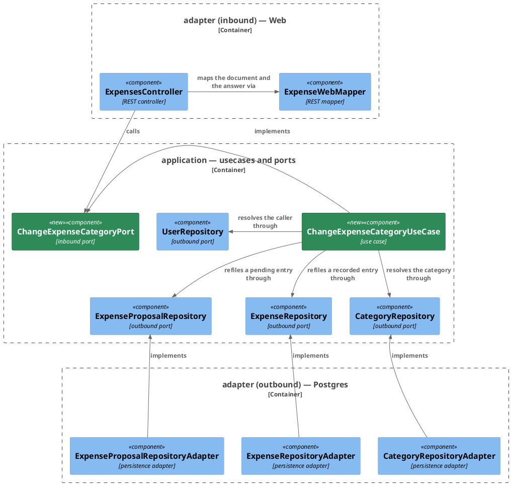

# Plan: Change an Entry's Category — `ledger-service`

**Affected Modules:** `ledger-service`
**Design:** [Change an Entry's Category](../design.md)

## Components

The design named responsibilities; these are the classes that hold them. One subject — refiling an entry — so one
diagram.



Each adapter queries through the Spring Data interface it already holds — `CategoryEntityRepository`,
`ExpenseEntityRepository`, `ExpenseProposalEntityRepository`. Those three gain a method each, listed below, and
are left out of the diagram, which would otherwise be read by scrolling. `SecurityConfiguration` and
`WebExceptionHandler` are not drawn either: a filter chain and an exception advice belong to no subject.

### What a box cannot carry

| Type                                    | Holds                                                                          | Refuses                                                        |
|-----------------------------------------|--------------------------------------------------------------------------------|----------------------------------------------------------------|
| `ChangeExpenseCategoryCommand`          | `AuthenticatedUserId userId`, `ExpenseStatus status`, `long entryId`, `long categoryId` | an absent caller, an absent status, an `entryId` below 1, a `categoryId` below 1 |
| `RefiledEntryProjection`                | `id`, `categoryId`, `description`, `merchant`, `amountMinorUnits`, `currencyCode`, `createdAt` — the row the `UPDATE` answered | —                                    |

`RefiledEntryProjection` carries no status: the status is the one the path named, which is what chose the table
(D24). Its `toExpenseEntry(ExpenseStatus status)` takes it from the adapter that ran the statement.

| Port                        | Gains                                                                                   |
|-----------------------------|------------------------------------------------------------------------------------------|
| `ChangeExpenseCategoryPort` | `ExpenseEntry change(ChangeExpenseCategoryCommand command)`                              |
| `CategoryRepository`        | `boolean existsOwnedCategory(long userId, long categoryId)`                              |
| `ExpenseRepository`         | `Optional<ExpenseEntry> refile(long userId, long entryId, long categoryId, Instant now)` |
| `ExpenseProposalRepository` | `Optional<ExpenseEntry> refile(long userId, long entryId, long categoryId, Instant now)` |

An empty `Optional` from either `refile` means no row of the caller's carried that id, which is the 404 of D7.
The two ports carry the same signature deliberately: the use case picks one by the status the path named, and
nothing else about the call differs.

| Spring Data interface             | Gains                                                                                    |
|-----------------------------------|-------------------------------------------------------------------------------------------|
| `CategoryEntityRepository`        | derived `existsByIdAndUserIdAndParentIdIsNotNull(Long id, Long userId)`                   |
| `ExpenseEntityRepository`         | `refile` — the design's `UPDATE expense … RETURNING`, answering `Optional<RefiledEntryProjection>` |
| `ExpenseProposalEntityRepository` | `refile` — the same statement over `expense_proposal`                                     |

The derived method is exactly the design's category read: `id`, `user_id`, and a `parent_id` that is not null, so
a grouping is admitted no more than a stranger's category is.

| Exception                                | Status | Raised by                                                                        |
|------------------------------------------|--------|----------------------------------------------------------------------------------|
| `InvalidExpenseCategoryChangeException`  | 400    | `ChangeExpenseCategoryCommand` for its own fields; `ExpenseWebMapper` for a `status` that is neither token and for a document that is not one `replace` of `/categoryId`; `ChangeExpenseCategoryUseCase` for a `categoryId` naming no category of the caller's (D6) |
| `MethodArgumentNotValidException`        | 400    | the generated model's declared enums, the `@Min(1)` on `id` and the `@Size(1, 1)` on the document — already mapped (D21) |
| `HttpMessageNotReadableException`        | 400    | a body that is not JSON — already mapped (D21)                                    |
| `ExpenseEntryNotFoundException`          | 404    | `ChangeExpenseCategoryUseCase` — no entry of the caller's under that status (D7)  |
| `EntityNotFoundException`                | 404    | `UserRepository` — the session outlives its user row, answering its own fixed message |
| `PersistenceFailedException`             | 503    | either adapter — the category read or the write failed                            |

`shared/plan.md` ST04 read the generated signature back as
`changeExpenseCategory(String status, @Min(1) Long id, @Size(min = 1, max = 1) List<CategoryPatchOperation>)`,
answering `ChangeExpenseCategory200Response`. So `status` binds as a plain `String` and no
`MethodArgumentTypeMismatchException` is ever raised for it — the mapper is what refuses a token that is neither,
which is why it appears above and the framework does not. The document's own bound does survive into the
signature, so a two-operation document is refused before the mapper; the mapper checks it anyway, its contract
being its own.

`InvalidExpenseCategoryChangeException` extends `InvalidValueException`, as
`InvalidExpenseAcceptanceException` does, and gets a handler of its own so the caller reads the message this
module composed rather than the fallback's generic wording. `ExpenseEntryNotFoundException` extends
`EntityNotFoundException` and gets a handler of its own for the same reason: the base handler answers a fixed
"the caller is unknown", which D7 makes false for this refusal, and Spring picks the more specific handler.

## Step-by-Step Implementation Map (To-Do List)

### Stabilization

The store gains nothing — no migration, no column, no index. Both tables already carry `category_id` and
`updated_at` (D18), so this group has no **Database** section.

#### Interface-First / Build Stabilization

**Interface & Signature Sync**

- [x] ST01 · Add the two domain exceptions, each a plain subclass with a message constructor, as
  `InvalidExpenseAcceptanceException` already is:
  ```java
  public class InvalidExpenseCategoryChangeException extends InvalidValueException { … }
  public class ExpenseEntryNotFoundException extends EntityNotFoundException { … }
  ```
  `ExpenseEntryNotFoundException` passes its entity type up to `EntityNotFoundException` the way every raiser of
  that type already does.
- [x] ST02 · Add `application/dto/ChangeExpenseCategoryCommand` with the four fields the table above names, and a
  compact constructor whose body is a comment saying what it refuses — an absent caller, an absent status, an
  `entryId` below 1 and a `categoryId` below 1, each throwing `InvalidExpenseCategoryChangeException` with a
  message naming the field and the bound it broke. The checks themselves land in `GU01`.
- [x] ST03 · Add `application/port/ChangeExpenseCategoryPort` with the javadoc shape the module's ports already
  use, one `@throws` per runtime exception in the table above, and add
  `application/usecase/ChangeExpenseCategoryUseCase` implementing it as a stub. The stub body says what it will
  do: resolve the caller, refuse a `categoryId` that is not one of theirs, refile the row in the table the status
  names, and answer the row as it now stands — plus D19's line, one at info per change carrying the resolved
  user, the status, the entry id and the category it now carries.
- [x] ST04 · Add the three port methods the table above names, each with a `@throws PersistenceFailedException`
  javadoc as its neighbours have, and stub each on its adapter with an inline comment naming the statement it
  will run. Add `adapter/persistence/RefiledEntryProjection` beside the other projections, carrying
  `toExpenseEntry(ExpenseStatus status)` **implemented**, not stubbed — it mirrors
  `ExpenseEntryProjection.toExpenseEntry()` field for field, wrapping the merchant in an `Optional`, building a
  `Money` over a `CurrencyCode`, and taking the status from its parameter rather than from a column. `RI02` and
  `RI03` assert every field it maps, so it earns no step of its own. Add the two `@Query` methods and the derived one to the Spring Data
  interfaces; both writes truncate `:now` to microseconds in the adapter before binding it, as `acceptByIds`
  already does, because the column holds microseconds and the driver rounds rather than truncates:
  ```sql
  UPDATE expense
  SET category_id = :categoryId, updated_at = :now
  WHERE id = :id AND user_id = :userId
  RETURNING id, category_id, description, merchant, amount_minor_units, currency_code, created_at
  ```
  `created_at` is not touched, so the entry stays on the day it appeared on (D9). The proposal statement is the
  same over `expense_proposal`. A row-answering data-modifying query is a shape this module has run —
  `acceptByIds` in `ExpenseProposalEntityRepository` is one — so neither needs `@Modifying`.
- [x] ST05 · Add to `ExpenseWebMapper`, and implement `ExpensesController.changeExpenseCategory` against them and
  the port, overriding the generated interface's `default`. The generated parameter and return types are whatever
  `shared/plan.md` ST04 read back; nothing here assumes them.
    - make the existing `private static Expense toItem(ExpenseEntry)` public, since the patch answers the same
      shape the listing's items carry (D5) and neither should render it twice. The generator names the patch's
      own 200 `ChangeExpenseCategory200Response` rather than reusing `Expense`, exactly as it renames
      `ExpensePage` to `ListExpenses200Response`, so add a second one-line mapping from the rendered `Expense`
      into that type. It is a field-for-field copy with no branch, which is why it is written here and earns no
      red-phase step of its own;
    - add `toChangeExpenseCategoryCommand(...)`, stubbed with an inline comment saying it refuses a document that
      is not exactly one `replace` of `/categoryId` and converts the generated status to the domain one. Its
      logic lands in `GU02`.
- [x] ST06 · Add the two `WebExceptionHandler` handlers — `InvalidExpenseCategoryChangeException` answering 400
  with the exception's own message, as `InvalidExpenseAcceptanceException` already does, and
  `ExpenseEntryNotFoundException` answering 404 with the exception's own message. Add a third `@MockitoBean` for
  `ChangeExpenseCategoryPort` to `WebExceptionHandlerTest` and to `ExpensesControllerTest` in the same step: both
  are `@WebMvcTest(ExpensesController.class)` slices, so the controller's new constructor parameter fails their
  context load otherwise, and every test in both classes goes red for a reason that has nothing to do with what
  it asserts. Neither class's assertions change here.
- [x] ST07 · Declare the bean in `UseCaseConfiguration`: `ChangeExpenseCategoryPort` taking `UserRepository`,
  `CategoryRepository`, `ExpenseRepository`, `ExpenseProposalRepository`, `Clock.systemUTC()` and the
  `LoggerFactory`, as every bean there already does.

**Configuration**

- [x] ST08 · Add `PATCH /api/v1/expenses/*/*` to `SecurityConfiguration`'s web-session chain as
  `.authenticated()`, beside the matchers already there and ahead of `anyRequest().denyAll()`, which would
  otherwise refuse the new path. Two `*` segments cannot collide with `/api/v1/expenses/acceptances`, which is
  one segment shorter.

**Shared Test Infrastructure**

- [x] ST09 · Add a bot token constant for `RS02` to `bot.finance.common.stubs.TelegramTestBot`, so its Telegram
  scenario reaches a stub path no other class can and starts from a clean poll offset. Nothing else is needed:
  `CategoryRowUtils` already stores a grouping and a category and reads a user's rows back, `ExpenseRowUtils` and
  `ExpenseProposalRowUtils` already store a row and read it back, and `BrowserSessions` already carries the
  sign-in exchange.
- [x] ST10 · Confirm `bot.finance.architecture.CleanArchitectureTest` still passes, and that the pre-existing
  suite is green: `tools/agent-test/agent-test.sh --module ledger-service`.

### Red Phase

#### TDD Unit Red Phase

- [x] RU01 · `ChangeExpenseCategoryCommand` · test: `ChangeExpenseCategoryCommandTest` · covers: the compact
  constructor · scenarios: A9
    - the compact constructor:
        - given: a caller, a status, an entry id and a category id all within their bounds
          when: the command is constructed
          then: it carries all four unchanged
        - given: an absent caller, and an absent status
          when: the command is constructed for each
          then: `InvalidExpenseCategoryChangeException` is thrown, its message naming the field
        - given: an `entryId` of 0 and one below 0
          when: the command is constructed for each
          then: `InvalidExpenseCategoryChangeException` is thrown, its message naming `id` and the bound it broke
        - given: a `categoryId` of 0 and one below 0
          when: the command is constructed for each
          then: `InvalidExpenseCategoryChangeException` is thrown, its message naming `categoryId` and the bound
          it broke
- [x] RU02 · `ExpenseWebMapper` · test: `ExpenseWebMapperTest` · covers: `toChangeExpenseCategoryCommand()` ·
  scenarios: A9
    - `toChangeExpenseCategoryCommand()`:
        - given: a document of one operation replacing `/categoryId` with 42, a `RECORDED` status and an id
          when: it is mapped
          then: the command carries the caller, `RECORDED` as the domain status, that id and 42
        - given: the same document with a `PENDING` status
          when: it is mapped
          then: the command carries `PENDING` as the domain status
        - given: an empty document, and one carrying two operations
          when: it is mapped for each
          then: `InvalidExpenseCategoryChangeException` is thrown, its message saying one operation is what the
          document may carry
        - given: a document whose single operation carries no `value`
          when: it is mapped
          then: `InvalidExpenseCategoryChangeException` is thrown, its message naming `value`
        - given: a document whose single operation names an `op` other than `replace`, and one naming a `path`
          other than `/categoryId`
          when: it is mapped for each
          then: `InvalidExpenseCategoryChangeException` is thrown, its message naming what was refused. The
          generated model's own enums normally refuse both before the mapper is reached; the mapper refuses them
          too so that a generator which drops an enum does not let an unimplemented operation through
- [x] RU03 · `ChangeExpenseCategoryUseCase` · test: `ChangeExpenseCategoryUseCaseTest` · covers: `change()` ·
  scenarios: A1, A2, A4, A5, A6, A7, A13, A14
    - `change()`:
        - given: a stored user, a category the read admits, and a recorded refile answering the row as it now
          stands
          when: change() is called with a `RECORDED` status
          then: the answered entry is that row, the expense repository was asked to refile the caller's stored id
          with that entry id and that category, and the proposal repository was never touched
        - given: the same, with a `PENDING` status
          when: change() is called
          then: the proposal repository is the one asked, and the expense repository is never touched
        - given: a category the read admits, and a refile answering a row already carrying that category
          when: change() is called
          then: the answer is that row and nothing is refused
        - given: a category the read does not admit — another person's, a grouping, or an id naming nothing, all
          one answer from the port
          when: change() is called
          then: `InvalidExpenseCategoryChangeException` is thrown, its message naming `categoryId`, and neither
          refile is attempted
        - given: a category the read admits and a refile answering nothing
          when: change() is called
          then: `ExpenseEntryNotFoundException` is thrown, and its message names the entry rather than the caller
        - given: no user row for the caller's external id
          when: change() is called
          then: `EntityNotFoundException` propagates, and neither the category read nor either refile is
          attempted
        - given: a category read that throws `PersistenceFailedException`
          when: change() is called
          then: it propagates and neither refile is attempted
        - given: a refile that throws `PersistenceFailedException`
          when: change() is called
          then: it propagates
        - given: a null command
          when: change() is called
          then: `InvalidExpenseCategoryChangeException` is thrown and no port is touched

#### TDD Integration Red Phase

- [x] RI01 · `CategoryRepositoryAdapter` · test: `CategoryRepositoryAdapterTest` · covers:
  `existsOwnedCategory()` · scenarios: A5, A6, A14
    - `existsOwnedCategory()`:
        - given: a category of the person's, filed under one of their groupings
          when: existsOwnedCategory() is called with its id
          then: it answers true
        - given: one of the person's own groupings, which has no parent
          when: existsOwnedCategory() is called with its id
          then: it answers false
        - given: another person's category
          when: existsOwnedCategory() is called for the caller
          then: it answers false
        - given: an id naming no category row at all
          when: existsOwnedCategory() is called
          then: it answers false
        - given: an adapter built over a Spring Data interface that throws `QueryTimeoutException`
          when: existsOwnedCategory() is called
          then: `PersistenceFailedException` is thrown wrapping it, as the class's `WithAMockedStore` nested
          class already asserts for each of its other methods
- [x] RI02 · `ExpenseRepositoryAdapter` · test: `ExpenseRepositoryAdapterTest` · covers: `refile()` · scenarios:
  A1, A3, A4, A7, A14
    - `refile()`:
        - given: a recorded expense of the person's, filed under one category
          when: refile() is called with its id and another of their categories
          then: the answer carries the entry with the new category id, its description, merchant, money and
          `createdAt` unchanged, and the stored row's `category_id` is the new one
        - given: a recorded expense created on an earlier day
          when: refile() is called today
          then: the stored `created_at` is untouched and the answered `createdAt` is the original one, while
          `updated_at` carries the instant the call was given
        - given: a recorded expense already filed under the category being set
          when: refile() is called with that same category id
          then: the answer carries the row, and only `updated_at` moved
        - given: an id naming another person's recorded expense
          when: refile() is called for the caller
          then: the answer is empty and that person's row still carries its original category
        - given: an id naming one of the caller's pending proposals rather than a recorded expense
          when: refile() is called
          then: the answer is empty and the proposal row is untouched
        - given: an entry whose merchant is absent
          when: refile() is called
          then: the answered entry carries no merchant and nothing throws
        - given: an instant carrying sub-microsecond precision
          when: refile() is called with it
          then: the stored `updated_at` is that instant truncated to microseconds, exactly as it was given rather
          than rounded
        - given: an adapter built over a Spring Data interface that throws `QueryTimeoutException`
          when: refile() is called
          then: `PersistenceFailedException` is thrown wrapping it, as the class's `WithAMockedStore` nested
          class already asserts for each of its other methods
- [x] RI03 · `ExpenseProposalRepositoryAdapter` · test: `ExpenseProposalRepositoryAdapterTest` · covers:
  `refile()` · scenarios: A2, A8, A14
    - `refile()`:
        - given: a pending proposal of the person's, filed under one category
          when: refile() is called with its id and another of their categories
          then: the answer carries the entry with the new category id and its other fields unchanged, and the
          stored proposal row's `category_id` is the new one
        - given: a proposal id whose row was accepted or discarded a moment earlier, so nothing carries it
          when: refile() is called
          then: the answer is empty and no row is written, in either table
        - given: an id naming another person's pending proposal
          when: refile() is called for the caller
          then: the answer is empty and that person's row still carries its original category
        - given: an id naming one of the caller's recorded expenses rather than a proposal
          when: refile() is called
          then: the answer is empty and the expense row is untouched
        - given: an adapter built over a Spring Data interface that throws `QueryTimeoutException`
          when: refile() is called
          then: `PersistenceFailedException` is thrown wrapping it, as the class's `WithAMockedStore` nested
          class already asserts for each of its other methods
- [x] RI04 · `ExpensesController` · test: `ExpensesControllerTest` · covers:
  `PATCH /api/v1/expenses/{status}/{id}` · mocks: `ChangeExpenseCategoryPort` · scenarios: A7, A8, A9, A10, A14
    - Happy Path:
        - given: the mocked port answers an entry carrying the new category
          when: the request patches `/categoryId` to 42 on a `RECORDED` id, at
          `application/json-patch+json`, with a session cookie and a CSRF token
          then: the port is called with a command carrying the caller, `RECORDED`, that id and 42, and the
          response is 200 carrying that entry in the same shape the listing's items use
        - given: the same, on a `PENDING` id
          when: the request is made
          then: the command carries `PENDING`, and the answered entry's `status` reads `PENDING`
    - Error Mapping:
        - given: the mocked port throws `InvalidExpenseCategoryChangeException`
          when: the request is made
          then: the response is 400 carrying the exception's own message
        - given: the mocked port throws `ExpenseEntryNotFoundException`
          when: the request is made
          then: the response is 404 carrying the exception's own message, which is not the caller-unknown one
          `WebExceptionHandlerTest` pins for `EntityNotFoundException`
        - given: the mocked port throws `PersistenceFailedException`
          when: the request is made
          then: the response is 503 and its message names no table or statement
    - Validation: the path and the document — a `status` of `ACCEPTED`, a `status` in lower case, an `id` of 0,
      an `id` that is not a number, an empty document, a document of two operations, an `op` other than
      `replace`, a `path` other than `/categoryId`, a `value` of 0, a `value` below 0, an absent `value`, and a
      body that is not JSON at all. Each answers 400 and the port is never called. Assert the status, not the
      wording, for the enum cases: which of `onHttpMessageNotReadable` and `onMethodArgumentNotValid` a rejected
      enum value raises depends on where the generated model refuses it (D21), so the step agent observes what
      the generated code actually does before writing any message assertion. Where `shared/plan.md` ST04 read
      `status` back as a plain `String`, the bad-status cases are refused by `ExpenseWebMapper` rather than by
      the framework, and the assertion is still the status alone

#### TDD System Test Red Phase

- [x] RS01 · `ChangeExpenseCategorySystemTest` · covers: `PATCH /api/v1/expenses/{status}/{id}` · scenarios: A1,
  A2, A7, A11, A12
    - Happy Path:
        - given: a signed-in person with two categories under a grouping, one recorded expense and one pending
          proposal, both filed under the first
          when: each is patched to the second category with the session cookie and the CSRF token
          then: both answer 200 carrying the new `categoryId`, a later listing shows each under the new category
          and on the day it was created on, and the pending one is still `PENDING`
        - given: the refiled `PENDING` entry from the scenario above
          when: it is accepted through `POST /api/v1/expenses/acceptances`
          then: the recorded expense carries the new category, which is A2's third clause and the only place the
          web acceptance route is exercised after a refile
    - Unhappy Path:
        - given: a signed-in person and an id naming no entry of theirs under that status
          when: they patch it
          then: the response is 404 and its message names the entry rather than saying the caller is unknown —
          the one refusal composed inside the use case that is proved through the whole wired stack rather than
          through a mocked port
        - given: no session cookie
          when: an entry is patched
          then: the response is 401 and the row still carries its original category
        - given: a valid session cookie and no CSRF token
          when: an entry is patched
          then: the response is 403 and the row still carries its original category
- [x] RS02 · `RefileReportedProposalSystemTest` · covers: `TelegramUpdateListener.process()` · scenarios: A15
    - Happy Path:
        - given: a signed-in person whose pending proposal was reported to Telegram under its old category, with
          the Bot API stubbed and that report's location recorded
          when: the proposal is refiled from the web endpoint, and Confirm is then tapped on that report
          then: nothing was sent to Telegram for the refile — no `sendMessage` and no `editMessageText` between
          the report and the tap — and the expense the tap records carries the new category, not the one the
          report named
    - This class declares its own bot token via `@TestPropertySource`, per
      [Testing Conventions](../../../ledger-service/docs/conventions/testing.md#isolating-the-long-polling-listener),
      so it holds one triggered scenario and no more. `ST09` adds the constant.

### Green Phase

#### TDD Unit Green Phase

- [x] GU01 · `ChangeExpenseCategoryCommand` · test: `ChangeExpenseCategoryCommandTest`
- [x] GU02 · `ExpenseWebMapper` · test: `ExpenseWebMapperTest`
- [x] GU03 · `ChangeExpenseCategoryUseCase` · test: `ChangeExpenseCategoryUseCaseTest` · after: GU01

#### TDD Integration Green Phase

- [x] GI01 · `CategoryRepositoryAdapter` · test: `CategoryRepositoryAdapterTest`
- [x] GI02 · `ExpenseRepositoryAdapter` · test: `ExpenseRepositoryAdapterTest`
- [x] GI03 · `ExpenseProposalRepositoryAdapter` · test: `ExpenseProposalRepositoryAdapterTest`
- [x] GI04 · `ExpensesController` · test: `ExpensesControllerTest` · covers:
  `PATCH /api/v1/expenses/{status}/{id}` · mocks: `ChangeExpenseCategoryPort` · after: GU01, GU02

#### TDD System Test Green Phase

- [x] GS01 · `ChangeExpenseCategorySystemTest` · covers: `PATCH /api/v1/expenses/{status}/{id}`
- [x] GS02 · `RefileReportedProposalSystemTest` · covers: `TelegramUpdateListener.process()`

### Post-Implementation Steps

#### Manual Request Files

- [ ] P01 · Add the category change to `ledger-service/docs/requests/expenses.http`, in that file's shape: the
  session cookie, the CSRF header, a `Content-Type` of `application/json-patch+json`, and one request per status
  carrying a document of one `replace` on `/categoryId`.

#### Domain Pages

- [ ] P02 · Rewrite the Lifecycle row in
  [Expense](../../../ledger-service/docs/domain/expense.md) and in
  [Expense proposal](../../../ledger-service/docs/domain/expense-proposal.md) so that `Changed | never` names
  this use case instead. Nothing else on either page moves.

## Open Questions / Blockers

- **Q1:** The design names two domain pages this change makes wrong —
  [Expense](../../../ledger-service/docs/domain/expense.md) and
  [Expense proposal](../../../ledger-service/docs/domain/expense-proposal.md), whose Lifecycle each says
  `Changed | never`. [Follow-Up Work](../../../docs/conventions/follow-up.md) has `archive-knowledge` write use-case
  pages, contracts and ADRs, and names no domain page, so nothing downstream corrects them. Should this plan carry
  a Post-Implementation item that rewrites both Lifecycle rows to name this use case?
  - A: Yes. `P02` carries it — both Lifecycle rows are rewritten to name this use case, and nothing else on
    either page moves.

- **Q2:** One ADR candidate survives screening: *a 404 on this API carries a message of its own, so one status can
  mean two things, and the exception hierarchy is what tells them apart*. It is technical — it is about how
  exception-to-response mapping is arranged, not about what a person can do — and it is the first time a status on
  this boundary carries two meanings. Written as `ledger-service` ADR, next free number. Without it the fact lives
  only in the endpoint's own contract page and in `WebExceptionHandler`'s handler order. Write it?
  - A: No ADR. The endpoint's own contract page carries the two messages, which is where a reader looks for them.
    The `P` prefix keeps no gap: `P02` is the domain-page item of `Q1`.

- **B1 (raised mid-run, at `GS01`):** `RU03` and `RS01` pinned the 404's message incompatibly. `RU03`'s test
  asserted the message contains the numeric entry id; `RS01`'s asserted it reads exactly
  `no entry of yours carries that id`, which carries no digits. No single message satisfies both, so the whole
  stack could not go green.
  - Resolution: `RU03`'s assertion was the over-specified one and was relaxed. Its scenario asks only that the
    message "names the entry rather than the caller", never that it carries the id, and
    [Testing Conventions](../../../ledger-service/docs/conventions/testing.md) has a test assert the invariant
    rather than the mechanism. The wording `RS01` pins is the endpoint's own published contract — the `404`
    example in `shared/plan.md` `ST01` — so it is the one a caller reads and the one the use case now composes.
    No plan step's scenario changed.

## Review Findings

- **F1:** RI04 declared `A13`, which it carries no scenario for, and carried a 404 scenario its line did not
  declare.
  - Resolution: mechanical
  - Action: applied — the line now reads `A7, A8, A9, A10, A14`. A13's status mapping is already
    `WebExceptionHandlerTest`'s and its use-case half is RU03's.

- **F2:** `ChangeExpenseCategoryCommand` is RU01's and GU01's target but is drawn as a table row rather than a
  box in the Components diagram.
  - Resolution: mechanical
  - Action: not applied, by the user's decision — it stays a table row.
    [Diagrams](../../conventions/diagrams.md) says a record with no collaborator of its own is a table row and
    not a box, naming a command as one of its examples, and
    [Architecture & Layering](../../../ledger-service/docs/conventions/architecture.md#diagram-format) adopts
    that file unchanged for this module. `docs/implemented/21-accept-expenses-from-the-web/ledger-service/plan.md`
    drew `AcceptExpensesCommand` the same way.

- **F3:** RI01, RI02 and RI03 listed no store-failure scenario, though the plan's own exception table names each
  adapter as a raiser of `PersistenceFailedException` and every other method on all three classes has one.
  - Resolution: mechanical
  - Action: applied — one scenario each, in the shape those classes' `WithAMockedStore` nested classes already
    use, and A14 added to all three lines.

- **F4:** RS02's and GS02's `covers:` named a class rather than an entry point in either form the step format
  allows.
  - Resolution: mechanical
  - Action: applied — both now read `TelegramUpdateListener.process()`.

- **F5:** ST04 left `RefiledEntryProjection.toExpenseEntry` a stub no step was told to fill, though it wraps an
  `Optional`, builds a `Money` and resolves a `CurrencyCode`.
  - Resolution: mechanical
  - Action: applied — ST04 now implements it, mirroring `ExpenseEntryProjection.toExpenseEntry()`, since RI02 and
    RI03 assert every field it maps.

- **F6:** RI04's `update:` bullet named no method and asked for no change.
  - Resolution: mechanical
  - Action: applied — deleted; ST06 already owns the only change those tests need.

- **F7:** RS01's two unhappy paths are both refused by the filter chain, so nothing end to end proved a refusal
  composed inside the use case.
  - Resolution: decision
  - Action: resolved against the repository —
    [Step Formats](../../../.claude/templates/step-formats.md) requires a system step to carry a representative
    error path raised from deep in the stack, which decides it. RS01 gains the 404 of D7, that being the design's
    novel claim, and its line gains A7.

- **F8:** A2's third clause — accepting a refiled proposal records it under the new category — was proved only
  through RS02's Telegram tap, never through the web acceptance route.
  - Resolution: decision
  - Action: resolved against the design — A2 is a scenario on the `PATCH` endpoint, which the page reaches
    alongside `POST /api/v1/expenses/acceptances`, so the web route is the one its clause is about. RS01's Happy
    Path now accepts the refiled entry through that endpoint; it already holds the session cookie and the CSRF
    token, so it costs no new arrangement.
