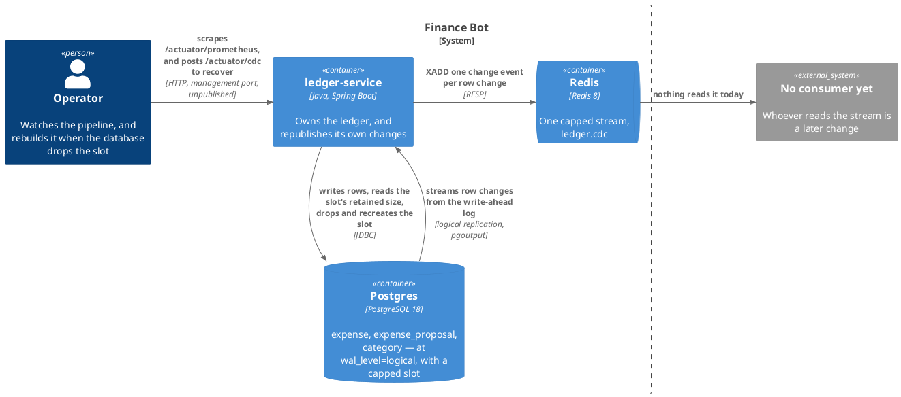
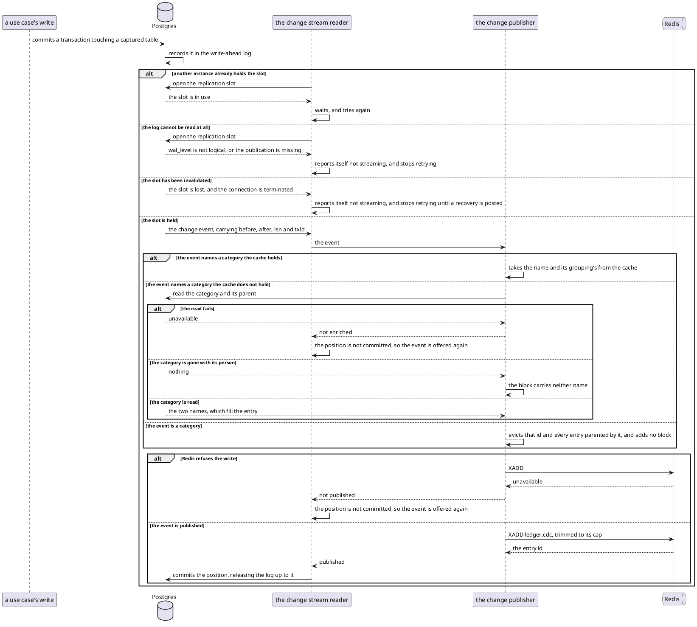
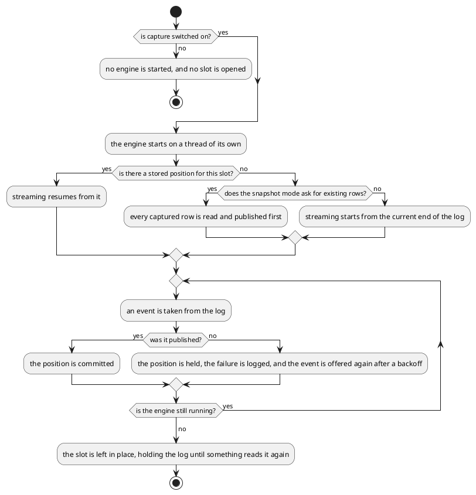
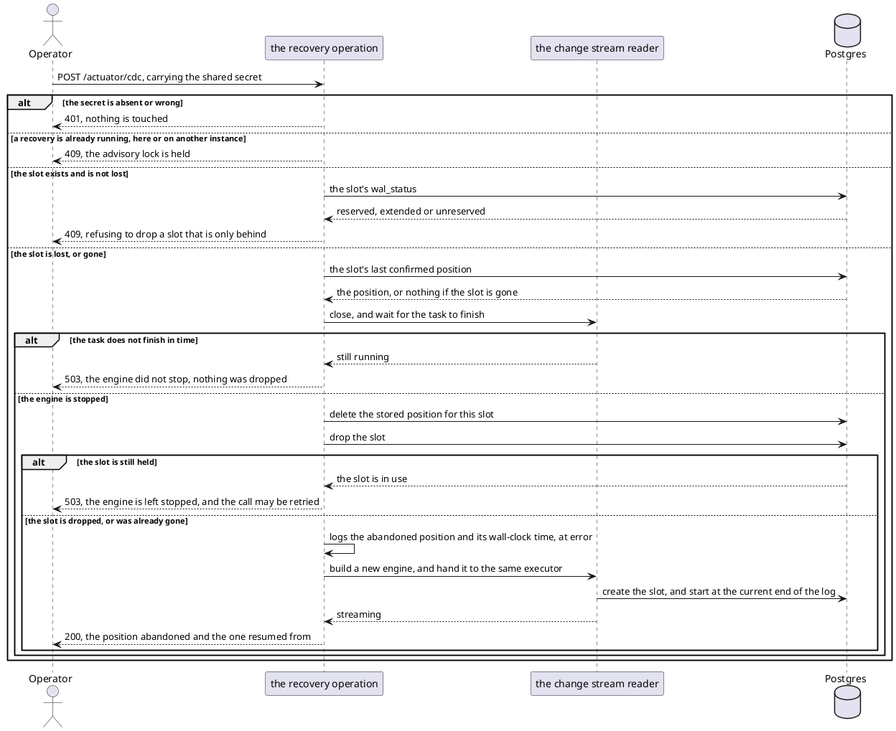

# Design: Broadcast Ledger Changes to Redis

**Affected Modules:** `ledger-service`

## Objective

Every change to the ledger is invisible outside the service. A category moved on a recorded expense, a proposal
accepted from Telegram, a category renamed — all of it lives and dies inside one Postgres database, and the only
way anything learns of it is by asking the HTTP API.

This change puts those changes on a wire. `ledger-service` reads its own write-ahead log and republishes every
row-level change to `expense`, `expense_proposal` and `category` into Redis. Nothing reads that wire yet; naming a
consumer is a later change. What this one buys is that the consumer, whenever it arrives, has a stream to read
rather than a pipeline to build.

It also settles which identity that consumer will see. A change event names a person by the internal `user_id`,
and the token a caller presents today names them by their Telegram identifier — so the first consumer to read
both would have two identities for one person and no way to join them. This change makes the token carry the
internal id too, which is a prerequisite for the consumer rather than a part of the pipeline (D13).

## Context

| What exists                                    | Where                                                                                                                 | What this change does with it                                              |
|------------------------------------------------|-------------------------------------------------------------------------------------------------------------------------|------------------------------------------------------------------------------|
| The `expense` table                            | [`V002`](../../ledger-service/src/main/resources/db/migration/V002__create_expense.sql)                                | Captured. Gains `REPLICA IDENTITY FULL`, no column                          |
| The `expense_proposal` table                   | [`V003`](../../ledger-service/src/main/resources/db/migration/V003__create_expense_proposal.sql)                       | Captured. Gains `REPLICA IDENTITY FULL`, no column                          |
| The `category` table                           | [`V001`](../../ledger-service/src/main/resources/db/migration/V001__create_user_and_category.sql)                      | Captured, so a `category_id` on the wire can be read from the engine's first start onward (D3, F49) |
| The `app_user` table, holding the Telegram id  | [`V001`](../../ledger-service/src/main/resources/db/migration/V001__create_user_and_category.sql)                      | Deliberately not captured, so the identifier never leaves the service (D12)  |
| The only place a token's subject becomes a caller | [`AuthenticatedCaller`](../../ledger-service/src/main/java/bot/finance/adapter/security/AuthenticatedCaller.java)    | Serves both chains, so the subject cannot change for one of them alone (D13) |
| `AuthenticatedUserId`, a domain value holding the Telegram id | [`AuthenticatedUserId`](../../ledger-service/src/main/java/bot/finance/domain/value/AuthenticatedUserId.java) | Becomes the internal id; nine commands and every use case follow it |
| The two minters                                | [`AccessTokenMinter`](../../ledger-service/src/main/java/bot/finance/adapter/security/AccessTokenMinter.java), [`SessionTokenMinter`](../../ledger-service/src/main/java/bot/finance/adapter/security/SessionTokenMinter.java) | Both put the internal id in the subject |
| The connector's handling of that token         | [`CallerTokenContext`](../../ai-connector-service/src/main/java/bot/finance/ai/adapter/grpc/CallerTokenContext.java)   | Nothing — it is an opaque string there, which is why the module list stays at one (F51) |
| The rule against transport facts in the core   | [Architecture](../../ledger-service/docs/conventions/architecture.md#naming-across-the-layer-boundary)                  | Already broken by `externalId`; this change satisfies it (F52)               |
| Accept and discard, as one statement each      | [ADR 0012](../../ledger-service/docs/adr/0012-a-set-of-rows-moves-between-tables-in-one-statement.md)                   | Fixes the stream's shape: the two are told apart only by transaction (F2)   |
| The refile statements this change was asked for | [`ExpenseEntityRepository`](../../ledger-service/src/main/java/bot/finance/adapter/persistence/ExpenseEntityRepository.java) | The `UPDATE … SET category_id` whose broadcast is the point of the change |
| The local Postgres                             | [`infrastructure/docker-compose.yaml`](../../infrastructure/docker-compose.yaml)                                       | Started with `wal_level=logical`, and joined by a Redis service              |
| The containerized Postgres every test runs on  | `ledger-service/src/test/java/bot/finance/common/containers/PostgresContainers.java`                                   | Started with `wal_level=logical` too, so the engine has a log to read (F14)  |
| The module's tech stack, naming neither        | [Orientation](../../ledger-service/docs/conventions/orientation.md)                                                    | Gains a cache and a change-data-capture engine; the page is corrected        |
| `/actuator/**`, admitted to anyone             | [`SecurityConfiguration`](../../ledger-service/src/main/java/bot/finance/adapter/security/SecurityConfiguration.java)   | The recovery operation cannot simply join it (D9)                            |
| A Prometheus endpoint switched on with no registry behind it | [`application.yaml`](../../ledger-service/src/main/resources/application.yaml)                            | Gains the registry that makes it answer at all (F27)                         |
| The banned-import list                         | [Architecture](../../ledger-service/docs/conventions/architecture.md#architecture-enforcement)                          | Gains `io.debezium..`, `org.apache.kafka..` and `org.springframework.data.redis..` |
| The one piece of work already off the request thread | [`ExecutorReportClearingDispatcher`](../../ledger-service/src/main/java/bot/finance/adapter/async/ExecutorReportClearingDispatcher.java) | Mirrored for how a background failure is bounded and logged |

## Proposed Solution

### What the change adds

The service reads its own write-ahead log through an embedded Debezium engine and writes each change to one Redis
stream. Nothing in `application` or `domain` is touched: this is a pipe between two adapters, carrying a
transport-shaped payload that the layering rules keep out of the core (F1).

| Surface                | What it becomes                                                                              |
|------------------------|------------------------------------------------------------------------------------------------|
| Postgres               | Runs at `wal_level=logical`, caps what a slot may retain, publishes three tables and a heartbeat table, and holds one logical replication slot |
| The service            | Runs one Debezium embedded engine on a thread of its own, started with the application context |
| Redis                  | Holds one capped stream, `ledger.cdc`, and nothing else                                        |
| `/actuator/health`     | Gains a component reading `STREAMING`, `STANDBY` or `DOWN` (F9)                                |
| `/actuator/prometheus` | Answers for the first time, carrying eight meters about the pipeline                          |
| `POST /actuator/cdc`   | Rebuilds a slot the database invalidated, and restarts the engine on it                       |
| The management port    | All three move off the service port onto one compose does not publish (D9)                    |

**The database is never allowed to fill.** A slot may retain a bounded amount of log, and past that bound Postgres
invalidates it rather than keeping the segments. This is a trade, not a safeguard: a Redis outage long enough to
reach the bound now loses every change made during it, where D5 promised none would be lost. D8 is where that is
recorded, and the recovery endpoint is what an operator uses afterwards.

**One stream, not one per table.** Accept is a `DELETE` from `expense_proposal` and an `INSERT` into `expense` in
one transaction; discard is the same `DELETE` alone (ADR 0012). Nothing distinguishes them except that the two
events share a transaction, so the two tables' events must arrive in one totally ordered sequence or the
distinction is unrecoverable (F2).

**The envelope is Debezium's own, plus one added block.** `op`, `before`, `after`, and a `source` block carrying
`lsn`, `txId` and `ts_ms` reach the stream unconverted (D4). An event on `expense` or `expense_proposal` also
carries the category's name and its grouping's, resolved by the publisher (D15).

**The enrichment is what makes the stream survive its own losses.** Everything else here treats a lost event as
acceptable — that is what D8's bound and the recovery operation both spend. A lost `category` event is not
acceptable in the same way: it is permanent, and from then on every expense filed under that category is
unreadable. Carrying the name on the expense event removes that asymmetry, because nothing about an expense then
depends on an earlier event having arrived (F67).

### Diagrams

The module takes the repository's [Diagram Format](../conventions/diagrams.md) unchanged. There is no component
diagram: classes belong to the plan.

#### Container — what this change reaches



Postgres is drawn twice over, once each way. The service writes to it and is fed by it, and the second arrow is
the whole subject of this change.

#### Flow — a row change reaching the stream



#### Flow — what the reader decides on the way up

The branches name one participant, so the decisions are the content.



#### Flow — rebuilding an invalidated slot



### Details

#### The migration

One migration, `V009__publish_ledger_changes.sql`:

```sql
ALTER TABLE expense          REPLICA IDENTITY FULL;
ALTER TABLE expense_proposal REPLICA IDENTITY FULL;
ALTER TABLE category         REPLICA IDENTITY FULL;

CREATE TABLE cdc_heartbeat (
    id        BOOLEAN     PRIMARY KEY DEFAULT TRUE CHECK (id),
    beat_at   TIMESTAMPTZ NOT NULL
);

INSERT INTO cdc_heartbeat (beat_at) VALUES (now());

CREATE PUBLICATION finance_ledger_cdc
    FOR TABLE expense, expense_proposal, category, cdc_heartbeat
    WITH (publish = 'insert, update, delete');
```

The publication is restricted to the three operations. Left at its default it publishes truncate too, which
arrives as an event with neither `before` nor `after` and no `category_id` to enrich from — an `op` the payload
table does not define (F78).

`REPLICA IDENTITY FULL` is what makes a delete legible. Under the default identity a `DELETE` event's `before`
holds the primary key alone, so a discarded proposal would reach the stream as an id and nothing else (F3).

**`cdc_heartbeat` is a single row the engine updates on a timer**, and it exists to move the slot forward. A slot's
retained log is cluster-wide, not per-table: while only uncaptured tables are written — a spending query on every
summary, a proposal report on every message — the engine has nothing to acknowledge and the slot pins the log
though everything is working (F15). The heartbeat gives it something. The table is in the publication so its write
reaches the slot, and out of the captured set so no heartbeat reaches the stream.

The publication is declared here rather than left to the engine because it keeps the captured set in the repository
where a diff can see it. There is no second database account to keep off `CREATE PUBLICATION`: Flyway runs as the
same `DB_USER` the service runs as (F4).

The replication slot is not declared here. Creating one cannot run inside a transaction, and Flyway wraps each
migration in one, so the engine creates its own slot on first start (F5).

**Where the engine's stored position lives is settled in the plan, not here.** It is a table in the ledger
database either way, written through Debezium's JDBC offset store. Whether that table is declared in `V009` or
created by the store on first start depends on what the store's own schema handling allows, which nothing in this
repository exercises yet (F18). The [database contract](../../ledger-service/docs/contracts/out/database.md) is
corrected to name it whichever way it lands.

#### What a stream entry carries

| Field        | Holds                                                                    |
|--------------|----------------------------------------------------------------------------|
| `payload`    | the Debezium change event as JSON, schemas off                            |
| `enrichment` | on an `expense` or `expense_proposal` event only: the category's name and its grouping's (D15) |

**A person is `user_id` on the wire, and nothing else.** The internal id is what every captured row carries; the
Telegram identifier lives in `app_user.external_id` and that table is not captured, so it never leaves the
service (D12). A consumer groups by `user_id` and cannot say whose ledger it is looking at.

**The same id is what a token's subject carries** (D13), so a consumer holding both a caller token and a stream
event is looking at one identity, not two.

Inside the payload, what a consumer keys on:

| Path            | Means                                                                     |
|-----------------|-----------------------------------------------------------------------------|
| `op`            | `c` insert, `u` update, `d` delete, `r` a snapshot read                    |
| `source.table`  | `expense`, `expense_proposal` or `category`                                |
| `source.lsn`    | the log position — with `source.table` and the key, the deduplication key  |
| `source.txId`   | the transaction, which is what ties a proposal's delete to an expense's insert |
| `before`/`after`| the whole row, both sides, because of `REPLICA IDENTITY FULL`              |

Delivery is at-least-once. A restart between publishing an event and committing its position republishes that
event, so a consumer that must not act twice deduplicates on all three of `source.table`, the row key and
`source.lsn` (F6). `source.lsn` alone is not a key: every record of a snapshot carries the same one.

#### The category on an expense event

An event on `expense` or `expense_proposal` carries an `enrichment` block beside the payload:

| Field       | Holds                                                                            |
|-------------|------------------------------------------------------------------------------------|
| `after`     | `categoryName` and `groupingName` for `after.category_id` — on an insert or update |
| `before`    | the same two for `before.category_id` — on an update or a delete                   |

**An update names both sides** (D18). A refile therefore says what the entry was filed under and what it is filed
under now, so a consumer keeping a per-category view can decrement one and increment the other without reading
anything else. Leaving the previous category a bare id would reopen the gap D15 exists to close, one step over
(F68). An insert carries `after` alone, a delete `before` alone.

**The publisher resolves it through a bounded LRU cache over a lookup** — a hit answers from memory, a miss reads
`category` joined to its parent and fills the entry (D16, D17).

**Eviction follows the parent, not just the row.** An entry holds two names drawn from two rows, its own and its
grouping's, while a `category` event names one row. A grouping renamed would evict only the grouping's own entry
and leave every child category serving the old `groupingName`, so a `category` event evicts both the entry keyed
by that id and every entry whose parent is that id (F74).

**A live expense's category cannot vanish.** `expense.category_id REFERENCES category (id)` declares no
`ON DELETE` action, so Postgres refuses to delete a category any expense still names (F75). The lookup for a live
expense therefore always resolves, which is the guarantee the whole enrichment rests on.

Three consequences the wire contract has to state:

- **A hit gives the name as of the event's position in the log; a miss gives the name as it is now.** Events
  arrive in log order, so a cached entry has already seen every rename up to that position. A cold entry is read
  from the live table instead, and a rename between the commit and the publish shows through. Cold entries are
  ordinary, not exceptional: a restart, a failover to the standby, and eviction under pressure each produce them,
  and the first pass after a restart is all misses (F69).
- **A redelivered event may not be byte-identical.** Delivery is at-least-once (F6), and the same event enriched
  from the cache once and from a live read again can carry two different names. The first copy a consumer saw
  wins; the deduplication key is what it keys on, and the two disagree only inside the window above (F76).
- **Both names are absent when the person is gone.** Deleting an `app_user` cascades to their categories and
  their expenses in one transaction, so every one of that person's expense delete events lands with no names
  beside them. This is the only route to an unresolvable id, and it is a whole person at once rather than a
  stray row (F70).

**A lookup that fails is not an absent category.** The publisher holds the log position and retries, exactly as
it does when Redis refuses (D5). Publishing the block absent instead would mint an event that is permanently and
undetectably wrong about the one thing D15 exists to guarantee (F77).

`category` stays on the stream (D3). Nothing depends on it now, so F49's hole — categories created before the
engine first started never appearing — stops mattering: the enrichment names them regardless.

#### The health component

| Reads       | When                                                                        |
|-------------|-------------------------------------------------------------------------------|
| `STREAMING` | the engine holds the slot and is consuming the log                          |
| `STANDBY`   | capture is on, another instance holds the slot, and this one is waiting     |
| `DOWN`      | capture is on, no instance holds the slot, and this one cannot take it      |

`STANDBY` is `UP`. A9 requires a second instance to serve normally, and every instance but one is a standby by
design, so a standby that reported `DOWN` would put most of a scaled deployment permanently in alarm (F9). The
readiness probe is unaffected either way: its group names `readinessState` alone
([`application.yaml`](../../ledger-service/src/main/resources/application.yaml)).

#### The bound on what a slot may retain

Postgres runs with `max_slot_wal_keep_size` set. Once the log retained for the slot passes it, the checkpointer
removes those segments anyway and marks the slot **invalidated**: `pg_replication_slots.wal_status` walks
`reserved` → `extended` → `unreserved` → `lost`, and at `lost` the slot can never be used again (D8).

What that buys and what it costs:

| Holds                                                    | Stops holding                                                        |
|----------------------------------------------------------|------------------------------------------------------------------------|
| The database's disk is bounded, whatever the pipeline does | D5's promise that no change is ever skipped                          |
| A Redis outage is survivable indefinitely                | Every change made after the bound is reached is gone, unrecoverably   |
| An operator has a fixed number to alarm on               | Recovery is manual, and is what `POST /actuator/cdc` exists for (F28) |

The setting is reloadable, unlike `wal_level`, so a deployment can raise it without a restart (F29).

#### The recovery operation

One write operation on a new actuator endpoint, `POST /actuator/cdc`. It runs the sequence the flow above draws,
and it exists because an invalidated slot cannot be resumed — only replaced.

| Step | What it does                                        | If it fails                                                 |
|------|-----------------------------------------------------|---------------------------------------------------------------|
| 1    | Closes the engine and waits for its task to finish  | 503 — nothing is dropped, so the slot is left as it was      |
| 2    | Deletes the stored position for that slot           | 503 — nothing is dropped, and the call may be retried        |
| 3    | `pg_drop_replication_slot`                          | 503 — the engine is left stopped, and the call may be retried |
| 4    | Builds a new engine and hands it to the same executor | 503 — the next restart of the service starts it            |
| 5    | The engine creates the slot and starts at the end of the log | Reported as `DOWN`, the way any failed start is        |

**The position is deleted before the slot is dropped, not after.** A crash between the two then leaves a deleted
position beside a slot that still exists, which is exactly a first start and heals itself (D6). The other order
leaves a fresh slot beside a stored position pointing into log that no longer exists, which nothing recovers
from (F37).

| The caller gets | When                                                                        |
|-----------------|-------------------------------------------------------------------------------|
| 200             | the slot was rebuilt, carrying the position abandoned and the one resumed from |
| 401             | the shared secret is absent or wrong                                          |
| 409             | the slot exists and its `wal_status` is not `lost`, a recovery is in flight in this JVM, or another instance holds the advisory lock |
| 503             | the engine would not stop, the position would not delete, or the slot would not drop |

**Who may call it, and from where** (D9): the operation lives on the management port, which compose does not
publish, and requires `CDC_RECOVERY_SECRET` in a header, compared in constant time. `/actuator/health` and
`/actuator/prometheus` share that port and stay open on it. Moving the three off the service port is what takes
them out of reach of anything outside the `backend` network, and it is why the existing assertions against
`/actuator/health` change address (F45).

Four things the sequence forces:

- **It refuses any slot that is not `lost`.** `extended` and `unreserved` are slots merely running behind, still
  usable, and dropping one would skip the log for nothing. The gate is `wal_status = 'lost'` or the slot's
  absence, not "is it active" (F38).
- **One at a time, across every instance.** Two concurrent calls would both close the engine and both try to
  drop the slot; two calls to *different* instances would let one recreate the slot while the other drops the
  one just created. A Postgres advisory lock, taken with `pg_try_advisory_lock` and held for the whole sequence,
  covers both — an instance that cannot take it answers 409 rather than queueing (D11, F31).
- **It loses data on purpose, and says how much twice.** Step 5 starts at the current end of the log, so
  everything between the abandoned position and now is gone. The response carries both positions, and the same
  pair is logged at error with the wall-clock time of the abandoned one — a response body nobody kept is not a
  record of which hours of the ledger never reached the stream (F32, F39).
- **It is re-postable.** A second call after a successful one meets a healthy slot and is refused; a second call
  after a failed one resumes from wherever the first stopped.

#### Which identity a token carries

Both tokens the service mints put the internal `user_id` in the subject, where the Telegram identifier is today.
The change is one type and everything that follows it:

| What                                        | Was                                      | Becomes                                          |
|---------------------------------------------|------------------------------------------|--------------------------------------------------|
| `AuthenticatedUserId`                       | a component named `externalId`           | a component naming the internal id, parsed and validated |
| The MCP token's subject                     | the Telegram identifier                  | the internal id                                  |
| The browser session token's subject         | the Telegram identifier                  | the internal id                                  |
| Eight commands carrying `AuthenticatedUserId` | the accessor `.externalId()`             | the accessor renames, and every reader with it   |
| `IntentExtractionRequest.userExternalId`    | what the MCP token is minted from        | the internal id (F56)                            |
| `UserRepository`                            | `findByExternalId` / `requireByExternalId` | gains a lookup by id; the external ones stay (F57) |

**Renaming is the point, not a side effect.** A type whose meaning changes while its accessor still reads
`.externalId()` is the exact trap this entry exists to close, so the component, the accessor, every call site and
the compact constructor's message all move together (F58).

**Four `application/dto` types carry a raw `String userExternalId`, and only one of them changes.**
`HandleIncomingMessageCommand` and `ResolveProposalsCommand` are built straight off a Telegram update, which is
the first-recognition path where the external identifier legitimately lives. `CreateExpenseCommand` follows the
same path. `IntentExtractionRequest` is the one that matters: the MCP token is minted from it in an adapter, not
in a use case
([`AiConnectorIntentExtractionAdapter`](../../ledger-service/src/main/java/bot/finance/adapter/aiconnector/AiConnectorIntentExtractionAdapter.java)),
so unless that field becomes the internal id the minted token keeps the Telegram one (F56).

**The subject is text and the id is a `BIGINT`.** The parse belongs in `AuthenticatedUserId`'s own compact
constructor, refusing a non-numeric subject as `InvalidUserException` the way it already refuses a blank one.
Without it a validly signed token with a non-numeric subject dies as a `NumberFormatException` and answers 500,
where the two identity refusals already in place answer 401 and 404 (F59).

**The user lookup must not be dropped as redundant.** With the id already on the token a use case no longer needs
the lookup to *obtain* anything, and its remaining job is the load-bearing one: refusing a caller whose row is
gone. Dropped, a token for a deleted user reads an empty ledger and writes rows against a `user_id` that
references nothing, and no test notices (F60).

**The external identifier survives where a person is first recognised** — the Telegram sign-in and the Telegram
message path — and in one answer the browser reads (F61).

This satisfies a rule the module already states and already breaks. `domain`/`application` may carry no
transport-shaped field, and an external identifier issued by Telegram is one
([Architecture](../../ledger-service/docs/conventions/architecture.md#naming-across-the-layer-boundary)); the
same section's own example is a chat id leaking inward (F52).

**The session API keeps answering the external identifier, and its schema is untouched.** `GET /api/v1/session`
answers the token's subject verbatim today, under a required property named `externalId`; after this change it
re-resolves the row and answers `user.externalId()` instead, so the field keeps both its name and its meaning.
The browser has no use for an internal id, and the alternative — leaving the field named `externalId` while it
carries something else — is a silent contract break that keeps `web-app` compiling (F61). This is what keeps
**Affected Modules** at one: the browser client reads that field
([`ledger-api.d.ts`](../../web-app/src/api/generated/ledger-api.d.ts)) and is unaffected by a change it cannot
see. It costs one lookup on a session read.

**A session minted before this lands carries the old subject.** Telegram identifiers are numeric, so such a token
does not fail to parse — it reads as an internal id that matches no row. What happens to those sessions is D14.

`ai-connector-service` is untouched. It holds the token as an opaque string and never reads its subject
([`CallerTokenContext`](../../ai-connector-service/src/main/java/bot/finance/ai/adapter/grpc/CallerTokenContext.java)),
and no proto field carries an identity either (F51).

**One log line follows the subject and one does not.** The sign-in logs the person it opened a session for, and
that becomes the internal id; first recognition keeps the external one, being the only place it is meaningful.
D12's premise is that the Telegram identifier stays inside the service, and a log line is where an identifier
leaves it (F62).

#### The meters

`micrometer-registry-prometheus` joins the build, because `/actuator/prometheus` is switched on in
`application.yaml` today with no registry behind it and does not answer (F27).

| Meter                                | Kind    | Says                                                                 |
|--------------------------------------|---------|------------------------------------------------------------------------|
| `ledger_cdc_events_published_total`  | counter | Events on the stream, tagged by `table` and `op`                     |
| `ledger_cdc_publish_failures_total`  | counter | Publish attempts Redis refused                                        |
| `ledger_cdc_event_lag_seconds`       | gauge   | Now, less the `source.ts_ms` of the last published event             |
| `ledger_cdc_slot_retained_bytes`     | gauge   | The log the slot is holding — the one to alarm on, against D8's bound |
| `ledger_cdc_slot_wal_status`         | gauge   | `reserved`, `extended`, `unreserved` or `lost`, as an ordinal        |
| `ledger_cdc_state`                   | gauge   | `STREAMING`, `STANDBY` or `DOWN`, matching the health component      |
| `ledger_cdc_category_lookups_total`  | counter | Enrichments, tagged hit or miss — the miss rate is how wide F69's window is |
| `ledger_cdc_category_lookup_failures_total` | counter | Lookups the database refused, which hold the position (F77)   |

The last three come from a query against `pg_replication_slots` on a timer, not from the engine — the engine
cannot see a slot it is not holding, and a standby has to report the same numbers (F33).

**The slot monitor runs whether capture is on or not.** A slot left behind by `CDC_ENABLED=false` is the most
dangerous state this change creates (F20, A16), and `ledger_cdc_slot_retained_bytes` is the only warning of it.
The monitor is bound to the slot's existence, not to the engine's, which its source already allows (F40).

**Lag alone does not mean stuck.** `ledger_cdc_event_lag_seconds` measures now less the last *published* event,
and the captured tables are written only when a person acts — so a quiet night reads as hours of lag on a
perfectly healthy pipeline. The heartbeat cannot reset it, because a heartbeat never reaches the stream (A6).
What separates idle from stuck is the retained bytes, which is why the two are read together (F41).

Nothing is scraped, dashboarded or alerted by this change; the meters are exposed and nothing more.

#### Configuration

| Variable                | Sets                                                | Default                    |
|-------------------------|-------------------------------------------------------|----------------------------|
| `CDC_ENABLED`           | whether the engine runs at all                      | `true`                     |
| `REDIS_URL`             | where Redis is reached                              | `redis://localhost:6379`   |
| `CDC_SLOT_NAME`         | the replication slot the engine holds               | `finance_ledger_cdc`       |
| `CDC_STREAM_KEY`        | the stream every change is written to               | `ledger.cdc`               |
| `CDC_STREAM_MAX_LENGTH` | roughly how many entries the stream keeps           | `100000`                   |
| `CDC_SNAPSHOT_MODE`     | whether existing rows are published on first start  | changes only, never a snapshot (D6) |
| `CDC_HEARTBEAT_INTERVAL`| how often the slot is moved on with no captured change | `30s`                   |
| `CDC_SLOT_MONITOR_INTERVAL` | how often the slot's retained size is read for the meters | `30s`               |
| `CDC_CATEGORY_CACHE_SIZE` | how many category entries the resolver holds      | `50000` (D17)              |
| `CDC_RECOVERY_SECRET`   | the header value the recovery operation demands     | *(none — the operation refuses every call without one)* |
| `MANAGEMENT_PORT`       | where health, metrics and recovery are served       | `1010`                     |

The publication name is not configurable: it is created by a migration, so a deployment cannot choose it.

`CDC_ENABLED=false` is what lets the service run against a Postgres that is not at `wal_level=logical` — a
developer's own, or a managed instance where the setting needs a restart (F8).

`CDC_RECOVERY_SECRET` is a secret and belongs in the deployment's secret store, like the two that already are.

Three things a deployment owes that no variable carries:

- **`max_slot_wal_keep_size=1GB` is the database's setting, not the service's.** It is applied to Postgres (D10).
  The service reads its effect through `ledger_cdc_slot_retained_bytes` and cannot set it.
- **`DB_USER` needs the `REPLICATION` attribute.** It works untouched everywhere this repository runs, because
  both Postgres instances make `DB_USER` the bootstrap superuser. A managed database does not (F19).
- **Switching capture off does not release the slot.** `CDC_ENABLED=false` on a service that has streamed leaves
  the slot behind, retaining the log with nothing reading it. Dropping it is a manual
  `pg_drop_replication_slot('finance_ledger_cdc')`, and it is the fastest way this change can take the database
  down (F20).

#### The store's own cost

| Cost                              | Bound                                                                              |
|-----------------------------------|--------------------------------------------------------------------------------------|
| An unread slot retains WAL             | Up to `max_slot_wal_keep_size`, then the slot is invalidated (D8)               |
| A slot with no captured change         | Bounded by the heartbeat, which is what keeps it moving (F15)                   |
| A Redis outage                         | The position is held rather than committed (D5), until the bound above ends it  |
| A slot left behind by `CDC_ENABLED=false` | The same bound, so it costs data rather than the database (F20)              |
| `REPLICA IDENTITY FULL`            | Every update and delete writes the whole old row to the log, not just the key (F13) |
| The stream                         | Capped by `CDC_STREAM_MAX_LENGTH`, trimmed on every write                           |

#### Build, enforcement and infrastructure

| Setting                                | Change                                                                        |
|----------------------------------------|---------------------------------------------------------------------------------|
| `ledger-service/build.gradle`          | `debezium-embedded`, `debezium-connector-postgres`, `debezium-storage-jdbc`, `spring-boot-starter-data-redis`, `micrometer-registry-prometheus` |
| `CleanArchitectureTest`                | `io.debezium..`, `org.apache.kafka..` and `org.springframework.data.redis..` join the packages banned from `domain`/`application` |
| `infrastructure/docker-compose.yaml`   | Postgres runs `postgres -c wal_level=logical -c max_slot_wal_keep_size=1GB`; a `redis` service joins the `backend` network; neither it nor the management port is published to the host (F11, D9) |
| `SecurityConfiguration`                | Its second chain splits: health and metrics keep `permitAll()`, the recovery operation demands the shared secret (D9, F45) |
| `CleanArchitectureTest`                | `authenticatedUserIdIsConstructedOnlyBySecurityAdapter` names a constructor the record does not have, and passes vacuously — it is fixed here because D13's "one place" claim rests on it and on nothing else (F63) |
| `McpTokens`, `SessionTokens`, `BrowserSessions` | Each takes the id `UserRowUtils` returned rather than an identifier the test invented, so seeding is ordered before minting (F64) |
| `PostgresContainers`                   | The test container runs `wal_level=logical` and a small `max_slot_wal_keep_size`, which every existing test inherits (F14, F35) |
| `application-test.yaml`                | `CDC_ENABLED` off, and the Redis health contributor off with it (F16, F17) |
| `common/containers/`                   | A Redis container singleton, for the capture tests that switch capture back on. A test needing Redis to refuse points its own context's `REDIS_URL` at a closed port, never stopping the singleton (F44) |
| `CategoryRowUtils`                     | Gains a rename. Nothing in the module renames or deletes a category — the tree is written once at initialization — so A39, A41 and A42 are driven by SQL through the helper (F79) |
| `jacocoTestCoverageVerification`       | Unchanged; the new classes are the module's own and are covered like any other  |

The test profile turning capture off is not a convenience. The Postgres container is a JVM-wide singleton and each
polling system test gets its own Spring context, so a default-on engine would put several engines on one slot in
one test run (F16). The Redis health contributor comes with the starter and would fail an existing assertion on
`/actuator/health` before any capture test ran (F17).

Six documents state facts this change moves, and are corrected with it:

| Document                                                                       | Correction                                                       |
|--------------------------------------------------------------------------------|--------------------------------------------------------------------|
| [Orientation](../../ledger-service/docs/conventions/orientation.md)            | "Messaging, caching: none of either" is no longer true            |
| [Architecture](../../ledger-service/docs/conventions/architecture.md)          | The banned-import list, and the adapter subpackages               |
| [Configuration](../../ledger-service/docs/configuration.md)                    | Eight variables, the `REPLICATION` attribute, `max_slot_wal_keep_size`, and what a slot past its bound costs |
| [The database contract](../../ledger-service/docs/contracts/out/database.md)   | The publication, the heartbeat table, and where the stored position lives |
| [ADR 0009](../adr/0009-the-connector-does-not-authenticate-its-caller.md)      | Its consequence "user data is unaffected" stops holding: descriptions, merchants and amounts now sit outside the database, pseudonymously — keyed by internal id, with no Telegram identity beside them (F12, F48) |
| `ledger-service/docs/contracts/out/` | A new page: what the service puts on the stream, and what it does not promise |
| `ledger-service/docs/contracts/in/`  | A new page: the operator's boundary — the six meters, the ordinals `ledger_cdc_slot_wal_status` and `ledger_cdc_state` map to, and the recovery operation's three answers (F42) |
| [`domain/authenticated-user-id.md`](../../ledger-service/docs/domain/authenticated-user-id.md) | Its whole subject: no longer the platform's external identity, and no longer "opaque text, never interpreted" — it is parsed now (F59) |
| [`contracts/in/web-session-api.md`](../../ledger-service/docs/contracts/in/web-session-api.md) | Three promises about "the external id" — the answer still carries it, but no longer because the token does |
| [`contracts/in/mcp.md`](../../ledger-service/docs/contracts/in/mcp.md) | What the caller token names, and what an unknown caller gets |
| [`usecases/initialize-a-new-user.md`](../../ledger-service/docs/usecases/initialize-a-new-user.md) | The one place the external identifier is still resolved |

## Acceptance Scenarios

### The change stream

- **A1:** a recorded expense's category change reaches the stream
  - Given: the engine is streaming, and a recorded expense exists
  - When: its category is changed through `PATCH /api/v1/expenses/RECORDED/{id}`
  - Then: an entry for that row reaches `ledger.cdc` with `op: u`, `source.table: expense`, `before.category_id`
    the old id, `after.category_id` the new one, and an `enrichment` naming both categories and both groupings

- **A2:** a proposal is recorded from a message
  - Given: the engine is streaming
  - When: a proposal is stored for an incoming message
  - Then: an entry for that row reaches the stream with `op: c`, `source.table: expense_proposal`, and `after`
    carrying the whole row

- **A3:** an accepted proposal is legible as an acceptance
  - Given: a pending proposal
  - When: the report is confirmed
  - Then: two entries appear sharing one `source.txId` — a `d` on `expense_proposal` whose `before` is the whole
    row, and a `c` on `expense` whose `after` matches it

- **A4:** a discarded proposal is legible as a discard
  - Given: a pending proposal
  - When: the report is discarded
  - Then: one entry appears, a `d` on `expense_proposal` with no `expense` insert in the same transaction

- **A5:** a category rename reaches the stream
  - Given: a category the entries on the stream refer to
  - When: it is created or changed
  - Then: an entry appears with `source.table: category`, carrying the tree's own change. A consumer needing only
    to read an expense does not depend on it (F72)

- **A6:** nothing else is captured
  - Given: the engine is streaming
  - When: a user row, a spending query, a proposal report or a heartbeat is written
  - Then: nothing for that row reaches the stream

- **A7:** Redis is unavailable, and comes back inside the bound
  - Given: the engine is streaming and Redis refuses writes
  - When: a captured row changes, and Redis returns before the slot reaches `max_slot_wal_keep_size`
  - Then: nothing is published while it is down, the health component reads `DOWN`, and that change reaches the
    stream along with every one made meanwhile, in order

- **A8:** the service restarts
  - Given: the engine has streamed and stopped
  - When: the service starts again
  - Then: streaming resumes from the stored position, and no change committed while it was down is missed

- **A9:** a second instance starts
  - Given: one instance already holds the slot
  - When: a second instance starts
  - Then: it starts and serves the API normally, its engine does not stream, and no change is published twice

- **A10:** the instance holding the slot dies
  - Given: two instances, one streaming
  - When: the streaming one is killed
  - Then: the other takes the slot once Postgres releases it, and resumes from the last committed position

- **A11:** capture is switched off
  - Given: `CDC_ENABLED=false`
  - When: the service starts against a Postgres at `wal_level=replica`
  - Then: it starts, serves every endpoint, opens no slot, and publishes nothing

- **A12:** the log cannot be read
  - Given: `CDC_ENABLED=true` and a Postgres at `wal_level=replica`
  - When: the service starts
  - Then: the service starts, every endpoint serves, the health component reads `DOWN`, and the engine stops
    retrying rather than looping

- **A13:** the stream stays capped
  - Given: a stream at its configured cap
  - When: further changes are published
  - Then: the oldest entries are trimmed, and the newest are present

- **A14:** the engine starts for the first time
  - Given: a database with existing expenses and no stored position for the slot
  - When: the engine starts, and an expense is changed afterwards
  - Then: nothing about the existing rows reaches the stream, and the change made afterwards does

- **A15:** the slot moves on while nothing captured is written
  - Given: the engine is streaming
  - When: only uncaptured tables are written for longer than the heartbeat interval
  - Then: the slot's confirmed position advances, the database releases the log behind it, and nothing reaches
    the stream

- **A16:** capture is switched off after it has streamed
  - Given: a service that has streamed, restarted with `CDC_ENABLED=false`
  - When: captured rows keep changing
  - Then: the service serves every endpoint, nothing is published, and the slot is still there retaining the log
    until the bound invalidates it or it is dropped by hand

- **A38:** an expense event names its category without any earlier event
  - Given: a category created long before the engine first started, and a consumer reading the stream from empty
  - When: an expense is recorded under it
  - Then: the event carries that category's name and its grouping's, and the consumer needs no `category` event
    to read it

- **A39:** a renamed category shows on the next expense
  - Given: a category renamed while the engine is streaming
  - When: an expense under it is recorded afterwards
  - Then: the event carries the new name

- **A40:** a person is deleted
  - Given: a person with categories and expenses, and a streaming engine
  - When: their `app_user` row is deleted and the cascade removes both
  - Then: their expense delete events reach the stream carrying `category_id` with no names beside it, and every
    one of them publishes rather than any being held

- **A41:** a category event carries no enrichment
  - Given: the engine is streaming
  - When: a category is created or renamed
  - Then: its own event reaches the stream with no `enrichment` block, and the cached entry for it is evicted

- **A42:** renaming a grouping reaches the categories under it
  - Given: cached entries for several categories filed under one grouping
  - When: that grouping is renamed, and an expense under one of those categories follows
  - Then: the expense event carries the grouping's new name

- **A43:** the lookup fails
  - Given: a cold category and a database that refuses the read
  - When: an expense event under it is handled
  - Then: nothing is published, the position is not committed, and once the read succeeds the event reaches the
    stream fully enriched — never with the block absent

- **A17:** the slot passes the bound it may retain
  - Given: the engine has not acknowledged a position for long enough that the slot's retained log passes
    `max_slot_wal_keep_size`
  - When: the database next removes log segments
  - Then: the slot is invalidated, the database's disk stops growing, `ledger_cdc_slot_wal_status` reads `lost`,
    the health component reads `DOWN`, and the engine cannot resume on its own

### `POST /actuator/cdc`

- **A18:** an invalidated slot is rebuilt
  - Given: an invalidated slot, and an engine that is not streaming
  - When: the operator posts the recovery operation
  - Then: the response is 200 carrying the abandoned position and the one being resumed from, the health
    component returns to `STREAMING`, and a change made afterwards reaches the stream

- **A19:** what happened in the gap is gone
  - Given: a slot invalidated while ten expenses were changed
  - When: the slot is rebuilt
  - Then: none of those ten reaches the stream, ever, and nothing about them is recoverable from Redis

- **A20:** the slot is absent rather than invalidated
  - Given: a slot dropped by hand, and an engine that is not streaming
  - When: the operator posts the recovery operation
  - Then: the response is 200, a slot is created, and streaming starts at the current end of the log

- **A21:** a slot that is only behind is not dropped
  - Given: a slot whose `wal_status` is `reserved`, `extended` or `unreserved`
  - When: the operator posts the recovery operation
  - Then: the response is 409 for each of the three, the slot is untouched, and streaming is uninterrupted

- **A26:** the engine meets an invalidation mid-stream
  - Given: a streaming engine whose slot is invalidated under it
  - When: the next change is committed
  - Then: the engine stops rather than retrying, the health component reads `DOWN`, and it stays there until a
    recovery is posted

- **A22:** two recoveries at once
  - Given: a recovery in flight
  - When: a second is posted, to the same instance or to another one
  - Then: the second answers 409 either way, and the first completes as though it had not arrived

- **A29:** the recovery operation is called without the secret
  - Given: the operation is reachable on the management port
  - When: it is posted with no header, or with the wrong value
  - Then: the response is 401, the engine is untouched, and no slot is dropped

- **A30:** health and metrics need no secret
  - Given: the management port
  - When: `/actuator/health` and `/actuator/prometheus` are requested with no header
  - Then: both answer, as they do today

- **A23:** the engine will not stop
  - Given: an engine whose task does not finish within the wait
  - When: the operator posts the recovery operation
  - Then: the response is 503, no slot is dropped, and no stored position is deleted

### The caller's identity

- **A31:** an MCP caller is named by the internal id
  - Given: a person whose message is being handled
  - When: the service mints a caller token and the connector calls a tool with it
  - Then: the tool acts on that person's ledger, and the token's subject is the same `user_id` a change event
    for those rows carries

- **A32:** a browser session is named by the internal id
  - Given: a person signing in through Telegram
  - When: they are issued a session and then browse and refile
  - Then: every endpoint acts on their own ledger, and the session's subject is that same `user_id`

- **A33:** a token naming no user
  - Given: a validly signed token whose subject is a number matching no user row
  - When: it is presented to a browser endpoint and to an MCP tool
  - Then: the browser endpoint answers 404 saying the caller is unknown and the tool answers its own unknown-user
    error, each as it already does, and nothing is read or written

- **A36:** a token whose subject cannot be a user id
  - Given: a validly signed token whose subject is not a number
  - When: it is presented to a browser endpoint and to an MCP tool
  - Then: it is refused the way a malformed identity already is, never as a 500

- **A37:** the session answer is unchanged
  - Given: a signed-in person
  - When: the page reads `GET /api/v1/session`
  - Then: `externalId` carries their Telegram identifier exactly as before, and the browser needs no change

- **A34:** the connector is unaffected
  - Given: a caller token in the new shape
  - When: the connector receives it over gRPC and attaches it to an MCP call
  - Then: it passes it through unread, and no `ai-connector-service` behaviour changes

- **A35:** a session minted before the change
  - Given: a session token whose subject is a Telegram identifier
  - When: it is presented after this change is deployed
  - Then: it is refused as an unknown caller, exactly as A33, and the person signs in again

### The meters

- **A24:** the pipeline is observable
  - Given: the engine has published events and Redis has refused at least one
  - When: `/actuator/prometheus` is scraped
  - Then: it answers, and carries a published count tagged by table and operation, a failure count, the event
    lag, the slot's retained bytes, its WAL status and the engine's state

- **A25:** a standby reports the slot too
  - Given: two instances, one streaming and one standby
  - When: both are scraped
  - Then: both carry the same slot retained bytes and WAL status, and differ in `ledger_cdc_state`

- **A27:** an abandoned slot is still watched
  - Given: a service restarted with `CDC_ENABLED=false`, having streamed before
  - When: it is scraped
  - Then: `ledger_cdc_slot_retained_bytes` and `ledger_cdc_slot_wal_status` still report the slot left behind,
    and `ledger_cdc_state` reads `DOWN`

- **A28:** an idle ledger is not a stuck one
  - Given: a healthy streaming engine and no captured change for hours
  - When: it is scraped
  - Then: `ledger_cdc_event_lag_seconds` reads those hours, and `ledger_cdc_slot_retained_bytes` stays near zero
    because the heartbeat keeps moving the slot

## Decisions

- **D1:** How is Debezium attached to the service?
  - Answer: The Debezium embedded engine runs inside the `ledger-service` JVM, on a thread of its own, started
    and stopped with the application context. No Kafka, no Kafka Connect, no Debezium Server container.
  - Basis: decided — the user chose the embedded engine over a Debezium Server container and over a
    transactional outbox (2026-08-11). The module's whole test culture is Testcontainers integration tests under
    a coverage gate ([Testing](../../ledger-service/docs/conventions/testing.md)), which an embedded engine sits
    inside and a sidecar container's YAML does not.

- **D2:** In what form are changes published to Redis?
  - Answer: `XADD` to one Redis stream, capped by `MAXLEN ~`. Not Pub/Sub.
  - Basis: decided — the user chose Streams over Pub/Sub (2026-08-11). Nothing reads the wire yet, and Pub/Sub
    with no subscriber discards every message, so there would be no way to see that the pipeline works at all.

- **D3:** Which tables are captured?
  - Answer: `expense`, `expense_proposal` and `category`. Not `app_user`, `spending_query` or `proposal_report`.
  - Basis: decided — the user chose the three over the two they first named (2026-08-11). A change event carries
    `category_id`, which means nothing to a consumer that cannot resolve it, and resolving it is exactly what the
    change was asked for.

- **D4:** What shape does a published event have?
  - Answer: Debezium's own envelope, JSON, schemas off, put on the stream unaltered under a single `payload`
    field.
  - Basis: decided — the user chose the Debezium envelope over a trimmed one of the module's own design
    (2026-08-11). There is no consumer, so there is nobody to design a narrower contract for, and a bespoke shape
    would be a contract invented against no requirement.

- **D5:** What does the service do while Redis will not accept writes?
  - Answer: It holds the log position and retries with a backoff, indefinitely. No change is ever skipped, and
    the position is committed only for an event Redis acknowledged. The health component reads `DOWN` while this
    lasts, and the database's log grows for as long as it does.
  - Basis: decided — the user chose holding the position over committing past the failure and over stopping the
    engine (2026-08-11). Nothing in the repository bounds a background failure that must not lose data; the one
    existing background path drops work ([Configuration](../../ledger-service/docs/configuration.md), the
    clearing pool's queue), but it clears buttons off a Telegram message and losing one costs nothing. A change
    to the ledger is not that, so the log growth is the accepted price and is what F7 and F20 have to be
    monitored for.

- **D6:** Does the engine publish the rows that already exist, the first time it starts?
  - Answer: No. Streaming starts at the current end of the log, so the stream carries changes only.
    `CDC_SNAPSHOT_MODE` defaults accordingly, and a deployment that wants a backfill sets it.
  - Basis: decided — the user chose changes-only over a full snapshot (2026-08-11). A snapshot would put a copy
    of every ledger row into a capped stream with no reader, which the cap then discards; a consumer's first
    picture comes from the HTTP API instead.

- **D7:** Does a capture pipeline that cannot start stop the service?
  - Answer: No. The service starts, serves every endpoint, and reports the capture component `DOWN`. A busy slot
    is retried forever, because A9 and A10 depend on it. A log that cannot serve logical replication is
    permanent: the engine stops retrying and stays `DOWN` (F24).
  - Basis: decided — the user chose a degraded service over a refused startup (2026-08-11). The module's
    precedents both stop startup — polling with no bot token, a keystore that will not open
    ([Configuration](../../ledger-service/docs/configuration.md)) — but each is a feature the service exists to
    provide. No product behaviour depends on capture today, so refusing to start would take the bot and the web
    app down for a subsystem nobody reads.

- **D8:** Is the log a slot may retain bounded, and at what cost?
  - Answer: Yes. Postgres runs with `max_slot_wal_keep_size` set, and past it the slot is invalidated rather than
    the segments kept. This overrides the guarantee D5 rests on: a Redis outage that reaches the bound loses
    every change made during it, permanently and with no way to replay them. The database's disk is what is
    being protected, and completeness of the stream is what is being spent.
  - Basis: decided — the user chose a bounded database over a lossless stream (2026-08-11). D5 chose to hold the
    log position rather than skip events, which without a bound means an unread pipeline can fill the disk and
    take the ledger down; nothing reads the stream yet, so a gap in it costs nothing today and a dead database
    costs everything.

- **D9:** Who may run the recovery operation?
  - Answer: Two things together. The management endpoints move to a port of their own, which compose does not
    publish, so nothing outside the `backend` network reaches them. On top of that the recovery operation
    requires a shared secret in a header, `CDC_RECOVERY_SECRET`, compared in constant time; a request without it
    answers 401. `/actuator/health` and `/actuator/prometheus` stay open on that port, unchanged.
  - Basis: decided — the user chose the unpublished port plus a shared secret over either alone, and rejected an
    operator-audience token (2026-08-11). The token was the wrong shape: both tokens this service mints are
    minted by the service inside a flow of its own — the MCP one when it calls the AI connector
    ([`AiConnectorIntentExtractionAdapter`](../../ledger-service/src/main/java/bot/finance/adapter/aiconnector/AiConnectorIntentExtractionAdapter.java)),
    the session one when a person signs in through Telegram
    ([`SessionController`](../../ledger-service/src/main/java/bot/finance/adapter/web/SessionController.java)).
    Neither exchanges a human credential, so an operator token would have to be minted by whoever holds the
    signing keystore — making `TOKEN_SIGNING_KEYSTORE_PASSWORD` the real credential and the token a wrapper over
    it. Audiences pay for themselves with many operators, revocation and expiry, none of which exist here.
  - Consequence: `A11` and the existing `/actuator/health` assertions move to the management port, and
    `SecurityConfiguration`'s second chain is split — the two open endpoints keep `permitAll()`, the recovery
    operation does not (F45).

- **D12:** Which identity does a change event carry for the person it belongs to?
  - Answer: The internal `user_id` alone. `app_user` is not captured, so the Telegram identifier in
    `external_id` never reaches Redis and no consumer can tie a ledger to a person. A consumer that later needs
    to correlate a stream event with one of its own callers gets the internal id there too, which means the MCP
    token would carry the internal id instead of the external one — a change for that consumer to make, not
    this one (F50).
  - Basis: decided — the user chose keeping the Telegram identifier inside the service over capturing `app_user`
    as a fourth table (2026-08-11). It confirms D3's exclusion rather than reversing it, and it means the data
    at rest in Redis is pseudonymous: descriptions, merchants and amounts, with no identity attached (F48).

- **D10:** How much log may the slot retain before it is invalidated?
  - Answer: 1GB. `max_slot_wal_keep_size=1GB` on the database, which is sixty-four 16MB segments.
  - Basis: decided — the user chose 1GB over 4GB and over 256MB (2026-08-11). The repository sizes nothing on
    disk, so the number is chosen against write volume rather than against a measured volume: the captured
    tables are written only when a person records or refiles an expense, so 1GB is days of a Redis outage, while
    bounding the database's growth to a figure a deployment can plan around.

- **D11:** How do two instances avoid recovering at the same time?
  - Answer: A Postgres advisory lock held for the whole sequence, taken with `pg_try_advisory_lock`. An instance
    that cannot take it answers 409, the same as a recovery already in flight inside one JVM. The lock is
    released when the sequence ends or the connection dies, so a killed instance does not strand it.
  - Basis: decided — the user chose the advisory lock over declaring the service single-instance and over
    extending the lock to the engine's whole lifetime (2026-08-11). It puts the race in the database, which is
    the module's existing instinct
    ([ADR 0012](../../ledger-service/docs/adr/0012-a-set-of-rows-moves-between-tables-in-one-statement.md)), and
    it leaves A9 and A10 standing — the slot's own exclusivity keeps electing the streamer, and the lock covers
    only the operation that no election protects.

- **D15:** Does an expense event carry its category's name, or only its id?
  - Answer: Its name, and its grouping's, in an `enrichment` block the publisher adds beside Debezium's payload.
    This overrides D4's "unaltered envelope" for these two tables; `category` and heartbeat events are still
    published exactly as Debezium produces them.
  - Basis: decided — the user chose enrichment over a denormalized `category_name` column and over reopening the
    transactional outbox (2026-08-11). The design had one lossy transport carrying two incompatible
    requirements: an expense may be lost, which is what D8's bound and the recovery operation deliberately buy,
    while a lost `category` event is permanent and makes every expense under it unreadable from then on. D4 was
    chosen because no consumer existed to design a contract for; a consumer's requirement is now stated, and it
    is an addition rather than a narrowing.
  - Consequence: a denormalized column was rejected because renaming a category would then have to update every
    expense filed under it, and ADR 0012 requires both tables to carry identical columns.

- **D16:** How does the publisher resolve a category id to a name?
  - Answer: A bounded LRU cache over a lookup of `category` joined to its parent. A hit answers from memory; a
    miss reads the row and fills the entry. The `category` events the engine already delivers evict what they
    touch, so a rename or a delete cannot leave a stale entry behind.
  - Basis: decided — the user chose the bounded cache over holding every category in memory and over querying on
    every event (2026-08-11). The full map is small — `Grouping.defaults()` seeds 20 groupings and 89 categories
    per person, so roughly 6KB each — but its size follows the number of people with no ceiling, and the user
    declined an unbounded map on that ground.
  - Consequence: the name a consumer receives is as of the event's log position on a hit and as of now on a
    miss, and nothing on the wire says which (F69).

- **D17:** How large is the category cache?
  - Answer: `CDC_CATEGORY_CACHE_SIZE`, defaulting to 50 000 entries — around 450 whole catalogues, roughly 3MB.
    The number is not fixed by this design; `ledger_cdc_category_lookups_total` is what a deployment tunes it
    against.
  - Basis: decided — the user chose a variable with a default over settling a number now (2026-08-11). Nothing
    in the repository sizes memory, and the hit rate is the only evidence that would settle it — which does not
    exist until the pipeline runs. The default is chosen so that a deployment at this service's present size
    never evicts.

- **D18:** Does a refile's event name the category it moved *from*?
  - Answer: Yes. On an update the block carries both sides, resolving `before.category_id` and
    `after.category_id` separately. On an insert only the `after` side is named, on a delete only the `before`
    side.
  - Basis: decided — the user chose both sides over naming the previous category by id alone (2026-08-11).
    Leaving it a bare id reopens the exact gap D15 closes, one step over: a consumer keeping any per-category
    view has to decrement the old category, and could only name it from a `category` event that may never have
    arrived. It costs a second resolve on an update, and a refile resolves two entries that are usually both
    warm.

- **D13:** Which identity does a minted token name a person by?
  - Answer: The internal `user_id`, on both the MCP token and the browser session token. `AuthenticatedUserId`
    becomes that id, every command carrying it follows, and each use case resolves its user by id rather than by
    external identifier. The Telegram identifier survives only where a person is first recognised.
  - Basis: decided — the user asked for the mint to join this task, as a prerequisite for the consumer that will
    read both a caller token and the stream (2026-08-11). It could not be done for the MCP token alone:
    [`AuthenticatedCaller`](../../ledger-service/src/main/java/bot/finance/adapter/security/AuthenticatedCaller.java)
    is the single construction point for both chains, and the value it builds is carried by nine commands and
    read by every use case, so one subject changing would leave one type meaning two different things.
  - Consequence: this is a cross-cutting refactor of the module's identity model, unrelated to the pipeline, and
    it roughly doubles the task. It is in scope on the user's call.

- **D14:** What happens to a session minted before the subject changed?
  - Answer: Nothing is built for them. An old token's subject reads as an internal id, matches no row, and is
    refused the way any unknown caller is. The window closes on its own as the seven-day lifetime runs out.
  - Basis: decided — the user chose letting them lapse over a version claim and over a key rotation
    (2026-08-11). Neither alternative is free: a claim is new code on the session token, and a rotation kills
    every live MCP token with it, one key pair signing both. The refusal is safe either way, so what is bought
    is a tidier message and it is not worth the price.

## Design Findings

Grilled (2026-08-11), `grill-design`: failure modes, retries, concurrency, data edges, compatibility, lifecycle,
observability, authorization, limits, business invariants. Examined and clear: idempotency, contract
compatibility, business invariants.

Grilled again (2026-08-11), `grill-design`, over the WAL bound, the recovery operation and the meters. Examined
and clear: contract compatibility, the operation's re-postability, the heartbeat table's shape.

Grilled a third time (2026-08-11), `grill-design`, over the identity change. Examined and clear: the connector,
the persistence cost of the new lookup, concurrency at the mint, and the change stream.

Grilled a fourth time (2026-08-11), `grill-design`, over the enrichment. Examined and clear: documents stating
the old envelope, the cache key — `category.id` is globally unique, so no `user_id` joins it — and the ordering
of eviction against enrichment on one engine thread.

| #   | Question                                                | Answer                                                                       | Evidence                                                                 |
|-----|---------------------------------------------------------|--------------------------------------------------------------------------------|----------------------------------------------------------------------------|
| F1  | Does the payload reach `application`?                   | No — adapter to adapter; a Debezium envelope is a transport-shaped type      | `architecture.md`, Naming Across the Layer Boundary                       |
| F2  | One stream or one per table?                            | One, because accept and discard differ only by a shared transaction           | ADR 0012                                                                  |
| F3  | Does a delete carry the row that went?                  | Only under `REPLICA IDENTITY FULL`; the default gives the key alone           | `V003`, whose only key is `id`                                            |
| F4  | Why declare the publication in a migration?             | Diff visibility alone — Flyway runs as the same `DB_USER` the service does   | `application.yaml`, whose `spring.flyway` names no account of its own     |
| F5  | Why is the slot not in the migration?                   | Creating one cannot run inside a transaction, and Flyway wraps every migration | `V001`–`V008`, all transactional DDL                                     |
| F6  | What is the deduplication key?                          | `source.table`, the row key and `source.lsn` together                        | A snapshot, whose records all carry one LSN                               |
| F7  | What does an unread slot cost?                          | The database retains its log without bound                                    | the slot is cluster-wide, not per-table                                   |
| F8  | Can the service run without logical replication?        | Yes, with `CDC_ENABLED=false`                                                 | `configuration.md`, where `TELEGRAM_POLLING_ENABLED` does the same        |
| F9  | Is a standby instance unhealthy?                        | No — `STANDBY` is `UP`; only a slot nobody holds is `DOWN`                   | A9; `application.yaml`, whose readiness group names `readinessState`      |
| F10 | Does anything on the API change?                        | No — no endpoint, no schema, no proto, no MCP tool                           | `openapi/ledger-api.yaml`, `proto/`, untouched                            |
| F11 | Is Redis reachable from outside?                        | No — it joins the `backend` network and publishes no port                    | `infrastructure/docker-compose.yaml`, where only Postgres publishes one   |
| F12 | Does this widen what a network intruder gets?           | Yes — deferred with every other service-to-service credential                | ADR 0009, whose consequence list this change corrects                     |
| F13 | What does `REPLICA IDENTITY FULL` cost?                 | The whole old row in the log on every update and delete                       | `V002`, whose rows are small and few per person                           |
| F14 | Do existing tests need a different Postgres?            | Yes — `wal_level=logical` on the shared container                            | `PostgresContainers`, a JVM-wide singleton                                |
| F15 | Does a healthy engine still pin the log?                | Yes, while only uncaptured tables are written — hence the heartbeat          | `SpendingQueryEntityRepository`, `proposal_report`, written every turn    |
| F16 | What does a default-on engine do to the test suite?     | Several engines on one slot in one run — so the test profile turns it off    | `testing.md`, a context per polling system test class                     |
| F17 | Does the Redis starter break an existing test?          | Yes — its health contributor fails the aggregate; off wherever capture is off | `McpAuthenticationSystemTest`, which asserts `/actuator/health` is 200    |
| F18 | Where does the stored position live?                    | A table in the ledger database — Flyway-declared or store-created, settled in the plan | deferred: reading `debezium-storage-jdbc`, which nothing here exercises |
| F19 | Does `DB_USER` need anything it has not got?            | The `REPLICATION` attribute; it is the superuser in both instances here      | `docker-compose.yaml`, `PostgresContainers`                               |
| F20 | Does switching capture off release the slot?            | No — it is dropped by hand, or the log grows without bound                   | F7, the same slot                                                         |
| F21 | Is the engine's thread contended with anything?         | No — its own thread, like the clearing pool's                               | `ExecutorReportClearingDispatcher`                                        |
| F22 | Does the payload need a numeric or temporal mode?       | No — money is `BIGINT` minor units, instants are `TIMESTAMPTZ` read as UTC   | ADR 0011; `application.yaml`, `SET TIME ZONE 'UTC'`                       |
| F23 | Can a capture test assert "one entry" on the stream?    | No — the slot is database-wide and the container is shared; filter by user   | `PostgresContainers`                                                      |
| F24 | Is a busy slot told from an unusable log?               | Yes — Postgres answers a busy slot with its own error, distinct from the rest | deferred: verified in the plan's first step against a real container      |
| F25 | Does bounding the slot change what F7 warned of?        | Yes — the failure moves from a full disk to a gap in the stream              | D8, which spends one for the other                                        |
| F26 | Can an invalidated slot be resumed?                     | No — only replaced, which is why the recovery operation exists              | `pg_replication_slots`, whose `lost` status is terminal                    |
| F27 | Does `/actuator/prometheus` answer today?               | No — the endpoint is enabled with no registry on the classpath              | `application.yaml` lines 91-97; `build.gradle`, which names no micrometer registry |
| F28 | Is recovery automatic?                                  | No — an operator posts it, because it decides to abandon data               | D8, whose gap nothing else may choose to accept                           |
| F29 | Does the bound need a database restart?                 | No — `max_slot_wal_keep_size` is reloadable, unlike `wal_level`             | deferred: verified against a real container in the plan's first step       |
| F30 | May a healthy slot be dropped through the operation?    | No — 409; dropping one would skip the log for nothing                       | A21                                                                       |
| F31 | Two recoveries at once?                                 | The second is refused, not queued                                           | A22; both would close the engine and drop the same slot                   |
| F32 | What records the gap a recovery creates?                | The 200's two positions, and nothing else                                   | A19, where the changes themselves are unrecoverable                       |
| F33 | Can the engine report the slot's retained size?         | No — a standby holds no slot; the numbers come from `pg_replication_slots`  | A25                                                                       |
| F34 | Does the recovery operation touch Redis?                | No — the stream keeps what it has, and the gap simply never appears in it   | the sequence, which names Postgres and the engine only                    |
| F35 | Can a test reach A17?                                   | Only with a small bound on the shared container plus enough log and a checkpoint | `PostgresContainers`, a JVM-wide singleton every class inherits      |
| F36 | Is an invalidated slot a third kind of start failure?   | No — it joins the permanent class, stopping rather than retrying           | F26, `lost` being terminal; D7, which binds a permanent failure           |
| F37 | Which order do the drop and the delete go in?           | Delete the position first; the crash window then heals as a first start    | D6, where no stored position means start at the end of the log           |
| F38 | Which slot states does the operation refuse?            | Everything but `lost` and absent — `extended` and `unreserved` are usable  | F26, the `reserved → extended → unreserved → lost` walk                   |
| F39 | Is a response body enough record of the loss?           | No — the two positions are logged at error with the abandoned one's time  | `testing.md`, which reserves a log assertion for a path leaving no other trace |
| F40 | Does the slot monitor run with capture off?             | Yes — it is bound to the slot's existence, not the engine's               | F20, A16, the state this change is most dangerous in                      |
| F41 | Does high lag mean the pipeline is stuck?               | No — an idle ledger reads the same; retained bytes is what separates them | A6, which keeps heartbeats off the stream                                 |
| F42 | Does the operator boundary earn a contract page?        | Yes, under `contracts/in/` — the meters, their ordinals, and the operation | `orientation.md`, one page per boundary with a system outside the service |
| F43 | Is the recovery endpoint reachable from a browser?      | No — nginx proxies `/api/` alone; the published port and the network reach it | `web-app/nginx.conf`; cited so D9 is decided against the real surface  |
| F44 | How does a test make Redis refuse?                      | Its own context's `REDIS_URL` points at a closed port                      | `testing.md`, where a test never manages a singleton's lifecycle          |
| F45 | What does moving to a management port break?            | Every existing assertion against `/actuator/health` changes address        | `McpAuthenticationSystemTest`, which requests it on the service port      |
| F46 | Does the advisory lock survive a killed instance?       | Yes — a session-level lock is released when the connection dies           | deferred: verified against a real container in the plan's first step       |
| F47 | Does the recovery secret reach a log or a URL?          | No — it is a header, never a path segment, and is never logged            | `configuration.md`, whose note says the same of the bot token in a URL    |
| F48 | Is the data on the stream attributable to a person?     | No — `user_id` only; `app_user` is not captured                          | D12; `V001`, where `external_id` lives on the uncaptured table            |
| F49 | Can a consumer resolve a category created before the engine first started? | From the `category` stream, no — but D15 puts the name on the expense event, so it no longer needs to (F72) | D6, which takes no snapshot; D15 |
| F50 | What would a consumer need to correlate an event with its own caller? | The token to carry the internal id — brought into scope as D13 | superseded by D13; the row is kept because the body cites it |
| F51 | Does the connector change with the token's subject?     | No — opaque string, and no proto field carries an identity                | `CallerTokenContext`, a `Context.Key<String>` passed through             |
| F52 | Does the current `AuthenticatedUserId` break a rule?     | Yes — a Telegram identifier is a transport fact inside `domain`          | `architecture.md`, Naming Across the Layer Boundary, whose example is a chat id |
| F53 | Where is each token actually minted from?               | The session from the row sign-in resolved; the MCP one from a DTO field in an adapter | `SessionController`; `AiConnectorIntentExtractionAdapter`     |
| F54 | Does the `imi` claim or the audiences change?           | No — only the subject                                                    | `AccessTokenMinter`, whose other claims are untouched                    |
| F55 | Does anything log the external identifier today?         | Yes; each line follows whatever its source now carries                  | `AcceptExpensesUseCase`, `HandleIncomingMessageUseCase`                  |
| F56 | Which raw-`String` DTO field must change?               | `IntentExtractionRequest.userExternalId` — the MCP token is minted from it | `AiConnectorIntentExtractionAdapter`, which mints in the adapter        |
| F57 | Does `findByExternalId` go away?                        | No — sign-in and the Telegram path still resolve an external identifier  | `InitializeUserUseCase`, `UserRepository`                                |
| F58 | May the type keep its accessor name?                    | No — `.externalId()` meaning an internal id is the trap D13 closes       | `AuthenticatedUserId`, whose component names the meaning                 |
| F59 | What refuses a subject that is not a number?            | The compact constructor, as `InvalidUserException`, never a 500          | `AuthenticatedUserId`, which already refuses a blank one                 |
| F60 | Can the user lookup be dropped once the id is on the token? | No — it is the only thing refusing a caller whose row is gone         | `UserRepository`, whose javadoc gives it that job                        |
| F61 | Does `GET /api/v1/session` change?                      | No — it re-resolves the row and answers the external id, as its schema says | `openapi/ledger-api.yaml`, `web-session-api.md`, `ledger-api.d.ts`    |
| F62 | Does an identifier leave the service through a log?     | The sign-in line follows the subject; first recognition keeps the external one | D12, whose premise a log line can break                            |
| F63 | Does the ArchUnit rule enforce "one place"?             | Not today — it names a constructor the record has not, and passes empty  | `CleanArchitectureTest`, `allowEmptyShould(true)`                        |
| F64 | Do the token fixtures still work?                       | Only reordered — they take the id `UserRowUtils` returned                | `McpTokens`, `SessionTokens`, `BrowserSessions`                          |
| F65 | Does a `@WebMvcTest` slice need a real id?              | No — it wires no database and its ports are mocked                       | `testing.md`, the inbound-integration layer                              |
| F66 | Does the new lookup cost more than the old?             | No — a primary key where the old one used a unique index                 | `V001`, `app_user`                                                       |
| F67 | Were both tables on the wire equally losable?           | No — an expense may be lost, a category may not; D15 removes the asymmetry | D8 and the recovery operation, which both spend expense events          |
| F68 | Which category ids are resolved?                        | Both on an update, `after` alone on an insert, `before` alone on a delete | D18; `REPLICA IDENTITY FULL`, which puts both sides on the event         |
| F69 | Is the enriched name historical or current?             | Historical on a cache hit, current on a miss, and the wire does not say which | D16, the price the user accepted for a bounded cache                 |
| F70 | When is a `category_id` unresolvable?                   | Only when the person was deleted, cascading categories and expenses at once | `V001`, `V002`, both `ON DELETE CASCADE` on `user_id`                 |
| F74 | Does a `category` event evict enough?                   | Only with the parent: an entry holds two names from two rows                | `V001`, `category.parent_id` referencing `category`                   |
| F75 | Can a category with expenses be deleted?                | No — the foreign key declares no `ON DELETE`, so Postgres refuses          | `V002`, `category_id REFERENCES category (id)`                        |
| F76 | Are two deliveries of one event identical?              | Not always — first copy wins, since the deduplication key is what a consumer keys on | F6 and F69, which meet here                                 |
| F77 | What does a failed enrichment lookup do?                | Holds the position and retries, never publishes the block absent            | D5, the same treatment as a Redis refusal                             |
| F78 | Does the publication carry truncate?                    | Not any more — it is restricted to insert, update and delete               | `V009`, whose default would publish it                                |
| F79 | Can a test rename a category through the module?        | No — the tree is written once at initialization; the helper gains a rename | `UserRepositoryAdapter`, and no `UPDATE category` anywhere            |
| F71 | Does enrichment slow the publish path?                  | A lookup on a cold entry only; the cache is filled by the events themselves | D16                                                                    |
| F72 | Does F49's hole still matter?                           | No — nothing depends on a `category` event arriving any more             | D15, which names the category on the expense event                       |
| F73 | Does the enrichment reach a `category` event?            | No — it publishes unaltered; a heartbeat never reaches the stream at all      | A41; A6, which keeps heartbeats off the stream                           |
