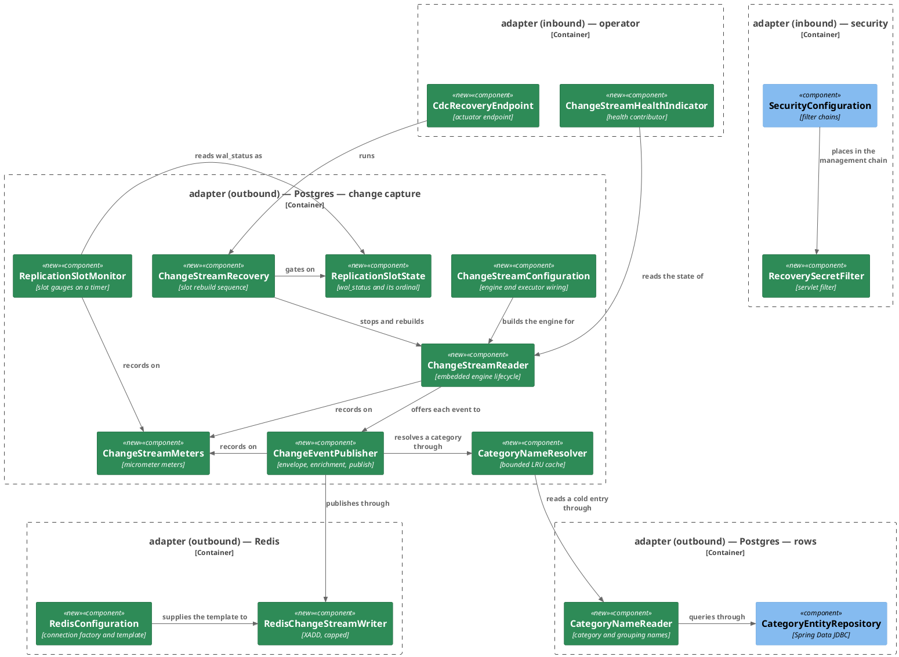
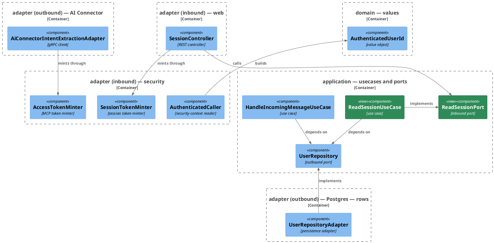

# Plan: Broadcast Ledger Changes to Redis

**Affected Modules:** `ledger-service`
**Design:** [Broadcast Ledger Changes to Redis](design.md)

## Components

The design named responsibilities; these are the classes that hold them. Two subjects, two diagrams: the capture
pipeline, and the identity a token carries.

### The capture pipeline



### Which identity a token carries



### What a box cannot carry

| Type                     | Holds                                                                       | Refuses                                                     |
|--------------------------|-----------------------------------------------------------------------------|-------------------------------------------------------------|
| `AuthenticatedUserId`    | `long userId`                                                               | an id that is not positive; `of(String)` refuses a blank or non-numeric subject as `InvalidUserException` |
| `ReadSessionCommand`     | `AuthenticatedUserId userId`                                                | an absent `userId`, as `InvalidUserException`               |
| `CategoryNames`          | `String categoryName`, `String groupingName`                                | nothing — a miss is `Optional.empty()` from `CategoryNameReader`, never a blank pair |
| `ChangeStreamState`      | `STREAMING`, `STANDBY`, `DOWN`                                              | —                                                            |
| `ReplicationSlotState`   | `RESERVED`, `EXTENDED`, `UNRESERVED`, `LOST`, `ABSENT`, each with an ordinal for `ledger_cdc_slot_wal_status` | an unrecognised `wal_status` text |
| `SlotRecoveryOutcome`    | the abandoned position, the position resumed from, and a status             | —                                                            |
| `CdcProperties`          | `enabled`, `slotName`, `streamKey`, `streamMaxLength`, `snapshotMode`, `heartbeatInterval`, `slotMonitorInterval`, `categoryCacheSize`, `recoverySecret` | — |

| Port               | Methods                                                                                     |
|--------------------|-----------------------------------------------------------------------------------------------|
| `ReadSessionPort`  | `read(ReadSessionCommand): User`                                                             |
| `UserRepository`   | gains `findById(long): Optional<User>` and the default `requireById(long): User`; `findByExternalId` and `requireByExternalId` stay |

| Answer | When                                                                                                    |
|--------|-----------------------------------------------------------------------------------------------------------|
| 200    | the slot was rebuilt — the body carries the abandoned position and the one resumed from                  |
| 401    | `RecoverySecretFilter` finds no `X-Cdc-Recovery-Secret` header, or one that does not match               |
| 409    | the slot exists and its `wal_status` is not `lost`, or the advisory lock is held                         |
| 503    | the engine would not stop, the stored position would not delete, or the slot would not drop              |

| Meter                                       | Kind    | Recorded by                |
|---------------------------------------------|---------|----------------------------|
| `ledger_cdc_events_published_total`          | counter | `ChangeEventPublisher`     |
| `ledger_cdc_publish_failures_total`          | counter | `ChangeEventPublisher`     |
| `ledger_cdc_category_lookups_total`          | counter | `CategoryNameResolver`     |
| `ledger_cdc_category_lookup_failures_total`  | counter | `CategoryNameResolver`     |
| `ledger_cdc_event_lag_seconds`               | gauge   | `ChangeEventPublisher`     |
| `ledger_cdc_state`                           | gauge   | `ChangeStreamReader`       |
| `ledger_cdc_slot_retained_bytes`             | gauge   | `ReplicationSlotMonitor`   |
| `ledger_cdc_slot_wal_status`                 | gauge   | `ReplicationSlotMonitor`   |

## Step-by-Step Implementation Map (To-Do List)

### Stabilization

#### Database

- [x] ST01 · Add migration `V009__publish_ledger_changes.sql`, exactly as the design's **The migration** section
  states:
  ```sql
  ALTER TABLE expense          REPLICA IDENTITY FULL;
  ALTER TABLE expense_proposal REPLICA IDENTITY FULL;
  ALTER TABLE category         REPLICA IDENTITY FULL;

  CREATE TABLE cdc_heartbeat (
      id        BOOLEAN     PRIMARY KEY DEFAULT TRUE CHECK (id),
      beat_at   TIMESTAMPTZ NOT NULL
  );

  INSERT INTO cdc_heartbeat (beat_at) VALUES (now());

  CREATE PUBLICATION finance_ledger_cdc
      FOR TABLE expense, expense_proposal, category, cdc_heartbeat
      WITH (publish = 'insert, update, delete');
  ```
  No replication slot is declared — creating one cannot run inside Flyway's transaction. No offset table is
  declared either; ST02 settles that and amends this migration if the store cannot create its own.

- [x] ST02 · Settle where the engine's stored position lives, the design's deferred F18. Against a real Postgres
  container, start `debezium-storage-jdbc`'s `JdbcOffsetBackingStore` with
  `offset.storage.jdbc.offset.table.name=cdc_offset` and no such table present, and observe whether the store
  creates it. **If it does**, nothing is added to `V009` and `cdc_offset` is documented as store-created. **If it
  does not**, add its `CREATE TABLE` to `V009` in the shape the store's own DDL statement uses. Record which way
  it landed in the step report — the database contract page names it either way.

#### Interface-First / Build Stabilization

New-method stubs carry a short inline comment describing the implementation intent, and no comment anywhere cites
a step id — `CommentConventionsTest` fails the run on one.

**Interface & Signature Sync**

- [x] ST03 · Add to `ledger-service/build.gradle`: `io.debezium:debezium-embedded`,
  `io.debezium:debezium-connector-postgres`, `io.debezium:debezium-storage-jdbc`,
  `org.springframework.boot:spring-boot-starter-data-redis`,
  `io.micrometer:micrometer-registry-prometheus`. Pin each version in `gradle.properties` beside the versions
  already there. Confirm the module compiles.

- [x] ST04 · Change `AuthenticatedUserId` to `public record AuthenticatedUserId(long userId)`: the compact
  constructor refuses a non-positive id as `InvalidUserException`, and a named static factory
  `of(String subject)` parses the token's subject, refusing a blank or non-numeric one as `InvalidUserException`
  rather than letting a `NumberFormatException` answer 500.

- [x] ST05 · Update `AuthenticatedCaller.authenticatedUserId()` to build through `AuthenticatedUserId.of(...)`,
  and fix every call site of the old `.externalId()` accessor across the eight commands that carry the type
  (`AcceptExpensesCommand`, `BrowseCategoriesCommand`, `BrowseExpensesCommand`, `BrowseGroupingsCommand`,
  `ChangeExpenseCategoryCommand`, `CreateExpenseProposalCommand`, `ListCategoriesCommand`,
  `SummarizeSpendingCommand`), their use cases, the MCP tools and `ExpenseWebMapper`, until the module builds
  green. The commands' own component name (`userId`) does not change; its type's accessor does.

  **The test tree is part of this step.** Every `new AuthenticatedUserId(` in `src/test/java` takes a `long`
  from here on, and every subject a test invents becomes numeric — `BrowseCategoriesCommandTest`,
  `BrowseExpensesCommandTest`, `BrowseGroupingsCommandTest`, `ChangeExpenseCategoryCommandTest`,
  `CreateExpenseProposalCommandTest`, `ListCategoriesCommandTest`, `SummarizeSpendingCommandTest`,
  `GroupingsControllerTest`, `ExpensesControllerTest`, `CategoriesControllerTest`, `WebExceptionHandlerTest`,
  `ExpenseProposalToolMapperTest`, `SummarizeSpendingMcpToolTest`, `ListCategoriesMcpToolTest` and
  `CreateExpenseProposalMcpToolTest`. The last four are more than a compile fix: their subjects (`"user-42"`,
  `"user-101"`, `"user-1"`, and the `McpTokens.noReferenceToken("user-10")` /
  `malformedReferenceToken("user-11")` calls) are refused by `of()` before the assertion each test exists for is
  reached, so each becomes a decimal id. No assertion changes — only the value asserted against.

- [x] ST06 · Add `Optional<User> findById(long userId)` and the default `User requireById(long userId)` to
  `UserRepository`, mirroring `requireByExternalId`'s javadoc and its `EntityNotFoundException`, and stub
  `findById` on `UserRepositoryAdapter`:
  ```java
  public Optional<User> findById(long userId) {
      // reads the app_user row by its primary key, translating a store failure to PersistenceFailedException
      return Optional.empty();
  }
  ```
  `findByExternalId` and `requireByExternalId` stay.

- [x] ST07 · Point the eight use cases above at `userRepository.requireById(command.userId().userId())` in place
  of `requireByExternalId(command.userId().externalId())`. The lookup itself is not dropped: it is what refuses a
  caller whose row is gone.

- [x] ST08 · Change `IntentExtractionRequest.userExternalId` to `long userId`, with the compact constructor
  refusing a non-positive value; update `HandleIncomingMessageUseCase` to pass `user.id().orElseThrow()`, and
  `AiConnectorIntentExtractionAdapter` to mint from `request.userId()`. `IntentProtoMapper` carries no identity
  and is untouched.

- [x] ST09 · Change `AccessTokenMinter.mint(long userId, IncomingMessageId reference)` and
  `SessionTokenMinter.mint(long userId)` to put the internal id in the subject, and update
  `SessionController.signIn` to mint from the `User` that `initializeUserPort.initialize(...)` answers. The
  sign-in log line follows the subject and logs that id; `HandleIncomingMessageUseCase`'s first-recognition line
  keeps the external identifier.

- [x] ST10 · Add `ReadSessionPort` (`read(ReadSessionCommand): User`), `ReadSessionCommand` (validating its
  `userId` is present), and stub `ReadSessionUseCase`:
  ```java
  public User read(ReadSessionCommand command) {
      // resolves the caller's stored row by internal id, so a token naming no user is refused
      return null;
  }
  ```
  Declare the use-case bean in `UseCaseConfiguration`, and update `SessionController.currentSession()` to answer
  `CurrentSession200Response(user.externalId())` off that port. `openapi/ledger-api.yaml` is untouched — the
  field keeps its name and its meaning.

- [x] ST11 · Create `adapter/cdc/package-info.java` and `adapter/redis/package-info.java`, and stub the pipeline's
  classes so the module builds before any test is written: `CdcProperties`, `ChangeStreamState`,
  `ReplicationSlotState`, `CategoryNames`, `SlotRecoveryOutcome`, `ChangeStreamConfiguration`,
  `ChangeStreamReader`, `ChangeEventPublisher`, `CategoryNameResolver`, `ChangeStreamMeters`,
  `ChangeStreamHealthIndicator`, `ReplicationSlotMonitor`, `ChangeStreamRecovery`, `CdcRecoveryEndpoint`,
  `RedisConfiguration` and `RedisChangeStreamWriter`, plus `CategoryNameReader` in `adapter/persistence`, where
  everything fronting the row store lives. Each new method body carries its intent comment, for example:
  ```java
  public boolean publish(ChangeEvent<String, String> event) {
      // shapes the Debezium envelope, adds the enrichment block for an expense or proposal row,
      // and XADDs it to the capped stream; answers false when Redis or the category lookup refuses
      return false;
  }
  ```

- [x] ST12 · Add the category-name lookup to `CategoryEntityRepository` — a `@Query` selecting the category's own
  name and its parent's, joined on `parent_id`, keyed by `category.id` alone (an id is globally unique, so no
  `user_id` joins the key) — with a `CategoryNamesProjection` carrying a `toCategoryNames()` mapping, in the
  module's projection style.

- [x] ST13 · Split `SecurityConfiguration`'s second chain: `/actuator/health` and `/actuator/prometheus` keep
  `permitAll()`, `/actuator/cdc` demands the shared secret through `RecoverySecretFilter`, which compares
  `CDC_RECOVERY_SECRET` against the request header in constant time and answers 401 on absence or mismatch. The
  chain's `securityMatcher` keeps `/.well-known/jwks.json` and `/mcp/**` as they are.

- [x] ST14 · Fix `CleanArchitectureTest.authenticatedUserIdIsConstructedOnlyBySecurityAdapter`, which today names
  a no-arg constructor the record does not have and passes vacuously. It must refuse any class outside
  `bot.finance.adapter.security..` that calls `AuthenticatedUserId`'s canonical constructor **or** its `of`
  factory, excluding `AuthenticatedUserId` itself, `bot.finance.common..` and any top-level class whose name ends
  with `Test`.

- [x] ST15 · Add `io.debezium..`, `org.apache.kafka..` and `org.springframework.data.redis..` to
  `CleanArchitectureTest.domainAndApplicationStayFrameworkAgnostic`'s banned-package list.

**Configuration**

- [x] ST16 · Add the pipeline's configuration to `application.yaml` under a `cdc:` root, bound by `CdcProperties`:
  `CDC_ENABLED:true`, `CDC_SLOT_NAME:finance_ledger_cdc`, `CDC_STREAM_KEY:ledger.cdc`,
  `CDC_STREAM_MAX_LENGTH:100000`, `CDC_SNAPSHOT_MODE` defaulting to changes-only, `CDC_HEARTBEAT_INTERVAL:30s`,
  `CDC_SLOT_MONITOR_INTERVAL:30s`, `CDC_CATEGORY_CACHE_SIZE:50000`, `CDC_RECOVERY_SECRET` with no default. Add
  `spring.data.redis.url: ${REDIS_URL:redis://localhost:6379}` and
  `management.server.port: ${MANAGEMENT_PORT:1010}`. The publication name is not configurable.

- [x] ST17 · Configure the engine in `ChangeStreamConfiguration`: the `pgoutput` plugin, the declared publication
  `finance_ledger_cdc` in `filtered` publication-autocreate mode, the captured table list, JSON converters with
  schemas off, the JDBC offset store on the service's own datasource, `heartbeat.interval.ms` and
  `heartbeat.action.query` writing `cdc_heartbeat`, `tombstones.on.delete=false`, and a single-thread executor
  for the engine — mirroring how `ReportClearingConfiguration` bounds its own background pool.

  The tombstone is switched off deliberately: left at its default the connector emits a second, null-valued
  event after every delete, which the design's stream-entry table does not define an `op` for and which would
  make A3's "two entries sharing one `source.txId`" three.

- [x] ST18 · Add a `redis` service to `infrastructure/docker-compose.yaml` on the `backend` network, publishing
  no port; start Postgres with `postgres -c wal_level=logical -c max_slot_wal_keep_size=1GB`; pass
  `REDIS_URL`, `CDC_RECOVERY_SECRET` and `MANAGEMENT_PORT` to `ledger-service`, and leave the management port
  unpublished.

- [x] ST19 · In `application-test.yaml`, switch `CDC_ENABLED` off, disable the Redis health contributor
  (`management.health.redis.enabled: false`), and set `management.server.port: 0` so every test context binds a
  free management port rather than the deployment's fixed one — a fixed port would collide across the cached
  contexts a run holds open. A test reads it back from `local.management.port`, the way `AbstractSystemTest`
  reads `local.server.port`.

**Shared Test Infrastructure**

- [x] ST20 · Add `common/containers/RedisContainers.java` — a JVM-wide `GenericContainer` singleton on the shared
  `Network`, exposing 6379, in the shape `PostgresContainers` uses, plus a `redisUrl()` accessor. A test that
  needs Redis to refuse points its own context's `spring.data.redis.url` at a closed port and never stops the
  singleton. Beside it, a Toxiproxy container on the same network fronting that Redis, so a capture test cuts
  and restores the connection inside one booted context — the outage-and-recovery scenario needs Redis to refuse
  and then serve, which a static URL cannot express. A test points its own context at the proxy's port and
  toggles the toxic; it still never stops either singleton. Add `org.testcontainers:testcontainers-toxiproxy`
  to the build. List both in
  [Package Structure](../../ledger-service/docs/conventions/testing.md#package-structure).

- [x] ST21 · Start `PostgresContainers.POSTGRES_CONTAINER` with `wal_level=logical` and a small
  `max_slot_wal_keep_size` so the invalidation scenario is reachable, and confirm the existing suite still passes
  on it.

- [x] ST22 · Add `common/boot/CdcCaptureTest.java` — a composed annotation booting the full application with
  capture switched on, the Redis singleton wired in, and a per-class slot name, for the capture tests. Ship the
  throwaway boot test the conventions require of new shared infrastructure, and list it in
  [Package Structure](../../ledger-service/docs/conventions/testing.md#package-structure).

- [x] ST23 · Add `common/fixtures/ChangeStreamEntries.java` — reads entries back off `ledger.cdc` through the test
  Redis connection, parses the `payload` and `enrichment` fields, and filters by `source.table` and `user_id`, so
  no capture test asserts "one entry" against a database-wide slot on a shared container. List it in
  [Package Structure](../../ledger-service/docs/conventions/testing.md#package-structure).

- [x] ST24 · Give `CategoryRowUtils` a rename — nothing in the module renames or deletes a category, so the
  enrichment scenarios are driven through the helper.

- [x] ST25 · Reorder `McpTokens`, `SessionTokens` and `BrowserSessions` so each takes the id `UserRowUtils`
  returned rather than an identifier the test invented: seeding is ordered before minting, and the minters now
  take a `long`. The hand-signed helpers on `McpTokens` — `expiredToken`, `wrongAudienceToken`, `overTtlToken`,
  `malformedReferenceToken`, `noReferenceToken` — take the same `long`, so a token built to fail one check is
  not refused earlier by the subject parse instead.

- [x] ST26 · Verify the three deferred behaviours against a real Postgres container, and report what each does,
  because the scenarios below assert against them: **(a)** that a second connection opening a slot another holds
  fails with an error distinct from the one a non-logical `wal_level` or a missing publication gives (F24);
  **(b)** that `max_slot_wal_keep_size` is reloadable without a restart (F29); **(c)** that a session-level
  `pg_try_advisory_lock` is released when its connection dies (F46). Any of the three behaving otherwise is a
  blocker back to this plan, not a scenario written around.

- [x] ST27 · Confirm `CleanArchitectureTest`, `CommentConventionsTest` and `DisplayNameConventionsTest` all pass,
  and that the pre-existing suite is green, before any Red Phase step starts.

### Red Phase

#### TDD Unit Red Phase

- [x] RU01 · `AuthenticatedUserId` · test: `AuthenticatedUserIdTest` · covers: `of()`, the compact constructor ·
  scenarios: A36
    - `of()`:
        - given: a subject that is a positive number
          when: of() is called
          then: the record carries that number as its userId
        - given: a subject that is not a number, and one that is digits but overflows `long`
          (`99999999999999999999`)
          when: of() is called
          then: InvalidUserException is thrown for each, never NumberFormatException
        - given: a subject that is null, empty or whitespace-only
          when: of() is called
          then: InvalidUserException is thrown
    - the compact constructor:
        - given: an id of zero or a negative id
          when: the record is constructed
          then: InvalidUserException is thrown
        - update: `whenExternalIdIsAbsentEmptyOrWhitespace_thenThrowsInvalidUserException()` — it constructs the
          record from a `String`, which no longer compiles; move its cases onto `of()` and keep the refusal
        - update: `whenExternalIdIsNonBlank_thenRecordCarriesItUnchanged()` — its values `user-123` and
          `auth0|abc123` are now refusals, not carriers; replace them with numeric subjects asserted through
          `userId()`

- [x] RU02 · `AuthenticatedCaller` · test: `AuthenticatedCallerTest` · covers: `authenticatedUserId()` ·
  scenarios: A36
    - `authenticatedUserId()`:
        - given: a validated token whose subject is a numeric internal id
          when: authenticatedUserId() is called
          then: the returned value carries that id
        - given: a validated token whose subject is not a number
          when: authenticatedUserId() is called
          then: InvalidUserException is thrown
        - update: `whenContextHoldsValidatedTokenWithExternalIdSubject_thenReturnsAuthenticatedUserIdCarryingThatSubject()`
          — its subject is an external identifier and its assertion reads `.externalId()`; both become the
          internal id read through `userId()`
        - update: `whenContextHoldsValidatedTokenWithBlankSubject_thenThrowsInvalidUserException()` — the refusal
          now comes from `of()`, so assert it still surfaces as `InvalidUserException`

- [x] RU03 · `ReadSessionUseCase` · test: `ReadSessionUseCaseTest` · covers: `read()` · scenarios: A33, A35, A37
    - `read()`:
        - given: a stored user whose id the command names
          when: read() is called
          then: the mocked repository is asked by that internal id and the stored user is answered
        - given: no user row under the id the command names
          when: read() is called
          then: EntityNotFoundException is thrown and nothing else is read
        - given: a null command
          when: read() is called
          then: InvalidUserException is thrown

- [x] RU04 · `CategoryNameResolver` · test: `CategoryNameResolverTest` · covers: `resolve()`, `evict()` ·
  scenarios: A38, A39, A41, A42, A43
    - `resolve()`:
        - given: an id the cache does not hold and a lookup that answers a category and its grouping
          when: resolve() is called
          then: the names are answered, the lookup is called once, and a miss is counted
        - given: the same id resolved a second time
          when: resolve() is called
          then: the names are answered from memory, the lookup is not called again, and a hit is counted
        - given: a lookup that answers nothing for the id
          when: resolve() is called
          then: an empty result is answered rather than an exception, so a deleted person's rows still publish
        - given: a lookup that fails
          when: resolve() is called
          then: the failure propagates, a lookup failure is counted, and nothing is cached
        - given: a cache filled past its configured size
          when: resolve() is called for a new id
          then: the least recently used entry is gone and the cache never exceeds that size
    - `evict()`:
        - given: a cached entry keyed by a category id
          when: evict() is called for that id
          then: the next resolve() reads the lookup again
        - given: cached entries for several categories filed under one grouping
          when: evict() is called for the grouping's id
          then: every one of those entries is gone, not only the grouping's own

- [x] RU05 · `ChangeEventPublisher` · test: `ChangeEventPublisherTest` · covers: `publish()` · scenarios: A1, A5,
  A40, A41, A43
    - `publish()`:
        - given: an update on `expense` carrying a different `before.category_id` and `after.category_id`, and a
          resolver answering both
          when: publish() is called
          then: one entry is written carrying the Debezium payload unaltered and an enrichment block naming both
          categories and both groupings
        - given: an insert on `expense_proposal`
          when: publish() is called
          then: the enrichment block carries the `after` side alone
        - given: a delete on `expense`
          when: publish() is called
          then: the enrichment block carries the `before` side alone
        - given: a delete on `expense` whose category resolves to nothing, the person having been deleted
          when: publish() is called
          then: the entry is written with the category id and no names beside it, and publish answers published
        - given: an event on `category`
          when: publish() is called
          then: no enrichment block is added, and the resolver is told to evict that id
        - given: a resolver that fails the lookup
          when: publish() is called
          then: nothing is written and publish answers not published
        - given: a writer that refuses
          when: publish() is called
          then: publish answers not published and a publish failure is counted
        - given: an event published successfully
          when: publish() is called
          then: the published counter is tagged with the table and the operation, and the lag gauge is set from
          `source.ts_ms`

- [x] RU06 · `ChangeStreamHealthIndicator` · test: `ChangeStreamHealthIndicatorTest` · covers: `health()` ·
  scenarios: A9, A12, A17
    - `health()`:
        - given: a reader reporting STREAMING
          when: health() is called
          then: the component is UP and the detail names STREAMING
        - given: a reader reporting STANDBY
          when: health() is called
          then: the component is UP, because every instance but one is a standby by design
        - given: a reader reporting DOWN
          when: health() is called
          then: the component is DOWN and the detail names DOWN

- [x] RU07 · `ChangeStreamMeters` · test: `ChangeStreamMetersTest` · covers: the counters and the gauges ·
  scenarios: A24
    - the counters and the gauges:
        - given: a real `SimpleMeterRegistry`
          when: an event is counted for a table and an operation
          then: `ledger_cdc_events_published_total` carries those two tags and no others
        - given: a lookup counted as a hit and another as a miss
          when: the registry is read
          then: `ledger_cdc_category_lookups_total` separates the two by tag
        - given: each gauge set in turn
          when: the registry is read
          then: `ledger_cdc_event_lag_seconds`, `ledger_cdc_state`, `ledger_cdc_slot_retained_bytes` and
          `ledger_cdc_slot_wal_status` each read back the value set, the last two by the ordinals
          `ReplicationSlotState` defines

RU08 and RU09 were the endpoint's status contract and the filter's 401; both moved to RI09, the entry-point
step, so those two ids are unused.

- [x] RU10 · `ReplicationSlotState` · test: `ReplicationSlotStateTest` · covers: `fromWalStatus()` · scenarios:
  A17, A21
    - `fromWalStatus()`:
        - given: each of `reserved`, `extended`, `unreserved` and `lost`
          when: fromWalStatus() is called
          then: the matching state is answered, and its ordinal is the one `ledger_cdc_slot_wal_status` reports
        - given: no slot row at all
          when: the absent state is asked for its ordinal
          then: it is distinct from every wal_status ordinal
        - given: a wal_status text Postgres does not document
          when: fromWalStatus() is called
          then: it is refused rather than silently mapped

- [x] RU11 · `BrowseCategoriesUseCase` · test: `BrowseCategoriesUseCaseTest` · covers: `browse()`
    - `browse()`:
        - update: `whenStoredUserIdDiffersFromExternalId_thenRepositoryReceivesStoredUserIdAndGroupingId()` — the
          command now carries the internal id, so arrange `requireById` and assert the lookup receives that id
        - update: `whenNoUserExistsForExternalId_thenThrowsEntityNotFoundException()` — the absence is now
          `requireById` throwing; every other method in the class arranges the same stub

- [x] RU12 · `BrowseGroupingsUseCase` · test: `BrowseGroupingsUseCaseTest` · covers: `browse()`
    - `browse()`:
        - update: `whenStoredUserIdDiffersFromExternalId_thenRepositoryReceivesStoredUserIdNotExternalId()` —
          arrange `requireById` and assert the lookup receives the command's internal id
        - update: `whenNoUserExistsForExternalId_thenThrowsEntityNotFoundException()` — the absence is now
          `requireById` throwing; every other method in the class arranges the same stub

- [x] RU13 · `BrowseExpensesUseCase` · test: `BrowseExpensesUseCaseTest` · covers: `browse()`
    - `browse()`:
        - update: `whenStoredUserIdDiffersFromExternalId_thenBothReadsReceiveStoredUserIdNotExternalId()` —
          arrange `requireById` and assert both reads receive the command's internal id
        - update: `whenNoUserExistsForExternalId_thenThrowsEntityNotFoundExceptionAndExpenseRepositoryUntouched()`
          — the absence is now `requireById` throwing; every other method in the class arranges the same stub

- [x] RU14 · `ListCategoriesUseCase` · test: `ListCategoriesUseCaseTest` · covers: `list()`
    - `list()`:
        - update: `whenStoredUsersIdDiffersFromCommandsExternalId_thenBothReadsReceiveStoredUsersIdNotExternalId()`
          — arrange `requireById` and assert both reads receive the command's internal id
        - update: `whenNoUserExistsForExternalId_thenThrowsEntityNotFoundException()` — the absence is now
          `requireById` throwing; every other method in the class arranges the same stub

- [x] RU15 · `SummarizeSpendingUseCase` · test: `SummarizeSpendingUseCaseTest` · covers: `summarize()`
    - `summarize()`:
        - update: `whenStoredUsersIdDiffersFromExternalId_thenStoredQueryCarriesStoredUsersId()` — arrange
          `requireById` and assert the stored query carries that id
        - update: `whenNoUserExistsForExternalId_thenThrowsEntityNotFoundException()` — the absence is now
          `requireById` throwing; every other method in the class arranges the same stub

- [x] RU16 · `AcceptExpensesUseCase` · test: `AcceptExpensesUseCaseTest` · covers: `accept()`
    - `accept()`:
        - update: `whenNoUserRowForCallersExternalId_thenEntityNotFoundExceptionThrownAndNothingMovedOrDispatched()`
          — the absence is now `requireById` throwing; every other method in the class arranges the same stub
        - update: `whenMoveAnswersOneIdPerProposalForTwoPosted_thenAcceptedTwoAndMissingZero()` — arrange
          `requireById` for the command's internal id

- [x] RU17 · `ChangeExpenseCategoryUseCase` · test: `ChangeExpenseCategoryUseCaseTest` · covers: `change()`
    - `change()`:
        - update: `whenNoUserRowStoredForExternalId_thenEntityNotFoundExceptionPropagatesAndNothingElseTouched()`
          — the absence is now `requireById` throwing; every other method in the class arranges the same stub

- [x] RU18 · `CreateExpenseProposalUseCase` · test: `CreateExpenseProposalUseCaseTest` · covers: `create()`
    - `create()`:
        - update: `whenGroupingIsAnswered_thenCategoryIsLookedUpUnderStoredUserIdAndThatGrouping()` — arrange
          `requireById` for the command's internal id
        - update: `whenNoUserExistsForExternalId_thenThrowsEntityNotFoundExceptionNamingUser()` — the absence is
          now `requireById` throwing; every other method in the class arranges the same stub

- [x] RU19 · `HandleIncomingMessageUseCase` · test: `HandleIncomingMessageUseCaseTest` · covers: `handle()` ·
  scenarios: A31
    - `handle()`:
        - update: `whenHandleIsCalled_thenInitializeReceivesTheCommandsUserExternalId()` — first recognition still
          carries the external identifier into the initialize command; assert that it does
        - update: `whenStoredUsersIdDiffersFromExternalId_thenBothReadsCarryThatStoredId()` — the extraction
          request now carries that same stored id, so assert it there too

- [x] RU20 · `ExpenseWebMapper` · test: `ExpenseWebMapperTest` · covers: the caller-identity mapping
    - the caller-identity mapping:
        - update: `whenDocumentReplacesCategoryIdUnderRecorded_thenCommandCarriesCallerRecordedIdAndCategory()` —
          the caller value now carries a `long` internal id; assert the command carries that id rather than an
          external identifier

- [x] RU21 · `AccessTokenMinter` · test: `AccessTokenMinterTest` · covers: `mint()` · scenarios: A31
    - `mint()`:
        - given: a caller's internal id and an incoming message reference
          when: mint() is called
          then: the token's subject is that id as decimal text, and the `imi` claim, the issuer, the audience
          and the ttl are untouched
        - update: `whenMintIsCalledAndTheTokenIsParsed_thenItCarriesTheExpectedClaims()` — its subject
          assertion against `USER_EXTERNAL_ID` is the one assertion pinning what the token names; the constant
          becomes an internal id read as decimal text
        - update: `whenMintIsCalledTwiceForTheSameExternalId_thenTheTwoTokensCarryDifferentJtiValues()` — it
          mints twice from a `String`; both calls take the internal id, and the method's name follows

- [x] RU22 · `SessionTokenMinter` · test: `SessionTokenMinterTest` · covers: `mint()` · scenarios: A32
    - `mint()`:
        - given: a signed-in person's internal id
          when: mint() is called
          then: the token's subject is that id as decimal text, and the issuer, the audience and the ttl are
          untouched
        - update: `whenMintIsCalledAndTheTokenIsParsed_thenItCarriesTheExpectedClaims()` — same change: the
          subject constant becomes an internal id read as decimal text
        - update: `whenMintIsCalledTwiceForTheSameExternalId_thenTheTwoTokensCarryDifferentJtiValues()` — both
          calls take the internal id, and the method's name follows

- [x] RU23 · `IntentExtractionRequest` · test: `IntentExtractionRequestTest` · covers: the compact constructor ·
  scenarios: A31
    - the compact constructor:
        - given: a `userId` of zero, and a negative one
          when: the record is constructed
          then: InvalidExtractionRequestException is thrown for each
        - update: `whenUserExternalIdIsNullOrBlank_thenThrowsInvalidExtractionRequestException()` — its
          null/blank matrix cannot compile against a `long`; it becomes the zero-and-negative matrix above
        - update: `whenEveryComponentIsValid_thenEveryComponentReadsBackUnchanged()` — assert `userId()` in
          place of `userExternalId()`

- [x] RU24 · `UserRepository` · test: `UserRepositoryTest` · covers: `requireById()` · scenarios: A33, A35
    - `requireById()`:
        - given: a stored user under that id
          when: requireById() is called
          then: the user is answered
        - given: no row under that id
          when: requireById() is called
          then: EntityNotFoundException is thrown, naming the user and the id
        - given: a lookup that fails
          when: requireById() is called
          then: the failure propagates unchanged

- [x] RU25 · `ReadSessionCommand` · test: `ReadSessionCommandTest` · covers: the compact constructor ·
  scenarios: A37
    - the compact constructor:
        - given: an absent `userId`
          when: the record is constructed
          then: InvalidUserException is thrown
        - given: a present `userId`
          when: the record is constructed
          then: the component reads back unchanged

#### TDD Integration Red Phase

- [x] RI01 · `CategoryNameReader` · test: `CategoryNameReaderTest` · covers: `findNames()` · scenarios: A38, A40
    - `findNames()`:
        - given: a category stored under a grouping
          when: findNames() is called for its id
          then: both the category's name and its grouping's are answered
        - given: an id no category row carries
          when: findNames() is called
          then: nothing is answered, rather than an exception
        - given: a grouping's own id, which has no parent
          when: findNames() is called
          then: nothing is answered, since a grouping is never an expense's category
        - given: two people each holding a category of the same name
          when: findNames() is called for one of the ids
          then: that person's names are answered, the id alone being the key

- [x] RI02 · `RedisChangeStreamWriter` · test: `RedisChangeStreamWriterTest` · covers: `write()` · scenarios: A13
    - `write()`:
        - given: a running Redis and a payload with an enrichment block
          when: write() is called
          then: one entry appears on the configured stream carrying both fields verbatim
        - given: a stream already at its configured cap
          when: further entries are written
          then: the newest entries are present, the oldest are gone, and the stream stays near its cap
        - given: a Redis the writer cannot reach
          when: write() is called
          then: it answers not written rather than throwing out of the publish path

- [x] RI03 · `ChangeStreamReader` · test: `ChangeStreamReaderTest` · covers: `start()`, `stop()`, the offer loop ·
  scenarios: A2, A4, A5, A6, A7, A8, A9, A10, A12, A14, A15, A17, A26
    - `start()`:
        - given: a Postgres at `wal_level=logical` with the publication in place and no stored position
          when: start() is called and a captured row is written afterwards
          then: the reader reaches STREAMING, that change is offered to the publisher, and nothing about rows
          that already existed is offered
        - given: a slot another connection already holds
          when: start() is called
          then: the reader reports STANDBY and keeps retrying rather than failing
        - given: a database whose `wal_level` is not `logical`, which is the permanent class of start failure the
          log being unreadable also falls in — a *missing publication* is not in that class, `pgoutput`
          resolving a named publication permissively and then streaming nothing at all
          when: start() is called
          then: the reader reports DOWN and stops retrying rather than looping
        - given: a stored position from an earlier run and changes committed since
          when: start() is called
          then: streaming resumes from that position and every change committed meanwhile is offered in order
    - the offer loop:
        - given: a publisher that answers not published
          when: a captured row changes
          then: the position is not committed, and the event is offered again after a backoff
        - given: a publisher that answers published for each event
          when: several captured rows change
          then: the position advances and the events are offered in log order
        - given: a pending proposal discarded as a lone `DELETE` from `expense_proposal`
          when: the change is offered
          then: one delete event carries the whole row and no `expense` insert shares its transaction
        - given: a category renamed through `CategoryRowUtils`
          when: the change is offered
          then: a `category` event is offered carrying the tree's own change
        - given: writes to `app_user`, `spending_query`, `proposal_report` and `cdc_heartbeat`
          when: they are committed
          then: none of them is offered
        - given: only uncaptured tables written for longer than the heartbeat interval
          when: the slot's confirmed position is read
          then: it has advanced and nothing was offered
        - given: a slot invalidated under a streaming reader
          when: the next captured change is committed
          then: the reader stops rather than retrying and reports DOWN, and stays there until it is rebuilt
    - `stop()`:
        - given: a streaming reader
          when: stop() is called
          then: the engine's task finishes, the slot is left in place, and a fresh reader takes it over and
          resumes from the last committed position

- [x] RI04 · `ReplicationSlotMonitor` · test: `ReplicationSlotMonitorTest` · covers: `readSlot()` · scenarios:
  A25, A27, A28
    - `readSlot()`:
        - given: an existing slot with log retained behind it
          when: readSlot() is called
          then: the retained bytes and the wal_status ordinal are both recorded on the registry
        - given: a slot no engine in this JVM holds
          when: readSlot() is called
          then: the same two numbers are still recorded, the monitor being bound to the slot rather than the
          engine
        - given: no slot of that name at all
          when: readSlot() is called
          then: the retained bytes read zero and the wal_status gauge reads the absent ordinal
        - given: a healthy slot kept moving by the heartbeat
          when: readSlot() is called after an idle period
          then: the retained bytes stay near zero, which is what separates an idle ledger from a stuck one

- [x] RI05 · `ChangeStreamRecovery` · test: `ChangeStreamRecoveryTest` · covers: `recover()` · scenarios: A18,
  A19, A20, A21, A22, A23
    - `recover()`:
        - given: an invalidated slot and a reader that is not streaming
          when: recover() is called
          then: the stored position is deleted before the slot is dropped, a new slot is created at the current
          end of the log, and the outcome carries both positions
        - given: an invalidated slot
          when: recover() is called
          then: the abandoned position and its wall-clock time are logged at error, this being the only record of
          which hours never reached the stream
        - given: no slot at all
          when: recover() is called
          then: a slot is created, streaming starts at the current end of the log, and the outcome reports no
          abandoned position
        - given: a slot whose wal_status is `reserved`, `extended` or `unreserved`
          when: recover() is called
          then: it is refused for each of the three, the slot is untouched, and the reader is not stopped
        - given: the advisory lock already held on another connection
          when: recover() is called
          then: it is refused without stopping the reader or touching the slot
        - given: a reader whose task does not finish within the wait
          when: recover() is called
          then: the outcome reports the engine would not stop, no position is deleted and no slot is dropped
        - given: a slot still held when the drop is attempted
          when: recover() is called
          then: the outcome reports the drop failed, the reader is left stopped, and a second call resumes from
          there
        - given: captured rows changed while the slot was invalidated
          when: recover() is called and streaming resumes
          then: no event for any of those rows is offered, ever — the gap is what the operation spends

- [x] RI06 · `SessionController` · test: `SessionControllerTest` · covers: `POST /api/v1/session`,
  `GET /api/v1/session` · mocks: `InitializeUserPort`, `ReadSessionPort`, `TelegramLoginVerifier` · scenarios:
  A32, A37
    - Happy Path:
        - given: the initialize port answers a stored user whose internal id differs from the payload's Telegram
          identifier
          when: a genuine Login Widget payload is posted
          then: the session cookie's token is minted from that internal id, and the body still answers the
          Telegram identifier
        - given: the read session port answers a stored user
          when: the session is read with that cookie
          then: the port is asked by the token's internal id and the response's `externalId` carries the
          Telegram identifier
    - Error Mapping:
        - given: the read session port throws EntityNotFoundException, a token naming no row
          when: the session is read
          then: the response is 404, as an unknown caller already answers
        - update: `whenTheRequestCarriesAValidSessionCookie_thenItAnswersWithThatCookiesSubject()` — the subject
          is now an internal id and the answer is re-resolved from the row, so arrange the read session port and
          assert the external identifier it answers
        - update: `whenThePayloadVerifies_thenTheUserIsInitializedWithTheIdThePayloadIsSignedFor()` — first
          recognition still initializes by the external identifier; assert that it does, and that the minted
          token carries the answered row's id
        - update: `whenThePayloadVerifies_thenTheBodyAnswersWithTheSignedInExternalId()` — the body is unchanged;
          assert it against the stored user the port now answers
        - update: `whenThePayloadVerifies_thenTheSessionCookieIsHttpOnlyPathScopedAndSameSiteLax()` — the shared
          `acceptTheSignIn()` arrangement answers `User.newUser(...)`, whose id is empty, so minting from
          `user.id().orElseThrow()` fails before the cookie is set; it must answer `User.stored(<id>, …)`
        - update: `whenWebSessionSecureIsLeftAtItsLocalDefault_thenTheSessionCookieIsNotSecure()` — broken by
          the same arrangement, and fixed by the same change

- [x] RI07 · `UserRepositoryAdapter` · test: `UserRepositoryAdapterTest` · covers: `findById()` · scenarios:
  A33, A35
    - `findById()`:
        - given: a stored `app_user` row
          when: findById() is called with its id
          then: the domain user is answered, carrying that id and its external identifier
        - given: an id no row carries
          when: findById() is called
          then: nothing is answered
        - given: a store the read cannot reach
          when: findById() is called
          then: PersistenceFailedException is thrown, the way the adapter's other reads translate a failure

- [x] RI08 · `AiConnectorIntentExtractionAdapter` · test: `AiConnectorIntentExtractionAdapterTest` · covers:
  `extract()` · scenarios: A31
    - `extract()`:
        - given: a request carrying a caller's internal id
          when: extract() is called
          then: the authorization metadata carries a token whose subject is that id, and the proto request
          carries no identity at all
        - update: `whenExtractIsCalled_thenMetadataCarriesBearerTokenWithSubClaimAsUserExternalId()` — the
          request helper takes a `long userId` in place of a `String userExternalId`, and the subject assertion
          reads that id as decimal text; the method's own name follows the meaning

- [x] RI09 · `CdcRecoveryEndpoint` · test: `CdcRecoveryEndpointTest` · covers: `POST /actuator/cdc` ·
  mocks: `ChangeStreamRecovery` · scenarios: A18, A21, A22, A23, A29, A30
    - Happy Path:
        - given: the mocked recovery answers a rebuilt slot, and the request carries the configured secret
          when: the operation is posted on the management port
          then: the recovery is run once and the response is 200, its body carrying the abandoned position and
          the one resumed from
    - Error Mapping:
        - given: the mocked recovery refuses a slot whose wal_status is not `lost`
          when: the operation is posted
          then: the response is 409
        - given: the mocked recovery reports the advisory lock held, here or on another instance
          when: the operation is posted
          then: the response is 409
        - given: the mocked recovery reports the engine would not stop, the position would not delete, or the
          slot would not drop
          when: the operation is posted
          then: the response is 503 for each of the three
    - Validation: the shared secret — no header at all, a header whose value differs, and a service with no
      secret configured; each answers 401 with the recovery never run, and `/actuator/health` and
      `/actuator/prometheus` on the same port answer with no header

#### TDD System Test Red Phase

- [x] RS01 · `BroadcastLedgerChangesSystemTest` · covers: `PATCH /api/v1/expenses/RECORDED/{id}` · scenarios: A1,
  A7, A38
    - Happy Path:
        - given: a signed-in person with a recorded expense, a streaming engine and a running Redis
          when: the expense's category is changed through the endpoint
          then: an entry reaches `ledger.cdc` with `op: u`, `source.table: expense`, `before.category_id` the old
          id, `after.category_id` the new one, and an enrichment naming both categories and both groupings —
          without any `category` event having been read first
    - Unhappy Path:
        - given: the same, with the connection to Redis cut at the proxy and then restored
          when: a category change is made while Redis refuses, and Redis becomes reachable afterwards
          then: nothing is published while it refuses, the health component reads DOWN, and that change reaches
          the stream once it returns

- [x] RS02 · `AcceptedProposalChangeStreamSystemTest` · covers: `POST /api/v1/expenses/acceptances` · scenarios:
  A3
    - Happy Path:
        - given: a signed-in person with a pending proposal, a streaming engine and a running Redis
          when: the proposal is accepted through the endpoint
          then: two entries share one `source.txId` — a `d` on `expense_proposal` whose `before` is the whole
          row, and a `c` on `expense` whose `after` matches it
    - Unhappy Path:
        - given: the same, with an id naming no proposal of the caller's
          when: the acceptance is posted
          then: the endpoint answers as it does today and no entry for that id reaches the stream

- [x] RS03 · `CaptureDisabledSystemTest` · covers: `GET /actuator/health` · scenarios: A11, A16, A27
    - Happy Path:
        - given: a Postgres at `wal_level=replica`, started and stopped by this class alone rather than taken
          from `common/containers/`, and the application booted against it with `CDC_ENABLED=false`
          when: every endpoint is exercised and captured rows are changed
          then: the service serves normally, no slot is opened, nothing is published, and the health component
          reads DOWN rather than failing the aggregate
    - Unhappy Path:
        - given: a slot left behind by an earlier streaming run, with capture now off
          when: `/actuator/prometheus` is scraped
          then: `ledger_cdc_slot_retained_bytes` and `ledger_cdc_slot_wal_status` still report that slot, and
          `ledger_cdc_state` reads DOWN

- [x] RS04 · `RecoverSlotSystemTest` · covers: `POST /actuator/cdc` · scenarios: A18, A30
    - Happy Path:
        - given: an invalidated slot and an engine that is not streaming
          when: the operation is posted to the management port with the configured secret
          then: the response is 200 carrying both positions, the health component returns to STREAMING, and a
          change made afterwards reaches the stream
    - Unhappy Path:
        - given: the fully wired application on the management port
          when: `/actuator/health` and `/actuator/prometheus` are requested with no header
          then: both answer, sharing the port the recovery operation guards — the secret's own refusals belong to
          RI09, not here

- [x] RS05 · `ChangeStreamMetersSystemTest` · covers: `GET /actuator/prometheus` · scenarios: A24
    - Happy Path:
        - given: an engine that has published events and a Redis that refused at least one while the proxy cut
          the connection
          when: `/actuator/prometheus` is scraped on the management port
          then: it answers, and carries a published count tagged by table and operation, a failure count, the
          event lag, the slot's retained bytes, its wal status and the engine's state
    - Unhappy Path:
        - given: the same scrape
          when: it is requested on the service port instead
          then: it is not served there, the three management endpoints having moved off it

- [x] RS06 · `McpAuthenticationSystemTest` · covers: `POST /mcp` · scenarios: A31, A33, A35
    - Happy Path:
        - given: a stored user and a token minted from the id `UserRowUtils` returned
          when: a tool is called with it
          then: the tool acts on that person's ledger, and the subject is the same `user_id` the expense rows
          carry
    - Unhappy Path:
        - given: a validly signed token whose subject is a number matching no user row, and another whose subject
          is a Telegram identifier minted before the change
          when: each is presented to a tool
          then: both are refused as an unknown caller, exactly as one another, and nothing is read or written
        - update: `whenActuatorHealthIsRequestedWithNoToken_thenOk()` — health has moved to the management port,
          so the request changes address; the assertion itself stands
        - update: `whenToolsListIsPostedWithValidToken_thenAmountIsPublishedAsAString()` — its token is minted
          from a seeded row's id rather than an invented identifier

- [x] RS07 · `WebSessionSystemTest` · covers: `GET /api/v1/session` · scenarios: A32, A33, A35, A37
    - Happy Path:
        - given: a person signing in through Telegram
          when: they browse and refile afterwards
          then: every endpoint acts on their own ledger and the session's subject is their internal `user_id`
    - Unhappy Path:
        - given: a session token whose subject is a Telegram identifier, minted before this change
          when: it is presented
          then: it is refused as an unknown caller, and signing in again issues a usable session
        - update: `whenTheSessionIsReadWithTheCookieTheSignInSet_then200WithTheSignedInId()` — the answer's
          `externalId` still carries the Telegram identifier, now re-resolved from the row rather than read off
          the token; assert it is unchanged
        - update: `whenAGenuineLoginWidgetPayloadIsPosted_then200ASessionCookieAndAnAppUserRow()` — the cookie's
          token now names the stored row's id; assert against that row

### Green Phase

#### TDD Unit Green Phase

- [x] GU01 · `AuthenticatedUserId` · test: `AuthenticatedUserIdTest`
- [x] GU02 · `AuthenticatedCaller` · test: `AuthenticatedCallerTest` · after: GU01
- [x] GU03 · `ReadSessionUseCase` · test: `ReadSessionUseCaseTest` · after: GU01
- [x] GU04 · `CategoryNameResolver` · test: `CategoryNameResolverTest`
- [x] GU05 · `ChangeEventPublisher` · test: `ChangeEventPublisherTest`
- [x] GU06 · `ChangeStreamHealthIndicator` · test: `ChangeStreamHealthIndicatorTest`
- [x] GU07 · `ChangeStreamMeters` · test: `ChangeStreamMetersTest` · after: GU10
- [x] GU10 · `ReplicationSlotState` · test: `ReplicationSlotStateTest`
- [x] GU11 · `BrowseCategoriesUseCase` · test: `BrowseCategoriesUseCaseTest` · after: GU01
- [x] GU12 · `BrowseGroupingsUseCase` · test: `BrowseGroupingsUseCaseTest` · after: GU01
- [x] GU13 · `BrowseExpensesUseCase` · test: `BrowseExpensesUseCaseTest` · after: GU01
- [x] GU14 · `ListCategoriesUseCase` · test: `ListCategoriesUseCaseTest` · after: GU01
- [x] GU15 · `SummarizeSpendingUseCase` · test: `SummarizeSpendingUseCaseTest` · after: GU01
- [x] GU16 · `AcceptExpensesUseCase` · test: `AcceptExpensesUseCaseTest` · after: GU01
- [x] GU17 · `ChangeExpenseCategoryUseCase` · test: `ChangeExpenseCategoryUseCaseTest` · after: GU01
- [x] GU18 · `CreateExpenseProposalUseCase` · test: `CreateExpenseProposalUseCaseTest` · after: GU01
- [x] GU19 · `HandleIncomingMessageUseCase` · test: `HandleIncomingMessageUseCaseTest`
- [x] GU20 · `ExpenseWebMapper` · test: `ExpenseWebMapperTest` · after: GU01
- [x] GU21 · `AccessTokenMinter` · test: `AccessTokenMinterTest`
- [x] GU22 · `SessionTokenMinter` · test: `SessionTokenMinterTest`
- [x] GU23 · `IntentExtractionRequest` · test: `IntentExtractionRequestTest`
- [x] GU24 · `UserRepository` · test: `UserRepositoryTest`
- [x] GU25 · `ReadSessionCommand` · test: `ReadSessionCommandTest` · after: GU01

#### TDD Integration Green Phase

- [x] GI01 · `CategoryNameReader` · test: `CategoryNameReaderTest`
- [x] GI02 · `RedisChangeStreamWriter` · test: `RedisChangeStreamWriterTest`
- [x] GI03 · `ChangeStreamReader` · test: `ChangeStreamReaderTest` · after: GU05, GU07
- [x] GI04 · `ReplicationSlotMonitor` · test: `ReplicationSlotMonitorTest` · after: GU07, GU10
- [x] GI05 · `ChangeStreamRecovery` · test: `ChangeStreamRecoveryTest` · after: GU10, GI03
- [x] GI06 · `SessionController` · test: `SessionControllerTest` · after: GU01
- [x] GI07 · `UserRepositoryAdapter` · test: `UserRepositoryAdapterTest`
- [x] GI08 · `AiConnectorIntentExtractionAdapter` · test: `AiConnectorIntentExtractionAdapterTest` ·
  after: GU21, GU23
- [x] GI09 · `CdcRecoveryEndpoint` · test: `CdcRecoveryEndpointTest` · after: GU10

`RecoverySecretFilter` has no green step of its own: it is the mechanism GI09's validation group proves, and it
carries no logic beyond the constant-time compare ST13 writes.

#### TDD System Test Green Phase

- [x] GS01 · `BroadcastLedgerChangesSystemTest` · covers: `PATCH /api/v1/expenses/RECORDED/{id}`
- [x] GS02 · `AcceptedProposalChangeStreamSystemTest` · covers: `POST /api/v1/expenses/acceptances`
- [x] GS03 · `CaptureDisabledSystemTest` · covers: `GET /actuator/health`
- [x] GS04 · `RecoverSlotSystemTest` · covers: `POST /actuator/cdc`
- [x] GS05 · `ChangeStreamMetersSystemTest` · covers: `GET /actuator/prometheus`
- [x] GS06 · `McpAuthenticationSystemTest` · covers: `POST /mcp`
- [x] GS07 · `WebSessionSystemTest` · covers: `GET /api/v1/session`

### Post-Implementation Steps

#### Manual Request Files

- [x] P01 · Add `ledger-service/docs/requests/cdc.http` — the recovery operation against the management port,
  carrying the secret header, in the shape the four files already there use.

#### Documentation

These are the pages `archive-knowledge` does not write; the use-case pages and the two new contract pages under
`contracts/in/` and `contracts/out/` are its output and are not listed here.

- [x] P02 · Correct [Orientation](../../ledger-service/docs/conventions/orientation.md): "Messaging, caching: none
  of either" is no longer true.
- [x] P03 · Correct [Architecture](../../ledger-service/docs/conventions/architecture.md): the adapter
  subpackages gain `cdc` and `redis`, and the banned-import list gains the three packages ST15 added.
- [x] P04 · Correct [Configuration](../../ledger-service/docs/configuration.md): the eleven variables ST16 added,
  the `REPLICATION` attribute `DB_USER` needs on a managed database, `max_slot_wal_keep_size` as the database's
  own setting, and what a slot past its bound costs.
- [x] P05 · Correct [the database contract](../../ledger-service/docs/contracts/out/database.md): the
  publication, the heartbeat table, `REPLICA IDENTITY FULL` on the three tables, and where the stored position
  lives, as ST02 settled it.
- [x] P06 · Correct [ADR 0009](../../docs/adr/0009-the-connector-does-not-authenticate-its-caller.md): its
  consequence "user data is unaffected" no longer holds — descriptions, merchants and amounts now sit outside
  the database, pseudonymously, keyed by internal id with no Telegram identity beside them.

#### ADRs

- [x] P07 · Write ADR: the ledger's own changes are republished by a Debezium embedded engine that holds the log
  position until Redis acknowledges each event, and the database bounds what the slot may retain — so the
  database's disk is protected and a long enough outage costs a permanent gap in the stream. One ADR covering
  the engine choice, the at-least-once guarantee and the bound that overrides it, per Q1.

## Open Questions / Blockers

- **Q1:** The design's decisions that the code cannot explain by itself — the embedded engine over a sidecar
  (D1), holding the log position rather than skipping events (D5), bounding the slot at the cost of
  completeness (D8), and the advisory lock over declaring the service single-instance (D11) — are ADR candidates.
  Which, if any, should be written as an ADR? Without one, the design file in `docs/implemented/` is the only
  record. Recommended: one ADR covering D5 and D8 together, since the second overrides the first and neither is
  legible without the other.
  - A: One ADR covering D1, D5 and D8 together — "those three are one adr actually, why we designed the solution
    around debezium, etc". D11 gets none.

- **Q2:** [ADR 0009](../../docs/adr/0009-the-connector-does-not-authenticate-its-caller.md)'s consequence "user
  data is unaffected" stops holding once descriptions, merchants and amounts sit in Redis. Should this plan amend
  that ADR's consequence list, or is amending an existing ADR left to the archiving step?
  - A: Amend it in this plan, so the ADR is never wrong in the tree.

- **Q3:** The recovery operation is a new HTTP boundary, so `P01` writes `docs/requests/cdc.http` by the
  convention of one file per boundary. It would contain a placeholder for `CDC_RECOVERY_SECRET`, never the value.
  Keep it?
  - A: Yes — write it, keeping the one-file-per-boundary convention whole.

- **Q4:** `RS03` boots with `CDC_ENABLED=false` against the shared container, which now runs at
  `wal_level=logical` — so it proves capture is off, not that the service survives a Postgres at
  `wal_level=replica` (A11's literal precondition). Reaching that needs a second Postgres container for one test
  class. Accept the weaker coverage, or add the container?
  - A: Add the second Postgres at `wal_level=replica`, "and also start and stop this container in the test, we
    don't need the second instance anywhere else" — so it is owned by `CaptureDisabledSystemTest`, not a
    singleton in `common/containers/`.

- **Q5:** `RI03` reaches A17 by writing enough log to pass the small `max_slot_wal_keep_size` ST21 sets on the
  shared container and forcing a checkpoint. How small that bound may be without slowing every other test class
  is not something the repository answers. Is a bound low enough to make that test cheap acceptable on the
  container every test inherits?
  - A: Yes — accept the small bound on the shared container.

- **Q6:** A34 says the connector passes the new token through unread and that no `ai-connector-service`
  behaviour changes. No step names it, because that module is outside **Affected Modules** and the design's F51
  answers it by the connector holding the token as an opaque `Context.Key<String>`. Accept F51 as the whole
  proof, or bring `ai-connector-service` into scope for a test of its own?
  - A: Accept F51 as the proof. `ai-connector-service` stays out of **Affected Modules**, and A34 is proven by
    the connector being untouched.

- **Q7:** The module's testing conventions map its layers onto unit, integration and system, but name no type
  for an actuator endpoint or a servlet filter. This plan puts `CdcRecoveryEndpoint`'s status contract and
  `RecoverySecretFilter`'s 401 in unit steps (RU08, RU09), which leaves `step-formats.md`'s rule — that the
  status-code contract belongs to the entry point's integration step — unsatisfied. Add an entry-point
  integration step booting both through the framework on the management port with `ChangeStreamRecovery` mocked,
  or keep the unit placement and extend the testing conventions to say an actuator endpoint is tested that way?
  - A: Add the entry-point integration step, booting both through the framework on the management port with
    `ChangeStreamRecovery` mocked. RU08 and RU09 thin to their own logic.
- **ST27 blocked:** Stabilization cannot leave the suite green, and this is structural rather than a defect in the work: ST06 stubs UserRepositoryAdapter.findById to answer Optional.empty() while ST07 points all eight use cases at requireById, so every system and MCP test that authenticates a stored caller answers 'caller is unknown' until GI07 implements the read. Those tests are disabled naming the green step that restores them, not a red one. Consequence for the guardrails: the module's skipped count returns to the 0 baseline at the GREEN exit, not at the RED exit. The RED exit instead requires that every skip still open names a green-phase step.
- **ST26 blocked:** Two of the three deferred behaviours do not hold as the design assumed. (a) A missing publication is NOT a detectable start failure: pgoutput resolves a named publication with missing_ok=true and streams nothing, silently, forever. Only a non-logical wal_level gives a hard error (ERROR: logical decoding requires wal_level >= logical); a slot another connection holds gives a distinct one (ERROR: replication slot ... is active for PID). RI03's permanent-failure scenario is amended to use a non-logical wal_level, since the precondition it named is unobservable. (b) max_slot_wal_keep_size is reloadable only when it is not pinned on the command line. A value passed as 'postgres -c max_slot_wal_keep_size=...' outranks ALTER SYSTEM + pg_reload_conf() and cannot be widened without restarting the container, which is the deployment shape ST18 writes. No scenario asserts a live reload, so this is left as written and P04 states the restart cost instead. (c) holds as designed: a session-level pg_try_advisory_lock is released when its connection dies.
- **RI05 blocked:** A21's refusal matrix is narrowed. The step asks for a slot whose wal_status is reserved, extended or unreserved, refused for each of the three; only 'reserved' is reproducible deterministically against a real slot, so the parameterized source carries one entry rather than three. Landing exactly on 'extended' or 'unreserved' depends on checkpoint timing against max_slot_wal_keep_size and cannot be forced from the test. The refusal logic itself is one branch over ReplicationSlotState, and RU10 covers all four states' mapping, so the gap is in the integration proof rather than in the behaviour. GI05 must keep the refusal keyed on 'not LOST' rather than on 'is RESERVED', which is what the single-entry matrix would otherwise let pass.
- **RU04 blocked:** A42's evict-by-grouping has nothing to key on. CategoryNames holds categoryName and groupingName and no ids, and CategoryNameReader.findNames(long) answers only that record, so a cached entry never learns which grouping it sits under and the resolver cannot build a grouping-to-categories index. GU04 therefore implements evict(id) as a full clear of the cache: it satisfies both of RU04's evict scenarios as written, and it runs only on a category event, which is rare. The cost is higher than D16 and D17 assumed - a single category or grouping rename empties the whole bounded cache rather than one entry, so the next burst of expense events re-reads every category it touches. The alternative is widening the reader's projection and the CategoryNames record to carry the parent id, which is a Components-table change rather than a green step's call.
- **GI02 blocked:** RI02's cap scenario and the design's D2 disagreed, and the disagreement was resolved in the test rather than in the writer. D2 settles the cap as MAXLEN with the approximate flag, which lets Redis stop at a macro-node boundary; the red test wrote 20 entries against a cap of 5 and asserted the oldest was gone. At that scale an approximate trim evicts nothing at all - Redis holds all 20 in one node - so the test failed against an implementation that was correct. Dropping the flag to make it pass would have swapped D2's cheap trim for an exact one on every write, so the flag stayed and the test now writes a thousand entries, which is enough for whole nodes to fall out of the stream. What it proves is unchanged: the newest entry is present, the oldest is gone, and the stream is a fraction of what was written. What it no longer claims is an exact bound, which MAXLEN with the approximate flag never promised.
- **GI05 blocked:** GI05 depends on GI03 and the plan did not say so. Every scenario in ChangeStreamRecoveryTest starts by bringing the reader to STREAMING before it invalidates anything, so with ChangeStreamReader still a stub reporting DOWN all eight fail at the first await, whatever the recovery does. The implementation itself is written and its siblings GU07 and GI09 are green. The edge is now recorded as 'after: GU10, GI03' and GI05 is re-verified once GI03 lands.
- **GI03 blocked:** ST03's dependency set was incomplete in a way only the running engine revealed. Spring Boot 4.1.0's dependency management resolves Kafka Connect to 4.2.1, which dropped the SourceTask.commitRecord(SourceRecord) overload that Debezium 3.1.1's embedded engine calls, so the engine threw NoSuchMethodError on the first committed record and the offset store was silently never written - every restart replayed from scratch. Fixed by pinning connect-api, connect-runtime, connect-json, connect-file, connect-transforms and kafka-clients to 3.9.0, the version Debezium 3.1.1 is built against, in a dependencyManagement block in the module's build file with the version in its gradle properties. Two smaller engine facts landed with it: the configuration needs bootstrap.servers set even though the embedded engine never reaches a Kafka cluster, because Kafka Connect's own WorkerConfig validation demands it; and the engine must be built through ConvertingAsyncEngineBuilderFactory rather than the default legacy EmbeddedEngine, which is the one that calls the missing overload. This is a module-wide version constraint rather than a CDC-local one, so it belongs with the dependency declarations.
- **RI03 blocked:** A9's held-slot scenario is not reachable in this suite and its test is withdrawn rather than left passing for a reason nobody can name. The scenario asks that a slot another connection already holds be answered with STANDBY and a retry, which is the retryable half of the classification the reader makes. Four arrangements were tried: a raw pgjdbc replication stream, the same pumped on its own thread with the holder confirmed through active_pid and the start position corrected to the slot's confirmed_flush_lsn, a second ChangeStreamReader sharing the beans with its own executor, and that same second reader given its own engine identity over the same slot name. All four ended with the contender reaching STREAMING, and the engine log shows the slot reading as unheld at the moment the contender starts - so there was nothing for it to collide with and STREAMING was the correct outcome each time. The obstacle looks structural rather than incidental: A9 and A10 are about two service instances electing a streamer through the slot's exclusivity, and one JVM against one shared container keeps recreating the slot underneath the arrangement. What remains proven is the permanent half - a non-logical wal_level reaches DOWN and stops retrying - and the classification itself, which keys on the message Postgres returns. What is unproven end to end is that a held slot produces STANDBY rather than DOWN. A second service instance, or a container the test owns outright, is what would reach it.
- **GI03 blocked:** The reader's own Stop group, and less often its Redis-unavailable case, are flaky. Confirmed against a baseline taken before the boot-race fix, so the flakiness predates that change and is not a regression from it. Both pass in isolation and in most full runs; the failure looks like a timing race in the test's own await bounds against a real engine rather than a defect in the reader. Left as it stands, since chasing it would cost more runs than it protects, but a run that trips it should be re-run before it is read as a regression.
- **GS04 blocked:** One intermediate assertion was dropped from the happy path and the flow it guards is otherwise intact. The test awaited the health component reading DOWN between invalidating the slot and posting the recovery. Two facts made that unreachable. A healthy engine cannot lose its slot at all - it confirms each position as it goes, so the log behind it stays recyclable and the bound is never crossed - which is why the arrangement now cuts Redis at the proxy first, stalling the reader so the log grows past the bound while its position stands still. That part works and the slot does reach lost. What did not hold was the engine reporting DOWN promptly on a cut connection: the state is set while a publish retries, but a Lettuce connection already established does not fail the instant the proxy cuts it, so the await raced the timeout. The assertion is dropped rather than waited on longer, because what the step exists to prove is the flow around it - an invalidated slot, a recovery answering 200 with both positions, the component returning to STREAMING, and a change made afterwards reaching the stream - all of which the test still asserts. That the component reads DOWN for a stalled engine is covered by the health indicator's own unit class.
- **GS01 blocked:** The engine had no boot wiring at all and two consequences followed. Nothing called ChangeStreamReader.start() outside test code, so a booted application never captured anything - every integration test drove the reader by hand, which is why the gap survived the whole integration phase. A SmartLifecycle gated on cdc.enabled now starts and stops it with the context. The second consequence only appeared once it did start: start() returns as soon as the engine is handed to its executor, while the slot is created asynchronously afterwards, so the application finished booting and served requests before the slot existed. A row changed in that window is not late, it is lost - Postgres streams only what was committed after slot creation - and a system test measured the gap at 390ms. The lifecycle now waits, bounded, for the reader to leave DOWN before the context is considered started. Adding the lifecycle also exposed that ChangeStreamHealthIndicator was registered unconditionally and defaulted to DOWN, so with capture disabled it dragged the aggregate health endpoint to 503 in every context that booted; it is now gated the same way.
- **GS05 blocked:** Two configuration facts the plan could not have known. ST16's actuator settings were written in the Boot 3 spellings, which Boot 4 renamed as part of its metrics module split - management.metrics.export.prometheus.enabled became management.prometheus.metrics.export.enabled, and management.endpoint.prometheus.enabled became management.endpoint.prometheus.access. The old keys are ignored silently, so the scrape endpoint was never registered and every request to it answered 404 with nothing to indicate why. And ReplicationSlotMonitor was implemented and green in its own class but nothing ever called it, so the two slot gauges could not appear in a scrape at all; it now runs on a timer, unconditionally, since the design has the slot watched whether capture is on or not. A third fact belongs with them: Micrometer renders a meter's tags in alphabetical order by key, so a test pinning table before op could never match - the assertion is now order-independent.
- **Wrap-up guardrail unfinished — Docker not running:** The refactor pass and the whole-plan guardrail could not
  be verified. `docker info` fails with `open //./pipe/dockerDesktopLinuxEngine: The system cannot find the file
  specified`, so every container-based class skips. The run that measured it
  (`tools/agent-test/agent-test.sh --module ledger-service --coverage`) reported 1104 tests, 785 passed, 0 failed,
  319 skipped, and coverage 0.67 against the 0.85 minimum — the skips and the shortfall are that one environmental
  cause, not the plan's work. Every non-container class passes. Re-run the coverage command with Docker up to
  close the guardrail; the refactor pass is uncommitted in the working tree until it does.
- **Wrap-up guardrail closed — the suite outgrew the test database's connection slots:** With Docker up, the
  guardrail run reported three failures in `AcceptExpensesSystemTest`, a class this plan does not touch. All three
  were one context-load failure whose deepest cause is `SQLSTATE 53300, FATAL: sorry, too many clients already` —
  Flyway could not open a connection while that context was being built. The refused-connection lines elsewhere in
  the log are unrelated: they carry shutdown-hook timestamps and come from contexts still retrying after the JVM
  began stopping containers. Nothing was reaped and no container died mid-run. The cause is arithmetic. Every
  distinct Spring context stays in the framework's context cache, each holds a Hikari pool sized from
  `application.yaml` at five idle connections, and this plan added enough new contexts — one per capture test's
  slot name and stream key — to push the idle connections alone past the server's default hundred slots. The
  failing class was simply the next one to boot. Three changes close it, none of them touching an assertion: the
  test profile sizes its pool for a test rather than for production, so a cached context that is not running holds
  nothing; the shared container is started with room for the suite instead of the server default; and
  `CaptureDisabledSystemTest.HappyPath` discards its context with the container it owns, which is what left a pool
  reconnecting to a stopped address for the rest of the run. `AcceptExpensesSystemTest` itself is unchanged.

## Review Findings

- **F1:** ST17 left `tombstones.on.delete` at its default, so a null-valued second event followed every delete
  and A3's "two entries sharing one `source.txId`" would be three.
  - Resolution: decision
  - Action: resolved — the design's stream-entry table defines an `op` for `c`, `u`, `d` and `r` only, and A3
    fixes the count at two, so ST17 now sets `tombstones.on.delete=false` and says why.

- **F2:** RS01's Unhappy Path and RS05's Happy Path both need one context in which Redis first refuses and then
  serves, which a static `spring.data.redis.url` cannot produce.
  - Resolution: decision
  - Action: resolved — the user chose a Toxiproxy container in front of the Redis singleton; ST20 adds it and
    the testcontainers dependency, and RS01 and RS05 cut and restore the connection at the proxy.

- **F3:** `MANAGEMENT_PORT` was fixed at 1010 with nothing making it free or resolvable in a test.
  - Resolution: mechanical
  - Action: applied — ST19 sets `management.server.port: 0` in the test profile and names `local.management.port`
    as where a test reads it back.

- **F4:** ST04's `long` change breaks fifteen test classes the plan never named, four of which carry non-numeric
  subjects that `of()` now refuses before their assertion is reached.
  - Resolution: decision
  - Action: resolved — the classes exist in the tree and must compile and pass, so ST05 now names all fifteen and
    states that the four `adapter/mcp` classes' subjects become decimal ids with no assertion changed.

- **F5:** `AccessTokenMinterTest` and `SessionTokenMinterTest` assert the subject — the one assertion D13
  changes — and appeared in no step.
  - Resolution: decision
  - Action: resolved — added RU21/GU21 and RU22/GU22, each with the subject scenario and `update:` bullets on the
    two methods in each class that mint from a `String`.

- **F6:** `IntentExtractionRequest`'s new `userId` invariant had no scenario, and its own test class plus
  `AiConnectorIntentExtractionAdapterTest` were unnamed.
  - Resolution: decision
  - Action: resolved — added RU23/GU23 for the record and RI08/GI08 for the adapter, with `update:` bullets on
    the null/blank matrix, the read-back assertion and the minted-subject assertion.

- **F7:** `UserRepository.requireById` is a default method with real logic and had no step, though
  `UserRepositoryTest` exists for exactly its sibling.
  - Resolution: decision
  - Action: resolved — added RU24/GU24 covering the answered row, the absent row and the propagating failure.

- **F8:** ST06 implemented `UserRepositoryAdapter.findById` inside stabilization, where only a stub belongs, and
  no integration step covered it.
  - Resolution: decision
  - Action: resolved — ST06 now stubs it with an intent comment, and RI07/GI07 cover the read against the real
    database.

- **F9:** `ReadSessionCommand`'s validation had no Red step, though every other validating command record has its
  own test class.
  - Resolution: decision
  - Action: resolved — added RU25/GU25.

- **F10:** `CategoryNames` carried an invariant in the Components table that no step tested.
  - Resolution: decision
  - Action: resolved — the invariant is dropped: `CategoryNameReader` answers `Optional.empty()` for a miss, so
    the record never has to refuse a blank pair.

- **F11:** `SessionControllerTest`'s shared `acceptTheSignIn()` answers `User.newUser(...)`, whose id is empty, so
  two further sign-in tests break on `user.id().orElseThrow()`.
  - Resolution: mechanical
  - Action: applied — RI06 gains `update:` bullets naming both methods and the change to `User.stored(...)`.

- **F12:** GI03 and GI06 named `after:` steps that are mocked or not on their path.
  - Resolution: mechanical
  - Action: applied — GI03 is now `after: GU05, GU07` and GI06 `after: GU01`.

- **F13:** RU10 targets `ReplicationSlotState`, which no diagram drew.
  - Resolution: mechanical
  - Action: applied — drawn in the capture boundary, with arrows from `ReplicationSlotMonitor` and
    `ChangeStreamRecovery`, the two that read it.

- **F14:** `CategoryNameReader`'s package was contradicted between the diagram and ST11.
  - Resolution: mechanical
  - Action: applied — ST11 now names `adapter/persistence`, matching the diagram.

- **F15:** RU19's new scenario and its own `update:` bullet proved the same behaviour twice.
  - Resolution: mechanical
  - Action: applied — the new given/when/then is dropped and the `update:` bullet stands.

- **F16:** RS06 claimed A34, which is about a module outside this plan.
  - Resolution: decision
  - Action: resolved — A34 is dropped from RS06's `covers:` and raised as Q6, so the scenario is accounted for
    rather than silently unclaimed.

- **F17:** A19's real claim — that the changes made in the gap never reach the stream — was asserted nowhere.
  - Resolution: mechanical
  - Action: applied — added the scenario to RI05.

- **F18:** The endpoint's status contract and the filter's 401 sit in unit steps with no entry-point integration
  step, which the module's conventions map no type for.
  - Resolution: decision
  - Action: resolved — the user chose the entry-point integration step; RI09/GI09 boot the endpoint through the
    framework with `ChangeStreamRecovery` mocked and own the status contract and the secret's 401, and RU08 and
    RU09 are dropped.

- **F19:** RU01 omitted a numeric subject overflowing `long`, the one case F59 exists for that still answers 500.
  - Resolution: mechanical
  - Action: applied — `99999999999999999999` joins the refusal scenario.

- **F20:** RI06's `mocks:` omitted `TelegramLoginVerifier`, which the class already declares.
  - Resolution: mechanical
  - Action: applied.

- **F21:** The design's F73 said heartbeat events publish as Debezium produces them, while A6 and the migration
  say no heartbeat reaches the stream.
  - Resolution: decision
  - Action: resolved — corrected in `design.md`: F73 now covers the `category` event alone and cites A6 for the
    heartbeat never reaching the stream. RI03 already encoded A6.
