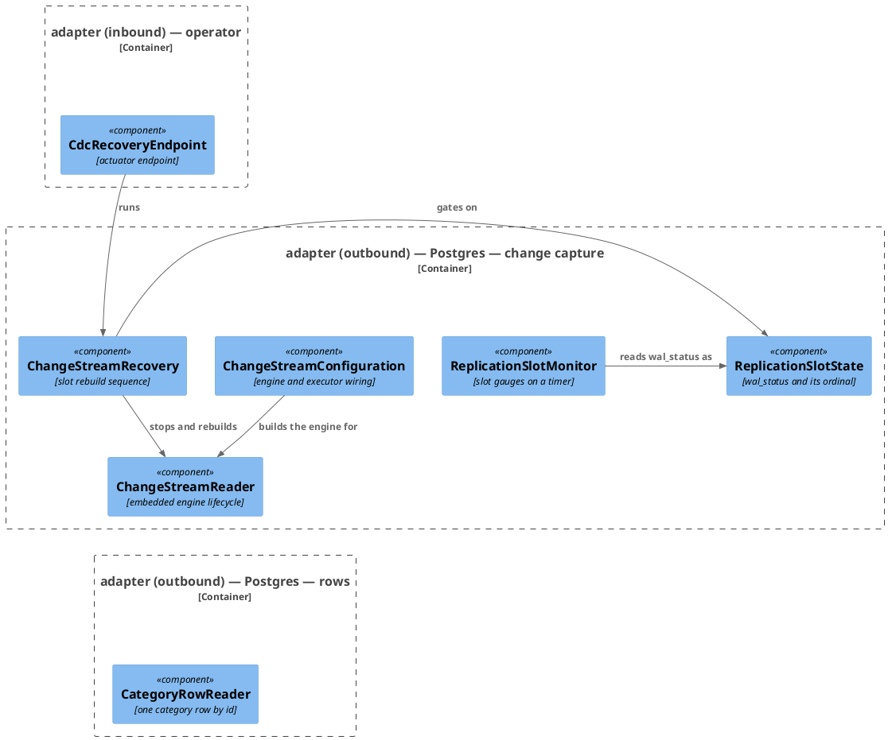
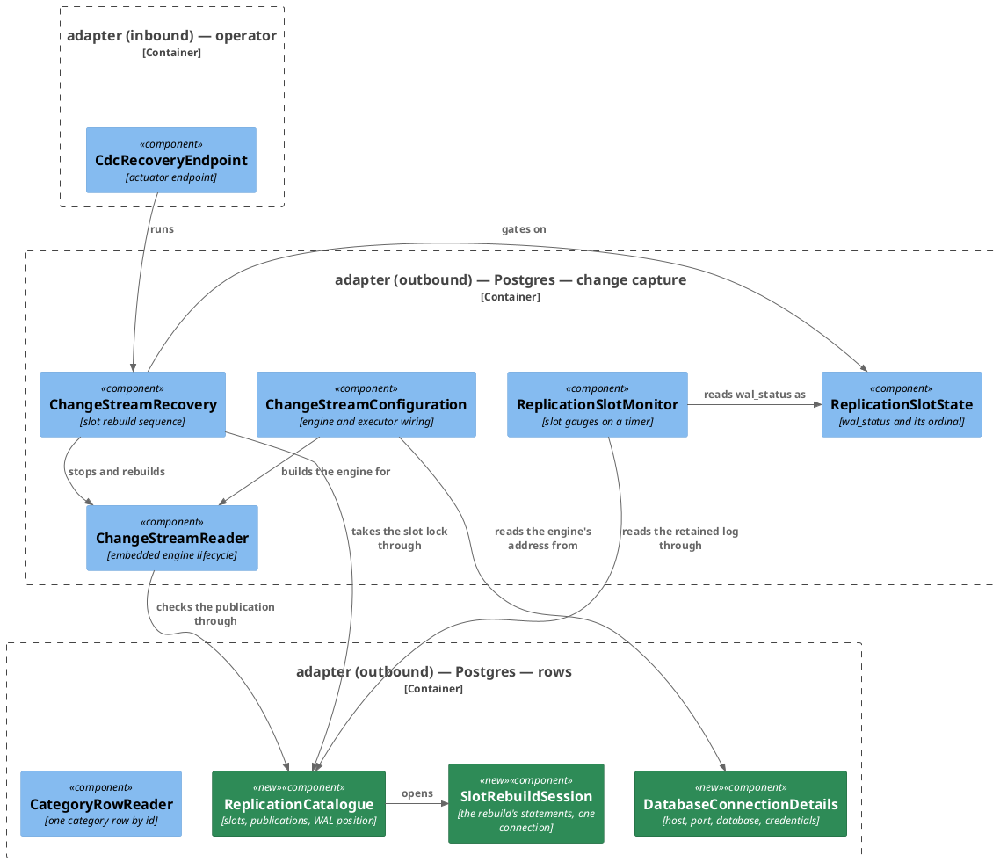

# Rework: every statement change capture runs moves to the persistence adapter

**Affected Modules:** `ledger-service`
**Source:** R4 of
[task 23's findings](../implemented/23-broadcast-ledger-changes-to-redis/review/findings.md)
**Baseline:** `369f029`

## What the code does now

| What                                                                     | Where                       | What is wrong with it                                                                                                       |
|--------------------------------------------------------------------------|-----------------------------|-----------------------------------------------------------------------------------------------------------------------------|
| Six statements, a raw `DataSource`, and a `Connection` lifecycle          | `cdc/ChangeStreamRecovery`  | One public `recover()` over `pg_try_advisory_lock`, `pg_advisory_unlock`, `pg_replication_slots`, `DELETE FROM debezium_offset_storage`, `pg_drop_replication_slot` and `pg_current_wal_lsn`. A Postgres upgrade and a change to the rebuild sequence open the same file. |
| `pg_replication_slots` with `pg_wal_lsn_diff`, and its own `DataSource`   | `cdc/ReplicationSlotMonitor`| The class exists to record two gauges; opening a connection and reading a catalogue view is the persistence adapter's job.   |
| `SELECT 1 FROM pg_publication`, and its own `DataSource`                  | `cdc/ChangeStreamReader`    | The class owns an engine lifecycle. The catalogue read is there only because nothing else could answer it.                   |
| A `(HikariDataSource)` cast and a hand-parsed JDBC URL                    | `cdc/ChangeStreamConfiguration` | The capture pipeline reaches into the connection pool for a host, a port, a database name and a password.               |
| The engine's offset-table name, `debezium_offset_storage`                 | `cdc/ChangeStreamRecovery`  | The storage engine's schema detail, held by the class that describes the rebuild sequence.                                   |

`adapter/persistence` is already the only other package in the module that names a JDBC type, so these four
classes are the whole gap between the tree and a rule that says so.

## Structure

### Now

Every class in the capture boundary opens its own connection. The relation is left out of the diagram
because it runs from all four to one target.

### Target

`ReplicationSlotRetention` and `ReplicationSlotPosition` are records the catalogue answers with, and nothing
calls them, so they are the two rows below rather than boxes.

| Record                     | Fields                                | Answers                                 |
|----------------------------|---------------------------------------|-----------------------------------------|
| `ReplicationSlotRetention` | `long retainedBytes`, `String walStatus` | what the monitor records as two gauges  |
| `ReplicationSlotPosition`  | `String walStatus`, `String confirmedFlushLsn` | what the rebuild gates on and abandons |

Both carry `wal_status` as the text Postgres answers. `ReplicationSlotState` stays in `adapter/cdc`, which maps
the text, so the dependency runs one way only.

## What must stay true

- The lock, the slot read, the offset delete, the drop and the LSN read all run on **one** connection. An
  advisory lock is session-scoped, so one taken on a pooled session and released on another stays held: every
  later `POST /actuator/cdc` answers `LOCK_HELD` on a service where nothing else is running.
- The monitor answers whether or not this instance's engine holds the slot, and whether or not a slot exists.
  It would be noticed as the two slot gauges disappearing while capture is switched off.
- A rebuild deletes the stored position **before** dropping the slot, so a crash between them heals as a first
  start. It would be noticed as capture resuming at a position whose slot is gone, and never streaming.
- The publication is checked before the engine starts. Without it an engine pointed at a publication the
  database does not have reports itself streaming, holds the slot and publishes nothing.

## Steps

- [x] R01 · extract · the slot monitor's catalogue read moves to a persistence catalogue
  - files:
    - `ledger-service/src/main/java/bot/finance/adapter/cdc/ReplicationSlotMonitor.java`
    - `ledger-service/src/main/java/bot/finance/adapter/persistence/ReplicationCatalogue.java`
    - `ledger-service/src/main/java/bot/finance/adapter/persistence/ReplicationSlotRetention.java`
  - test-files:
    - `ledger-service/src/test/java/bot/finance/adapter/persistence/ReplicationCatalogueTest.java`
  - frozen: `ReplicationSlotMonitorTest`
  - cover: `ReplicationCatalogueTest`

- [ ] R02 · extract · the publication check moves out of the engine's lifecycle class
  - files:
    - `ledger-service/src/main/java/bot/finance/adapter/cdc/ChangeStreamReader.java`
    - `ledger-service/src/main/java/bot/finance/adapter/persistence/ReplicationCatalogue.java`
  - test-files:
    - `ledger-service/src/test/java/bot/finance/adapter/persistence/ReplicationCatalogueTest.java`
  - needs: `ReplicationCatalogue` is a component the reader can be given
  - frozen: `ChangeStreamReaderTest`
  - cover: `ReplicationCatalogueTest`

- [ ] R03 · extract · the rebuild's six statements move behind a lock-scoped session
  - files:
    - `ledger-service/src/main/java/bot/finance/adapter/cdc/ChangeStreamRecovery.java`
    - `ledger-service/src/main/java/bot/finance/adapter/persistence/ReplicationCatalogue.java`
    - `ledger-service/src/main/java/bot/finance/adapter/persistence/SlotRebuildSession.java`
    - `ledger-service/src/main/java/bot/finance/adapter/persistence/ReplicationSlotPosition.java`
  - test-files:
    - `ledger-service/src/test/java/bot/finance/adapter/persistence/ReplicationCatalogueTest.java`
  - needs: `ReplicationCatalogue` is a component the recovery can be given
  - frozen: `ChangeStreamRecoveryTest`
  - cover: `ReplicationCatalogueTest`

- [ ] R04 · extract · the connection pool's address and credentials move to persistence
  - files:
    - `ledger-service/src/main/java/bot/finance/adapter/cdc/ChangeStreamConfiguration.java`
    - `ledger-service/src/main/java/bot/finance/adapter/persistence/DatabaseConnectionDetails.java`
  - test-files:
    - `ledger-service/src/test/java/bot/finance/adapter/persistence/DatabaseConnectionDetailsTest.java`
  - frozen: `ChangeStreamReaderTest`
  - cover: `DatabaseConnectionDetailsTest`

- [ ] R05 · pin · the persistence adapter is the only package that may name a JDBC type
  - test-files:
    - `ledger-service/src/test/java/bot/finance/architecture/CleanArchitectureTest.java`
  - needs: no class outside `bot.finance.adapter.persistence` imports `java.sql..`, `javax.sql..`,
    `com.zaxxer.hikari..`, `org.springframework.jdbc..` or `org.springframework.data.jdbc..`, test classes and
    `bot.finance.common..` excluded
  - proves: the `javax.sql.DataSource` field is put back into `ReplicationSlotMonitor` and the new rule reds;
    the field is removed again and the rule is green
  - docs: `ledger-service/docs/conventions/architecture.md`

## Open Questions

- **Q1:** The two records answer `wal_status` as the text Postgres gives, and `adapter/cdc` maps it to
  `ReplicationSlotState`. The alternative is moving that enum to `adapter/persistence` so the catalogue answers
  it directly, which points the dependency the other way — the same direction rework 24's R2 is still open
  about. Keep the enum in `adapter/cdc`?
  - A: Yes. The catalogue answers `wal_status` as text and `adapter/cdc` maps it.
- **Q2:** The rule R05 adds covers the four packages the finding named. `java.sql..` — `Connection`,
  `PreparedStatement`, `ResultSet` — is what the four classes actually hold, and banning it outside
  `adapter/persistence` is what stops the same thing being written again. It needs the test-class exclusion the
  module's existing rules already use, since `ChangeStreamRecoveryTest` opens a raw connection on purpose. Add
  `java.sql..` to the rule?
  - A: Yes. `java.sql..` joins the four packages, with the test-class exclusion.
- **Q3:** Record the decision as an ADR — *every JDBC type is confined to the persistence adapter, and other
  adapters reach the database through a collaborator it owns*?
  - A: No. The rule is enforced by `CleanArchitectureTest` and stated in the module's architecture conventions.
