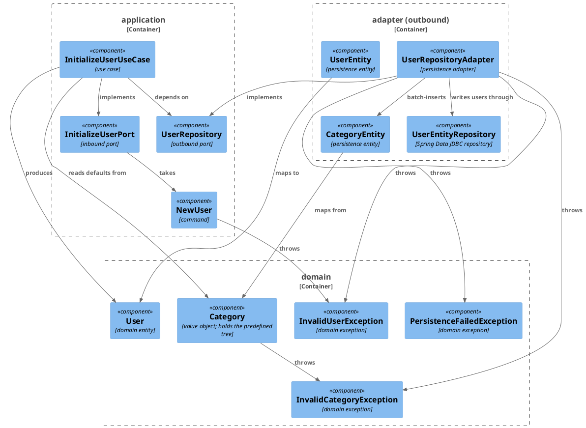
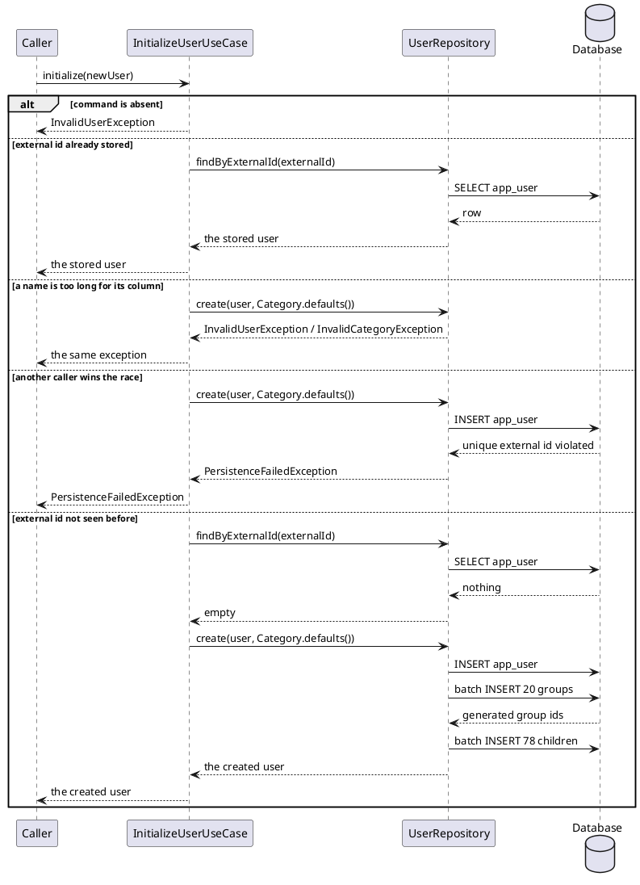

# Plan: Initialize a New User

**Affected Modules:** `ledger-service`

## Objective

Give the service a use case that turns an external identity into a stored user with a full set of spending
categories. Calling it with an identity the service has not seen creates the user and the predefined category
tree; calling it again returns the user already there and writes nothing.

Nothing drives the use case yet — this plan adds the inbound port and its implementation, not a caller.

## Proposed Solution

### The category tree

Categories are stored per user, two levels deep: 20 groups holding 78 children, 98 rows per user. The tree is
domain knowledge and lives on `Category.defaults()`:

| Group             | Children                                                                    |
|-------------------|-----------------------------------------------------------------------------|
| Housing           | Rent, Mortgage, HOA, Property Tax, Home Insurance, Repairs, Furniture       |
| Groceries         | Supermarkets, Markets, Household Supplies                                   |
| Dining            | Restaurants, Cafés, Fast Food, Delivery                                     |
| Transportation    | Fuel, Public Transport, Parking, Taxis/Uber, Car Maintenance, Car Insurance |
| Utilities         | Electricity, Gas, Water, Internet, Mobile Phone                             |
| Healthcare        | Doctors, Pharmacy, Dental, Vision, Health Insurance                         |
| Education         | Tuition, Books, Courses, Certifications                                     |
| Shopping          | Clothing, Electronics, Home Goods, Gifts                                    |
| Entertainment     | Movies, Games, Streaming Services, Hobbies                                  |
| Travel            | Hotels, Flights, Vacation, Attractions                                      |
| Pets              | Food, Vet, Grooming                                                         |
| Family & Children | Childcare, School Supplies, Toys                                            |
| Financial         | Taxes, Bank Fees, Loan Payments, Interest                                   |
| Investments       | Brokerage, Retirement, Crypto, Savings Transfers                            |
| Gifts & Donations | Charity, Birthday Gifts, Holidays                                           |
| Work              | Office Supplies, Business Expenses                                          |
| Insurance         | Life, Home, Vehicle, Travel                                                 |
| Personal Care     | Haircuts, Cosmetics, Gym, Spa                                               |
| Subscriptions     | Netflix, Spotify, Cloud Storage, Software                                   |
| Miscellaneous     | Uncategorized Expenses                                                      |

One name repeats across the tree — `Travel`, both as a group and as a child of Insurance. Uniqueness is
therefore on `(user_id, parent_id, name)`, not on `(user_id, name)`.

### Domain

`domain/value/Category` — a self-validating record `(String name, List<Category> children)` with factories
`leaf(String)` and `group(String, String...)`, and the static `defaults()` returning the 20 groups above. A blank
name, an absent child list, or a child carrying children of its own throws the new `InvalidCategoryException`:
the tree is exactly two levels, and both the schema and the write path depend on it.

`domain/model/User` — an entity carrying an optional database id and the external identity it is known by, built
through `newUser(String externalId)` (not yet stored) or `stored(long id, String externalId)`. Two users are the
same user when their external ids match; the database id is not the identity. `User` validates nothing: `NewUser`
checks the external id upstream of every production call site, and the column widths belong to the adapter (see
**Persistence**).

`domain/exception/InvalidUserException`, `domain/exception/InvalidCategoryException`, and
`domain/exception/PersistenceFailedException` — the last one available to every repository adapter.
`UserRepositoryAdapter.create()` uses it for the one failure it can provoke, the unique external id, so that
failure does not reach the port as a framework type; no other translation is in this plan's scope.

### Application

`application/dto/NewUser` — the inbound-port command, a record `(String externalId)` validating itself and
throwing `InvalidUserException`. `externalId` is opaque text, whatever the calling adapter's transport identifies
a person by; it carries no transport name inward.

`application/port/InitializeUserPort` — `User initialize(NewUser newUser)`.

`application/port/UserRepository` — the outbound port, with `Optional<User> findByExternalId(String externalId)`
and `User create(User user, List<Category> categories)`. The user row and its 98 category rows are written by one
port operation so they can share a transaction; transaction machinery lives in the adapter.

`application/usecase/InitializeUserUseCase` — looks the external id up, returns the user already there, or creates
it with `Category.defaults()` and returns what was stored. A null command throws `InvalidUserException`. A storage
failure is not caught: `PersistenceFailedException` propagates to the caller.

`adapter/config/UseCaseConfiguration` gains the bean method for the new port.

### Persistence

`adapter/persistence/UserRepositoryAdapter` implements `UserRepository` over `UserEntityRepository`, a Spring Data
JDBC interface, and `JdbcAggregateTemplate`. `create` runs in one transaction and three round trips: the user row,
then all 20 groups in one batch, then all 78 children in one batch. `JdbcAggregateTemplate.insertAll` batches its
inserts and hands the stored entities back in the order it was given them, which is how each group's generated id
is paired with its `Category`.

Before writing, the adapter checks what the columns require — an external id of at most 255 characters, a category
name of at most 100 — and rejects a violation with `InvalidUserException` / `InvalidCategoryException` instead of
letting it surface as a driver error. The domain types do not carry these caps; the schema does, and the adapter is
what knows the schema.

A `DataIntegrityViolationException` out of the insert — the unique external id, under a race between two
concurrent `initialize` calls — is translated into `PersistenceFailedException` on the way out.

Mapping lives on `UserEntity` (`toDomain()` / `fromDomain(User)`) and `CategoryEntity` (`root(...)` /
`child(...)`); a category is never read back into the domain, since no use case reads categories yet.

Migration `src/main/resources/db/migration/V001__create_user_and_category.sql` — the module's first migration:

```sql
CREATE TABLE app_user
(
    id          BIGSERIAL PRIMARY KEY,
    external_id VARCHAR(255) NOT NULL,
    CONSTRAINT uq_app_user_external_id UNIQUE (external_id)
);

CREATE TABLE category
(
    id        BIGSERIAL PRIMARY KEY,
    user_id   BIGINT       NOT NULL REFERENCES app_user (id) ON DELETE CASCADE,
    parent_id BIGINT REFERENCES category (id) ON DELETE CASCADE,
    name      VARCHAR(100) NOT NULL
);

CREATE UNIQUE INDEX uq_category_user_parent_name
    ON category (user_id, parent_id, name) NULLS NOT DISTINCT;
```

`user` is reserved in PostgreSQL, hence `app_user`. `NULLS NOT DISTINCT` makes the constraint hold for the 20
groups too, whose `parent_id` is absent.

Files touched: `V001__create_user_and_category.sql`, `Category`, `User`, `InvalidUserException`,
`InvalidCategoryException`, `PersistenceFailedException`, `NewUser`, `InitializeUserPort`, `UserRepository`,
`InitializeUserUseCase`, `UserEntity`, `CategoryEntity`, `UserEntityRepository`, `UserRepositoryAdapter`,
`UseCaseConfiguration`.

#### Diagrams

There is no inbound-adapter boundary below: nothing drives `InitializeUserPort` yet, which is also why this plan
has no system-test phase.





## Step-by-Step Implementation Map (To-Do List)

### Stabilization

#### Database

- [x] ST01 · Add migration `src/main/resources/db/migration/V001__create_user_and_category.sql` — the module's
  first migration, so the `db/migration` directory is created with it:
  ```sql
  CREATE TABLE app_user (
      id          BIGSERIAL PRIMARY KEY,
      external_id VARCHAR(255) NOT NULL,
      CONSTRAINT uq_app_user_external_id UNIQUE (external_id)
  );

  CREATE TABLE category (
      id        BIGSERIAL   PRIMARY KEY,
      user_id   BIGINT      NOT NULL REFERENCES app_user (id) ON DELETE CASCADE,
      parent_id BIGINT      REFERENCES category (id) ON DELETE CASCADE,
      name      VARCHAR(100) NOT NULL
  );

  CREATE UNIQUE INDEX uq_category_user_parent_name
      ON category (user_id, parent_id, name) NULLS NOT DISTINCT;
  ```

#### Interface-First / Build Stabilization

**Interface & Signature Sync**

- [x] ST02 · Add `domain/exception/InvalidUserException`, `domain/exception/InvalidCategoryException` and
  `domain/exception/PersistenceFailedException`, all unchecked, shaped like the existing
  `InvalidIncomingMessageException`. `PersistenceFailedException` also takes a cause, so the framework exception
  it replaces is not lost
- [x] ST03 · Add `domain/value/Category` as `record Category(String name, List<Category> children)` with a stub
  compact constructor, the factories `leaf(String name)` and `group(String name, String... childNames)`, and a
  stubbed `defaults()`:
  ```java
  public Category {
      // rejects a blank name, an absent child list, and a child that carries children of its
      // own, with InvalidCategoryException; keeps children as an unmodifiable copy
  }

  public static List<Category> defaults() {
      // the 20 predefined groups and their 78 children, in the order the plan lists them
      return List.of();
  }
  ```
- [x] ST04 · Add `domain/model/User` — a final class holding the optional database id and the external id, with
  `newUser(String externalId)`, `stored(long id, String externalId)`, `Optional<Long> id()` and
  `String externalId()`. It validates nothing (see **Domain**). No `equals`/`hashCode` yet; identity semantics are
  GU02's target
- [x] ST05 · Add `application/dto/NewUser` as `record NewUser(String externalId)` with a stub compact constructor:
  ```java
  public NewUser {
      // rejects an absent or blank external id with InvalidUserException
  }
  ```
- [x] ST06 · Add `application/port/InitializeUserPort` with `User initialize(NewUser newUser)`
- [x] ST07 · Add `application/port/UserRepository` with `Optional<User> findByExternalId(String externalId)` and
  `User create(User user, List<Category> categories)`
- [x] ST08 · Add `application/usecase/InitializeUserUseCase` implementing `InitializeUserPort`, taking
  `UserRepository` and `LoggerFactory` on its constructor, with a stubbed `initialize()`:
  ```java
  public User initialize(NewUser newUser) {
      // rejects an absent command; returns the user already stored under the external id,
      // otherwise creates it together with Category.defaults() and returns what was stored
      return null;
  }
  ```
- [x] ST09 · Add `adapter/persistence/UserEntity` as `record UserEntity(@Id Long id, String externalId)` annotated
  `@Table("app_user")` — complete, including `toDomain()` and `static fromDomain(User user)`; the mapping is a
  two-field copy with no logic of its own
- [x] ST10 · Add `adapter/persistence/CategoryEntity` as
  `record CategoryEntity(@Id Long id, Long userId, Long parentId, String name)` annotated `@Table("category")` —
  complete, with `static root(long userId, Category category)` and
  `static child(long userId, long parentId, Category category)`. All four components stay on the canonical
  constructor so `JdbcAggregateTemplate` can read rows back in `UserRepositoryAdapterTest`. No `toDomain()`:
  nothing reads categories back into the domain yet
- [x] ST11 · Add `adapter/persistence/UserEntityRepository extends CrudRepository<UserEntity, Long>` with
  `Optional<UserEntity> findByExternalId(String externalId)`. Categories need no repository interface — they are
  written through `JdbcAggregateTemplate` in batches
- [x] ST12 · Add `adapter/persistence/UserRepositoryAdapter` as a `@Component` implementing `UserRepository`,
  taking `UserEntityRepository` and `JdbcAggregateTemplate` on its constructor, with stubs for both methods and
  the two column widths as constants:
  ```java
  public Optional<User> findByExternalId(String externalId) {
      // looks the user row up by its external id and maps it to the domain
      return Optional.empty();
  }

  @Transactional
  public User create(User user, List<Category> categories) {
      // rejects an external id over 255 characters with InvalidUserException and any category
      // name over 100 with InvalidCategoryException, before writing anything;
      // inserts the user, then the groups in one insertAll batch, then their children in a
      // second batch against the ids their groups came back with;
      // translates DataIntegrityViolationException into PersistenceFailedException;
      // returns the user with its generated id
      return null;
  }
  ```

**Configuration**

- [x] ST13 · Add the `InitializeUserPort` bean method to `adapter/config/UseCaseConfiguration`, wired from
  `UserRepository` and `LoggerFactory`

**Close-out**

- [x] ST14 · Compile the module and confirm `bot.finance.architecture.CleanArchitectureTest` still passes ·
  after: ST01, ST02, ST03, ST04, ST05, ST06, ST07, ST08, ST09, ST10, ST11, ST12, ST13

### Stabilization — follow-up round

Raised after the first round shipped. See **Q4**–**Q9** for what is still undecided; an item below is written
only where the decision is already made.

#### Tooling

- [ ] ST15 · Wire an automatic formatter into the module's build so import order and layout stop being
  hand-maintained (see **Q7** for which). It must be runnable as a check and as a fix, and the fix task belongs
  in [Build](../ledger-service/docs/conventions/build.md) alongside the test wrapper. Apply it once across the
  module in its own commit, so the reformatting does not ride along with behaviour changes ·
  after: GU05, GU06, GI02, GI03

#### Interface-First / Build Stabilization

**Interface & Signature Sync**

- [ ] ST16 · Document on each outbound and inbound port interface which runtime exceptions its operations
  throw, as `@throws` javadoc on `UserRepository.findByExternalId`, `UserRepository.create` and
  `InitializeUserPort.initialize`. A port is a contract and its failures are part of it; this is the one place
  the conventions' "comments only for what the code cannot show" rule does not cut against writing them, since
  an unchecked exception appears in no signature
- [ ] ST17 · Extend `docs/conventions/code-style.md` with the two rules this round settles: a port interface
  documents the runtime exceptions it throws (ST16), and an outbound adapter translates **every** runtime
  exception from its infrastructure into a domain exception (GI02). Without this the next adapter repeats the
  gap

### Red Phase

#### TDD Unit Red Phase

- [x] RU01 · `Category` · test: `CategoryTest` · covers: `Category()`, `leaf()`, `group()`, `defaults()`
    - `Category()`:
        - given: a name that is absent, empty, or only whitespace
          when: the record is constructed
          then: throws InvalidCategoryException
        - given: an absent child list
          when: the record is constructed
          then: throws InvalidCategoryException
        - given: a category whose child carries children of its own
          when: the record is constructed
          then: throws InvalidCategoryException — the tree is exactly two levels
        - given: a mutable child list
          when: the record is constructed and the source list is then modified
          then: the category's children are unchanged
    - `leaf()`:
        - given: a name
          when: leaf() is called
          then: returns a category with that name and no children
    - `group()`:
        - given: a name and several child names
          when: group() is called
          then: returns a category with that name whose children are childless categories with those names, in
          the order given
    - `defaults()`:
        - given: nothing
          when: defaults() is called
          then: returns the 20 predefined groups, by name and in order
        - given: nothing
          when: defaults() is called
          then: the whole tree holds 98 categories, of which 78 are children
        - given: nothing
          when: defaults() is called
          then: the group named Housing carries exactly Rent, Mortgage, HOA, Property Tax, Home Insurance,
          Repairs and Furniture, in that order
        - given: nothing
          when: defaults() is called
          then: no group carries two children with the same name, and no two groups share a name — the
          uniqueness the `(user_id, parent_id, name)` index enforces
        - given: nothing
          when: defaults() is called
          then: Travel is present both as a group and as a child of Insurance
        - given: nothing
          when: defaults() is called
          then: the tree is exactly two levels — no child of a group carries children of its own
- [x] RU02 · `User` · test: `UserTest` · covers: `newUser()`, `stored()`, `equals()`, `hashCode()`
    - `newUser()`:
        - given: an external id
          when: newUser() is called
          then: returns a user carrying that external id and no database id
    - `stored()`:
        - given: a database id and an external id
          when: stored() is called
          then: returns a user carrying both
    - `equals()`:
        - given: a stored user and an unstored user with the same external id
          when: they are compared
          then: they are equal and their hash codes match — the external id is the identity
        - given: two stored users with the same database id but different external ids
          when: they are compared
          then: they are not equal
- [x] RU03 · `NewUser` · test: `NewUserTest` · covers: `NewUser()`
    - `NewUser()`:
        - given: an external id that is absent, empty, or only whitespace
          when: the record is constructed
          then: throws InvalidUserException
        - given: a non-blank external id
          when: the record is constructed
          then: the record carries it
- [x] RU04 · `InitializeUserUseCase` · test: `InitializeUserUseCaseTest` · covers: `initialize()`
    - `initialize()`:
        - given: the repository holds no user for the external id
          when: initialize() is called
          then: the repository is asked to create a user carrying that external id together with
          `Category.defaults()`, and the created user is returned
        - given: the repository already holds a user for the external id
          when: initialize() is called
          then: that user is returned and the repository is never asked to create anything
        - given: the repository holds no user for the external id
          when: initialize() is called
          then: the creation is logged at info level carrying the external id
        - given: an absent command
          when: initialize() is called
          then: throws InvalidUserException and the repository is untouched
        - given: the repository holds no user for the external id and raises
          PersistenceFailedException while creating
          when: initialize() is called
          then: the exception reaches the caller unchanged and is not swallowed or retried

### Red Phase — follow-up round

#### TDD Unit Red Phase

- [ ] RU05 · `Category` · test: `CategoryTest` · covers: `Category()`
    - `Category()`:
        - given: a child list carrying a null element
          when: the record is constructed
          then: throws InvalidCategoryException rather than NullPointerException — every invalid input to this
          record yields the domain exception (finding **B3**)
- [ ] RU06 · `InitializeUserUseCase` · test: `InitializeUserUseCaseTest` · covers: `initialize()`
    - `initialize()`:
        - update: `whenNoUserExistsForExternalId_thenCreationIsLoggedAtInfoLevelWithExternalId()` — delete it.
          The logging matters but does not earn a test of its own, and asserting on it pins a message format
          nothing else depends on

#### TDD Integration Red Phase

- [ ] RI02 · `UserRepositoryAdapter` · test: `UserRepositoryAdapterTest` · covers: `findByExternalId()`,
  `create()`
    - `findByExternalId()`:
        - given: the database is unreachable
          when: findByExternalId() is called
          then: throws PersistenceFailedException carrying the framework exception as its cause — today the
          framework type escapes through the port untranslated
    - `create()`:
        - given: an unstored user whose external id is absent
          when: create() is called
          then: throws InvalidUserException before anything is written, rather than failing the NOT NULL
          constraint downstream (finding **B4**)
        - given: a database failure that is not a constraint violation
          when: create() is called
          then: throws PersistenceFailedException carrying the framework exception as its cause (finding **B1**)
        - update: `whenCalledWithUnstoredUserAndDefaultCategories_thenCategoryTreeIsWrittenMatchingByName()` —
          keep the assertion, and add one that the pairing survives a group order the store does not preserve,
          so the test stops depending on `insertAll` returning rows in input order
- [ ] RI03 · `UserRepositoryAdapter` · test: `UserRepositoryAdapterConcurrencyTest` · covers: `create()`
    - `create()`:
        - given: two threads released together by a `CountDownLatch`, both creating a user under the same
          external id
          when: both call create()
          then: exactly one user row and one set of 98 category rows exist afterwards, and the loser's outcome
          is whatever **Q5** settles
    - A separate test class because it must commit rather than roll back, so it cannot share
      `UserRepositoryAdapterTest`'s transactional slice; it cleans up after itself

#### TDD Integration Red Phase — first round

- [x] RI01 · `UserRepositoryAdapter` · test: `UserRepositoryAdapterTest` · covers: `findByExternalId()`,
  `create()`
    - `findByExternalId()`:
        - given: a user row stored under an external id
          when: findByExternalId() is called with that id
          then: returns the user carrying its generated database id and its external id
        - given: an external id nothing is stored under
          when: findByExternalId() is called
          then: returns an empty result
    - `create()`:
        - given: an unstored user and `Category.defaults()`
          when: create() is called
          then: the user row is written and the returned user carries its generated database id
        - given: an unstored user and `Category.defaults()`
          when: create() is called
          then: 98 category rows exist for that user — 20 with no parent, and each remaining row pointing at the
          row of the group it belongs to, matching the tree by name
        - given: a user already stored under an external id
          when: create() is called with an unstored user carrying the same external id
          then: the unique constraint rejects the insert and a PersistenceFailedException is raised, carrying the
          framework exception it replaced as its cause
        - given: an unstored user whose external id is exactly 255 characters
          when: create() is called
          then: the user is written and returned with its generated id — 255 is the widest the column accepts
        - given: an unstored user whose external id is 256 characters
          when: create() is called
          then: throws InvalidUserException before anything is written, so no user row exists afterwards
        - given: a category tree whose child name is exactly 100 characters
          when: create() is called
          then: the tree is written and that child's row carries the whole name
        - given: a category tree whose child name is 101 characters
          when: create() is called
          then: throws InvalidCategoryException before anything is written, so no user row exists afterwards
        - given: a category tree whose group name is 101 characters
          when: create() is called
          then: throws InvalidCategoryException before anything is written — groups are checked as well as
          children
        - given: two users created one after the other
          when: create() is called for each
          then: each user owns its own 98 category rows, and neither user's rows reference the other's

### Green Phase

#### TDD Unit Green Phase

- [x] GU01 · `Category` · test: `CategoryTest`
- [x] GU02 · `User` · test: `UserTest`
- [x] GU03 · `NewUser` · test: `NewUserTest`
- [x] GU04 · `InitializeUserUseCase` · test: `InitializeUserUseCaseTest` · after: GU01, GU02, GU03

### Green Phase — follow-up round

#### TDD Unit Green Phase

- [ ] GU05 · `Category` · test: `CategoryTest` · after: GU01
- [ ] GU06 · `InitializeUserUseCase` · test: `InitializeUserUseCaseTest` · after: GU04

#### TDD Integration Green Phase

- [ ] GI02 · `UserRepositoryAdapter` · test: `UserRepositoryAdapterTest` · after: GU05
- [ ] GI03 · `UserRepositoryAdapter` · test: `UserRepositoryAdapterConcurrencyTest` · after: GI02

#### TDD Integration Green Phase — first round

- [x] GI01 · `UserRepositoryAdapter` · test: `UserRepositoryAdapterTest` · after: GU01, GU02

### Post-Implementation Steps

#### Documentation

- [ ] P01 · Cut the ADR template in the `archive-knowledge` instructions down to something a reader will
  actually read — the four existing ADRs run to full pages for what are each a single settled decision. Fix the
  template, not the symptom: state a target length, and make **Context** one paragraph on what forced the
  decision, **Decision** the rule, **Consequences** what it costs. The instructions live in
  `.claude/commands/archive-knowledge.md`, which is pulled into other projects as a plugin, so the change stays
  project-agnostic
- [ ] P02 · Rewrite the four existing ADRs to the shortened template — `0001`, `0002`, `0003`, `0004`. Rewriting
  is not superseding: the decisions stand unchanged, only their length changes, so no new ADR number is taken ·
  after: P01
- [ ] P03 · Update `ledger-service/docs/usecases/initialize-a-new-user.md` for whatever **Q4** settles about the
  catalogue, and bring `handle-incoming-message.md` onto the current use-case page shape — it still carries a
  numbered **Flow** list beside its sequence diagram, which commit `db00a15` replaced · after: GU06

## Open Questions / Blockers

- **Q1:** `Category.defaults()` is a fixed catalogue compiled into the service, so a user who edits their
  categories will diverge from it and a later release that changes the catalogue cannot reach them. Is that
  intended for now, or should the catalogue be seeded from data instead?
- A: yes, only the new users get the updated defaults.

- **Q2:** `create()` writes 98 rows through 98 individual inserts inside one transaction. This runs once per
  user, so the plan does not optimize it. Confirm that is acceptable rather than a batched insert.
- A: I prefer batched insert.
  Applied — `create()` now writes through `JdbcAggregateTemplate.insertAll`, which batches: one insert for the
  user, one batch for the 20 groups, one batch for the 78 children. `CategoryEntityRepository` is dropped —
  `insertAll` forces an insert, where `saveAll` decides insert-versus-update per entity through `isNew`, and
  nothing else would have used the interface.

- **Q3:** No caller exists, so this plan has no system-test phase and the port is unreachable at runtime. The
  plan that wires a caller adds the entry point and its system tests. Confirm nothing should reach the port in
  this plan.
- A: Nothing should reach the port in this plan right now.

### Follow-up round (2026-07-28)

- **Q4:** The predefined catalogue names specific brands — `Netflix`, `Spotify` — where a general label would
  cover more (`Streaming` also covers YouTube). `Streaming Services` under Entertainment and `Netflix`/`Spotify`
  under Subscriptions already overlap. Which catalogue does the product want? See the options in the
  conversation; the answer replaces the table in **The category tree** and drives RU05/GU05 and P03.
- A:

- **Q5:** Two callers racing on the same external id: the loser currently gets `PersistenceFailedException`,
  because the lookup and the insert are separate statements. Should the loser instead get the user the winner
  created — making `initialize` idempotent under concurrency, not just in sequence? That is what RI03 asserts,
  and it changes `create`'s contract.
- A:

- **Q6:** Should the domain model be records? `User` is a class because its identity is `externalId` alone,
  while a record's generated `equals` covers every component including the database id. A record is possible if
  identity moves out of `equals` — or if `User` stops carrying its id. Which?
- A:

- **Q7:** Which formatter for ST15 — Spotless (with `palantir-java-format` or `google-java-format`), or
  Checkstyle as a check-only gate? A formatter rewrites; a linter only reports. The complaint is that style is
  being hand-applied, which argues for the rewriter.
- A:

- **Q8:** Where do the adapter's validators belong? Options: private methods where they are now; a
  package-private validator type in `adapter/persistence`; or on the entities, next to the columns whose widths
  they enforce. The last keeps the width and its check in one place — but the entities are mapping types today
  and would gain behaviour.
- A:

- **Q9:** Finding **B2** — the column widths are stated in both `V001` and the adapter, with nothing linking
  them. Reading them from the database at startup would align them at the cost of a runtime dependency on the
  schema; a comment in the migration pointing at the constants is free but only advisory. Which, or leave the
  duplication and accept it?
- A:

### Raised by the refactor phase (2026-07-28)

Found against the finished, green implementation. None is a defect in this plan's delivered scope — each would
change behaviour, so the refactor agent reported rather than fixed them. They are recorded here for the plan that
wires a caller.

- **B1:** `UserRepositoryAdapter.create()` translates only `DataIntegrityViolationException`. Any other
  `DataAccessException` — connection loss, deadlock, timeout — crosses the `UserRepository` port as an
  `org.springframework.dao.*` type. ArchUnit cannot see it: a propagating exception is not a compile-time
  dependency, so the framework-agnostic-core guarantee currently holds only on the happy path. F11 narrowed the
  plan's claim to match this, so the text is accurate — but the gap is real and untested.
- Accepted 2026-07-28, widened: **every** runtime exception out of a repository is translated, in
  `findByExternalId` as well as `create`. Fixed by RI02 / GI02; the rule is written down by ST17.
- **B2:** `MAX_EXTERNAL_ID_LENGTH = 255` and `MAX_CATEGORY_NAME_LENGTH = 100` restate `V001`'s column widths with
  nothing linking them. A later migration that widens a column leaves the adapter rejecting values the database
  would accept.
- Open — see **Q9**. The intent is settled (catch it in Java rather than let the database raise it); only the
  mechanism for keeping the two in step is not.
- **B3:** A null element inside a `Category` child list throws `NullPointerException` rather than
  `InvalidCategoryException` — the compact constructor dereferences `child.children()` before `List.copyOf` runs.
  Every other invalid input to the record yields the domain exception. Untested.
- Accepted 2026-07-28; fixed by RU05 / GU05.
- **B4:** `UserRepositoryAdapter.validateExternalId` returns early on a null external id, so `User.newUser(null)`
  reaches the insert and fails the NOT NULL constraint as `PersistenceFailedException` instead of
  `InvalidUserException`. Unreachable through `InitializeUserUseCase` (`NewUser` rejects blanks), but
  `UserRepository.create` is a public port operation and `User` deliberately validates nothing.
- Accepted 2026-07-28; a null external id is rejected. Fixed by RI02 / GI02.

## Review Findings

- **F1:** `Category` permits arbitrary nesting while persistence handles exactly two levels. The canonical
  record constructor takes `List<Category> children` with no depth check (ST03), and `CategoryEntity` offers only
  `root(...)` and `child(...)` (ST10) while `UserRepositoryAdapter.create()` writes "each group with no parent,
  then each group's children" (ST12) — a grandchild is silently dropped, with no exception and no scenario
  covering it. RU01 asserts `defaults()` is exactly two levels, so the invariant is load-bearing but unenforced.
  Fix: either enforce two levels in `Category`'s compact constructor (a child carrying children throws
  `InvalidCategoryException`, with a matching RU01 scenario), or have `create()` reject a deeper tree, with a
  matching RI01 scenario.
- Resolution: decision
- Action: yes, I want to enforce exactly two levels.
  Applied — `Category`'s compact constructor rejects a child that carries children of its own (ST03), with a
  matching RU01 scenario. `create()` is left to trust the invariant.

- **F2:** No unhappy-path scenario exists for `InitializeUserUseCase` when the repository fails. `initialize()`
  is find-then-create (ST08), so a second concurrent call for the same external id passes `findByExternalId()`
  and hits the unique constraint `uq_app_user_external_id` — RI01 already asserts the adapter raises
  `DataIntegrityViolationException`, but RU04 lists only three scenarios, none of them a failing repository. The
  Spring exception therefore propagates out of the application layer untranslated, which is invisible to
  `CleanArchitectureTest` (propagating is not a compile-time dependency) but still puts a framework type on the
  `UserRepository` port's effective contract, against `architecture.md`'s "`domain` and `application` depend on
  nothing outside the JDK". Fix: decide whether `UserRepositoryAdapter.create()` translates the constraint
  violation into a domain exception (and whether the use case then re-reads the existing user), and add the
  corresponding RU04 and RI01 scenarios.
- Resolution: decision
- Action: yes, I want to translate the constraint violation into a domain exception like persistence exception that will
  be shared by all repository classes.
  Applied — `domain/exception/PersistenceFailedException` added (ST02), thrown by
  `UserRepositoryAdapter.create()` in place of `DataIntegrityViolationException` and carrying it as its cause
  (ST12). RI01's constraint scenario now expects it; RU04 gains a scenario asserting the use case lets it
  propagate rather than re-reading the existing user.

- **F3:** `InitializeUserUseCase` takes `LoggerFactory` on its constructor (ST08) and is wired with it (ST13),
  but RU04 lists no scenario asserting anything is logged, so a green-phase agent can leave the field unused or
  invent an arbitrary level. `code-style.md` maps a business event to `info`, and the existing
  `HandleIncomingMessageUseCaseTest` asserts on the mocked `Logger`. Fix: add a scenario under RU04's
  `initialize()` — given the repository holds no user for the external id, when `initialize()` is called, then
  the creation is logged at info level carrying the external id.
- Resolution: mechanical
- Action: applied — added the logging scenario under RU04's `initialize()`

- **F4:** The **The category tree** section claims "Four names repeat across the tree — `Travel` as a group and
  under Insurance, `Home` under Insurance, `Food` under Pets, `Gifts` under Shopping." Checked against the table:
  `Travel` is the only exact repeat. `Home` (Insurance) collides with nothing — Housing has `Home Insurance` and
  Shopping has `Home Goods`, both different strings; `Food` (Pets) collides with nothing — Dining has `Fast
  Food`; `Gifts` (Shopping) collides with nothing — the group is `Gifts & Donations` and Gifts & Donations has
  `Birthday Gifts`. Fix: rewrite the sentence to name the single repeat, `Travel` as a group and as a child of
  Insurance. RU01's Travel scenario is correct and needs no change.
- Resolution: mechanical
- Action: applied — **The category tree** now names `Travel` as the single repeat

- **F5:** RU01's `Category()` name-validation scenario says only "given: a blank name", leaving `null`, `""` and
  whitespace-only unenumerated — while RU03 spells all three out for `NewUser.externalId`, and the existing
  `IncomingMessageTest.invalidComponents()` covers exactly that triple. Fix: restate the scenario as "given: a
  name that is absent, empty, or only whitespace", matching RU03's wording so the step agent writes one
  parameterized test.
- Resolution: mechanical
- Action: applied — RU01's `Category()` scenario now reads "absent, empty, or only whitespace"

- **F6:** RU02's `covers:` line lists `newUser()`, `stored()`, `equals()`, but its scenario asserts "they are
  equal and their hash codes match" and ST04 defers both `equals` and `hashCode` to GU02. `hashCode()` is a
  method the green step must implement and is missing from the covered set. Fix: add `hashCode()` to RU02's
  `covers:` list.
- Resolution: mechanical
- Action: applied — `hashCode()` added to RU02's `covers:` list

- **F7:** The migration caps `app_user.external_id` at `VARCHAR(255)` and `category.name` at `VARCHAR(100)`, but
  neither `NewUser` (ST05) nor `Category` (ST03) validates length, and no scenario in RU01 or RU03 covers an
  over-long value. An external id longer than 255 characters therefore leaves `NewUser`'s compact constructor
  intact and surfaces from `UserRepositoryAdapter.create()` as a `DataIntegrityViolationException` instead of an
  `InvalidUserException` — the failure mode `code-style.md`'s "an invalid instance cannot exist anywhere in the
  system" exists to prevent. Fix: decide whether the two records enforce the column caps in their compact
  constructors, and if so add the max-length boundary scenarios to RU01 and RU03.
- Resolution: decision
- Action: I think we can accept the caps in the domain and do not validate them there but instead validate them in the
  repository. The repository knows it limits and can validate them before calling the database. If the rule is violated
  then it should throw a domain exception that signifies that the data provided is invalid.
  Applied — `NewUser` and `Category` carry no length rule; `UserRepositoryAdapter.create()` checks 255 and 100
  before writing and throws `InvalidUserException` / `InvalidCategoryException` (ST12), with two RI01 scenarios.
  The existing per-type exceptions are reused rather than a new shared invalid-data type, so
  `code-style.md`'s one-type-per-error-case rule still holds.

- **F8:** `User` validates nothing. `newUser(String externalId)` and `stored(long id, String externalId)` (ST04)
  accept a null or blank external id and a non-positive database id, and RU02 lists no scenario either way, so
  the plan does not record whether that is intended. It may well be: `code-style.md` warns that validating in two
  places is the failure mode its command-validation rule exists to prevent, and `NewUser` already validates the
  external id upstream of every production call site. Fix: decide whether `User` self-validates, and either add
  the rejection scenarios to RU02 or state in **Domain** that `User` trusts its caller.
- Resolution: decision
- Action: see the resolution to F7. Same strategy.
  Applied — **Domain** now states that `User` validates nothing, and ST04 repeats it as a constraint on the
  stabilization agent. RU02 gains no rejection scenario. 

Re-review (2026-07-27):

- **F9:** RI01's two new length scenarios cover only the rejecting side — "an external id longer than 255
  characters" and "a name longer than 100 characters". Nothing pins that a value *at* the column cap is accepted,
  so a `>=` instead of `>` in `UserRepositoryAdapter.create()`'s checks (ST12) passes the whole suite while
  rejecting every legal 255-character external id and every legal 100-character category name. The caps come from
  `V001__create_user_and_category.sql`'s `VARCHAR(255)` / `VARCHAR(100)`, so the accepted boundary is fixed, not a
  judgment call. Fix: extend both RI01 scenarios to the boundary pair — an external id of exactly 255 characters
  is written and one of 256 throws `InvalidUserException`; a category name of exactly 100 characters is written
  and one of 101 throws `InvalidCategoryException`.
- Resolution: mechanical
- Action: applied — RI01's two length scenarios became five, adding the accepted boundary at exactly 255 and
  exactly 100 (rewritten together with F10)

- **F10:** RI01's category-name scenario reads "given: a category tree carrying a name longer than 100
  characters", without saying whether the over-long name sits on a group or on one of its children. An
  implementation that checks only the top-level `categories` list satisfies it, while the 78 child names — the
  rows most likely to carry a long label — reach the driver unchecked, which is exactly the failure ST12's check
  exists to prevent. Fix: pin the scenario on a **child** name, and add a second scenario for a group name, so the
  check is proven to walk both levels.
- Resolution: mechanical
- Action: applied — the over-long name now sits on a child, with a separate scenario putting one on a group

- **F11:** The **Domain** paragraph says `PersistenceFailedException` is "shared by every repository adapter, so a
  storage failure never puts a framework exception type on an outbound port's contract", but ST12 and the
  **Persistence** paragraph specify translating only `DataIntegrityViolationException`, and only inside `create()`
  — `findByExternalId()` translates nothing, so any `DataAccessException` it raises still crosses the
  `UserRepository` port as a Spring type. The claim is broader than the plan implements. Fix: narrow the sentence
  to what ST12 does — the type is shared by every repository adapter, and `create()` translates the constraint
  violation — rather than asserting a blanket invariant.
- Resolution: mechanical
- Action: applied — the **Domain** sentence now scopes the translation to `create()`'s constraint violation and
  says no other is in scope

- **F12:** Q2's applied note justifies dropping `CategoryEntityRepository` with "`CrudRepository.saveAll` inserts
  row by row". Checked against the cached `spring-data-jdbc-4.1.0` the module builds against: `SimpleJdbcRepository.saveAll`
  delegates to `JdbcAggregateTemplate.saveAll`, which routes through `saveInBatch` → `performSaveAll` — the same
  batching path `insertAll` uses. The decision itself stands (`insertAll` forces an insert, while `saveAll` picks
  insert or update per entity via `isNew`), but the stated reason is false and a green-phase agent reading it
  learns something untrue about the framework. Fix: replace that clause with the real one — `insertAll` always
  inserts, where `saveAll` would decide insert-versus-update per entity — leaving the user's `A:` line untouched.
- Resolution: mechanical
- Action: applied — Q2's applied note now gives `insertAll`'s forced insert as the reason, not a false claim
  about `saveAll` batching
