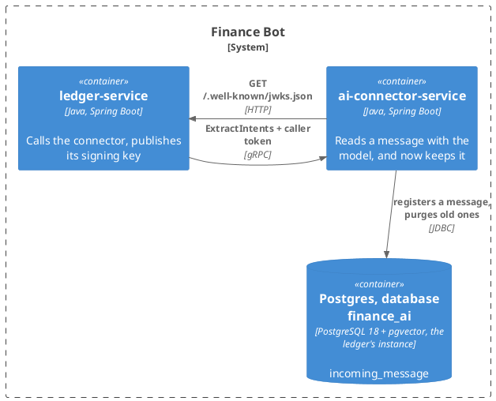
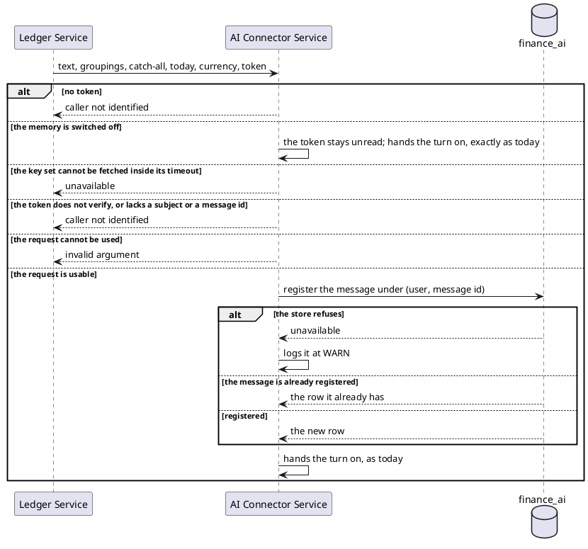

# Design: The Connector Registers the Message

**Affected Modules:** `ai-connector-service`

## Objective

Every message the connector reads is forgotten the moment the turn ends. This is the first of three tasks that
give the connector a memory of what a person wrote and what became of it:

| Task                                                                                                  | Ships                                                                 |
|-------------------------------------------------------------------------------------------------------|-----------------------------------------------------------------------|
| **31 — this one**                                                                                     | the connector verifies its caller token, keeps each message it is handed in a store of its own, and bounds how long |
| [32 — the connector learns what became of a message](../32-the-connector-learns-what-became-of-a-message/design.md) | it reads the ledger's change stream and records what was proposed, accepted, discarded and refiled |
| [33 — the model reads the connector's memory](../33-the-model-reads-the-connectors-memory/design.md) | it embeds each message and puts the closest earlier ones in front of the model as examples |

Nothing is user-visible until 33 lands. All three ship behind one flag, `MEMORY_ENABLED`, off by default in
tests and on in compose.

This task alone: the connector reads the caller token for the first time — the person and the message it names —
and stores the message text under those two keys. It also settles where that store lives.

## Context

| What exists                                                        | Where                                                                                                                                                                                                                       | What this change does with it                                                                                          |
|--------------------------------------------------------------------|-----------------------------------------------------------------------------------------------------------------------------------------------------------------------------------------------------------------------------|------------------------------------------------------------------------------------------------------------------------|
| The extraction use case, the feature this one extends              | [`extract-intents.md`](../../ai-connector-service/docs/usecases/extract-intents.md)                                                                                                                                         | Gains one step before the model is called: register the message                                                        |
| The caller token, held opaque for the turn                         | [`CallerTokenContext`](../../ai-connector-service/src/main/java/bot/finance/ai/adapter/grpc/CallerTokenContext.java)                                                                                                        | Read for the first time: its subject and its `imi` claim name the person and the message (D1)                          |
| What the ledger puts on that token                                 | [`AccessTokenMinter`](../../ledger-service/src/main/java/bot/finance/adapter/security/AccessTokenMinter.java)                                                                                                               | `sub` is the internal `user_id`, `imi` is the incoming message id — the two keys every ledger row and stream event carry |
| The ledger's published signing key                                 | [`JwksController`](../../ledger-service/src/main/java/bot/finance/adapter/security/JwksController.java)                                                                                                                     | What the connector verifies the token against, at `LEDGER_MCP_URL/.well-known/jwks.json` (D1)                          |
| What the ledger's own decoder checks on that token                 | [`SecurityConfiguration`](../../ledger-service/src/main/java/bot/finance/adapter/security/SecurityConfiguration.java), [`application.yaml`](../../ledger-service/src/main/resources/application.yaml)                    | Issuer `ledger-service`, audience `mcp-adapter`, expiry — what the connector checks too (F5)                           |
| The rule that the connector forwards the token unread              | [ADR 0009](../adr/0009-the-connector-does-not-authenticate-its-caller.md)                                                                                                                                                   | Superseded by the ADR this change writes (F4)                                                                          |
| How a turn is named                                                | [ADR 0015](../../ledger-service/docs/adr/0015-a-turn-is-named-by-the-message-that-started-it-not-by-a-value-minted-beside-it.md)                                                                                            | The id is derived, so a redelivered message registers once (F2); carrying it on the request is ruled out (F3)          |
| The ledger's Postgres, its slot and its bound                      | [Design 23](../implemented/23-broadcast-ledger-changes-to-redis/design.md)                                                                                                                                                  | The connector's database joins that instance (D2), and its writes count against that slot's retained log (F10)         |
| The module's stack, "the service holds no state"                   | [Orientation](../../ai-connector-service/docs/conventions/orientation.md), [`README.md`](../../ai-connector-service/README.md)                                                                                              | No longer true; both are corrected                                                                                     |
| The module's package structure and banned imports                  | [Architecture](../../ai-connector-service/docs/conventions/architecture.md)                                                                                                                                                 | Gains `adapter/persistence` and `adapter/security`; the banned list gains the data and security libraries               |
| The ledger's containerized Postgres for tests                      | `ledger-service/src/test/java/bot/finance/common/containers/`                                                                                                                                                                | Mirrored in the connector's `common/containers`, which holds only a stub server today                                   |
| The local runtime                                                  | [`docker-compose.yaml`](../../infrastructure/docker-compose.yaml)                                                                                                                                                           | Postgres moves to the pgvector image and gains a second database (D2, D3)                                              |
| The connector's configuration page                                 | [`configuration.md`](../../ai-connector-service/docs/configuration.md)                                                                                                                                                      | Gains the variables below                                                                                              |

## Proposed Solution

### What the change adds

| Surface                          | What it becomes                                                                                                   |
|----------------------------------|-------------------------------------------------------------------------------------------------------------------|
| `ExtractIntents`                 | The same contract. The token is now verified and read for `sub` and `imi` before the turn runs (D1)               |
| The connector's database         | New: `finance_ai`, on the ledger's Postgres instance (D2). One table, the messages received                        |
| `/actuator/health`               | Gains the database component the starter brings                                                                   |
| Configuration                    | A flag, a database, the token's issuer and audience, a retention bound and a purge interval                       |

**The turn does not depend on the store.** A refused registration is logged and swallowed; the message is still
read and its expenses still recorded (D4).

**A message is kept for `MEMORY_MAX_AGE`** and purged after it (D5). Task 33 reads no message older than that.

### Diagrams

The module takes the repository's [Diagram Format](../conventions/diagrams.md) unchanged. There is no component
diagram: classes belong to the plan.

#### Container — what this change reaches



The connector reaches the ledger twice: once for its tools, as today, and once for the key that lets it trust the
token it is handed. Both are on `LEDGER_MCP_URL`.

#### Flow — a turn, before the model is called

Everything after "hands the turn on" is the existing flow on
[`extract-intents.md`](../../ai-connector-service/docs/usecases/extract-intents.md), unchanged.



### Details

#### The token, read for the first time

| Claim | Becomes              | Refused when                                          |
|-------|----------------------|-------------------------------------------------------|
| `sub` | `user_id`, a `BIGINT`| absent, or not a number                               |
| `imi` | `incoming_message_id`| absent, or blank                                      |

The token is verified against the ledger's JWKS at `LEDGER_MCP_URL/.well-known/jwks.json` before either claim is
read (D1). Verified means what the ledger's own decoder means: the signature, the expiry, the issuer
`LEDGER_TOKEN_ISSUER` and the audience `LEDGER_TOKEN_AUDIENCE` (F5). A token that does not verify is refused the
way a missing one is today: `UNAUTHENTICATED`, before the provider is called. The key set is fetched on first use
and on refresh, bounded by `LEDGER_JWKS_TIMEOUT`, and cached; a fetch that fails or times out answers
`UNAVAILABLE` — the ledger the turn needs for its tools is unreachable — not `UNAUTHENTICATED` (F6).

The connector still authenticates no *service* — that deferral stands. What changes is that a token it cannot trust
no longer reaches the model, which reverses the half of ADR 0009 that says the token is forwarded unread. The ADR
this change writes supersedes it (F4).

With `MEMORY_ENABLED=false` the token is not read, and every call runs as today (F12).

#### The store

The connector gets a database of its own, `finance_ai`, on the ledger's Postgres instance (D2), migrated by
Flyway from `ai-connector-service/src/main/resources/db/migration/`. The instance runs the
`pgvector/pgvector:pg18` image — task 33 needs the extension, and the image is chosen once. One init script, run
by the image on a fresh volume, sets both services up the same way (D3): a role per service, each owning its own
database and nothing else — `finance_ledger` for the ledger, with `REPLICATION` as Design 23 requires, and
`finance_ai` for the connector, with the `vector` extension created inside it. The image's own
`POSTGRES_USER`/`POSTGRES_DB` are the bootstrap superuser and its default database, used by nothing else. Neither
service creates its own database or extension (F8, F9). One migration, `V001__create_incoming_message.sql`:

```sql
CREATE TABLE incoming_message (
    id                  BIGSERIAL    PRIMARY KEY,
    user_id             BIGINT       NOT NULL,
    incoming_message_id TEXT         NOT NULL,
    text                TEXT         NOT NULL,
    received_at         TIMESTAMPTZ  NOT NULL,
    CONSTRAINT uq_incoming_message_user_message UNIQUE (user_id, incoming_message_id)
);

CREATE INDEX idx_incoming_message_user_received ON incoming_message (user_id, received_at DESC);
CREATE INDEX idx_incoming_message_received      ON incoming_message (received_at);
```

| Column                | Holds                                                                        |
|-----------------------|------------------------------------------------------------------------------|
| `user_id`             | the token's subject — the same internal id every ledger row carries          |
| `incoming_message_id` | the token's `imi` — the same value `expense.incoming_message_id` carries     |
| `text`                | the request's `text`, verbatim                                               |
| `received_at`         | when the connector first saw it; the purge's cut (F16)                        |

**The store shares the ledger's write-ahead log.** A replication slot retains log cluster-wide, so every write
here is log the ledger's slot holds while its engine is behind, counting against the same
`max_slot_wal_keep_size` (F10). Nothing flows the other way: the slot decodes the ledger's database alone.

#### Registration

A message is registered as soon as the request is found usable, before the model is called.

| Rule                                                    | Consequence                                                                                 |
|---------------------------------------------------------|---------------------------------------------------------------------------------------------|
| The key is `(user_id, incoming_message_id)`             | A redelivered message registers once; the second turn finds the first row and reuses it (F2)|
| The text stored is the request's `text`, verbatim       | What is kept is what the person wrote, not what the model made of it                        |
| Registration precedes the model call                    | Anything the ledger later publishes about this message finds its row (task 32)               |
| A refused registration is logged at `WARN` and swallowed | The turn runs; this message is never remembered (D4)                                        |

#### Retention

A message older than `MEMORY_MAX_AGE` is deleted (D5). On a timer, `MEMORY_PURGE_INTERVAL`, the connector deletes
`incoming_message` rows received before `now() - MEMORY_MAX_AGE`, `MEMORY_PURGE_BATCH` at a time until none
remain. Task 32's rows hang off a message with `ON DELETE CASCADE`, so they leave with it.

| Rule                                          | Consequence                                                                          |
|-----------------------------------------------|--------------------------------------------------------------------------------------|
| the cut is `received_at`                      | a message decided on late still leaves with its birthday                             |
| the delete is batched                         | a first tick after a long run, or after `MEMORY_MAX_AGE` is lowered, is many short transactions on the ledger's instance, never one long one (F14) |
| several instances each run the purge          | a batch claims only rows no other purge holds, so two purges never wait on each other; each is idempotent and short |
| the store refuses the delete                  | logged at `WARN`; the next tick tries again, and nothing else is affected            |
| `MEMORY_MAX_AGE` is raised                    | what was already purged is gone; what is younger than the new bound stays            |
| `MEMORY_MAX_AGE` is lowered                   | the next tick removes everything now past it, batch by batch                          |

#### Configuration

| Variable                   | Sets                                              | Default                                      | Required         | Secret |
|----------------------------|---------------------------------------------------|----------------------------------------------|------------------|--------|
| `MEMORY_ENABLED`           | whether the memory runs at all                    | `true`                                       | no               | no     |
| `DB_JDBC_URL`              | the connector's own database                      | `jdbc:postgresql://localhost:5432/finance_ai`| when memory is on| no     |
| `DB_USER`, `DB_PASSWORD`   | its credentials                                   | *(none)*                                     | when memory is on| yes    |
| `LEDGER_TOKEN_ISSUER`      | the issuer a caller token must name               | `ledger-service`                             | no               | no     |
| `LEDGER_TOKEN_AUDIENCE`    | the audience a caller token must name             | `mcp-adapter`                                | no               | no     |
| `LEDGER_JWKS_TIMEOUT`      | how long a key-set fetch from the ledger may take  | `3s`                                         | no               | no     |
| `MEMORY_MAX_AGE`           | how long a message is kept                        | `365d`                                       | no               | no     |
| `MEMORY_PURGE_INTERVAL`    | how often messages past `MEMORY_MAX_AGE` are deleted | `1d`                                      | no               | no     |
| `MEMORY_PURGE_BATCH`       | how many messages one purge transaction deletes   | `1000`                                       | no               | no     |

`MEMORY_ENABLED=false` runs the connector as it runs today: no database, no purge, and a token still forwarded
unread. The flag conditions the datasource, the migration and the token reader off together, so none of the
`when memory is on` variables is read (F13). It is what a developer without the database runs against, and what
the existing tests keep running under (F12). Tasks 32 and 33 hang their own switches on the same flag.

#### Build, enforcement, infrastructure and documents

| Setting                                                       | Change                                                                                                                                                  |
|---------------------------------------------------------------|---------------------------------------------------------------------------------------------------------------------------------------------------------|
| `ai-connector-service/build.gradle`                           | `spring-boot-starter-data-jdbc`, `flyway-core` + `flyway-database-postgresql`, `postgresql`, `spring-security-oauth2-jose` — the decoder and validators the ledger's own token check uses, JWKS caching included; Testcontainers for Postgres |
| `CleanArchitectureTest`                                       | `org.springframework.data..`, `org.springframework.jdbc..`, `org.springframework.security..` and `com.nimbusds..` join the packages banned from `domain`/`application` |
| Architecture conventions                                      | `adapter/persistence` (the store) and `adapter/security` (the token reader) join the package list                                                       |
| `infrastructure/docker-compose.yaml`                          | `finance-postgres` moves to `pgvector/pgvector:pg18` and mounts `infrastructure/postgres/init/`; `POSTGRES_USER`/`POSTGRES_DB` become the bootstrap; the ledger's `DB_*` point at `finance_ledger` under its own role, the connector's at `finance_ai` under its own; the connector gains `depends_on: finance-postgres: condition: service_healthy` as the ledger has (D2, D3, F8, F9, F11, F15) |
| `infrastructure/postgres/init/create-databases.sh`            | New: from `FINANCE_BOT_LEDGER_DB_*` and `FINANCE_BOT_AI_DB_*`, creates the two roles (the ledger's with `REPLICATION`), the two databases each owned by its role, and `CREATE EXTENSION vector` in `finance_ai`; run by the image on a fresh volume only (D3, F9) |
| `.env` for compose                                            | Gains the two services' database names and credentials; the old `FINANCE_BOT_DB*` become the bootstrap's           |
| [Ledger configuration](../../ledger-service/docs/configuration.md) | The ledger's database moves to `finance_ledger` under its own role; an existing developer volume is wiped, since its data would otherwise be stranded in the old database (F15) |
| `common/containers/`                                          | `PostgresContainers` on the pgvector image, running `CREATE EXTENSION vector` as its init script since the compose script never reaches a test container; a JVM-wide singleton as the ledger's is |
| `application-test.yaml`                                       | `MEMORY_ENABLED` off, and the database health contributor off with it, so `ActuatorHealthSystemTest` still reads `UP` (F17); the memory tests switch it on with the container |
| `WireMockStubs`                                               | Gains the JWKS endpoint; `McpLedgerStubs` tokens are signed with a test key the JWKS stub publishes                                                     |
| [`extract-intents.md`](../../ai-connector-service/docs/usecases/extract-intents.md) | One new step, one new collaborator, two new outcomes                                                                            |
| `ai-connector-service/docs/contracts/out/`                    | A new page: the connector's database                                                                                                                    |
| [`ledger-mcp.md`](../../ai-connector-service/docs/contracts/out/ledger-mcp.md) | Gains the JWKS read, or a page of its own                                                                                              |
| [ADR 0009](../adr/0009-the-connector-does-not-authenticate-its-caller.md) | `Status: Superseded by` the new ADR (F4)                                                                                                |
| A new ADR, superseding 0009                                   | The connector verifies the caller token and reads two claims; it keeps a store of its own; the store never fails a turn |
| [Orientation](../../ai-connector-service/docs/conventions/orientation.md), [`README.md`](../../ai-connector-service/README.md) | "holds no state" is corrected                                                                        |
| [`configuration.md`](../../ai-connector-service/docs/configuration.md) | The table above                                                                                                                                |

## Acceptance Scenarios

### `ExtractIntents`

- **A1:** a message is registered
  - Given: no message registered under the token's `(sub, imi)`
  - When: the ledger calls with a valid token
  - Then: a row holds the text under those two keys, and the turn runs as today

- **A2:** the same message is delivered again
  - Given: a message already registered under `(user, imi)`
  - When: the ledger calls again with the same token claims
  - Then: no second row is stored, and the turn runs

- **A3:** the store is unavailable
  - Given: the connector's database refuses connections
  - When: the ledger calls
  - Then: the turn runs, the caller gets what it gets today, and a `WARN` names the message

- **A4:** the token does not verify
  - Given: a token signed by a key the ledger's JWKS does not publish, or one with no `sub` or `imi`
  - When: the ledger calls
  - Then: the call is refused as `UNAUTHENTICATED` before the provider is called, and nothing is stored

- **A5:** the ledger's key set cannot be fetched
  - Given: no cached key set, and a ledger that does not answer `/.well-known/jwks.json` inside `LEDGER_JWKS_TIMEOUT`
  - When: the ledger calls
  - Then: the call is refused as `UNAVAILABLE` within the timeout, before the provider is called

- **A6:** the memory is switched off
  - Given: `MEMORY_ENABLED=false`
  - When: the ledger calls with any token
  - Then: nothing is stored, no purge runs, and the turn runs exactly as before this change

### Retention

- **A7:** old messages are purged
  - Given: a message received longer ago than `MEMORY_MAX_AGE`, and a younger one
  - When: the purge runs
  - Then: the old message is gone, and the younger one is untouched

- **A8:** the store refuses the purge
  - Given: messages past `MEMORY_MAX_AGE`, and a database that refuses the delete
  - When: the purge runs
  - Then: a `WARN` is logged, turns are unaffected, and the next tick removes them

- **A9:** two instances purge at once
  - Given: more messages past `MEMORY_MAX_AGE` than one batch, and two connector instances
  - When: both purges run together
  - Then: every old message is gone once, and neither instance's turns are delayed

### Health

- **A10:** the store joins the health check
  - Given: `MEMORY_ENABLED=true` and the store reachable
  - When: `/actuator/health` is requested
  - Then: it answers `UP`, and its components carry `db` reading `UP`

## Decisions

- **D1:** How does the connector learn which person and which message a call is for?
  - Answer: It verifies the caller token against the ledger's JWKS — signature, expiry, issuer, audience — and
    reads `sub` and `imi`. A token that does not verify is refused `UNAUTHENTICATED`. The ADR this change writes
    supersedes ADR 0009.
  - Basis: decided — the user chose verifying over reading the claims unverified, which would have let whoever
    reaches the gRPC port register text under any person's id (F7). Carrying the two on the request is ruled out
    by ADR 0015 (F3) (user, 2026-08-15)

- **D2:** Where does the connector's Postgres live?
  - Answer: On the ledger's instance, as a second database `finance_ai`. The compose image becomes
    `pgvector/pgvector:pg18` (F8, F11).
  - Basis: decided — the user chose one instance with a second database over a container of the connector's own
    (user, 2026-08-15)

- **D3:** Are the two databases set up the same way?
  - Answer: Yes. One init script creates a role and a database per service; the image's `POSTGRES_USER`/`DB` are
    the bootstrap only. The ledger's role carries `REPLICATION`; the connector's gets the `vector` extension. An
    initialised developer volume is wiped (F8, F15).
  - Basis: decided — the user chose one container with symmetric per-service databases over the connector alone
    getting a scripted database beside the image-created ledger one (user, 2026-08-15)

- **D4:** Does a failure of the store fail the turn?
  - Answer: No. A refused registration is logged at `WARN`, the turn runs, and that message is never remembered.
  - Basis: decided — the user chose a turn that never depends on the memory over refusing it as unavailable
    (user, 2026-08-15)

- **D5:** How long is a message kept?
  - Answer: `MEMORY_MAX_AGE`, defaulting to `365d`; a purge every `MEMORY_PURGE_INTERVAL` deletes older ones,
    with everything task 32 hangs off them.
  - Basis: decided — the user chose a one-year bound over none, and deletion over merely never reading old rows
    (user, 2026-08-15)

## Design Findings

Grilled (2026-08-15): three passes over the undivided design this task was cut from — failure modes, concurrency,
data edges, compatibility, lifecycle, authorization, limits; contract compat found clear.

| #   | Question                                                        | Answer                                                                                                                | Evidence                                                                                                          |
|-----|-----------------------------------------------------------------|-----------------------------------------------------------------------------------------------------------------------|-------------------------------------------------------------------------------------------------------------------|
| F1  | Two connector instances registering one message?                | An upsert on the unique key; the second finds the first row                                                           | The migration above                                                                                               |
| F2  | The same message delivered twice?                               | Its id is derived, so it registers once and the second turn reuses the row                                            | [ADR 0015](../../ledger-service/docs/adr/0015-a-turn-is-named-by-the-message-that-started-it-not-by-a-value-minted-beside-it.md) |
| F3  | Could `sub` and `imi` ride the proto request instead?           | No — the id rides the token and no cross-service contract carries it                                                  | [ADR 0015](../../ledger-service/docs/adr/0015-a-turn-is-named-by-the-message-that-started-it-not-by-a-value-minted-beside-it.md), Consequences |
| F4  | May ADR 0009 take a dated consequence?                          | No — its decision is reversed, so the new ADR supersedes it                                                           | [ADR lifecycle](../conventions/adr.md)                                                                            |
| F5  | What does "verified" check beyond the signature?                | Expiry, issuer `ledger-service`, audience `mcp-adapter` — what the ledger's decoder checks                              | [`SecurityConfiguration`](../../ledger-service/src/main/java/bot/finance/adapter/security/SecurityConfiguration.java), [`application.yaml`](../../ledger-service/src/main/resources/application.yaml) |
| F6  | How long may the key-set fetch take?                            | `LEDGER_JWKS_TIMEOUT`; a failure answers `UNAVAILABLE`, since the ledger the turn needs is unreachable                  | [`SecurityConfiguration`](../../ledger-service/src/main/java/bot/finance/adapter/security/SecurityConfiguration.java), the same builder unbounded |
| F7  | An unverified token — what would the store become?              | Writable under any person's id by whoever reaches the port — D1's argument                                             | [ADR 0009](../adr/0009-the-connector-does-not-authenticate-its-caller.md), Consequences                            |
| F8  | Who creates the databases on an already initialized volume?     | Nobody automatically — the image runs init scripts on an empty volume only; a developer wipes the volume, and the configuration page says so | [`docker-compose.yaml`](../../infrastructure/docker-compose.yaml), the named volume                    |
| F9  | Which database account does each service use?                   | Its own role, owning its own database alone, created by the init script; the ledger's with `REPLICATION`, the connector's with the extension; the bootstrap superuser is used by neither (D3) | Design 23, "`DB_USER` needs the `REPLICATION` attribute" |
| F10 | Whose write-ahead log does the store write into?                | The ledger's cluster's: its slot retains the connector's writes while behind, against `max_slot_wal_keep_size`         | Design 23 F15 and D8; [`docker-compose.yaml`](../../infrastructure/docker-compose.yaml)                            |
| F11 | Does swapping the image keep the ledger's data?                 | Same major version on the same base image, so the data directory is reused; moot while D3 wipes the volume anyway     | [`docker-compose.yaml`](../../infrastructure/docker-compose.yaml)                                                 |
| F12 | Do the existing tests need a database?                          | No; `MEMORY_ENABLED=false` in the test profile keeps them as they are                                                 | Design 23's `application-test.yaml` precedent                                                                     |
| F13 | Can the service start with the memory off and no database?      | Yes — the flag conditions the datasource, migration and token reader off; the variables go unread                      | [Architecture](../../ai-connector-service/docs/conventions/architecture.md), `@ConditionalOnProperty` on the class |
| F14 | What does one purge tick delete?                                | Batches of `MEMORY_PURGE_BATCH` until none remain, never one unbounded delete                                          | The retention table above                                                                                         |
| F15 | A developer's existing ledger data when its database is renamed? | Stranded in the old database; the volume is wiped, and the ledger's configuration page says so                         | [`docker-compose.yaml`](../../infrastructure/docker-compose.yaml), the named volume |
| F16 | What serves the purge predicate?                                | `idx_incoming_message_received`                                                                                        | The migration above                                                                                               |
| F17 | The new starter and the existing health assertion?              | Its contributor is off in the test profile, as Design 23 did                                                           | Design 23 F17; `ActuatorHealthSystemTest`                                                                         |
| F18 | Does a non-superuser ledger role still run Design 23's pipeline? | It owns its tables and database, so `CREATE PUBLICATION`, the slot and its drop need only `REPLICATION` — deferred until compose is next brought up on a fresh volume, which is what settles it | Design 23; [`V009`](../../ledger-service/src/main/resources/db/migration/V009__publish_ledger_changes.sql) |
| F19 | A cold `docker compose up`?                                     | The connector waits on the healthy Postgres as the ledger does                                                         | [`docker-compose.yaml`](../../infrastructure/docker-compose.yaml), `ledger-service` block                    |
| F20 | Where does a person's memory go when they are deleted?          | Nowhere yet — nothing tells the connector a person is gone; deferred until the ledger deletes people. `MEMORY_MAX_AGE` bounds it meanwhile | Design 23 F70, `app_user` uncaptured |
| F21 | A non-positive `MEMORY_PURGE_BATCH` or `MEMORY_MAX_AGE`?         | Refused at startup — a batch of zero would delete nothing and retention would silently never run              | decided (user, 2026-08-15), raised by the plan review                                                            |
