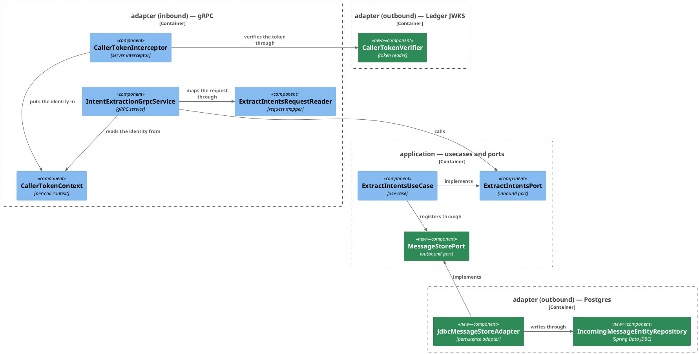
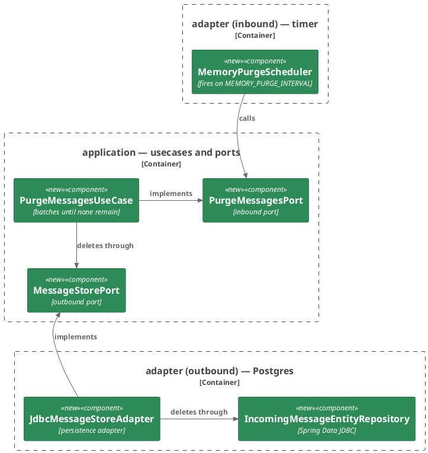

# Plan: The Connector Registers the Message

**Affected Modules:** `ai-connector-service`
**Design:** [The Connector Registers the Message](design.md)

## Components

The design named responsibilities; these are the classes that hold them. Two subjects, two diagrams: a turn,
from the token to the stored row, and the purge that bounds the store.

### A turn — the token read, the message registered



### Retention — the purge on its timer



### What a box cannot carry

| Type                                | Package               | Holds                                                                                          | Refuses                                                                                                        |
|-------------------------------------|-----------------------|------------------------------------------------------------------------------------------------|----------------------------------------------------------------------------------------------------------------|
| `MessageIdentity`                   | `domain/value`        | `long userId`, `String incomingMessageId`                                                      | a null or blank `incomingMessageId`; `of(String subject, String incomingMessageId)` refuses a null, blank or non-numeric subject as `InvalidValueException`, and never lets a `NumberFormatException` out |
| `ExtractIntentsCommand`             | `application/dto`     | gains `Optional<MessageIdentity> messageIdentity`, last                                         | a null `Optional`, as `InvalidValueException` — the same rule `defaultCurrency` follows                          |
| `MemoryProperties`                  | `adapter/scheduling`  | `enabled`, `maxAge`, `purgeInterval`, `purgeBatch`, bound to `memory.*`                        | —                                                                                                              |
| `CallerTokenProperties`             | `adapter/security`    | `issuer`, `audience`, `jwksUri`, `jwksTimeout`, bound to `ledger.token.*`                      | —                                                                                                              |
| `IncomingMessageEntity`             | `adapter/persistence` | the row of `incoming_message`: `id`, `userId`, `incomingMessageId`, `text`, `receivedAt`       | —                                                                                                              |

| Port                | Methods                                                                                                          |
|---------------------|------------------------------------------------------------------------------------------------------------------|
| `MessageStorePort`  | `void register(MessageIdentity identity, String text)` — idempotent on `(userId, incomingMessageId)`; `int deleteReceivedBefore(Instant cut, int batch)` — answers how many rows one batch removed |
| `PurgeMessagesPort` | `void purge()` — deletes every message received before now − `maxAge`, `batch` rows a time until a batch removes none; a store failure is logged at `WARN` and swallowed. `PurgeMessagesUseCase` takes the store, a `Clock`, `maxAge`, `batch` and a `LoggerFactory` in its constructor, and refuses a non-positive `maxAge` or `batch` as `InvalidValueException` (design F21) |

| Exception                                | Package            | Raised by                                                                | Becomes                                              |
|------------------------------------------|--------------------|--------------------------------------------------------------------------|------------------------------------------------------|
| `CallerNotIdentifiedException`           | `domain/exception` | a token that does not verify, or lacks a usable `sub` or `imi`           | `UNAUTHENTICATED`, closed by `CallerTokenInterceptor` |
| `CallerVerificationUnavailableException` | `domain/exception` | a key set that cannot be fetched inside `LEDGER_JWKS_TIMEOUT`            | `UNAVAILABLE`, closed by `CallerTokenInterceptor`     |
| `MessageStoreFailedException`            | `domain/exception` | any store failure behind `MessageStorePort`, the framework's cause kept  | swallowed at `WARN` by both use cases                 |

Classes drawn in neither diagram, because they front no call path of their own:

| Class                     | Package               | Holds                                                                                                                                                  |
|---------------------------|-----------------------|--------------------------------------------------------------------------------------------------------------------------------------------------------|
| `MemoryConfiguration`     | `adapter/scheduling`  | `@ConditionalOnProperty(memory.enabled)`; enables `MemoryProperties`; a `Clock` bean and a single-thread `ScheduledExecutorService` bean for the scheduler |
| `CallerTokenConfiguration`| `adapter/security`    | `@ConditionalOnProperty(memory.enabled)`; enables `CallerTokenProperties`; the `JwtDecoder` bean — JWKS at `jwksUri`, connect and read bounded by `jwksTimeout`, validators for expiry, issuer and audience |
| `NoMessageStoreAdapter`   | `adapter/persistence` | `@ConditionalOnProperty(memory.enabled, havingValue = false)`; implements `MessageStorePort` as no-ops, so the use case is wired the same way whether the memory is on or off |

The interceptor takes `Optional<CallerTokenVerifier>`. With the memory off the bean does not exist and the token
stays unread; on, every `IntentExtractionService` call is verified before the request is looked at.

## Step-by-Step Implementation Map (To-Do List)

### Stabilization

#### Database

- [x] ST01 · Add migration `ai-connector-service/src/main/resources/db/migration/V001__create_incoming_message.sql`,
  exactly as the design's **The store** section states:
  ```sql
  CREATE TABLE incoming_message (
      id                  BIGSERIAL    PRIMARY KEY,
      user_id             BIGINT       NOT NULL,
      incoming_message_id TEXT         NOT NULL,
      text                TEXT         NOT NULL,
      received_at         TIMESTAMPTZ  NOT NULL,
      CONSTRAINT uq_incoming_message_user_message UNIQUE (user_id, incoming_message_id)
  );

  CREATE INDEX idx_incoming_message_user_received ON incoming_message (user_id, received_at DESC);
  CREATE INDEX idx_incoming_message_received      ON incoming_message (received_at);
  ```

#### Interface-First / Build Stabilization

New-method stubs carry a short inline comment describing the implementation intent, and no comment anywhere cites
a step id — `CommentConventionsTest` fails the run on one.

**Interface & Signature Sync**

- [x] ST02 · Add to `ai-connector-service/build.gradle`: `org.springframework.boot:spring-boot-starter-data-jdbc`,
  `org.springframework.boot:spring-boot-starter-flyway`, `org.flywaydb:flyway-database-postgresql`,
  `org.postgresql:postgresql`, `org.springframework.security:spring-security-oauth2-jose`; for tests
  `org.springframework.boot:spring-boot-starter-data-jdbc-test`,
  `org.springframework.boot:spring-boot-starter-flyway-test`, `org.springframework.boot:spring-boot-testcontainers`,
  `org.testcontainers:testcontainers-junit-jupiter`, `org.testcontainers:testcontainers-postgresql`. Every version
  is managed by the Boot BOM, as `ledger-service/build.gradle` declares the same set. Confirm the module compiles.

- [x] ST03 · Add `domain/value/MessageIdentity(long userId, String incomingMessageId)`, with the compact
  constructor left to validate nothing yet, and stub the factory:
  ```java
  public static MessageIdentity of(String subject, String incomingMessageId) {
      // parses the token's subject as the internal user id and pairs it with the incoming message id,
      // refusing a blank or non-numeric subject and a blank message id as InvalidValueException
      return null;
  }
  ```

- [x] ST04 · Add `Optional<MessageIdentity> messageIdentity` as the last component of `ExtractIntentsCommand`. Keep
  every existing check, add a `TODO` at the insertion point for the null-`Optional` refusal, and pass
  `Optional.empty()` at every constructor call in `ExtractIntentsCommandTest` and in `ExtractIntentsUseCaseTest`'s
  two `command(...)` helpers until the test tree compiles. No assertion changes.

- [x] ST16 · Create `adapter/scheduling` with its `package-info.java`, and in it: `MemoryProperties`,
  `MemoryConfiguration` (as the Components table states), and a stub `MemoryPurgeScheduler` — `@Component`,
  `@ConditionalOnProperty(name = "memory.enabled", havingValue = "true")`, a constructor taking
  `PurgeMessagesPort`, `MemoryProperties`, the executor bean and `LoggerFactory`, and:
  ```java
  public void run() {
      // calls the purge port once, inside a guard that logs any RuntimeException at ERROR so the timer never dies
  }
  ```
  GS02 wires the rest: `SmartLifecycle` over the executor in the shape `ledger-service`'s `ReplicationSlotMonitor`
  has — `start()` schedules `run()` at a fixed delay of `purgeInterval` with no initial delay, `stop()` cancels
  it — and the `ERROR` guard. Numbered ST16 because it was added on review; it is listed here, ahead of the steps
  that consume its properties and clock.

- [x] ST05 · Add `application/port/MessageStorePort` and `application/port/PurgeMessagesPort` with the methods the
  Components table names, stub `application/usecase/PurgeMessagesUseCase` (constructor: `MessageStorePort`,
  `Clock`, `Duration maxAge`, `int batch`, `LoggerFactory`):
  ```java
  public void purge() {
      // deletes rows received before clock.now() - maxAge in batches of `batch` until a batch deletes none,
      // logging a store failure at WARN and leaving the next run to try again
  }
  ```
  and the three exceptions in `domain/exception`: `CallerNotIdentifiedException`, `CallerVerificationUnavailableException`,
  `MessageStoreFailedException`, each in the shape `ExpenseRecordingFailedException` has — a message, and a
  cause where there is one.

- [x] ST06 · Give `ExtractIntentsUseCase` a `MessageStorePort` constructor parameter, keep its body as it is, and add
  a `TODO` before the `record(...)` call for the registration step. Pass the port from
  `UseCaseConfiguration.extractIntentsPort(...)`, and mock it in `ExtractIntentsUseCaseTest.setUp()` so the class
  compiles. Declare the second use case there too — `@Bean @ConditionalOnProperty(name = "memory.enabled",
  havingValue = "true") PurgeMessagesPort purgeMessagesPort(MessageStorePort, MemoryProperties, Clock, LoggerFactory)`
  — built from ST16's properties and clock, so with the memory off no purge exists.

- [x] ST07 · Create `adapter/persistence` with its `package-info.java`, and in it:
  `IncomingMessageEntity` (`@Table("incoming_message")`, `@Id Long id`),
  `IncomingMessageEntityRepository extends CrudRepository<IncomingMessageEntity, Long>` carrying two
  `@Modifying @Query` methods —
  ```sql
  INSERT INTO incoming_message (user_id, incoming_message_id, text, received_at)
  VALUES (:userId, :incomingMessageId, :text, now())
  ON CONFLICT (user_id, incoming_message_id) DO NOTHING
  ```
  answering the rows inserted, and
  ```sql
  DELETE FROM incoming_message
  WHERE id IN (
      SELECT id FROM incoming_message
      WHERE received_at < :cut
      ORDER BY received_at
      LIMIT :batch
      FOR UPDATE SKIP LOCKED)
  ```
  answering the rows deleted — then `NoMessageStoreAdapter` complete, and stubs for `JdbcMessageStoreAdapter`
  (`@Component`, `@ConditionalOnProperty(name = "memory.enabled", havingValue = "true")`):
  ```java
  public void register(MessageIdentity identity, String text) {
      // inserts the row under (user_id, incoming_message_id), leaving an existing row untouched, and
      // translates any store failure into MessageStoreFailedException
  }

  public int deleteReceivedBefore(Instant cut, int batch) {
      // deletes one batch of rows received before the cut, claiming only rows no other purge holds,
      // and translates any store failure into MessageStoreFailedException
      return 0;
  }
  ```

- [x] ST08 · Create `adapter/security` with its `package-info.java`, and in it: `CallerTokenProperties`,
  `CallerTokenConfiguration` (the `JwtDecoder` bean of the Components table — `NimbusJwtDecoder.withJwkSetUri`,
  a `RestOperations` whose connect and read timeouts are `jwksTimeout`, and a `DelegatingOAuth2TokenValidator` of
  `JwtTimestampValidator`, `JwtIssuerValidator` and `JwtAudienceValidator`, mirroring
  `ledger-service`'s `SecurityConfiguration.validator(...)` without its ttl bound), and the stub
  `CallerTokenVerifier` (`@Component`, `@ConditionalOnProperty(name = "memory.enabled", havingValue = "true")`,
  taking the `JwtDecoder`):
  ```java
  public MessageIdentity verify(String authorization) {
      // strips the Bearer scheme, decodes and validates the token, and reads sub and imi into a MessageIdentity;
      // a token that does not verify or lacks either claim is CallerNotIdentifiedException, a key set that
      // cannot be fetched is CallerVerificationUnavailableException
      return null;
  }
  ```

- [x] ST09 · Give `CallerTokenContext` a second key, `MESSAGE_IDENTITY`, and `messageIdentity(): Optional<MessageIdentity>`.
  Give `CallerTokenInterceptor` an `Optional<CallerTokenVerifier>` constructor parameter, keep its refusal of a
  missing header as it is, and add a `TODO` where the verification goes. Change
  `ExtractIntentsRequestReader.toCommand(ExtractIntentsRequest, Optional<MessageIdentity>)` to place the identity
  on the command, and have `IntentExtractionGrpcService` pass `Optional.empty()` for now with a `TODO` naming
  the context read. Build green.

- [x] ST10 · Add `org.springframework.data..`, `org.springframework.jdbc..`, `org.springframework.security..`,
  `com.nimbusds..` and `org.flywaydb..` to `CleanArchitectureTest.domainAndApplicationStayFrameworkAgnostic`,
  and `Jdbc`, `Jwt` and `Jwks` to `coreTypesCarryNoExternalSystemName`. Confirm the class passes.

**Configuration**

- [x] ST11 · In `application.yaml`: `spring.datasource.url: ${DB_JDBC_URL:jdbc:postgresql://localhost:5432/finance_ai}`,
  `spring.datasource.username: ${DB_USER:}`, `spring.datasource.password: ${DB_PASSWORD:}`,
  `spring.data.jdbc.dialect: postgresql` (so no connection is opened to discover it),
  `spring.flyway.enabled: ${memory.enabled}`, `management.health.db.enabled: ${memory.enabled}`; a `memory:` root
  with `enabled: ${MEMORY_ENABLED:true}`, `max-age: ${MEMORY_MAX_AGE:365d}`,
  `purge-interval: ${MEMORY_PURGE_INTERVAL:1d}`, `purge-batch: ${MEMORY_PURGE_BATCH:1000}`; a `ledger.token:`
  root with `issuer: ${LEDGER_TOKEN_ISSUER:ledger-service}`, `audience: ${LEDGER_TOKEN_AUDIENCE:mcp-adapter}`,
  `jwks-timeout: ${LEDGER_JWKS_TIMEOUT:3s}`, and
  `jwks-uri: ${spring.ai.mcp.client.streamable-http.connections.ledger.url}/.well-known/jwks.json`, so a test
  that redirects the ledger's URL redirects the key set with it. In `application-test.yaml`: `memory.enabled: false`
  — Flyway and the database health contributor follow it off.

  With the memory off the datasource bean is declared and never opened: nothing migrates, nothing checks health,
  and no adapter of this plan exists to touch it (Q1).

- [x] ST12 · In `infrastructure/docker-compose.yaml`: `finance-postgres` moves to `pgvector/pgvector:pg18`, keeps
  its command, mounts `./postgres/init:/docker-entrypoint-initdb.d:ro`, and takes
  `FINANCE_BOT_LEDGER_DB`, `FINANCE_BOT_LEDGER_DB_USER`, `FINANCE_BOT_LEDGER_DB_PASSWORD`, `FINANCE_BOT_AI_DB`,
  `FINANCE_BOT_AI_DB_USER`, `FINANCE_BOT_AI_DB_PASSWORD` in its environment beside the bootstrap's
  `POSTGRES_USER`/`POSTGRES_PASSWORD`/`POSTGRES_DB`; `ledger-service`'s `DB_*` point at `finance_ledger` under the
  ledger's role; `ai-connector-service` gains `DB_JDBC_URL: jdbc:postgresql://finance-postgres:5432/${FINANCE_BOT_AI_DB}`,
  `DB_USER`, `DB_PASSWORD` and `depends_on: finance-postgres: condition: service_healthy`. Add
  `infrastructure/postgres/init/create-databases.sh`, run by the image on a fresh volume only: from those six
  variables it creates the two roles (the ledger's `WITH REPLICATION`), the two databases each `OWNER` its role,
  and `CREATE EXTENSION vector` inside `finance_ai`. Add the six variables to `infrastructure/.env.example` and to
  the local `infrastructure/.env` (keeping its existing values), and rename its old `FINANCE_BOT_DB*` to the
  bootstrap's meaning.

**Shared Test Infrastructure**

- [x] ST13 · Add `common/containers/PostgresContainers` — a JVM-wide `PostgreSQLContainer` singleton in the shape
  `ledger-service`'s has, on `pgvector/pgvector:pg18` declared `asCompatibleSubstituteFor("postgres")`,
  `@ServiceConnection`, with an init script `src/test/resources/db/init/create-extension.sql` running
  `CREATE EXTENSION IF NOT EXISTS vector`. Add the composed annotations in `common/boot`:
  `@PersistenceAdapterTest` (`@DataJdbcTest`, `@AutoConfigureTestDatabase(replace = NONE)`, the test profile,
  `memory.enabled=true`, `@Testcontainers(disabledWithoutDocker = true)`, `@ImportTestcontainers(PostgresContainers.class)`;
  a test class adds `@Import(<AdapterUnderTest>.class)`), `@SecurityAdapterTest` (`@SpringBootTest` on
  `CallerTokenConfiguration`, `CallerTokenVerifier` and `Slf4jLoggerFactory`, the test profile,
  `memory.enabled=true`, and the WireMock URL registrar — extracted from `AiAdapterTest` into a top-level
  `common/boot/WireMockUrlConfiguration` that `AiAdapterTest` imports too), and `AbstractMemorySystemTest extends
  AbstractSystemTest` (`memory.enabled=true`, `memory.purge-interval=1s`, `@Testcontainers(disabledWithoutDocker = true)`,
  `@ImportTestcontainers(PostgresContainers.class)`, publishing the test key set at each test's start and
  truncating `incoming_message` after each). Ship the throwaway boot test the conventions require of each of the
  three, and note that every container-backed class skips when Docker is down — the coverage guardrail therefore
  needs Docker up.

- [x] ST14 · Add `common/fixtures/CallerTokens` — a JVM-wide RSA key pair with a `kid`, its public JWK set as JSON,
  and minting in `Bearer` form: `bearer(long userId, String incomingMessageId)` with the test profile's issuer
  and audience and a short expiry ahead; and one variant each for a token signed by a second key the set never
  publishes, an expired one, a wrong issuer, a wrong audience, no `sub`, a non-numeric `sub`, no `imi`, and a blank
  `imi`. Add `common/stubs/LedgerJwksStubs` — `stubKeySet()` serving `CallerTokens`' JWK set at
  `/.well-known/jwks.json`, `stubKeySetUnreachable()` (a connection fault) and `stubKeySetDelayed(Duration)`,
  registered through `WireMockSupport.SERVER`. Add `common/rows/IncomingMessageRowUtils` — static helpers over a
  `JdbcTemplate`: insert a row with a given `received_at`, count rows under `(userId, incomingMessageId)`, read a
  row's text, delete all.

- [x] ST15 · Confirm `CleanArchitectureTest`, `CommentConventionsTest` and `DisplayNameConventionsTest` pass, and
  that the pre-existing suite — which runs with the memory off and no database — is still green. A context that
  fails to boot because something in the JDBC machinery opens a connection with the memory off is a blocker back
  to this plan and Q1, not something to work around in a step.

### Red Phase

#### TDD Unit Red Phase

- [ ] RU01 · `MessageIdentity` · test: `MessageIdentityTest` · covers: `of()`, the compact constructor · scenarios: A4
    - `of()`:
        - given: a subject that is a positive decimal number and a non-blank message id
          when: of() is called
          then: the identity carries that number as its userId and the id unchanged
        - given: a subject that is null, blank, not a number, or digits that overflow `long`
          when: of() is called
          then: InvalidValueException is thrown for each, never NumberFormatException
        - given: a message id that is null or blank
          when: of() is called
          then: InvalidValueException is thrown
    - the compact constructor:
        - given: a null or blank incomingMessageId
          when: the record is constructed
          then: InvalidValueException is thrown, never NullPointerException

- [ ] RU02 · `ExtractIntentsCommand` · test: `ExtractIntentsCommandTest` · covers: the compact constructor ·
  scenarios: A1, A6
    - the compact constructor:
        - given: a present message identity
          when: the record is constructed
          then: messageIdentity() reads it back unchanged
        - given: an empty message identity
          when: the record is constructed
          then: the command is valid and messageIdentity() is empty
        - given: a null messageIdentity Optional
          when: the record is constructed
          then: InvalidValueException is thrown

- [ ] RU03 · `ExtractIntentsUseCase` · test: `ExtractIntentsUseCaseTest` · covers: `extractIntents()` · scenarios:
  A1, A3, A6
    - `extractIntents()`:
        - given: a command carrying a message identity
          when: extractIntents() is called
          then: the store's register() receives that identity and the command's text, and it is called before the
          expense-recording port
        - given: a command carrying no message identity
          when: extractIntents() is called
          then: the store is never touched and the expense-recording port is called as before
        - given: a store whose register() throws MessageStoreFailedException
          when: extractIntents() is called
          then: one WARN line is logged naming the user id and the message id and carrying nothing from the text,
          the expense-recording port is still called, and nothing propagates
        - given: a store whose register() throws MessageStoreFailedException
          when: extractIntents() is called
          then: the INFO line the turn already logs is still logged once

- [ ] RU04 · `PurgeMessagesUseCase` · test: `PurgeMessagesUseCaseTest` · covers: the constructor, `purge()` ·
  scenarios: A7, A8
    - the constructor:
        - given: a `maxAge` that is zero or negative, or a `batch` that is zero or negative
          when: the use case is constructed
          then: InvalidValueException is thrown for each
    - `purge()`:
        - given: a fixed clock, a max age and a batch size, and a store answering the batch size, the batch size,
          then fewer, then zero
          when: purge() is called
          then: every deleteReceivedBefore() call carries the cut clock − maxAge and the batch size, and the calls
          stop once a batch answers zero
        - given: a store answering zero at once
          when: purge() is called
          then: exactly one delete is asked for
        - given: a store that throws MessageStoreFailedException
          when: purge() is called
          then: one WARN line is logged, nothing propagates, and a following purge() against a store that answers
          normally deletes again

#### TDD Integration Red Phase

- [ ] RI01 · `JdbcMessageStoreAdapter` · test: `JdbcMessageStoreAdapterTest` · covers: `register()`,
  `deleteReceivedBefore()` · scenarios: A1, A2, A3, A7, A8, A9
    - `register()`:
        - given: no row under the identity
          when: register() is called with a text
          then: one row holds that text under (user_id, incoming_message_id) with a received_at set
        - given: a row already under the identity
          when: register() is called again with a different text
          then: there is still one row and it keeps the first text
        - given: two users sending the same incoming message id
          when: register() is called for each
          then: two rows exist, one per user
    - `deleteReceivedBefore()`:
        - given: rows received before the cut and rows received after it
          when: deleteReceivedBefore() is called with a batch larger than the old rows
          then: it answers the old count, the old rows are gone and the young ones are untouched
        - given: more rows before the cut than one batch
          when: deleteReceivedBefore() is called once
          then: it answers exactly the batch size and that many rows are gone
        - given: more rows before the cut than one batch, written and committed rather than left in the test's
          transaction, and two threads each calling deleteReceivedBefore() in a loop until it answers zero
          when: both loops run at once
          then: every old row is gone exactly once, the two counts sum to the old total, and both loops finish
          within a bound far below any lock wait
    - against a mocked repository, the way `UserRepositoryAdapterTest` in `ledger-service` reaches a store the
      container cannot be made into:
        - given: a repository whose insert throws a DataAccessException
          when: register() is called
          then: MessageStoreFailedException is thrown wrapping it
        - given: a repository whose delete throws a DataAccessException
          when: deleteReceivedBefore() is called
          then: MessageStoreFailedException is thrown wrapping it

- [ ] RI02 · `CallerTokenVerifier` · test: `CallerTokenVerifierTest` · covers: `verify()` · scenarios: A4, A5
    - `verify()`:
        - given: the key set published and a token minted for a user and a message
          when: verify() is called with its Bearer value
          then: the identity carries that user id and message id
        - given: a token signed by a key the published set does not carry
          when: verify() is called
          then: CallerNotIdentifiedException is thrown
        - given: an expired token, one naming another issuer, and one naming another audience
          when: verify() is called with each
          then: CallerNotIdentifiedException is thrown for each
        - given: a validly signed token with no `sub`, a non-numeric `sub`, no `imi`, or a blank `imi`
          when: verify() is called with each
          then: CallerNotIdentifiedException is thrown for each
        - given: a header value that is not `Bearer` followed by a token, or one whose token is not a JWT
          when: verify() is called
          then: CallerNotIdentifiedException is thrown
        - given: no key set fetched yet and a ledger whose key-set endpoint fails the connection
          when: verify() is called with a valid token
          then: CallerVerificationUnavailableException is thrown
        - given: no key set fetched yet and a ledger whose key-set endpoint answers slower than `jwksTimeout`
          when: verify() is called with a valid token
          then: CallerVerificationUnavailableException is thrown, and verify() returns within the timeout plus a
          small margin
        - given: a token already verified against the published set, and the endpoint then made unreachable
          when: verify() is called with a second token under the same key
          then: the identity is answered from the cached key set

- [ ] RI03 · `CallerTokenInterceptor` · test: `CallerTokenInterceptorTest` · covers: `IntentExtractionService/ExtractIntents` ·
  mocks: `ExtractIntentsPort`, `CallerTokenVerifier` · scenarios: A4, A5, A6
    - Happy Path:
        - given: a nested group carrying a `@MockitoBean CallerTokenVerifier` that answers an identity, and a stub
          carrying an authorization header
          when: the RPC is called
          then: the verifier is asked with that header's value, the port is called, and inside the call
          `CallerTokenContext.messageIdentity()` holds that identity beside the token
        - given: the memory off, as the test profile leaves it, and a stub carrying a token that would not verify
          when: the RPC is called
          then: the port is called and `CallerTokenContext.messageIdentity()` is empty inside the call
    - Error Mapping:
        - given: the mocked verifier throws CallerNotIdentifiedException
          when: the RPC is called
          then: it fails with UNAUTHENTICATED and the port is never called
        - given: the mocked verifier throws CallerVerificationUnavailableException
          when: the RPC is called
          then: it fails with UNAVAILABLE and the port is never called
        - update: `whenHealthServiceCheckedWithNoAuthorizationHeader_thenSucceeds()` — move it under the group
          holding the `@MockitoBean CallerTokenVerifier` and assert the verifier is never called, so the
          refusal's scope is proven with a verifier present rather than absent
    - Validation: none — the header's presence is already covered by the class's existing tests

- [ ] RI04 · `IntentExtractionGrpcService` · test: `IntentExtractionGrpcServiceTest` · covers:
  `IntentExtractionService/ExtractIntents` · mocks: `ExtractIntentsPort`, `CallerTokenVerifier` · scenarios: A1, A6
    - Happy Path:
        - given: a nested group carrying a `@MockitoBean CallerTokenVerifier` that answers an identity
          when: a valid request is made under any authorization header
          then: the command the port receives carries that identity
        - given: the memory off, as the test profile leaves it
          when: a valid request is made under an opaque token
          then: the command the port receives carries no identity, and the port is called as before
    - Error Mapping: none new — the statuses the token earns are RI03's
    - Validation: none new — the request's matrix is unchanged

#### TDD System Test Red Phase

- [ ] RS01 · `RegisterMessageSystemTest` · covers: `IntentExtractionService/ExtractIntents` · scenarios: A1, A2, A4
    - Happy Path:
        - given: the memory on, the key set published, a provider stubbed to record one expense, and no row under
          the token's identity
          when: the RPC is called with a token minted for that user and message
          then: it answers empty, the ledger receives the tool call under that token, and one row holds the
          request's text under (user_id, incoming_message_id)
        - given: the same, called once already
          when: the RPC is called again with a token carrying the same claims
          then: it answers empty again and there is still one row
    - Unhappy Path:
        - given: a token signed by a key the ledger's set does not publish
          when: the RPC is called
          then: it fails with UNAUTHENTICATED, the provider is never called, and no row is stored

- [ ] RS02 · `PurgeMessagesSystemTest` · covers: `MemoryPurgeScheduler.run()` · scenarios: A7
    - Happy Path:
        - given: the memory on with its purge interval at one second, a row received longer ago than the max age
          and a row received now, both inserted through `IncomingMessageRowUtils`
          when: the timer fires
          then: within a few intervals the old row is gone and the young row is still there
    - Unhappy Path: none reachable — A8's refused delete is RU04's WARN scenario and RI01's translation scenario;
      a store the context booted against cannot be made to refuse mid-run

- [ ] RS03 · `MemoryHealthSystemTest` · covers: `GET /actuator/health` · scenarios: A10
    - Happy Path:
        - given: the memory on and the container reachable
          when: the endpoint is requested
          then: it answers 200, `status` reads `UP`, and the components carry `db` reading `UP`
    - Unhappy Path: none reachable — a store that refuses cannot boot the context this class runs in; the
      test-profile default with the memory off is `ActuatorHealthSystemTest`'s and is unchanged

### Green Phase

#### TDD Unit Green Phase

- [ ] GU01 · `MessageIdentity` · test: `MessageIdentityTest`
- [ ] GU02 · `ExtractIntentsCommand` · test: `ExtractIntentsCommandTest` · after: GU01
- [ ] GU03 · `ExtractIntentsUseCase` · test: `ExtractIntentsUseCaseTest` · after: GU01, GU02
- [ ] GU04 · `PurgeMessagesUseCase` · test: `PurgeMessagesUseCaseTest`

#### TDD Integration Green Phase

- [ ] GI01 · `JdbcMessageStoreAdapter` · test: `JdbcMessageStoreAdapterTest` · after: GU01
- [ ] GI02 · `CallerTokenVerifier` · test: `CallerTokenVerifierTest` · after: GU01
- [ ] GI03 · `CallerTokenInterceptor` · test: `CallerTokenInterceptorTest` · covers: `IntentExtractionService/ExtractIntents` ·
  mocks: `ExtractIntentsPort`, `CallerTokenVerifier` · after: GU01
- [ ] GI04 · `IntentExtractionGrpcService` · test: `IntentExtractionGrpcServiceTest` · covers:
  `IntentExtractionService/ExtractIntents` · mocks: `ExtractIntentsPort`, `CallerTokenVerifier` · after: GU01, GU02, GI03

`NoMessageStoreAdapter` has no green step: ST07 writes it whole, and it carries no logic.

#### TDD System Test Green Phase

- [ ] GS01 · `RegisterMessageSystemTest` · covers: `IntentExtractionService/ExtractIntents`
- [ ] GS02 · `PurgeMessagesSystemTest` · covers: `MemoryPurgeScheduler.run()`
- [ ] GS03 · `MemoryHealthSystemTest` · covers: `GET /actuator/health`

### Post-Implementation Steps

#### Documentation

These are the pages `archive-knowledge` does not write; the use-case page, the new `contracts/out/` page for the
database and the key-set read on the ledger's page are its output and are not listed here.

- [ ] P01 · Correct [Orientation](../../ai-connector-service/docs/conventions/orientation.md): the stack row
  "none of any: the service holds no state" names Postgres, and the consumed services gain the ledger's key set.
- [ ] P02 · Correct [`README.md`](../../ai-connector-service/README.md): "It holds no state" is no longer true.
- [ ] P03 · Correct [Architecture](../../ai-connector-service/docs/conventions/architecture.md): the adapter
  subpackages gain `persistence`, `security` and `scheduling` (a timer that fires an inbound port, fronting no
  external system — beside `config` and `logging`), the banned-import list gains the packages ST10 added, and
  the name list gains its three. State that `memory.*` binds in `adapter/scheduling` and is read from
  `adapter/config` to build the purge use case, and that `memory.enabled` gates `persistence`, `security` and
  `scheduling` alike.
- [ ] P04 · Correct [Testing](../../ai-connector-service/docs/conventions/testing.md): **Test Layers** maps
  `adapter/persistence/` to the outbound integration type via `@PersistenceAdapterTest` and `adapter/security/`
  via `@SecurityAdapterTest`, and `adapter/scheduling/` to the system type alone, its one class carrying no
  logic (Q3); **Package Structure** lists
  `PostgresContainers`, `PersistenceAdapterTest`, `SecurityAdapterTest`, `AbstractMemorySystemTest`,
  `WireMockUrlConfiguration`, `LedgerJwksStubs`, `CallerTokens` and the new `rows/IncomingMessageRowUtils`.
  Correct [Build](../../ai-connector-service/docs/conventions/build.md): **Test Isolation** now names the
  containerized database beside the stub server, and that a run without Docker skips those classes.
- [ ] P05 · Correct [Configuration](../../ai-connector-service/docs/configuration.md): the design's variable table,
  and a note that `MEMORY_ENABLED=false` runs the service with no database and the token forwarded unread.
- [ ] P06 · Correct [the ledger's Configuration](../../ledger-service/docs/configuration.md): its database is
  `finance_ledger` under its own role on the shared instance, created by the compose init script on a fresh volume,
  and an initialized developer volume is wiped (F8, F15).

#### ADRs

- [ ] P07 · Write ADR: the connector verifies the caller token against the ledger's published key set and reads the
  person and the message it names; it keeps a store of its own for what it is handed; and that store never fails a
  turn. It supersedes ADR 0009, whose `Status:` flips with it (Q2).

## Open Questions / Blockers

- **Q1:** With `MEMORY_ENABLED=false` the design says the datasource is conditioned off. Boot's JDBC autoconfiguration
  cannot be switched by a property, so ST11 leaves the datasource bean declared and never opened: Flyway and the
  health contributor follow the flag, `spring.data.jdbc.dialect` stops the one startup connection Spring Data
  would otherwise make, and `DB_USER`/`DB_PASSWORD` take empty defaults so nothing is required. Making the bean
  truly absent means owning the JDBC autoconfiguration in a conditional class of the module's, which is more code
  and more risk. Accept the idle datasource? (Recommended: yes.)
  - A: Yes, idle datasource.

- **Q2:** The design's D1 says this change writes an ADR superseding ADR 0009. The module's conventions write an
  ADR only on an answered `yes` here. Write it, as P07 states it? Without it, `design.md` in `docs/implemented/`
  is the only record and ADR 0009 stays `Accepted` while the code contradicts it. (Recommended: yes.)
  - A: Yes, write it.

- **Q3:** The module's testing conventions map no test type for `adapter/persistence` or `adapter/security`, which
  do not exist yet. This plan reads them the way the conventions read `adapter/ai`: a class against its real
  dependency — the containerized database, the stubbed key-set endpoint — is an outbound integration target, and
  the purge's loop over a mocked port is a unit target. P04 writes that mapping down. Confirm the mapping, or name
  another. (Recommended: confirm.)
  - A: Confirm. Afterwards the user moved the purge's loop into the core as `PurgeMessagesUseCase`, and the timer
    into a new `adapter/scheduling` with no logic of its own — a use case is a unit target already, and the
    scheduler is proven by RS02 alone.

- **Q4:** F18 defers whether the ledger's pipeline still runs under a non-superuser role until compose is next
  brought up on a fresh volume. No step here can do that: it needs Docker, the real `.env` and a wiped volume, and
  it exercises `ledger-service`. Should the user run `docker compose up` on a fresh volume once ST12 lands and
  report, with a failing ledger pipeline becoming a `fix-bug` of its own? (Recommended: yes.)
  - A: Yes, I'll run it.

## Review Findings

- **F1:** `MessageIdentity`'s compact constructor refused only a blank message id, so a null one would escape as
  `NullPointerException`.
  - Resolution: mechanical
  - Action: applied — the Components row and RU01's constructor scenario now refuse null or blank as
    `InvalidValueException`.

- **F2:** RS03 (`MemoryHealthSystemTest`) names no acceptance scenario: the design states the database health
  component only in its **What the change adds** table and F17, never as an `A<n>`. Either add an acceptance
  scenario to `design.md` (memory on and the store reachable → `/actuator/health` answers `UP` with `db` `UP`)
  and name it on RS03, or drop RS03/GS03 and let the memory-on classes booting stand for it.
  - Resolution: decision
  - Action: resolved — the user chose "Add A10 and keep RS03"; `design.md` gains A10 under a new **Health**
    group, and RS03 names it.

- **F3:** RS01's second unhappy path repeated the first at system level; the claim matrix is RI02's.
  - Resolution: mechanical
  - Action: applied — dropped the no-`imi` scenario, keeping the unpublished-key refusal.

- **F4:** RI03's health-service scenario restated `whenHealthServiceCheckedWithNoAuthorizationHeader_thenSucceeds()`;
  only "the verifier is never asked" was new.
  - Resolution: mechanical
  - Action: applied — replaced with an `update:` bullet on that method.

Re-review after the purge moved into the core (2026-08-15):

- **F5:** ST16 was listed after ST06, which consumes its properties and clock.
  - Resolution: mechanical
  - Action: applied — ST16 now sits ahead of ST05, keeping its ID.

- **F6:** ST16 wrote `MemoryPurgeScheduler` whole, lifecycle and `ERROR` guard included, in stabilization.
  - Resolution: mechanical
  - Action: applied — ST16 stubs `run()`; GS02 wires the lifecycle, the schedule and the guard.

- **F7:** The port table's constructor for `PurgeMessagesUseCase` omitted the `LoggerFactory` ST05 names.
  - Resolution: mechanical
  - Action: applied.

- **F8:** RS02's unhappy path was no error path and repeated the happy path's young-row assertion.
  - Resolution: mechanical
  - Action: applied — replaced with the "none reachable" note RS03 uses.

- **F9:** `MEMORY_PURGE_BATCH=0` makes `LIMIT 0` delete nothing, so `purge()` exits at once and retention silently
  never runs; a zero or negative `MEMORY_MAX_AGE` is equally unsettled. Neither the design's **Retention** section
  nor D5 says what a non-positive value does. Recommended: `PurgeMessagesUseCase` refuses a non-positive `batch`
  or `maxAge` at construction as `InvalidValueException`, so the context fails fast; then RU04 gains the
  constructor scenarios and the Components table the refusal.
  - Resolution: decision
  - Action: resolved — the user chose "Refuse at startup"; `design.md` gains F21, RU04 gains the constructor
    scenarios, and the port table carries the refusal.

- **F10:** `MemoryProperties` sits in `adapter/scheduling` though only `purge-interval` configures the scheduler;
  `max-age` and `purge-batch` are read from `adapter/config`, and `enabled` gates three packages.
  - Resolution: decision
  - Action: resolved — kept in `adapter/scheduling`: `architecture.md` says `adapter/config` "holds nothing
    else" than use-case wiring, so a properties record cannot move there, and `ExpenseRecordingProperties`
    already sets the precedent of a properties record living in the adapter its timer belongs to. P03 now
    states the cross-package read.
