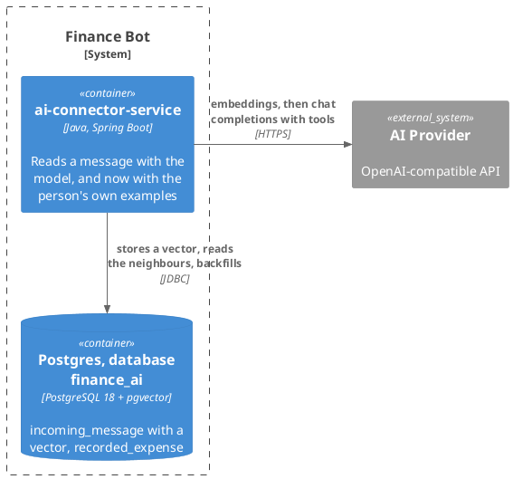
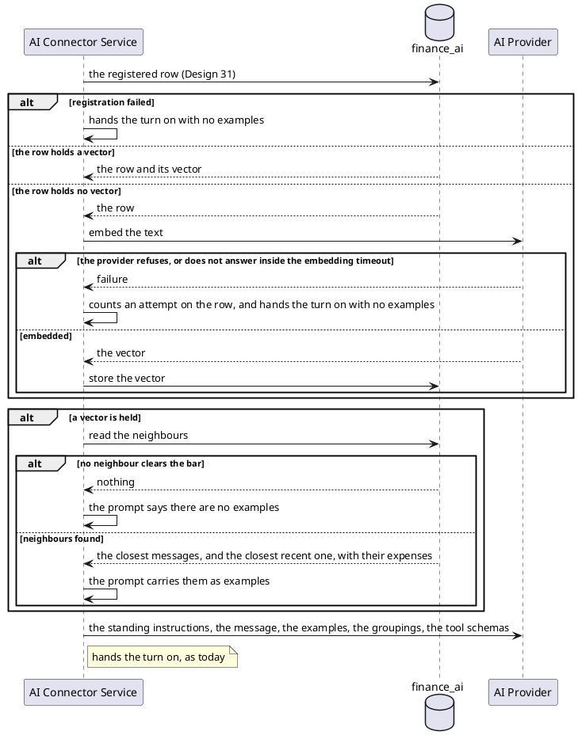
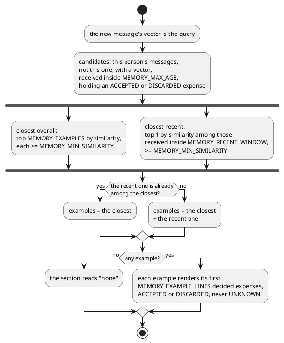

# Design: The Model Reads the Connector's Memory

**Affected Modules:** `ai-connector-service`

## Objective

The last of three tasks giving the connector a memory
([31](../31-the-connector-registers-the-message/design.md) is the sequence). Task 31 keeps each message; task 32
records what became of it. This task makes the model see it: when a new message arrives, the connector finds the
closest earlier messages by meaning and puts them in front of the model as worked examples — "this message was
recorded as these expenses, under these categories, and the person accepted or discarded them". The model then
files spending the way this person has already agreed to.

This is the task that makes the memory user-visible, still behind 31's `MEMORY_ENABLED`.

## Context

| What exists                                                        | Where                                                                                                                                                                                                                       | What this change does with it                                                                                          |
|--------------------------------------------------------------------|-----------------------------------------------------------------------------------------------------------------------------------------------------------------------------------------------------------------------------|------------------------------------------------------------------------------------------------------------------------|
| The message store and its retention                                | [Design 31](../31-the-connector-registers-the-message/design.md)                                                                                                                                                            | Gains a vector per message; the retrieval never reads past `MEMORY_MAX_AGE` (31/D5)                                    |
| The learned outcomes                                               | [Design 32](../32-the-connector-learns-what-became-of-a-message/design.md)                                                                                                                                                  | What an example renders: `ACCEPTED` and `DISCARDED` rows, never `PROPOSED` or `UNKNOWN`                                |
| The extraction use case                                            | [`extract-intents.md`](../../ai-connector-service/docs/usecases/extract-intents.md)                                                                                                                                         | Gains two steps between registration and the model: embed the message, fetch its examples                             |
| The prompt the model reads                                         | [`user-message.st`](../../ai-connector-service/src/main/resources/prompts/user-message.st), [`record-expenses.st`](../../ai-connector-service/src/main/resources/prompts/record-expenses.st)                             | The user message gains an examples section; the standing instructions say what an example is                           |
| The recording adapter, which renders the prompt                    | [`AiExpenseRecordingAdapter`](../../ai-connector-service/src/main/java/bot/finance/ai/adapter/ai/AiExpenseRecordingAdapter.java)                                                                                            | Renders the examples into the template it already renders                                                              |
| The provider the connector already calls                           | [`ai-provider.md`](../../ai-connector-service/docs/contracts/out/ai-provider.md), [`application.yaml`](../../ai-connector-service/src/main/resources/application.yaml)                                                    | Gains a second operation, embeddings, on the same base URL and key (F1)                                                 |
| The pgvector image and the extension in `finance_ai`               | [Design 31](../31-the-connector-registers-the-message/design.md), the store section                                                                                                                                         | Already there; this task adds the column                                                                               |
| ADR 0009's 2026-08-12 consequence on where spending data sits      | [ADR 0009](../adr/0009-the-connector-does-not-authenticate-its-caller.md)                                                                                                                                                   | Bounds what a person's history may leave for the provider (D2)                                                         |

## Proposed Solution

### What the change adds

| Surface                          | What it becomes                                                                                                   |
|----------------------------------|-------------------------------------------------------------------------------------------------------------------|
| The AI provider                  | Called once more per turn, for the embedding of the message; and in batches, by the backfill                      |
| The connector's database         | `incoming_message` gains a vector and two bookkeeping columns                                                      |
| The prompt                       | The user message carries the closest earlier messages and how each was recorded                                   |
| Configuration                    | An embedding model, its timeout, and the retrieval and backfill bounds                                             |

**The memory is per person.** A message is retrieved only for the `user_id` it was registered under.

**Nothing here decides how an expense is filed.** The examples are shown to the model; the ledger's tools still
record, and the person still accepts. A wrong example costs one prompt, not one row.

**The turn does not depend on the memory.** An embedding failure loses this turn's examples and nothing else
(D3).

### Diagrams

The module takes the repository's [Diagram Format](../conventions/diagrams.md) unchanged. There is no component
diagram: classes belong to the plan.

#### Container — what this change reaches



#### Flow — a turn, between registration and the model

Registration is [Design 31](../31-the-connector-registers-the-message/design.md)'s flow; everything after "hands
the turn on" is the existing flow on
[`extract-intents.md`](../../ai-connector-service/docs/usecases/extract-intents.md).



#### Flow — choosing the examples



### Details

#### The store

One migration, `V003__add_message_embedding.sql`:

```sql
ALTER TABLE incoming_message
    ADD COLUMN embedding           vector(1536),
    ADD COLUMN embedding_attempts  INT NOT NULL DEFAULT 0,
    ADD COLUMN backfill_claimed_at TIMESTAMPTZ;
```

| Column                | Holds                                                                                        |
|-----------------------|----------------------------------------------------------------------------------------------|
| `embedding`           | the message's vector, `NULL` while the provider has not answered for it                      |
| `embedding_attempts`  | how often embedding this row failed, in a turn or in the backfill (F11)                       |
| `backfill_claimed_at` | whether a backfill batch holds it (F10)                                                       |

**1536 is the width of the default embedding model.** A deployment choosing another model of a different width
needs a new migration; the width is a property of the column, not a setting (F3).

**No vector index.** A neighbour read is filtered to one person first, and one person's messages are a scan of
hundreds, not millions (F4).

#### The embedding

At most one embeddings call per turn, to the same provider on the same base URL and key, with
`OPENAI_EMBEDDING_MODEL`. The vector serves twice: it is stored on the message, and it is the query for the
neighbours. A message registered earlier with a vector is not embedded again; its stored vector is the query (F9).

| When                                   | What happens                                                                              |
|----------------------------------------|-------------------------------------------------------------------------------------------|
| the row already holds a vector         | no call; the stored vector is the query                                                   |
| the provider errors                    | the row keeps `embedding NULL` and one more attempt, no neighbours are read, the turn runs with no examples |
| the provider has not answered inside `MEMORY_EMBEDDING_TIMEOUT` | the same; the turn is delayed by the timeout and no more (F5)                    |
| a later turn re-registers a message with no vector | the vector is computed then and stored                                          |
| the backfill runs                      | rows with `embedding NULL` are embedded, `MEMORY_BACKFILL_BATCH` per provider call, at most `MEMORY_BACKFILL_BATCHES` calls per tick (D4, F12) |

A message with no vector is never a neighbour. It is kept, and it still collects its outcomes through task 32, so
that once the backfill embeds it those outcomes are already there (D4). A row at `MEMORY_EMBEDDING_ATTEMPTS` is
logged at `ERROR` once and left — never a neighbour, still collecting outcomes, purged with its age — so one text
the provider always rejects cannot stall the rows behind it (F11). A turn that re-registers such a row still tries
once, since it needs the vector for its own retrieval (A5).

**The backfill** runs on Design 31's purge timer, `MEMORY_PURGE_INTERVAL`, after the purge. Each batch is three
short steps: claim up to `MEMORY_BACKFILL_BATCH` unclaimed rows below the attempt bound, by row id, in one store
transaction that stamps them claimed and commits; embed them in one provider call, holding no store lock (F10);
write the vectors back, skipping any row a turn embedded meanwhile. A tick runs at most `MEMORY_BACKFILL_BATCHES`
batches, so the first tick after a long outage is a bounded burst and the rest waits for the next tick (F12). A
provider failure counts an attempt on every row of the batch, releases the claim, and ends the tick. The purge
runs first, so nothing is embedded only to be deleted. A claim older than the tick interval is stale and may be
re-taken, so a crash mid-batch loses nothing.

#### Retrieval

Neighbours are read for the token's `user_id` only, by cosine distance on `embedding`, and the message being
handled is excluded. The activity diagram above is the selection; its bounds:

| Bound                    | Setting                | Default | Meaning                                                                          |
|--------------------------|------------------------|---------|----------------------------------------------------------------------------------|
| how many closest         | `MEMORY_EXAMPLES`      | `3`     | the closest messages overall                                                     |
| how close is close enough| `MEMORY_MIN_SIMILARITY`| `0.6`   | cosine similarity below it is not an example                                     |
| how recent is recent     | `MEMORY_RECENT_WINDOW` | `30d`   | the single closest message received inside this window is added if not already in |
| how far back at all      | `MEMORY_MAX_AGE`       | 31/D5   | a message received before it is never an example, however close (D2)             |
| how long one example gets| `MEMORY_EXAMPLE_LINES` | `10`    | the decided expenses shown per example, in the order they were learned — the row's own id, which is the ledger's commit order (F13); the rest are omitted (F6) |
| what counts              | —                      | —       | a message with at least one `ACCEPTED` or `DISCARDED` expense                    |

The recent one is what the user asked for by name: the closest match overall may be months old, and how the person
files things drifts. It is added on top of the closest ones, never instead of one, so a prompt carries at most
`MEMORY_EXAMPLES + 1` examples. `PROPOSED` rows are still undecided and `UNKNOWN` ones are unknowable; neither is
shown, and a message with nothing else is not an example.

**What leaves for the provider is bounded on three sides**: `MEMORY_EXAMPLES + 1` messages, `MEMORY_EXAMPLE_LINES`
expenses each, and nothing older than `MEMORY_MAX_AGE` (D2).

#### The prompt

`user-message.st` gains one section, rendered from the neighbours, and `record-expenses.st` gains two sentences
saying what an example is and that it does not outrank the tools' answers.

```
How this person's earlier messages were recorded — accepted means they confirmed it, discarded means they rejected it:
{examples}
```

Each example is one earlier message and its decided expenses:

```
- "spent 15 on lunch and 3.50 coffee"
  - lunch, 15.00 EUR — Restaurants (Dining) — accepted
  - coffee, 3.50 EUR — Coffee (Dining) — discarded
```

An expense's category is the one it holds *now*: a person who moved it after accepting has said where it belongs,
and that is what the example shows. Discards are shown as labelled negative examples (D1). With no neighbour the
section reads `none`. No date is shown: recency is the selection's job, and a date beside `{today}` invites the
model to anchor a period on the wrong day (F8).

#### Configuration

| Variable                   | Sets                                              | Default                                      | Required | Secret |
|----------------------------|---------------------------------------------------|----------------------------------------------|----------|--------|
| `OPENAI_EMBEDDING_MODEL`   | which model embeds a message                      | `text-embedding-3-small`                     | no       | no     |
| `MEMORY_EMBEDDING_TIMEOUT` | how long a turn waits for the embedding           | `3s`                                         | no       | no     |
| `MEMORY_EMBEDDING_ATTEMPTS`| how many failed embeddings a message gets before it is left unembedded | `3`                     | no       | no     |
| `MEMORY_EXAMPLES`          | how many closest messages a prompt carries        | `3`                                          | no       | no     |
| `MEMORY_MIN_SIMILARITY`    | the similarity below which a message is no example| `0.6`                                        | no       | no     |
| `MEMORY_RECENT_WINDOW`     | how far back the closest recent message is sought | `30d`                                        | no       | no     |
| `MEMORY_EXAMPLE_LINES`     | how many expenses one example shows               | `10`                                         | no       | no     |
| `MEMORY_BACKFILL_BATCH`    | how many unembedded messages one backfill call embeds | `100`                                    | no       | no     |
| `MEMORY_BACKFILL_BATCHES`  | how many provider calls one backfill tick makes at most | `10`                                   | no       | no     |
| `MEMORY_BACKFILL_TIMEOUT`  | how long the backfill waits for one batch (D5)     | `60s`                                        | no       | no     |

`MEMORY_MAX_AGE` and `MEMORY_PURGE_INTERVAL` are Design 31's and are read here unchanged.

#### Build, enforcement and documents

| Setting                                                       | Change                                                                                                                                                  |
|---------------------------------------------------------------|---------------------------------------------------------------------------------------------------------------------------------------------------------|
| `ai-connector-service/build.gradle`                           | Nothing — the vector crosses the driver as text (F17)                                                                                                   |
| `CleanArchitectureTest`                                       | Nothing — no new library reaches the module (F17)                                                                                                       |
| `WireMockStubs`                                               | Gains the embeddings endpoint                                                                                                                           |
| [`extract-intents.md`](../../ai-connector-service/docs/usecases/extract-intents.md) | Two new steps, one new collaborator, two new outcomes                                                                             |
| [`ai-provider.md`](../../ai-connector-service/docs/contracts/out/ai-provider.md) | Gains the embeddings operation                                                                                                       |
| The database contract page (Design 31)                        | Gains the three columns                                                                                                                                 |
| No ADR                                                        | What a person's history may leave for the provider is carried by the configuration page and the use-case page (D6)                                       |

## Acceptance Scenarios

### `ExtractIntents`

- **A1:** a message is read with examples
  - Given: the person has earlier messages with accepted expenses, and one of them is close in meaning
  - When: the ledger calls with a new message and a valid token
  - Then: the message's vector is stored, and the prompt the provider receives carries the close message with its
    expenses, categories and outcomes

- **A2:** the closest recent message is added
  - Given: the three closest messages are older than `MEMORY_RECENT_WINDOW`, and a fourth inside it clears the bar
  - When: the ledger calls with a new message
  - Then: the prompt carries four examples, the fourth being the recent one

- **A3:** the closest recent message is already among the closest
  - Given: the closest message overall was received inside `MEMORY_RECENT_WINDOW`
  - When: the ledger calls
  - Then: the prompt carries `MEMORY_EXAMPLES` examples, and that message once

- **A4:** nothing is close enough
  - Given: the person's earlier messages all fall below `MEMORY_MIN_SIMILARITY`
  - When: the ledger calls
  - Then: the prompt's examples section reads `none`, and the turn runs as today

- **A5:** a message registered without a vector is delivered again
  - Given: a message registered under `(user, imi)` whose embedding is `NULL`
  - When: the ledger calls again with the same token claims
  - Then: one embeddings call is made, the vector is stored on the existing row, and the turn runs

- **A6:** the same message, already embedded, is delivered again
  - Given: a message registered with a vector
  - When: the ledger calls again with the same token claims
  - Then: no embeddings call is made, the existing row is not among the examples, and the turn runs

- **A7:** an undecided message is not an example
  - Given: an earlier message whose expenses are all still `PROPOSED`
  - When: the ledger calls with a message identical to it
  - Then: it is not among the examples

- **A8:** an unknowable expense is not shown
  - Given: a neighbouring message with one `ACCEPTED` and one `UNKNOWN` expense
  - When: the ledger calls
  - Then: its example shows the accepted one and nothing of the other

- **A9:** an example with more expenses than fit
  - Given: a neighbouring message with more decided expenses than `MEMORY_EXAMPLE_LINES`
  - When: the ledger calls
  - Then: its example shows the first `MEMORY_EXAMPLE_LINES` in the order they were learned, and no more

- **A10:** the embedding call fails
  - Given: the provider refuses the embeddings call
  - When: the ledger calls
  - Then: the message keeps no vector and one more attempt, the prompt carries no examples, and the chat turn still runs

- **A11:** the embedding call is slow
  - Given: a provider that answers the embeddings call after `MEMORY_EMBEDDING_TIMEOUT`
  - When: the ledger calls
  - Then: the turn goes on without examples once the timeout passes, and no longer

- **A12:** the memory is switched off
  - Given: `MEMORY_ENABLED=false`
  - When: the ledger calls
  - Then: no embeddings call is made, and the prompt is exactly what it was before this change

### The backfill

- **A13:** unembedded messages are backfilled
  - Given: messages registered with `embedding NULL`, some with outcomes already learned
  - When: the backfill runs and the provider answers
  - Then: each holds a vector, its outcomes are untouched, and it can be a neighbour on the next turn

- **A14:** the backfill meets a failing provider
  - Given: unembedded messages, and a provider that refuses
  - When: the backfill runs
  - Then: the rows stay unembedded with one more attempt each, a `WARN` is logged, and the next tick tries again

- **A15:** one message the provider always rejects
  - Given: an unembedded message the provider rejects, and younger unembedded messages behind it
  - When: `MEMORY_EMBEDDING_ATTEMPTS` ticks have passed
  - Then: it is logged at `ERROR` once and skipped, and the younger ones are embedded

- **A16:** a turn arrives while the backfill holds its message
  - Given: a backfill batch claimed and sent to the provider, holding the message a turn now re-registers
  - When: the turn runs
  - Then: it is not delayed by the batch, embeds the message itself, and the batch's later write leaves that vector alone

- **A17:** a long backlog
  - Given: more unembedded messages than `MEMORY_BACKFILL_BATCH × MEMORY_BACKFILL_BATCHES`
  - When: one tick runs
  - Then: exactly that many are embedded, and the rest wait for the next tick

- **A18:** two instances backfill at once
  - Given: two connector instances and a backlog
  - When: both ticks run together
  - Then: no message is embedded twice

## Decisions

- **D1:** Do discarded expenses appear in the prompt as examples?
  - Answer: Yes, labelled `discarded` beside the accepted ones.
  - Basis: decided — the user chose labelled negative examples over accepted-only (user, 2026-08-15)

- **D2:** How much of a person's history may leave for the AI provider, and how far back?
  - Answer: At most `MEMORY_EXAMPLES + 1` messages of `MEMORY_EXAMPLE_LINES` expenses each, none received more
    than `MEMORY_MAX_AGE` ago — Design 31's bound, defaulting to `365d`.
  - Basis: decided — the grill raised it; ADR 0009's 2026-08-12 consequence records where spending data sits
    outside the database and says nothing about a provider receiving a person's decided expenses on every turn;
    the user chose a one-year age bound over none (user, 2026-08-15)

- **D3:** Does a failure of the embedding fail the turn?
  - Answer: No. The turn runs with no examples, and the row keeps no vector until a later turn or the backfill
    embeds it.
  - Basis: decided — the user chose a turn that never depends on the memory over refusing it as unavailable
    (user, 2026-08-15)

- **D4:** Is a message whose embedding failed kept?
  - Answer: Yes. It keeps collecting outcomes through task 32, and a backfill on the purge timer embeds every
    unembedded row in batches until none remain.
  - Basis: decided — the user chose keep-and-backfill over deleting the row or keeping it only for a bounded time
    (user, 2026-08-15)

- **D5:** What bounds the backfill's batch call, which sends up to `MEMORY_BACKFILL_BATCH` texts at once?
  - Answer: Its own timeout, `MEMORY_BACKFILL_TIMEOUT`, defaulting to `60s` — longer than a turn's, since a
    batch legitimately takes longer than one text. A batch that outlives it is a provider failure: one attempt on
    every claimed row, and the tick ends.
  - Basis: decided — the user chose a bounded batch with a longer timeout over an unbounded one and over reusing
    `MEMORY_EMBEDDING_TIMEOUT` (user, 2026-08-17)

- **D6:** Does the bound on what a person's history may leave for the provider (D2) become an ADR?
  - Answer: No. No ADR is written and none is amended; the connector's configuration page and its use-case page
    carry the bound.
  - Basis: decided — the user chose no ADR over appending a consequence to ADR 0017 and over a record of its own
    (user, 2026-08-17)

## Design Findings

Grilled (2026-08-15): three passes over the undivided design this task was cut from — failure modes, concurrency,
data edges, limits, observability; contract compat, authorization and backfill idempotency found clear.

| #   | Question                                                        | Answer                                                                                                                | Evidence                                                                                                          |
|-----|-----------------------------------------------------------------|-----------------------------------------------------------------------------------------------------------------------|-------------------------------------------------------------------------------------------------------------------|
| F1  | Which embedding endpoint, and where?                            | The provider's `/embeddings` on the same base URL and key; the model is `OPENAI_EMBEDDING_MODEL`                       | [`application.yaml`](../../ai-connector-service/src/main/resources/application.yaml)                             |
| F2  | Which vector store?                                             | pgvector in the connector's own database, read with plain SQL; a `vector` column, no separate store                    | Design 31, the store section; [Orientation](../../ledger-service/docs/conventions/orientation.md)                 |
| F3  | Changing the embedding model?                                   | A new migration for the column width, and stored vectors are unusable across models — deferred until a change is asked | The migration above                                                                                              |
| F4  | Does the neighbour read need a vector index?                    | No — filtered to one person first; deferred until one person's messages number tens of thousands                       | The retrieval section above                                                                                       |
| F5  | A slow provider rather than a failing one?                      | Bounded by `MEMORY_EMBEDDING_TIMEOUT`; the chat call itself is as unbounded as today                                    | [`application.yaml`](../../ai-connector-service/src/main/resources/application.yaml), no `spring.ai.openai` timeout |
| F6  | How large can one example get?                                  | `MEMORY_EXAMPLE_LINES` expenses                                                                                       | The retrieval table above                                                                                         |
| F7  | Is a past message a prompt-injection surface?                   | It is the same person's own text, already read once by the model, and Design 31 D1 keeps it that person's             | Design 31 F7                                                                                                      |
| F8  | Why no date on an example?                                      | Recency is the selection's job; a date beside `{today}` invites the model to anchor a period on the wrong day          | [`user-message.st`](../../ai-connector-service/src/main/resources/prompts/user-message.st), the `{today}` line     |
| F9  | Is an already-registered message embedded again?                | No — a stored vector is reused; only a row with `embedding NULL` triggers the call                                     | The embedding table above                                                                                         |
| F10 | Does a backfill claim span the provider call?                   | No — claim, embed, write back are three steps; no store lock is held while the provider answers, so a turn is never delayed by a batch | The backfill paragraph; D3, F5 |
| F11 | One text the provider always rejects?                           | Counted on `embedding_attempts`; at `MEMORY_EMBEDDING_ATTEMPTS` the row is logged and skipped, not retried at the head of the queue | The migration above; Design 32 D1, the precedent |
| F12 | How many provider calls may one backfill tick make?             | At most `MEMORY_BACKFILL_BATCHES`                                                                                     | The embedding table above; Design 31 F14, the purge's bound |
| F13 | What orders one example's expenses?                             | The row's id — arrival order, which is the ledger's commit order; `updated_at` moves on every refile                     | Design 32, the migration |
| F14 | Two instances backfilling at once?                              | A batch claims only rows no other instance holds                                                                      | The backfill paragraph; Design 31's purge, the same rule |
| F15 | The examples section with the memory off?                       | Absent — the memory-off token carries no identity, so nothing is registered or recalled and the user message is the one the turn sent before this change; the section reading `none` is the memory-on answer to no neighbour (A12) | Design 31, `adapter/security` gated by `MEMORY_ENABLED`; `ExtractIntentsCommand.messageIdentity` |
| F16 | An example whose expense has no category or grouping name?      | Design 32 keeps both names nullable, absent when the stream's enrichment lacked them; a name the store lacks is left out of the line and the rest of the line stands | Design 32, the migration; `RecordedExpenseEntity` |
| F17 | Does the JDBC driver need the pgvector type?                    | No — the vector crosses as its text literal, `CAST(:embedding AS vector)` on write and `embedding::text` on read, and cosine distance is `<=>` in the statement; no new dependency, nothing to ban from the core | `IncomingMessageEntityRepository`, the statements Designs 31 and 32 already write by hand |
| F18 | A store that refuses the vector write?                          | One `WARN` and a turn with no examples, as any other store refusal — the vector is not kept, and a later turn or the backfill writes it | D3; `ExtractIntentsUseCase`, the registration's own catch                                     |
