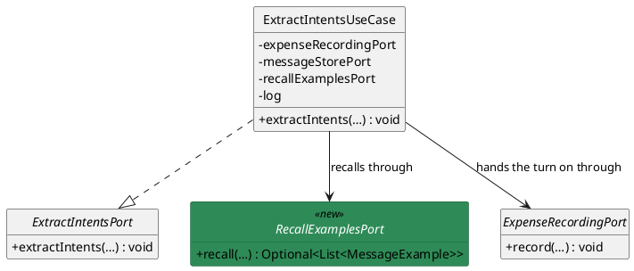
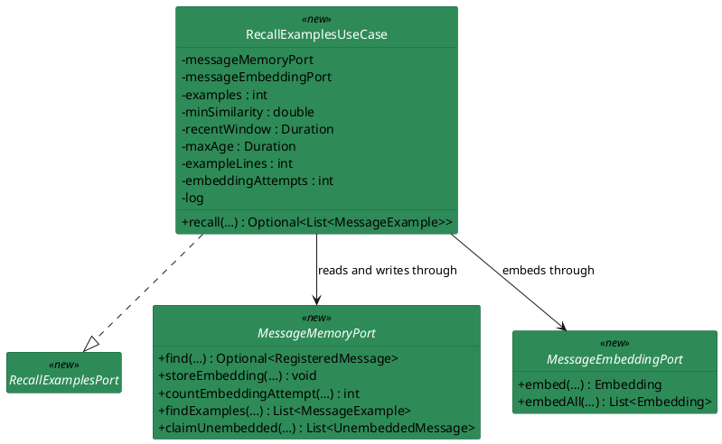
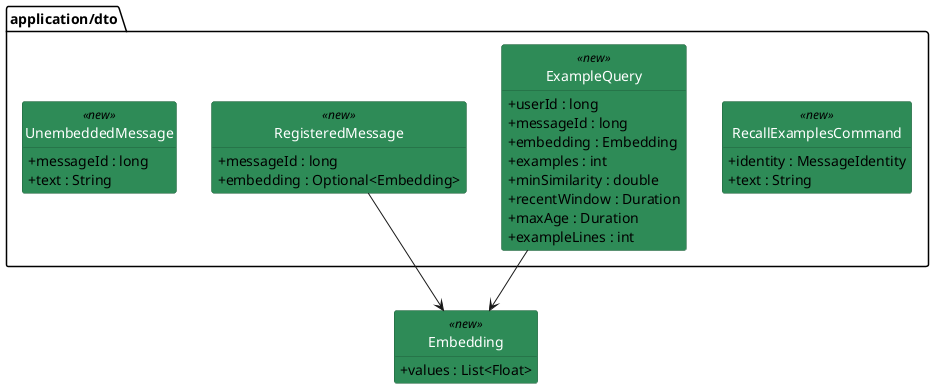
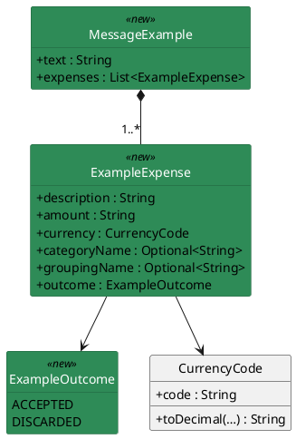
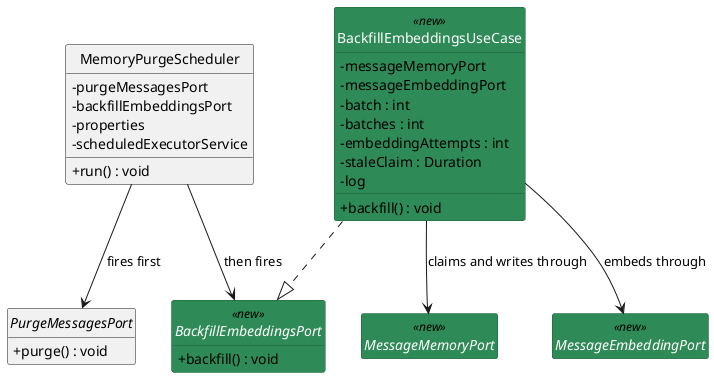
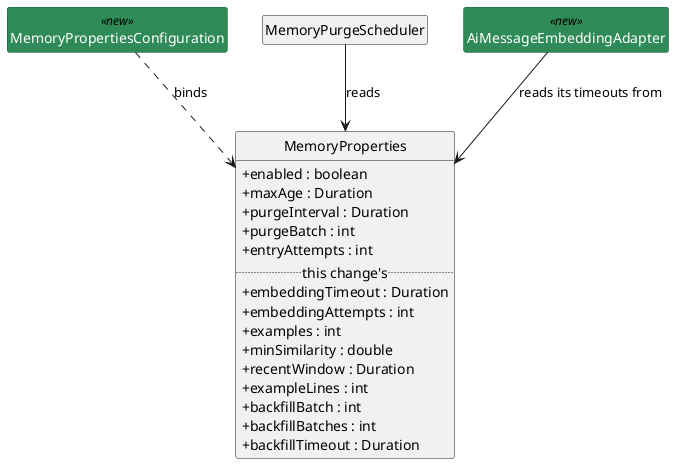
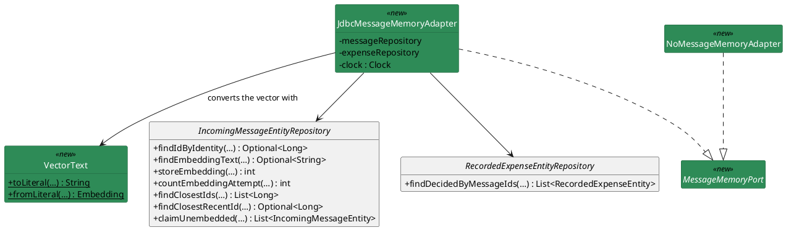
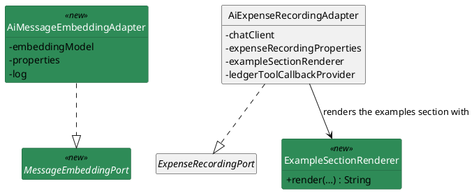

# Plan: The Model Reads the Connector's Memory

**Affected Modules:** `ai-connector-service`
**Design:** [The Model Reads the Connector's Memory](design.md)

## Components

The design named responsibilities; these are the classes that hold them, with their fields. Seven small class
diagrams, four to six boxes each, so no box is ever scaled down to fit: the turn, the recall inside it, the data
the ports carry, what an example is made of, the timer, the store's adapters and the provider's. A `<<new>>` box
is a file that does not exist yet; an untagged one is already in the tree, drawn where an arrow needs it. The
purge is unchanged — the only thing that happened to it is the scheduler's second call, drawn under the timer.

**A method shows its name and what it answers; its parameters are in the tables below.** A signature cannot wrap
inside a box, so the longest one sets the diagram's width and shrinks every name on it.

#### The turn — where the recall sits



#### The recall — one embedding, then the neighbours



#### The data the ports carry



#### An example — what the prompt renders



#### The timer — the purge, then the backfill



#### The settings — bound whatever `memory.enabled` reads



#### The store side — `adapter/persistence`



#### The provider side — `adapter/ai`



### What a box cannot carry

The diagrams carry the fields and the signatures. What is left is what a box has no room for — what each type
refuses, and the one rule a reader would otherwise get wrong.

| Type                    | Package               | What the box cannot say                                                                                                                                                        |
|-------------------------|-----------------------|--------------------------------------------------------------------------------------------------------------------------------------------------------------------------------|
| `Embedding`             | `domain/value`        | the components are copied on construction, and stay at the provider's own precision; refuses a null or empty list and a null element, as `InvalidValueException`                |
| `ExampleExpense`        | `domain/value`        | `amount` is the amount in the currency's main unit as plain decimal text, never minor units — nothing here compares it, and the core carries no transport-shaped field; both names are absent where the store holds none (design F16); refuses a null or blank `description` or `amount`, a null `currency`, a null `outcome` and a null `Optional`, the same way |
| `CurrencyCode`          | `domain/value`        | gains `toDecimal(long minorUnits)` — the amount in the main unit, scaled by the currency's own minor-unit digits, as plain decimal text; a currency with no minor unit gets no decimal part |
| `MessageExample`        | `domain/value`        | the expenses are copied on construction; refuses a null or blank `text`, a null or empty `expenses` and a null element, the same way                                            |
| `RecallExamplesCommand` | `application/dto`     | refuses a null `identity` and a null or blank `text`, the same way                                                                                                              |
| `RegisteredMessage`     | `application/dto`     | refuses a null `Optional`, the same way                                                                                                                                        |
| `UnembeddedMessage`     | `application/dto`     | refuses a null or blank `text`, the same way                                                                                                                                   |
| `ExampleQuery`          | `application/dto`     | the design's retrieval table, one component per bound, the excluded row being `messageId`; validated by the use case that builds it, not here                                    |
| `MemoryProperties`      | `adapter/scheduling`  | the first five components are Designs 31 and 32's and are read here unchanged; the nine after them are this change's                                                             |
| `IncomingMessageEntity` | `adapter/persistence` | unchanged, and not drawn — the three new columns are reached by hand-written statements, and a `vector` is not a type Spring Data JDBC maps                                      |

Each port's signatures are in the diagrams above; what each method promises is here.

| Port                     | What each method answers, and what the use case behind it refuses                                                                                                                                                                                                                                                                                                                                                                                                                                                                                                                                                                                                                                                                                                                                                                                                                                                                  |
|--------------------------|--------------------------------------------------------------------------------------------------------------------------------------------------------------------------------------------------------------------------------------------------------------------------------------------------------------------------------------------------------------------------------------------------------------------------------------------------------------------------------------------------------------------------------------------------------------------------------------------------------------------------------------------------------------------------------------------------------------------------------------------------------------------------------------------------------------------------------------------------------------------------------------------------|
| `RecallExamplesPort`     | `Optional<List<MessageExample>> recall(RecallExamplesCommand command)` — empty where no retrieval ran (the store holds no row for the identity, the store refused, or the message could not be embedded); present where one ran, the list empty where no neighbour cleared the bar. `RecallExamplesUseCase` takes `MessageMemoryPort`, `MessageEmbeddingPort`, `int examples`, `double minSimilarity`, `Duration recentWindow`, `Duration maxAge`, `int exampleLines`, `int embeddingAttempts` and a `LoggerFactory`, and refuses a non-positive `examples`, `exampleLines` or `embeddingAttempts`, a non-positive `recentWindow` or `maxAge`, and a `minSimilarity` outside `0..1`, as `InvalidValueException`                                                                                                                                                                                        |
| `BackfillEmbeddingsPort` | `void backfill()` — up to `backfillBatches` batches of `backfillBatch` claimed rows; ends the tick early on an empty claim, on a provider failure, or on a store failure. `BackfillEmbeddingsUseCase` takes `MessageMemoryPort`, `MessageEmbeddingPort`, `int batch`, `int batches`, `int embeddingAttempts`, `Duration staleClaim` and a `LoggerFactory`, and refuses a non-positive `batch`, `batches` or `embeddingAttempts` and a non-positive `staleClaim`, as `InvalidValueException`                                                                                                                                                                                                                                                                                                                                                                                                          |
| `MessageEmbeddingPort`   | `Embedding embed(String text)` — one embedding, bounded by `MEMORY_EMBEDDING_TIMEOUT`; `List<Embedding> embedAll(List<String> texts)` — one call for the batch, answering one vector per text in the order given, bounded by `MEMORY_BACKFILL_TIMEOUT` (D5). Either raises `MessageEmbeddingFailedException` when the provider refuses, answers unreadably, or does not answer inside its own timeout                                                                                                                                                                                                                                                                                                                                                                                                                                                                                                                              |
| `MessageMemoryPort`      | `Optional<RegisteredMessage> find(MessageIdentity identity)` — the registered row and the vector it holds, empty where the store has no such row; `void storeEmbedding(long messageId, Embedding embedding)` — writes only where the row still holds none, and releases any backfill claim on it (A16); `int countEmbeddingAttempt(long messageId)` — one more attempt, releasing the claim, answering the count after it; `List<MessageExample> findExamples(ExampleQuery query)` — the design's selection, each example carrying at most `exampleLines` decided expenses in row-id order (design F13); `List<UnembeddedMessage> claimUnembedded(int batch, int maxAttempts, Duration staleClaim)` — the oldest unclaimed rows by id below the attempt bound, stamped claimed in one transaction. A `DataAccessException` becomes what `MessageStoreExceptionMapper` already maps it to |

| Exception                          | Package            | Raised by                                                     | Becomes                                                            |
|------------------------------------|--------------------|---------------------------------------------------------------|--------------------------------------------------------------------|
| `MessageEmbeddingFailedException`  | `domain/exception` | the embedding adapter, on a refusal, an unreadable answer or a timeout | one counted attempt and a turn with no examples (D3); in the backfill, one counted attempt per claimed row and the end of the tick |

What these classes do, which no box carries:

| Class                          | Package               | Behaviour                                                                                                                                                                                                                                                                                                                                                                                                                                                                                                          |
|--------------------------------|-----------------------|--------------------------------------------------------------------------------------------------------------------------------------------------------------------------------------------------------------------------------------------------------------------------------------------------------------------------------------------------------------------------------------------------------------------------------------------------------------------------------------------------------------------|
| `MemoryPropertiesConfiguration` | `adapter/scheduling`  | `@Configuration @EnableConfigurationProperties(MemoryProperties.class)`, unconditional. `MemoryConfiguration` keeps its `Clock` and its executor behind `memory.enabled` and loses the `@EnableConfigurationProperties`, so the recall use case — a bean of every context — can read the retrieval bounds with the memory off                                                                                                                                                                                       |
| `AiMessageEmbeddingAdapter`     | `adapter/ai`          | `@Component`, taking Spring AI's `EmbeddingModel`, `MemoryProperties` and a `LoggerFactory`. `embed()` runs the call on a virtual thread and waits `embeddingTimeout` for it, so a slow provider costs the turn that much and no more (design F5); `embedAll()` sends the batch in one call, on the same mechanism, and waits `backfillTimeout` (D5). A `RuntimeException`, a timeout, or an answer whose vector count does not match the request becomes `MessageEmbeddingFailedException`                                       |
| `ExampleSectionRenderer`        | `adapter/ai`          | `String render(Optional<List<MessageExample>> examples)` — the empty string where no retrieval ran, the design's section with `none` where one found nothing, and otherwise one block per example: the message quoted, then a line per decided expense — description, the amount as the example carries it followed by its currency code, the category and its grouping in brackets where the store holds them, and `accepted` or `discarded`. It formats no amount of its own. No date (design F8)                                                          |
| `AiExpenseRecordingAdapter`     | `adapter/ai`          | `record()` gains a sixth parameter, `Optional<List<MessageExample>> examples`, and renders it into the template's `{examples}` placeholder through `ExampleSectionRenderer`                                                                                                                                                                                                                                                                                                                                          |
| `JdbcMessageMemoryAdapter`      | `adapter/persistence` | `@Component`, `@ConditionalOnProperty(name = "memory.enabled", havingValue = "true")`. `findExamples()` reads the closest ids and the closest recent id, unions them keeping the closest first, loads those rows and their decided expenses, and trims each to `exampleLines`. Each expense's `amount_minor_units` becomes its example's decimal text through `CurrencyCode.toDecimal(…)`, so minor units stop at this boundary. The age and recency bounds become instants from the adapter's own clock before they reach a statement |
| `NoMessageMemoryAdapter`        | `adapter/persistence` | `@Component`, `@ConditionalOnProperty(name = "memory.enabled", havingValue = "false")`, in `NoMessageStoreAdapter`'s shape: `find()` and `claimUnembedded()` answer nothing, the writes do nothing, `countEmbeddingAttempt()` answers zero                                                                                                                                                                                                                                                                          |
| `VectorText`                    | `adapter/persistence` | package-private, static: `String toLiteral(Embedding)` and `Embedding fromLiteral(String)` — pgvector's `[a,b,c]` text form, which is how the vector crosses the driver (design F17)                                                                                                                                                                                                                                                                                                                                |
| `MemoryPurgeScheduler`          | `adapter/scheduling`  | takes `BackfillEmbeddingsPort` beside `PurgeMessagesPort` and calls it after the purge in the same `run()`, so nothing is embedded only to be deleted                                                                                                                                                                                                                                                                                                                                                                |

## Step-by-Step Implementation Map (To-Do List)

### Stabilization

#### Database

- [x] ST01 · Add migration
  `ai-connector-service/src/main/resources/db/migration/V003__add_message_embedding.sql`, exactly as the design's
  **The store** section states: `incoming_message` gains `embedding vector(1536)`, `embedding_attempts INT NOT NULL
  DEFAULT 0` and `backfill_claimed_at TIMESTAMPTZ`. No index (design F4).

#### Interface-First / Build Stabilization

New-method stubs carry a short inline comment describing the implementation intent, and no comment anywhere cites
a step id — `CommentConventionsTest` fails the run on one.

**Interface & Signature Sync**

- [x] ST02 · Add to `domain/value`: `Embedding`, `ExampleOutcome`, `ExampleExpense`, `MessageExample`, with the
  components the Components diagrams name and every compact constructor left to validate nothing yet. Give
  `CurrencyCode` a stub `toDecimal(long minorUnits)`:
  ```java
  public String toDecimal(long minorUnits) {
      // shifts the amount by the currency's own minor-unit digits, as plain decimal text
      return null;
  }
  ```
  Add `domain/exception/MessageEmbeddingFailedException`, in the shape `ExpenseRecordingFailedException` has.

- [x] ST03 · Add to `application/dto`: `RecallExamplesCommand`, `RegisteredMessage`, `UnembeddedMessage`,
  `ExampleQuery`, compact constructors validating nothing yet, a `TODO` at each refusal point. Add to
  `application/port`: `RecallExamplesPort`, `BackfillEmbeddingsPort`, `MessageEmbeddingPort`, `MessageMemoryPort`,
  with the methods the port table names. Stub `application/usecase/RecallExamplesUseCase` and
  `application/usecase/BackfillEmbeddingsUseCase` with the constructors that table names, no refusal yet:
  ```java
  public Optional<List<MessageExample>> recall(RecallExamplesCommand command) {
      // reads the registered row, embeds it once where it holds no vector, and answers the neighbours the
      // query's bounds admit; empty where no retrieval ran
      return Optional.empty();
  }
  ```

- [x] ST04 · Give `ExpenseRecordingPort.record()` a sixth parameter, `Optional<List<MessageExample>> examples`,
  and give `ExtractIntentsUseCase` a `RecallExamplesPort` between its store port and its logger factory, passing
  `Optional.empty()` on to the recording port for now:
  ```java
  // recalls the person's closest earlier messages once the turn's own has been registered
  ```
  Repair every call site the signature breaks, test tree included — `AiExpenseRecordingAdapter`,
  `ExtractIntentsUseCaseTest` and `AiExpenseRecordingAdapterTest` — by passing `Optional.empty()` and widening
  the existing `verify(...)` matchers, leaving what they assert to RU09 and RI03.

- [x] ST05 · In `adapter/persistence`: give `IncomingMessageEntityRepository` the statements the port table's
  contracts need — the id by identity, the embedding as `embedding::text`, the vector write
  (`SET embedding = CAST(:embedding AS vector), backfill_claimed_at = NULL WHERE id = :id AND embedding IS NULL`),
  the attempt count (`SET embedding_attempts = embedding_attempts + 1, backfill_claimed_at = NULL … RETURNING
  embedding_attempts`, in `StreamEntryFailureEntityRepository.countFailure`'s shape), the closest ids and the
  closest recent id (`1 - (embedding <=> CAST(:embedding AS vector)) >= :minSimilarity`, ordered by that distance,
  filtered to the user, excluding the row itself, requiring a vector, an `EXISTS` over an `ACCEPTED` or
  `DISCARDED` expense, and `received_at >= :cut`), and the claim (`UPDATE … WHERE id IN (SELECT id … WHERE
  embedding IS NULL AND embedding_attempts < :maxAttempts AND (backfill_claimed_at IS NULL OR backfill_claimed_at
  < :staleBefore) ORDER BY id LIMIT :batch FOR UPDATE SKIP LOCKED) RETURNING id, user_id, incoming_message_id,
  text, received_at`). Give `RecordedExpenseEntityRepository` the decided expenses of a set of messages, ordered
  by `message_id, id`. Then the stub `VectorText`, and stubs for `JdbcMessageMemoryAdapter` — constructor
  `(IncomingMessageEntityRepository, RecordedExpenseEntityRepository, Clock)`, the clock being what turns the
  query's age and recency bounds into instants — and `NoMessageMemoryAdapter`, as the Components table describes
  them, one method per port method, each with its intent comment.

- [x] ST06 · In `adapter/ai`: stub `AiMessageEmbeddingAdapter` and `ExampleSectionRenderer` (`@Component`, its
  `render()` answering the empty string for now), and have `AiExpenseRecordingAdapter` render the section through
  it into a new `{examples}` placeholder on `src/main/resources/prompts/user-message.st`. The template carries the
  placeholder alone and no heading of its own — the heading is part of what the renderer answers — and it sits
  directly in front of `Message:`, taking no line of its own, so an absent section leaves the user message
  character-for-character what it was, blank lines included (A12). A non-empty section therefore ends with a blank
  line of its own. Give
  `src/main/resources/prompts/record-expenses.st` the two sentences the design states: what an example is, and
  that it does not outrank the tools' answers.

- [x] ST07 · Give `MemoryProperties` the nine new components the Components diagrams name, beside the five it has. Add
  `adapter/scheduling/MemoryPropertiesConfiguration` and take `@EnableConfigurationProperties(MemoryProperties.class)`
  off `MemoryConfiguration`. In `UseCaseConfiguration` declare an unconditional
  `@Bean RecallExamplesPort recallExamplesPort(MessageMemoryPort, MessageEmbeddingPort, MemoryProperties,
  LoggerFactory)` and a `@Bean @ConditionalOnProperty(name = "memory.enabled", havingValue = "true")
  BackfillEmbeddingsPort backfillEmbeddingsPort(MessageMemoryPort, MessageEmbeddingPort, MemoryProperties,
  LoggerFactory)` built with `properties.purgeInterval()` as the stale-claim bound, and pass the recall port to
  `extractIntentsPort`. Give `MemoryPurgeScheduler` the backfill port and call it after the purge in `run()`.

**Configuration**

- [x] ST08 · In `application.yaml`: `spring.ai.openai.embedding.options.model:
  ${OPENAI_EMBEDDING_MODEL:text-embedding-3-small}`, and under `memory:` — `embedding-timeout:
  ${MEMORY_EMBEDDING_TIMEOUT:3s}`, `embedding-attempts: ${MEMORY_EMBEDDING_ATTEMPTS:3}`, `examples:
  ${MEMORY_EXAMPLES:3}`, `min-similarity: ${MEMORY_MIN_SIMILARITY:0.6}`, `recent-window:
  ${MEMORY_RECENT_WINDOW:30d}`, `example-lines: ${MEMORY_EXAMPLE_LINES:10}`, `backfill-batch:
  ${MEMORY_BACKFILL_BATCH:100}`, `backfill-batches: ${MEMORY_BACKFILL_BATCHES:10}`, `backfill-timeout:
  ${MEMORY_BACKFILL_TIMEOUT:60s}`. Nothing in
  `application-test.yaml`, and nothing in `infrastructure/docker-compose.yaml`: every new variable has a default.

**Shared Test Infrastructure**

- [x] ST09 · Give `common/stubs/WireMockStubs` the embeddings endpoint — `EMBEDDINGS_PATH = "/v1/embeddings"`,
  a stub serving a body verbatim, one answering a server error, and one answering after a given delay. Add
  `common/fixtures/EmbeddingFixtures` — a 1536-component unit vector along a named axis, a second one at a
  chosen cosine similarity to it, and the provider's embeddings response body for one or many of them. Give
  `common/stubs/CapturedRequestUtils` the embeddings requests it recorded, and `common/rows/IncomingMessageRowUtils`
  a row insert carrying a vector, a received-at and an attempt count, plus reads of a row's vector, its attempts
  and its claim stamp. Have `AbstractMemorySystemTest` stub the embeddings endpoint in its existing `@BeforeEach`
  beside the key set, so the backfill firing on the class's one-second purge interval never meets an unstubbed
  endpoint. Add `AiMessageEmbeddingAdapter`, `ExampleSectionRenderer`, `MemoryPropertiesConfiguration` and Spring
  AI's `OpenAiEmbeddingAutoConfiguration` to `@AiAdapterTest`, whose class list is explicit and scans nothing.
  `@PersistenceAdapterTest` stays as it is: RI01 imports `MemoryConfiguration` beside its adapter for the `Clock`,
  the way a slice test imports what it drives.

- [x] ST10 · Confirm `CleanArchitectureTest`, `CommentConventionsTest` and `DisplayNameConventionsTest` pass, and
  that the pre-existing suite is still green.

### Red Phase

#### TDD Unit Red Phase

- [x] RU01 · `Embedding` · test: `EmbeddingTest` · covers: the compact constructor
    - the compact constructor:
        - given: a list of components
          when: the record is constructed
          then: the components read back unchanged, and mutating the list afterwards leaves them alone
        - given: a null list, an empty list, and a list holding a null
          when: the record is constructed
          then: InvalidValueException is thrown for each, never NullPointerException

- [x] RU02 · `ExampleExpense` · test: `ExampleExpenseTest` · covers: the compact constructor · scenarios: A8
    - the compact constructor:
        - given: a description, a decimal amount, a currency, both names and an outcome
          when: the record is constructed
          then: every component reads back unchanged
        - given: an absent category name and an absent grouping name
          when: the record is constructed
          then: it is accepted, both absent
        - given: a null or blank description, a null or blank amount, a null currency, a null outcome, or a null
          Optional for either name
          when: the record is constructed
          then: InvalidValueException is thrown for each, never NullPointerException

- [x] RU03 · `MessageExample` · test: `MessageExampleTest` · covers: the compact constructor
    - the compact constructor:
        - given: a text and one expense
          when: the record is constructed
          then: both read back unchanged, and mutating the list afterwards leaves them alone
        - given: a null or blank text, a null or empty expense list, or a list holding a null
          when: the record is constructed
          then: InvalidValueException is thrown for each

- [x] RU04 · `RecallExamplesCommand` · test: `RecallExamplesCommandTest` · covers: the compact constructor
    - the compact constructor:
        - given: an identity and a text
          when: the record is constructed
          then: both read back unchanged
        - given: a null identity, or a null or blank text
          when: the record is constructed
          then: InvalidValueException is thrown for each

- [x] RU05 · `RecallExamplesUseCase` · test: `RecallExamplesUseCaseTest` · covers: the constructor, `recall()` ·
  scenarios: A4, A5, A6, A10, A11
    - the constructor:
        - given: a non-positive examples count, example-lines count or embedding-attempts count
          when: the use case is constructed
          then: InvalidValueException is thrown for each
        - given: a zero or negative recent window or max age, and a min-similarity below zero or above one
          when: the use case is constructed
          then: InvalidValueException is thrown for each
    - `recall()`:
        - given: a row already holding a vector
          when: recall() is called
          then: the embedding port is never touched, findExamples() receives that same vector, the user id, the
          row's id and the constructor's bounds, and the answer carries what it returned
        - given: a row holding no vector, and an embedding port answering one
          when: recall() is called
          then: storeEmbedding() receives the row's id and that vector, findExamples() receives it as the query,
          and the answer carries the examples
        - given: a store holding no row for the identity
          when: recall() is called
          then: the answer is empty, and neither the embedding port nor findExamples() is touched
        - given: a store whose find() throws MessageStoreFailedException, and one whose findExamples() throws it
          when: recall() is called with each
          then: the answer is empty each time, one WARN naming the identity and no message text is logged, and
          nothing propagates
        - given: a row holding no vector and an embedding port throwing MessageEmbeddingFailedException, with
          countEmbeddingAttempt() answering one below the bound
          when: recall() is called
          then: the answer is empty, countEmbeddingAttempt() received the row's id, one WARN is logged, nothing
          is logged at ERROR, and findExamples() is never touched
        - given: the same, with countEmbeddingAttempt() answering the attempt bound
          when: recall() is called
          then: one ERROR names the row and carries no message text
        - given: the same, with countEmbeddingAttempt() answering past the attempt bound
          when: recall() is called
          then: nothing is logged at ERROR
        - given: a retrieval answering no neighbour
          when: recall() is called
          then: the answer is present and empty
        - given: a store whose countEmbeddingAttempt() itself throws MessageStoreFailedException after a failed
          embedding
          when: recall() is called
          then: the answer is empty and nothing propagates
        - given: a row holding no vector, an embedding port answering one, and a store whose storeEmbedding()
          throws MessageStoreFailedException
          when: recall() is called
          then: the answer is empty, findExamples() is never touched, one WARN is logged, and nothing propagates

- [x] RU06 · `BackfillEmbeddingsUseCase` · test: `BackfillEmbeddingsUseCaseTest` · covers: the constructor,
  `backfill()` · scenarios: A13, A14, A15, A16, A17
    - the constructor:
        - given: a non-positive batch, batches or embedding-attempts count, or a non-positive stale claim
          when: the use case is constructed
          then: InvalidValueException is thrown for each
    - `backfill()`:
        - given: one claimed batch of three rows and a port answering three vectors
          when: backfill() is called
          then: claimUnembedded() received the batch size, the attempt bound and the stale claim, embedAll()
          received the three texts in the claim's order, and storeEmbedding() received each row's id with the
          vector of its own text
        - given: a claim answering nothing
          when: backfill() is called
          then: the embedding port is never touched and no second claim is made
        - given: full batches on every claim
          when: backfill() is called
          then: exactly the configured number of batches are claimed and embedded, and no more
        - given: an embedding port throwing MessageEmbeddingFailedException on the first batch
          when: backfill() is called
          then: countEmbeddingAttempt() received every claimed row's id, one WARN is logged, no second batch is
          claimed, and nothing propagates
        - given: the same, with countEmbeddingAttempt() answering the attempt bound for one row and one below it
          for the others
          when: backfill() is called
          then: exactly one ERROR is logged, naming that row and carrying no message text
        - given: an embedding port answering fewer vectors than the batch held
          when: backfill() is called
          then: nothing is stored, an attempt is counted on every claimed row, and one WARN is logged
        - given: a store whose storeEmbedding() throws MessageStoreFailedException
          when: backfill() is called
          then: one WARN is logged, no second batch is claimed, and nothing propagates
        - given: a store whose claimUnembedded() throws MessageStoreFailedException
          when: backfill() is called
          then: one WARN is logged, the embedding port is never touched, no second claim is made, and nothing
          propagates

- [x] RU07 · `ExampleSectionRenderer` · test: `ExampleSectionRendererTest` · covers: `render()` · scenarios: A1,
  A4, A8, A9, A12
    - `render()`:
        - given: an absent retrieval
          when: render() is called
          then: it answers the empty string
        - given: a present retrieval holding no example
          when: render() is called
          then: the section reads `none`
        - given: one example whose message named two accepted expenses
          when: render() is called
          then: the section quotes the message once and carries a line per expense, each naming the description,
          the amount exactly as the example carries it, the currency code, the category, its grouping and
          `accepted`
        - given: an example holding a discarded expense beside an accepted one
          when: render() is called
          then: the discarded one's line reads `discarded` and the accepted one's `accepted`
        - given: an expense with no category name, and one with no grouping name
          when: render() is called
          then: each line carries what the store holds and drops what it does not, the rest of the line standing
        - given: two examples
          when: render() is called
          then: both appear, in the order given

- [x] RU08 · `VectorText` · test: `VectorTextTest` · covers: `toLiteral()`, `fromLiteral()`
    - `toLiteral()`:
        - given: an embedding of three components
          when: toLiteral() is called
          then: it answers pgvector's bracketed, comma-separated form with no spaces
    - `fromLiteral()`:
        - given: that literal
          when: fromLiteral() is called
          then: it answers an embedding with the same components, in order
        - given: a literal holding a negative and an exponent-formatted component
          when: fromLiteral() is called
          then: both read back unchanged

- [x] RU09 · `ExtractIntentsUseCase` · test: `ExtractIntentsUseCaseTest` · covers: `extractIntents()` ·
  scenarios: A1, A12
    - `extractIntents()`:
        - given: a command carrying a message identity and a recall port answering examples
          when: extractIntents() is called
          then: the recall port received the identity and the text, the message was registered before it, and
          the recording port received those same examples
        - given: a command carrying no message identity
          when: extractIntents() is called
          then: the recall port is never touched and the recording port receives an absent retrieval
        - given: a recall port answering an absent retrieval
          when: extractIntents() is called
          then: the recording port receives it absent and the turn still runs
        - update: `whenCommandCarriesThreeGroupingNamesAndACatchAll_thenPortReceivesThemPassedThrough()` — the
          `record(...)` verification gains the sixth argument
        - update: `whenCommandCarriesCurrentDate_thenPortReceivesThatSameDateUnchanged()` — the same
        - update: `whenCommandCarriesAssumedCurrency_thenPortReceivesThatCurrencyCode()` — the same
        - update: `whenPortThrowsExpenseRecordingFailedException_thenExceptionPropagatesUnchanged()` — the
          `doThrow(...)` stubbing gains the sixth matcher
        - update: `whenCommandCarriesMessageIdentity_thenStoreRegistersItWithTextBeforeExpenseIsRecorded()` — the
          in-order verification gains the sixth matcher
        - update: `whenCommandCarriesNoMessageIdentity_thenStoreNeverTouchedAndExpenseStillRecorded()` — the same
        - update: `whenRegisterThrowsMessageStoreFailedException_thenOneWarnLineNamesIdentityAndExpenseStillRecorded()`
          — the same, and the recall port stays mocked to answer an absent retrieval so the single WARN still
          holds

- [x] RU10 · `RegisteredMessage` · test: `RegisteredMessageTest` · covers: the compact constructor
    - the compact constructor:
        - given: a message id and a vector, and a message id and no vector
          when: the record is constructed
          then: both components read back unchanged for each
        - given: a null Optional for the embedding
          when: the record is constructed
          then: InvalidValueException is thrown, never NullPointerException

- [x] RU11 · `UnembeddedMessage` · test: `UnembeddedMessageTest` · covers: the compact constructor
    - the compact constructor:
        - given: a message id and a text
          when: the record is constructed
          then: both read back unchanged
        - given: a null or blank text
          when: the record is constructed
          then: InvalidValueException is thrown for each

- [x] RU12 · `CurrencyCode` · test: `CurrencyCodeTest` · covers: `toDecimal()`
    - `toDecimal()`:
        - given: EUR and 1550 minor units, and EUR and 5 minor units
          when: toDecimal() is called
          then: it answers the main-unit decimal with two places for each
        - given: JPY, a currency with no minor unit, and 1500 minor units
          when: toDecimal() is called
          then: it answers the amount with no decimal part
        - given: a currency with three minor-unit digits and 1234 minor units
          when: toDecimal() is called
          then: it answers the main-unit decimal with three places
        - given: EUR and zero, and EUR and a negative amount
          when: toDecimal() is called
          then: it answers zero with two places, then the negative main-unit decimal

#### TDD Integration Red Phase

- [x] RI01 · `JdbcMessageMemoryAdapter` · test: `JdbcMessageMemoryAdapterTest` · covers: `find()`,
  `storeEmbedding()`, `countEmbeddingAttempt()`, `findExamples()`, `claimUnembedded()` · scenarios: A1, A2, A3,
  A4, A5, A6, A7, A8, A9, A13, A15, A16, A17, A18
    - `find()`:
        - given: a registered row holding a vector
          when: find() is called with its identity
          then: it answers that row's id and the vector, component for component
        - given: a registered row holding no vector
          when: find() is called
          then: it answers the row's id and no vector
        - given: no row under the identity, and a row under another person's
          when: find() is called
          then: it answers nothing for each
    - `storeEmbedding()`, `countEmbeddingAttempt()`:
        - given: a row holding no vector and a backfill claim on it
          when: storeEmbedding() is called
          then: the row holds the vector and no claim
        - given: a row already holding a vector
          when: storeEmbedding() is called with another
          then: the stored vector is unchanged
        - given: a row with no attempts and a claim on it
          when: countEmbeddingAttempt() is called twice
          then: it answers one, then two, the row holds two and no claim, and another row's count is untouched
    - `findExamples()`:
        - given: this person's three earlier messages with vectors and accepted expenses, at descending
          similarity to the query, and a fourth below the minimum
          when: findExamples() is called with an examples bound of three
          then: it answers the three, closest first, and never the fourth
        - given: the three closest all older than the recent window and a fourth inside it clearing the minimum
          when: findExamples() is called
          then: it answers four, the recent one last
        - given: a closest message received inside the recent window
          when: findExamples() is called
          then: it answers the examples bound's worth and carries that message once
        - given: no message clearing the minimum
          when: findExamples() is called
          then: it answers nothing
        - given: the message being handled, holding a vector and an accepted expense
          when: findExamples() is called with its own id
          then: it is not among the examples
        - given: an earlier message received before the max age, however close, and another person's identical
          message
          when: findExamples() is called
          then: neither is among the examples
        - given: an earlier message whose expenses are all PROPOSED, and one with no expense at all
          when: findExamples() is called
          then: neither is among the examples
        - given: a neighbour with one ACCEPTED, one DISCARDED and one UNKNOWN expense
          when: findExamples() is called
          then: its example carries the accepted and the discarded one, each with its status, and nothing of the
          third
        - given: a neighbour with more decided expenses than the example-lines bound
          when: findExamples() is called
          then: its example carries the first that many in row-id order and no more
        - given: a neighbour whose expense holds no category name and no grouping name
          when: findExamples() is called
          then: its expense carries both absent and the rest of its components unchanged
        - given: a neighbour whose expense is 1550 minor units in EUR, and one that is 1500 minor units in JPY
          when: findExamples() is called
          then: the first example's amount reads as the main-unit decimal with two places, and the second with no
          decimal part, each beside its own currency
        - given: a neighbour with no vector
          when: findExamples() is called
          then: it is not among the examples
    - `claimUnembedded()`:
        - given: five rows with no vector, one of them claimed a moment ago, one claimed longer ago than the
          stale claim, and one at the attempt bound
          when: claimUnembedded() is called for a batch of ten
          then: it answers the three claimable ones by ascending id with their texts, each row now stamped
          claimed, and neither the freshly claimed nor the exhausted one
        - given: more claimable rows than the batch
          when: claimUnembedded() is called
          then: it answers exactly the batch, lowest ids first
        - given: a row holding a vector
          when: claimUnembedded() is called
          then: it is never claimed
        - given: rows written and committed rather than left in the test's transaction, and two threads calling
          claimUnembedded() at once, repeatedly over fresh rows
          when: both run
          then: no row is answered to both
    - against a mocked repository, the way `JdbcMessageStoreAdapterTest` reaches a store the container cannot be
      made into:
        - given: a repository throwing DataAccessResourceFailureException, and one throwing another
          DataAccessException
          when: find() is called
          then: MessageStoreUnavailableException, then MessageStoreFailedException, is thrown wrapping it

- [x] RI02 · `AiMessageEmbeddingAdapter` · test: `AiMessageEmbeddingAdapterTest` · covers: `embed()`,
  `embedAll()` · scenarios: A5, A10, A11, A13
    - `embed()`:
        - given: the provider answering one vector
          when: embed() is called
          then: the answer carries that vector component for component, and the request the provider recorded
          names the configured embedding model and carries the text
        - given: the provider answering a server error
          when: embed() is called
          then: MessageEmbeddingFailedException is thrown, not a Spring AI exception
        - given: the provider answering after longer than the configured timeout
          when: embed() is called
          then: MessageEmbeddingFailedException is thrown, and the call returns within a bound of that timeout
    - `embedAll()`:
        - given: the provider answering three vectors for three texts
          when: embedAll() is called
          then: one request carried all three texts, and the answer holds the three vectors in that order
        - given: the provider answering fewer vectors than the texts sent, and one answering a server error
          when: embedAll() is called with each
          then: MessageEmbeddingFailedException is thrown each time
        - given: a backfill timeout set short for the test and a provider answering after longer than it
          when: embedAll() is called
          then: MessageEmbeddingFailedException is thrown, and the call returns within a bound of that timeout

- [x] RI03 · `AiExpenseRecordingAdapter` · test: `AiExpenseRecordingAdapterTest` · covers: `record()` ·
  scenarios: A1, A4, A12
    - `record()`:
        - given: two examples, one with a discarded expense
          when: record() is called
          then: the user message carries the section's heading, each example's message text, each expense's
          description, amount, currency, category, grouping and outcome, and the message being handled still
          reads through unchanged
        - given: a present retrieval holding no example
          when: record() is called
          then: the user message carries the section reading `none`
        - given: an absent retrieval
          when: record() is called
          then: the user message is character-for-character the one rendered before this change, carrying no
          heading of the section
        - update: `whenCalledWithLabelsTextAndCurrency_thenUserMessageHoldsDateLabelsCurrencyAndText()` — assert
          the message carries no examples heading, since the helper it drives passes an absent retrieval
        - update: `whenNoAssumedCurrency_thenUserMessageSaysUnrecordedAndNamesNoCurrencyCode()` — the
          three-capital-letter assertion holds only where no example is rendered; state that the helper passes an
          absent retrieval

#### TDD System Test Red Phase

- [x] RS01 · `RecallExamplesSystemTest` · covers: `IntentExtractionService/ExtractIntents` · scenarios: A1, A5,
  A10
    - Happy Path:
        - given: the memory on, an earlier message of this person holding a vector and an accepted expense with
          both names, and the provider answering a vector close to it for the turn's own message
          when: the RPC is called with a token naming that person and a new message, the provider stubbed to
          record one expense
          then: it answers empty, the new row holds a vector, and the chat request the provider recorded carries
          the earlier message's text, its expense and `accepted` in the user message
    - Unhappy Path:
        - given: the same, with the provider answering a server error on the embeddings endpoint
          when: the RPC is called
          then: it answers empty, the new row holds no vector and at least one attempt, and the chat request the
          provider recorded carries no examples heading

- [x] RS02 · `BackfillEmbeddingsSystemTest` · covers: `MemoryPurgeScheduler.run()` · scenarios: A13
    - Happy Path:
        - given: the memory on, two registered rows holding no vector, one of them carrying learned expenses,
          and the provider answering vectors for both
          when: the timer fires on its own
          then: within a bound both rows hold a vector, the expenses are untouched, and the embeddings request
          the provider recorded carried both texts
    - Unhappy Path:
        - given: a registered row holding no vector and the provider answering a server error on the embeddings
          endpoint
          when: the timer fires
          then: within a bound the row holds no vector and at least one attempt, and it is still there

### Green Phase

#### TDD Unit Green Phase

- [ ] GU01 · `Embedding` · test: `EmbeddingTest`
- [ ] GU02 · `ExampleExpense` · test: `ExampleExpenseTest` · after: GU12
- [ ] GU03 · `MessageExample` · test: `MessageExampleTest` · after: GU02
- [ ] GU04 · `RecallExamplesCommand` · test: `RecallExamplesCommandTest`
- [ ] GU05 · `RecallExamplesUseCase` · test: `RecallExamplesUseCaseTest` · after: GU01, GU02, GU03, GU04
- [ ] GU06 · `BackfillEmbeddingsUseCase` · test: `BackfillEmbeddingsUseCaseTest` · after: GU01
- [ ] GU07 · `ExampleSectionRenderer` · test: `ExampleSectionRendererTest` · after: GU02, GU03
- [ ] GU08 · `VectorText` · test: `VectorTextTest` · after: GU01
- [ ] GU09 · `ExtractIntentsUseCase` · test: `ExtractIntentsUseCaseTest` · after: GU03, GU04
- [ ] GU10 · `RegisteredMessage` · test: `RegisteredMessageTest` · after: GU01
- [ ] GU11 · `UnembeddedMessage` · test: `UnembeddedMessageTest`
- [ ] GU12 · `CurrencyCode` · test: `CurrencyCodeTest`

#### TDD Integration Green Phase

- [ ] GI01 · `JdbcMessageMemoryAdapter` · test: `JdbcMessageMemoryAdapterTest` · after: GU01, GU02, GU03, GU08, GU12
- [ ] GI02 · `AiMessageEmbeddingAdapter` · test: `AiMessageEmbeddingAdapterTest` · after: GU01
- [ ] GI03 · `AiExpenseRecordingAdapter` · test: `AiExpenseRecordingAdapterTest` · after: GU07

#### TDD System Test Green Phase

- [ ] GS01 · `RecallExamplesSystemTest` · covers: `IntentExtractionService/ExtractIntents`
- [ ] GS02 · `BackfillEmbeddingsSystemTest` · covers: `MemoryPurgeScheduler.run()`

### Post-Implementation Steps

#### Documentation

These are the pages `archive-knowledge` does not write; the use-case page and the `contracts/out/` pages are its
output and are not listed here.

- [ ] P01 · Correct [Configuration](../../ai-connector-service/docs/configuration.md): the design's variable
  table, `MEMORY_BACKFILL_TIMEOUT` included, each new row saying what it sets and what a wrong value costs. The
  retrieval rows carry the bound on what leaves for the provider (D6).
- [ ] P02 · Correct [Architecture](../../ai-connector-service/docs/conventions/architecture.md): the
  configuration paragraph states that `memory.*` binds in `adapter/scheduling` whatever `memory.enabled` reads,
  that `adapter/config` builds the recall and backfill use cases from it, and that `adapter/ai` reads the
  embedding timeout from it. Its sentence on what `memory.enabled` gates excepts that binding: with the memory
  off, `adapter/scheduling` still registers the one bean that holds the settings.
- [ ] P03 · Correct [Testing](../../ai-connector-service/docs/conventions/testing.md): **Package Structure**
  lists `EmbeddingFixtures`.

No ADR: Q2 was answered neither, and D6 records it. No ADR is written and ADR 0017 is not touched; the bound on
what a person's history may leave for the provider is carried by P01's configuration table and by the use-case
page `archive-knowledge` writes.

## Open Questions / Blockers

- **Q1:** `MEMORY_EMBEDDING_TIMEOUT` is the design's bound on what a turn waits (F5). What bounds the backfill's
  batch call, which sends up to `MEMORY_BACKFILL_BATCH` texts at once?
  - A: "I would certainly increase it, unbounded seems risky" — the batch call is bounded by a longer timeout of
    its own. Recorded as design D5: `MEMORY_BACKFILL_TIMEOUT`, default `60s`.

- **Q2:** D2 puts a person's decided expenses on the wire to the provider. Is that a dated consequence appended
  to ADR 0017, an ADR of its own, or neither?
  - A: Neither. Recorded as design D6: no ADR is written, ADR 0017 is not touched, and the configuration page and
    the use-case page carry the bound.

## Review Findings

- **F1:** ST09 left `ExampleSectionRenderer` out of `@AiAdapterTest`'s explicit class list, so RI03's context
  would fail to load rather than fail an assertion.
  - Resolution: mechanical
  - Action: applied — ST09 names it too.

- **F2:** The adapter's "own clock" had no candidate bean in `@PersistenceAdapterTest`'s slice.
  - Resolution: mechanical
  - Action: applied — ST05 names the constructor's `Clock`, and ST09 says RI01 imports `MemoryConfiguration` for
    it.

- **F3:** ST06 gave `{examples}` a line of its own, which an absent section would leave behind as a blank line,
  making RI03's character-for-character scenario unreachable.
  - Resolution: mechanical
  - Action: applied — ST06 states the template carries the placeholder alone, on no line of its own, and the
    renderer owns the heading and the trailing blank line.

- **F4:** RS01's unhappy path pinned the attempt count at one, though the one-second backfill tick counts more
  inside the wait.
  - Resolution: mechanical
  - Action: applied — "at least one attempt".

- **F5:** P02 did not correct the architecture page's claim that `memory.enabled` off registers no
  `adapter/scheduling` bean.
  - Resolution: mechanical
  - Action: applied — P02 excepts the settings bean.

- **F6:** RU06 had no scenario for `claimUnembedded()` refusing, though the port table settles it.
  - Resolution: mechanical
  - Action: applied — the scenario is listed.

- **F7:** Neither the design nor RU05 settled what a store refusing the vector write does to the turn.
  - Resolution: decision
  - Action: resolved — D3 already binds it: the turn never depends on the memory, and a store refusal is one WARN
    and a turn with no examples, whichever statement raised it. Recorded as design F18, and RU05 gains the
    scenario.

- **F8:** `RegisteredMessage` and `UnembeddedMessage` were given refusals no step tested, though the module maps
  self-validating `application/dto` records to the unit type.
  - Resolution: decision
  - Action: resolved — they keep the refusals and get RU10/RU11 and GU10/GU11; `ExampleQuery`'s exemption rests on
    the use case validating it, and nothing validates these two.

- **F9:** Q1 asked what the change does about a slow provider under the backfill, which is a design question.
  - Resolution: decision
  - Action: resolved — asked of the user and recorded in the design as D5; `embedAll()` is bounded by
    `MEMORY_BACKFILL_TIMEOUT`, which ST08 configures and RI02 covers.
